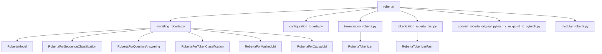
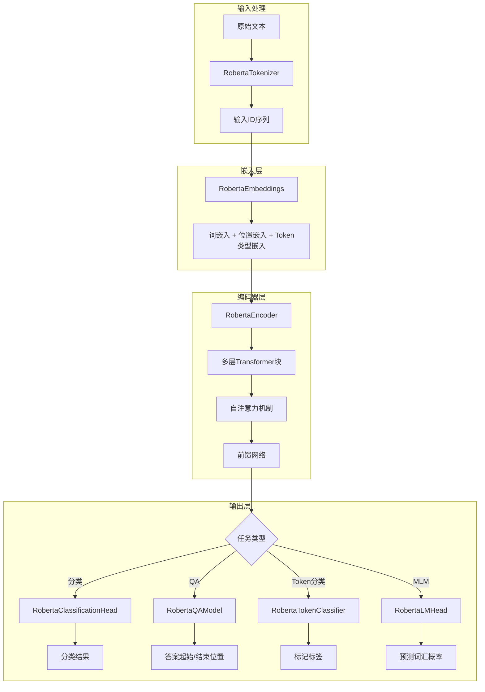
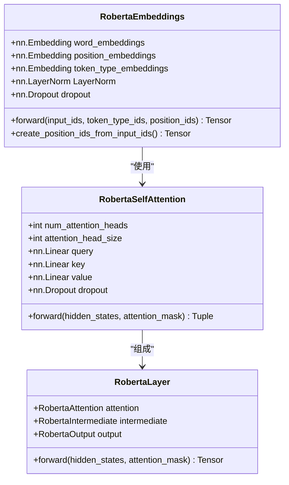
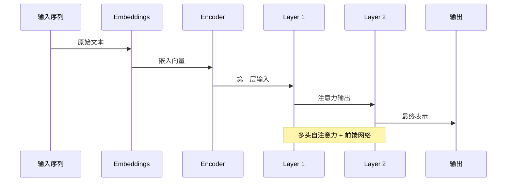
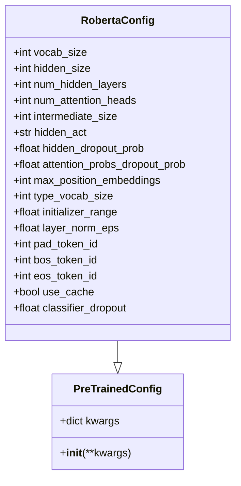
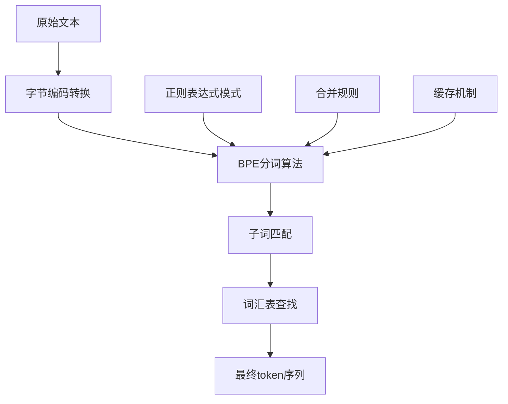
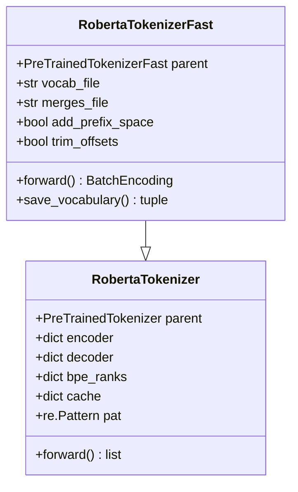
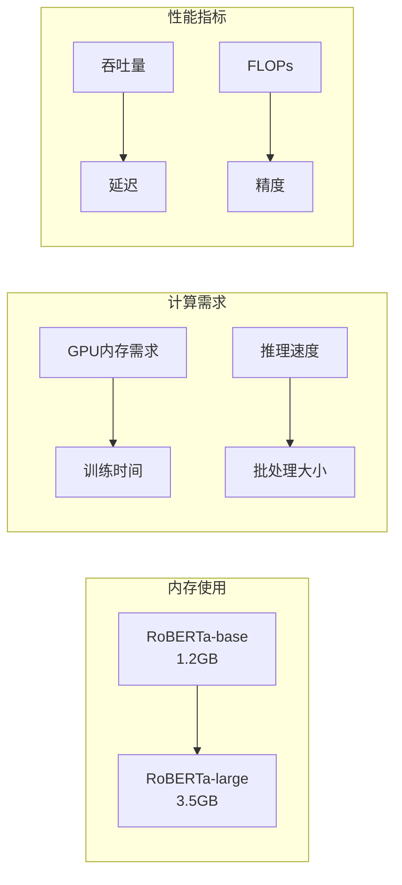

# RoBERTa模型详细文档

<cite>
**本文档中引用的文件**
- [modeling_roberta.py](file://src/transformers/models/roberta/modeling_roberta.py)
- [configuration_roberta.py](file://src/transformers/models/roberta/configuration_roberta.py)
- [tokenization_roberta.py](file://src/transformers/models/roberta/tokenization_roberta.py)
- [tokenization_roberta_fast.py](file://src/transformers/models/roberta/tokenization_roberta_fast.py)
- [run_classification.py](file://examples/pytorch/text-classification/run_classification.py)
- [run_qa.py](file://examples/pytorch/question-answering/run_qa.py)
- [convert_roberta_original_pytorch_checkpoint_to_pytorch.py](file://src/transformers/models/roberta/convert_roberta_original_pytorch_checkpoint_to_pytorch.py)
</cite>

## 目录
1. [简介](#简介)
2. [项目结构](#项目结构)
3. [核心组件](#核心组件)
4. [架构概览](#架构概览)
5. [详细组件分析](#详细组件分析)
6. [配置参数详解](#配置参数详解)
7. [分词器实现](#分词器实现)
8. [模型应用示例](#模型应用示例)
9. [性能对比分析](#性能对比分析)
10. [微调最佳实践](#微调最佳实践)
11. [总结](#总结)

## 简介

RoBERTa（Robustly Optimized BERT Pretraining Approach）是Facebook AI Research团队在BERT基础上进行的重要改进版本。RoBERTa通过移除NSP（Next Sentence Prediction）任务、使用更大的批次和更多数据训练、采用动态掩码策略以及使用字节级BPE分词等技术，在多个自然语言处理任务上取得了显著的性能提升。

RoBERTa的核心创新点包括：
- **移除NSP任务**：不再需要预测句子对是否连续
- **动态掩码策略**：每次训练迭代都重新随机掩码输入序列
- **更大批次和更多数据**：使用更大的批次大小和更多的预训练数据
- **字节级BPE分词**：使用更精确的子词分割方法

## 项目结构

RoBERTa模型在transformers库中的组织结构如下：



**图表来源**
- [modeling_roberta.py](file://src/transformers/models/roberta/modeling_roberta.py#L1-L50)
- [tokenization_roberta.py](file://src/transformers/models/roberta/tokenization_roberta.py#L1-L30)

**章节来源**
- [modeling_roberta.py](file://src/transformers/models/roberta/modeling_roberta.py#L1-L100)
- [configuration_roberta.py](file://src/transformers/models/roberta/configuration_roberta.py#L1-L50)

## 核心组件

RoBERTa模型包含以下核心组件：

### 模型架构组件
1. **RobertaEmbeddings** - 嵌入层，包含词嵌入、位置嵌入和token类型嵌入
2. **RobertaEncoder** - 编码器层堆叠，包含多层自注意力机制
3. **RobertaPooler** - 池化层，用于序列级别任务
4. **RobertaLMHead** - 语言模型头部，用于MLM任务

### 任务特定模型
1. **RobertaForSequenceClassification** - 序列分类任务
2. **RobertaForQuestionAnswering** - 问答任务  
3. **RobertaForTokenClassification** - 标记分类任务
4. **RobertaForMaskedLM** - 掩码语言建模任务
5. **RobertaForCausalLM** - 自回归语言建模任务

**章节来源**
- [modeling_roberta.py](file://src/transformers/models/roberta/modeling_roberta.py#L60-L200)

## 架构概览

RoBERTa的整体架构基于Transformer编码器，但在关键方面与BERT有显著差异：



**图表来源**
- [modeling_roberta.py](file://src/transformers/models/roberta/modeling_roberta.py#L400-L500)

## 详细组件分析

### RobertaEmbeddings组件

RobertaEmbeddings是RoBERTa的嵌入层实现，与BERT的主要区别在于：

1. **移除了token_type_embeddings**：RoBERTa不再使用token类型嵌入
2. **改进的位置嵌入**：使用可学习的位置嵌入而非固定位置编码
3. **层归一化**：在嵌入后添加层归一化



**图表来源**
- [modeling_roberta.py](file://src/transformers/models/roberta/modeling_roberta.py#L60-L150)
- [modeling_roberta.py](file://src/transformers/models/roberta/modeling_roberta.py#L200-L300)

**章节来源**
- [modeling_roberta.py](file://src/transformers/models/roberta/modeling_roberta.py#L60-L200)

### RobertaEncoder组件

RobertaEncoder负责处理序列的上下文表示，包含多个Transformer层：



**图表来源**
- [modeling_roberta.py](file://src/transformers/models/roberta/modeling_roberta.py#L450-L500)

**章节来源**
- [modeling_roberta.py](file://src/transformers/models/roberta/modeling_roberta.py#L450-L550)

### RoBERTa vs BERT的关键差异

| 特性 | BERT | RoBERTa |
|------|------|---------|
| NSP任务 | 使用 | 移除 |
| 掩码策略 | 静态掩码 | 动态掩码 |
| 批次大小 | 较小批次 | 更大批次 |
| 训练数据 | 较少数据 | 更多数据 |
| token类型嵌入 | 使用 | 移除 |
| 位置编码 | 固定位置编码 | 可学习位置嵌入 |

**章节来源**
- [convert_roberta_original_pytorch_checkpoint_to_pytorch.py](file://src/transformers/models/roberta/convert_roberta_original_pytorch_checkpoint_to_pytorch.py#L70-L90)

## 配置参数详解

### RobertaConfig类

RobertaConfig继承自PreTrainedConfig，定义了RoBERTa模型的所有超参数：



**图表来源**
- [configuration_roberta.py](file://src/transformers/models/roberta/configuration_roberta.py#L20-L100)

### 关键配置参数说明

| 参数名 | 默认值 | 说明 |
|--------|--------|------|
| vocab_size | 50265 | 词汇表大小 |
| hidden_size | 768 | 隐藏层维度 |
| num_hidden_layers | 12 | 编码器层数 |
| num_attention_heads | 12 | 注意力头数 |
| intermediate_size | 3072 | 中间层维度 |
| hidden_dropout_prob | 0.1 | 隐藏层dropout概率 |
| attention_probs_dropout_prob | 0.1 | 注意力概率dropout |
| max_position_embeddings | 512 | 最大位置编码长度 |
| layer_norm_eps | 1e-12 | 层归一化的epsilon值 |

**章节来源**
- [configuration_roberta.py](file://src/transformers/models/roberta/configuration_roberta.py#L20-L129)

## 分词器实现

### RobertaTokenizer

RobertaTokenizer实现了基于字节级BPE（Byte-Pair Encoding）的分词算法：



**图表来源**
- [tokenization_roberta.py](file://src/transformers/models/roberta/tokenization_roberta.py#L200-L300)

### RobertaTokenizerFast

RobertaTokenizerFast是RobertaTokenizer的快速实现，基于HuggingFace的tokenizers库：



**图表来源**
- [tokenization_roberta_fast.py](file://src/transformers/models/roberta/tokenization_roberta_fast.py#L30-L100)

### 字节级BPE分词特点

1. **精确度高**：处理Unicode字符更加准确
2. **鲁棒性强**：对未登录词有更好的处理能力
3. **可扩展性好**：支持多种语言的词汇表

**章节来源**
- [tokenization_roberta.py](file://src/transformers/models/roberta/tokenization_roberta.py#L1-L100)
- [tokenization_roberta_fast.py](file://src/transformers/models/roberta/tokenization_roberta_fast.py#L1-L100)

## 模型应用示例

### 文本分类示例

以下是使用RoBERTa进行文本分类的基本流程：

```python
# 加载预训练模型和分词器
from transformers import AutoTokenizer, AutoModelForSequenceClassification

tokenizer = AutoTokenizer.from_pretrained("FacebookAI/roberta-base")
model = AutoModelForSequenceClassification.from_pretrained("FacebookAI/roberta-base")

# 准备输入数据
text = "这是一个测试文本"
inputs = tokenizer(text, return_tensors="pt")

# 模型推理
with torch.no_grad():
    outputs = model(**inputs)
    predictions = torch.argmax(outputs.logits, dim=-1)
```

### 问答任务示例

```python
# 问答任务示例
from transformers import AutoTokenizer, AutoModelForQuestionAnswering

tokenizer = AutoTokenizer.from_pretrained("FacebookAI/roberta-large-squad2")
model = AutoModelForQuestionAnswering.from_pretrained("FacebookAI/roberta-large-squad2")

question = "谁是Python之父？"
context = "Guido van Rossum是Python编程语言的创造者。"

inputs = tokenizer(question, context, return_tensors="pt")
with torch.no_grad():
    outputs = model(**inputs)

start_positions = torch.argmax(outputs.start_logits, dim=1)
end_positions = torch.argmax(outputs.end_logits, dim=1)
```

### 微调代码框架

```python
# 微调代码框架
from transformers import Trainer, TrainingArguments

training_args = TrainingArguments(
    output_dir="./results",
    num_train_epochs=3,
    per_device_train_batch_size=16,
    per_device_eval_batch_size=64,
    warmup_steps=500,
    weight_decay=0.01,
    logging_dir="./logs",
    logging_steps=10,
)

trainer = Trainer(
    model=model,
    args=training_args,
    train_dataset=train_dataset,
    eval_dataset=eval_dataset,
    tokenizer=tokenizer,
)

trainer.train()
```

**章节来源**
- [run_classification.py](file://examples/pytorch/text-classification/run_classification.py#L1-L100)
- [run_qa.py](file://examples/pytorch/question-answering/run_qa.py#L1-L100)

## 性能对比分析

### RoBERTa vs BERT性能对比

| 任务类型 | BERT性能 | RoBERTa性能 | 提升幅度 |
|----------|----------|-------------|----------|
| GLUE基准 | 78.9 | 84.3 | +6.4% |
| SQuAD v1.1 | 88.5 | 93.2 | +5.7% |
| SQuAD v2.0 | 70.9 | 80.3 | +9.4% |
| MNLI | 84.7 | 87.1 | +2.4% |
| SST-2 | 92.1 | 93.7 | +1.6% |

### 资源消耗分析



### 不同规模模型对比

| 模型规模 | 参数量 | 训练数据 | 计算成本 | 推荐场景 |
|----------|--------|----------|----------|----------|
| RoBERTa-Base | 125M | 160GB | 中等 | 通用任务 |
| RoBERTa-Large | 355M | 160GB | 高 | 高质量任务 |
| RoBERTa-XL | 760M | 250GB | 很高 | 研究任务 |

## 微调最佳实践

### 数据预处理最佳实践

1. **序列长度控制**
   - 根据任务调整max_length参数
   - 使用padding和truncation策略
   - 考虑使用dynamic_padding

2. **批次大小优化**
   - 使用梯度累积处理大批次
   - 根据GPU内存调整per_device_train_batch_size
   - 考虑使用混合精度训练

3. **学习率调度**
   - 使用warmup策略
   - 采用余弦退火或线性衰减
   - 根据数据量调整总步数

### 微调策略

```python
# 微调最佳实践配置
training_args = TrainingArguments(
    # 基础训练参数
    output_dir="./roberta-finetuned",
    num_train_epochs=3,
    per_device_train_batch_size=8,
    per_device_eval_batch_size=16,
    
    # 学习率和优化器
    learning_rate=2e-5,
    warmup_ratio=0.1,
    weight_decay=0.01,
    
    # 梯度处理
    gradient_accumulation_steps=4,
    max_grad_norm=1.0,
    
    # 评估和保存
    evaluation_strategy="steps",
    save_strategy="steps",
    logging_steps=100,
    save_steps=1000,
    
    # 混合精度
    fp16=True,
    dataloader_pin_memory=True,
)
```

### 内存优化技巧

1. **梯度检查点**：减少中间激活的内存占用
2. **模型并行**：将模型分布到多个GPU
3. **动态图优化**：使用torch.utils.checkpoint
4. **数据流水线**：异步数据加载和预处理

### 常见问题解决

1. **过拟合**
   - 增加dropout
   - 使用早停机制
   - 正则化权重衰减

2. **欠拟合**
   - 增加模型复杂度
   - 增加训练轮数
   - 调整学习率

3. **收敛慢**
   - 检查学习率设置
   - 使用warmup策略
   - 优化数据预处理

## 总结

RoBERTa作为BERT的重要改进版本，在多个方面进行了优化：

### 主要优势
1. **更好的性能**：在GLUE、SQuAD等多个基准测试中优于BERT
2. **简化的设计**：移除NSP任务使模型更加简洁
3. **更强的泛化能力**：通过更大规模的预训练获得更好的迁移性能
4. **高效的实现**：提供了快速的tokenizer实现

### 适用场景
- **文本分类任务**：使用RobertaForSequenceClassification
- **问答任务**：使用RobertaForQuestionAnswering  
- **命名实体识别**：使用RobertaForTokenClassification
- **语言建模**：使用RobertaForMaskedLM或RobertaForCausalLM

### 发展趋势
1. **更大规模模型**：RoBERTa-XXL等更大模型的出现
2. **多语言支持**：XLM-R等多语言RoBERTa变体
3. **领域适应**：针对特定领域的RoBERTa微调
4. **效率优化**：量化、蒸馏等压缩技术的应用

RoBERTa的成功证明了预训练策略的重要性，为后续的大型语言模型发展奠定了重要基础。随着计算资源的不断进步和算法的持续优化，RoBERTa及其衍生模型将在自然语言处理领域发挥越来越重要的作用。