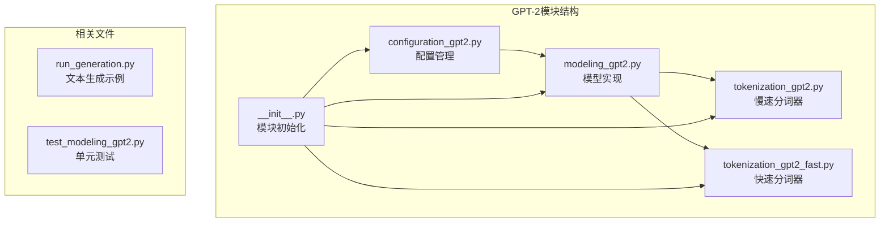
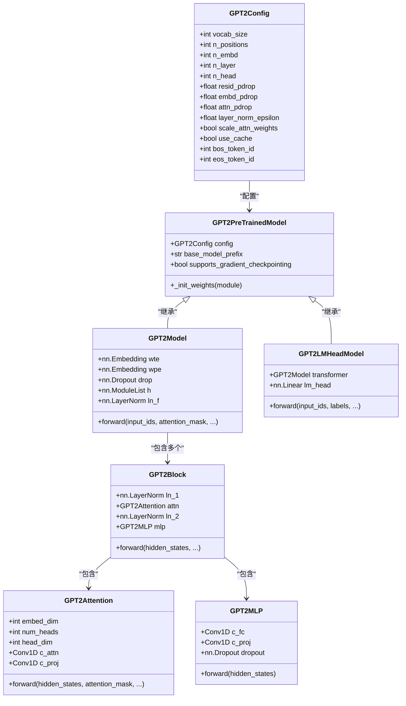
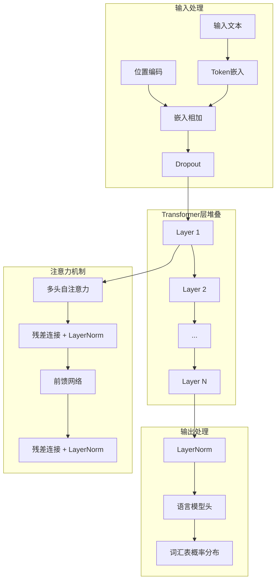
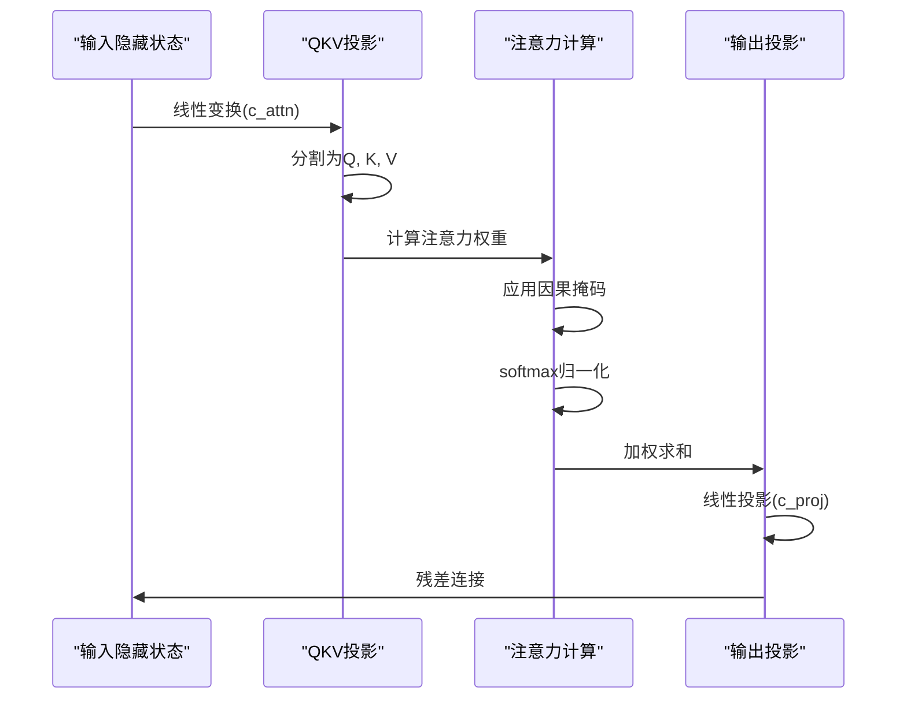
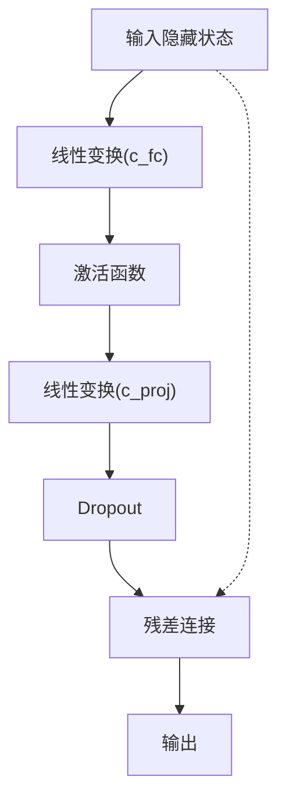
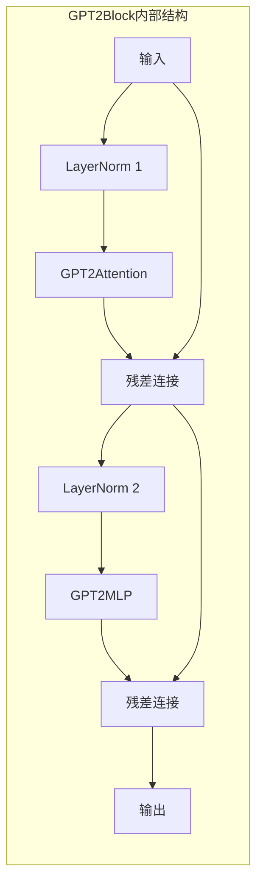
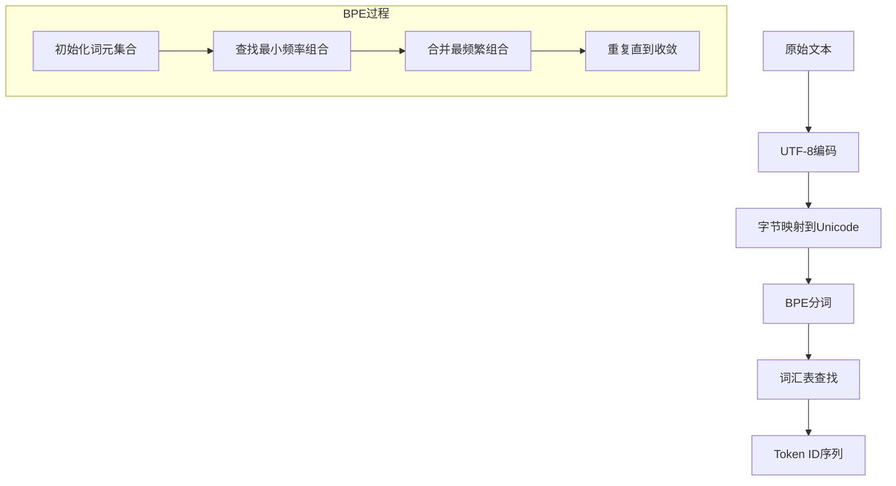
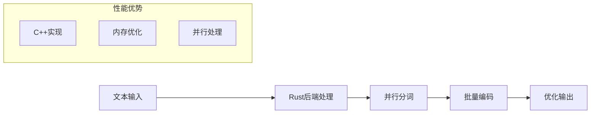

# GPT-2模型

<cite>
**本文档中引用的文件**
- [configuration_gpt2.py](file://src/transformers/models/gpt2/configuration_gpt2.py)
- [modeling_gpt2.py](file://src/transformers/models/gpt2/modeling_gpt2.py)
- [tokenization_gpt2.py](file://src/transformers/models/gpt2/tokenization_gpt2.py)
- [tokenization_gpt2_fast.py](file://src/transformers/models/gpt2/tokenization_gpt2_fast.py)
- [__init__.py](file://src/transformers/models/gpt2/__init__.py)
- [run_generation.py](file://examples/pytorch/text-generation/run_generation.py)
- [test_modeling_gpt2.py](file://tests/models/gpt2/test_modeling_gpt2.py)
</cite>

## 目录
1. [简介](#简介)
2. [项目结构](#项目结构)
3. [核心组件](#核心组件)
4. [架构概览](#架构概览)
5. [详细组件分析](#详细组件分析)
6. [配置参数详解](#配置参数详解)
7. [文本编码与解码](#文本编码与解码)
8. [模型加载与使用](#模型加载与使用)
9. [文本生成示例](#文本生成示例)
10. [性能优化建议](#性能优化建议)
11. [故障排除指南](#故障排除指南)
12. [总结](#总结)

## 简介

GPT-2（Generative Pre-trained Transformer 2）是OpenAI开发的大型语言模型，代表了原始GPT系列的重要发展。作为基于Transformer解码器的单向注意力机制模型，GPT-2在自然语言理解和生成任务上表现出色。本文档将深入分析GPT-2模型的架构设计、配置参数、使用方法以及性能优化技巧。

GPT-2采用了自回归生成原理，通过预测序列中的下一个词来学习语言表示。其核心创新在于大规模预训练和微调策略，使得模型能够在各种下游任务上取得优异表现。

## 项目结构

GPT-2模型在transformers库中的组织结构清晰明确，主要包含以下核心文件：



**图表来源**
- [configuration_gpt2.py](file://src/transformers/models/gpt2/configuration_gpt2.py#L1-L50)
- [modeling_gpt2.py](file://src/transformers/models/gpt2/modeling_gpt2.py#L1-L50)
- [tokenization_gpt2.py](file://src/transformers/models/gpt2/tokenization_gpt2.py#L1-L50)

**章节来源**
- [__init__.py](file://src/transformers/models/gpt2/__init__.py#L1-L31)

## 核心组件

GPT-2模型由以下几个核心组件构成：

### 主要类层次结构



**图表来源**
- [configuration_gpt2.py](file://src/transformers/models/gpt2/configuration_gpt2.py#L25-L188)
- [modeling_gpt2.py](file://src/transformers/models/gpt2/modeling_gpt2.py#L400-L500)
- [modeling_gpt2.py](file://src/transformers/models/gpt2/modeling_gpt2.py#L600-L700)

**章节来源**
- [modeling_gpt2.py](file://src/transformers/models/gpt2/modeling_gpt2.py#L400-L800)

## 架构概览

GPT-2采用基于Transformer的解码器架构，实现了自回归语言建模。其整体架构遵循标准的Transformer解码器设计模式：



**图表来源**
- [modeling_gpt2.py](file://src/transformers/models/gpt2/modeling_gpt2.py#L450-L550)

### 关键特性

1. **单向注意力机制**：GPT-2使用因果掩码，只能看到当前位置之前的上下文
2. **多头自注意力**：每个注意力头独立学习不同的表示子空间
3. **位置编码**：使用可学习的位置嵌入来捕获序列位置信息
4. **残差连接和层归一化**：确保训练稳定性和梯度流动

## 详细组件分析

### GPT2Attention类分析

GPT2Attention实现了多头自注意力机制，是GPT-2的核心组件之一：



**图表来源**
- [modeling_gpt2.py](file://src/transformers/models/gpt2/modeling_gpt2.py#L80-L200)

#### 注意力计算流程

GPT-2的注意力计算包含以下关键步骤：

1. **查询-键-值投影**：使用单个线性层同时计算Q、K、V
2. **因果掩码应用**：确保模型只能访问当前位置之前的信息
3. **缩放注意力权重**：除以√d_k防止梯度消失
4. **dropout正则化**：防止过拟合

**章节来源**
- [modeling_gpt2.py](file://src/transformers/models/gpt2/modeling_gpt2.py#L80-L300)

### GPT2MLP类分析

GPT2MLP实现了Transformer的前馈神经网络：



**图表来源**
- [modeling_gpt2.py](file://src/transformers/models/gpt2/modeling_gpt2.py#L300-L350)

**章节来源**
- [modeling_gpt2.py](file://src/transformers/models/gpt2/modeling_gpt2.py#L300-L350)

### GPT2Block类分析

GPT2Block整合了注意力机制和前馈网络，形成了完整的Transformer解码器块：



**图表来源**
- [modeling_gpt2.py](file://src/transformers/models/gpt2/modeling_gpt2.py#L350-L400)

**章节来源**
- [modeling_gpt2.py](file://src/transformers/models/gpt2/modeling_gpt2.py#L350-L400)

## 配置参数详解

GPT-2的配置系统提供了丰富的参数来控制模型行为和性能。以下是关键配置参数的详细说明：

### 核心架构参数

| 参数名 | 默认值 | 含义 | 对性能的影响 |
|--------|--------|------|-------------|
| `vocab_size` | 50257 | 词汇表大小 | 影响模型表达能力和内存使用 |
| `n_positions` | 1024 | 最大序列长度 | 决定模型能处理的最长文本 |
| `n_embd` | 768 | 嵌入维度 | 控制模型容量和计算复杂度 |
| `n_layer` | 12 | 隐藏层数量 | 影响模型深度和表达能力 |
| `n_head` | 12 | 注意力头数 | 并行处理不同表示子空间 |

### 正则化参数

| 参数名 | 默认值 | 含义 | 调优建议 |
|--------|--------|------|----------|
| `resid_pdrop` | 0.1 | 残差连接dropout率 | 高于0.1可能导致欠拟合 |
| `embd_pdrop` | 0.1 | 嵌入层dropout率 | 用于防止过拟合 |
| `attn_pdrop` | 0.1 | 注意力dropout率 | 保持默认值通常效果最佳 |

### 注意力机制参数

| 参数名 | 默认值 | 含义 | 性能影响 |
|--------|--------|------|----------|
| `scale_attn_weights` | True | 是否缩放注意力权重 | 提高训练稳定性 |
| `scale_attn_by_inverse_layer_idx` | False | 层间注意力缩放 | 可改善深层模型训练 |
| `reorder_and_upcast_attn` | False | 注意力重排序和上溢 | 改善混合精度训练 |

### 特殊token配置

| 参数名 | 默认值 | 含义 | 使用场景 |
|--------|--------|------|----------|
| `bos_token_id` | 50256 | 开始token ID | 文本生成起始标记 |
| `eos_token_id` | 50256 | 结束token ID | 文本生成结束标记 |

**章节来源**
- [configuration_gpt2.py](file://src/transformers/models/gpt2/configuration_gpt2.py#L35-L100)

## 文本编码与解码

GPT-2提供了两种分词器实现：传统的Python实现和基于Rust的快速实现。

### GPT2Tokenizer分析

GPT2Tokenizer基于字节级BPE（Byte-Pair Encoding）算法：



**图表来源**
- [tokenization_gpt2.py](file://src/transformers/models/gpt2/tokenization_gpt2.py#L150-L200)

### 分词器特性

1. **字节级处理**：能够处理任何Unicode字符
2. **空格敏感**：首字符的空格会影响编码结果
3. **特殊token支持**：内置支持开始、结束、未知token
4. **缓存机制**：提高重复token的处理效率

### GPT2TokenizerFast分析

GPT2TokenizerFast基于HuggingFace的tokenizers库，提供更快的处理速度：



**图表来源**
- [tokenization_gpt2_fast.py](file://src/transformers/models/gpt2/tokenization_gpt2_fast.py#L20-L50)

**章节来源**
- [tokenization_gpt2.py](file://src/transformers/models/gpt2/tokenization_gpt2.py#L100-L200)
- [tokenization_gpt2_fast.py](file://src/transformers/models/gpt2/tokenization_gpt2_fast.py#L20-L80)

## 模型加载与使用

### 不同规模模型的加载

GPT-2提供了多种预训练模型规模：

```python
# 基础模型
from transformers import GPT2LMHeadModel, GPT2Tokenizer

# 加载基础模型
model = GPT2LMHeadModel.from_pretrained("openai-community/gpt2")
tokenizer = GPT2Tokenizer.from_pretrained("openai-community/gpt2")

# 加载中等规模模型
model_medium = GPT2LMHeadModel.from_pretrained("openai-community/gpt2-medium")
tokenizer_medium = GPT2Tokenizer.from_pretrained("openai-community/gpt2-medium")

# 加载大规模模型
model_large = GPT2LMHeadModel.from_pretrained("openai-community/gpt2-large")
tokenizer_large = GPT2Tokenizer.from_pretrained("openai-community/gpt2-large")
```

### 自定义配置加载

```python
from transformers import GPT2Config, GPT2LMHeadModel

# 创建自定义配置
config = GPT2Config(
    n_embd=1024,      # 增加嵌入维度
    n_layer=24,       # 增加层数
    n_head=16,        # 增加注意力头
    n_positions=2048  # 增加最大序列长度
)

# 使用自定义配置加载模型
model = GPT2LMHeadModel.from_pretrained("openai-community/gpt2", config=config)
```

### 设备和精度设置

```python
import torch

# 检查GPU可用性
device = torch.device("cuda" if torch.cuda.is_available() else "cpu")

# 加载到指定设备
model = GPT2LMHeadModel.from_pretrained("openai-community/gpt2").to(device)

# 使用混合精度
from torch.cuda.amp import autocast

with autocast():
    outputs = model(input_ids, labels=labels)
```

**章节来源**
- [modeling_gpt2.py](file://src/transformers/models/gpt2/modeling_gpt2.py#L800-L850)

## 文本生成示例

### 基础文本生成

```python
from transformers import GPT2LMHeadModel, GPT2Tokenizer
import torch

# 加载模型和分词器
tokenizer = GPT2Tokenizer.from_pretrained("openai-community/gpt2")
model = GPT2LMHeadModel.from_pretrained("openai-community/gpt2")

# 设置生成参数
prompt = "人工智能的发展"
inputs = tokenizer(prompt, return_tensors="pt")

# 生成文本
with torch.no_grad():
    outputs = model.generate(
        inputs.input_ids,
        max_length=100,
        temperature=0.8,
        top_p=0.9,
        repetition_penalty=1.1,
        num_return_sequences=1,
        pad_token_id=tokenizer.eos_token_id
    )

# 解码生成的文本
generated_text = tokenizer.decode(outputs[0], skip_special_tokens=True)
print(generated_text)
```

### 高级生成配置

```python
from transformers import GPT2LMHeadModel, GPT2Tokenizer, GenerationConfig

# 创建生成配置
generation_config = GenerationConfig(
    max_length=200,
    max_new_tokens=100,
    temperature=0.7,
    top_k=50,
    top_p=0.95,
    repetition_penalty=1.2,
    do_sample=True,
    pad_token_id=tokenizer.eos_token_id,
    eos_token_id=tokenizer.eos_token_id
)

# 使用配置生成
outputs = model.generate(
    inputs.input_ids,
    generation_config=generation_config
)
```

### 批量生成示例

```python
# 批量生成多个候选
prompts = [
    "未来的人工智能会",
    "量子计算的应用前景",
    "气候变化的影响"
]

# 编码所有提示
inputs = tokenizer(prompts, return_tensors="pt", padding=True, truncation=True)

# 批量生成
with torch.no_grad():
    outputs = model.generate(
        inputs.input_ids,
        attention_mask=inputs.attention_mask,
        max_length=150,
        num_return_sequences=2,
        num_beams=3,
        early_stopping=True
    )

# 解码所有生成结果
for i, output in enumerate(outputs):
    generated_text = tokenizer.decode(output, skip_special_tokens=True)
    print(f"Prompt {i+1}: {generated_text}")
```

### 文本补全示例

```python
# 文本补全
partial_text = "机器学习是一种"
inputs = tokenizer(partial_text, return_tensors="pt")

with torch.no_grad():
    outputs = model.generate(
        inputs.input_ids,
        max_length=50,
        num_return_sequences=3,
        temperature=0.9,
        repetition_penalty=1.1
    )

completions = []
for output in outputs:
    completion = tokenizer.decode(output, skip_special_tokens=True)
    completions.append(completion[len(partial_text):])

print("补全结果:")
for i, completion in enumerate(completions, 1):
    print(f"{i}. {completion}")
```

**章节来源**
- [run_generation.py](file://examples/pytorch/text-generation/run_generation.py#L1-L100)

## 性能优化建议

### 内存优化

1. **梯度检查点**：
```python
model.gradient_checkpointing_enable()
```

2. **量化推理**：
```python
from transformers import BitsAndBytesConfig

config = BitsAndBytesConfig(
    load_in_4bit=True,
    bnb_4bit_compute_dtype=torch.float16
)

model = GPT2LMHeadModel.from_pretrained(
    "openai-community/gpt2",
    quantization_config=config
)
```

3. **动态批处理**：
```python
from transformers import DataCollatorWithPadding

data_collator = DataCollatorWithPadding(tokenizer=tokenizer)
# 在数据加载器中使用
```

### 推理加速

1. **KV缓存**：
```python
# 自动启用缓存
model = GPT2LMHeadModel.from_pretrained("openai-community/gpt2", use_cache=True)
```

2. **Flash Attention**：
```python
model = GPT2LMHeadModel.from_pretrained(
    "openai-community/gpt2",
    attn_implementation="flash_attention_2"
)
```

3. **编译优化**：
```python
# 使用TorchCompile
model = torch.compile(model, mode="reduce-overhead")
```

### 批量处理优化

```python
def batch_generate(prompts, model, tokenizer, batch_size=4):
    """高效批量生成"""
    results = []
    
    for i in range(0, len(prompts), batch_size):
        batch_prompts = prompts[i:i+batch_size]
        
        # 批量编码
        inputs = tokenizer(
            batch_prompts,
            return_tensors="pt",
            padding=True,
            truncation=True,
            max_length=512
        ).to(model.device)
        
        # 批量生成
        with torch.no_grad():
            outputs = model.generate(
                inputs.input_ids,
                attention_mask=inputs.attention_mask,
                max_length=100,
                num_return_sequences=1,
                pad_token_id=tokenizer.eos_token_id
            )
        
        # 解码
        batch_results = tokenizer.batch_decode(outputs, skip_special_tokens=True)
        results.extend(batch_results)
    
    return results
```

## 故障排除指南

### 常见问题及解决方案

#### 1. 内存不足错误

**问题**：CUDA out of memory
**解决方案**：
```python
# 减少批次大小
batch_size = 1

# 启用梯度检查点
model.gradient_checkpointing_enable()

# 使用CPU卸载
model = GPT2LMHeadModel.from_pretrained(
    "openai-community/gpt2",
    device_map="auto",
    offload_folder="./offload"
)
```

#### 2. 生成质量不佳

**问题**：生成文本重复或质量低
**解决方案**：
```python
# 调整温度参数
temperature = 0.8  # 降低温度减少重复

# 使用top-k采样
top_k = 50

# 使用top-p采样
top_p = 0.9

# 设置重复惩罚
repetition_penalty = 1.2
```

#### 3. 序列长度限制

**问题**：输入超过最大长度限制
**解决方案**：
```python
# 增加最大序列长度
config = GPT2Config.from_pretrained("openai-community/gpt2")
config.n_positions = 2048  # 增加到2048
model = GPT2LMHeadModel.from_pretrained("openai-community/gpt2", config=config)

# 或者截断输入
max_length = 1024
inputs = tokenizer(text, return_tensors="pt", truncation=True, max_length=max_length)
```

#### 4. 分词器不匹配

**问题**：分词器和模型不兼容
**解决方案**：
```python
# 确保使用相同的分词器
tokenizer = GPT2Tokenizer.from_pretrained("openai-community/gpt2")
# 不要混用不同版本的分词器
```

### 调试技巧

1. **检查输入格式**：
```python
print("Input IDs shape:", inputs.input_ids.shape)
print("Attention mask sum:", inputs.attention_mask.sum())
```

2. **监控生成过程**：
```python
from transformers import LogitsProcessorList, TemperatureLogitsProcessor

# 添加调试日志
logits_processor = LogitsProcessorList([
    TemperatureLogitsProcessor(0.8)
])

outputs = model.generate(
    inputs.input_ids,
    logits_processor=logits_processor,
    return_dict_in_generate=True,
    output_scores=True
)
```

3. **验证输出质量**：
```python
def evaluate_generation_quality(text):
    """评估生成文本的质量指标"""
    words = text.split()
    avg_word_length = sum(len(word) for word in words) / len(words)
    unique_words = len(set(words))
    diversity = unique_words / len(words)
    
    return {
        "avg_word_length": avg_word_length,
        "word_diversity": diversity,
        "total_words": len(words)
    }
```

**章节来源**
- [test_modeling_gpt2.py](file://tests/models/gpt2/test_modeling_gpt2.py#L1-L100)

## 总结

GPT-2作为自然语言处理领域的重要里程碑，其精心设计的架构和丰富的功能使其成为各种NLP任务的理想选择。通过本文档的深入分析，我们了解了：

### 核心优势

1. **强大的语言理解能力**：基于大规模预训练的丰富语义表示
2. **灵活的架构设计**：可配置的模型规模和参数设置
3. **高效的推理性能**：支持多种优化技术和硬件加速
4. **广泛的适用性**：从文本生成到代码补全等多种应用场景

### 最佳实践要点

1. **合理选择模型规模**：根据任务需求和资源限制选择合适的模型大小
2. **优化生成参数**：通过调整温度、top-k、top-p等参数获得最佳生成效果
3. **内存管理**：使用梯度检查点、量化等技术优化内存使用
4. **批量处理**：实现高效的批量生成以提高吞吐量

### 发展趋势

随着技术的进步，GPT-2系列模型将继续演进，在保持其核心优势的同时，进一步提升性能和效率。对于开发者而言，掌握GPT-2的使用技巧和优化方法，将有助于在实际项目中充分发挥其潜力。

通过本文档提供的详细指导和实用示例，无论是初学者还是高级用户，都能够有效地使用GPT-2模型解决实际问题，并在性能和效果之间找到最佳平衡点。