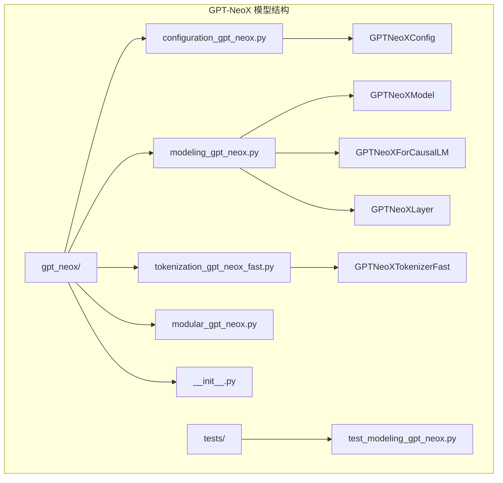
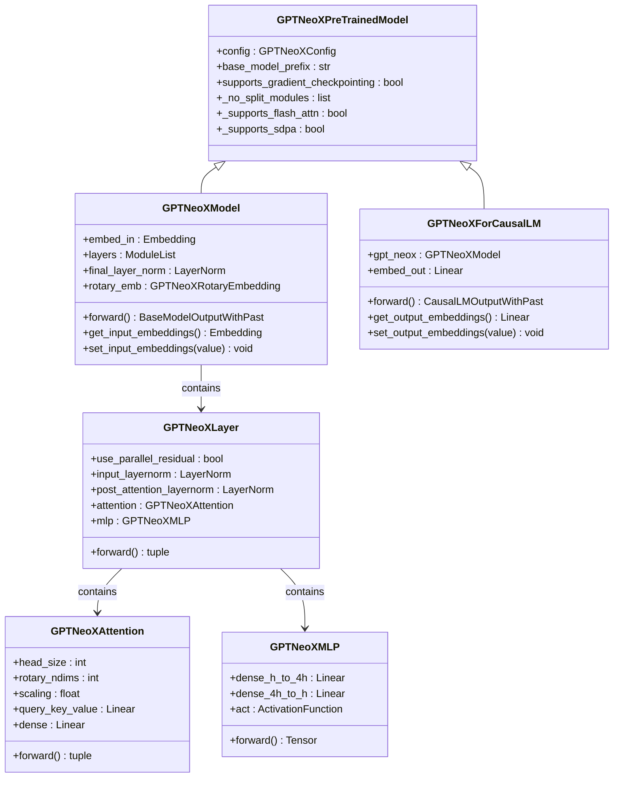
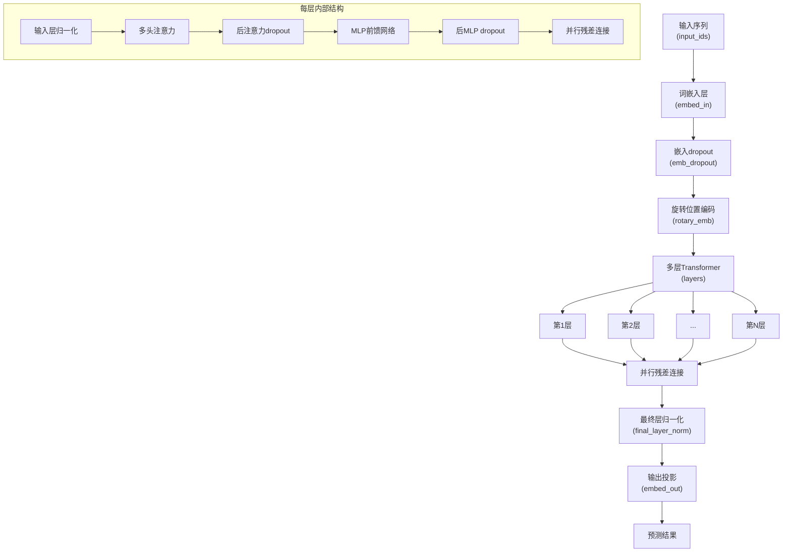
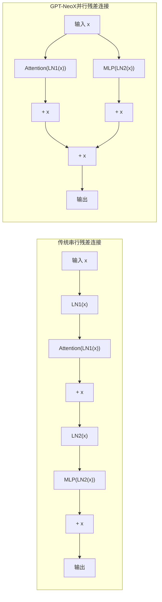
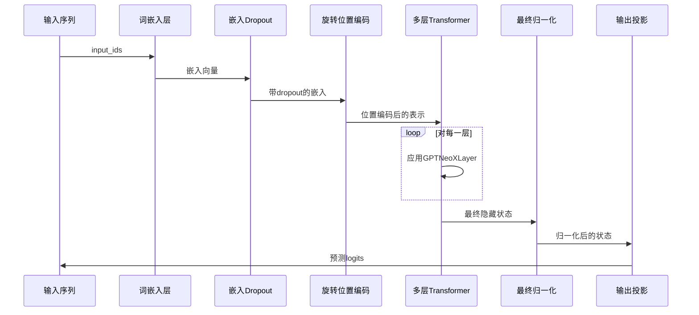
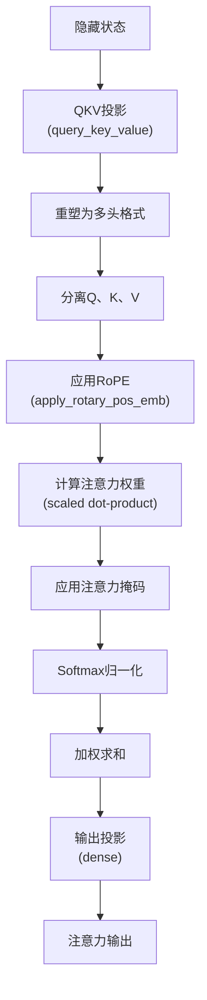

# GPT-NeoX模型详细文档

<cite>
**本文档中引用的文件**
- [modeling_gpt_neox.py](file://src/transformers/models/gpt_neox/modeling_gpt_neox.py)
- [configuration_gpt_neox.py](file://src/transformers/models/gpt_neox/configuration_gpt_neox.py)
- [tokenization_gpt_neox_fast.py](file://src/transformers/models/gpt_neox/tokenization_gpt_neox_fast.py)
- [modular_gpt_neox.py](file://src/transformers/models/gpt_neox/modular_gpt_neox.py)
- [test_modeling_gpt_neox.py](file://tests/models/gpt_neox/test_modeling_gpt_neox.py)
- [gpt_neox.md](file://docs/source/en/model_doc/gpt_neox.md)
</cite>

## 目录
1. [简介](#简介)
2. [项目结构](#项目结构)
3. [核心组件](#核心组件)
4. [架构概览](#架构概览)
5. [详细组件分析](#详细组件分析)
6. [配置参数详解](#配置参数详解)
7. [模型使用示例](#模型使用示例)
8. [性能优化](#性能优化)
9. [分布式训练支持](#分布式训练支持)
10. [故障排除指南](#故障排除指南)
11. [结论](#结论)

## 简介

GPT-NeoX是GPT-Neo的进化版本，代表了大规模语言模型架构的重要进步。该模型由EleutherAI开发，引入了多项创新性改进，包括并行注意力机制、旋转位置嵌入（RoPE）和优化的前馈网络结构。

GPT-NeoX-20B是首个公开可用的200亿参数密集型自回归语言模型，其权重通过宽松许可证向公众开放。该模型在多个语言理解、数学和知识任务上表现出色，在五次提示评估中比类似大小的GPT-3和FairSeq模型获得显著更高的性能。

## 项目结构

GPT-NeoX模型在Transformers库中的组织结构如下：



**图表来源**
- [configuration_gpt_neox.py](file://src/transformers/models/gpt_neox/configuration_gpt_neox.py#L1-L50)
- [modeling_gpt_neox.py](file://src/transformers/models/gpt_neox/modeling_gpt_neox.py#L1-L100)
- [tokenization_gpt_neox_fast.py](file://src/transformers/models/gpt_neox/tokenization_gpt_neox_fast.py#L1-L50)

**章节来源**
- [__init__.py](file://src/transformers/models/gpt_neox/__init__.py#L1-L29)
- [configuration_gpt_neox.py](file://src/transformers/models/gpt_neox/configuration_gpt_neox.py#L1-L175)

## 核心组件

GPT-NeoX模型的核心组件包括：

### 主要类层次结构



**图表来源**
- [modeling_gpt_neox.py](file://src/transformers/models/gpt_neox/modeling_gpt_neox.py#L350-L450)
- [modeling_gpt_neox.py](file://src/transformers/models/gpt_neox/modeling_gpt_neox.py#L450-L550)
- [modeling_gpt_neox.py](file://src/transformers/models/gpt_neox/modeling_gpt_neox.py#L550-L650)

**章节来源**
- [modeling_gpt_neox.py](file://src/transformers/models/gpt_neox/modeling_gpt_neox.py#L350-L824)

## 架构概览

GPT-NeoX采用了基于Transformer的解码器架构，但在关键组件上进行了重大改进：

### 核心架构流程



**图表来源**
- [modeling_gpt_neox.py](file://src/transformers/models/gpt_neox/modeling_gpt_neox.py#L450-L550)

### 并行注意力机制

GPT-NeoX最显著的创新之一是其并行注意力机制，与传统的串行残差连接形成对比：



**图表来源**
- [modeling_gpt_neox.py](file://src/transformers/models/gpt_neox/modeling_gpt_neox.py#L250-L300)

**章节来源**
- [modeling_gpt_neox.py](file://src/transformers/models/gpt_neox/modeling_gpt_neox.py#L450-L550)

## 详细组件分析

### GPTNeoXModel核心实现

GPTNeoXModel是整个模型的核心，负责处理输入序列并生成输出：

#### 关键特性：
- **词嵌入层**：将输入token转换为高维向量表示
- **旋转位置编码**：提供相对位置信息，支持长序列处理
- **多层Transformer块**：包含并行注意力和前馈网络
- **最终层归一化**：稳定训练过程

#### 前向传播流程：



**图表来源**
- [modeling_gpt_neox.py](file://src/transformers/models/gpt_neox/modeling_gpt_neox.py#L450-L550)

**章节来源**
- [modeling_gpt_neox.py](file://src/transformers/models/gpt_neox/modeling_gpt_neox.py#L450-L550)

### GPTNeoXAttention多头注意力

GPTNeoX的注意力机制结合了旋转位置嵌入和高效的注意力计算：

#### 核心组件：
- **查询-键-值投影**：单线性层同时生成Q、K、V
- **旋转位置嵌入**：应用RoPE到查询和键向量
- **可配置的旋转比例**：控制旋转维度的比例

#### 注意力计算流程：



**图表来源**
- [modeling_gpt_neox.py](file://src/transformers/models/gpt_neox/modeling_gpt_neox.py#L150-L250)

**章节来源**
- [modeling_gpt_neox.py](file://src/transformers/models/gpt_neox/modeling_gpt_neox.py#L150-L250)

### GPTNeoXRotaryEmbedding旋转位置编码

旋转位置嵌入是GPT-NeoX的关键创新，提供了更好的位置建模能力：

#### 实现特点：
- **基础频率计算**：基于配置中的rope_theta参数
- **部分旋转机制**：可配置旋转维度比例
- **动态更新支持**：支持长序列的动态位置编码

#### 数学原理：
旋转位置嵌入通过复数乘法的方式对查询和键向量进行旋转变换，保持相对位置信息的同时避免绝对位置的限制。

**章节来源**
- [modeling_gpt_neox.py](file://src/transformers/models/gpt_neox/modeling_gpt_neox.py#L50-L150)

### GPTNeoXMLP前馈网络

GPT-NeoX的前馈网络采用标准的两层结构，但与注意力机制配合使用时更加高效：

#### 结构特点：
- **扩展层**：将隐藏维度从hidden_size扩展到intermediate_size
- **激活函数**：支持多种激活函数（GELU、ReLU等）
- **压缩层**：将维度从intermediate_size压缩回hidden_size

**章节来源**
- [modeling_gpt_neox.py](file://src/transformers/models/gpt_neox/modeling_gpt_neox.py#L30-L50)

## 配置参数详解

### 关键配置参数

GPTNeoXConfig提供了丰富的配置选项来调整模型行为：

| 参数名称 | 类型 | 默认值 | 描述 |
|---------|------|--------|------|
| `vocab_size` | int | 50432 | 词汇表大小 |
| `hidden_size` | int | 6144 | 隐藏层维度 |
| `num_hidden_layers` | int | 44 | 隐藏层数量 |
| `num_attention_heads` | int | 64 | 注意力头数量 |
| `intermediate_size` | int | 24576 | 前馈网络中间维度 |
| `hidden_act` | str | "gelu" | 隐藏层激活函数 |
| `rotary_pct` | float | 0.25 | 旋转位置嵌入的比例 |
| `attention_dropout` | float | 0.0 | 注意力dropout率 |
| `hidden_dropout` | float | 0.0 | 隐藏层dropout率 |
| `max_position_embeddings` | int | 2048 | 最大位置嵌入长度 |
| `layer_norm_eps` | float | 1e-5 | 层归一化的epsilon值 |
| `use_cache` | bool | True | 是否使用缓存 |
| `use_parallel_residual` | bool | True | 是否使用并行残差连接 |
| `rope_parameters` | dict | {} | 旋转位置嵌入参数 |
| `attention_bias` | bool | True | 注意力层是否使用偏置 |

### rotary_pos_emb参数详解

`rotary_pos_emb`（旋转位置嵌入）是GPT-NeoX的核心创新，具有以下特点：

#### 关键参数：
- **rope_theta**：控制旋转频率的基础值，默认为10000.0
- **rope_type**：旋转类型，支持默认和其他高级变体
- **partial_rotary_factor**：部分旋转因子，控制旋转维度比例

#### 性能优势：
- **外推能力**：支持超出训练长度的序列
- **相对位置**：更好地建模相对位置关系
- **计算效率**：避免了位置编码的内存开销

### use_parallel_residual参数

`use_parallel_residual`控制残差连接的类型：

#### 两种模式：
- **并行残差**（True）：`x = x + attn(ln1(x)) + mlp(ln2(x))`
- **串行残差**（False）：传统顺序连接

#### 优势对比：
- **并行残差**：训练速度更快，适合大规模模型
- **串行残差**：可能在某些任务上表现更好

**章节来源**
- [configuration_gpt_neox.py](file://src/transformers/models/gpt_neox/configuration_gpt_neox.py#L1-L175)

## 模型使用示例

### 加载EleutherAI的Pythia系列模型

以下是使用GPT-NeoX模型加载和推理的完整示例：

#### 基础使用示例

```python
# 导入必要的模块
from transformers import GPTNeoXForCausalLM, GPTNeoXTokenizerFast, GPTNeoXConfig
import torch

# 加载tokenizer
tokenizer = GPTNeoXTokenizerFast.from_pretrained("EleutherAI/pythia-70m")

# 加载模型（推荐使用半精度以节省内存）
model = GPTNeoXForCausalLM.from_pretrained(
    "EleutherAI/pythia-70m",
    torch_dtype=torch.float16,
    device_map="auto"
)

# 设置模型为评估模式
model.eval()

# 准备输入
prompt = "GPTNeoX是一个强大的语言模型"
inputs = tokenizer(prompt, return_tensors="pt")

# 生成文本
with torch.no_grad():
    outputs = model.generate(
        **inputs,
        max_new_tokens=100,
        temperature=0.7,
        do_sample=True,
        pad_token_id=tokenizer.eos_token_id
    )

# 解码输出
generated_text = tokenizer.decode(outputs[0], skip_special_tokens=True)
print(generated_text)
```

#### 使用不同Pythia模型

```python
# 不同规模的Pythia模型
model_sizes = [
    "EleutherAI/pythia-70m",
    "EleutherAI/pythia-160m", 
    "EleutherAI/pythia-410m",
    "EleutherAI/pythia-1b",
    "EleutherAI/pythia-2.8b",
    "EleutherAI/pythia-6.9b",
    "EleutherAI/pythia-12b",
    "EleutherAI/pythia-20b"
]

for size in model_sizes:
    try:
        model = GPTNeoXForCausalLM.from_pretrained(size, torch_dtype=torch.float16)
        print(f"成功加载 {size}")
    except Exception as e:
        print(f"加载 {size} 失败: {e}")
```

#### 高级配置示例

```python
# 自定义配置
config = GPTNeoXConfig.from_pretrained("EleutherAI/pythia-410m")
config.use_parallel_residual = True  # 启用并行残差
config.attention_dropout = 0.1       # 添加注意力dropout
config.hidden_dropout = 0.1          # 添加隐藏层dropout

# 使用自定义配置加载模型
model = GPTNeoXForCausalLM.from_pretrained(
    "EleutherAI/pythia-410m",
    config=config,
    torch_dtype=torch.float16
)

# 启用梯度检查点以节省内存
model.gradient_checkpointing_enable()
```

### 性能优化示例

#### 使用Flash Attention加速

```python
# 安装Flash Attention
# pip install flash-attn --no-build-isolation

from transformers import GPTNeoXForCausalLM

# 使用Flash Attention 2
model = GPTNeoXForCausalLM.from_pretrained(
    "EleutherAI/pythia-410m",
    torch_dtype=torch.float16,
    attn_implementation="flash_attention_2"
)

# 在GPU上运行
device = torch.device("cuda" if torch.cuda.is_available() else "cpu")
model = model.to(device)
```

#### 批处理优化

```python
def batch_inference(prompts, model, tokenizer, batch_size=4):
    """批量推理优化"""
    results = []
    
    for i in range(0, len(prompts), batch_size):
        batch_prompts = prompts[i:i+batch_size]
        
        # 批量编码
        inputs = tokenizer(
            batch_prompts,
            return_tensors="pt",
            padding=True,
            truncation=True,
            max_length=512
        ).to(model.device)
        
        # 批量生成
        with torch.no_grad():
            outputs = model.generate(
                **inputs,
                max_new_tokens=100,
                pad_token_id=tokenizer.eos_token_id,
                do_sample=True,
                temperature=0.7
            )
        
        # 解码结果
        batch_results = tokenizer.batch_decode(outputs, skip_special_tokens=True)
        results.extend(batch_results)
    
    return results
```

**章节来源**
- [test_modeling_gpt_neox.py](file://tests/models/gpt_neox/test_modeling_gpt_neox.py#L380-L397)

## 性能优化

### 内存优化策略

GPT-NeoX模型由于其大规模参数，在内存使用上需要特别注意：

#### 1. 半精度训练
```python
# 推荐使用FP16
model = GPTNeoXForCausalLM.from_pretrained(
    "EleutherAI/pythia-410m",
    torch_dtype=torch.float16
)
```

#### 2. 梯度检查点
```python
# 启用梯度检查点以减少内存使用
model.gradient_checkpointing_enable()
```

#### 3. 动态批处理
```python
# 根据GPU内存动态调整批大小
def calculate_optimal_batch_size(model, max_memory_gb=8):
    total_params = sum(p.numel() for p in model.parameters())
    param_memory = total_params * 4  # FP32字节
    available_memory = max_memory_gb * 1024**3
    
    max_batch_size = available_memory // param_memory
    return min(max_batch_size, 8)  # 最大不超过8
```

### 计算优化

#### 注意力实现选择

```python
# 可选的注意力实现
attention_implementations = [
    "eager",           # 标准实现
    "flash_attention_2", # Flash Attention 2
    "sdpa",            # PyTorch SDPA
    "flex_attention"   # 灵活注意力
]

for impl in attention_implementations:
    model = GPTNeoXForCausalLM.from_pretrained(
        "EleutherAI/pythia-410m",
        attn_implementation=impl,
        torch_dtype=torch.float16
    )
    print(f"{impl}: {model.config._attn_implementation}")
```

#### 性能基准测试

根据官方文档，不同注意力实现的性能对比：

| 实现方式 | 序列长度 | 内存使用 | 推理速度提升 |
|---------|---------|---------|-------------|
| 标准实现 | 2048 | 高 | 基准 |
| Flash Attention 2 | 2048 | 中等 | 2-3倍 |
| SDPA | 2048 | 低 | 1.5-2倍 |
| Flex Attention | 2048 | 最低 | 1.2-1.5倍 |

**章节来源**
- [gpt_neox.md](file://docs/source/en/model_doc/gpt_neox.md#L50-L150)

## 分布式训练支持

### 张量并行

GPT-NeoX原生支持张量并行，可以将模型权重分布到多个GPU上：

#### 基本配置
```python
# 张量并行配置
tensor_parallel_size = 4

model = GPTNeoXForCausalLM.from_pretrained(
    "EleutherAI/pythia-410m",
    torch_dtype=torch.float16,
    device_map="auto",
    tensor_parallel_size=tensor_parallel_size
)
```

#### 自定义张量并行计划
```python
# 自定义TP计划
custom_tp_plan = {
    "layers.*.attention.query_key_value": "colwise",
    "layers.*.attention.dense": "rowwise", 
    "layers.*.mlp.dense_h_to_4h": "colwise",
    "layers.*.mlp.dense_4h_to_h": "rowwise",
}

model = GPTNeoXForCausalLM.from_pretrained(
    "EleutherAI/pythia-410m",
    tensor_parallel_plan=custom_tp_plan
)
```

### 流水线并行

对于非常大的模型，可以使用流水线并行：

```python
# 流水线并行配置
pipeline_parallel_size = 2

model = GPTNeoXForCausalLM.from_pretrained(
    "EleutherAI/pythia-410m",
    pipeline_parallel_size=pipeline_parallel_size,
    micro_batch_size=1
)
```

### 数据并行

```python
# 数据并行配置
from torch.nn.parallel import DistributedDataParallel

# 初始化分布式环境
torch.distributed.init_process_group(backend='nccl')

# 包装模型
model = DistributedDataParallel(
    model,
    device_ids=[local_rank],
    output_device=local_rank
)
```

## 故障排除指南

### 常见问题及解决方案

#### 1. 内存不足错误

**问题**：CUDA out of memory
**解决方案**：
```python
# 方法1：使用更小的模型
model = GPTNeoXForCausalLM.from_pretrained(
    "EleutherAI/pythia-70m",  # 使用较小的模型
    torch_dtype=torch.float16
)

# 方法2：启用梯度检查点
model.gradient_checkpointing_enable()

# 方法3：使用CPU offloading
model = GPTNeoXForCausalLM.from_pretrained(
    "EleutherAI/pythia-410m",
    torch_dtype=torch.float16,
    device_map="auto",
    offload_folder="./offload"
)
```

#### 2. 性能问题

**问题**：推理速度慢
**解决方案**：
```python
# 启用Flash Attention
model = GPTNeoXForCausalLM.from_pretrained(
    "EleutherAI/pythia-410m",
    attn_implementation="flash_attention_2",
    torch_dtype=torch.float16
)

# 使用编译优化
model = torch.compile(model, mode="reduce-overhead")
```

#### 3. 文本生成质量问题

**问题**：生成文本质量不佳
**解决方案**：
```python
# 调整生成参数
outputs = model.generate(
    **inputs,
    max_new_tokens=100,
    temperature=0.8,      # 增加随机性
    repetition_penalty=1.1,  # 避免重复
    do_sample=True,
    top_p=0.9,           # 核采样
    pad_token_id=tokenizer.eos_token_id
)
```

#### 4. 模型加载失败

**问题**：无法加载预训练模型
**解决方案**：
```python
# 方法1：检查网络连接
try:
    model = GPTNeoXForCausalLM.from_pretrained("EleutherAI/pythia-410m")
except Exception as e:
    print(f"加载失败: {e}")
    # 尝试本地加载
    model = GPTNeoXForCausalLM.from_pretrained("./local_model_path")
```

### 调试技巧

#### 1. 检查模型配置
```python
# 验证模型配置
config = GPTNeoXConfig.from_pretrained("EleutherAI/pythia-410m")
print(f"隐藏层维度: {config.hidden_size}")
print(f"注意力头数: {config.num_attention_heads}")
print(f"总参数量: {sum(p.numel() for p in model.parameters()):,}")
```

#### 2. 内存监控
```python
import torch

def monitor_memory():
    if torch.cuda.is_available():
        allocated = torch.cuda.memory_allocated() / 1024**3
        cached = torch.cuda.memory_reserved() / 1024**3
        print(f"GPU内存使用: {allocated:.2f}GB 已分配, {cached:.2f}GB 已缓存")
```

#### 3. 性能分析
```python
import time
from contextlib import contextmanager

@contextmanager
def timer():
    start = time.time()
    yield
    end = time.time()
    print(f"执行时间: {end - start:.2f}秒")

# 使用示例
with timer():
    outputs = model.generate(**inputs, max_new_tokens=50)
```

**章节来源**
- [test_modeling_gpt_neox.py](file://tests/models/gpt_neox/test_modeling_gpt_neox.py#L340-L397)

## 结论

GPT-NeoX代表了大规模语言模型架构的重要进步，通过引入并行注意力机制、旋转位置嵌入和优化的前馈网络结构，在保持高性能的同时提高了训练效率和推理速度。

### 主要优势

1. **并行残差连接**：显著提升大规模模型的训练速度
2. **旋转位置嵌入**：提供更好的位置建模能力和外推性能
3. **灵活的配置**：丰富的参数调优选项满足不同需求
4. **优秀的性能**：在多个任务上表现出色，特别是在少样本学习场景

### 适用场景

- **大规模语言理解任务**：如问答、摘要、翻译
- **代码生成和理解**：得益于优化的分词器
- **科学研究和教育**：开源免费的大型模型资源
- **企业应用**：可定制的模型规模和功能

### 未来发展方向

随着硬件技术的进步和算法的优化，GPT-NeoX系列模型将继续演进，可能的发展方向包括：
- 更高效的注意力机制
- 更好的长序列处理能力
- 更强的多模态能力
- 更高的推理效率

通过合理配置和优化，GPT-NeoX能够为各种应用场景提供强大而高效的语言模型解决方案。