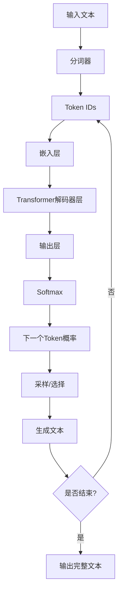
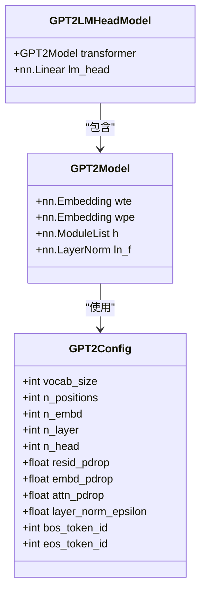
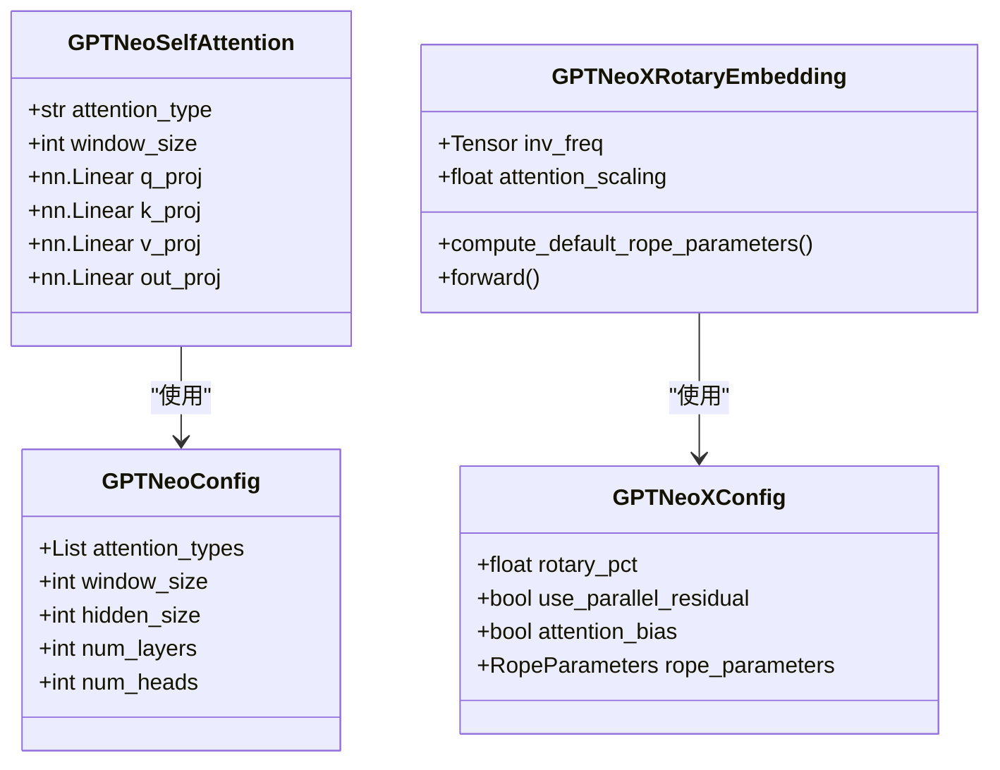
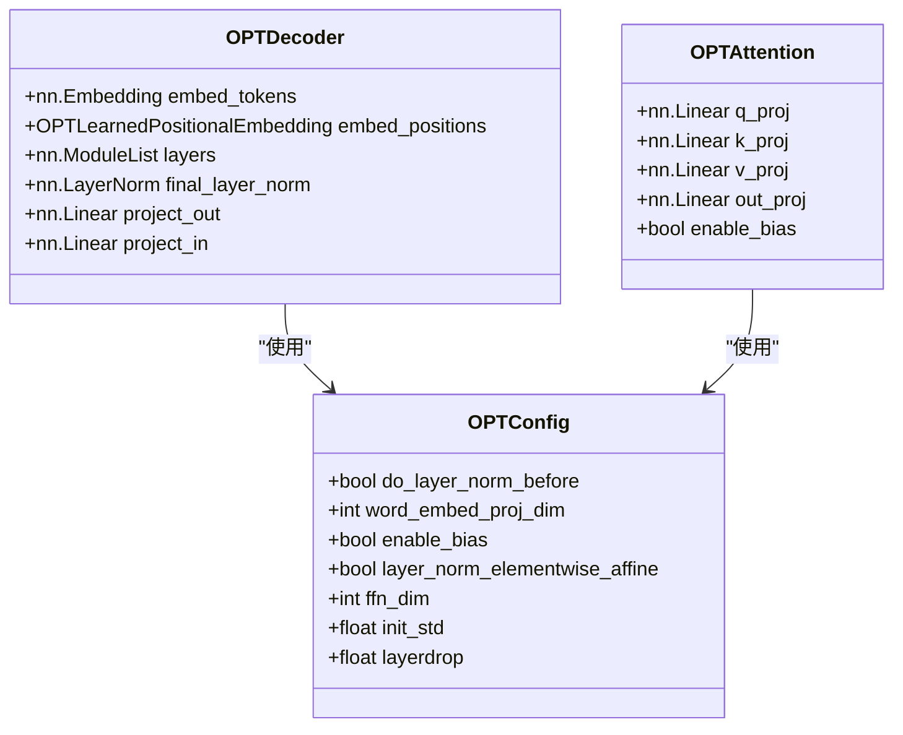
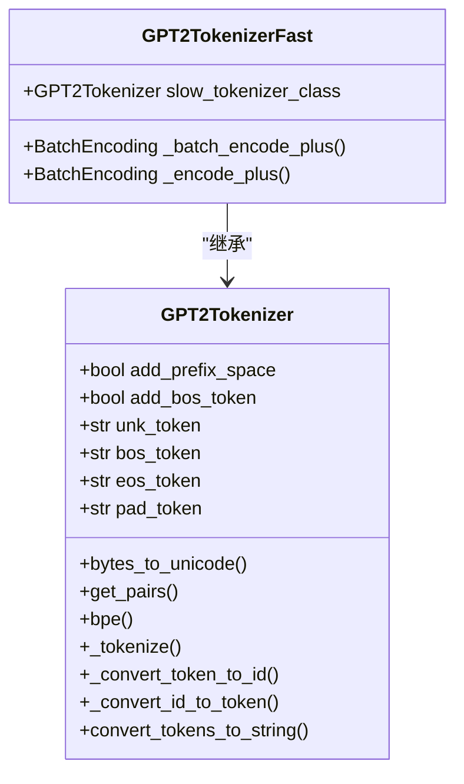
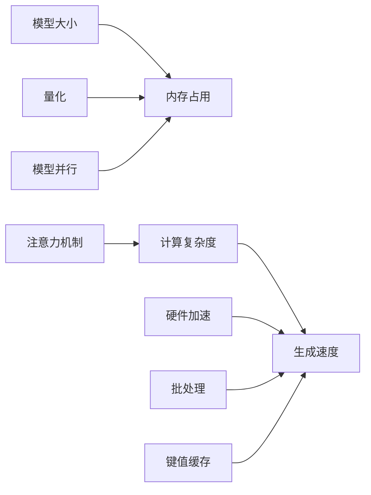

# GPT系列模型

<cite>
**本文档中引用的文件**  
- [configuration_gpt2.py](file://src/transformers/models/gpt2/configuration_gpt2.py)
- [configuration_gpt_neo.py](file://src/transformers/models/gpt_neo/configuration_gpt_neo.py)
- [configuration_gpt_neox.py](file://src/transformers/models/gpt_neox/configuration_gpt_neox.py)
- [configuration_opt.py](file://src/transformers/models/opt/configuration_opt.py)
- [modeling_gpt2.py](file://src/transformers/models/gpt2/modeling_gpt2.py)
- [modeling_gpt_neo.py](file://src/transformers/models/gpt_neo/modeling_gpt_neo.py)
- [modeling_gpt_neox.py](file://src/transformers/models/gpt_neox/modeling_gpt_neox.py)
- [modeling_opt.py](file://src/transformers/models/opt/modeling_opt.py)
- [tokenization_gpt2.py](file://src/transformers/models/gpt2/tokenization_gpt2.py)
- [tokenization_gpt2_fast.py](file://src/transformers/models/gpt2/tokenization_gpt2_fast.py)
- [run_generation.py](file://examples/pytorch/text-generation/run_generation.py)
</cite>

## 目录
1. [引言](#引言)
2. [GPT模型架构原理](#gpt模型架构原理)
3. [GPT-2模型详解](#gpt-2模型详解)
4. [GPT-Neo与GPT-NeoX架构改进](#gpt-neo与gpt-neox架构改进)
5. [OPT模型设计特点](#opt模型设计特点)
6. [模型配置参数详解](#模型配置参数详解)
7. [分词器使用方法](#分词器使用方法)
8. [文本生成代码示例](#文本生成代码示例)
9. [模型性能对比](#模型性能对比)
10. [应用场景与模型选择建议](#应用场景与模型选择建议)

## 引言
GPT（Generative Pre-trained Transformer）系列模型是基于Transformer解码器的自回归语言模型，通过大规模预训练在各种自然语言处理任务中表现出色。本文档将详细介绍GPT-2、GPT-Neo、GPT-NeoX和OPT等模型的架构原理、实现细节和使用方法。

## GPT模型架构原理
GPT系列模型基于Transformer解码器架构，采用单向注意力机制实现自回归文本生成。模型通过从左到右的顺序预测下一个token，利用掩码机制确保每个位置只能关注其左侧的上下文。

自回归生成过程的核心是：给定已生成的文本序列，模型预测下一个最可能的token，然后将该token添加到序列中，重复此过程直到生成完整文本或达到停止条件。



**图源**  
- [modeling_gpt2.py](file://src/transformers/models/gpt2/modeling_gpt2.py#L0-L200)
- [modeling_gpt_neo.py](file://src/transformers/models/gpt_neo/modeling_gpt_neo.py#L0-L200)

## GPT-2模型详解
GPT-2是OpenAI开发的基于Transformer解码器的语言模型，具有以下特点：

- **单向注意力机制**：使用因果掩码确保每个位置只能关注其左侧的上下文
- **预训练任务**：通过语言建模任务进行预训练，预测下一个token
- **架构参数**：包含vocab_size、n_embd、n_layer、n_head等关键参数

GPT-2模型的配置类`GPT2Config`定义了模型的超参数，包括词汇表大小、嵌入维度、层数、注意力头数等。



**图源**  
- [configuration_gpt2.py](file://src/transformers/models/gpt2/configuration_gpt2.py#L0-L187)
- [modeling_gpt2.py](file://src/transformers/models/gpt2/modeling_gpt2.py#L0-L200)

**本节来源**  
- [configuration_gpt2.py](file://src/transformers/models/gpt2/configuration_gpt2.py#L0-L187)
- [modeling_gpt2.py](file://src/transformers/models/gpt2/modeling_gpt2.py#L0-L200)

## GPT-Neo与GPT-NeoX架构改进
GPT-Neo和GPT-NeoX是由EleutherAI开发的开源GPT模型，相比原始GPT架构有以下改进：

### GPT-Neo的局部注意力机制
GPT-Neo引入了局部注意力机制，允许在不同层使用不同类型的注意力：

- **全局注意力**：标准的因果注意力，可以关注所有先前的token
- **局部注意力**：滑动窗口注意力，每个token只能关注前N个token

这种混合注意力模式可以减少长序列的计算复杂度，同时保持对局部上下文的关注。

### GPT-NeoX的并行注意力和RoPE
GPT-NeoX在GPT-Neo基础上进一步改进：

- **并行残差结构**：使用并行残差连接，可以提供轻微的训练速度提升
- **旋转位置编码**（RoPE）：使用旋转位置编码替代传统的绝对位置编码，更好地处理长序列
- **可配置的RoPE参数**：支持不同的RoPE类型和缩放参数



**图源**  
- [configuration_gpt_neo.py](file://src/transformers/models/gpt_neo/configuration_gpt_neo.py#L0-L202)
- [modeling_gpt_neo.py](file://src/transformers/models/gpt_neo/modeling_gpt_neo.py#L0-L200)
- [configuration_gpt_neox.py](file://src/transformers/models/gpt_neox/configuration_gpt_neox.py#L0-L174)
- [modeling_gpt_neox.py](file://src/transformers/models/gpt_neox/modeling_gpt_neox.py#L0-L200)

**本节来源**  
- [configuration_gpt_neo.py](file://src/transformers/models/gpt_neo/configuration_gpt_neo.py#L0-L202)
- [modeling_gpt_neo.py](file://src/transformers/models/gpt_neo/modeling_gpt_neo.py#L0-L200)
- [configuration_gpt_neox.py](file://src/transformers/models/gpt_neox/configuration_gpt_neox.py#L0-L174)
- [modeling_gpt_neox.py](file://src/transformers/models/gpt_neox/modeling_gpt_neox.py#L0-L200)

## OPT模型设计特点
OPT（Open Pre-trained Transformer）是由Meta开发的开源语言模型，其设计特点包括：

- **层归一化位置**：可以选择在注意力块之前或之后进行层归一化
- **词嵌入投影**：支持将词嵌入投影到不同维度，如opt-350m模型
- **偏置项控制**：可以控制注意力块中线性层是否使用偏置项
- **元素级仿射**：可以控制层归一化是否具有可学习参数

OPT模型的配置类`OPTConfig`提供了这些灵活性，使其能够适应不同的训练和推理需求。



**图源**  
- [configuration_opt.py](file://src/transformers/models/opt/configuration_opt.py#L0-L146)
- [modeling_opt.py](file://src/transformers/models/opt/modeling_opt.py#L0-L200)

**本节来源**  
- [configuration_opt.py](file://src/transformers/models/opt/configuration_opt.py#L0-L146)
- [modeling_opt.py](file://src/transformers/models/opt/modeling_opt.py#L0-L200)

## 模型配置参数详解
GPT系列模型的关键配置参数对生成质量有重要影响：

### 核心架构参数
- **n_embd / hidden_size**：嵌入维度，决定模型的表示能力
- **n_layer / num_hidden_layers**：隐藏层数，影响模型深度和复杂度
- **n_head / num_attention_heads**：注意力头数，决定并行注意力的粒度

### 训练与正则化参数
- **resid_pdrop / dropout**：残差连接的dropout概率，防止过拟合
- **embd_pdrop**：嵌入层的dropout概率
- **attn_pdrop / attention_dropout**：注意力概率的dropout概率

### 生成相关参数
- **use_cache**：是否使用缓存的键值对，加速自回归生成
- **bos_token_id / eos_token_id**：开始和结束token的ID
- **max_position_embeddings**：最大位置嵌入，限制上下文长度

这些参数在不同模型中的命名略有差异，但功能相似。例如GPT-2使用`n_embd`，而GPT-Neo使用`hidden_size`。

**本节来源**  
- [configuration_gpt2.py](file://src/transformers/models/gpt2/configuration_gpt2.py#L0-L187)
- [configuration_gpt_neo.py](file://src/transformers/models/gpt_neo/configuration_gpt_neo.py#L0-L202)
- [configuration_gpt_neox.py](file://src/transformers/models/gpt_neox/configuration_gpt_neox.py#L0-L174)
- [configuration_opt.py](file://src/transformers/models/opt/configuration_opt.py#L0-L146)

## 分词器使用方法
GPT系列模型使用基于字节对编码（BPE）的分词器，主要有两种实现：

### GPT2Tokenizer与GPT2TokenizerFast
- **GPT2Tokenizer**：Python实现的慢速分词器
- **GPT2TokenizerFast**：基于HuggingFace tokenizers库的快速分词器

两者功能相同，但Fast版本在处理长文本时性能更好。

### 特殊token处理
GPT分词器的一个重要特性是将空格视为token的一部分：

```python
tokenizer = GPT2Tokenizer.from_pretrained("openai-community/gpt2")
print(tokenizer("Hello world")["input_ids"])      # [15496, 995]
print(tokenizer(" Hello world")["input_ids"])     # [18435, 995]
```

可以通过`add_prefix_space=True`参数控制是否在输入前添加空格。

### 分词器配置参数
- **add_prefix_space**：是否在输入前添加空格
- **add_bos_token**：是否添加开始token
- **unk_token**：未知token
- **bos_token**：开始token
- **eos_token**：结束token
- **pad_token**：填充token



**图源**  
- [tokenization_gpt2.py](file://src/transformers/models/gpt2/tokenization_gpt2.py#L0-L334)
- [tokenization_gpt2_fast.py](file://src/transformers/models/gpt2/tokenization_gpt2_fast.py#L0-L35)

**本节来源**  
- [tokenization_gpt2.py](file://src/transformers/models/gpt2/tokenization_gpt2.py#L0-L334)
- [tokenization_gpt2_fast.py](file://src/transformers/models/gpt2/tokenization_gpt2_fast.py#L0-L35)

## 文本生成代码示例
以下是使用Transformers库进行文本生成的代码示例：

### 加载预训练模型
```python
from transformers import AutoTokenizer, AutoModelForCausalLM

# 加载GPT-2模型和分词器
tokenizer = AutoTokenizer.from_pretrained("openai-community/gpt2")
model = AutoModelForCausalLM.from_pretrained("openai-community/gpt2")

# 或者指定特定模型
tokenizer = AutoTokenizer.from_pretrained("EleutherAI/gpt-neo-1.3B")
model = AutoModelForCausalLM.from_pretrained("EleutherAI/gpt-neo-1.3B")
```

### 配置生成参数
```python
# 生成参数配置
generation_config = {
    "max_length": 100,
    "temperature": 0.7,
    "top_k": 50,
    "top_p": 0.9,
    "do_sample": True,
    "num_return_sequences": 1,
    "repetition_penalty": 1.2,
}
```

### 执行文本生成
```python
# 输入文本
prompt = "The future of artificial intelligence is"

# 编码输入
inputs = tokenizer(prompt, return_tensors="pt")

# 生成文本
outputs = model.generate(
    inputs["input_ids"],
    attention_mask=inputs["attention_mask"],
    **generation_config
)

# 解码输出
generated_text = tokenizer.decode(outputs[0], skip_special_tokens=True)
print(generated_text)
```

完整的文本生成示例可以在`examples/pytorch/text-generation/run_generation.py`中找到，该脚本支持多种模型的文本生成。

**本节来源**  
- [run_generation.py](file://examples/pytorch/text-generation/run_generation.py#L0-L449)
- [modeling_gpt2.py](file://src/transformers/models/gpt2/modeling_gpt2.py#L0-L200)

## 模型性能对比
不同GPT模型在生成速度、内存占用和上下文长度方面有显著差异：

### 上下文长度限制
- **GPT-2**：1024 tokens
- **GPT-Neo**：2048 tokens
- **GPT-NeoX**：2048 tokens
- **OPT**：2048 tokens

### 内存占用
模型大小主要由参数量决定：
- **GPT-2 Small**：1.24亿参数
- **GPT-2 Large**：7.74亿参数
- **GPT-Neo 1.3B**：13亿参数
- **GPT-NeoX 20B**：200亿参数
- **OPT-175B**：1750亿参数

### 生成速度
生成速度受多种因素影响：
- **模型大小**：参数越多，推理越慢
- **注意力机制**：局部注意力比全局注意力快
- **硬件加速**：GPU/TPU比CPU快得多
- **批处理**：批量生成比单个生成效率高

### 性能优化技术
- **键值缓存**：缓存注意力键值对，避免重复计算
- **量化**：使用低精度权重减少内存占用
- **模型并行**：将大模型分布到多个设备上



**图源**  
- [configuration_gpt2.py](file://src/transformers/models/gpt2/configuration_gpt2.py#L0-L187)
- [configuration_gpt_neo.py](file://src/transformers/models/gpt_neo/configuration_gpt_neo.py#L0-L202)
- [configuration_gpt_neox.py](file://src/transformers/models/gpt_neox/configuration_gpt_neox.py#L0-L174)
- [configuration_opt.py](file://src/transformers/models/opt/configuration_opt.py#L0-L146)

**本节来源**  
- [configuration_gpt2.py](file://src/transformers/models/gpt2/configuration_gpt2.py#L0-L187)
- [configuration_gpt_neo.py](file://src/transformers/models/gpt_neo/configuration_gpt_neo.py#L0-L202)
- [configuration_gpt_neox.py](file://src/transformers/models/gpt_neox/configuration_gpt_neox.py#L0-L174)
- [configuration_opt.py](file://src/transformers/models/opt/configuration_opt.py#L0-L146)

## 应用场景与模型选择建议
根据不同的应用场景，选择合适的GPT模型：

### 文本生成任务
- **短文本生成**：GPT-2 Small，速度快，资源消耗低
- **长文本生成**：GPT-Neo或GPT-NeoX，支持更长的上下文
- **高质量生成**：OPT或GPT-NeoX大模型，生成质量更高

### 对话系统
- **简单对话**：GPT-2 Medium，平衡性能和质量
- **复杂对话**：GPT-NeoX，更好的上下文理解和连贯性
- **实时对话**：量化后的GPT-2，确保低延迟

### 代码生成
- **简单代码片段**：GPT-2，快速生成
- **复杂代码**：GPT-NeoX或OPT大模型，理解更复杂的上下文
- **特定语言**：选择在特定编程语言上微调的模型

### 资源受限环境
- **低内存设备**：GPT-2 Small或量化模型
- **移动设备**：TinyGPT或专门优化的小模型
- **边缘计算**：模型蒸馏后的轻量级模型

选择模型时需要权衡生成质量、推理速度、内存占用和上下文长度等多方面因素，根据具体应用场景做出最佳选择。

**本节来源**  
- [configuration_gpt2.py](file://src/transformers/models/gpt2/configuration_gpt2.py#L0-L187)
- [configuration_gpt_neo.py](file://src/transformers/models/gpt_neo/configuration_gpt_neo.py#L0-L202)
- [configuration_gpt_neox.py](file://src/transformers/models/gpt_neox/configuration_gpt_neox.py#L0-L174)
- [configuration_opt.py](file://src/transformers/models/opt/configuration_opt.py#L0-L146)
- [run_generation.py](file://examples/pytorch/text-generation/run_generation.py#L0-L449)