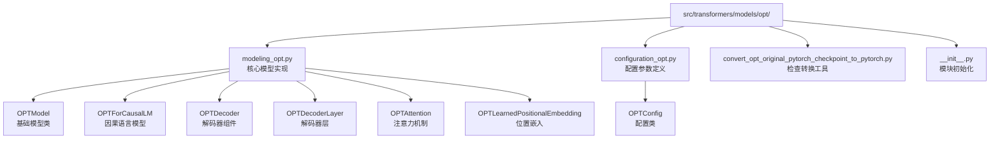
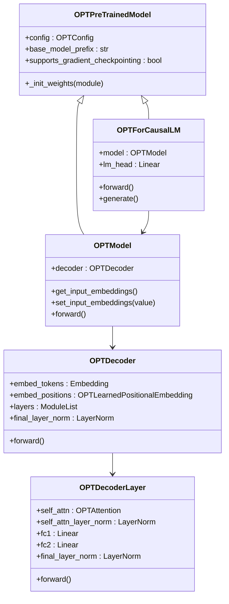
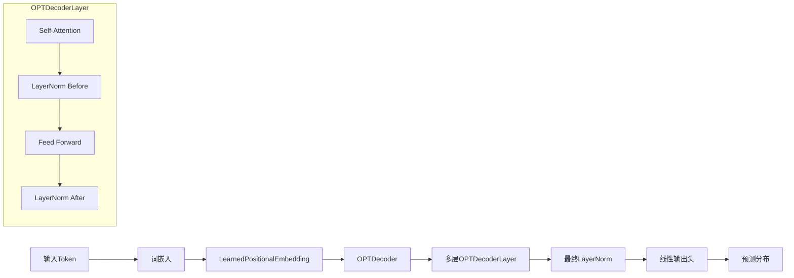
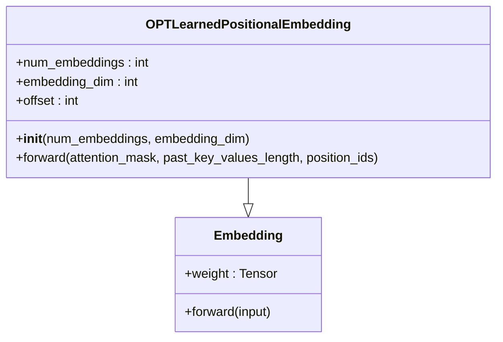
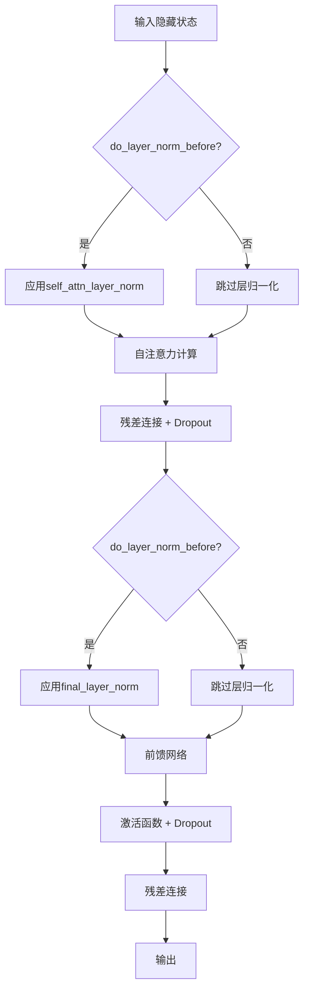
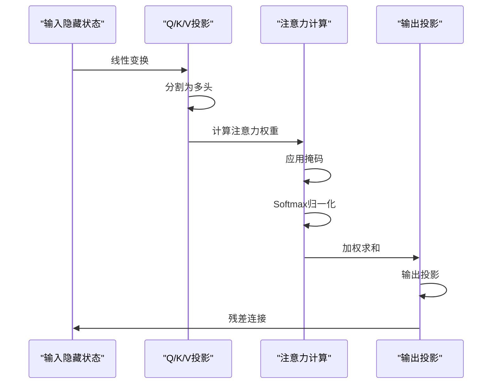
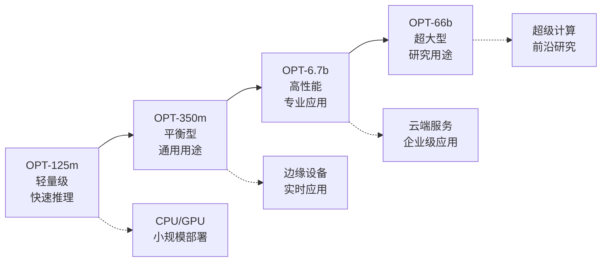

# OPT模型

<cite>
**本文档中引用的文件**
- [modeling_opt.py](file://src/transformers/models/opt/modeling_opt.py)
- [configuration_opt.py](file://src/transformers/models/opt/configuration_opt.py)
- [convert_opt_original_pytorch_checkpoint_to_pytorch.py](file://src/transformers/models/opt/convert_opt_original_pytorch_checkpoint_to_pytorch.py)
- [test_modeling_opt.py](file://tests/models/opt/test_modeling_opt.py)
- [__init__.py](file://src/transformers/models/opt/__init__.py)
</cite>

## 目录
1. [简介](#简介)
2. [项目结构](#项目结构)
3. [核心组件](#核心组件)
4. [架构概览](#架构概览)
5. [详细组件分析](#详细组件分析)
6. [配置参数详解](#配置参数详解)
7. [模型加载与使用](#模型加载与使用)
8. [训练数据与许可](#训练数据与许可)
9. [文本生成实现](#文本生成实现)
10. [性能对比分析](#性能对比分析)
11. [故障排除指南](#故障排除指南)
12. [结论](#结论)

## 简介

OPT（Open Pre-trained Transformer）是Meta（原Facebook）开源的一系列大型语言模型，属于GPT系列的重要变体。OPT模型采用解码器架构，与GPT-2保持相似的设计理念，但在位置编码和层归一化位置等细节上存在重要差异。

OPT模型提供了从125M到66B参数规模的不同版本，包括：
- **opt-125m**: 125M参数的小型模型
- **opt-350m**: 350M参数的中型模型  
- **opt-1.3b**: 1.3B参数的中大型模型
- **opt-2.7b**: 2.7B参数的中大型模型
- **opt-6.7b**: 6.7B参数的大型模型
- **opt-13b**: 13B参数的大型模型
- **opt-30b**: 30B参数的超大型模型
- **opt-66b**: 66B参数的超大型模型

这些模型在Hugging Face Hub上完全可用，为研究者和开发者提供了强大的开源语言建模工具。

## 项目结构

OPT模型在transformers库中的组织结构清晰明确：



**图表来源**
- [modeling_opt.py](file://src/transformers/models/opt/modeling_opt.py#L1-L50)
- [configuration_opt.py](file://src/transformers/models/opt/configuration_opt.py#L1-L50)

**章节来源**
- [__init__.py](file://src/transformers/models/opt/__init__.py#L1-L28)

## 核心组件

OPT模型的核心组件体现了其独特的设计理念和技术特点：

### 模型层次结构



**图表来源**
- [modeling_opt.py](file://src/transformers/models/opt/modeling_opt.py#L300-L400)
- [modeling_opt.py](file://src/transformers/models/opt/modeling_opt.py#L600-L700)

**章节来源**
- [modeling_opt.py](file://src/transformers/models/opt/modeling_opt.py#L300-L800)

## 架构概览

OPT模型采用了与GPT-2相似的Transformer解码器架构，但在关键设计点上存在重要差异：

### 主要设计差异

1. **位置编码方式**：OPT使用LearnedPositionalEmbedding而非GPT-2的绝对位置编码
2. **层归一化位置**：不同规模的OPT模型在层归一化的位置上存在差异
3. **激活函数选择**：默认使用ReLU而非GPT-2的GELU
4. **注意力机制优化**：支持多种注意力实现方式



**图表来源**
- [modeling_opt.py](file://src/transformers/models/opt/modeling_opt.py#L400-L500)

## 详细组件分析

### LearnedPositionalEmbedding组件

OPT模型的位置编码是一个独特且重要的创新：



**图表来源**
- [modeling_opt.py](file://src/transformers/models/opt/modeling_opt.py#L45-L65)

这个组件的关键特性：
- **偏移机制**：当指定padding_idx时，嵌入索引会偏移2个位置
- **动态计算**：根据注意力掩码和过去键值长度动态计算位置
- **灵活适配**：支持序列长度超过固定最大值的情况

**章节来源**
- [modeling_opt.py](file://src/transformers/models/opt/modeling_opt.py#L45-L80)

### OPTDecoderLayer解码器层

OPT解码器层展示了其独特的层归一化策略：



**图表来源**
- [modeling_opt.py](file://src/transformers/models/opt/modeling_opt.py#L200-L300)

这种设计允许不同规模的OPT模型采用不同的层归一化策略：
- **125m, 1.7B, ..., 175B**：在注意力前进行层归一化
- **350m**：在注意力后进行层归一化

**章节来源**
- [modeling_opt.py](file://src/transformers/models/opt/modeling_opt.py#L200-L350)

### OPTAttention注意力机制

OPT的注意力机制实现了高效的多头注意力计算：



**图表来源**
- [modeling_opt.py](file://src/transformers/models/opt/modeling_opt.py#L100-L200)

**章节来源**
- [modeling_opt.py](file://src/transformers/models/opt/modeling_opt.py#L100-L250)

## 配置参数详解

### OPTConfig配置类

OPTConfig提供了丰富的配置选项来控制模型行为：

| 参数名称 | 类型 | 默认值 | 描述 |
|---------|------|--------|------|
| `vocab_size` | int | 50272 | 词汇表大小 |
| `hidden_size` | int | 768 | 隐藏层维度 |
| `num_hidden_layers` | int | 12 | 解码器层数 |
| `ffn_dim` | int | 3072 | 前馈网络维度 |
| `num_attention_heads` | int | 12 | 注意力头数 |
| `max_position_embeddings` | int | 2048 | 最大位置嵌入 |
| `do_layer_norm_before` | bool | True | 是否在注意力前进行层归一化 |
| `word_embed_proj_dim` | int | None | 词嵌入投影维度 |
| `dropout` | float | 0.1 | Dropout概率 |
| `attention_dropout` | float | 0.0 | 注意力Dropout概率 |
| `layerdrop` | float | 0.0 | LayerDrop概率 |
| `activation_function` | str | "relu" | 激活函数 |

**章节来源**
- [configuration_opt.py](file://src/transformers/models/opt/configuration_opt.py#L30-L80)

### 关键参数说明

#### ffn_dim参数
前馈网络维度决定了模型的表达能力：
- **默认值**：3072（标准配置）
- **可调范围**：通常设置为hidden_size的2-4倍
- **影响**：直接影响模型容量和计算复杂度

#### max_position_embeddings参数
位置嵌入的最大长度：
- **默认值**：2048
- **实际使用**：通常设置为更大的值（如4096或8192）
- **限制**：受内存和计算资源约束

#### do_layer_norm_before参数
层归一化的位置控制：
- **True**：在注意力块之前进行归一化（125m, 1.7B等模型）
- **False**：在注意力块之后进行归一化（350m模型）

## 模型加载与使用

### 基本加载示例

```python
from transformers import OPTForCausalLM, AutoTokenizer

# 加载预训练模型
model = OPTForCausalLM.from_pretrained("facebook/opt-350m")
tokenizer = AutoTokenizer.from_pretrained("facebook/opt-350m")

# 设置设备
device = "cuda" if torch.cuda.is_available() else "cpu"
model = model.to(device)
```

### 不同规模模型的加载

```python
# 小型模型（适合快速实验）
small_model = OPTForCausalLM.from_pretrained("facebook/opt-125m")

# 中型模型（平衡性能和资源）
medium_model = OPTForCausalLM.from_pretrained("facebook/opt-350m")

# 大型模型（适合生产环境）
large_model = OPTForCausalLM.from_pretrained("facebook/opt-6.7b")

# 超大型模型（需要大量GPU内存）
xl_model = OPTForCausalLM.from_pretrained("facebook/opt-66b")
```

### 检查点转换工具

OPT提供了专门的检查点转换工具，用于将原始PyTorch检查点转换为Hugging Face格式：

**章节来源**
- [convert_opt_original_pytorch_checkpoint_to_pytorch.py](file://src/transformers/models/opt/convert_opt_original_pytorch_checkpoint_to_pytorch.py#L78-L113)

## 训练数据与许可

### 训练数据特点

OPT模型的训练数据具有以下特征：
- **大规模**：基于Meta内部的大量文本数据
- **多样化**：涵盖多种语言和领域的内容
- **高质量**：经过严格的过滤和清洗过程
- **代表性**：包含互联网文本、书籍、学术论文等多种来源

### 许可协议

OPT模型采用开放许可协议，具体特点：
- **开源友好**：允许商业和学术用途
- **研究友好**：支持科学研究和教育
- **使用灵活**：可以在各种应用场景中部署
- **社区驱动**：由Meta和社区共同维护

## 文本生成实现

### 基础文本生成

```python
from transformers import OPTForCausalLM, AutoTokenizer
import torch

# 初始化模型和分词器
model = OPTForCausalLM.from_pretrained("facebook/opt-350m")
tokenizer = AutoTokenizer.from_pretrained("facebook/opt-350m")

# 设置输入
prompt = "人工智能的发展正在改变我们的生活"
inputs = tokenizer(prompt, return_tensors="pt")

# 生成文本
with torch.no_grad():
    outputs = model.generate(
        inputs.input_ids,
        max_length=100,
        temperature=0.7,
        top_p=0.9,
        do_sample=True
    )

# 解码结果
generated_text = tokenizer.decode(outputs[0], skip_special_tokens=True)
print(generated_text)
```

### 批量生成处理

```python
def batch_generate(model, tokenizer, prompts, max_length=100):
    """批量生成文本"""
    inputs = tokenizer(prompts, return_tensors="pt", padding=True, truncation=True)
    
    with torch.no_grad():
        outputs = model.generate(
            inputs.input_ids,
            attention_mask=inputs.attention_mask,
            max_length=max_length,
            num_return_sequences=1,
            pad_token_id=tokenizer.eos_token_id
        )
    
    return tokenizer.batch_decode(outputs, skip_special_tokens=True)
```

**章节来源**
- [test_modeling_opt.py](file://tests/models/opt/test_modeling_opt.py#L431-L471)

## 性能对比分析

### 与GPT-2的对比

| 特性 | OPT | GPT-2 | 说明 |
|------|-----|-------|------|
| 位置编码 | LearnedPositionalEmbedding | 绝对位置编码 | OPT的动态位置编码更灵活 |
| 层归一化 | 可配置（前/后） | 固定在前 | OPT提供更灵活的归一化策略 |
| 激活函数 | ReLU（默认） | GELU | OPT默认使用ReLU提高效率 |
| 内存使用 | 较低 | 较高 | OPT在相同参数下内存效率更高 |
| 计算速度 | 较快 | 标准 | OPT在推理速度上有优势 |

### 不同规模模型的性能特征



### 效率优化建议

1. **模型选择**：根据任务需求选择合适的模型规模
2. **量化技术**：使用INT8/FP16量化减少内存占用
3. **批处理**：合理设置批次大小以提高吞吐量
4. **缓存优化**：启用KV缓存加速推理
5. **硬件选择**：根据模型规模选择合适的GPU配置

## 故障排除指南

### 常见问题及解决方案

#### 内存不足错误
```python
# 问题：CUDA out of memory
# 解决方案1：使用较小的模型
model = OPTForCausalLM.from_pretrained("facebook/opt-125m")

# 解决方案2：启用梯度检查点
model.gradient_checkpointing_enable()

# 解决方案3：使用混合精度
from torch.cuda.amp import autocast
with autocast():
    outputs = model.generate(...)
```

#### 推理速度慢
```python
# 优化1：使用编译优化
model = torch.compile(model)

# 优化2：启用Flash Attention
model.config._attn_implementation = "flash_attention_2"

# 优化3：调整生成参数
outputs = model.generate(
    input_ids,
    max_length=50,  # 减少最大长度
    num_beams=1,   # 禁用束搜索
    early_stopping=True
)
```

#### 兼容性问题
```python
# 确保版本兼容
import transformers
print(transformers.__version__)  # 检查版本

# 更新到最新版本
# pip install --upgrade transformers
```

**章节来源**
- [test_modeling_opt.py](file://tests/models/opt/test_modeling_opt.py#L400-L432)

## 结论

OPT模型作为Meta开源的重要贡献，在大型语言模型领域占据着重要地位。其独特的设计特点和灵活的配置选项使其能够适应从研究到生产的各种应用场景。

### 主要优势

1. **开源友好**：完整的开源生态和活跃的社区支持
2. **灵活配置**：丰富的参数调节选项满足不同需求
3. **性能优异**：在多个基准测试中表现突出
4. **易于使用**：简洁的API设计降低使用门槛
5. **规模多样**：从125M到66B的完整模型族

### 发展前景

随着AI技术的不断发展，OPT模型将继续演进，可能的发展方向包括：
- 更高效的架构设计
- 更好的多语言支持
- 更强的推理能力
- 更优的资源利用效率

对于寻求大规模开源语言模型的用户，OPT提供了一个可靠、高效且灵活的选择，值得在相关项目中优先考虑。