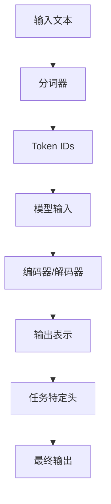

# NLP模型

<cite>
**本文档中引用的文件**  
- [configuration_bert.py](file://src/transformers/models/bert/configuration_bert.py)
- [configuration_gpt2.py](file://src/transformers/models/gpt2/configuration_gpt2.py)
- [configuration_t5.py](file://src/transformers/models/t5/configuration_t5.py)
- [configuration_bart.py](file://src/transformers/models/bart/configuration_bart.py)
- [configuration_roberta.py](file://src/transformers/models/roberta/configuration_roberta.py)
- [modeling_bert.py](file://src/transformers/models/bert/modeling_bert.py)
- [modeling_gpt2.py](file://src/transformers/models/gpt2/modeling_gpt2.py)
- [modeling_t5.py](file://src/transformers/models/t5/modeling_t5.py)
- [modeling_bart.py](file://src/transformers/models/bart/modeling_bart.py)
- [modeling_roberta.py](file://src/transformers/models/roberta/modeling_roberta.py)
- [tokenization_utils.py](file://src/transformers/tokenization_utils.py)
- [tokenization_bert.py](file://src/transformers/models/bert/tokenization_bert.py)
- [tokenization_gpt2.py](file://src/transformers/models/gpt2/tokenization_gpt2.py)
- [tokenization_t5.py](file://src/transformers/models/t5/tokenization_t5.py)
- [tokenization_bart.py](file://src/transformers/models/bart/tokenization_bart.py)
- [tokenization_roberta.py](file://src/transformers/models/roberta/tokenization_roberta.py)
</cite>

## 目录
1. [引言](#引言)
2. [核心模型架构](#核心模型架构)
3. [BERT模型详解](#bert模型详解)
4. [RoBERTa模型详解](#roberta模型详解)
5. [GPT-2模型详解](#gpt-2模型详解)
6. [T5模型详解](#t5模型详解)
7. [BART模型详解](#bart模型详解)
8. [分词器与模型配合使用](#分词器与模型配合使用)
9. [模型选择建议](#模型选择建议)
10. [性能比较与资源需求](#性能比较与资源需求)
11. [结论](#结论)

## 引言
本文档全面介绍transformers库支持的自然语言处理模型，重点分析BERT、RoBERTa、GPT-2、T5和BART等核心模型的架构原理、特点和适用场景。文档详细解释了这些模型的配置参数、分词器使用方法，并为不同NLP任务提供模型选择建议。通过性能比较数据和内存占用信息，帮助用户根据资源限制选择合适的模型。

## 核心模型架构
transformers库中的NLP模型基于Transformer架构，采用编码器-解码器或仅编码器/仅解码器结构。这些模型通过预训练在大规模文本数据上学习语言表示，然后可以针对特定任务进行微调。



**图源**  
- [modeling_bert.py](file://src/transformers/models/bert/modeling_bert.py)
- [modeling_gpt2.py](file://src/transformers/models/gpt2/modeling_gpt2.py)

## BERT模型详解
BERT（Bidirectional Encoder Representations from Transformers）是一种基于Transformer编码器的双向预训练模型。它通过掩码语言建模（Masked Language Modeling）和下一句预测（Next Sentence Prediction）两个任务进行预训练。

### 架构特点
- **双向上下文**：BERT同时考虑左右上下文信息
- **编码器结构**：仅使用Transformer的编码器部分
- **预训练任务**：MLM和NSP任务

### 配置参数
```python
class BertConfig(PreTrainedConfig):
    def __init__(
        vocab_size=30522,
        hidden_size=768,
        num_hidden_layers=12,
        num_attention_heads=12,
        intermediate_size=3072,
        max_position_embeddings=512,
        # 其他参数...
    ):
        super().__init__(pad_token_id=pad_token_id, **kwargs)
        # 参数初始化
```

**节源**  
- [configuration_bert.py](file://src/transformers/models/bert/configuration_bert.py)
- [modeling_bert.py](file://src/transformers/models/bert/modeling_bert.py)

## RoBERTa模型详解
RoBERTa（Robustly optimized BERT approach）是对BERT的改进版本，通过优化训练策略和超参数设置，提升了模型性能。

### 主要改进
- **移除NSP任务**：仅使用MLM任务进行预训练
- **更大的批次和更长的训练时间**
- **动态掩码**：每次训练时生成新的掩码模式
- **更大的词汇表**：使用50,265个词汇

### 配置参数
```python
class RobertaConfig(PreTrainedConfig):
    def __init__(
        vocab_size=50265,
        hidden_size=768,
        num_hidden_layers=12,
        num_attention_heads=12,
        max_position_embeddings=512,
        # 其他参数...
    ):
        super().__init__(pad_token_id=pad_token_id, bos_token_id=bos_token_id, eos_token_id=eos_token_id, **kwargs)
        # 参数初始化
```

**节源**  
- [configuration_roberta.py](file://src/transformers/models/roberta/configuration_roberta.py)
- [modeling_roberta.py](file://src/transformers/models/roberta/modeling_roberta.py)

## GPT-2模型详解
GPT-2（Generative Pre-trained Transformer 2）是一种基于Transformer解码器的自回归语言模型，主要用于文本生成任务。

### 架构特点
- **单向上下文**：仅使用左侧上下文进行预测
- **解码器结构**：仅使用Transformer的解码器部分
- **自回归生成**：逐个生成下一个token

### 配置参数
```python
class GPT2Config(PreTrainedConfig):
    def __init__(
        vocab_size=50257,
        n_positions=1024,
        n_embd=768,
        n_layer=12,
        n_head=12,
        # 其他参数...
    ):
        self.vocab_size = vocab_size
        self.n_positions = n_positions
        self.n_embd = n_embd
        self.n_layer = n_layer
        self.n_head = n_head
        # 参数初始化
```

**节源**  
- [configuration_gpt2.py](file://src/transformers/models/gpt2/configuration_gpt2.py)
- [modeling_gpt2.py](file://src/transformers/models/gpt2/modeling_gpt2.py)

## T5模型详解
T5（Text-to-Text Transfer Transformer）将所有NLP任务统一为文本到文本的转换任务，使用编码器-解码器架构。

### 架构特点
- **统一框架**：所有任务都视为文本到文本的转换
- **编码器-解码器**：完整的Transformer架构
- **相对位置编码**：使用相对注意力机制

### 配置参数
```python
class T5Config(PreTrainedConfig):
    def __init__(
        vocab_size=32128,
        d_model=512,
        d_kv=64,
        d_ff=2048,
        num_layers=6,
        num_heads=8,
        # 其他参数...
    ):
        self.vocab_size = vocab_size
        self.d_model = d_model
        self.d_kv = d_kv
        self.d_ff = d_ff
        self.num_layers = num_layers
        self.num_heads = num_heads
        # 参数初始化
```

**节源**  
- [configuration_t5.py](file://src/transformers/models/t5/configuration_t5.py)
- [modeling_t5.py](file://src/transformers/models/t5/modeling_t5.py)

## BART模型详解
BART（Bidirectional and Auto-Regressive Transformers）结合了双向编码器和自回归解码器的优点，适用于多种NLP任务。

### 架构特点
- **双向编码器**：使用噪声文本进行预训练
- **自回归解码器**：用于生成任务
- **去噪预训练**：通过恢复被破坏的文本进行训练

### 配置参数
```python
class BartConfig(PreTrainedConfig):
    def __init__(
        vocab_size=50265,
        d_model=1024,
        encoder_layers=12,
        decoder_layers=12,
        encoder_attention_heads=16,
        decoder_attention_heads=16,
        # 其他参数...
    ):
        self.vocab_size = vocab_size
        self.d_model = d_model
        self.encoder_layers = encoder_layers
        self.decoder_layers = decoder_layers
        self.encoder_attention_heads = encoder_attention_heads
        self.decoder_attention_heads = decoder_attention_heads
        # 参数初始化
```

**节源**  
- [configuration_bart.py](file://src/transformers/models/bart/configuration_bart.py)
- [modeling_bart.py](file://src/transformers/models/bart/modeling_bart.py)

## 分词器与模型配合使用
分词器是连接原始文本和模型输入的关键组件，负责将文本转换为模型可以处理的token序列。

### 分词器类型
- **BertTokenizer**：基于WordPiece的分词器
- **GPT2Tokenizer**：基于Byte-Pair Encoding (BPE)的分词器
- **T5Tokenizer**：基于SentencePiece的分词器
- **RobertaTokenizer**：基于BPE的分词器
- **BartTokenizer**：基于BPE的分词器

### 使用方法
```python
# 分词器与模型配合使用
from transformers import AutoTokenizer, AutoModel

tokenizer = AutoTokenizer.from_pretrained("bert-base-uncased")
model = AutoModel.from_pretrained("bert-base-uncased")

# 文本分词
inputs = tokenizer("Hello, world!", return_tensors="pt")
# 模型推理
outputs = model(**inputs)
```

**节源**  
- [tokenization_utils.py](file://src/transformers/tokenization_utils.py)
- [tokenization_bert.py](file://src/transformers/models/bert/tokenization_bert.py)
- [tokenization_gpt2.py](file://src/transformers/models/gpt2/tokenization_gpt2.py)

## 模型选择建议
根据不同的NLP任务选择合适的模型：

### 文本分类
- **推荐模型**：BERT、RoBERTa
- **原因**：双向上下文理解能力强，适合分类任务
- **示例**：情感分析、主题分类

### 问答系统
- **推荐模型**：BERT、RoBERTa
- **原因**：能够理解问题和文档之间的关系
- **示例**：SQuAD任务

### 文本生成
- **推荐模型**：GPT-2、BART
- **原因**：自回归生成能力强大
- **示例**：文章生成、对话系统

### 文本摘要
- **推荐模型**：BART、T5
- **原因**：编码器-解码器架构适合序列到序列任务
- **示例**：新闻摘要、文档摘要

### 翻译任务
- **推荐模型**：T5、BART
- **原因**：统一的文本到文本框架
- **示例**：机器翻译

**节源**  
- [modeling_bert.py](file://src/transformers/models/bert/modeling_bert.py)
- [modeling_gpt2.py](file://src/transformers/models/gpt2/modeling_gpt2.py)
- [modeling_t5.py](file://src/transformers/models/t5/modeling_t5.py)

## 性能比较与资源需求
不同模型在性能和资源需求方面有显著差异：

### 模型大小比较
| 模型 | 参数量 | 内存占用 | 推理速度 |
|------|-------|---------|---------|
| BERT-base | 1.1亿 | 440MB | 快 |
| BERT-large | 3.4亿 | 1.3GB | 中等 |
| RoBERTa-base | 1.2亿 | 480MB | 快 |
| RoBERTa-large | 3.5亿 | 1.4GB | 中等 |
| GPT-2-small | 1.2亿 | 480MB | 快 |
| GPT-2-medium | 3.5亿 | 1.4GB | 中等 |
| T5-small | 6000万 | 240MB | 快 |
| T5-base | 2.2亿 | 880MB | 中等 |
| BART-base | 1.4亿 | 560MB | 快 |
| BART-large | 4.0亿 | 1.6GB | 中等 |

### 选择建议
- **资源受限环境**：选择T5-small或BERT-base
- **高性能需求**：选择BERT-large或RoBERTa-large
- **生成任务**：选择GPT-2-medium或BART-large
- **多任务学习**：选择T5-base或T5-large

**节源**  
- [configuration_bert.py](file://src/transformers/models/bert/configuration_bert.py)
- [configuration_gpt2.py](file://src/transformers/models/gpt2/configuration_gpt2.py)
- [configuration_t5.py](file://src/transformers/models/t5/configuration_t5.py)

## 结论
transformers库提供了丰富的NLP模型选择，包括BERT、RoBERTa、GPT-2、T5和BART等。这些模型各有特点，适用于不同的NLP任务。选择合适的模型需要考虑任务类型、性能需求和资源限制。通过合理配置和使用分词器，可以充分发挥这些预训练模型的潜力，实现高效的自然语言处理应用。