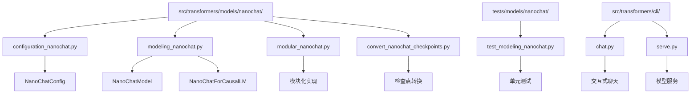
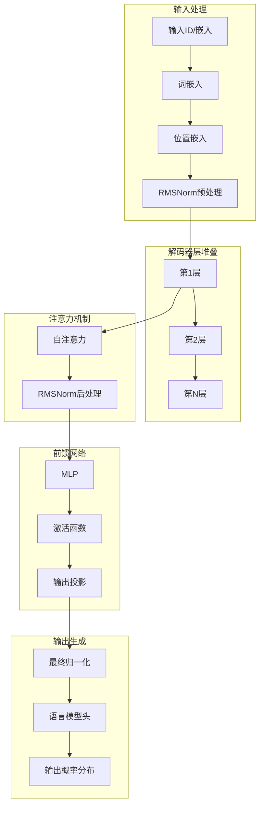
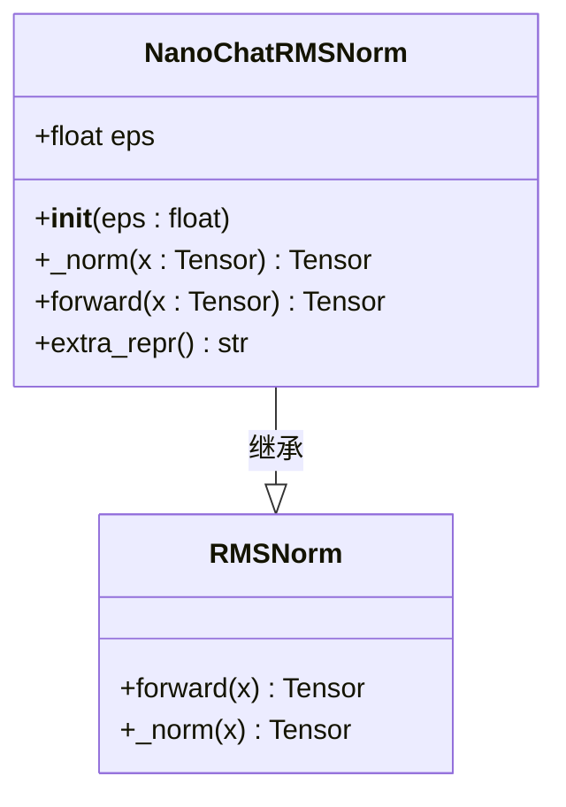
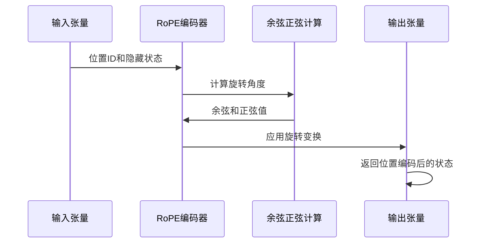
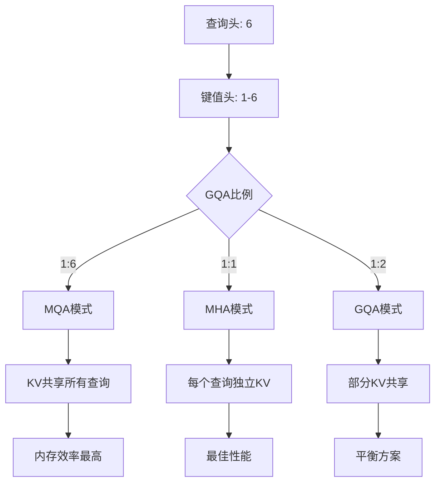
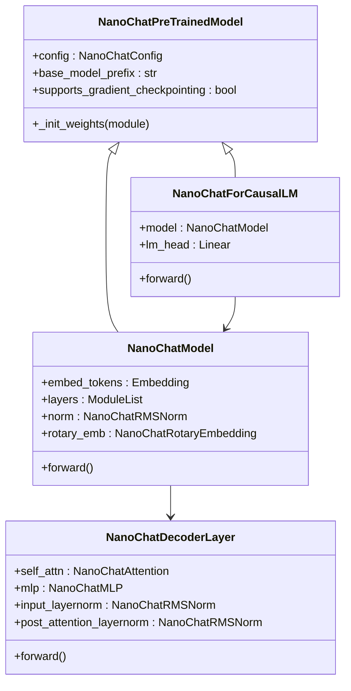
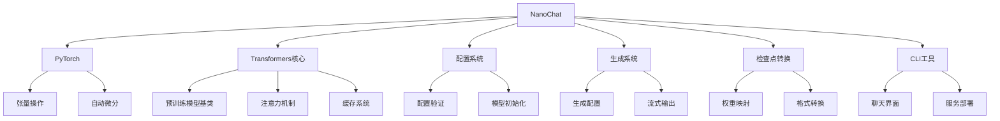

# Nanochat

<cite>
**本文档中引用的文件**
- [configuration_nanochat.py](file://src/transformers/models/nanochat/configuration_nanochat.py)
- [modeling_nanochat.py](file://src/transformers/models/nanochat/modeling_nanochat.py)
- [modular_nanochat.py](file://src/transformers/models/nanochat/modular_nanochat.py)
- [convert_nanochat_checkpoints.py](file://src/transformers/models/nanochat/convert_nanochat_checkpoints.py)
- [test_modeling_nanochat.py](file://tests/models/nanochat/test_modeling_nanochat.py)
- [chat.py](file://src/transformers/cli/chat.py)
- [serve.py](file://src/transformers/cli/serve.py)
</cite>

## 目录
1. [简介](#简介)
2. [项目结构](#项目结构)
3. [核心组件](#核心组件)
4. [架构概览](#架构概览)
5. [详细组件分析](#详细组件分析)
6. [依赖关系分析](#依赖关系分析)
7. [性能考虑](#性能考虑)
8. [故障排除指南](#故障排除指南)
9. [结论](#结论)

## 简介

Nanochat是Hugging Face Transformers库中的一个轻量级语言模型实现，专为高效推理和教育目的设计。该模型采用了现代化的架构设计，包括RMSNorm归一化、RoPE位置编码和分组查询注意力（GQA）等先进技术。

Nanochat模型的设计理念是提供一个简洁而强大的基础架构，便于理解和修改，同时保持良好的性能表现。它支持从简单的文本生成到复杂的对话交互等多种应用场景。

## 项目结构

Nanochat在Transformers库中的组织结构体现了模块化设计理念：

**图表来源**
- [configuration_nanochat.py](file://src/transformers/models/nanochat/configuration_nanochat.py#L1-L159)
- [modeling_nanochat.py](file://src/transformers/models/nanochat/modeling_nanochat.py#L1-L532)
- [modular_nanochat.py](file://src/transformers/models/nanochat/modular_nanochat.py#L1-L248)

**章节来源**
- [configuration_nanochat.py](file://src/transformers/models/nanochat/configuration_nanochat.py#L1-L159)
- [modeling_nanochat.py](file://src/transformers/models/nanochat/modeling_nanochat.py#L1-L532)

## 核心组件

Nanochat的核心组件包括配置管理、模型架构、注意力机制和位置编码等关键部分：

### 配置系统
NanoChatConfig提供了完整的模型配置管理，支持以下关键参数：
- **词汇表大小**：默认50304个token
- **隐藏层维度**：默认768维
- **中间层维度**：默认8192维
- **层数**：默认12层
- **注意力头数**：默认6个
- **最大序列长度**：默认2048

### 模型架构
模型采用标准的解码器架构，包含以下核心组件：
- **嵌入层**：词嵌入和位置嵌入
- **解码器层**：自定义的NanoChatDecoderLayer
- **输出层**：线性投影到词汇表空间

### 注意力机制
实现了先进的注意力机制：
- **分组查询注意力（GQA）**：提高推理效率
- **RMSNorm归一化**：替代LayerNorm，计算更高效
- **RoPE位置编码**：支持长序列位置信息

**章节来源**
- [configuration_nanochat.py](file://src/transformers/models/nanochat/configuration_nanochat.py#L20-L159)
- [modeling_nanochat.py](file://src/transformers/models/nanochat/modeling_nanochat.py#L363-L532)

## 架构概览

Nanochat的整体架构体现了现代大语言模型的最佳实践：

**图表来源**
- [modeling_nanochat.py](file://src/transformers/models/nanochat/modeling_nanochat.py#L363-L440)
- [modular_nanochat.py](file://src/transformers/models/nanochat/modular_nanochat.py#L145-L208)

## 详细组件分析

### RMSNorm归一化层

RMSNorm是NanoChat的核心创新之一，相比传统的LayerNorm具有更高的计算效率：

**图表来源**
- [modeling_nanochat.py](file://src/transformers/models/nanochat/modeling_nanochat.py#L44-L57)

### RoPE位置编码

RoPE（Rotary Position Embedding）为模型提供了位置感知能力：

**图表来源**
- [modeling_nanochat.py](file://src/transformers/models/nanochat/modeling_nanochat.py#L59-L121)

### 分组查询注意力（GQA）

GQA通过减少键值头的数量来提高推理效率：

**图表来源**
- [modeling_nanochat.py](file://src/transformers/models/nanochat/modeling_nanochat.py#L196-L270)

### 模块化设计

Nanochat采用了高度模块化的架构设计：

**图表来源**
- [modeling_nanochat.py](file://src/transformers/models/nanochat/modeling_nanochat.py#L334-L532)
- [modular_nanochat.py](file://src/transformers/models/nanochat/modular_nanochat.py#L132-L247)

**章节来源**
- [modeling_nanochat.py](file://src/transformers/models/nanochat/modeling_nanochat.py#L44-L532)
- [modular_nanochat.py](file://src/transformers/models/nanochat/modular_nanochat.py#L45-L247)

## 依赖关系分析

Nanochat的依赖关系体现了现代深度学习库的最佳实践：

**图表来源**
- [convert_nanochat_checkpoints.py](file://src/transformers/models/nanochat/convert_nanochat_checkpoints.py#L1-L315)
- [chat.py](file://src/transformers/cli/chat.py#L1-L200)
- [serve.py](file://src/transformers/cli/serve.py#L1-L200)

**章节来源**
- [convert_nanochat_checkpoints.py](file://src/transformers/models/nanochat/convert_nanochat_checkpoints.py#L1-L315)

## 性能考虑

Nanochat在设计时充分考虑了性能优化：

### 内存效率
- 使用RMSNorm替代LayerNorm，减少内存占用
- 实现分组查询注意力（GQA），降低KV缓存需求
- 支持梯度检查点，平衡内存和计算

### 推理优化
- 支持多种注意力实现方式（Eager、Flash Attention等）
- 实现连续批处理以提高吞吐量
- 优化的位置编码计算

### 扩展性
- 支持张量并行和流水线并行
- 可配置的模型尺寸和架构参数
- 灵活的设备映射策略

## 故障排除指南

### 常见问题及解决方案

#### 检查点转换问题
当遇到检查点转换失败时，可以：
1. 检查输入目录结构是否正确
2. 验证配置文件是否存在
3. 确认PyTorch版本兼容性

#### 内存不足
如果遇到内存不足错误：
1. 启用梯度检查点
2. 减少批次大小
3. 使用量化技术

#### 生成质量不佳
如果生成质量不理想：
1. 调整温度参数
2. 检查模型配置
3. 验证输入数据格式

**章节来源**
- [convert_nanochat_checkpoints.py](file://src/transformers/models/nanochat/convert_nanochat_checkpoints.py#L258-L315)
- [test_modeling_nanochat.py](file://tests/models/nanochat/test_modeling_nanochat.py#L52-L234)

## 结论

Nanochat代表了现代语言模型设计的一个重要方向，它在保持高性能的同时实现了极简的架构设计。通过采用RMSNorm、RoPE和GQA等先进技术，Nanochat不仅在推理效率上表现出色，而且为研究者和开发者提供了一个易于理解和修改的基础平台。

该模型的成功实施展示了如何在有限资源下构建高质量的语言模型，为教育和研究领域提供了宝贵的参考。随着技术的不断发展，Nanochat有望成为推动大语言模型普及的重要力量。