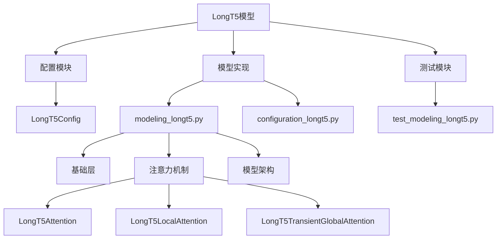
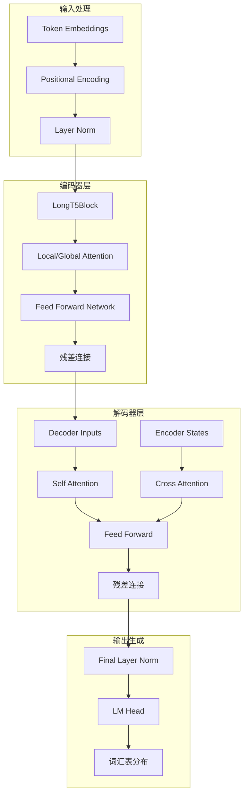
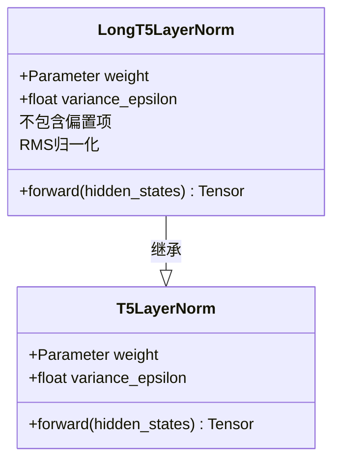
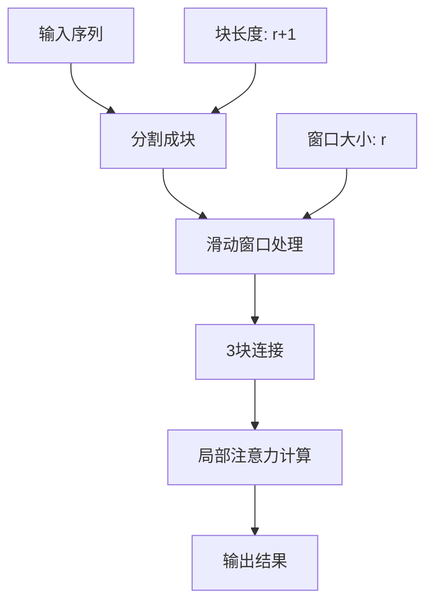
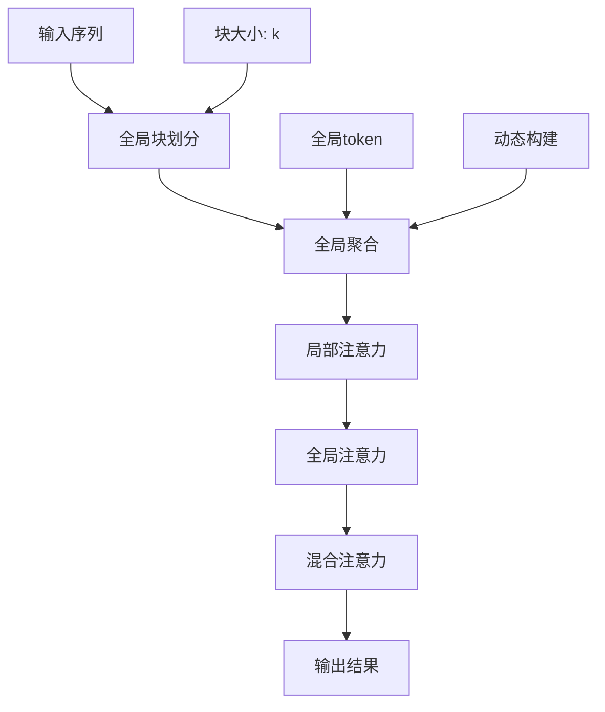
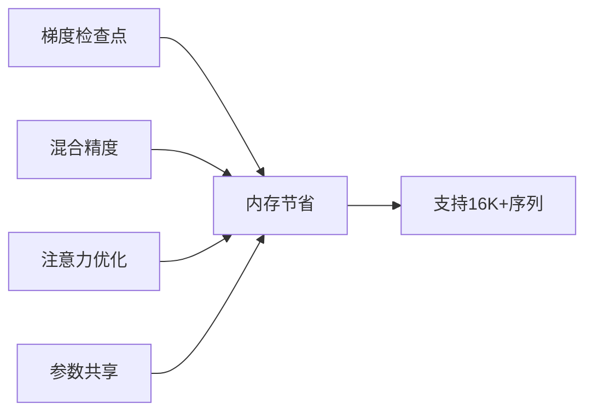

# LongT5长文本模型详细技术文档

<cite>
**本文档引用的文件**
- [longt5.md](file://docs/source/en/model_doc/longt5.md)
- [modeling_longt5.py](file://src/transformers/models/longt5/modeling_longt5.py)
- [configuration_longt5.py](file://src/transformers/models/longt5/configuration_longt5.py)
- [test_modeling_longt5.py](file://tests/models/longt5/test_modeling_longt5.py)
- [modeling_t5.py](file://src/transformers/models/t5/modeling_t5.py)
</cite>

## 目录
1. [简介](#简介)
2. [项目结构](#项目结构)
3. [核心组件](#核心组件)
4. [架构概览](#架构概览)
5. [详细组件分析](#详细组件分析)
6. [稀疏注意力机制](#稀疏注意力机制)
7. [配置参数详解](#配置参数详解)
8. [性能基准与优化](#性能基准与优化)
9. [应用场景与最佳实践](#应用场景与最佳实践)
10. [故障排除指南](#故障排除指南)
11. [总结](#总结)

## 简介

LongT5是Google Research提出的一种高效的长序列文本到文本转换模型，专门设计用于处理超过传统Transformer限制的超长输入序列。该模型通过创新的局部-全局注意力机制，在保持高质量输出的同时显著降低了计算复杂度。

### 主要特性

- **超长序列处理能力**：支持最长16,384个token的输入序列
- **两种高效注意力机制**：
  - 局部注意力（Local Attention）
  - 瞬态全局注意力（Transient-Global Attention）
- **线性时间复杂度**：相比标准Transformer的O(n²)复杂度
- **零参数扩展**：局部注意力不引入额外参数

## 项目结构

LongT5模型在transformers库中的组织结构如下：



**图表来源**
- [modeling_longt5.py](file://src/transformers/models/longt5/modeling_longt5.py#L1-L50)
- [configuration_longt5.py](file://src/transformers/models/longt5/configuration_longt5.py#L1-L30)

**章节来源**
- [longt5.md](file://docs/source/en/model_doc/longt5.md#L1-L120)

## 核心组件

LongT5的核心组件包括三个主要部分：

### 1. 基础注意力层
- **LongT5Attention**：标准自注意力机制的基础实现
- **LongT5LayerNorm**：RMS层归一化，不包含偏置项
- **相对位置编码**：支持双向和单向注意力

### 2. 稀疏注意力机制
- **Local Attention**：滑动窗口局部注意力
- **Transient-Global Attention**：瞬态全局注意力

### 3. 模型架构
- **LongT5Model**：完整的编码器-解码器架构
- **LongT5ForConditionalGeneration**：条件生成任务
- **LongT5EncoderModel**：仅编码器架构

**章节来源**
- [modeling_longt5.py](file://src/transformers/models/longt5/modeling_longt5.py#L100-L200)

## 架构概览

LongT5采用改进的T5架构，通过稀疏注意力机制实现对长序列的高效处理：



**图表来源**
- [modeling_longt5.py](file://src/transformers/models/longt5/modeling_longt5.py#L1600-L1700)

## 详细组件分析

### LongT5LayerNorm实现

LongT5使用特殊的RMS层归一化，与标准T5不同的是不包含偏置项：



**图表来源**
- [modeling_longt5.py](file://src/transformers/models/longt5/modeling_longt5.py#L220-L242)

### 注意力机制对比

| 特性 | 标准T5注意力 | Local Attention | Transient-Global Attention |
|------|-------------|----------------|---------------------------|
| 复杂度 | O(n²) | O(l×r) | O(l×(r+l/k)) |
| 参数数量 | 标准 | 零参数 | 少量参数 |
| 内存需求 | 高 | 中等 | 中等 |
| 适用场景 | 短序列 | 中等长度 | 超长序列 |

**章节来源**
- [modeling_longt5.py](file://src/transformers/models/longt5/modeling_longt5.py#L400-L600)

## 稀疏注意力机制

### Local Attention机制

Local Attention通过滑动窗口限制每个token的注意力范围：



**图表来源**
- [modeling_longt5.py](file://src/transformers/models/longt5/modeling_longt5.py#L400-L500)

#### Local Attention计算流程

1. **序列分块**：将输入序列按块长度分割
2. **三块连接**：每个token与其左右各r个token组成3块
3. **注意力计算**：只在本地窗口内计算注意力权重
4. **结果合并**：将块级结果重新组合为完整序列

### Transient-Global Attention机制

Transient-Global Attention结合了局部和全局注意力的优势：



**图表来源**
- [modeling_longt5.py](file://src/transformers/models/longt5/modeling_longt5.py#L700-L900)

#### Transient-Global Attention特点

- **动态全局token**：每层动态计算全局表示
- **双重注意力**：同时处理局部和全局依赖
- **参数效率**：相比标准全局注意力更高效

**章节来源**
- [modeling_longt5.py](file://src/transformers/models/longt5/modeling_longt5.py#L500-L900)

## 配置参数详解

### 核心配置参数

| 参数名 | 默认值 | 说明 | 影响 |
|--------|--------|------|------|
| `vocab_size` | 32128 | 词汇表大小 | 内存占用 |
| `d_model` | 512 | 模型维度 | 计算复杂度 |
| `num_layers` | 6 | 编码器层数 | 模型容量 |
| `num_heads` | 8 | 注意力头数 | 并行度 |
| `local_radius` | 127 | 局部注意力半径 | 局部依赖捕获 |
| `global_block_size` | 16 | 全局块大小 | 全局依赖建模 |
| `encoder_attention_type` | "local" | 编码器注意力类型 | 性能与质量平衡 |

### 关键参数优化策略

#### 对于长文档处理：
- **增加`local_radius`**：捕获更长的局部依赖
- **调整`global_block_size`**：平衡全局信息粒度
- **使用`transient-global`注意力**：处理超长序列

#### 对于资源受限环境：
- **减少`num_layers`**：降低内存和计算需求
- **使用`local`注意力**：最小化参数开销
- **压缩`d_model`**：减少内存占用

**章节来源**
- [configuration_longt5.py](file://src/transformers/models/longt5/configuration_longt5.py#L30-L120)

## 性能基准与优化

### 计算复杂度分析

| 注意力类型 | 时间复杂度 | 空间复杂度 | 优势 |
|------------|------------|------------|------|
| 标准T5 | O(n²) | O(n²) | 最高质量 |
| Local Attention | O(l×r) | O(l×r) | 线性扩展 |
| Transient-Global | O(l×(r+l/k)) | O(l×(r+l/k)) | 平衡性能 |

### 内存优化策略



### 推理速度优化

- **KV缓存**：重用键值矩阵
- **批处理优化**：动态批处理大小
- **硬件加速**：GPU/TPU优化

**章节来源**
- [test_modeling_longt5.py](file://tests/models/longt5/test_modeling_longt5.py#L200-L300)

## 应用场景与最佳实践

### 适用场景

1. **长文档摘要**
   - 法律文件处理
   - 科技论文摘要
   - 新闻文章总结

2. **文档分类**
   - 文档主题分类
   - 信息检索
   - 内容标注

3. **长篇问答**
   - 文档问答系统
   - 知识库查询
   - 智能客服

### 配置建议

#### 高质量摘要任务
```python
config = LongT5Config(
    encoder_attention_type="transient-global",
    local_radius=127,
    global_block_size=16,
    num_layers=12
)
```

#### 快速推理任务
```python
config = LongT5Config(
    encoder_attention_type="local",
    local_radius=64,
    num_layers=6
)
```

### 优化技巧

1. **序列预处理**：合理分割长文档
2. **批量处理**：利用批处理提升效率
3. **缓存策略**：启用KV缓存加速推理
4. **量化支持**：使用INT8/FP16量化

## 故障排除指南

### 常见问题及解决方案

#### 内存不足错误
- **原因**：序列过长或批次过大
- **解决方案**：减小批次大小或使用梯度累积

#### 性能下降
- **原因**：注意力类型选择不当
- **解决方案**：根据任务特点调整注意力机制

#### 数值不稳定
- **原因**：浮点精度问题
- **解决方案**：启用混合精度训练

**章节来源**
- [test_modeling_longt5.py](file://tests/models/longt5/test_modeling_longt5.py#L400-L500)

## 总结

LongT5通过创新的稀疏注意力机制，成功解决了长序列处理的技术挑战。其局部-全局注意力架构在保证模型性能的同时显著降低了计算复杂度，使得处理超长文档成为可能。

### 主要优势

1. **高效性**：线性复杂度支持超长序列
2. **灵活性**：两种注意力机制可选
3. **可扩展性**：支持从短到超长的各种序列长度
4. **实用性**：针对实际应用进行了优化

### 发展前景

LongT5代表了长序列处理的重要进展，为处理大规模文档、法律文件、科学文献等提供了强大的工具。随着硬件技术的发展和算法的进一步优化，LongT5将在更多领域发挥重要作用。