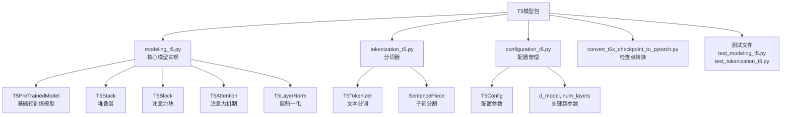
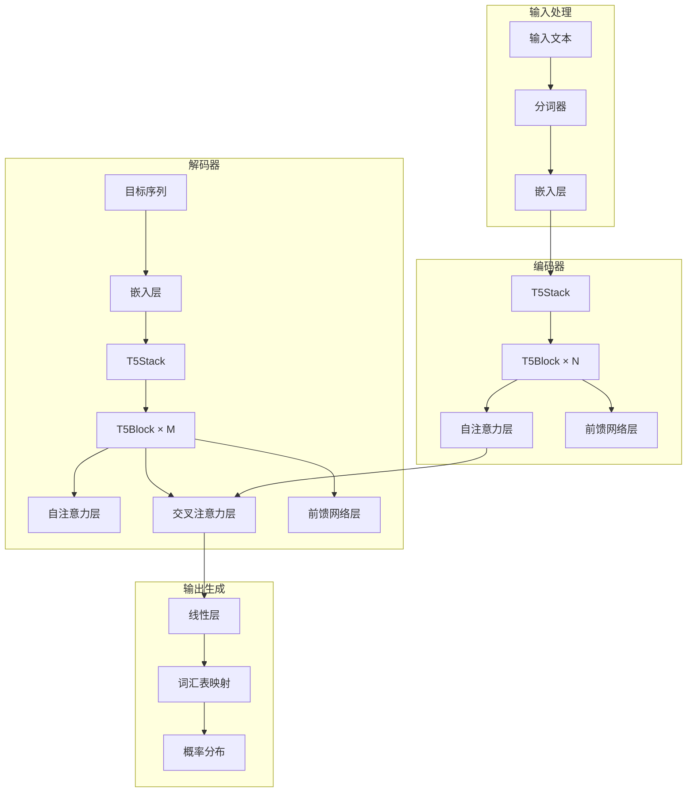
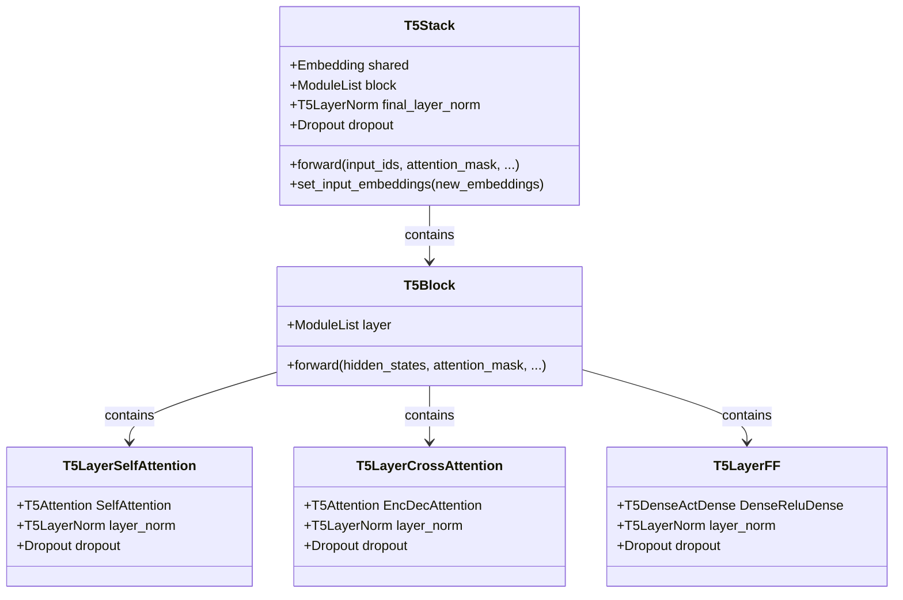
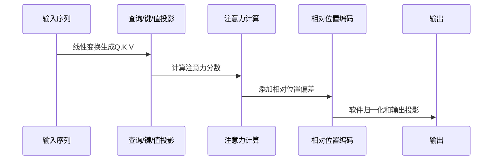
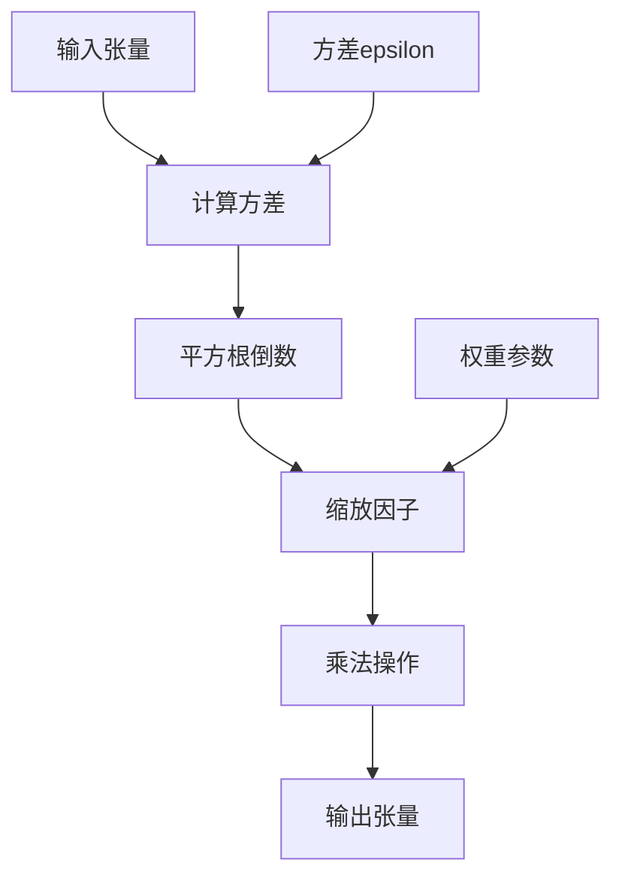
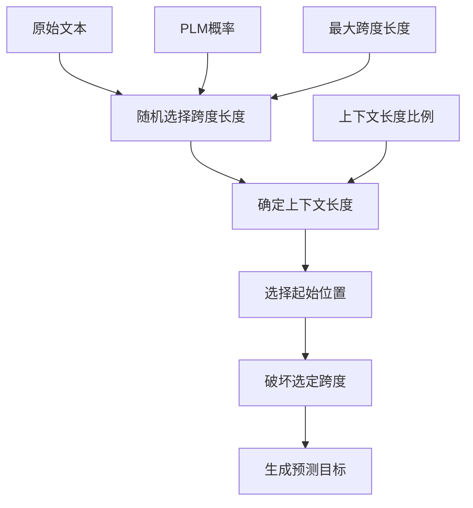

# T5基础模型详细文档

<cite>
**本文档引用的文件**
- [modeling_t5.py](file://src/transformers/models/t5/modeling_t5.py)
- [tokenization_t5.py](file://src/transformers/models/t5/tokenization_t5.py)
- [configuration_t5.py](file://src/transformers/models/t5/configuration_t5.py)
- [test_modeling_t5.py](file://tests/models/t5/test_modeling_t5.py)
- [test_tokenization_t5.py](file://tests/models/t5/test_tokenization_t5.py)
- [data_collator.py](file://src/transformers/data/data_collator.py)
</cite>

## 目录
1. [简介](#简介)
2. [项目结构](#项目结构)
3. [核心组件](#核心组件)
4. [架构概览](#架构概览)
5. [详细组件分析](#详细组件分析)
6. [预训练任务：Span Corruption](#预训练任务span-corruption)
7. [文本到文本转换框架](#文本到文本转换框架)
8. [配置参数详解](#配置参数详解)
9. [分词器使用指南](#分词器使用指南)
10. [性能基准与优化](#性能基准与优化)
11. [故障排除指南](#故障排除指南)
12. [结论](#结论)

## 简介

T5（Text-to-Text Transfer Transformer）是Google开发的一种革命性的编码器-解码器架构模型，它将所有自然语言处理任务统一为文本到文本的转换形式。这种创新的设计理念使得T5能够以一致的方式处理翻译、摘要、问答等各种NLP任务。

T5的核心思想是将不同的NLP任务都转化为输入-输出的文本对形式，通过预训练学习通用的语言表示，然后在特定任务上进行微调。这种统一的框架大大简化了多任务学习和迁移学习的过程。

## 项目结构

T5模型在transformers库中的组织结构清晰明确：



**图表来源**
- [modeling_t5.py](file://src/transformers/models/t5/modeling_t5.py#L1-L50)
- [tokenization_t5.py](file://src/transformers/models/t5/tokenization_t5.py#L1-L50)
- [configuration_t5.py](file://src/transformers/models/t5/configuration_t5.py#L1-L50)

**章节来源**
- [modeling_t5.py](file://src/transformers/models/t5/modeling_t5.py#L1-L100)
- [tokenization_t5.py](file://src/transformers/models/t5/tokenization_t5.py#L1-L100)
- [configuration_t5.py](file://src/transformers/models/t5/configuration_t5.py#L1-L100)

## 核心组件

T5模型由多个精心设计的核心组件构成，每个组件都有其特定的功能和作用：

### 主要模型类

1. **T5PreTrainedModel**: 所有T5模型的基础类，提供权重初始化、缓存管理和设备处理功能
2. **T5Model**: 完整的编码器-解码器模型，包含共享的嵌入层
3. **T5ForConditionalGeneration**: 条件生成模型，用于文本生成任务
4. **T5EncoderModel**: 仅包含编码器的模型，用于特征提取
5. **T5ForSequenceClassification**: 序列分类模型
6. **T5ForQuestionAnswering**: 问答模型
7. **T5ForTokenClassification**: 标记分类模型

### 关键架构组件

1. **T5Stack**: 模型的主要堆叠层，包含多个T5Block
2. **T5Block**: 单个Transformer块，包含自注意力、交叉注意力和前馈网络
3. **T5Attention**: 注意力机制实现，支持相对位置编码
4. **T5LayerNorm**: T5风格的层归一化，不包含偏置和均值减法
5. **T5LayerFF**: 前馈网络层，支持门控激活函数

**章节来源**
- [modeling_t5.py](file://src/transformers/models/t5/modeling_t5.py#L100-L300)

## 架构概览

T5采用标准的编码器-解码器架构，具有以下特点：



**图表来源**
- [modeling_t5.py](file://src/transformers/models/t5/modeling_t5.py#L850-L950)

### 编码器-解码器交互

T5的编码器负责处理输入序列，提取语义特征；解码器则基于编码器的表示和已生成的部分目标序列，逐步生成完整的输出序列。两者之间的交叉注意力机制允许解码器关注编码器的不同部分。

**章节来源**
- [modeling_t5.py](file://src/transformers/models/t5/modeling_t5.py#L850-L1000)

## 详细组件分析

### T5Stack：模型堆叠层

T5Stack是模型的核心组件，负责组织和管理各个Transformer层：



**图表来源**
- [modeling_t5.py](file://src/transformers/models/t5/modeling_t5.py#L750-L850)

#### 关键特性

1. **共享嵌入层**: 编码器和解码器共享相同的词汇表嵌入
2. **层次化结构**: 支持多层Transformer块的堆叠
3. **灵活的注意力**: 支持自注意力和交叉注意力机制
4. **梯度检查点**: 可选的梯度检查点功能以节省内存

**章节来源**
- [modeling_t5.py](file://src/transformers/models/t5/modeling_t5.py#L750-L900)

### T5Attention：注意力机制

T5的注意力机制是其核心创新之一，支持相对位置编码：



**图表来源**
- [modeling_t5.py](file://src/transformers/models/t5/modeling_t5.py#L250-L450)

#### 相对位置编码

T5使用相对位置编码来捕获序列中元素之间的相对距离关系：

1. **位置桶分配**: 将相对位置映射到离散的"桶"中
2. **可学习偏置**: 为每个桶学习可训练的注意力偏置
3. **双向支持**: 支持双向和单向注意力模式

**章节来源**
- [modeling_t5.py](file://src/transformers/models/t5/modeling_t5.py#L250-L500)

### T5LayerNorm：层归一化

T5采用特殊的层归一化实现，与标准的LayerNorm有所不同：



**图表来源**
- [modeling_t5.py](file://src/transformers/models/t5/modeling_t5.py#L50-L80)

#### 特殊之处

1. **无偏置**: 不使用偏置参数
2. **无均值减法**: 仅进行缩放操作
3. **Root Mean Square**: 使用均方根而非标准差
4. **半精度兼容**: 对混合精度训练友好

**章节来源**
- [modeling_t5.py](file://src/transformers/models/t5/modeling_t5.py#L50-L80)

## 预训练任务：Span Corruption

T5的预训练采用Span Corruption（跨度破坏）策略，这是一种创新的掩码语言建模方法：

### Span Corruption工作原理



**图表来源**
- [data_collator.py](file://src/transformers/data/data_collator.py#L1192-L1211)

### 实现细节

1. **动态跨度采样**: 随机选择跨度长度，范围从1到最大跨度长度
2. **上下文保留**: 保留跨度周围的上下文信息
3. **掩码策略**: 使用特殊的掩码标记替换被破坏的跨度
4. **目标重建**: 预测被掩码的原始内容

### 优势

1. **更自然的掩码**: 比传统的token级掩码更接近真实语言理解
2. **上下文完整性**: 保持较长的上下文依赖关系
3. **灵活性**: 支持不同长度的跨度破坏
4. **效率**: 减少需要预测的token数量

**章节来源**
- [data_collator.py](file://src/transformers/data/data_collator.py#L1192-L1211)

## 文本到文本转换框架

T5的核心创新在于将所有NLP任务统一为文本到文本的转换形式：

### 任务统一化

| 传统任务 | T5文本到文本格式 |
|---------|------------------|
| 翻译 | `translate English to German: ...` |
| 摘要 | `summarize: ...` |
| 问答 | `question: ... context: ...` |
| 分类 | `classify: ... label:` |
| 命名实体识别 | `ner: ...` |

### 具体应用示例

#### 翻译任务
```python
# 输入格式
input_text = "translate English to German: Hello world"
# 输出格式
output_text = "Hallo Welt"
```

#### 摘要任务
```python
# 输入格式
input_text = "summarize: The quick brown fox jumps over the lazy dog"
# 输出格式
output_text = "Fox jumps over dog"
```

#### 问答任务
```python
# 输入格式
input_text = "question: What is the capital of France? context: Paris is the capital of France."
# 输出格式
output_text = "Paris"
```

### 特殊前缀的作用

1. **任务指示**: 明确指定要执行的任务类型
2. **上下文引导**: 提供必要的上下文信息
3. **输出格式**: 指导模型生成期望格式的输出
4. **零样本学习**: 支持零样本或少样本学习

**章节来源**
- [test_modeling_t5.py](file://tests/models/t5/test_modeling_t5.py#L1506-L1527)

## 配置参数详解

T5的配置系统提供了丰富的参数控制选项：

### 核心配置参数

| 参数名称 | 默认值 | 含义 | 对性能的影响 |
|---------|--------|------|-------------|
| `d_model` | 512 | 模型隐藏维度 | 影响模型容量和计算复杂度 |
| `num_layers` | 6 | 编码器层数 | 决定模型深度和表达能力 |
| `num_heads` | 8 | 注意力头数 | 影响并行处理能力和表示多样性 |
| `d_kv` | 64 | 键值投影维度 | 控制每个注意力头的大小 |
| `d_ff` | 2048 | 前馈网络维度 | 影响非线性表达能力 |
| `dropout_rate` | 0.1 | Dropout比率 | 控制过拟合程度 |
| `relative_attention_num_buckets` | 32 | 相对位置桶数量 | 影响位置编码的粒度 |
| `relative_attention_max_distance` | 128 | 最大相对距离 | 决定位置编码的范围 |

### 高级配置选项

| 参数名称 | 默认值 | 含义 | 使用场景 |
|---------|--------|------|----------|
| `feed_forward_proj` | "relu" | 前馈网络激活函数 | 控制非线性变换方式 |
| `use_cache` | True | 是否使用KV缓存 | 影响推理速度和内存使用 |
| `is_gated_act` | False | 是否使用门控激活 | 影响模型表达能力 |
| `initializer_factor` | 1.0 | 初始化因子 | 控制权重初始化范围 |

### 参数调优指南

1. **小模型配置** (`t5-small`):
   - `d_model=512`, `num_layers=6`, `num_heads=8`
   - 适合资源受限环境

2. **中等模型配置** (`t5-base`):
   - `d_model=768`, `num_layers=12`, `num_heads=12`
   - 平衡性能和效率

3. **大模型配置** (`t5-large`):
   - `d_model=1024`, `num_layers=24`, `num_heads=16`
   - 适合高精度任务

**章节来源**
- [configuration_t5.py](file://src/transformers/models/t5/configuration_t5.py#L30-L100)

## 分词器使用指南

T5Tokenizer基于SentencePiece实现，提供了强大的文本处理能力：

### 基本使用

```python
from transformers import T5Tokenizer

# 加载分词器
tokenizer = T5Tokenizer.from_pretrained("google-t5/t5-small")

# 基本编码
text = "Hello world"
tokens = tokenizer.encode(text)
decoded = tokenizer.decode(tokens)
```

### 特殊功能

#### 1. 句子片段处理器
```python
# 获取特殊标记
sentinel_tokens = tokenizer.get_sentinel_tokens()
sentinel_ids = tokenizer.get_sentinel_token_ids()
```

#### 2. 最大长度处理
```python
# 设置最大长度
inputs = tokenizer(
    text, 
    max_length=512, 
    padding="max_length", 
    truncation=True, 
    return_tensors="pt"
)
```

#### 3. 特殊前缀处理
```python
# 自动添加EOS标记
text = "translate English to German: Hello"
inputs = tokenizer(text)
```

### 分词器配置参数

| 参数名称 | 默认值 | 说明 |
|---------|--------|------|
| `extra_ids` | 100 | 额外的特殊标记数量 |
| `legacy` | True | 是否使用传统行为 |
| `add_prefix_space` | True | 是否添加前缀空格 |
| `pad_token` | "<pad>" | 填充标记 |
| `eos_token` | "</s>" | 结束标记 |
| `unk_token` | "<unk>" | 未知标记 |

### 性能优化建议

1. **批处理**: 使用批量编码提高效率
2. **缓存**: 利用HF Hub的模型缓存
3. **设备**: 在GPU上进行分词操作
4. **内存**: 合理设置最大长度避免内存溢出

**章节来源**
- [tokenization_t5.py](file://src/transformers/models/t5/tokenization_t5.py#L100-L300)

## 性能基准与优化

### 内存占用分析

不同规模的T5模型在内存占用方面存在显著差异：

| 模型规模 | 参数量 | GPU内存需求 | 推理速度 |
|---------|--------|------------|----------|
| t5-small | ~60M | ~2GB | 快速 |
| t5-base | ~220M | ~8GB | 中等 |
| t5-large | ~770M | ~24GB | 较慢 |
| t5-3b | ~3B | ~96GB | 很慢 |

### 性能优化策略

#### 1. 混合精度训练
```python
# 使用FP16/BF16
model = T5ForConditionalGeneration.from_pretrained(
    "google-t5/t5-base",
    torch_dtype=torch.bfloat16
)
```

#### 2. 梯度检查点
```python
# 启用梯度检查点节省内存
model.gradient_checkpointing_enable()
```

#### 3. 动态批处理
```python
# 根据序列长度动态调整批次大小
from torch.utils.data import DataLoader
dataloader = DataLoader(dataset, batch_sampler=DynamicBatchSampler())
```

#### 4. 模型量化
```python
# 使用INT8量化
model = torch.quantization.quantize_dynamic(
    model, {torch.nn.Linear}, dtype=torch.qint8
)
```

### 与其他T5变体的比较

| 变体 | 特点 | 适用场景 |
|------|------|----------|
| T5 | 标准版本 | 通用任务 |
| mT5 | 多语言版本 | 跨语言任务 |
| T5v1.1 | 改进版 | 更好性能 |
| UL2 | 统一语言理解 | 多模态任务 |

### 推理优化技巧

1. **KV缓存**: 启用键值缓存加速生成
2. **静态形状**: 使用固定序列长度减少编译开销
3. **并行解码**: 利用多GPU进行并行推理
4. **模型并行**: 将大模型分割到多个设备

**章节来源**
- [test_modeling_t5.py](file://tests/models/t5/test_modeling_t5.py#L1014-L1045)

## 故障排除指南

### 常见问题及解决方案

#### 1. 内存不足错误
**问题**: CUDA out of memory
**解决方案**:
- 减少批次大小
- 启用梯度检查点
- 使用混合精度训练
- 降低模型尺寸

#### 2. 序列长度限制
**问题**: 序列过长导致截断
**解决方案**:
- 增加`max_length`参数
- 使用动态填充
- 分段处理长文本

#### 3. 性能问题
**问题**: 推理速度慢
**解决方案**:
- 启用KV缓存
- 使用模型量化
- 优化批处理大小
- 考虑使用更小的模型

#### 4. 训练不稳定
**问题**: 损失震荡或发散
**解决方案**:
- 降低学习率
- 增加预热步数
- 使用梯度裁剪
- 检查数据质量

### 调试工具和技巧

1. **日志记录**: 启用详细的训练日志
2. **可视化**: 使用TensorBoard监控训练过程
3. **验证**: 定期验证模型性能
4. **对比**: 与基线模型进行对比

**章节来源**
- [test_modeling_t5.py](file://tests/models/t5/test_modeling_t5.py#L200-L300)

## 结论

T5模型代表了自然语言处理领域的重要突破，其文本到文本的统一框架为各种NLP任务提供了简洁而强大的解决方案。通过Span Corruption预训练策略和精心设计的编码器-解码器架构，T5在多个NLP基准测试中取得了优异的表现。

### 主要优势

1. **统一框架**: 将所有NLP任务统一为文本到文本的形式
2. **强大表达**: 通过大规模预训练获得丰富的语言表示
3. **灵活应用**: 支持多种下游任务和应用场景
4. **易于使用**: 提供简洁的API和丰富的配置选项

### 发展趋势

1. **多模态扩展**: 向视觉-语言等多模态任务发展
2. **效率优化**: 进一步提升推理速度和降低资源消耗
3. **领域适应**: 针对特定领域的专门化改进
4. **知识融合**: 结合外部知识源提升模型性能

T5的成功证明了统一框架在NLP领域的重要价值，为未来的研究和发展指明了方向。随着技术的不断进步，我们可以期待看到更多基于类似理念的创新模型出现。