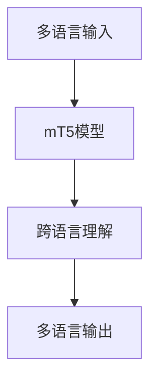

# T5系列模型

<cite>
**本文档中引用的文件**  
- [t5.py](file://src/transformers/models/t5/modeling_t5.py)
- [configuration_t5.py](file://src/transformers/models/t5/configuration_t5.py)
- [tokenization_t5.py](file://src/transformers/models/t5/tokenization_t5.py)
- [mt5.py](file://src/transformers/models/mt5/modeling_mt5.py)
- [configuration_mt5.py](file://src/transformers/models/mt5/configuration_mt5.py)
- [longt5.py](file://src/transformers/models/longt5/modeling_longt5.py)
- [configuration_longt5.py](file://src/transformers/models/longt5/configuration_longt5.py)
</cite>

## 目录
1. [简介](#简介)
2. [T5模型架构](#t5模型架构)
3. [mT5多语言模型](#mt5多语言模型)
4. [LongT5长文本处理](#longt5长文本处理)
5. [模型配置参数](#模型配置参数)
6. [T5Tokenizer使用方法](#t5tokenizer使用方法)
7. [任务转换与代码示例](#任务转换与代码示例)
8. [模型选择建议](#模型选择建议)

## 简介
T5系列模型是基于文本到文本转换框架的编码器-解码器模型，将所有自然语言处理任务统一为文本生成任务。该系列包括T5、mT5和LongT5等变体，每个模型都针对特定需求进行了优化。T5模型的核心创新在于将各种NLP任务（如翻译、摘要、问答等）都视为文本到文本的转换问题，通过在输入文本前添加特定前缀来指示任务类型。

**Section sources**
- [t5.py](file://src/transformers/models/t5/modeling_t5.py#L1-L50)
- [t5.md](file://docs/source/en/model_doc/t5.md#L1-L20)

## T5模型架构
T5模型采用标准的编码器-解码器Transformer架构，将所有NLP任务统一为文本到文本的转换任务。其核心思想是将任何自然语言处理问题都视为从输入文本到输出文本的映射，通过在输入前添加任务特定的前缀来区分不同任务。

T5的预训练任务采用"span corruption"（跨度损坏）方法，即随机选择输入文本中的连续跨度并用特殊标记替换，然后让模型预测这些被替换的文本。这种方法使得模型能够学习到更丰富的语言表示。


**Diagram sources**
- [t5.py](file://src/transformers/models/t5/modeling_t5.py#L100-L200)
- [configuration_t5.py](file://src/transformers/models/t5/configuration_t5.py#L50-L100)

**Section sources**
- [t5.py](file://src/transformers/models/t5/modeling_t5.py#L1-L200)
- [configuration_t5.py](file://src/transformers/models/t5/configuration_t5.py#L1-L150)

## mT5多语言模型
mT5是T5的多语言版本，专门设计用于处理100多种语言的自然语言处理任务。它在T5的基础上进行了优化，以更好地支持多语言场景。mT5使用了更大的词汇表（默认大小为250,112），这使其能够有效地处理多种语言的文本。

mT5的关键特点包括：
- 支持101种语言的预训练
- 使用统一的多语言词汇表
- 在多语言任务上表现出色
- 保持了T5的文本到文本转换框架

mT5的配置参数与T5有所不同，例如默认使用8个隐藏层和6个注意力头，前馈网络大小为1024，这些参数设置使其在多语言任务上具有更好的性能。



**Diagram sources**
- [mt5.py](file://src/transformers/models/mt5/modeling_mt5.py#L100-L200)
- [configuration_mt5.py](file://src/transformers/models/mt5/configuration_mt5.py#L50-L100)

**Section sources**
- [mt5.py](file://src/transformers/models/mt5/modeling_mt5.py#L1-L200)
- [configuration_mt5.py](file://src/transformers/models/mt5/configuration_mt5.py#L1-L150)

## LongT5长文本处理
LongT5是T5的扩展版本，专门设计用于处理长文本序列。它通过引入局部-全局注意力机制来解决传统Transformer模型在处理长文本时的计算复杂度问题。

LongT5的主要改进包括：
- **局部注意力**：每个token只关注其邻近的固定数量的token
- **全局注意力**：某些关键token可以关注整个序列
- 支持更长的输入序列
- 降低计算复杂度

LongT5提供了两种注意力机制选择："local"（局部）和"transient-global"（瞬态全局），用户可以根据具体任务需求进行选择。配置中的`local_radius`参数定义了每个token关注的邻近token数量，而`global_block_size`参数则定义了全局注意力块的大小。


**Diagram sources**
- [longt5.py](file://src/transformers/models/longt5/modeling_longt5.py#L500-L600)
- [configuration_longt5.py](file://src/transformers/models/longt5/configuration_longt5.py#L50-L100)

**Section sources**
- [longt5.py](file://src/transformers/models/longt5/modeling_longt5.py#L1-L700)
- [configuration_longt5.py](file://src/transformers/models/longt5/configuration_longt5.py#L1-L150)

## 模型配置参数
T5系列模型的配置参数对其性能有重要影响。以下是关键参数的说明：

| 参数 | 描述 | 默认值 | 影响 |
|------|------|--------|------|
| d_model | 编码器和池化层的大小 | 512 | 决定模型的表示能力 |
| num_layers | Transformer编码器中的隐藏层数 | 6 | 影响模型深度和复杂度 |
| num_heads | 每个注意力层的注意力头数 | 8 | 影响并行注意力计算 |
| d_ff | 中间前馈层的大小 | 2048 | 影响模型的非线性变换能力 |
| dropout_rate | 所有dropout层的比例 | 0.1 | 影响模型的正则化程度 |
| feed_forward_proj | 前馈层的激活函数类型 | "relu" | 影响模型的非线性特性 |

mT5和LongT5有各自的特定参数：
- mT5: vocab_size=250112, num_layers=8, num_heads=6, d_ff=1024
- LongT5: local_radius=127, global_block_size=16, encoder_attention_type="local"

**Section sources**
- [configuration_t5.py](file://src/transformers/models/t5/configuration_t5.py#L100-L150)
- [configuration_mt5.py](file://src/transformers/models/mt5/configuration_mt5.py#L100-L150)
- [configuration_longt5.py](file://src/transformers/models/longt5/configuration_longt5.py#L100-L150)

## T5Tokenizer使用方法
T5Tokenizer基于SentencePiece实现，是T5系列模型的专用分词器。它支持特殊标记的处理，特别是用于跨度损坏任务的额外ID标记。

T5Tokenizer的关键特性包括：
- 使用SentencePiece进行子词分词
- 支持额外ID标记（extra_ids）
- 可以添加前缀空格
- 支持遗留模式（legacy mode）

使用T5Tokenizer时，可以通过添加特定前缀来指定任务类型，例如：
- "translate English to German: " 用于翻译任务
- "summarize: " 用于摘要任务
- "question: " 用于问答任务

```python
from transformers import AutoTokenizer

tokenizer = AutoTokenizer.from_pretrained("google-t5/t5-base")
input_text = "translate English to French: The weather is nice today."
inputs = tokenizer(input_text, return_tensors="pt")
```

**Section sources**
- [tokenization_t5.py](file://src/transformers/models/t5/tokenization_t5.py#L1-L200)
- [t5.md](file://docs/source/en/model_doc/t5.md#L100-L150)

## 任务转换与代码示例
T5系列模型通过将不同NLP任务转换为文本到文本格式来实现统一处理。以下是各种任务的转换示例：

### 翻译任务
```python
from transformers import AutoModelForSeq2SeqLM, AutoTokenizer

model = AutoModelForSeq2SeqLM.from_pretrained("google-t5/t5-base")
tokenizer = AutoTokenizer.from_pretrained("google-t5/t5-base")

input_text = "translate English to French: The weather is nice today."
inputs = tokenizer(input_text, return_tensors="pt")
outputs = model.generate(**inputs)
result = tokenizer.decode(outputs[0], skip_special_tokens=True)
```

### 摘要任务
```python
input_text = "summarize: The weather is nice today. We went for a walk in the park. It was a beautiful day."
inputs = tokenizer(input_text, return_tensors="pt")
outputs = model.generate(**inputs)
summary = tokenizer.decode(outputs[0], skip_special_tokens=True)
```

### 问答任务
```python
input_text = "question: What is the capital of France? context: France is a country in Europe. Its capital is Paris."
inputs = tokenizer(input_text, return_tensors="pt")
outputs = model.generate(**inputs)
answer = tokenizer.decode(outputs[0], skip_special_tokens=True)
```

**Section sources**
- [t5.py](file://src/transformers/models/t5/modeling_t5.py#L1000-L1200)
- [t5.md](file://docs/source/en/model_doc/t5.md#L50-L100)

## 模型选择建议
根据不同的应用场景，选择合适的T5系列模型：

| 模型 | 适用场景 | 内存占用 | 性能特点 |
|------|---------|---------|---------|
| T5 | 单语言任务、通用NLP任务 | 中等 | 平衡的性能和效率 |
| mT5 | 多语言任务、跨语言应用 | 较高 | 优秀的多语言支持 |
| LongT5 | 长文本处理、文档级任务 | 高 | 专门优化的长序列处理 |

对于资源受限的环境，可以考虑使用较小的变体（如t5-small或mt5-small）；对于需要高精度的任务，建议使用较大的变体（如t5-11b或mt5-xxl）。在处理长文档时，LongT5通常是最佳选择，因为它专门针对长序列进行了优化。

**Section sources**
- [t5.md](file://docs/source/en/model_doc/t5.md#L1-L150)
- [longt5.md](file://docs/source/en/model_doc/longt5.md#L1-L50)
- [configuration_t5.py](file://src/transformers/models/t5/configuration_t5.py#L1-L150)