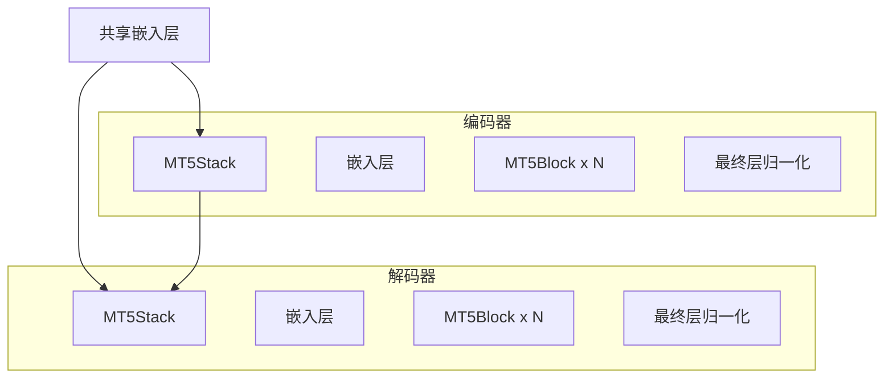
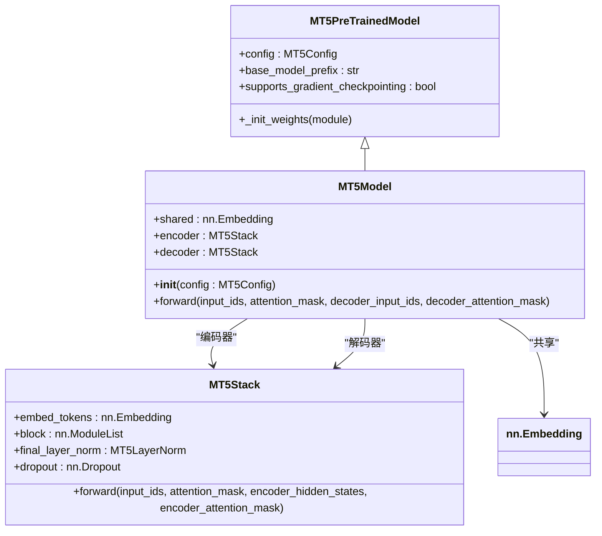
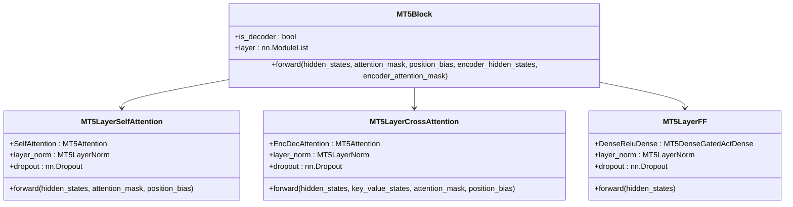
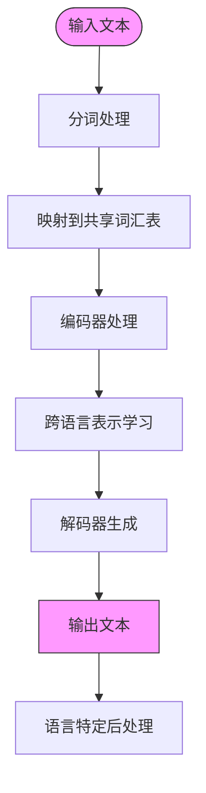

# mT5多语言模型

<cite>
**本文档中引用的文件**  
- [modeling_mt5.py](file://src/transformers/models/mt5/modeling_mt5.py)
- [configuration_mt5.py](file://src/transformers/models/mt5/configuration_mt5.py)
- [tokenization_mt5.py](file://src/transformers/models/mt5/tokenization_mt5.py)
- [tokenization_mt5_fast.py](file://src/transformers/models/mt5/tokenization_mt5_fast.py)
- [model_doc/mt5.md](file://docs/source/en/model_doc/mt5.md)
</cite>

## 目录
1. [简介](#简介)
2. [架构概述](#架构概述)
3. [核心组件分析](#核心组件分析)
4. [多语言支持机制](#多语言支持机制)
5. [配置参数详解](#配置参数详解)
6. [应用场景与代码示例](#应用场景与代码示例)
7. [性能基准测试](#性能基准测试)
8. [最佳实践建议](#最佳实践建议)
9. [结论](#结论)

## 简介
mT5（multilingual T5）是T5模型的多语言变体，专为处理101种语言的文本转换任务而设计。该模型在T5架构基础上进行了扩展，通过共享词汇表和跨语言迁移学习，实现了强大的多语言理解与生成能力。mT5采用了一种称为"意外翻译"的技术，防止模型在预测时错误地将输出翻译成错误的语言。该模型在mc4数据集上进行预训练，需要针对下游任务进行微调。

## 架构概述
mT5基于T5的编码器-解码器架构，采用标准的Transformer结构。模型包含一个编码器堆栈和一个解码器堆栈，两者都由多个MT5Block组成。每个MT5Block包含自注意力层、交叉注意力层（仅解码器）和前馈网络层。mT5保持了T5的核心架构特性，同时针对多语言处理进行了优化。



**图示来源**
- [modeling_mt5.py](file://src/transformers/models/mt5/modeling_mt5.py#L1000-L1500)

## 核心组件分析

### MT5Model分析
MT5Model是mT5模型的核心实现，继承自MT5PreTrainedModel。该模型实现了标准的编码器-解码器架构，支持序列到序列的任务。



**图示来源**
- [modeling_mt5.py](file://src/transformers/models/mt5/modeling_mt5.py#L1000-L1500)

**本节来源**
- [modeling_mt5.py](file://src/transformers/models/mt5/modeling_mt5.py#L1000-L1500)

### MT5Block分析
MT5Block是模型的基本构建单元，包含自注意力层、交叉注意力层（仅解码器）和前馈网络层。



**图示来源**
- [modeling_mt5.py](file://src/transformers/models/mt5/modeling_mt5.py#L400-L600)

**本节来源**
- [modeling_mt5.py](file://src/transformers/models/mt5/modeling_mt5.py#L400-L600)

## 多语言支持机制
mT5通过共享词汇表和跨语言迁移学习来处理多语言文本转换任务。模型使用一个包含250,112个标记的大型共享词汇表，能够覆盖101种语言的词汇需求。这种设计允许模型在不同语言之间共享语言学知识，实现跨语言迁移学习。

### 词汇表设计
mT5的词汇表大小为250,112，远大于原始T5的词汇表。这个大型共享词汇表是通过在多语言C4（mC4）数据集上训练SentencePiece模型得到的。词汇表设计的关键特点包括：

- **共享词汇表**：所有语言共享同一个词汇表，而不是为每种语言维护独立的词汇表
- **子词分词**：使用SentencePiece进行子词分词，能够处理未登录词和形态丰富的语言
- **跨语言表示**：相似的语义概念在不同语言中可能有相似的表示，促进跨语言迁移

### 跨语言迁移学习
mT5通过以下机制实现跨语言迁移学习：

1. **多语言预训练**：在包含101种语言的mC4数据集上进行预训练
2. **共享参数**：所有语言共享模型参数，强制模型学习跨语言的通用表示
3. **语言无关任务**：使用文本到文本的统一框架，将所有NLP任务表示为文本转换任务

### 特殊实现
在modeling_mt5.py中，mT5针对多语言处理有以下特殊实现：

- **相对注意力偏差**：使用相对位置编码来处理不同长度的序列
- **梯度检查点**：支持梯度检查点以减少内存使用
- **共享嵌入**：编码器和解码器共享嵌入层权重



**图示来源**
- [modeling_mt5.py](file://src/transformers/models/mt5/modeling_mt5.py)
- [tokenization_mt5.py](file://src/transformers/models/mt5/tokenization_mt5.py)

**本节来源**
- [modeling_mt5.py](file://src/transformers/models/mt5/modeling_mt5.py)
- [configuration_mt5.py](file://src/transformers/models/mt5/configuration_mt5.py)

## 配置参数详解
mT5的配置参数在MT5Config类中定义，包含以下关键参数：

| 参数 | 默认值 | 描述 |
|------|-------|------|
| vocab_size | 250112 | 词汇表大小，定义了模型能表示的不同标记数量 |
| d_model | 512 | 编码器层和池化层的大小 |
| d_kv | 64 | 每个注意力头的键、查询、值投影大小 |
| d_ff | 1024 | 每个T5Block中前馈层的中间层大小 |
| num_layers | 8 | Transformer编码器中的隐藏层数量 |
| num_heads | 6 | 编码器中每个注意力层的注意力头数量 |
| relative_attention_num_buckets | 32 | 每个注意力层使用的桶数量 |
| relative_attention_max_distance | 128 | 桶分离的最长序列最大距离 |
| dropout_rate | 0.1 | 所有dropout层的比例 |
| classifier_dropout | 0.0 | 分类器的dropout比例 |
| layer_norm_epsilon | 1e-6 | 层归一化层使用的epsilon值 |
| feed_forward_proj | "gated-gelu" | 前馈层使用的类型 |

**本节来源**
- [configuration_mt5.py](file://src/transformers/models/mt5/configuration_mt5.py#L50-L100)

## 应用场景与代码示例
mT5可用于多种多语言NLP任务，包括多语言翻译、跨语言问答和多语言摘要。

### 多语言翻译
```python
from transformers import AutoModelForSeq2SeqLM, AutoTokenizer

model = AutoModelForSeq2SeqLM.from_pretrained("google/mt5-small")
tokenizer = AutoTokenizer.from_pretrained("google/mt5-small")

# 将英文翻译为中文
input_text = "Hello, how are you?"
input_ids = tokenizer(input_text, return_tensors="pt").input_ids

outputs = model.generate(input_ids, max_length=50)
print(tokenizer.decode(outputs[0], skip_special_tokens=True))
```

### 多语言摘要
```python
import torch
from transformers import pipeline

summarizer = pipeline(
    task="text2text-generation",
    model="csebuetnlp/mT5_multilingual_XLSum",
    dtype=torch.float16,
    device=0
)

text = """Plants are remarkable organisms that produce their own food using a method called photosynthesis.
This process involves converting sunlight, carbon dioxide, and water into glucose, which provides energy for growth."""
summary = summarizer(text)
print(summary)
```

### 跨语言问答
```python
from transformers import AutoModelForQuestionAnswering, AutoTokenizer

model = AutoModelForQuestionAnswering.from_pretrained("google/mt5-small")
tokenizer = AutoTokenizer.from_pretrained("google/mt5-small")

context = "地球是太阳系中的第三颗行星。"
question = "地球在太阳系中的位置是什么？"

inputs = tokenizer(question, context, return_tensors="pt")
outputs = model(**inputs)

answer_start = outputs.start_logits.argmax()
answer_end = outputs.end_logits.argmax() + 1
answer = tokenizer.convert_tokens_to_string(
    tokenizer.convert_ids_to_tokens(inputs["input_ids"][0][answer_start:answer_end])
)
print(answer)
```

**本节来源**
- [model_doc/mt5.md](file://docs/source/en/model_doc/mt5.md)
- [modeling_mt5.py](file://src/transformers/models/mt5/modeling_mt5.py)

## 性能基准测试
mT5在多种多语言任务上进行了基准测试，表现出色。根据文档中的信息，mT5在XLSum数据集上的多语言摘要任务中表现优异。模型有多个尺寸变体，包括mt5-small、mt5-base、mt5-large、mt5-xl和mt5-xxl，以适应不同的资源约束。

### 资源消耗
mT5的资源消耗随模型尺寸增加而增加：

- **mt5-small**：约3亿参数，适合资源受限环境
- **mt5-base**：约6亿参数，平衡性能和资源消耗
- **mt5-large**：约12亿参数，提供更好的性能
- **mt5-xl**：约37亿参数，高性能需求场景
- **mt5-xxl**：约137亿参数，最先进的性能

### 语言族表现差异
mT5在不同语言族上的表现存在差异，通常在资源丰富的语言（如英语、中文、西班牙语）上表现更好，而在低资源语言上表现相对较弱。这种差异是由于训练数据的不平衡造成的，高资源语言在mC4数据集中有更多文本。

**本节来源**
- [model_doc/mt5.md](file://docs/source/en/model_doc/mt5.md)
- [configuration_mt5.py](file://src/transformers/models/mt5/configuration_mt5.py)

## 最佳实践建议
在使用mT5进行多语言应用时，建议遵循以下最佳实践：

1. **选择合适的模型尺寸**：根据计算资源和性能需求选择合适的mT5变体
2. **微调下游任务**：mT5需要针对具体下游任务进行微调，因为它是预训练模型
3. **使用量化技术**：对于资源受限环境，可以使用bitsandbytes等量化技术减少内存占用
4. **处理低资源语言**：对于低资源语言，考虑使用数据增强或迁移学习技术
5. **监控跨语言迁移**：注意模型在不同语言间的迁移效果，避免负迁移

### 量化示例
```python
from transformers import BitsAndBytesConfig, AutoModelForSeq2SeqLM

quantization_config = BitsAndBytesConfig(
    load_in_4bit=True,
    bnb_4bit_compute_dtype=torch.bfloat16,
    bnb_4bit_quant_type="nf4"
)

model = AutoModelForSeq2SeqLM.from_pretrained(
    "csebuetnlp/mT5_multilingual_XLSum",
    quantization_config=quantization_config
)
```

**本节来源**
- [model_doc/mt5.md](file://docs/source/en/model_doc/mt5.md)

## 结论
mT5是一个强大的多语言文本到文本转换模型，通过共享词汇表和跨语言迁移学习，在101种语言上表现出色。模型在T5架构基础上进行了优化，支持多种NLP任务，包括翻译、摘要和问答。通过合理选择模型尺寸和应用最佳实践，mT5可以在各种多语言应用场景中提供优秀的性能。