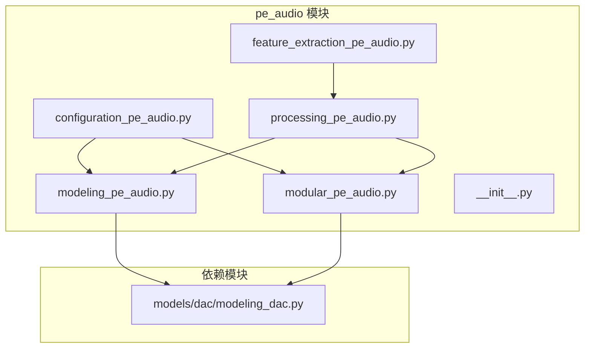
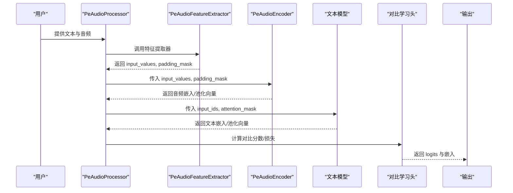
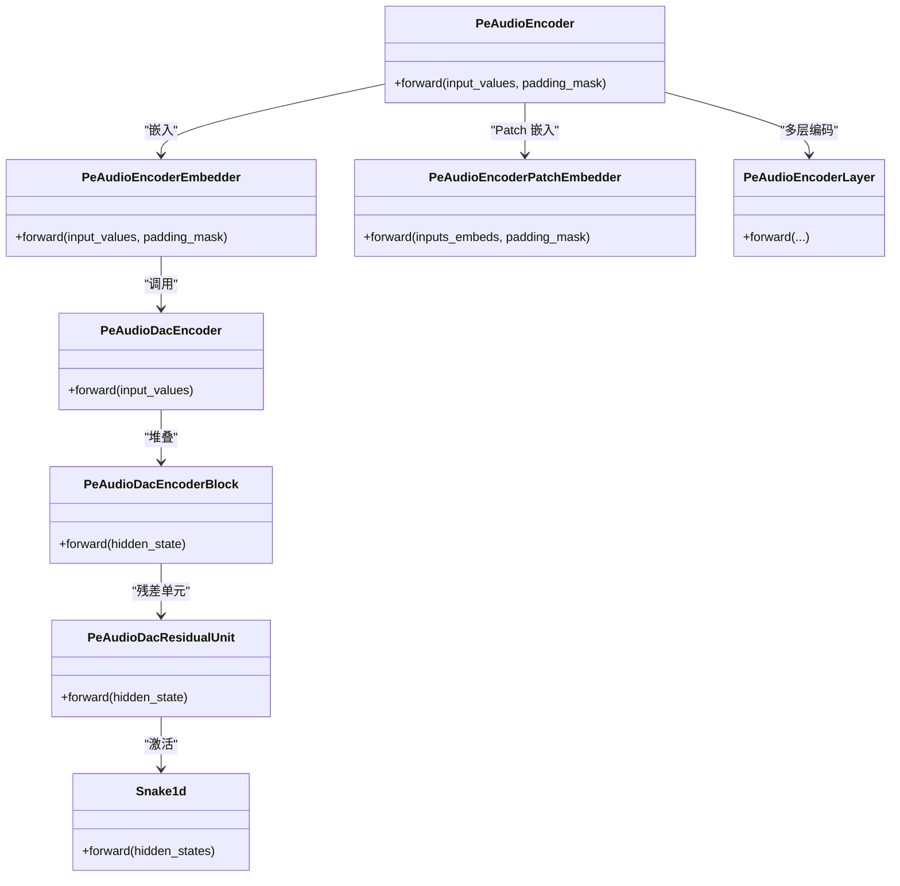
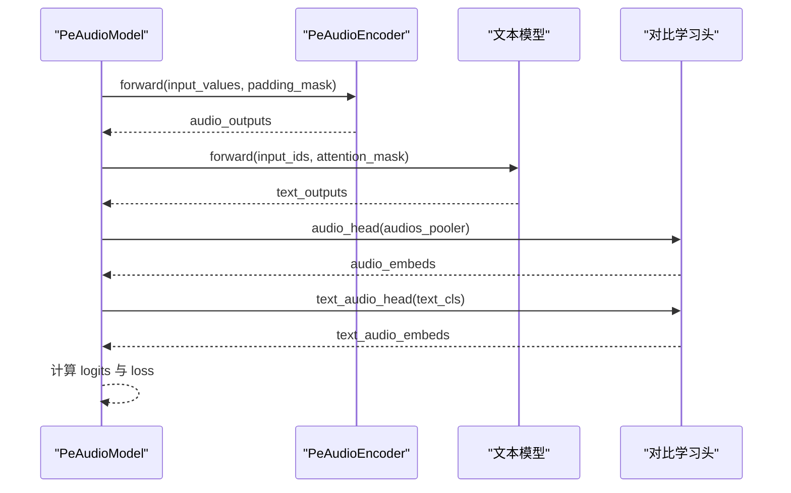
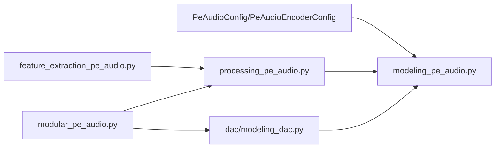

# PE-Audio 模型

<cite>
**本文引用的文件列表**
- [src/transformers/models/pe_audio/__init__.py](file://src/transformers/models/pe_audio/__init__.py)
- [src/transformers/models/pe_audio/configuration_pe_audio.py](file://src/transformers/models/pe_audio/configuration_pe_audio.py)
- [src/transformers/models/pe_audio/feature_extraction_pe_audio.py](file://src/transformers/models/pe_audio/feature_extraction_pe_audio.py)
- [src/transformers/models/pe_audio/modeling_pe_audio.py](file://src/transformers/models/pe_audio/modeling_pe_audio.py)
- [src/transformers/models/pe_audio/modular_pe_audio.py](file://src/transformers/models/pe_audio/modular_pe_audio.py)
- [src/transformers/models/pe_audio/processing_pe_audio.py](file://src/transformers/models/pe_audio/processing_pe_audio.py)
- [src/transformers/models/dac/modeling_dac.py](file://src/transformers/models/dac/modeling_dac.py)
- [tests/models/pe_audio/test_modeling_pe_audio.py](file://tests/models/pe_audio/test_modeling_pe_audio.py)
</cite>

## 目录
1. [简介](#简介)
2. [项目结构](#项目结构)
3. [核心组件](#核心组件)
4. [架构总览](#架构总览)
5. [详细组件分析](#详细组件分析)
6. [依赖关系分析](#依赖关系分析)
7. [性能与优化建议](#性能与优化建议)
8. [故障排查指南](#故障排查指南)
9. [结论](#结论)
10. [附录：使用示例与接口说明](#附录使用示例与接口说明)

## 简介
PE-Audio 是一个面向音频-文本对比学习的多模态模型，包含：
- 音频编码器（基于 DAC 的离散表示 + 自定义 Transformer 编码层）
- 文本编码器（默认使用 ModernBERT）
- 对比学习头（将音频与文本嵌入映射到同一语义空间）

该模块提供完整的配置、特征提取、建模与处理器封装，支持逐帧级与全局级对比学习两种输出形态。

## 项目结构
PE-Audio 模块位于 transformers 库的 models 子目录中，采用“按功能分层”的组织方式：
- configuration_pe_audio.py：定义 PeAudioConfig 与 PeAudioEncoderConfig
- feature_extraction_pe_audio.py：音频特征提取器，负责采样率校验、反射填充、批处理与掩码生成
- modeling_pe_audio.py：主模型实现（含 DAC 编码器、自定义注意力/RoPE、编码层、对比学习头等）
- modular_pe_audio.py：模块化版本（复用 dac 与 pe_audio_video 的实现）
- processing_pe_audio.py：统一处理器，组合特征提取器与分词器
- __init__.py：延迟导入结构定义

图表来源
- [src/transformers/models/pe_audio/configuration_pe_audio.py](file://src/transformers/models/pe_audio/configuration_pe_audio.py#L1-L207)
- [src/transformers/models/pe_audio/feature_extraction_pe_audio.py](file://src/transformers/models/pe_audio/feature_extraction_pe_audio.py#L1-L163)
- [src/transformers/models/pe_audio/modeling_pe_audio.py](file://src/transformers/models/pe_audio/modeling_pe_audio.py#L1-L821)
- [src/transformers/models/pe_audio/modular_pe_audio.py](file://src/transformers/models/pe_audio/modular_pe_audio.py#L1-L300)
- [src/transformers/models/pe_audio/processing_pe_audio.py](file://src/transformers/models/pe_audio/processing_pe_audio.py#L1-L25)
- [src/transformers/models/dac/modeling_dac.py](file://src/transformers/models/dac/modeling_dac.py#L1-L200)

章节来源
- [src/transformers/models/pe_audio/__init__.py](file://src/transformers/models/pe_audio/__init__.py#L1-L31)
- [src/transformers/models/pe_audio/configuration_pe_audio.py](file://src/transformers/models/pe_audio/configuration_pe_audio.py#L1-L207)
- [src/transformers/models/pe_audio/feature_extraction_pe_audio.py](file://src/transformers/models/pe_audio/feature_extraction_pe_audio.py#L1-L163)
- [src/transformers/models/pe_audio/modeling_pe_audio.py](file://src/transformers/models/pe_audio/modeling_pe_audio.py#L1-L821)
- [src/transformers/models/pe_audio/modular_pe_audio.py](file://src/transformers/models/pe_audio/modular_pe_audio.py#L1-L300)
- [src/transformers/models/pe_audio/processing_pe_audio.py](file://src/transformers/models/pe_audio/processing_pe_audio.py#L1-L25)
- [src/transformers/models/dac/modeling_dac.py](file://src/transformers/models/dac/modeling_dac.py#L1-L200)

## 核心组件
- 配置类
  - PeAudioEncoderConfig：定义音频编码器的 Transformer 结构、RoPE 参数、DAC 配置等
  - PeAudioConfig：聚合文本与音频配置，并提供默认值
- 特征提取器 PeAudioFeatureExtractor：负责加载音频、反射填充、批处理与掩码生成
- 模型 PeAudioEncoder：基于 DAC 的离散表示 + 自定义 Transformer 编码层
- 模型 PeAudioModel / PeAudioFrameLevelModel：多模态对比学习主干，支持全局或逐帧对比
- 处理器 PeAudioProcessor：统一封装特征提取器与分词器

章节来源
- [src/transformers/models/pe_audio/configuration_pe_audio.py](file://src/transformers/models/pe_audio/configuration_pe_audio.py#L26-L206)
- [src/transformers/models/pe_audio/feature_extraction_pe_audio.py](file://src/transformers/models/pe_audio/feature_extraction_pe_audio.py#L28-L160)
- [src/transformers/models/pe_audio/modeling_pe_audio.py](file://src/transformers/models/pe_audio/modeling_pe_audio.py#L615-L800)
- [src/transformers/models/pe_audio/modular_pe_audio.py](file://src/transformers/models/pe_audio/modular_pe_audio.py#L105-L293)
- [src/transformers/models/pe_audio/processing_pe_audio.py](file://src/transformers/models/pe_audio/processing_pe_audio.py#L18-L24)

## 架构总览
PE-Audio 的整体流程如下：
- 输入音频经特征提取器进行采样率校验、反射填充与批处理，得到 input_values 与 padding_mask
- 音频编码器通过 DAC 将波形转为离散表示，再投影到隐藏维度，拼接分类 token 后进入 Transformer 编码层
- 文本编码器（默认 ModernBERT）对输入文本进行编码
- 对比学习头将音频与文本嵌入映射到同一空间，计算相似度矩阵并可选地返回损失

图表来源
- [src/transformers/models/pe_audio/processing_pe_audio.py](file://src/transformers/models/pe_audio/processing_pe_audio.py#L18-L24)
- [src/transformers/models/pe_audio/feature_extraction_pe_audio.py](file://src/transformers/models/pe_audio/feature_extraction_pe_audio.py#L65-L160)
- [src/transformers/models/pe_audio/modeling_pe_audio.py](file://src/transformers/models/pe_audio/modeling_pe_audio.py#L692-L800)
- [src/transformers/models/pe_audio/modular_pe_audio.py](file://src/transformers/models/pe_audio/modular_pe_audio.py#L167-L293)

## 详细组件分析

### 配置系统
- PeAudioEncoderConfig
  - 关键字段：hidden_size、intermediate_size、num_hidden_layers、num_attention_heads、num_key_value_heads、head_dim、hidden_act、max_position_embeddings、initializer_range、rms_norm_eps、rope_parameters、attention_bias、attention_dropout、dac_config
  - 默认 DAC 配置：包含 downsampling_ratios、encoder_hidden_size、codebook_dim 等
- PeAudioConfig
  - 关键字段：text_config、audio_config
  - 默认文本配置：ModernBERT 的 hidden_size、intermediate_size、num_hidden_layers、num_attention_heads 等

章节来源
- [src/transformers/models/pe_audio/configuration_pe_audio.py](file://src/transformers/models/pe_audio/configuration_pe_audio.py#L26-L206)

### 音频特征提取器
- 主要职责
  - 加载音频（支持从文件路径或数组输入）
  - 反射填充以满足 hop_length 对齐
  - 批处理与 padding/mask 生成
  - 采样率校验与警告
- 关键行为
  - 支持单声道输入
  - 默认 padding=True
  - 输出包含 input_values 与 padding_mask（重命名为 attention_mask）

章节来源
- [src/transformers/models/pe_audio/feature_extraction_pe_audio.py](file://src/transformers/models/pe_audio/feature_extraction_pe_audio.py#L28-L160)

### 音频编码器（PeAudioEncoder）
- DAC 编码链路
  - DacEncoder：多阶段下采样与残差单元堆叠
  - Snake1d 激活与卷积构成残差单元
  - 末端瓶颈与线性投影将离散表示映射到隐藏维度
- Patch 嵌入与分类 token
  - 在序列前添加分类 token，随后通过一维残差块进行进一步嵌入
- Transformer 编码层
  - 自定义注意力（支持分组查询注意力、RoPE）
  - RMSNorm + MLP（门控+上/下投影）
  - 位置编码由 PeAudioEncoderRotaryEmbedding 生成
- 输出
  - last_hidden_state（去除了分类 token）与 pooler_output（分类 token）

图表来源
- [src/transformers/models/pe_audio/modeling_pe_audio.py](file://src/transformers/models/pe_audio/modeling_pe_audio.py#L125-L210)
- [src/transformers/models/pe_audio/modeling_pe_audio.py](file://src/transformers/models/pe_audio/modeling_pe_audio.py#L269-L300)
- [src/transformers/models/pe_audio/modeling_pe_audio.py](file://src/transformers/models/pe_audio/modeling_pe_audio.py#L365-L434)
- [src/transformers/models/pe_audio/modeling_pe_audio.py](file://src/transformers/models/pe_audio/modeling_pe_audio.py#L452-L495)
- [src/transformers/models/pe_audio/modeling_pe_audio.py](file://src/transformers/models/pe_audio/modeling_pe_audio.py#L620-L673)

章节来源
- [src/transformers/models/pe_audio/modeling_pe_audio.py](file://src/transformers/models/pe_audio/modeling_pe_audio.py#L125-L210)
- [src/transformers/models/pe_audio/modeling_pe_audio.py](file://src/transformers/models/pe_audio/modeling_pe_audio.py#L269-L300)
- [src/transformers/models/pe_audio/modeling_pe_audio.py](file://src/transformers/models/pe_audio/modeling_pe_audio.py#L365-L434)
- [src/transformers/models/pe_audio/modeling_pe_audio.py](file://src/transformers/models/pe_audio/modeling_pe_audio.py#L452-L495)
- [src/transformers/models/pe_audio/modeling_pe_audio.py](file://src/transformers/models/pe_audio/modeling_pe_audio.py#L620-L673)

### 多模态对比学习模型
- PeAudioModel
  - 组合文本模型与音频编码器
  - 通过对比学习头将音频与文本映射到同一空间
  - 计算 logits_audio_text 并可选返回损失
- PeAudioFrameLevelModel
  - 返回逐帧音频嵌入，便于时序任务
- 对比学习头
  - LayerNorm + 线性层，输出与文本维度一致

图表来源
- [src/transformers/models/pe_audio/modeling_pe_audio.py](file://src/transformers/models/pe_audio/modeling_pe_audio.py#L692-L764)
- [src/transformers/models/pe_audio/modeling_pe_audio.py](file://src/transformers/models/pe_audio/modeling_pe_audio.py#L769-L800)

章节来源
- [src/transformers/models/pe_audio/modeling_pe_audio.py](file://src/transformers/models/pe_audio/modeling_pe_audio.py#L692-L764)
- [src/transformers/models/pe_audio/modeling_pe_audio.py](file://src/transformers/models/pe_audio/modeling_pe_audio.py#L769-L800)

### 模块化实现（modular_pe_audio）
- 与 modeling_pe_audio 的差异
  - 复用 dac.modeling_dac 中的 DacEncoder/DacEncoderBlock/Snake1d
  - 复用 pe_audio_video 中的对比学习头与编码器基类
  - 保持相同的前向逻辑与输出结构
- 适用场景
  - 当需要与视频/多模态组件共享实现时，优先使用模块化版本

章节来源
- [src/transformers/models/pe_audio/modular_pe_audio.py](file://src/transformers/models/pe_audio/modular_pe_audio.py#L1-L300)
- [src/transformers/models/dac/modeling_dac.py](file://src/transformers/models/dac/modeling_dac.py#L1-L200)

### 处理器与延迟导入
- PeAudioProcessor
  - 统一管理 feature_extractor 与 tokenizer
- __init__.py
  - 使用 LazyModule 实现按需导入，避免启动时加载重型依赖

章节来源
- [src/transformers/models/pe_audio/processing_pe_audio.py](file://src/transformers/models/pe_audio/processing_pe_audio.py#L18-L24)
- [src/transformers/models/pe_audio/__init__.py](file://src/transformers/models/pe_audio/__init__.py#L17-L31)

## 依赖关系分析
- 内部依赖
  - modeling_pe_audio 依赖 configuration_pe_audio、feature_extraction_pe_audio、processing_pe_audio
  - modular_pe_audio 依赖 dac.modeling_dac 与 pe_audio_video 的实现
- 外部依赖
  - torch、torch.nn、ACT2FN、Cache、PreTrainedModel、ModelOutput 等
  - DAC 编码器用于将波形量化为离散表示

图表来源
- [src/transformers/models/pe_audio/modeling_pe_audio.py](file://src/transformers/models/pe_audio/modeling_pe_audio.py#L1-L80)
- [src/transformers/models/pe_audio/feature_extraction_pe_audio.py](file://src/transformers/models/pe_audio/feature_extraction_pe_audio.py#L1-L40)
- [src/transformers/models/pe_audio/processing_pe_audio.py](file://src/transformers/models/pe_audio/processing_pe_audio.py#L1-L25)
- [src/transformers/models/dac/modeling_dac.py](file://src/transformers/models/dac/modeling_dac.py#L1-L60)
- [src/transformers/models/pe_audio/modular_pe_audio.py](file://src/transformers/models/pe_audio/modular_pe_audio.py#L1-L40)

章节来源
- [src/transformers/models/pe_audio/modeling_pe_audio.py](file://src/transformers/models/pe_audio/modeling_pe_audio.py#L1-L80)
- [src/transformers/models/pe_audio/modular_pe_audio.py](file://src/transformers/models/pe_audio/modular_pe_audio.py#L1-L40)
- [src/transformers/models/dac/modeling_dac.py](file://src/transformers/models/dac/modeling_dac.py#L1-L60)

## 性能与优化建议
- 注意力实现
  - 支持多种注意力后端（eager、flash、sdpa、flex），可根据硬件选择最优实现
- 梯度检查点
  - 编码层支持梯度检查点以降低显存占用
- 掩码与填充
  - 使用反射填充确保 hop_length 对齐，减少频谱边缘效应
- 推理建议
  - 在 GPU 上启用合适的注意力后端
  - 对长音频序列考虑分段推理或降采样
- 训练建议
  - 使用对比学习头时注意 logit scale/bias 的初始化与更新策略

[本节为通用指导，不直接分析具体文件]

## 故障排查指南
- 采样率不匹配
  - 特征提取器会校验采样率，若与配置不一致会抛出错误；请确保输入音频采样率与配置一致
- 形状与通道问题
  - 单声道输入要求二维形状；立体声当前不支持
- 掩码与填充
  - padding 与 truncation 不可同时设置；默认 padding=True
- 模型输入
  - 音频编码器输入为 input_values，文本编码器输入为 input_ids；注意 attention_mask/padding_mask 的传递

章节来源
- [src/transformers/models/pe_audio/feature_extraction_pe_audio.py](file://src/transformers/models/pe_audio/feature_extraction_pe_audio.py#L74-L160)

## 结论
PE-Audio 提供了从音频离散表示到多模态对比学习的完整管线，具备清晰的配置、特征提取与建模接口。其模块化设计便于与视频/多模态组件复用，适合构建跨模态检索与时序理解任务。

[本节为总结性内容，不直接分析具体文件]

## 附录：使用示例与接口说明

### 配置与初始化
- 使用 PeAudioConfig/PeAudioEncoderConfig 定义模型结构
- 文本配置默认使用 ModernBERT，音频配置默认包含 DAC 与 Transformer 参数

章节来源
- [src/transformers/models/pe_audio/configuration_pe_audio.py](file://src/transformers/models/pe_audio/configuration_pe_audio.py#L26-L206)

### 特征提取与处理器
- 通过 PeAudioProcessor 统一处理文本与音频输入
- 特征提取器支持从文件路径加载音频、反射填充与批处理

章节来源
- [src/transformers/models/pe_audio/processing_pe_audio.py](file://src/transformers/models/pe_audio/processing_pe_audio.py#L18-L24)
- [src/transformers/models/pe_audio/feature_extraction_pe_audio.py](file://src/transformers/models/pe_audio/feature_extraction_pe_audio.py#L65-L160)

### 前向流程与输出
- 全局对比学习：PeAudioModel.forward 返回 logits_audio_text、audio_embeds、text_audio_embeds 与损失
- 逐帧对比学习：PeAudioFrameLevelModel.forward 返回逐帧 logits 与嵌入
- 音频编码器：PeAudioEncoder.forward 返回 last_hidden_state（去分类 token）与 pooler_output

章节来源
- [src/transformers/models/pe_audio/modeling_pe_audio.py](file://src/transformers/models/pe_audio/modeling_pe_audio.py#L692-L800)
- [src/transformers/models/pe_audio/modeling_pe_audio.py](file://src/transformers/models/pe_audio/modeling_pe_audio.py#L620-L673)

### 测试参考
- 单元测试覆盖了配置、编码器与多模态模型的基本行为
- 集成测试展示了从预训练权重加载与推理的流程

章节来源
- [tests/models/pe_audio/test_modeling_pe_audio.py](file://tests/models/pe_audio/test_modeling_pe_audio.py#L1-L387)