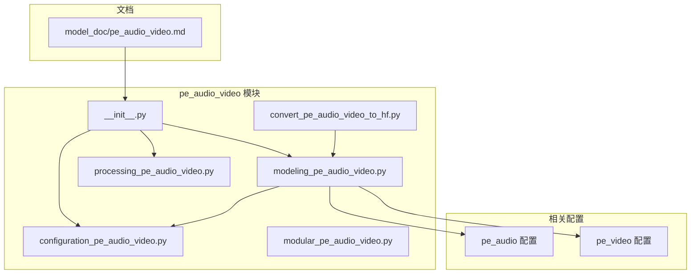
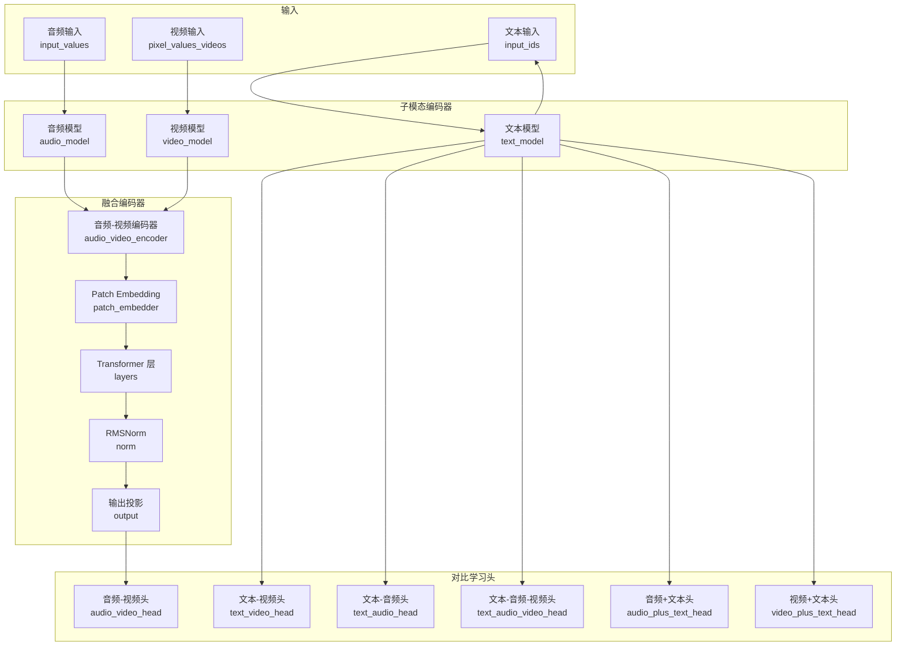
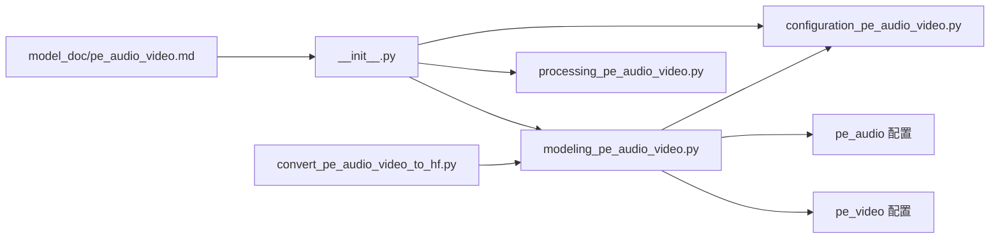

# PE-Audio-Video 模型

<cite>
**本文引用的文件**
- [src/transformers/models/pe_audio_video/__init__.py](file://src/transformers/models/pe_audio_video/__init__.py)
- [src/transformers/models/pe_audio_video/configuration_pe_audio_video.py](file://src/transformers/models/pe_audio_video/configuration_pe_audio_video.py)
- [src/transformers/models/pe_audio_video/modeling_pe_audio_video.py](file://src/transformers/models/pe_audio_video/modeling_pe_audio_video.py)
- [src/transformers/models/pe_audio_video/modular_pe_audio_video.py](file://src/transformers/models/pe_audio_video/modular_pe_audio_video.py)
- [src/transformers/models/pe_audio_video/processing_pe_audio_video.py](file://src/transformers/models/pe_audio_video/processing_pe_audio_video.py)
- [src/transformers/models/pe_audio_video/convert_pe_audio_video_to_hf.py](file://src/transformers/models/pe_audio_video/convert_pe_audio_video_to_hf.py)
- [src/transformers/models/pe_audio/configuration_pe_audio.py](file://src/transformers/models/pe_audio/configuration_pe_audio.py)
- [src/transformers/models/pe_video/configuration_pe_video.py](file://src/transformers/models/pe_video/configuration_pe_video.py)
- [docs/source/en/model_doc/pe_audio_video.md](file://docs/source/en/model_doc/pe_audio_video.md)
</cite>

## 目录
1. [简介](#简介)
2. [项目结构](#项目结构)
3. [核心组件](#核心组件)
4. [架构总览](#架构总览)
5. [详细组件分析](#详细组件分析)
6. [依赖关系分析](#依赖关系分析)
7. [性能与优化建议](#性能与优化建议)
8. [故障排查指南](#故障排查指南)
9. [结论](#结论)
10. [附录](#附录)

## 简介
PE-Audio-Video（Perception Encoder Audio-Video）是面向多模态感知任务的统一编码器与端到端模型，支持文本、音频与视频的联合建模与对比学习。该模型通过将音频与视频分别编码为统一维度的序列表示，并在共享的Transformer编码器中进行融合，从而实现跨模态检索与对齐。同时，模型提供多种嵌入头与对比学习损失，用于训练文本-音频、文本-视频、音频-视频以及三模态组合的对齐目标。

## 项目结构
PE-Audio-Video 模型位于 transformers 库的多模态模型目录下，采用“模块化生成 + 自动化适配”的设计：核心实现由模块化模板自动生成，便于维护与一致性；同时提供配置、处理器、转换脚本等配套工具。

图表来源
- [src/transformers/models/pe_audio_video/__init__.py](file://src/transformers/models/pe_audio_video/__init__.py#L1-L30)
- [src/transformers/models/pe_audio_video/configuration_pe_audio_video.py](file://src/transformers/models/pe_audio_video/configuration_pe_audio_video.py#L1-L226)
- [src/transformers/models/pe_audio_video/modeling_pe_audio_video.py](file://src/transformers/models/pe_audio_video/modeling_pe_audio_video.py#L1-L120)
- [src/transformers/models/pe_audio_video/modular_pe_audio_video.py](file://src/transformers/models/pe_audio_video/modular_pe_audio_video.py#L1-L120)
- [src/transformers/models/pe_audio_video/processing_pe_audio_video.py](file://src/transformers/models/pe_audio_video/processing_pe_audio_video.py#L1-L26)
- [src/transformers/models/pe_audio_video/convert_pe_audio_video_to_hf.py](file://src/transformers/models/pe_audio_video/convert_pe_audio_video_to_hf.py#L1-L126)
- [src/transformers/models/pe_audio/configuration_pe_audio.py](file://src/transformers/models/pe_audio/configuration_pe_audio.py#L1-L200)
- [src/transformers/models/pe_video/configuration_pe_video.py](file://src/transformers/models/pe_video/configuration_pe_video.py#L1-L200)
- [docs/source/en/model_doc/pe_audio_video.md](file://docs/source/en/model_doc/pe_audio_video.md#L1-L53)

章节来源
- [src/transformers/models/pe_audio_video/__init__.py](file://src/transformers/models/pe_audio_video/__init__.py#L1-L30)
- [src/transformers/models/pe_audio_video/configuration_pe_audio_video.py](file://src/transformers/models/pe_audio_video/configuration_pe_audio_video.py#L1-L226)
- [src/transformers/models/pe_audio_video/modeling_pe_audio_video.py](file://src/transformers/models/pe_audio_video/modeling_pe_audio_video.py#L1-L120)
- [src/transformers/models/pe_audio_video/modular_pe_audio_video.py](file://src/transformers/models/pe_audio_video/modular_pe_audio_video.py#L1-L120)
- [src/transformers/models/pe_audio_video/processing_pe_audio_video.py](file://src/transformers/models/pe_audio_video/processing_pe_audio_video.py#L1-L26)
- [src/transformers/models/pe_audio_video/convert_pe_audio_video_to_hf.py](file://src/transformers/models/pe_audio_video/convert_pe_audio_video_to_hf.py#L1-L126)
- [src/transformers/models/pe_audio/configuration_pe_audio.py](file://src/transformers/models/pe_audio/configuration_pe_audio.py#L1-L200)
- [src/transformers/models/pe_video/configuration_pe_video.py](file://src/transformers/models/pe_video/configuration_pe_video.py#L1-L200)
- [docs/source/en/model_doc/pe_audio_video.md](file://docs/source/en/model_doc/pe_audio_video.md#L1-L53)

## 核心组件
- 配置类
  - PeAudioVideoEncoderConfig：定义音频-视频融合编码器的超参数（隐藏维度、注意力头数、组查询注意力、RoPE 参数、初始化范围、归一化 epsilon 等），并内嵌音频与视频子配置。
  - PeAudioVideoConfig：定义端到端模型的配置，包含文本模型与音频-视频编码器配置，并提供派生的音频/视频专用配置。
- 编码器
  - PeAudioVideoEncoder：将输入的音频与视频编码为统一维度的序列表示，经过 Patch Embedding、多层 Transformer 编码器、RMSNorm 与输出线性层，返回池化向量与最后一层隐藏状态。
- 主模型
  - PeAudioVideoModel：整合文本模型、音频模型、视频模型与音频-视频编码器，提供多模态嵌入与对比学习头，支持文本-音频、文本-视频、音频-视频、三模态组合等多种任务。
- 处理器
  - PeAudioVideoProcessor：统一处理特征提取器、视频处理器与分词器，便于端到端数据预处理。
- 转换脚本
  - convert_pe_audio_video_to_hf.py：从外部权重转换为 HuggingFace 格式，包括键映射与权重重排逻辑。

章节来源
- [src/transformers/models/pe_audio_video/configuration_pe_audio_video.py](file://src/transformers/models/pe_audio_video/configuration_pe_audio_video.py#L1-L226)
- [src/transformers/models/pe_audio_video/modeling_pe_audio_video.py](file://src/transformers/models/pe_audio_video/modeling_pe_audio_video.py#L560-L973)
- [src/transformers/models/pe_audio_video/processing_pe_audio_video.py](file://src/transformers/models/pe_audio_video/processing_pe_audio_video.py#L1-L26)
- [src/transformers/models/pe_audio_video/convert_pe_audio_video_to_hf.py](file://src/transformers/models/pe_audio_video/convert_pe_audio_video_to_hf.py#L1-L126)

## 架构总览
PE-Audio-Video 的整体架构由“子模态编码器 + 融合编码器 + 对比学习头”构成。文本、音频与视频分别由对应的子模型编码，随后在音频-视频融合编码器中对齐与融合，最终通过多个对比学习头计算不同模态组合的对齐分数与损失。

图表来源
- [src/transformers/models/pe_audio_video/modeling_pe_audio_video.py](file://src/transformers/models/pe_audio_video/modeling_pe_audio_video.py#L560-L973)
- [src/transformers/models/pe_audio/configuration_pe_audio.py](file://src/transformers/models/pe_audio/configuration_pe_audio.py#L1-L200)
- [src/transformers/models/pe_video/configuration_pe_video.py](file://src/transformers/models/pe_video/configuration_pe_video.py#L1-L200)

## 详细组件分析

### 配置系统
- PeAudioVideoEncoderConfig
  - 关键字段：hidden_size、intermediate_size、num_hidden_layers、num_attention_heads、num_key_value_heads、head_dim、hidden_act、max_position_embeddings、initializer_range、rms_norm_eps、rope_parameters、attention_bias、attention_dropout。
  - 子配置：audio_config 与 video_config 通过 AutoConfig 动态解析，默认类型分别为 pe_audio_encoder 与 pe_video_encoder。
- PeAudioVideoConfig
  - 关键字段：text_config 与 audio_video_config。
  - 默认文本配置：modernbert，包含隐藏维度、中间维度、层数与注意力头数等默认值。
  - 派生配置：audio_config 与 video_config 通过 audio_video_config 的子配置构造。

章节来源
- [src/transformers/models/pe_audio_video/configuration_pe_audio_video.py](file://src/transformers/models/pe_audio_video/configuration_pe_audio_video.py#L1-L226)
- [src/transformers/models/pe_audio/configuration_pe_audio.py](file://src/transformers/models/pe_audio/configuration_pe_audio.py#L1-L200)
- [src/transformers/models/pe_video/configuration_pe_video.py](file://src/transformers/models/pe_video/configuration_pe_video.py#L1-L200)

### 编码器嵌入与对齐
- PeAudioVideoEncoderEmbedder
  - 将音频与视频分别送入各自的编码器，获取 last_hidden_state 与 output_mask。
  - 视频隐藏状态经 1x1 卷积投影到音频隐藏维度，再按长度对齐（最近邻插值），随后进行 LayerNorm。
  - 将对齐后的视频隐藏状态与音频隐藏状态拼接并通过线性层融合，得到 inputs_embeds。
- Patch Embedding
  - 在 inputs_embeds 前添加分类 token，再通过 ResNet 风格的 1D 卷积残差块进行特征变换，形成带 cls 的序列。

章节来源
- [src/transformers/models/pe_audio_video/modeling_pe_audio_video.py](file://src/transformers/models/pe_audio_video/modeling_pe_audio_video.py#L150-L243)

### 注意力与位置编码
- PeAudioVideoEncoderAttention
  - 支持组查询注意力（num_key_value_groups），使用 RMSNorm 归一化每个头维度，应用 RoPE 旋转位置编码。
  - 提供可切换的注意力实现接口（eager 与后端加速实现）。
- PeAudioVideoEncoderRotaryEmbedding
  - 基于配置中的 rope_parameters 计算逆频率与缩放因子，动态更新以支持扩展序列长度。
- 位置嵌入
  - 使用连续的 position_ids 计算 cos/sin，传入注意力模块。

章节来源
- [src/transformers/models/pe_audio_video/modeling_pe_audio_video.py](file://src/transformers/models/pe_audio_video/modeling_pe_audio_video.py#L245-L516)

### 编码器层与前馈网络
- PeAudioVideoEncoderLayer
  - 结构：输入归一化 -> 自注意力 -> 残差 -> 全连接前馈 -> 残差。
  - 使用 RMSNorm 与 SwiGLU 风格的门控前馈（gate_proj 与 up_proj）。
- PeAudioVideoEncoderRMSNorm
  - 等价于 T5LayerNorm，对最后一维做方差归一化并乘以可学习权重。

章节来源
- [src/transformers/models/pe_audio_video/modeling_pe_audio_video.py](file://src/transformers/models/pe_audio_video/modeling_pe_audio_video.py#L370-L451)

### 融合编码器与输出
- PeAudioVideoEncoder
  - 组装：Embedder -> Patch Embedder -> 多层编码器 -> Norm -> 输出线性层。
  - 返回：last_hidden_state（去掉 cls）、pooler_output（cls 向量）、以及子模型输出（音频与视频）。

章节来源
- [src/transformers/models/pe_audio_video/modeling_pe_audio_video.py](file://src/transformers/models/pe_audio_video/modeling_pe_audio_video.py#L560-L626)

### 主模型与对比学习
- PeAudioVideoModel
  - 组装：text_model、audio_model、video_model、audio_video_encoder。
  - 多头对比学习：
    - audio_video_head：音频与视频对比学习。
    - text_audio_head、text_video_head、text_audio_video_head：文本与单模态或三模态对比学习。
    - audio_plus_text_head、video_plus_text_head：文本与另一模态拼接后的对比学习。
  - 嵌入提取方法：
    - get_text_audio_embeds、get_text_video_embeds、get_text_audio_video_embeds
    - get_audio_embeds、get_video_embeds
    - get_audio_video_embeds（可选择返回音频/视频嵌入）
    - get_audio_plus_text_embeds、get_video_plus_text_embeds
  - 前向流程：
    - 至少提供两个输入（文本、音频、视频中的任意两个）。
    - 根据输入组合返回相应嵌入、logits 与损失（可选）。

章节来源
- [src/transformers/models/pe_audio_video/modeling_pe_audio_video.py](file://src/transformers/models/pe_audio_video/modeling_pe_audio_video.py#L679-L973)

### 处理器
- PeAudioVideoProcessor
  - attributes：feature_extractor、video_processor、tokenizer。
  - 类型：PeAudioFeatureExtractor、PeVideoVideoProcessor、AutoTokenizer。

章节来源
- [src/transformers/models/pe_audio_video/processing_pe_audio_video.py](file://src/transformers/models/pe_audio_video/processing_pe_audio_video.py#L1-L26)

### 权重转换
- convert_pe_audio_video_to_hf.py
  - 键映射：将原始权重键名映射到新模型结构。
  - 权重重排：针对 q/k 投影的权重维度进行重排以匹配 head_dim。
  - 保存与校验：保存为 safetensors 并重新加载验证。

章节来源
- [src/transformers/models/pe_audio_video/convert_pe_audio_video_to_hf.py](file://src/transformers/models/pe_audio_video/convert_pe_audio_video_to_hf.py#L1-L126)

## 依赖关系分析
- 模块导入与延迟加载
  - __init__.py 使用 LazyModule 与 define_import_structure，按需导入配置、建模与处理器模块。
- 配置依赖
  - PeAudioVideoConfig 依赖 AutoConfig，自动解析 text_config 与 audio_video_config。
  - audio_config 与 video_config 分别依赖 pe_audio 与 pe_video 的配置类。
- 模型依赖
  - modeling_pe_audio_video.py 依赖 modeling_utils、modeling_layers、modeling_outputs、modeling_rope_utils 等通用组件。
  - modular_pe_audio_video.py 作为模块化模板，复用 Qwen3 的注意力、解码器层与 RMSNorm 实现，提升一致性与性能。
- 文档与注册
  - model_doc/pe_audio_video.md 提供模型文档入口。
  - auto 注册表中已登记 pe_audio_video 与 pe_audio_video_encoder 的映射。

图表来源
- [src/transformers/models/pe_audio_video/__init__.py](file://src/transformers/models/pe_audio_video/__init__.py#L1-L30)
- [src/transformers/models/pe_audio_video/configuration_pe_audio_video.py](file://src/transformers/models/pe_audio_video/configuration_pe_audio_video.py#L1-L226)
- [src/transformers/models/pe_audio_video/modeling_pe_audio_video.py](file://src/transformers/models/pe_audio_video/modeling_pe_audio_video.py#L1-L120)
- [src/transformers/models/pe_audio/configuration_pe_audio.py](file://src/transformers/models/pe_audio/configuration_pe_audio.py#L1-L200)
- [src/transformers/models/pe_video/configuration_pe_video.py](file://src/transformers/models/pe_video/configuration_pe_video.py#L1-L200)
- [src/transformers/models/pe_audio_video/convert_pe_audio_video_to_hf.py](file://src/transformers/models/pe_audio_video/convert_pe_audio_video_to_hf.py#L1-L126)
- [docs/source/en/model_doc/pe_audio_video.md](file://docs/source/en/model_doc/pe_audio_video.md#L1-L53)

章节来源
- [src/transformers/models/pe_audio_video/__init__.py](file://src/transformers/models/pe_audio_video/__init__.py#L1-L30)
- [src/transformers/models/pe_audio_video/modeling_pe_audio_video.py](file://src/transformers/models/pe_audio_video/modeling_pe_audio_video.py#L1-L120)
- [src/transformers/models/pe_audio/configuration_pe_audio.py](file://src/transformers/models/pe_audio/configuration_pe_audio.py#L1-L200)
- [src/transformers/models/pe_video/configuration_pe_video.py](file://src/transformers/models/pe_video/configuration_pe_video.py#L1-L200)
- [src/transformers/models/pe_audio_video/convert_pe_audio_video_to_hf.py](file://src/transformers/models/pe_audio_video/convert_pe_audio_video_to_hf.py#L1-L126)
- [docs/source/en/model_doc/pe_audio_video.md](file://docs/source/en/model_doc/pe_audio_video.md#L1-L53)

## 性能与优化建议
- 注意力实现选择
  - 可通过 config._attn_implementation 切换 eager 或后端加速实现，以平衡精度与吞吐。
- 梯度检查点
  - 编码器层支持梯度检查点，可在显存受限时降低内存占用。
- RoPE 动态更新
  - RotaryEmbedding 支持动态更新，适合长序列推理场景。
- 组查询注意力
  - num_key_value_heads 与 head_dim 的合理设置可减少 KV 计算开销，提高吞吐。
- 批处理与掩码
  - 正确传递 padding_mask 与 attention_mask，避免无效计算。
- 权重初始化
  - initializer_range 控制权重初始化方差，影响收敛稳定性。

[本节为通用指导，不直接分析具体文件]

## 故障排查指南
- 输入维度不一致
  - 症状：视频与音频长度不一致导致对齐失败。
  - 处理：确保传入 padding_mask 与实际有效长度一致，或在对齐前统一长度。
- 对比学习损失 NaN
  - 症状：logits_scale 或 logit_bias 导致数值不稳定。
  - 处理：检查 logit_scale/logit_bias 初始化与学习率设置，必要时冻结或正则化。
- 内存不足
  - 症状：大批次或长序列导致 OOM。
  - 处理：启用梯度检查点、减小批次、缩短序列或切换更高效的注意力实现。
- 键映射错误（转换后）
  - 症状：权重加载失败或维度不匹配。
  - 处理：核对 convert_pe_audio_video_to_hf.py 中的键映射与权重重排逻辑，确保与目标配置一致。

章节来源
- [src/transformers/models/pe_audio_video/modeling_pe_audio_video.py](file://src/transformers/models/pe_audio_video/modeling_pe_audio_video.py#L150-L243)
- [src/transformers/models/pe_audio_video/convert_pe_audio_video_to_hf.py](file://src/transformers/models/pe_audio_video/convert_pe_audio_video_to_hf.py#L1-L126)

## 结论
PE-Audio-Video 模型通过统一的音频-视频融合编码器与多头对比学习，实现了文本、音频与视频的强强联合。其模块化设计与自动化生成机制保证了实现的一致性与可维护性；配套的处理器与转换脚本进一步降低了使用门槛。在实际部署中，应结合硬件能力与任务需求，合理选择注意力实现、对齐策略与初始化参数，以获得最佳的性能与效果。

[本节为总结性内容，不直接分析具体文件]

## 附录
- 文档入口
  - [pe_audio_video.md](file://docs/source/en/model_doc/pe_audio_video.md#L1-L53)
- 相关配置参考
  - [pe_audio 配置](file://src/transformers/models/pe_audio/configuration_pe_audio.py#L1-L200)
  - [pe_video 配置](file://src/transformers/models/pe_video/configuration_pe_video.py#L1-L200)