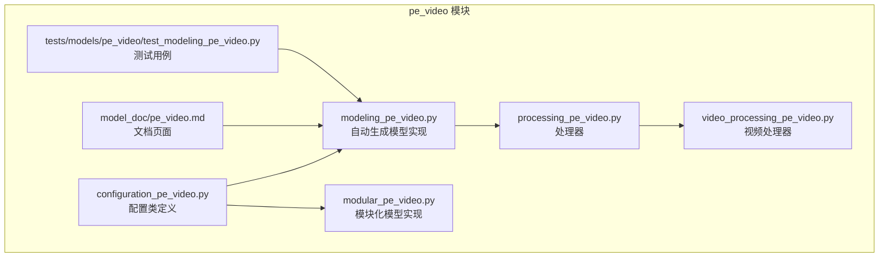
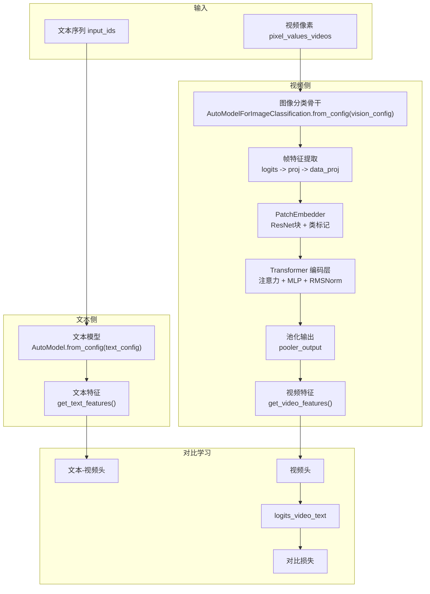
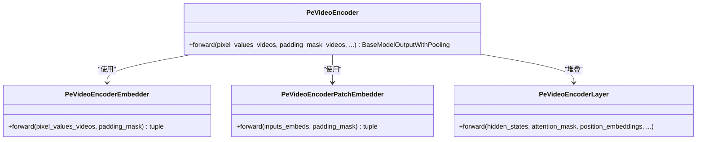
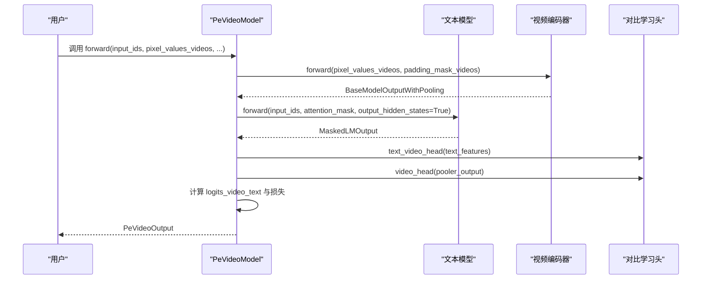
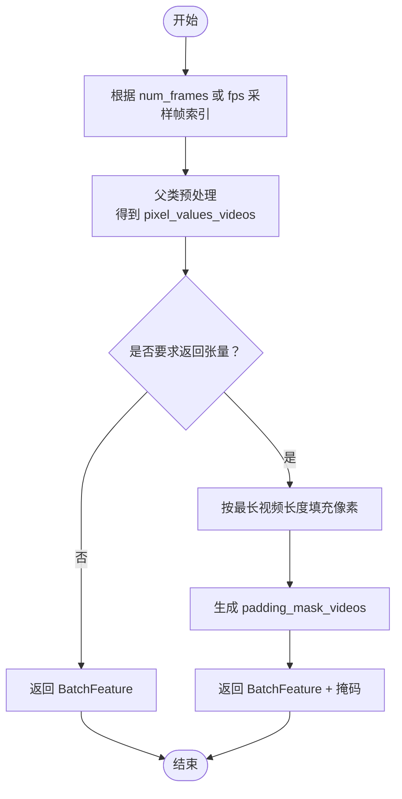
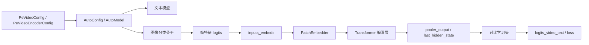

# PE-Video 模型

<cite>
**本文引用的文件列表**
- [配置类定义（视频编码器）](file://src/transformers/models/pe_video/configuration_pe_video.py)
- [配置类定义（整体模型）](file://src/transformers/models/pe_video/configuration_pe_video.py)
- [模型实现（自动生成版）](file://src/transformers/models/pe_video/modeling_pe_video.py)
- [模型实现（模块化版）](file://src/transformers/models/pe_video/modular_pe_video.py)
- [处理器定义](file://src/transformers/models/pe_video/processing_pe_video.py)
- [视频处理器定义](file://src/transformers/models/pe_video/video_processing_pe_video.py)
- [文档页面](file://docs/source/en/model_doc/pe_video.md)
- [测试用例](file://tests/models/pe_video/test_modeling_pe_video.py)
</cite>

## 目录
1. [简介](#简介)
2. [项目结构](#项目结构)
3. [核心组件](#核心组件)
4. [架构总览](#架构总览)
5. [详细组件分析](#详细组件分析)
6. [依赖关系分析](#依赖关系分析)
7. [性能考量](#性能考量)
8. [故障排查指南](#故障排查指南)
9. [结论](#结论)
10. [附录](#附录)

## 简介
PE-Video 是一个用于视频理解与对比学习的多模态模型，基于 Perception Encoder（PE）理念构建。该模型由两部分组成：
- 文本侧：使用现代文本编码器（如 ModernBert 风格配置），负责将文本序列映射为语义嵌入。
- 视频侧：采用“帧级视觉特征提取 + 时间序列编码”的流水线，先通过图像分类骨干网络对每帧进行特征提取，再对时间维度进行卷积残差块处理与注意力编码，最终输出视频的池化表示与逐帧隐藏状态。

模型支持对比学习头，计算视频-文本对齐分数，并提供可选的损失项，便于在大规模视频-文本配对数据上进行自监督训练或检索任务。

## 项目结构
PE-Video 的相关代码位于 transformers 库的 models 子目录中，包含配置、模型实现、处理器以及文档与测试文件。

图表来源
- [配置类定义（视频编码器）](file://src/transformers/models/pe_video/configuration_pe_video.py#L1-L212)
- [模型实现（自动生成版）](file://src/transformers/models/pe_video/modeling_pe_video.py#L1-L637)
- [模型实现（模块化版）](file://src/transformers/models/pe_video/modular_pe_video.py#L1-L220)
- [处理器定义](file://src/transformers/models/pe_video/processing_pe_video.py#L1-L11)
- [视频处理器定义](file://src/transformers/models/pe_video/video_processing_pe_video.py#L1-L67)
- [文档页面](file://docs/source/en/model_doc/pe_video.md#L1-L58)
- [测试用例](file://tests/models/pe_video/test_modeling_pe_video.py#L1-L369)

章节来源
- [配置类定义（视频编码器）](file://src/transformers/models/pe_video/configuration_pe_video.py#L1-L212)
- [模型实现（自动生成版）](file://src/transformers/models/pe_video/modeling_pe_video.py#L1-L637)
- [模型实现（模块化版）](file://src/transformers/models/pe_video/modular_pe_video.py#L1-L220)
- [处理器定义](file://src/transformers/models/pe_video/processing_pe_video.py#L1-L11)
- [视频处理器定义](file://src/transformers/models/pe_video/video_processing_pe_video.py#L1-L67)
- [文档页面](file://docs/source/en/model_doc/pe_video.md#L1-L58)
- [测试用例](file://tests/models/pe_video/test_modeling_pe_video.py#L1-L369)

## 核心组件
- 配置类
  - PeVideoEncoderConfig：定义视频编码器的超参数，包括视觉骨干配置、Transformer 层参数、RoPE 参数等。
  - PeVideoConfig：定义整体模型配置，组合文本配置与视频编码器配置。
- 模型类
  - PeVideoEncoder：视频编码器，负责从像素序列中提取帧级特征并进行时间维度建模。
  - PeVideoModel：端到端模型，结合文本模型与视频编码器，提供对比学习头与损失计算。
- 处理器
  - PeVideoProcessor：统一的处理器，包含视频处理器与分词器。
  - PeVideoVideoProcessor：视频预处理，负责帧采样、归一化与填充掩码生成。
- 输出结构
  - PeVideoOutput：封装对比学习的 logits、文本-视频嵌入、视频嵌入以及底层模型输出。

章节来源
- [配置类定义（视频编码器）](file://src/transformers/models/pe_video/configuration_pe_video.py#L1-L212)
- [配置类定义（整体模型）](file://src/transformers/models/pe_video/configuration_pe_video.py#L144-L211)
- [模型实现（自动生成版）](file://src/transformers/models/pe_video/modeling_pe_video.py#L45-L120)
- [模型实现（模块化版）](file://src/transformers/models/pe_video/modular_pe_video.py#L36-L110)
- [处理器定义](file://src/transformers/models/pe_video/processing_pe_video.py#L1-L11)
- [视频处理器定义](file://src/transformers/models/pe_video/video_processing_pe_video.py#L26-L67)

## 架构总览
PE-Video 的整体架构由“文本侧 + 视频侧”构成，二者共享对比学习头，用于视频-文本匹配。

图表来源
- [模型实现（自动生成版）](file://src/transformers/models/pe_video/modeling_pe_video.py#L558-L637)
- [模型实现（模块化版）](file://src/transformers/models/pe_video/modular_pe_video.py#L138-L214)
- [视频处理器定义](file://src/transformers/models/pe_video/video_processing_pe_video.py#L26-L67)

## 详细组件分析

### 配置类：PeVideoEncoderConfig 与 PeVideoConfig
- PeVideoEncoderConfig
  - 关键字段：hidden_size、intermediate_size、num_hidden_layers、num_attention_heads、num_key_value_heads、head_dim、hidden_act、max_position_embeddings、initializer_range、rms_norm_eps、rope_parameters、attention_bias、attention_dropout、vision_config。
  - 视觉骨干默认使用 TimmWrapperConfig，并设置特定参数（如架构、池化、类别数等）。
- PeVideoConfig
  - 组合 text_config 与 video_config，默认文本侧使用 ModernBert 风格配置，视频侧使用 PeVideoEncoderConfig。
  - 支持子配置映射与默认参数覆盖。

章节来源
- [配置类定义（视频编码器）](file://src/transformers/models/pe_video/configuration_pe_video.py#L27-L143)
- [配置类定义（整体模型）](file://src/transformers/models/pe_video/configuration_pe_video.py#L144-L211)

### 视频编码器：PeVideoEncoder
- 帧特征提取
  - 使用 AutoModelForImageClassification 作为视觉骨干，将每帧像素映射为 logits，再经投影与数据投影得到 inputs_embeds。
- PatchEmbedder
  - 在 inputs_embeds 前添加类标记，然后通过一维卷积残差块（ResNet 风格）进行时间维度建模。
- Transformer 编码层
  - 自注意力采用 RMSNorm 归一化（仅作用于 head 维度）、RoPE 旋转位置编码、组查询注意力（GQA）。
  - 前馈网络采用门控与上采样投影的混合结构。
- 输出
  - 返回 BaseModelOutputWithPooling，包含 last_hidden_state（去除了类标记）与 pooler_output（类标记对应的向量）。

图表来源
- [模型实现（自动生成版）](file://src/transformers/models/pe_video/modeling_pe_video.py#L168-L216)
- [模型实现（自动生成版）](file://src/transformers/models/pe_video/modeling_pe_video.py#L356-L418)
- [模型实现（自动生成版）](file://src/transformers/models/pe_video/modeling_pe_video.py#L504-L556)

章节来源
- [模型实现（自动生成版）](file://src/transformers/models/pe_video/modeling_pe_video.py#L168-L216)
- [模型实现（自动生成版）](file://src/transformers/models/pe_video/modeling_pe_video.py#L356-L418)
- [模型实现（自动生成版）](file://src/transformers/models/pe_video/modeling_pe_video.py#L504-L556)

### 端到端模型：PeVideoModel
- 文本侧
  - 通过 AutoModel.from_config(config.text_config) 获取文本模型，支持返回中间隐藏状态以便对比学习。
- 对比学习头
  - 提供两个对比学习头：text_video_head（文本侧）与 video_head（视频侧），均使用 LayerNorm + 线性投影。
  - logit scale 与 bias 可学习，用于缩放与偏移对比分数。
- 前向流程
  - 先编码视频，再编码文本；随后计算视频-文本对齐分数 logits_video_text，并可选择返回损失。

图表来源
- [模型实现（自动生成版）](file://src/transformers/models/pe_video/modeling_pe_video.py#L558-L637)
- [模型实现（模块化版）](file://src/transformers/models/pe_video/modular_pe_video.py#L138-L214)

章节来源
- [模型实现（自动生成版）](file://src/transformers/models/pe_video/modeling_pe_video.py#L558-L637)
- [模型实现（模块化版）](file://src/transformers/models/pe_video/modular_pe_video.py#L138-L214)

### 视频处理器：PeVideoVideoProcessor
- 帧采样策略
  - 当指定固定帧数时，按均匀间隔采样；否则使用基类默认策略。
- 预处理流程
  - 先调用父类预处理，得到像素张量；若请求返回张量，则对不同长度的视频进行填充，并生成 padding_mask_videos。
- 输出
  - 返回 BatchFeature，包含 pixel_values_videos 与可选的 padding_mask_videos。

图表来源
- [视频处理器定义](file://src/transformers/models/pe_video/video_processing_pe_video.py#L26-L67)

章节来源
- [视频处理器定义](file://src/transformers/models/pe_video/video_processing_pe_video.py#L26-L67)

### 处理器：PeVideoProcessor
- 统一入口
  - 将视频处理器与分词器组合为 PeVideoProcessor，便于端到端的数据准备与模型调用。

章节来源
- [处理器定义](file://src/transformers/models/pe_video/processing_pe_video.py#L1-L11)

## 依赖关系分析
- 配置映射
  - PeVideoConfig 与 PeVideoEncoderConfig 通过 CONFIG_MAPPING 与 AutoConfig/AutoModel 进行动态实例化。
- 视觉骨干
  - 视频侧使用 AutoModelForImageClassification.from_config(vision_config)，默认 TimmWrapperConfig，支持多种视觉骨干。
- 注意力与 RoPE
  - 自注意力采用 RMSNorm、RoPE 旋转位置编码与组查询注意力（GQA），并支持多种注意力后端（eager、flash、sdpa、flex）。
- 对比学习
  - 通过对比学习头将文本与视频映射到同一语义空间，并计算对齐分数与损失。

图表来源
- [配置类定义（视频编码器）](file://src/transformers/models/pe_video/configuration_pe_video.py#L144-L211)
- [模型实现（自动生成版）](file://src/transformers/models/pe_video/modeling_pe_video.py#L558-L637)

章节来源
- [配置类定义（视频编码器）](file://src/transformers/models/pe_video/configuration_pe_video.py#L144-L211)
- [模型实现（自动生成版）](file://src/transformers/models/pe_video/modeling_pe_video.py#L558-L637)

## 性能考量
- 注意力实现
  - 支持多种注意力后端（eager、flash、sdpa、flex），可根据硬件与库版本自动选择最优实现。
- 梯度检查点
  - 编码层支持梯度检查点，可在显存受限时降低内存占用。
- 卷积残差块
  - PatchEmbedder 使用一维卷积残差块，适合时间序列建模，同时保持轻量与高效。
- 掩码与填充
  - 视频帧长度可变，通过 padding_mask_videos 实现动态填充与注意力掩码，避免无效计算。

章节来源
- [模型实现（自动生成版）](file://src/transformers/models/pe_video/modeling_pe_video.py#L401-L418)
- [模型实现（自动生成版）](file://src/transformers/models/pe_video/modeling_pe_video.py#L100-L145)
- [视频处理器定义](file://src/transformers/models/pe_video/video_processing_pe_video.py#L45-L67)

## 故障排查指南
- 输入形状与掩码
  - 确保 pixel_values_videos 的形状为 [batch, frames, channels, height, width]，并正确传入 padding_mask_videos。
- 帧采样与长度不一致
  - 若 num_frames 固定，需确保 metadata.total_num_frames 能被整除或合理插值；否则可能影响对齐效果。
- 分词器与文本输入
  - 文本侧使用 AutoModel，注意 input_ids 与 attention_mask 的形状与 dtype。
- 对比学习损失
  - 当 return_loss=True 时，模型会计算对比损失；若 logits_video_text 不稳定，可调整 text_video_logit_scale 与 text_video_logit_bias。
- 测试与调试
  - 可参考测试用例中的构造方法与断言，验证输出维度与前向流程。

章节来源
- [测试用例](file://tests/models/pe_video/test_modeling_pe_video.py#L118-L181)
- [测试用例](file://tests/models/pe_video/test_modeling_pe_video.py#L289-L361)

## 结论
PE-Video 提供了一个清晰的视频-文本对比学习框架：视频侧通过帧级视觉特征与时间维度建模，文本侧通过现代文本编码器，二者共同映射到统一语义空间并通过对比学习头进行对齐。其模块化设计与灵活的配置使得在不同视觉骨干与文本模型之间切换成为可能，适用于视频检索、跨模态理解等任务。

## 附录
- 使用建议
  - 在训练阶段启用 return_loss 并设置合适的对比学习头参数。
  - 对长视频序列，优先使用固定帧数采样与动态 RoPE，以提升稳定性与效率。
- 扩展方向
  - 可替换视觉骨干（如更大规模的 ViT 或 ConvNeXT）以适配更高分辨率视频。
  - 可引入更复杂的帧对齐策略（如基于时间戳的插值）以提升跨模态对齐精度。