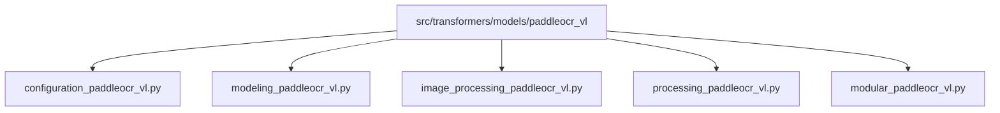
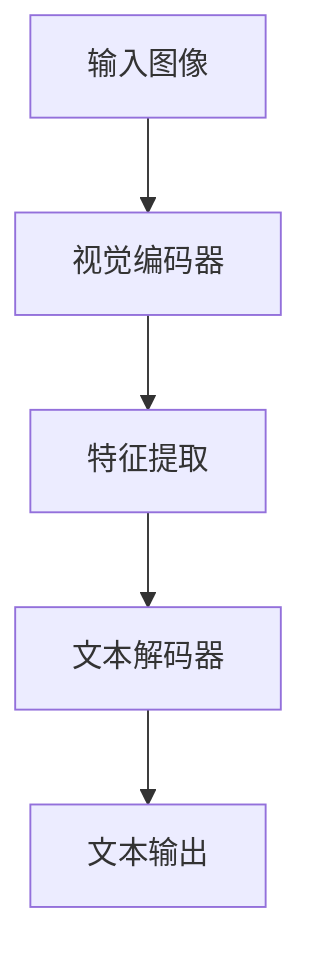
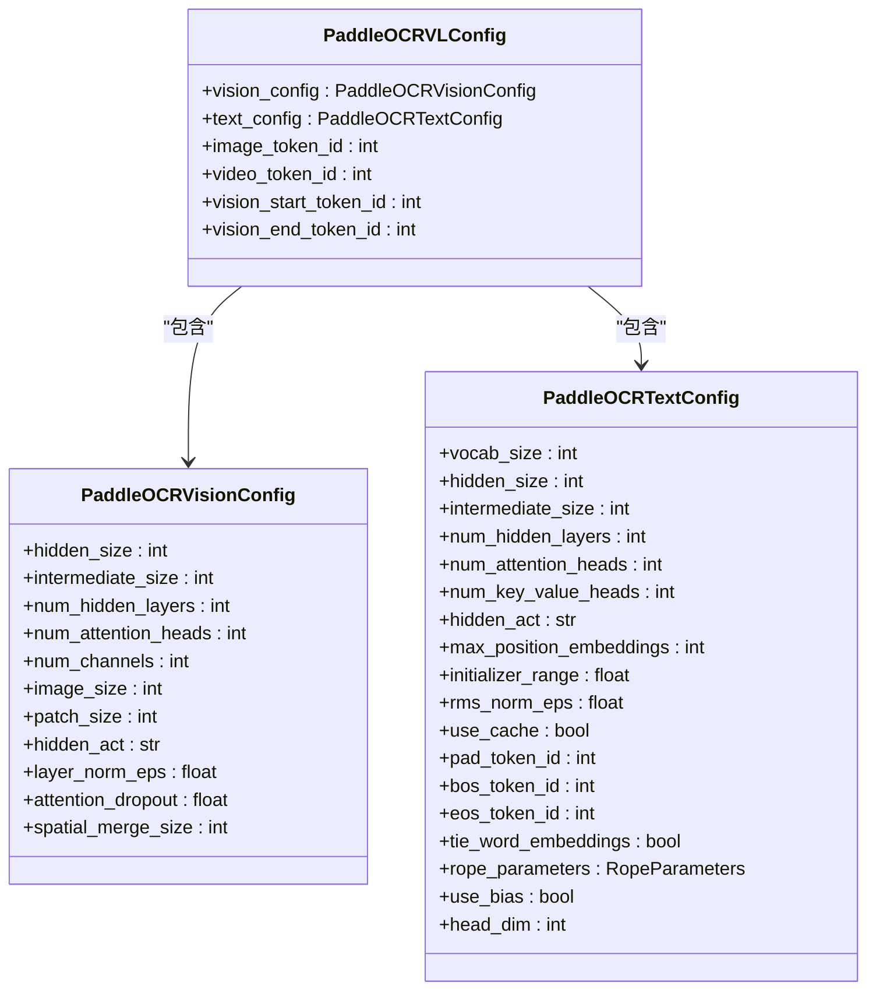
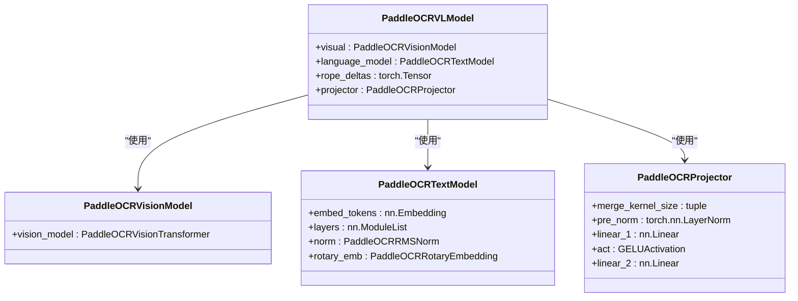
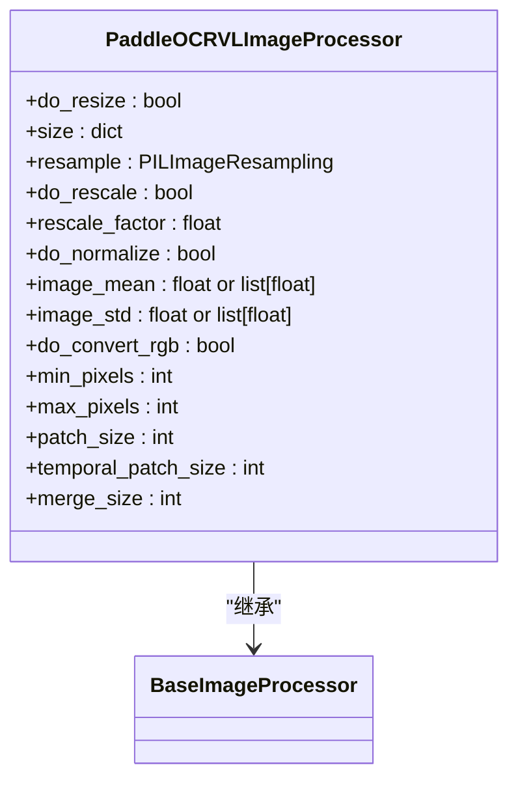
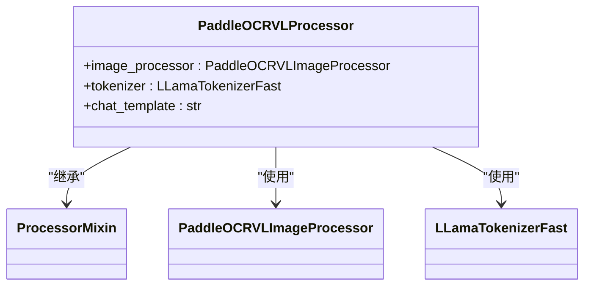
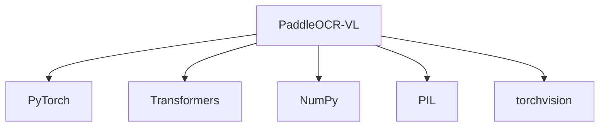

# PaddleOCR-VL 模型

<cite>
**本文档中引用的文件**   
- [configuration_paddleocr_vl.py](file://src/transformers/models/paddleocr_vl/configuration_paddleocr_vl.py)
- [modeling_paddleocr_vl.py](file://src/transformers/models/paddleocr_vl/modeling_paddleocr_vl.py)
- [image_processing_paddleocr_vl.py](file://src/transformers/models/paddleocr_vl/image_processing_paddleocr_vl.py)
- [processing_paddleocr_vl.py](file://src/transformers/models/paddleocr_vl/processing_paddleocr_vl.py)
- [modular_paddleocr_vl.py](file://src/transformers/models/paddleocr_vl/modular_paddleocr_vl.py)
</cite>

## 目录
1. [简介](#简介)
2. [项目结构](#项目结构)
3. [核心组件](#核心组件)
4. [架构概述](#架构概述)
5. [详细组件分析](#详细组件分析)
6. [依赖分析](#依赖分析)
7. [性能考虑](#性能考虑)
8. [故障排除指南](#故障排除指南)
9. [结论](#结论)

## 简介
PaddleOCR-VL 是一个先进的视觉语言模型，专为光学字符识别（OCR）任务设计。该模型结合了强大的视觉编码器和文本解码器，能够处理图像中的文本识别和理解。本技术文档旨在深入分析 PaddleOCR-VL 模型的架构、实现细节和功能，为开发者和研究人员提供全面的参考。

## 项目结构
PaddleOCR-VL 模型的代码位于 `src/transformers/models/paddleocr_vl` 目录下，包含多个关键文件，每个文件负责不同的功能模块。这些文件共同构成了模型的核心架构。

**Diagram sources**
- [configuration_paddleocr_vl.py](file://src/transformers/models/paddleocr_vl/configuration_paddleocr_vl.py)
- [modeling_paddleocr_vl.py](file://src/transformers/models/paddleocr_vl/modeling_paddleocr_vl.py)
- [image_processing_paddleocr_vl.py](file://src/transformers/models/paddleocr_vl/image_processing_paddleocr_vl.py)
- [processing_paddleocr_vl.py](file://src/transformers/models/paddleocr_vl/processing_paddleocr_vl.py)
- [modular_paddleocr_vl.py](file://src/transformers/models/paddleocr_vl/modular_paddleocr_vl.py)

**Section sources**
- [configuration_paddleocr_vl.py](file://src/transformers/models/paddleocr_vl/configuration_paddleocr_vl.py)
- [modeling_paddleocr_vl.py](file://src/transformers/models/paddleocr_vl/modeling_paddleocr_vl.py)
- [image_processing_paddleocr_vl.py](file://src/transformers/models/paddleocr_vl/image_processing_paddleocr_vl.py)
- [processing_paddleocr_vl.py](file://src/transformers/models/paddleocr_vl/processing_paddleocr_vl.py)
- [modular_paddleocr_vl.py](file://src/transformers/models/paddleocr_vl/modular_paddleocr_vl.py)

## 核心组件
PaddleOCR-VL 模型的核心组件包括配置文件、建模文件、图像处理文件和处理器文件。这些组件协同工作，确保模型能够高效地处理视觉语言任务。

**Section sources**
- [configuration_paddleocr_vl.py](file://src/transformers/models/paddleocr_vl/configuration_paddleocr_vl.py)
- [modeling_paddleocr_vl.py](file://src/transformers/models/paddleocr_vl/modeling_paddleocr_vl.py)
- [image_processing_paddleocr_vl.py](file://src/transformers/models/paddleocr_vl/image_processing_paddleocr_vl.py)
- [processing_paddleocr_vl.py](file://src/transformers/models/paddleocr_vl/processing_paddleocr_vl.py)

## 架构概述
PaddleOCR-VL 模型采用了一种混合架构，结合了视觉编码器和文本解码器。视觉编码器负责从输入图像中提取特征，而文本解码器则利用这些特征生成相应的文本输出。这种架构使得模型能够在复杂的视觉语言任务中表现出色。

**Diagram sources**
- [modeling_paddleocr_vl.py](file://src/transformers/models/paddleocr_vl/modeling_paddleocr_vl.py)

## 详细组件分析
### 配置文件分析
`configuration_paddleocr_vl.py` 文件定义了 PaddleOCR-VL 模型的配置类，包括视觉编码器和文本解码器的配置。这些配置类继承自 `PreTrainedConfig`，并提供了详细的参数设置。

**Diagram sources**
- [configuration_paddleocr_vl.py](file://src/transformers/models/paddleocr_vl/configuration_paddleocr_vl.py)

**Section sources**
- [configuration_paddleocr_vl.py](file://src/transformers/models/paddleocr_vl/configuration_paddleocr_vl.py)

### 建模文件分析
`modeling_paddleocr_vl.py` 文件实现了 PaddleOCR-VL 模型的主要逻辑，包括视觉编码器、文本解码器和投影器。这些组件共同构成了模型的核心功能。

**Diagram sources**
- [modeling_paddleocr_vl.py](file://src/transformers/models/paddleocr_vl/modeling_paddleocr_vl.py)

**Section sources**
- [modeling_paddleocr_vl.py](file://src/transformers/models/paddleocr_vl/modeling_paddleocr_vl.py)

### 图像处理文件分析
`image_processing_paddleocr_vl.py` 文件定义了 PaddleOCR-VL 模型的图像处理器，负责将输入图像转换为模型可以处理的格式。该处理器支持动态调整图像大小，以适应不同分辨率的输入。

**Diagram sources**
- [image_processing_paddleocr_vl.py](file://src/transformers/models/paddleocr_vl/image_processing_paddleocr_vl.py)

**Section sources**
- [image_processing_paddleocr_vl.py](file://src/transformers/models/paddleocr_vl/image_processing_paddleocr_vl.py)

### 处理器文件分析
`processing_paddleocr_vl.py` 文件定义了 PaddleOCR-VL 模型的处理器，负责将图像和文本输入组合成模型可以处理的格式。该处理器结合了图像处理器和文本分词器的功能。

**Diagram sources**
- [processing_paddleocr_vl.py](file://src/transformers/models/paddleocr_vl/processing_paddleocr_vl.py)

**Section sources**
- [processing_paddleocr_vl.py](file://src/transformers/models/paddleocr_vl/processing_paddleocr_vl.py)

## 依赖分析
PaddleOCR-VL 模型依赖于多个外部库和内部模块，这些依赖关系确保了模型的完整性和功能性。主要依赖包括 PyTorch、Transformers 库和其他辅助工具。

**Diagram sources**
- [modeling_paddleocr_vl.py](file://src/transformers/models/paddleocr_vl/modeling_paddleocr_vl.py)
- [image_processing_paddleocr_vl.py](file://src/transformers/models/paddleocr_vl/image_processing_paddleocr_vl.py)
- [processing_paddleocr_vl.py](file://src/transformers/models/paddleocr_vl/processing_paddleocr_vl.py)

**Section sources**
- [modeling_paddleocr_vl.py](file://src/transformers/models/paddleocr_vl/modeling_paddleocr_vl.py)
- [image_processing_paddleocr_vl.py](file://src/transformers/models/paddleocr_vl/image_processing_paddleocr_vl.py)
- [processing_paddleocr_vl.py](file://src/transformers/models/paddleocr_vl/processing_paddleocr_vl.py)

## 性能考虑
PaddleOCR-VL 模型在设计时考虑了多种性能优化策略，包括使用高效的注意力机制、多头注意力和残差连接。这些优化措施有助于提高模型的推理速度和准确性。

**Section sources**
- [modeling_paddleocr_vl.py](file://src/transformers/models/paddleocr_vl/modeling_paddleocr_vl.py)

## 故障排除指南
在使用 PaddleOCR-VL 模型时，可能会遇到一些常见问题。以下是一些常见的故障排除建议：

- **输入图像尺寸不匹配**：确保输入图像的尺寸符合模型的要求，通常为 384x384。
- **内存不足**：如果模型运行时出现内存不足的问题，可以尝试减少批量大小或使用更小的模型版本。
- **推理速度慢**：优化模型的推理速度，可以通过使用更高效的硬件或优化模型结构来实现。

**Section sources**
- [image_processing_paddleocr_vl.py](file://src/transformers/models/paddleocr_vl/image_processing_paddleocr_vl.py)
- [modeling_paddleocr_vl.py](file://src/transformers/models/paddleocr_vl/modeling_paddleocr_vl.py)

## 结论
PaddleOCR-VL 模型是一个强大的视觉语言模型，专为光学字符识别任务设计。通过深入分析其架构和实现细节，我们可以更好地理解和利用这一模型。希望本技术文档能为开发者和研究人员提供有价值的参考。