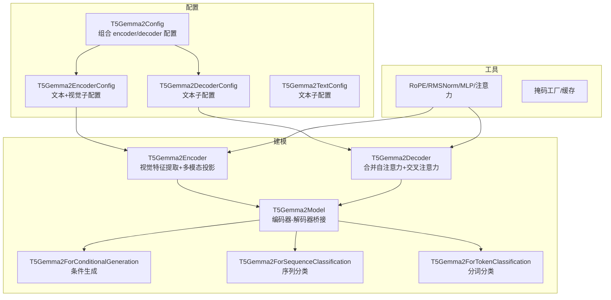
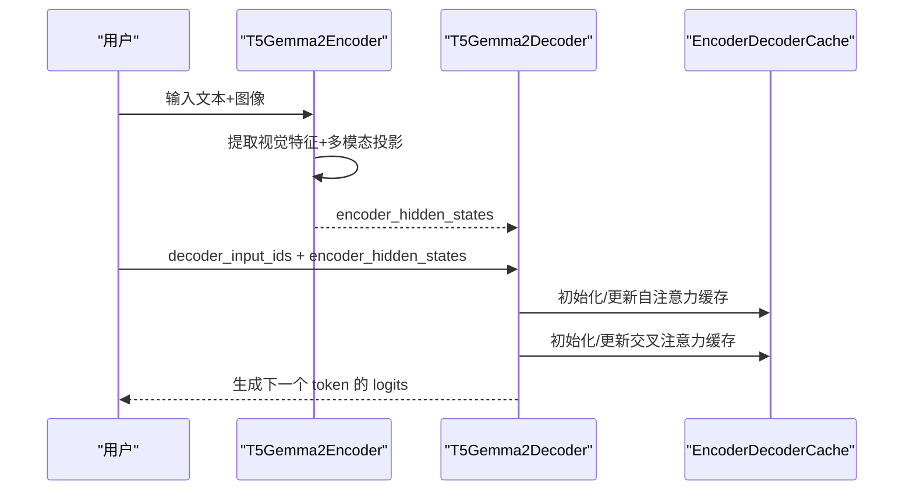
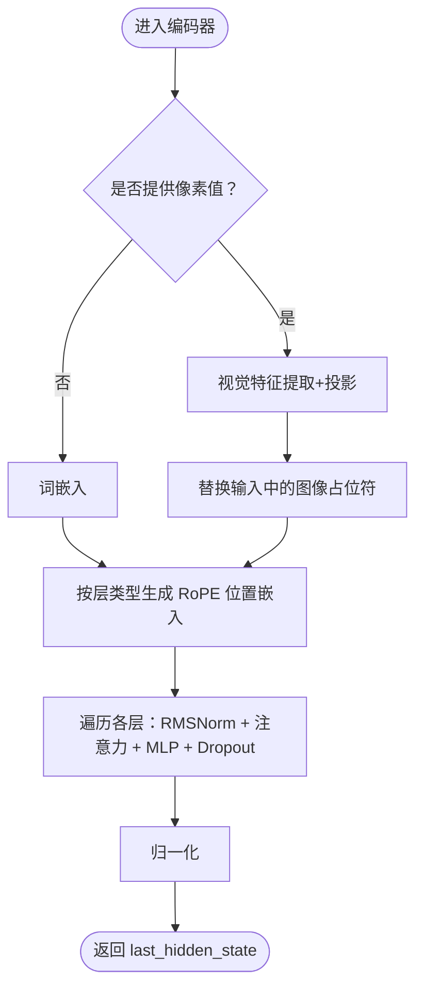
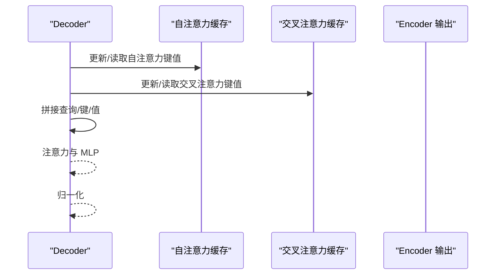
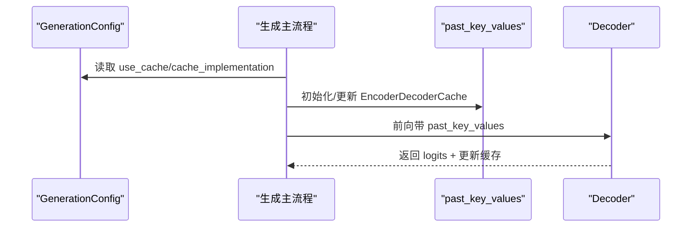
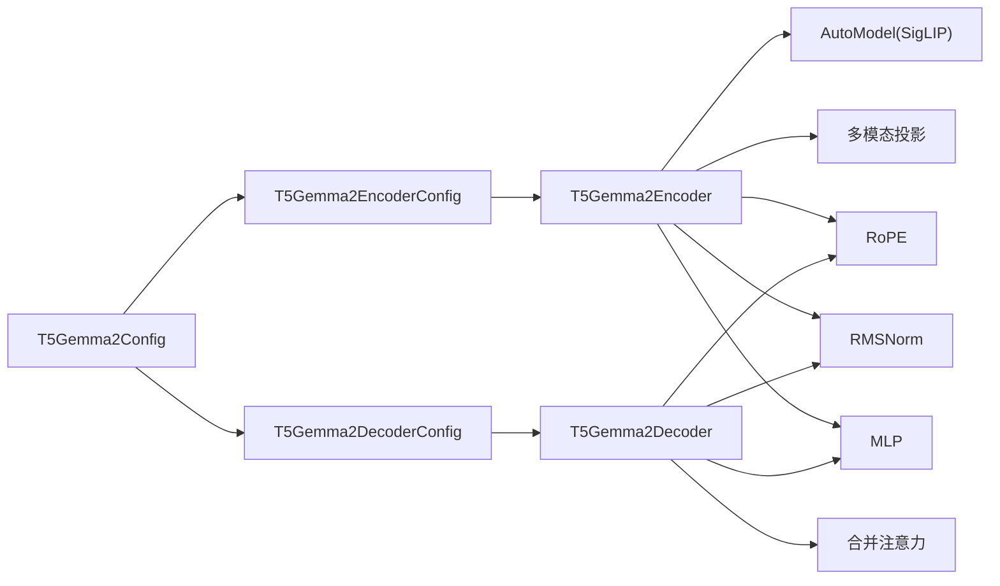

# T5Gemma2 模型

<cite>
**本文引用的文件列表**
- [configuration_t5gemma2.py](file://src/transformers/models/t5gemma2/configuration_t5gemma2.py)
- [modeling_t5gemma2.py](file://src/transformers/models/t5gemma2/modeling_t5gemma2.py)
- [modular_t5gemma2.py](file://src/transformers/models/t5gemma2/modular_t5gemma2.py)
- [t5gemma2.md](file://docs/source/en/model_doc/t5gemma2.md)
- [test_modeling_t5gemma2.py](file://tests/models/t5gemma2/test_modeling_t5gemma2.py)
</cite>

## 目录
1. [简介](#简介)
2. [项目结构](#项目结构)
3. [核心组件](#核心组件)
4. [架构总览](#架构总览)
5. [详细组件分析](#详细组件分析)
6. [依赖关系分析](#依赖关系分析)
7. [性能考量](#性能考量)
8. [故障排查指南](#故障排查指南)
9. [结论](#结论)
10. [附录](#附录)

## 简介
T5Gemma2 是基于 Gemma 3 的多模态、长上下文预训练编码器-解码器语言模型家族，参数规模覆盖 270M-270M、1B-1B 和 4B-4B。它在 T5Gemma 的基础上通过模型适配（基于 Gemma 3）并采用 UL2 训练策略构建，具备强多语言、多模态与长上下文能力。该实现支持图像-文本生成任务，并提供条件生成、序列分类与分词级分类等下游任务接口。

本文件面向不同技术背景读者，系统梳理 T5Gemma2 的配置、模块化结构、注意力与掩码机制、缓存与生成流程、以及常见问题排查方法。

## 项目结构
T5Gemma2 的核心代码位于 transformers 库的 models 子目录下，包含配置、建模与文档三类文件：
- 配置：定义 encoder/text/decoder 的超参与约束
- 建模：实现编码器、解码器、多模态投影、注意力、RoPE、输出头等
- 文档：官方模型文档与示例用法
- 测试：覆盖配置校验、前向传播、生成与微调场景

图表来源
- [configuration_t5gemma2.py](file://src/transformers/models/t5gemma2/configuration_t5gemma2.py#L490-L628)
- [modeling_t5gemma2.py](file://src/transformers/models/t5gemma2/modeling_t5gemma2.py#L768-L1185)

章节来源
- [configuration_t5gemma2.py](file://src/transformers/models/t5gemma2/configuration_t5gemma2.py#L490-L628)
- [modeling_t5gemma2.py](file://src/transformers/models/t5gemma2/modeling_t5gemma2.py#L768-L1185)
- [t5gemma2.md](file://docs/source/en/model_doc/t5gemma2.md#L1-L119)

## 核心组件
- 配置体系
  - T5Gemma2Config：组合 encoder/decoder 子配置，强制隐藏维度与词表一致，禁止非编码器-解码器模式
  - T5Gemma2EncoderConfig：包含文本与视觉子配置，定义图像占位符索引与每图 token 数
  - T5Gemma2DecoderConfig/T5Gemma2TextConfig：文本侧超参，含滑动窗口、RoPE 参数、软截断等
- 编码器（Encoder）
  - 视觉塔：基于 AutoModel 的 SigLIP 视觉配置
  - 多模态投影：将视觉特征池化后映射到文本嵌入空间
  - 文本嵌入：带缩放的词嵌入，特殊 EOI token 单独处理
  - 层：RMSNorm + 自注意力（按层类型选择全注意力或滑窗注意力）+ MLP
- 解码器（Decoder）
  - 合并注意力：将自注意力与来自编码器的交叉注意力拼接，统一掩码
  - 层：RMSNorm + 合并注意力 + MLP
- 输出头
  - 条件生成：线性输出头，可选最终 logits 软截断
  - 分类任务：线性分类头，支持序列级与分词级

章节来源
- [configuration_t5gemma2.py](file://src/transformers/models/t5gemma2/configuration_t5gemma2.py#L1-L213)
- [configuration_t5gemma2.py](file://src/transformers/models/t5gemma2/configuration_t5gemma2.py#L214-L488)
- [configuration_t5gemma2.py](file://src/transformers/models/t5gemma2/configuration_t5gemma2.py#L490-L628)
- [modeling_t5gemma2.py](file://src/transformers/models/t5gemma2/modeling_t5gemma2.py#L54-L110)
- [modeling_t5gemma2.py](file://src/transformers/models/t5gemma2/modeling_t5gemma2.py#L110-L207)
- [modeling_t5gemma2.py](file://src/transformers/models/t5gemma2/modeling_t5gemma2.py#L209-L336)
- [modeling_t5gemma2.py](file://src/transformers/models/t5gemma2/modeling_t5gemma2.py#L338-L462)
- [modeling_t5gemma2.py](file://src/transformers/models/t5gemma2/modeling_t5gemma2.py#L464-L575)
- [modeling_t5gemma2.py](file://src/transformers/models/t5gemma2/modeling_t5gemma2.py#L577-L601)
- [modeling_t5gemma2.py](file://src/transformers/models/t5gemma2/modeling_t5gemma2.py#L603-L660)
- [modeling_t5gemma2.py](file://src/transformers/models/t5gemma2/modeling_t5gemma2.py#L662-L747)
- [modeling_t5gemma2.py](file://src/transformers/models/t5gemma2/modeling_t5gemma2.py#L749-L889)
- [modeling_t5gemma2.py](file://src/transformers/models/t5gemma2/modeling_t5gemma2.py#L890-L1088)
- [modeling_t5gemma2.py](file://src/transformers/models/t5gemma2/modeling_t5gemma2.py#L1091-L1185)
- [modeling_t5gemma2.py](file://src/transformers/models/t5gemma2/modeling_t5gemma2.py#L1187-L1387)
- [modeling_t5gemma2.py](file://src/transformers/models/t5gemma2/modeling_t5gemma2.py#L1388-L1573)

## 架构总览
T5Gemma2 采用编码器-解码器范式，编码器负责将图像与文本输入融合为统一表示，解码器基于编码器输出进行自回归生成。关键特性包括：
- 层内注意力类型按层切换：全注意力与滑动窗口注意力交替出现
- RoPE：按层类型分别计算频率与缩放因子
- 合并注意力：解码器将自注意力与交叉注意力拼接，共享掩码构造逻辑
- 多模态：图像经 SigLIP 视觉塔与投影层，替换输入中的图像占位符 token
- 生成缓存：使用 EncoderDecoderCache，跨注意力使用全注意力缓存

图表来源
- [modeling_t5gemma2.py](file://src/transformers/models/t5gemma2/modeling_t5gemma2.py#L1091-L1185)
- [modeling_t5gemma2.py](file://src/transformers/models/t5gemma2/modeling_t5gemma2.py#L1187-L1387)

## 详细组件分析

### 配置与约束
- 组合配置
  - 强制要求 encoder.text_config.hidden_size == decoder.hidden_size
  - 强制要求 encoder.text_config.vocab_size == decoder.vocab_size
  - 仅支持 is_encoder_decoder=True
- 文本配置
  - 支持滑动窗口注意力与层类型列表，按模式周期性切换
  - RoPE 参数支持全局/局部 theta 与缩放
  - 可选最终 logits 软截断与注意力分数软截断
- 视觉配置
  - 默认使用 SigLIP 视觉配置
  - 定义图像占位符索引、开始/结束图像 token 索引

章节来源
- [configuration_t5gemma2.py](file://src/transformers/models/t5gemma2/configuration_t5gemma2.py#L490-L628)

### 编码器（Encoder）
- 视觉塔与投影
  - 使用 AutoModel 加载 SigLIP 视觉配置
  - 将视觉特征按每边 sqrt(mm_tokens_per_image) 的网格池化，再线性投影到文本维度
- 文本嵌入与位置
  - 词嵌入按 hidden_size 开平方缩放；EOI token 单独嵌入
  - 按层类型生成全局/局部 RoPE 位置嵌入
- 掩码
  - 全注意力与滑窗注意力分别构造掩码映射字典
- 前向
  - 将图像占位符 token 替换为投影后的图像特征
  - 逐层执行 RMSNorm + 注意力 + MLP，最后归一化

图表来源
- [modeling_t5gemma2.py](file://src/transformers/models/t5gemma2/modeling_t5gemma2.py#L800-L936)

章节来源
- [modeling_t5gemma2.py](file://src/transformers/models/t5gemma2/modeling_t5gemma2.py#L603-L660)
- [modeling_t5gemma2.py](file://src/transformers/models/t5gemma2/modeling_t5gemma2.py#L662-L747)
- [modeling_t5gemma2.py](file://src/transformers/models/t5gemma2/modeling_t5gemma2.py#L749-L889)
- [modeling_t5gemma2.py](file://src/transformers/models/t5gemma2/modeling_t5gemma2.py#L890-L936)

### 解码器（Decoder）
- 合并注意力
  - 自注意力与交叉注意力张量拼接，统一掩码构造
  - 支持缓存：自注意力与交叉注意力分别维护缓存
- 掩码
  - 自注意力：因果掩码；滑窗模式下使用滑窗因果掩码
  - 交叉注意力：将编码器注意力掩码与自注意力拼接
- 前向
  - 逐层执行 RMSNorm + 合并注意力 + MLP，最后归一化

图表来源
- [modeling_t5gemma2.py](file://src/transformers/models/t5gemma2/modeling_t5gemma2.py#L952-L1088)

章节来源
- [modeling_t5gemma2.py](file://src/transformers/models/t5gemma2/modeling_t5gemma2.py#L338-L462)
- [modeling_t5gemma2.py](file://src/transformers/models/t5gemma2/modeling_t5gemma2.py#L464-L575)
- [modeling_t5gemma2.py](file://src/transformers/models/t5gemma2/modeling_t5gemma2.py#L952-L1088)

### 生成与缓存
- 生成准备
  - 当 use_cache=True 时，初始化 EncoderDecoderCache
  - 跨注意力缓存不使用滑窗，确保完整上下文
- 生成循环
  - 解码器按步生成下一个 token 的 logits
  - 支持最终 logits 软截断

图表来源
- [modeling_t5gemma2.py](file://src/transformers/models/t5gemma2/modeling_t5gemma2.py#L1312-L1387)

章节来源
- [modeling_t5gemma2.py](file://src/transformers/models/t5gemma2/modeling_t5gemma2.py#L1187-L1387)

### 下游任务
- 条件生成
  - tied 词嵌入权重到编码器
  - LM 头与词表大小对齐
- 序列分类/分词分类
  - 基于解码器最后一层状态做分类
  - 不支持直接传入输入嵌入

章节来源
- [modeling_t5gemma2.py](file://src/transformers/models/t5gemma2/modeling_t5gemma2.py#L1187-L1573)

## 依赖关系分析
- 配置依赖
  - T5Gemma2Config 组合 T5Gemma2EncoderConfig 与 T5Gemma2DecoderConfig
  - 文本配置继承自通用文本配置，扩展层类型与 RoPE 参数
- 模块依赖
  - 编码器依赖 AutoModel（SigLIP 视觉）、多模态投影、RoPE、RMSNorm、MLP、注意力
  - 解码器依赖合并注意力、RoPE、RMSNorm、MLP、注意力
  - 生成依赖缓存与掩码工厂
- 外部集成
  - 与 Transformers 的 GenerationMixin、Cache、Masking 工具链集成

图表来源
- [configuration_t5gemma2.py](file://src/transformers/models/t5gemma2/configuration_t5gemma2.py#L490-L628)
- [modeling_t5gemma2.py](file://src/transformers/models/t5gemma2/modeling_t5gemma2.py#L768-L1185)

章节来源
- [configuration_t5gemma2.py](file://src/transformers/models/t5gemma2/configuration_t5gemma2.py#L490-L628)
- [modeling_t5gemma2.py](file://src/transformers/models/t5gemma2/modeling_t5gemma2.py#L768-L1185)

## 性能考量
- 注意力实现
  - 支持多种注意力后端（eager、FlashAttention 等），默认使用 eager
  - 滑窗注意力与软截断可降低长序列计算开销
- 缓存策略
  - 生成时启用缓存，跨注意力使用全注意力缓存，避免重复计算
- 内存占用
  - 多模态投影与大分辨率图像会增加显存压力
  - 建议根据硬件选择 dtype 与 offload 策略

[本节为通用指导，无需特定文件引用]

## 故障排查指南
- 配置不一致
  - encoder.text_config.hidden_size 与 decoder.hidden_size 不一致会报错
  - encoder.text_config.vocab_size 与 decoder.vocab_size 不一致会报错
- 输入格式错误
  - 编码器需提供 input_ids 或 inputs_embeds 之一
  - 解码器必须提供 encoder_hidden_states
- 图像占位符不匹配
  - 输入中图像占位符数量与投影后图像特征形状不一致会报错
- 生成缓存类型不符
  - past_key_values 必须为 EncoderDecoderCache 类型

章节来源
- [configuration_t5gemma2.py](file://src/transformers/models/t5gemma2/configuration_t5gemma2.py#L567-L581)
- [configuration_t5gemma2.py](file://src/transformers/models/t5gemma2/configuration_t5gemma2.py#L576-L580)
- [modeling_t5gemma2.py](file://src/transformers/models/t5gemma2/modeling_t5gemma2.py#L867-L889)
- [modeling_t5gemma2.py](file://src/transformers/models/t5gemma2/modeling_t5gemma2.py#L982-L1001)
- [modeling_t5gemma2.py](file://src/transformers/models/t5gemma2/modeling_t5gemma2.py#L840-L848)
- [modeling_t5gemma2.py](file://src/transformers/models/t5gemma2/modeling_t5gemma2.py#L1353-L1360)

## 结论
T5Gemma2 在 T5Gemma 的基础上引入了更强的多模态与长上下文能力，通过统一的编码器-解码器结构、层类型切换的注意力设计、RoPE 与软截断等机制，在保持高效生成的同时提升了泛化能力。其配置与建模模块清晰、可扩展性强，适合在多语言、多模态场景中部署与微调。

[本节为总结性内容，无需特定文件引用]

## 附录
- 官方文档与示例
  - 包含 Pipeline 与 AutoModel 的使用示例，展示图像-文本生成的基本流程
- 测试要点
  - 覆盖配置校验、前向传播、生成一致性与下游任务接口

章节来源
- [t5gemma2.md](file://docs/source/en/model_doc/t5gemma2.md#L1-L119)
- [test_modeling_t5gemma2.py](file://tests/models/t5gemma2/test_modeling_t5gemma2.py#L1-L200)