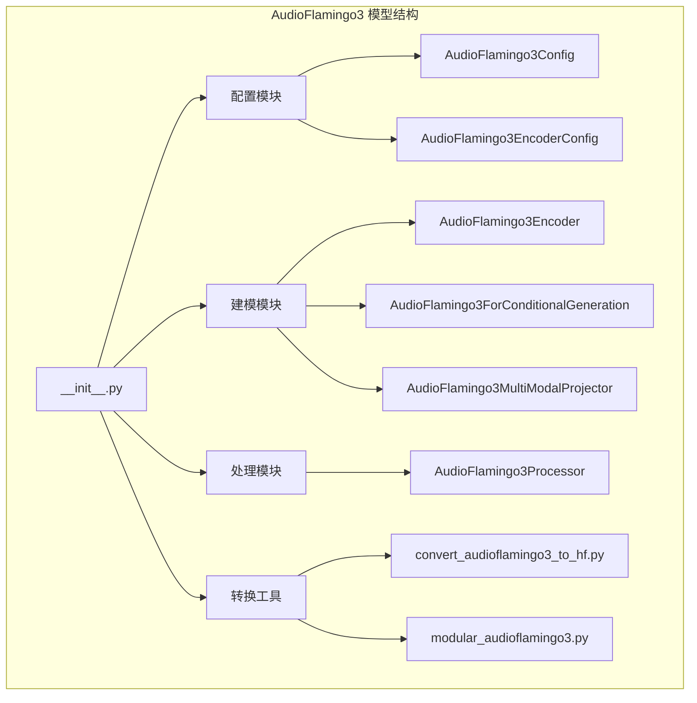
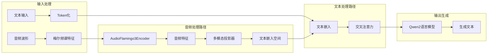
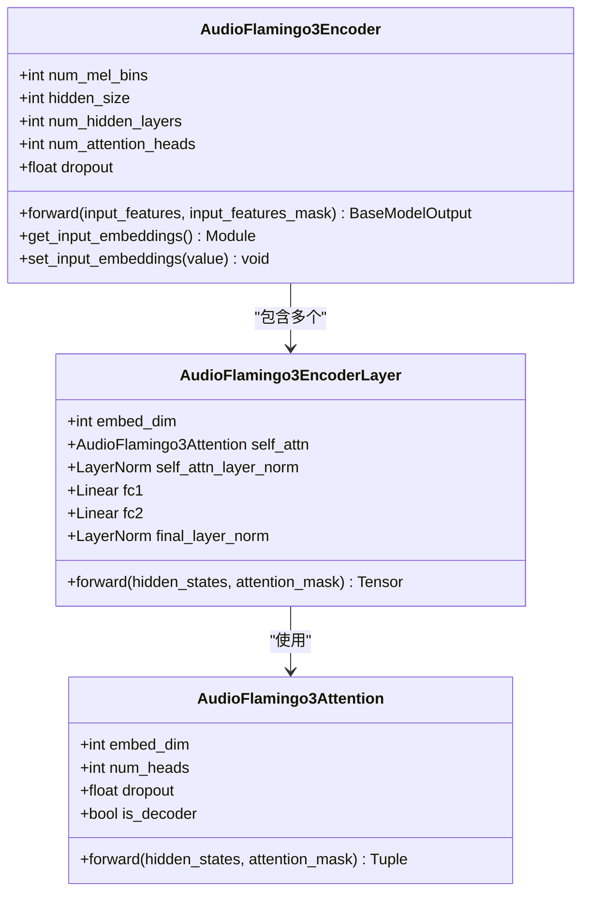
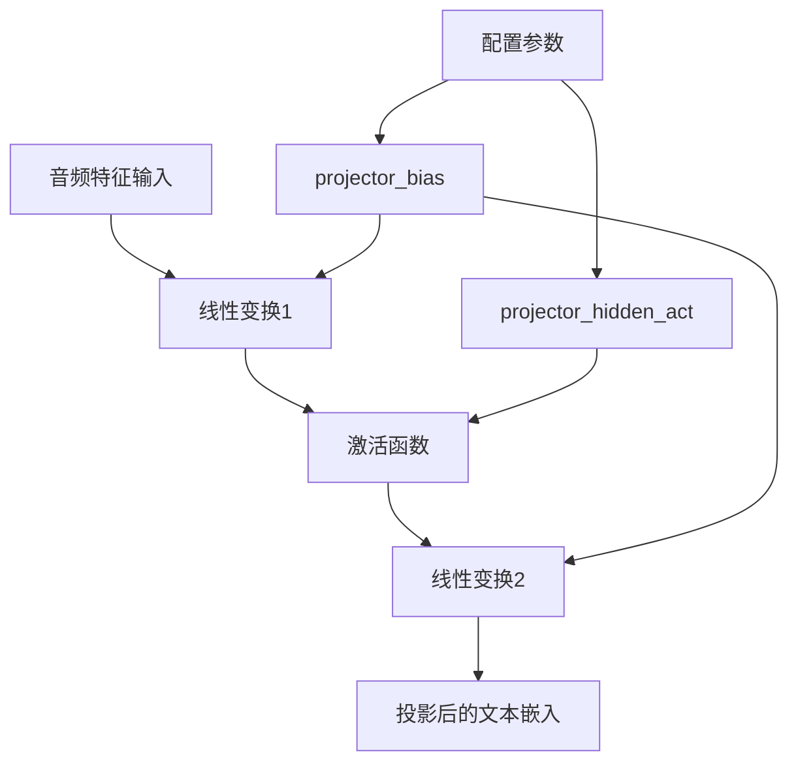
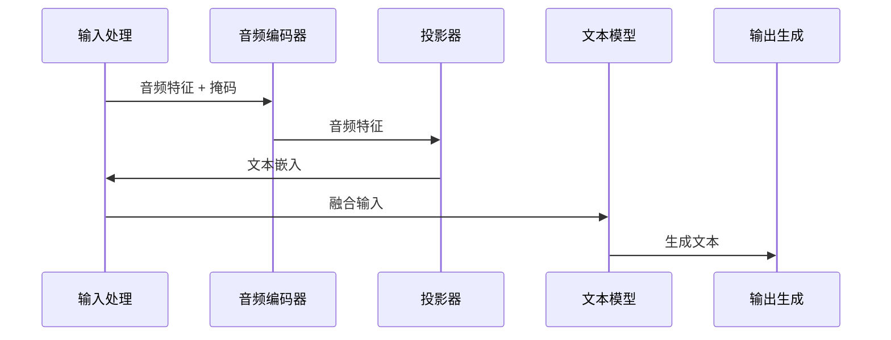
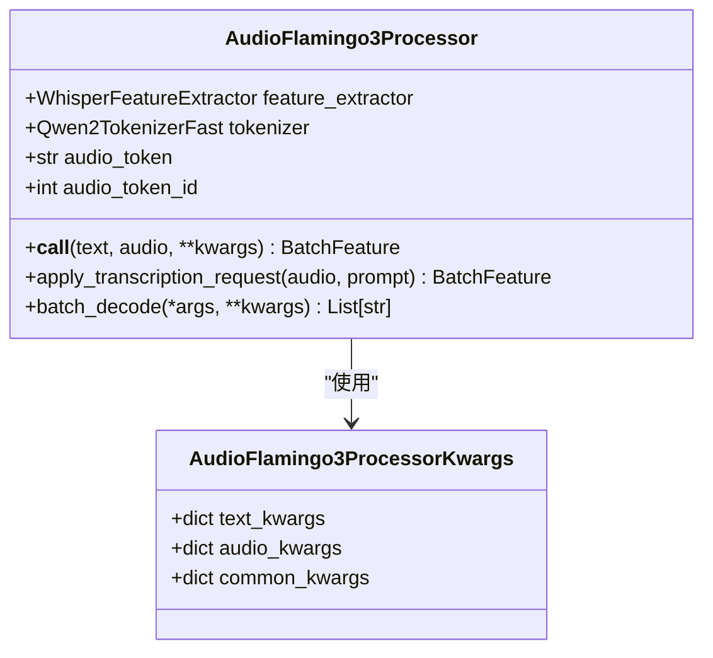
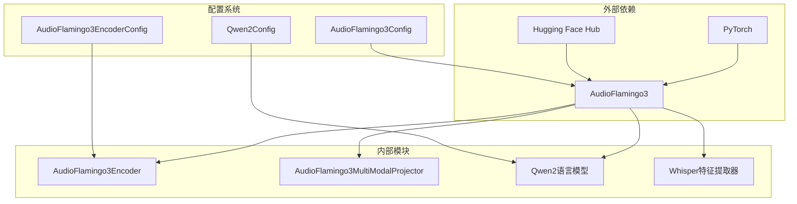

# AudioFlamingo3 详细技术文档

<cite>
**本文档中引用的文件**
- [__init__.py](file://src/transformers/models/audioflamingo3/__init__.py)
- [configuration_audioflamingo3.py](file://src/transformers/models/audioflamingo3/configuration_audioflamingo3.py)
- [modeling_audioflamingo3.py](file://src/transformers/models/audioflamingo3/modeling_audioflamingo3.py)
- [processing_audioflamingo3.py](file://src/transformers/models/audioflamingo3/processing_audioflamingo3.py)
- [convert_audioflamingo3_to_hf.py](file://src/transformers/models/audioflamingo3/convert_audioflamingo3_to_hf.py)
- [modular_audioflamingo3.py](file://src/transformers/models/audioflamingo3/modular_audioflamingo3.py)
- [expected_results_batched.json](file://tests/fixtures/audioflamingo3/expected_results_batched.json)
- [expected_results_single.json](file://tests/fixtures/audioflamingo3/expected_results_single.json)
</cite>

## 目录
1. [简介](#简介)
2. [项目结构](#项目结构)
3. [核心组件](#核心组件)
4. [架构概览](#架构概览)
5. [详细组件分析](#详细组件分析)
6. [依赖关系分析](#依赖关系分析)
7. [性能考虑](#性能考虑)
8. [故障排除指南](#故障排除指南)
9. [结论](#结论)

## 简介

AudioFlamingo3 是一个先进的多模态音频-文本生成模型，由 NVIDIA 开发并集成到 Hugging Face Transformers 库中。该模型结合了 Whisper 音频编码器、Qwen2 文本语言模型和专门设计的多模态投影器，实现了强大的音频理解和生成能力。

### 主要特性
- **多模态融合**：无缝整合音频和文本输入
- **端到端训练**：支持音频转录、问答和对话生成
- **高效推理**：优化的注意力机制和缓存策略
- **灵活配置**：可定制的音频和文本配置参数

## 项目结构

AudioFlamingo3 模型在 Transformers 库中的组织结构如下：

**图表来源**
- [__init__.py](file://src/transformers/models/audioflamingo3/__init__.py#L1-L32)
- [configuration_audioflamingo3.py](file://src/transformers/models/audioflamingo3/configuration_audioflamingo3.py#L1-L211)
- [modeling_audioflamingo3.py](file://src/transformers/models/audioflamingo3/modeling_audioflamingo3.py#L1-L600)

**章节来源**
- [__init__.py](file://src/transformers/models/audioflamingo3/__init__.py#L1-L32)
- [configuration_audioflamingo3.py](file://src/transformers/models/audioflamingo3/configuration_audioflamingo3.py#L1-L211)

## 核心组件

AudioFlamingo3 的核心组件包括三个主要部分：

### 1. 音频编码器 (AudioFlamingo3Encoder)
负责处理音频特征提取和编码，采用类似 Whisper 的架构设计。

### 2. 多模态投影器 (AudioFlamingo3MultiModalProjector)
将音频特征投影到文本语言模型的嵌入空间，实现跨模态对齐。

### 3. 条件生成模型 (AudioFlamingo3ForConditionalGeneration)
结合音频和文本输入，执行条件文本生成任务。

**章节来源**
- [modeling_audioflamingo3.py](file://src/transformers/models/audioflamingo3/modeling_audioflamingo3.py#L256-L600)

## 架构概览

AudioFlamingo3 采用编码器-解码器架构，通过多模态投影器实现音频和文本的深度融合：

**图表来源**
- [modeling_audioflamingo3.py](file://src/transformers/models/audioflamingo3/modeling_audioflamingo3.py#L445-L578)
- [processing_audioflamingo3.py](file://src/transformers/models/audioflamingo3/processing_audioflamingo3.py#L92-L220)

## 详细组件分析

### 音频编码器 (AudioFlamingo3Encoder)

音频编码器是模型的核心音频处理组件，采用卷积神经网络和 Transformer 架构：

**图表来源**
- [modeling_audioflamingo3.py](file://src/transformers/models/audioflamingo3/modeling_audioflamingo3.py#L273-L373)
- [modeling_audioflamingo3.py](file://src/transformers/models/audioflamingo3/modeling_audioflamingo3.py#L197-L254)

#### 关键特性
- **卷积前端**：两层 1D 卷积处理梅尔频谱特征
- **位置编码**：固定位置嵌入提供序列位置信息
- **平均池化**：时间维度下采样 (time/2)
- **层归一化**：稳定训练过程

**章节来源**
- [modeling_audioflamingo3.py](file://src/transformers/models/audioflamingo3/modeling_audioflamingo3.py#L273-L373)

### 多模态投影器 (AudioFlamingo3MultiModalProjector)

投影器将音频特征映射到文本嵌入空间：

**图表来源**
- [modeling_audioflamingo3.py](file://src/transformers/models/audioflamingo3/modeling_audioflamingo3.py#L384-L405)

**章节来源**
- [modeling_audioflamingo3.py](file://src/transformers/models/audioflamingo3/modeling_audioflamingo3.py#L384-L405)

### 条件生成模型 (AudioFlamingo3ForConditionalGeneration)

主模型类，负责音频和文本的联合处理：

**图表来源**
- [modeling_audioflamingo3.py](file://src/transformers/models/audioflamingo3/modeling_audioflamingo3.py#L445-L578)

**章节来源**
- [modeling_audioflamingo3.py](file://src/transformers/models/audioflamingo3/modeling_audioflamingo3.py#L412-L600)

### 处理器 (AudioFlamingo3Processor)

统一的处理器类，整合音频特征提取和文本 token 化：

**图表来源**
- [processing_audioflamingo3.py](file://src/transformers/models/audioflamingo3/processing_audioflamingo3.py#L57-L319)

#### 核心功能
- **音频分块处理**：自动将长音频分割为可处理的片段
- **占位符扩展**：根据音频长度动态扩展 `<sound>` 占位符
- **批处理支持**：高效处理批量音频-文本对
- **转录请求**：简化语音识别任务的输入准备

**章节来源**
- [processing_audioflamingo3.py](file://src/transformers/models/audioflamingo3/processing_audioflamingo3.py#L57-L319)

## 依赖关系分析

AudioFlamingo3 模型的依赖关系图展示了其与 Transformers 生态系统的集成：

**图表来源**
- [configuration_audioflamingo3.py](file://src/transformers/models/audioflamingo3/configuration_audioflamingo3.py#L17-L20)
- [modeling_audioflamingo3.py](file://src/transformers/models/audioflamingo3/modeling_audioflamingo3.py#L39-L42)

### 主要依赖项

| 组件 | 版本要求 | 用途 |
|------|----------|------|
| PyTorch | 2.1+ | 深度学习框架 |
| Transformers | 最新版本 | 基础模型库 |
| Torch Audio | 最新版本 | 音频处理 |
| Numpy | 最新版本 | 数值计算 |

**章节来源**
- [convert_audioflamingo3_to_hf.py](file://src/transformers/models/audioflamingo3/convert_audioflamingo3_to_hf.py#L31-L39)

## 性能考虑

### 计算优化
- **注意力优化**：支持 Flash Attention 和 SDPA 注意力机制
- **梯度检查点**：减少内存占用，支持更大批次
- **混合精度**：支持 bf16 和 fp16 训练和推理

### 内存管理
- **缓存策略**：智能的 KV 缓存管理
- **动态批处理**：根据音频长度动态调整批次大小
- **参数冻结**：可选择性地冻结预训练权重

### 推理加速
- **并行解码**：支持多 GPU 推理
- **量化支持**：兼容各种量化技术
- **模型并行**：大型模型的分布式部署

## 故障排除指南

### 常见问题及解决方案

#### 1. 内存不足错误
**症状**：CUDA OOM 错误或内存溢出
**解决方案**：
- 减少批次大小
- 启用梯度检查点
- 使用混合精度训练
- 分割长音频序列

#### 2. 音频格式不匹配
**症状**：音频特征形状不匹配错误
**解决方案**：
- 确保音频采样率为 16kHz
- 检查音频时长不超过 10 分钟
- 使用正确的特征提取参数

#### 3. Token 匹配错误
**症状**：音频标记数量与文本不匹配
**解决方案**：
- 检查 `<sound>` 占位符的数量
- 验证音频特征提取的长度计算
- 确保处理器配置正确

**章节来源**
- [processing_audioflamingo3.py](file://src/transformers/models/audioflamingo3/processing_audioflamingo3.py#L144-L175)

### 测试验证

模型提供了完整的测试套件，包括：

- **单样本测试**：验证基本功能
- **批量测试**：测试批处理性能
- **边界情况测试**：处理极端输入

**章节来源**
- [expected_results_single.json](file://tests/fixtures/audioflamingo3/expected_results_single.json#L1-L1)
- [expected_results_batched.json](file://tests/fixtures/audioflamingo3/expected_results_batched.json#L1-L1)

## 结论

AudioFlamingo3 代表了多模态音频-文本处理领域的重大进展，通过创新的架构设计和优化的实现，为语音理解、转录和生成任务提供了强大的解决方案。其模块化的架构设计使得模型易于扩展和定制，而完善的工具链确保了从研究到生产的无缝过渡。

### 主要优势
- **技术先进性**：融合最新的音频和文本处理技术
- **实用性强**：提供完整的端到端解决方案
- **生态完善**：与 Hugging Face 生态系统深度集成
- **性能优异**：经过优化的推理和训练效率

### 应用前景
AudioFlamingo3 在以下领域具有广阔的应用前景：
- **语音助手**：智能语音交互系统
- **内容创作**：音频内容的文字化处理
- **无障碍服务**：语音内容的实时转录
- **多媒体分析**：音频和文本的联合分析

随着多模态 AI 技术的不断发展，AudioFlamingo3 将继续推动音频-文本融合应用的边界，为用户提供更加自然和智能的交互体验。