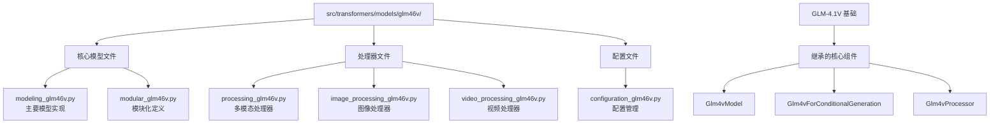
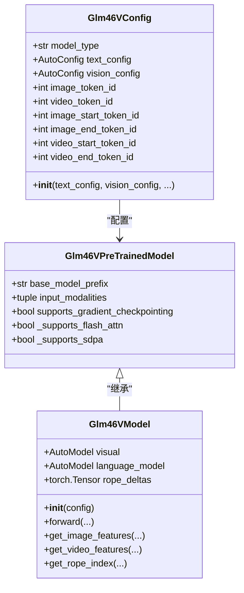
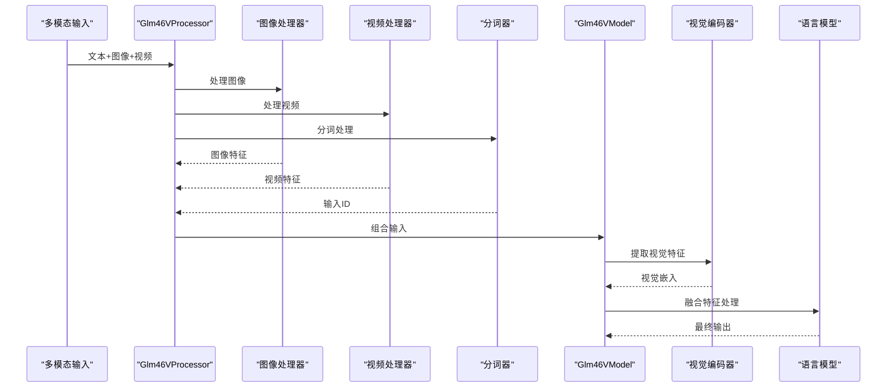
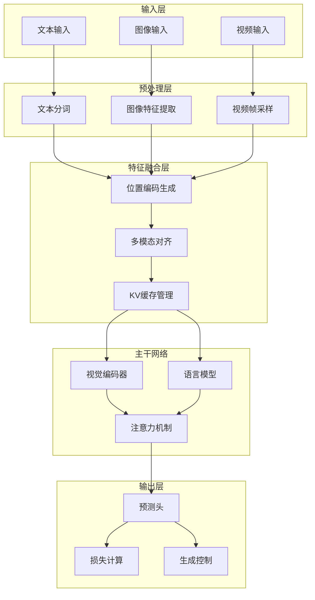
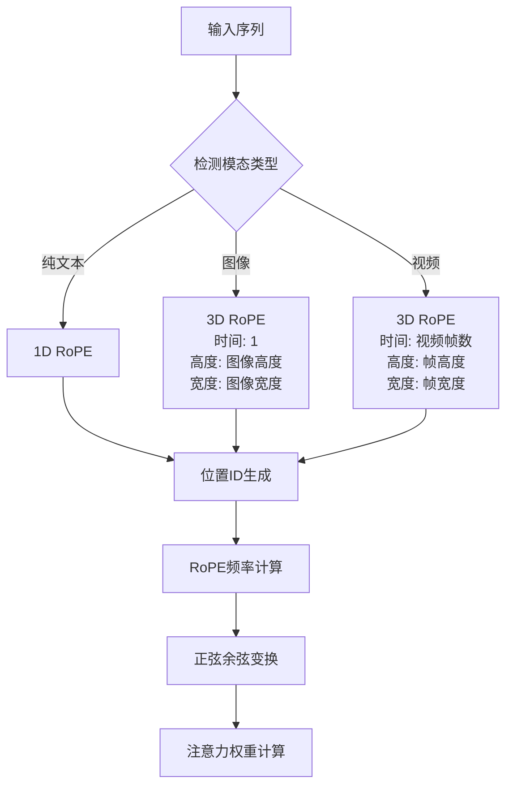
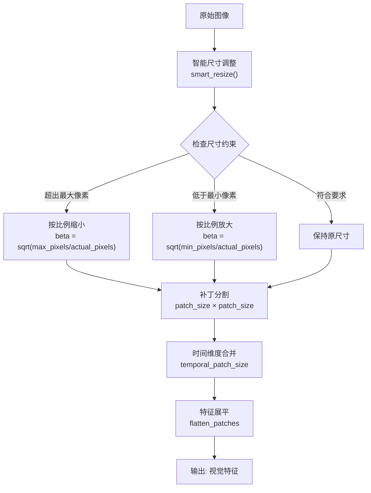
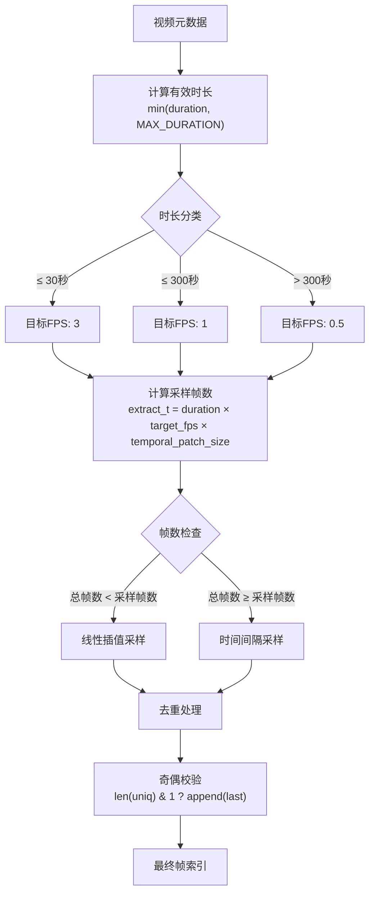
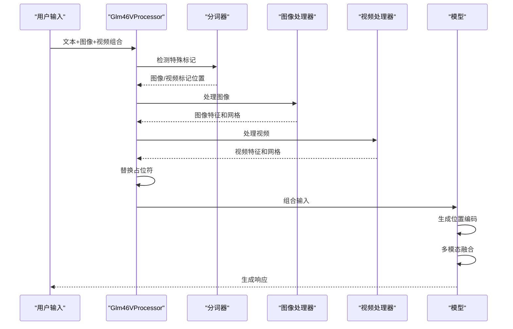
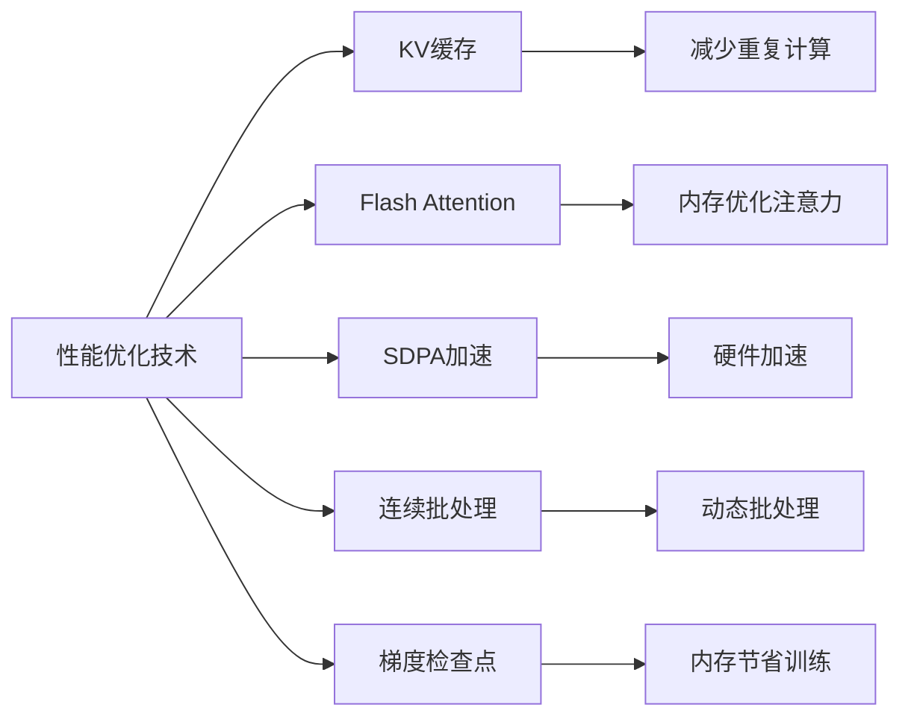

# Glm46v 模型架构与实现文档

<cite>
**本文档中引用的文件**
- [src/transformers/models/glm46v/__init__.py](file://src/transformers/models/glm46v/__init__.py)
- [src/transformers/models/glm46v/modular_glm46v.py](file://src/transformers/models/glm46v/modular_glm46v.py)
- [src/transformers/models/glm46v/modeling_glm46v.py](file://src/transformers/models/glm46v/modeling_glm46v.py)
- [src/transformers/models/glm46v/configuration_glm46v.py](file://src/transformers/models/glm46v/configuration_glm46v.py)
- [src/transformers/models/glm46v/processing_glm46v.py](file://src/transformers/models/glm46v/processing_glm46v.py)
- [src/transformers/models/glm46v/image_processing_glm46v.py](file://src/transformers/models/glm46v/image_processing_glm46v.py)
- [src/transformers/models/glm46v/video_processing_glm46v.py](file://src/transformers/models/glm46v/video_processing_glm46v.py)
- [src/transformers/models/glm4v/modeling_glm4v.py](file://src/transformers/models/glm4v/modeling_glm4v.py)
- [src/transformers/models/glm4v/configuration_glm4v.py](file://src/transformers/models/glm4v/configuration_glm4v.py)
</cite>

## 目录
1. [简介](#简介)
2. [项目结构](#项目结构)
3. [核心组件](#核心组件)
4. [架构概览](#架构概览)
5. [详细组件分析](#详细组件分析)
6. [多模态处理机制](#多模态处理机制)
7. [性能优化特性](#性能优化特性)
8. [使用示例](#使用示例)
9. [故障排除指南](#故障排除指南)
10. [结论](#结论)

## 简介

Glm46v 是一个先进的多模态大语言模型（Multimodal Large Language Model），专门设计用于处理文本、图像和视频等多种输入模态。该模型继承自 GLM-4.1V 架构，并在此基础上进行了多项创新性改进，特别是在多模态融合、位置编码和推理效率方面。

### 主要特性

- **多模态融合能力**：支持同时处理文本、图像和视频输入
- **动态位置编码**：采用三维旋转位置编码（3D RoPE）处理多维数据
- **高效推理**：集成 KV 缓存和连续批处理优化
- **模块化设计**：基于 GLM-4.1V 的模块化架构
- **高性能优化**：支持 Flash Attention 和 SDPA 加速

## 项目结构

Glm46v 模型在 transformers 库中的组织结构体现了其模块化设计理念：



**图表来源**
- [src/transformers/models/glm46v/__init__.py](file://src/transformers/models/glm46v/__init__.py#L1-L32)
- [src/transformers/models/glm46v/modular_glm46v.py](file://src/transformers/models/glm46v/modular_glm46v.py#L1-L218)

**章节来源**
- [src/transformers/models/glm46v/__init__.py](file://src/transformers/models/glm46v/__init__.py#L1-L32)
- [src/transformers/models/glm46v/modular_glm46v.py](file://src/transformers/models/glm46v/modular_glm46v.py#L1-L218)

## 核心组件

### 配置系统

Glm46v 的配置系统采用了分层架构，支持文本和视觉两个子模型的独立配置：



**图表来源**
- [src/transformers/models/glm46v/configuration_glm46v.py](file://src/transformers/models/glm46v/configuration_glm46v.py#L27-L107)
- [src/transformers/models/glm46v/modeling_glm46v.py](file://src/transformers/models/glm46v/modeling_glm46v.py#L39-L95)

### 多模态融合架构

Glm46v 实现了复杂的多模态融合机制，能够将视觉特征与文本特征无缝结合：



**图表来源**
- [src/transformers/models/glm46v/processing_glm46v.py](file://src/transformers/models/glm46v/processing_glm46v.py#L78-L208)
- [src/transformers/models/glm46v/modeling_glm46v.py](file://src/transformers/models/glm46v/modeling_glm46v.py#L374-L479)

**章节来源**
- [src/transformers/models/glm46v/configuration_glm46v.py](file://src/transformers/models/glm46v/configuration_glm46v.py#L27-L107)
- [src/transformers/models/glm46v/modeling_glm46v.py](file://src/transformers/models/glm46v/modeling_glm46v.py#L39-L95)

## 架构概览

Glm46v 采用双塔架构，将视觉理解和语言理解分离但又紧密耦合：



**图表来源**
- [src/transformers/models/glm46v/modeling_glm46v.py](file://src/transformers/models/glm46v/modeling_glm46v.py#L80-L100)
- [src/transformers/models/glm46v/processing_glm46v.py](file://src/transformers/models/glm46v/processing_glm46v.py#L78-L140)

## 详细组件分析

### 三维旋转位置编码（3D RoPE）

Glm46v 的核心创新之一是其三维旋转位置编码机制，能够处理时间、高度和宽度三个维度的信息：



**图表来源**
- [src/transformers/models/glm46v/modeling_glm46v.py](file://src/transformers/models/glm46v/modeling_glm46v.py#L103-L291)

### 图像特征提取

图像处理模块实现了智能的尺寸调整和补丁分割策略：



**图表来源**
- [src/transformers/models/glm46v/image_processing_glm46v.py](file://src/transformers/models/glm46v/image_processing_glm46v.py#L66-L97)
- [src/transformers/models/glm46v/image_processing_glm46v.py](file://src/transformers/models/glm46v/image_processing_glm46v.py#L261-L312)

### 视频帧采样算法

视频处理模块采用了动态帧采样策略，根据视频时长自动调整采样率：



**图表来源**
- [src/transformers/models/glm46v/video_processing_glm46v.py](file://src/transformers/models/glm46v/video_processing_glm46v.py#L105-L179)

**章节来源**
- [src/transformers/models/glm46v/modeling_glm46v.py](file://src/transformers/models/glm46v/modeling_glm46v.py#L103-L291)
- [src/transformers/models/glm46v/image_processing_glm46v.py](file://src/transformers/models/glm46v/image_processing_glm46v.py#L66-L97)
- [src/transformers/models/glm46v/video_processing_glm46v.py](file://src/transformers/models/glm46v/video_processing_glm46v.py#L105-L179)

## 多模态处理机制

### 输入模态识别与处理流程

Glm46v 实现了智能的多模态输入识别和处理机制：



**图表来源**
- [src/transformers/models/glm46v/processing_glm46v.py](file://src/transformers/models/glm46v/processing_glm46v.py#L142-L198)

### 特征对齐与融合策略

模型采用多层次的特征对齐策略确保不同模态间的语义一致性：

| 对齐层次 | 方法 | 目标 | 实现方式 |
|---------|------|------|----------|
| 语义级对齐 | 注意力机制 | 语义关联 | 双向交叉注意力 |
| 空间级对齐 | 位置编码 | 空间关系 | 3D RoPE编码 |
| 时间级对齐 | 帧同步 | 时间顺序 | 动态帧采样 |
| 特征级对齐 | 维度匹配 | 尺寸兼容 | 线性投影融合 |

**章节来源**
- [src/transformers/models/glm46v/processing_glm46v.py](file://src/transformers/models/glm46v/processing_glm46v.py#L142-L198)

## 性能优化特性

### 推理加速技术

Glm46v 集成了多种性能优化技术：



### 内存管理优化

模型实现了智能的内存管理策略：

- **动态内存分配**：根据输入规模动态调整内存使用
- **特征缓存**：缓存常用特征避免重复计算
- **梯度累积**：支持大规模批次的梯度累积
- **混合精度**：支持 FP16/BF16 计算

**章节来源**
- [src/transformers/models/glm46v/modeling_glm46v.py](file://src/transformers/models/glm46v/modeling_glm46v.py#L39-L95)

## 使用示例

### 基本使用方法

以下展示了如何使用 Glm46v 进行多模态任务：

```python
# 基本示例：图像描述生成
from transformers import Glm46VForConditionalGeneration, AutoProcessor
from PIL import Image
import torch

# 加载模型和处理器
model = Glm46VForConditionalGeneration.from_pretrained("THUDM/GLM-4.1V-9B-Thinking")
processor = AutoProcessor.from_pretrained("THUDM/GLM-4.1V-9B-Thinking")

# 准备输入
messages = [
    {
        "role": "user",
        "content": [
            {"type": "image"},
            {"type": "text", "text": "这张图片展示了什么？"}
        ]
    }
]

# 加载图像
image = Image.open("example.jpg")

# 处理输入
text = processor.apply_chat_template(messages, tokenize=False, add_generation_prompt=True)
inputs = processor(text=[text], images=[image])

# 生成响应
generate_ids = model.generate(inputs.input_ids, max_length=30)
response = processor.batch_decode(generate_ids, skip_special_tokens=True, clean_up_tokenization_spaces=False)[0]
```

### 视频理解示例

```python
# 视频内容理解
from transformers import Glm46VForConditionalGeneration, AutoProcessor
import torch

# 加载模型
model = Glm46VForConditionalGeneration.from_pretrained("THUDM/GLM-4.1V-9B-Thinking")
processor = AutoProcessor.from_pretrained("THUDM/GLM-4.1V-9B-Thinking")

# 视频处理示例
messages = [
    {
        "role": "user",
        "content": [
            {"type": "video"},
            {"type": "text", "text": "这段视频的主要内容是什么？"}
        ]
    }
]

# 处理视频输入
text = processor.apply_chat_template(messages, tokenize=False, add_generation_prompt=True)
inputs = processor(text=[text], videos=[video_tensor])

# 生成回答
generate_ids = model.generate(inputs.input_ids, max_length=50)
answer = processor.batch_decode(generate_ids, skip_special_tokens=True)[0]
```

## 故障排除指南

### 常见问题及解决方案

| 问题类型 | 症状 | 可能原因 | 解决方案 |
|---------|------|----------|----------|
| 内存不足 | CUDA out of memory | 输入过大或批次过多 | 减少批次大小或输入序列长度 |
| 性能缓慢 | 推理速度慢 | 缺少硬件加速 | 启用 Flash Attention 或使用 GPU |
| 模态错误 | 特征不匹配 | 输入格式错误 | 检查输入模态和标记配置 |
| 位置编码异常 | 注意力异常 | RoPE参数错误 | 验证配置中的位置编码参数 |

### 调试技巧

1. **启用详细日志**：设置环境变量 `TRANSFORMERS_VERBOSITY=debug`
2. **检查输入形状**：验证图像和视频的尺寸是否符合预期
3. **监控内存使用**：使用 `torch.cuda.memory_summary()` 检查 GPU 内存
4. **验证配置**：确认模型配置与处理器配置的一致性

**章节来源**
- [src/transformers/models/glm46v/modeling_glm46v.py](file://src/transformers/models/glm46v/modeling_glm46v.py#L333-L372)

## 结论

Glm46v 代表了多模态大语言模型领域的重要进展，通过其创新的三维位置编码、智能特征融合和高效的推理机制，为多模态AI应用提供了强大的基础设施。其模块化的设计使得扩展和定制变得简单，而丰富的优化特性确保了在各种硬件环境下的良好性能。

### 技术优势总结

- **创新的位置编码**：3D RoPE 支持复杂的空间和时间关系建模
- **智能特征融合**：多层次对齐确保模态间的语义一致性
- **高效推理**：多种优化技术显著提升性能
- **灵活的架构**：模块化设计便于扩展和定制
- **完整的工具链**：从预处理到后处理的完整解决方案

### 应用前景

Glm46v 在以下领域具有广阔的应用前景：
- **智能客服**：支持图像和视频内容的理解
- **教育辅助**：多模态教学内容生成
- **医疗诊断**：医学影像与病历的智能分析
- **内容创作**：多媒体内容的自动生成
- **科学研究**：跨模态数据分析和可视化

随着多模态AI技术的不断发展，Glm46v 将为构建更加智能和人性化的AI系统提供坚实的技术基础。