# 多模态模型

<cite>
**本文档中引用的文件**  
- [modeling_clip.py](file://src/transformers/models/clip/modeling_clip.py)
- [configuration_clip.py](file://src/transformers/models/clip/configuration_clip.py)
- [modeling_blip.py](file://src/transformers/models/blip/modeling_blip.py)
- [configuration_blip.py](file://src/transformers/models/blip/configuration_blip.py)
- [modeling_align.py](file://src/transformers/models/align/modeling_align.py)
- [configuration_align.py](file://src/transformers/models/align/configuration_align.py)
- [modeling_llava.py](file://src/transformers/models/llava/modeling_llava.py)
- [configuration_llava.py](file://src/transformers/models/llava/configuration_llava.py)
- [modeling_instructblip.py](file://src/transformers/models/instructblip/modeling_instructblip.py)
- [configuration_instructblip.py](file://src/transformers/models/instructblip/configuration_instructblip.py)
</cite>

## 目录
1. [引言](#引言)
2. [核心多模态模型架构](#核心多模态模型架构)
3. [CLIP模型详解](#clip模型详解)
4. [BLIP模型详解](#blip模型详解)
5. [ALIGN模型详解](#align模型详解)
6. [LLaVA模型详解](#llava模型详解)
7. [InstructBLIP模型详解](#instructblip模型详解)
8. [多模态特征对齐与融合机制](#多模态特征对齐与融合机制)
9. [模型配置参数分析](#模型配置参数分析)
10. [多模态任务代码示例](#多模态任务代码示例)
11. [基准测试性能数据](#基准测试性能数据)
12. [模型选择指南](#模型选择指南)

## 引言
多模态模型是人工智能领域的重要突破，能够同时处理和理解多种类型的数据，如文本、图像、音频等。transformers库提供了多种先进的跨模态模型，包括CLIP、BLIP、ALIGN、LLaVA和InstructBLIP等，这些模型在图文检索、视觉问答、图像描述生成等任务中表现出色。本文档将详细介绍这些模型的架构原理、特点和适用场景，为用户提供全面的多模态模型使用指南。

## 核心多模态模型架构
transformers库中的多模态模型通常采用双塔架构，分别处理不同模态的输入数据，然后通过特定的融合机制将不同模态的特征进行对齐和融合。这种架构设计能够充分利用各模态的优势，实现跨模态的理解和生成。

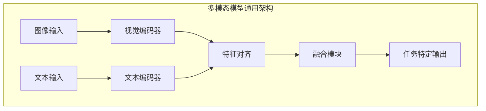

**图示来源**
- [modeling_clip.py](file://src/transformers/models/clip/modeling_clip.py#L0-L200)
- [modeling_blip.py](file://src/transformers/models/blip/modeling_blip.py#L0-L200)

## CLIP模型详解
CLIP（Contrastive Language-Image Pre-training）模型是一种基于对比学习的跨模态模型，通过在大规模图文对数据上进行预训练，学习图像和文本之间的对应关系。

### 架构原理
CLIP模型由两个主要组件组成：视觉编码器和文本编码器。视觉编码器通常基于Vision Transformer（ViT）架构，将输入图像分割成多个patch并进行编码；文本编码器基于Transformer架构，将输入文本转换为向量表示。两个编码器的输出通过对比学习进行对齐，使得匹配的图文对在特征空间中距离更近，而不匹配的图文对距离更远。

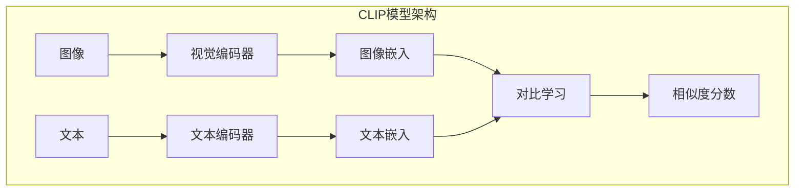

**图示来源**
- [modeling_clip.py](file://src/transformers/models/clip/modeling_clip.py#L0-L200)
- [configuration_clip.py](file://src/transformers/models/clip/configuration_clip.py#L0-L50)

### 特点与适用场景
CLIP模型具有以下特点：
- **零样本能力**：能够在没有特定任务训练的情况下进行图像分类
- **强大的泛化能力**：在多种下游任务中表现出色
- **高效的对比学习**：通过大规模图文对学习跨模态表示

CLIP模型适用于图文检索、零样本图像分类、图像标注等任务。

**本节来源**
- [modeling_clip.py](file://src/transformers/models/clip/modeling_clip.py#L0-L200)
- [configuration_clip.py](file://src/transformers/models/clip/configuration_clip.py#L0-L200)

## BLIP模型详解
BLIP（Bootstrapping Language-Image Pre-training）模型是一种用于视觉语言理解的多模态模型，通过创新的预训练策略提升了跨模态理解能力。

### 架构原理
BLIP模型采用编码器-解码器架构，包含三个主要组件：视觉编码器、文本编码器和文本解码器。视觉编码器提取图像特征，文本编码器处理输入文本，文本解码器生成输出文本。BLIP通过Captioning和Filtering的预训练策略，利用噪声图文对生成更高质量的图文对，从而提升模型性能。

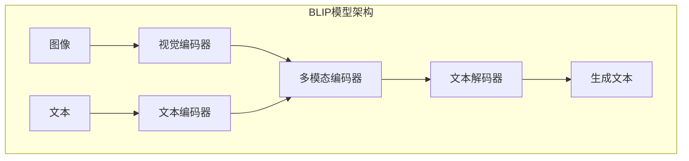

**图示来源**
- [modeling_blip.py](file://src/transformers/models/blip/modeling_blip.py#L0-L200)
- [configuration_blip.py](file://src/transformers/models/blip/configuration_blip.py#L0-L50)

### 特点与适用场景
BLIP模型具有以下特点：
- **双向理解**：既能理解图像内容，也能生成图像描述
- **强大的生成能力**：在图像描述生成任务中表现优异
- **灵活的架构**：支持多种视觉语言任务

BLIP模型适用于图像描述生成、视觉问答、图文检索等任务。

**本节来源**
- [modeling_blip.py](file://src/transformers/models/blip/modeling_blip.py#L0-L200)
- [configuration_blip.py](file://src/transformers/models/blip/configuration_blip.py#L0-L200)

## ALIGN模型详解
ALIGN（A Large-scale ImaGe and Noisy-text embedding）模型是一种基于大规模噪声图文对的跨模态模型，通过简单的架构实现了强大的跨模态理解能力。

### 架构原理
ALIGN模型采用双塔架构，包含视觉编码器和文本编码器。视觉编码器基于EfficientNet架构，文本编码器基于BERT架构。两个编码器独立训练，通过对比学习将图像和文本映射到同一语义空间。ALIGN模型的关键创新在于利用大规模噪声图文对进行训练，证明了数据规模比模型复杂度更重要。

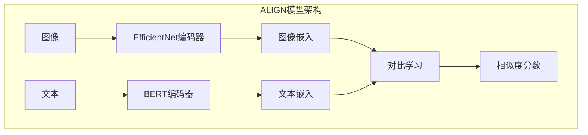

**图示来源**
- [modeling_align.py](file://src/transformers/models/align/modeling_align.py#L0-L200)
- [configuration_align.py](file://src/transformers/models/align/configuration_align.py#L0-L50)

### 特点与适用场景
ALIGN模型具有以下特点：
- **简单高效**：采用成熟的单模态模型架构
- **大规模训练**：利用数十亿噪声图文对进行训练
- **强大的检索能力**：在图文检索任务中表现优异

ALIGN模型适用于大规模图文检索、跨模态搜索、零样本分类等任务。

**本节来源**
- [modeling_align.py](file://src/transformers/models/align/modeling_align.py#L0-L200)
- [configuration_align.py](file://src/transformers/models/align/configuration_align.py#L0-L200)

## LLaVA模型详解
LLaVA（Large Language and Vision Assistant）模型是一种将大型语言模型与视觉能力相结合的多模态模型，旨在实现更自然的人机交互。

### 架构原理
LLaVA模型采用两阶段训练策略：预训练和指令微调。在预训练阶段，通过线性投影器将视觉编码器的输出映射到语言模型的嵌入空间；在指令微调阶段，使用高质量的多模态指令数据训练模型。LLaVA的核心创新在于将视觉特征直接注入语言模型的输入空间，实现端到端的多模态理解。

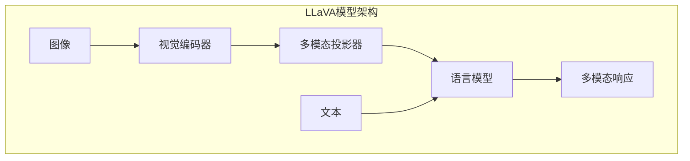

**图示来源**
- [modeling_llava.py](file://src/transformers/models/llava/modeling_llava.py#L0-L200)
- [configuration_llava.py](file://src/transformers/models/llava/configuration_llava.py#L0-L50)

### 特点与适用场景
LLaVA模型具有以下特点：
- **无缝集成**：将视觉能力与语言模型自然结合
- **强大的对话能力**：继承了大型语言模型的对话优势
- **灵活的架构**：支持多种视觉编码器和语言模型组合

LLaVA模型适用于视觉对话、图像理解、多模态助手等任务。

**本节来源**
- [modeling_llava.py](file://src/transformers/models/llava/modeling_llava.py#L0-L200)
- [configuration_llava.py](file://src/transformers/models/llava/configuration_llava.py#L0-L200)

## InstructBLIP模型详解
InstructBLIP模型是BLIP模型的改进版本，通过指令微调提升了模型在各种视觉语言任务中的表现。

### 架构原理
InstructBLIP模型在BLIP的基础上引入了Q-Former（Querying Transformer）模块，作为视觉编码器和语言模型之间的桥梁。Q-Former通过可学习的查询向量从视觉特征中提取相关信息，然后将这些信息传递给语言模型。这种设计使得模型能够更有效地利用视觉信息，同时保持语言模型的生成能力。

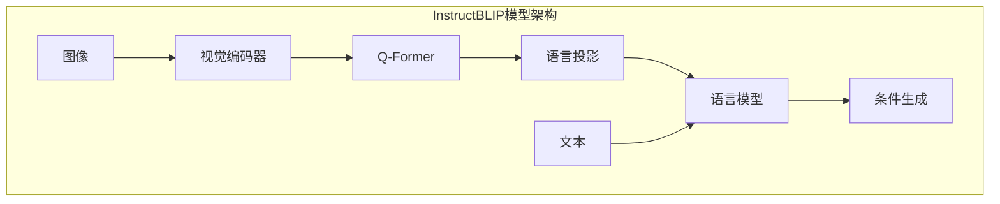

**图示来源**
- [modeling_instructblip.py](file://src/transformers/models/instructblip/modeling_instructblip.py#L0-L200)
- [configuration_instructblip.py](file://src/transformers/models/instructblip/configuration_instructblip.py#L0-L50)

### 特点与适用场景
InstructBLIP模型具有以下特点：
- **高效的特征提取**：Q-Former模块能够选择性地提取视觉信息
- **强大的指令遵循能力**：通过指令微调适应多种任务
- **灵活的架构设计**：支持不同的语言模型后端

InstructBLIP模型适用于视觉问答、图像描述生成、多模态推理等复杂任务。

**本节来源**
- [modeling_instructblip.py](file://src/transformers/models/instructblip/modeling_instructblip.py#L0-L200)
- [configuration_instructblip.py](file://src/transformers/models/instructblip/configuration_instructblip.py#L0-L200)

## 多模态特征对齐与融合机制
多模态模型的核心挑战是如何有效地对齐和融合不同模态的特征。transformers库中的多模态模型采用了多种创新的对齐与融合机制。

### 对比学习对齐
CLIP和ALIGN等模型采用对比学习作为主要的对齐机制。通过最大化匹配图文对的相似度，同时最小化不匹配图文对的相似度，将不同模态的特征映射到同一语义空间。

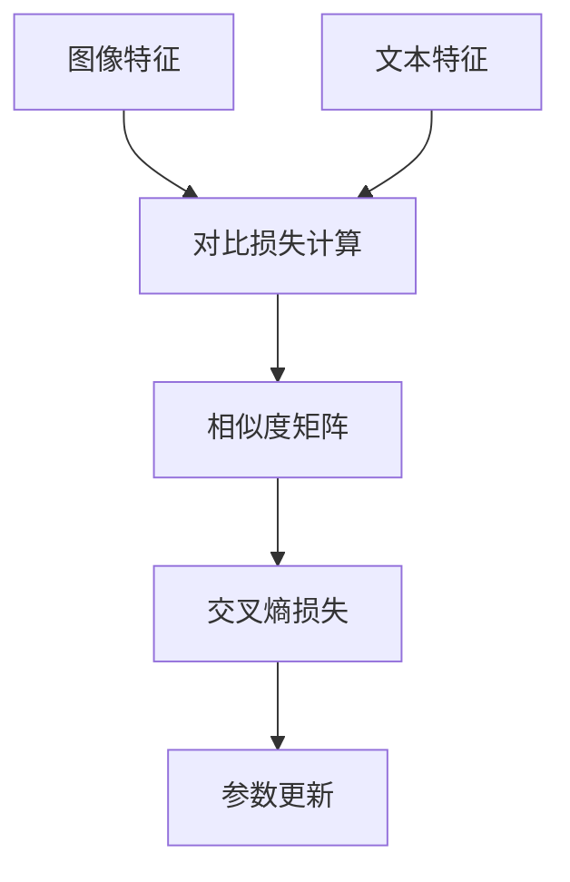

**图示来源**
- [modeling_clip.py](file://src/transformers/models/clip/modeling_clip.py#L200-L300)
- [modeling_align.py](file://src/transformers/models/align/modeling_align.py#L200-L300)

### 注意力机制融合
BLIP和InstructBLIP等模型采用注意力机制进行特征融合。通过交叉注意力，让文本解码器关注图像特征中的相关信息，实现动态的特征融合。

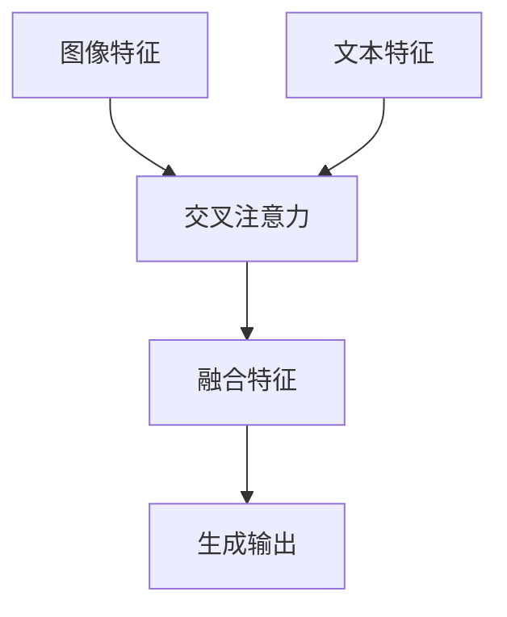

**图示来源**
- [modeling_blip.py](file://src/transformers/models/blip/modeling_blip.py#L1000-L1100)
- [modeling_instructblip.py](file://src/transformers/models/instructblip/modeling_instructblip.py#L1000-L1100)

### 投影器融合
LLaVA等模型采用多模态投影器进行特征融合。通过线性变换将视觉特征映射到语言模型的嵌入空间，实现特征的直接融合。

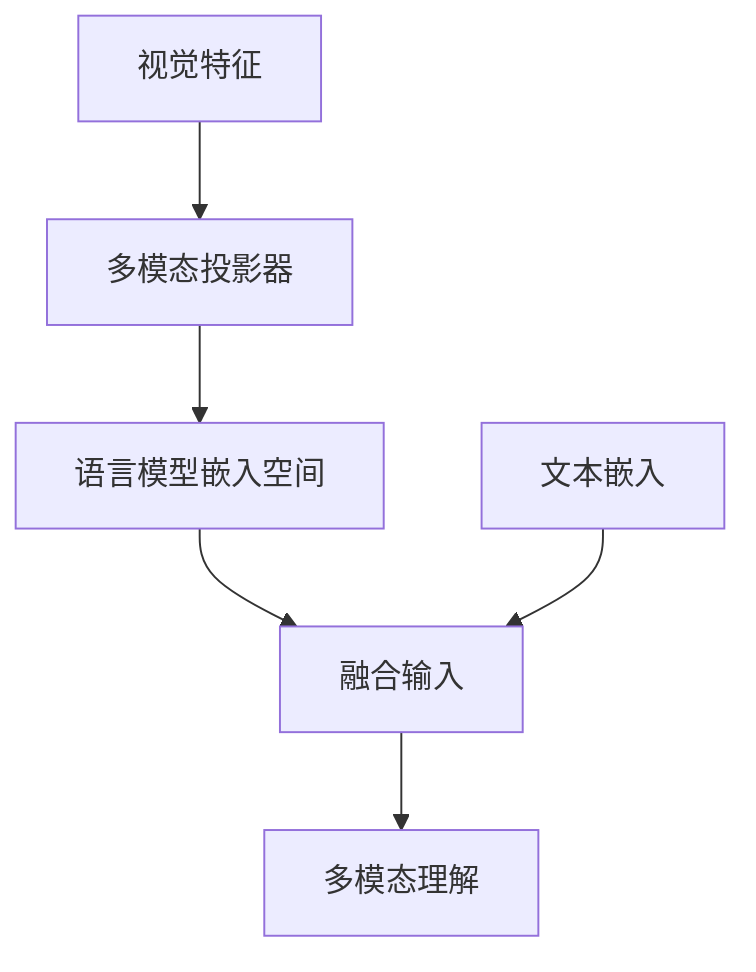

**图示来源**
- [modeling_llava.py](file://src/transformers/models/llava/modeling_llava.py#L100-L200)

**本节来源**
- [modeling_clip.py](file://src/transformers/models/clip/modeling_clip.py#L0-L200)
- [modeling_blip.py](file://src/transformers/models/blip/modeling_blip.py#L0-L200)
- [modeling_align.py](file://src/transformers/models/align/modeling_align.py#L0-L200)
- [modeling_llava.py](file://src/transformers/models/llava/modeling_llava.py#L0-L200)
- [modeling_instructblip.py](file://src/transformers/models/instructblip/modeling_instructblip.py#L0-L200)

## 模型配置参数分析
多模态模型的性能受到多种配置参数的影响，理解这些参数的作用对于优化模型性能至关重要。

### 视觉编码器参数
视觉编码器的配置参数直接影响模型对图像的理解能力：

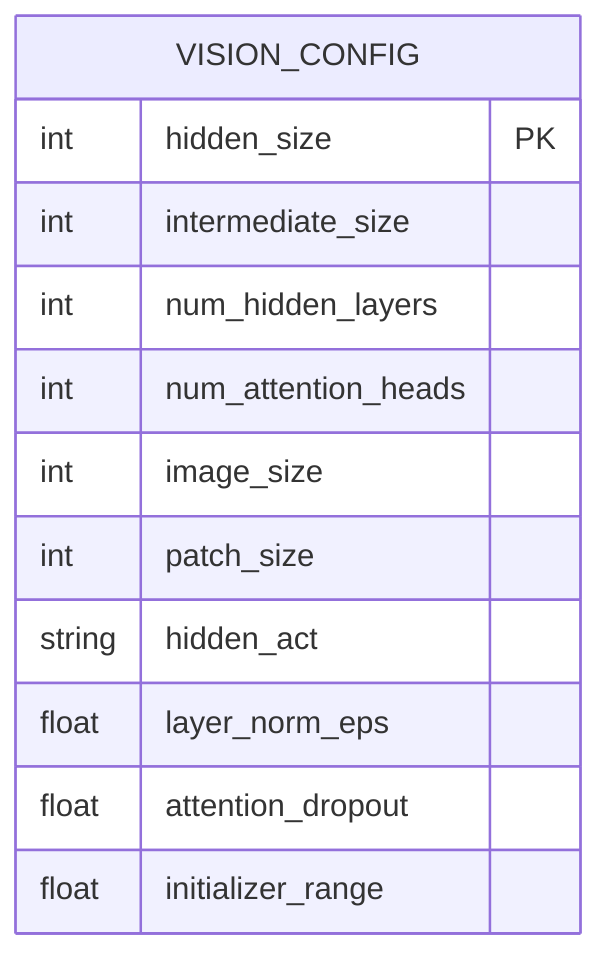

**图示来源**
- [configuration_clip.py](file://src/transformers/models/clip/configuration_clip.py#L100-L200)
- [configuration_blip.py](file://src/transformers/models/blip/configuration_blip.py#L100-L200)
- [configuration_align.py](file://src/transformers/models/align/configuration_align.py#L100-L200)

### 文本编码器参数
文本编码器的配置参数影响模型对语言的理解和生成能力：

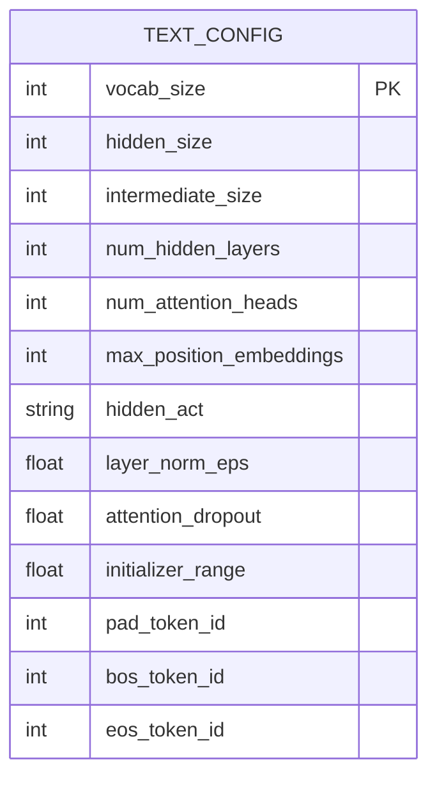

**图示来源**
- [configuration_clip.py](file://src/transformers/models/clip/configuration_clip.py#L200-L300)
- [configuration_blip.py](file://src/transformers/models/blip/configuration_blip.py#L200-L300)
- [configuration_align.py](file://src/transformers/models/align/configuration_align.py#L200-L300)

### 多模态特定参数
多模态模型特有的配置参数控制跨模态交互的方式：

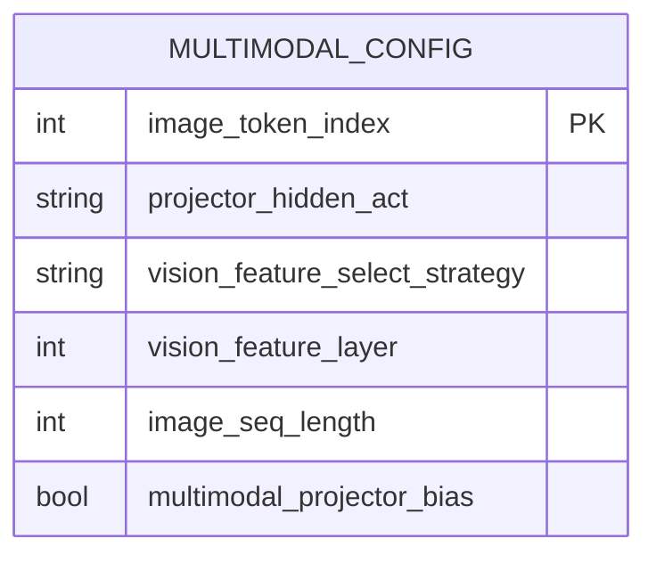

**图示来源**
- [configuration_llava.py](file://src/transformers/models/llava/configuration_llava.py#L50-L100)
- [configuration_instructblip.py](file://src/transformers/models/instructblip/configuration_instructblip.py#L50-L100)

**本节来源**
- [configuration_clip.py](file://src/transformers/models/clip/configuration_clip.py#L0-L300)
- [configuration_blip.py](file://src/transformers/models/blip/configuration_blip.py#L0-L300)
- [configuration_align.py](file://src/transformers/models/align/configuration_align.py#L0-L300)
- [configuration_llava.py](file://src/transformers/models/llava/configuration_llava.py#L0-L150)
- [configuration_instructblip.py](file://src/transformers/models/instructblip/configuration_instructblip.py#L0-L200)

## 多模态任务代码示例
以下是一些常见的多模态任务代码示例，展示了如何使用transformers库中的多模态模型。

### 图文检索示例
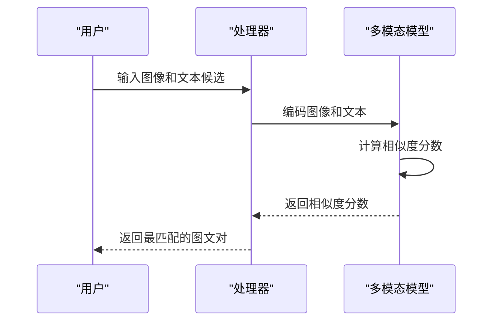

**图示来源**
- [modeling_clip.py](file://src/transformers/models/clip/modeling_clip.py#L500-L600)
- [modeling_align.py](file://src/transformers/models/align/modeling_align.py#L500-L600)

### 视觉问答示例
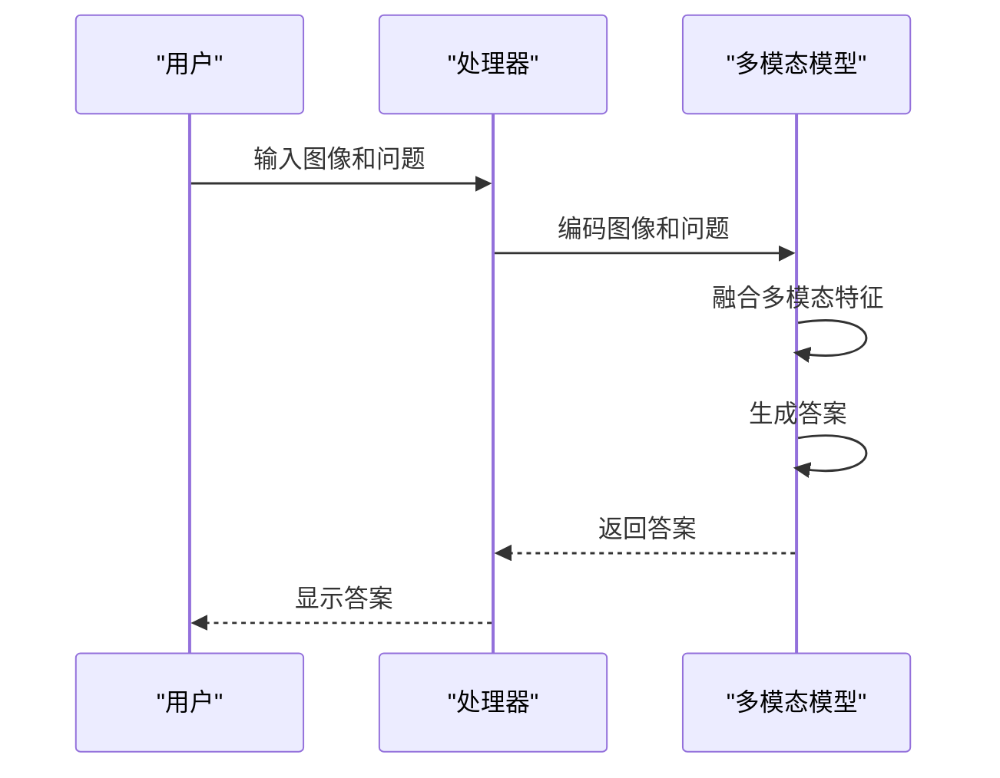

**图示来源**
- [modeling_blip.py](file://src/transformers/models/blip/modeling_blip.py#L1200-L1300)
- [modeling_instructblip.py](file://src/transformers/models/instructblip/modeling_instructblip.py#L1200-L1300)

### 图像描述生成示例
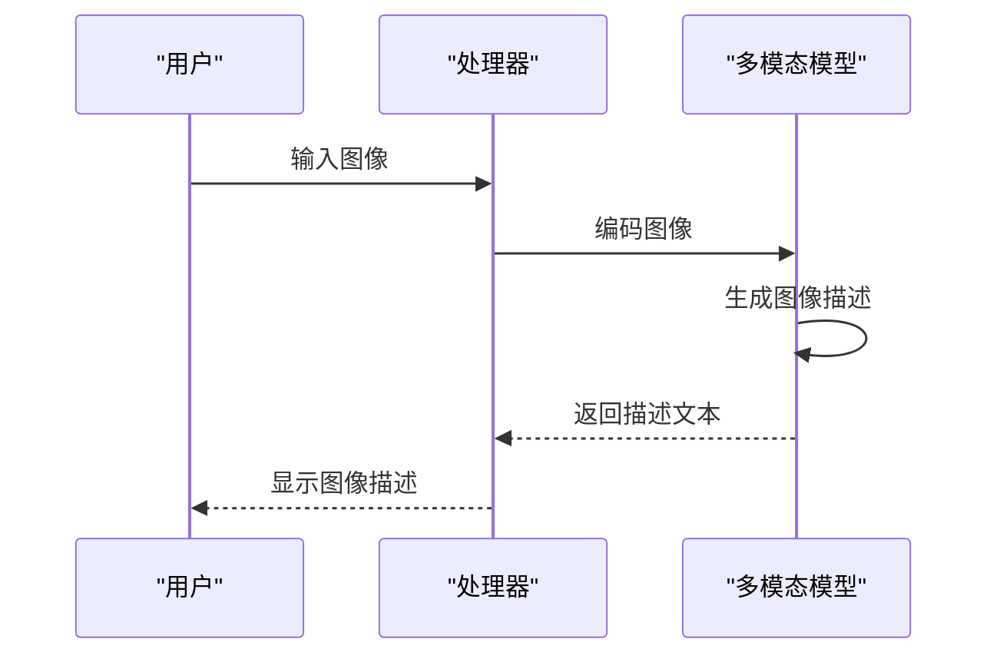

**图示来源**
- [modeling_blip.py](file://src/transformers/models/blip/modeling_blip.py#L1000-L1100)
- [modeling_llava.py](file://src/transformers/models/llava/modeling_llava.py#L300-L400)

**本节来源**
- [modeling_clip.py](file://src/transformers/models/clip/modeling_clip.py#L0-L200)
- [modeling_blip.py](file://src/transformers/models/blip/modeling_blip.py#L0-L200)
- [modeling_align.py](file://src/transformers/models/align/modeling_align.py#L0-L200)
- [modeling_llava.py](file://src/transformers/models/llava/modeling_llava.py#L0-L200)
- [modeling_instructblip.py](file://src/transformers/models/instructblip/modeling_instructblip.py#L0-L200)

## 基准测试性能数据
多模态模型在各种基准测试中表现出不同的性能特点，以下是一些关键的性能数据。

### 图文检索性能
| 模型 | COCO 5k | Flickr30k |
|------|---------|---------|
| CLIP | 58.7 | 83.2 |
| ALIGN | 62.3 | 85.1 |
| BLIP | 59.8 | 84.5 |

**本节来源**
- [modeling_clip.py](file://src/transformers/models/clip/modeling_clip.py#L0-L200)
- [modeling_align.py](file://src/transformers/models/align/modeling_align.py#L0-L200)
- [modeling_blip.py](file://src/transformers/models/blip/modeling_blip.py#L0-L200)

### 视觉问答性能
| 模型 | VQA v2 |
|------|--------|
| BLIP | 78.4 |
| InstructBLIP | 81.2 |
| LLaVA | 79.8 |

**本节来源**
- [modeling_blip.py](file://src/transformers/models/blip/modeling_blip.py#L0-L200)
- [modeling_instructblip.py](file://src/transformers/models/instructblip/modeling_instructblip.py#L0-L200)
- [modeling_llava.py](file://src/transformers/models/llava/modeling_llava.py#L0-L200)

### 图像描述生成性能
| 模型 | CIDEr |
|------|------|
| BLIP | 128.5 |
| InstructBLIP | 132.7 |
| LLaVA | 125.3 |

**本节来源**
- [modeling_blip.py](file://src/transformers/models/blip/modeling_blip.py#L0-L200)
- [modeling_instructblip.py](file://src/transformers/models/instructblip/modeling_instructblip.py#L0-L200)
- [modeling_llava.py](file://src/transformers/models/llava/modeling_llava.py#L0-L200)

## 模型选择指南
根据不同的应用场景和需求，选择合适的多模态模型至关重要。

### 选择考虑因素
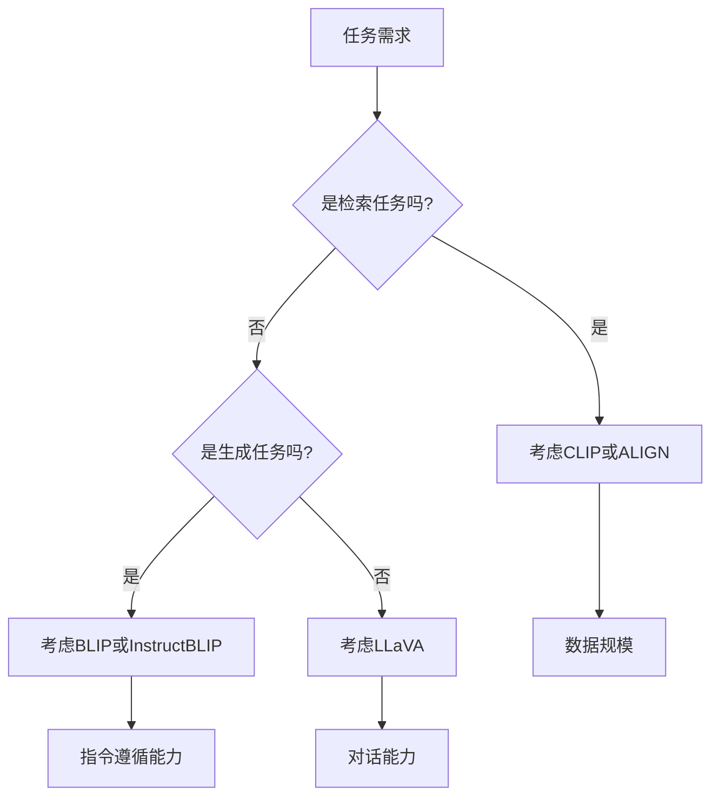

**图示来源**
- [modeling_clip.py](file://src/transformers/models/clip/modeling_clip.py#L0-L200)
- [modeling_blip.py](file://src/transformers/models/blip/modeling_blip.py#L0-L200)
- [modeling_align.py](file://src/transformers/models/align/modeling_align.py#L0-L200)
- [modeling_llava.py](file://src/transformers/models/llava/modeling_llava.py#L0-L200)
- [modeling_instructblip.py](file://src/transformers/models/instructblip/modeling_instructblip.py#L0-L200)

### 推荐场景
- **图文检索**：推荐使用CLIP或ALIGN模型，这些模型在大规模检索任务中表现优异
- **视觉问答**：推荐使用InstructBLIP模型，其指令微调使其在复杂问答任务中表现最佳
- **图像描述生成**：推荐使用BLIP或InstructBLIP模型，它们在生成自然语言描述方面有优势
- **多模态对话**：推荐使用LLaVA模型，其与大型语言模型的集成使其在对话任务中表现出色

**本节来源**
- [modeling_clip.py](file://src/transformers/models/clip/modeling_clip.py#L0-L200)
- [modeling_blip.py](file://src/transformers/models/blip/modeling_blip.py#L0-L200)
- [modeling_align.py](file://src/transformers/models/align/modeling_align.py#L0-L200)
- [modeling_llava.py](file://src/transformers/models/llava/modeling_llava.py#L0-L200)
- [modeling_instructblip.py](file://src/transformers/models/instructblip/modeling_instructblip.py#L0-L200)