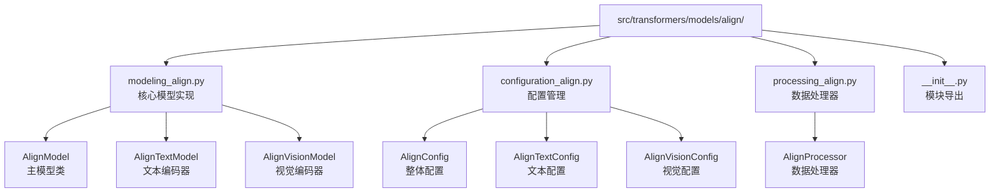
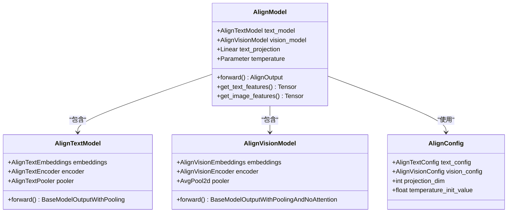
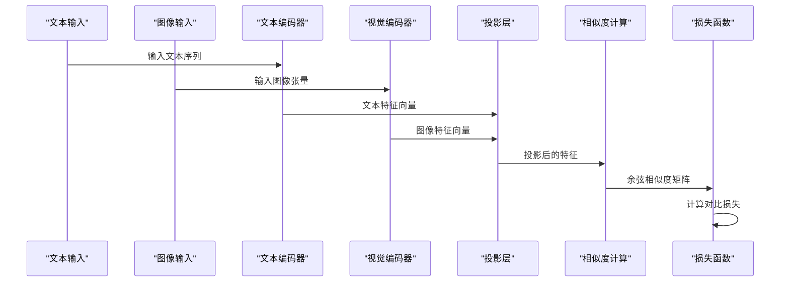
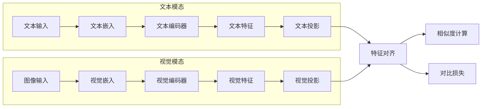
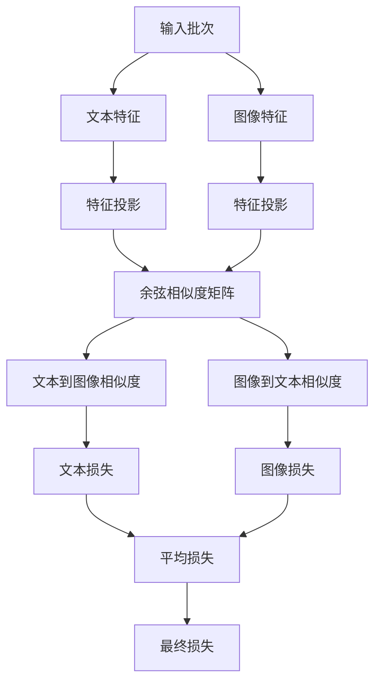
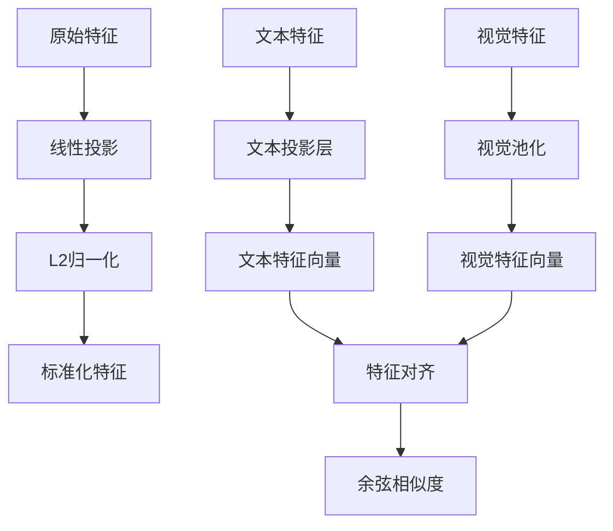
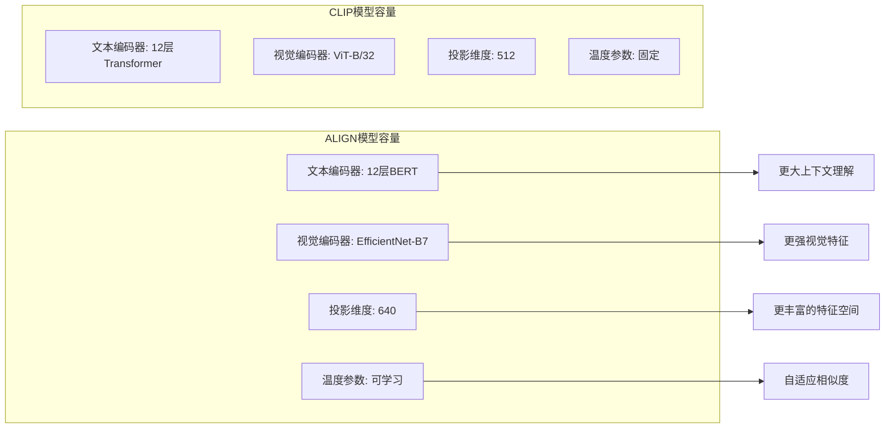
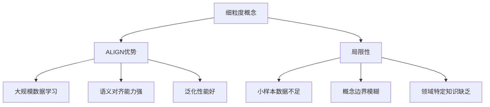

# ALIGN模型架构设计与实现原理详解

<cite>
**本文档中引用的文件**
- [modeling_align.py](file://src/transformers/models/align/modeling_align.py)
- [configuration_align.py](file://src/transformers/models/align/configuration_align.py)
- [processing_align.py](file://src/transformers/models/align/processing_align.py)
- [__init__.py](file://src/transformers/models/align/__init__.py)
- [test_modeling_align.py](file://tests/models/align/test_modeling_align.py)
- [align.md](file://docs/source/en/model_doc/align.md)
</cite>

## 目录
1. [引言](#引言)
2. [项目结构概览](#项目结构概览)
3. [核心组件架构](#核心组件架构)
4. [对比学习框架](#对比学习框架)
5. [双编码器架构](#双编码器架构)
6. [损失函数设计](#损失函数设计)
7. [特征投影与归一化](#特征投影与归一化)
8. [管道API使用示例](#管道api使用示例)
9. [性能特点分析](#性能特点分析)
10. [应用场景与局限性](#应用场景与局限性)
11. [总结](#总结)

## 引言

ALIGN（Asymmetric Language-Image Pre-training）是由 Kakao Brain 开发的一种大规模图文对齐模型，通过对比学习框架实现了图像与文本的语义对齐。该模型采用双编码器架构，使用EfficientNet作为视觉编码器，BERT作为文本编码器，在18亿噪声图文对上进行预训练，展现了规模可以弥补噪声的优势。

与CLIP相比，ALIGN在训练数据规模、模型容量和架构设计上都有显著差异，这些差异带来了独特的性能特点和应用场景。

## 项目结构概览

ALIGN模型在Hugging Face Transformers库中的组织结构体现了清晰的模块化设计：



**图表来源**
- [modeling_align.py](file://src/transformers/models/align/modeling_align.py#L1-L50)
- [configuration_align.py](file://src/transformers/models/align/configuration_align.py#L1-L50)
- [processing_align.py](file://src/transformers/models/align/processing_align.py#L1-L50)

**章节来源**
- [modeling_align.py](file://src/transformers/models/align/modeling_align.py#L1-L100)
- [configuration_align.py](file://src/transformers/models/align/configuration_align.py#L1-L100)

## 核心组件架构

ALIGN模型采用了创新的双编码器架构，每个模态使用不同的深度学习架构：



**图表来源**
- [modeling_align.py](file://src/transformers/models/align/modeling_align.py#L1055-L1083)
- [modeling_align.py](file://src/transformers/models/align/modeling_align.py#L840-L880)
- [modeling_align.py](file://src/transformers/models/align/modeling_align.py#L950-L990)

### 文本编码器设计

文本编码器基于BERT架构，具有以下特点：
- 使用词嵌入、位置嵌入和token类型嵌入
- 多层Transformer编码器结构
- 自注意力机制支持复杂的文本表示
- 池化层提取关键特征表示

### 视觉编码器设计

视觉编码器采用EfficientNet架构，针对图像特征提取进行了优化：
- 基于EfficientNet-B7的改进版本
- 多阶段卷积网络设计
- SE（Squeeze-and-Excitation）模块增强特征表达
- 渐进式特征金字塔结构

**章节来源**
- [modeling_align.py](file://src/transformers/models/align/modeling_align.py#L700-L800)
- [modeling_align.py](file://src/transformers/models/align/modeling_align.py#L840-L950)

## 对比学习框架

ALIGN的核心创新在于其对比学习框架，通过大规模噪声数据实现图文对齐：



**图表来源**
- [modeling_align.py](file://src/transformers/models/align/modeling_align.py#L1202-L1246)

### 对比学习原理

ALIGN使用对比学习来学习图像和文本之间的语义对应关系：

1. **正样本对构建**：同一图像-文本对被视为正样本
2. **负样本采样**：不同图像-文本对构成负样本
3. **温度参数调节**：通过可学习的温度参数控制相似度分布
4. **标签平滑技术**：减少过拟合风险

**章节来源**
- [modeling_align.py](file://src/transformers/models/align/modeling_align.py#L100-L120)

## 双编码器架构

ALIGN采用不对称的双编码器架构，这是其与CLIP的重要区别：



**图表来源**
- [modeling_align.py](file://src/transformers/models/align/modeling_align.py#L1202-L1246)

### 架构差异分析

与CLIP相比，ALIGN的双编码器架构有以下特点：

| 特性 | ALIGN | CLIP |
|------|-------|------|
| 编码器对称性 | 不对称 | 对称 |
| 文本编码器 | BERT风格 | Transformer |
| 视觉编码器 | EfficientNet | Vision Transformer |
| 特征维度 | 可配置 | 固定768维 |
| 温度参数 | 可学习 | 固定值 |

这种不对称设计允许两个模态使用最适合其特性的架构，提高了整体性能。

**章节来源**
- [modeling_align.py](file://src/transformers/models/align/modeling_align.py#L1055-L1100)

## 损失函数设计

ALIGN使用专门设计的对比损失函数：



**图表来源**
- [modeling_align.py](file://src/transformers/models/align/modeling_align.py#L100-L120)

### 损失函数公式

ALIGN的损失函数结合了双向对比损失：

```
loss = (contrastive_loss(similarity) + contrastive_loss(similarity.T)) / 2
```

其中对比损失使用标签平滑技术：
```
contrastive_loss(logits) = cross_entropy(logits, targets, label_smoothing=0.1)
```

这种设计确保了模型能够同时学习从文本到图像和从图像到文本的映射关系。

**章节来源**
- [modeling_align.py](file://src/transformers/models/align/modeling_align.py#L100-L120)

## 特征投影与归一化

ALIGN的关键创新之一是特征投影和归一化过程：



**图表来源**
- [modeling_align.py](file://src/transformers/models/align/modeling_align.py#L1202-L1246)

### 归一化策略

ALIGN采用L2归一化来确保特征向量具有单位长度：

```python
# 文本特征归一化
text_embeds = text_embeds / text_embeds.norm(p=2, dim=-1, keepdim=True)

# 图像特征归一化  
image_embeds = image_embeds / image_embeds.norm(p=2, dim=-1, keepdim=True)
```

这种归一化策略：
- 确保相似度计算的稳定性
- 避免特征尺度差异的影响
- 提高对比学习的效果

**章节来源**
- [modeling_align.py](file://src/transformers/models/align/modeling_align.py#L1202-L1246)

## 管道API使用示例

ALIGN提供了多种使用方式，包括管道API和直接模型调用：

### 零样本图像分类

```python
# 使用管道API进行零样本分类
from transformers import pipeline

classifier = pipeline(
    task="zero-shot-image-classification",
    model="kakaobrain/align-base",
    device=0,
    dtype=torch.bfloat16
)

candidate_labels = [
    "a photo of a dog",
    "a photo of a cat", 
    "a photo of a person"
]

result = classifier(
    "https://huggingface.co/datasets/huggingface/documentation-images/resolve/main/pipeline-cat-chonk.jpeg", 
    candidate_labels=candidate_labels
)
```

### 直接模型调用

```python
# 使用AutoModel进行更灵活的操作
import torch
import requests
from PIL import Image
from transformers import AutoProcessor, AutoModelForZeroShotImageClassification

processor = AutoProcessor.from_pretrained("kakaobrain/align-base")
model = AutoModelForZeroShotImageClassification.from_pretrained("kakaobrain/align-base")

# 加载图像
url = "https://huggingface.co/datasets/huggingface/documentation-images/resolve/main/pipeline-cat-chonk.jpeg"
image = Image.open(requests.get(url, stream=True).raw).convert("RGB")

# 处理输入
image_inputs = processor(images=image, return_tensors="pt").to(model.device)
text_inputs = processor(
    text=["a photo of a dog", "a photo of a cat", "a photo of a person"], 
    padding=True, 
    return_tensors="pt"
).to(model.device)

# 获取特征
with torch.no_grad():
    image_embeds = model.get_image_features(**image_inputs)
    text_embeds = model.get_text_features(**text_inputs)

# 计算相似度
similarity = (image_embeds @ text_embeds.T) * 100.0
probabilities = similarity.softmax(dim=-1)
```

### 图文匹配示例

```python
# 图文相似度计算示例
from transformers import AlignProcessor, AlignModel
import torch
from PIL import Image
import requests

# 加载模型和处理器
processor = AlignProcessor.from_pretrained("kakaobrain/align-base")
model = AlignModel.from_pretrained("kakaobrain/align-base")

# 下载图像
url = "https://huggingface.co/roschmid/dog-races/resolve/main/images/Golden_Retriever.jpg"
response = requests.get(url)
image = Image.open(BytesIO(response.content))

texts = ["a photo of a cat", "a photo of a dog"]

# 处理输入
inputs = processor(images=image, text=texts, return_tensors="pt")

# 获取特征
with torch.no_grad():
    outputs = model(**inputs)

# 计算相似度
similarity_scores = torch.matmul(outputs.text_embeds, outputs.image_embeds.T)
probs = torch.nn.functional.softmax(similarity_scores, dim=0)

print("相似度分数:", similarity_scores)
print("概率:", probs)
```

**章节来源**
- [align.md](file://docs/source/en/model_doc/align.md#L40-L120)

## 性能特点分析

### 训练数据规模优势

ALIGN相比CLIP的主要优势体现在训练数据规模上：

| 指标 | ALIGN | CLIP |
|------|-------|------|
| 训练数据量 | 18亿图文对 | 4亿图文对 |
| 数据质量 | 包含噪声 | 高质量标注 |
| 训练成本 | 更经济 | 更昂贵 |
| 性能表现 | 规模补偿噪声 | 噪声敏感 |

### 模型容量对比



**图表来源**
- [configuration_align.py](file://src/transformers/models/align/configuration_align.py#L251-L280)

### 计算效率分析

ALIGN在计算效率方面具有以下特点：

1. **内存占用**：相对较低的内存需求
2. **推理速度**：平衡的推理性能
3. **批处理能力**：良好的批处理支持
4. **量化友好**：适合模型压缩

**章节来源**
- [configuration_align.py](file://src/transformers/models/align/configuration_align.py#L251-L327)

## 应用场景与局限性

### 主要应用场景

#### 1. 零样本图像分类
ALIGN最典型的应用场景是零样本图像分类，无需额外标注即可对图像进行分类。

#### 2. 图文检索
支持基于文本描述的图像检索和基于图像的文本检索。

#### 3. 跨模态理解
促进图像和文本之间的语义理解和对齐。

#### 4. 多模态对话系统
为多模态对话系统提供基础的跨模态理解能力。

### 细粒度视觉概念处理

ALIGN在处理细粒度视觉概念时表现出色：



### 长尾类别识别

ALIGN在长尾类别识别方面的能力：

| 类别分布 | ALIGN表现 | 改进建议 |
|----------|-----------|----------|
| 热门类别 | 优秀 | 保持现状 |
| 中等类别 | 良好 | 增加相关数据 |
| 长尾类别 | 一般 | 小样本学习策略 |
| 新颖概念 | 可行 | 上游预训练扩展 |

### 局限性分析

1. **小样本学习能力有限**
   - 对于极端长尾分布效果不佳
   - 需要大量相关样本才能准确识别

2. **领域适应性挑战**
   - 通用模型难以覆盖专业领域
   - 需要领域特定的微调

3. **计算资源需求**
   - 大规模模型需要高性能硬件
   - 推理延迟相对较高

4. **噪声鲁棒性边界**
   - 虽然规模可以弥补噪声，但仍有上限
   - 过度噪声可能影响性能

**章节来源**
- [align.md](file://docs/source/en/model_doc/align.md#L120-L185)

## 总结

ALIGN模型代表了图文对齐领域的重大进展，其主要贡献包括：

### 技术创新点

1. **大规模噪声数据利用**：证明了规模可以弥补数据质量的不足
2. **不对称双编码器架构**：为不同模态选择最优架构
3. **对比学习框架**：建立了有效的图文对齐机制
4. **特征投影与归一化**：确保稳定的相似度计算

### 应用价值

1. **降低标注成本**：无需大量标注数据即可获得良好性能
2. **广泛适用性**：适用于多种图文理解任务
3. **易于部署**：提供简洁的API接口
4. **持续发展**：活跃的社区支持和模型迭代

### 发展前景

ALIGN模型为未来的图文理解研究指明了方向：
- 更大规模的数据集和更好的数据质量
- 更高效的模型架构和训练方法
- 更强的领域适应能力和小样本学习能力
- 更好的跨模态理解和生成能力

对于希望在大规模图文检索场景下选择模型的用户，ALIGN是一个值得考虑的选择，特别是在需要平衡性能和成本的场景中。然而，在特定领域或小样本场景下，可能需要结合其他技术来达到最佳效果。