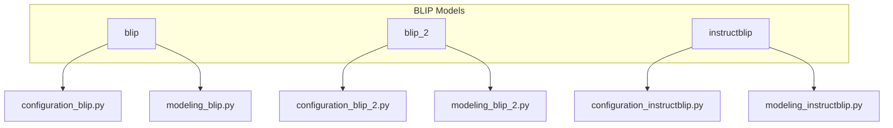
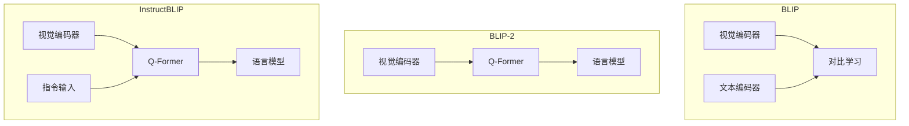
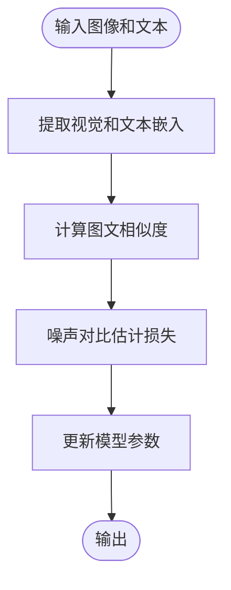
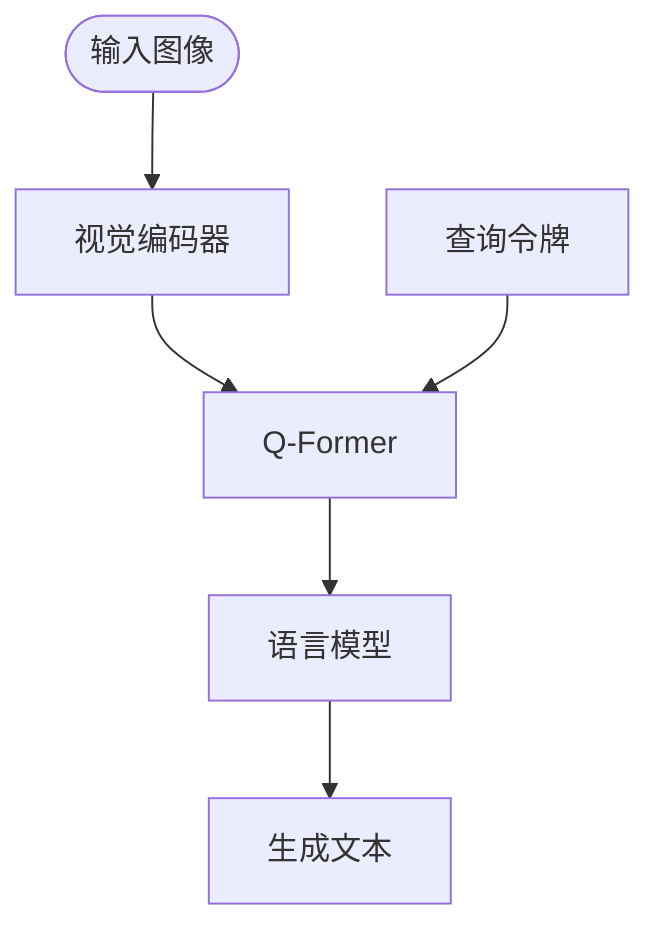
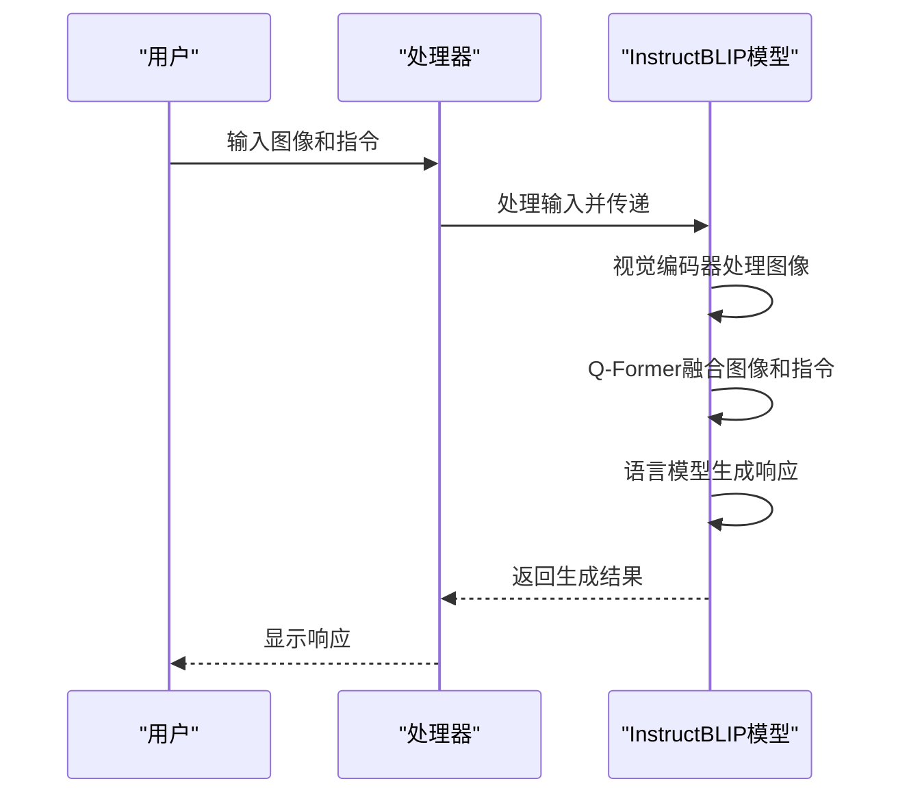
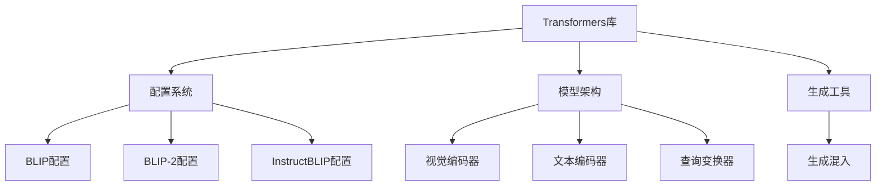

# BLIP系列模型

<cite>
**本文档中引用的文件**   
- [modeling_blip.py](file://src/transformers/models/blip/modeling_blip.py)
- [modeling_blip_2.py](file://src/transformers/models/blip_2/modeling_blip_2.py)
- [modeling_instructblip.py](file://src/transformers/models/instructblip/modeling_instructblip.py)
- [configuration_blip.py](file://src/transformers/models/blip/configuration_blip.py)
- [configuration_blip_2.py](file://src/transformers/models/blip_2/configuration_blip_2.py)
- [configuration_instructblip.py](file://src/transformers/models/instructblip/configuration_instructblip.py)
</cite>

## 目录
1. [简介](#简介)
2. [项目结构](#项目结构)
3. [核心组件](#核心组件)
4. [架构概述](#架构概述)
5. [详细组件分析](#详细组件分析)
6. [依赖分析](#依赖分析)
7. [性能考虑](#性能考虑)
8. [故障排除指南](#故障排除指南)
9. [结论](#结论)

## 简介
BLIP系列模型是多模态人工智能领域的重要进展，包括BLIP、BLIP-2和InstructBLIP三个版本。这些模型通过结合视觉和语言模态，实现了图像描述生成、视觉问答和图文检索等任务的卓越性能。BLIP模型采用噪声对比估计目标进行图文对齐，BLIP-2引入查询变换器（Q-Former）实现视觉-语言模态转换，而InstructBLIP则通过指令微调增强了对话能力。本文档将全面介绍这三个模型的技术架构与实现特点。

## 项目结构
BLIP系列模型在Hugging Face Transformers库中的实现遵循模块化设计，每个模型都有独立的配置和模型文件。项目结构清晰地分离了不同版本的模型实现，便于维护和扩展。

**图表来源**
- [configuration_blip.py](file://src/transformers/models/blip/configuration_blip.py)
- [modeling_blip.py](file://src/transformers/models/blip/modeling_blip.py)
- [configuration_blip_2.py](file://src/transformers/models/blip_2/configuration_blip_2.py)
- [modeling_blip_2.py](file://src/transformers/models/blip_2/modeling_blip_2.py)
- [configuration_instructblip.py](file://src/transformers/models/instructblip/configuration_instructblip.py)
- [modeling_instructblip.py](file://src/transformers/models/instructblip/modeling_instructblip.py)

**章节来源**
- [src/transformers/models/blip](file://src/transformers/models/blip)
- [src/transformers/models/blip_2](file://src/transformers/models/blip_2)
- [src/transformers/models/instructblip](file://src/transformers/models/instructblip)

## 核心组件
BLIP系列模型的核心组件包括视觉编码器、文本解码器和查询变换器（Q-Former）。BLIP模型采用双编码器架构，通过噪声对比估计目标实现图文对齐。BLIP-2引入了Q-Former作为视觉-语言模态转换的桥梁，显著降低了计算成本。InstructBLIP在此基础上进一步优化，通过指令微调增强了模型的对话能力。

**章节来源**
- [modeling_blip.py](file://src/transformers/models/blip/modeling_blip.py#L797-L953)
- [modeling_blip_2.py](file://src/transformers/models/blip_2/modeling_blip_2.py#L1592-L1953)
- [modeling_instructblip.py](file://src/transformers/models/instructblip/modeling_instructblip.py#L1111-L1271)

## 架构概述
BLIP系列模型的架构演进体现了多模态学习的发展趋势。从BLIP的双编码器架构到BLIP-2的Q-Former设计，再到InstructBLIP的指令微调，每个版本都在前一版本的基础上进行了重要改进。

**图表来源**
- [modeling_blip.py](file://src/transformers/models/blip/modeling_blip.py)
- [modeling_blip_2.py](file://src/transformers/models/blip_2/modeling_blip_2.py)
- [modeling_instructblip.py](file://src/transformers/models/instructblip/modeling_instructblip.py)

## 详细组件分析

### BLIP模型分析
BLIP模型采用噪声对比估计目标进行图文对齐，通过最大化匹配图文对的相似度同时最小化不匹配对的相似度来学习跨模态表示。

**图表来源**
- [modeling_blip.py](file://src/transformers/models/blip/modeling_blip.py)
- [configuration_blip.py](file://src/transformers/models/blip/configuration_blip.py)

**章节来源**
- [modeling_blip.py](file://src/transformers/models/blip/modeling_blip.py#L797-L953)

### BLIP-2模型分析
BLIP-2的核心创新是查询变换器（Q-Former），它作为视觉-语言模态转换的桥梁，通过少量可学习的查询向量从视觉编码器中提取相关信息。

**图表来源**
- [modeling_blip_2.py](file://src/transformers/models/blip_2/modeling_blip_2.py)
- [configuration_blip_2.py](file://src/transformers/models/blip_2/configuration_blip_2.py)

**章节来源**
- [modeling_blip_2.py](file://src/transformers/models/blip_2/modeling_blip_2.py#L1592-L1953)

### InstructBLIP模型分析
InstructBLIP在BLIP-2的基础上引入了指令微调机制，通过将指令输入与图像特征结合，实现了更强大的对话能力。

**图表来源**
- [modeling_instructblip.py](file://src/transformers/models/instructblip/modeling_instructblip.py)
- [configuration_instructblip.py](file://src/transformers/models/instructblip/configuration_instructblip.py)

**章节来源**
- [modeling_instructblip.py](file://src/transformers/models/instructblip/modeling_instructblip.py#L1111-L1271)

## 依赖分析
BLIP系列模型的实现依赖于Hugging Face Transformers库的核心组件，包括配置管理、模型架构和生成工具。

**图表来源**
- [configuration_blip.py](file://src/transformers/models/blip/configuration_blip.py)
- [configuration_blip_2.py](file://src/transformers/models/blip_2/configuration_blip_2.py)
- [configuration_instructblip.py](file://src/transformers/models/instructblip/configuration_instructblip.py)
- [generation_utils.py](file://src/transformers/generation_utils.py)

**章节来源**
- [src/transformers/models](file://src/transformers/models)
- [src/transformers/generation](file://src/transformers/generation)

## 性能考虑
BLIP系列模型在性能方面进行了多项优化。Q-Former的设计显著降低了计算成本，通过少量可学习的查询向量实现了高效的视觉-语言模态转换。模型支持多种生成配置参数，如`num_beams`、`temperature`和`top_p`，可以灵活控制输出质量。在少样本学习场景中，这些模型表现出色，能够快速适应新任务。

## 故障排除指南
在使用BLIP系列模型时可能遇到的一些常见问题及解决方案：

**章节来源**
- [modeling_blip.py](file://src/transformers/models/blip/modeling_blip.py#L797-L953)
- [modeling_blip_2.py](file://src/transformers/models/blip_2/modeling_blip_2.py#L1592-L1953)
- [modeling_instructblip.py](file://src/transformers/models/instructblip/modeling_instructblip.py#L1111-L1271)

## 结论
BLIP系列模型代表了多模态学习的重要进展。从BLIP的噪声对比估计到BLIP-2的Q-Former设计，再到InstructBLIP的指令微调，每个版本都在前一版本的基础上进行了重要创新。这些模型不仅在图像描述生成、视觉问答等任务上表现出色，还为复杂视觉推理任务提供了实用的解决方案。未来的研究可以进一步探索如何提高模型在复杂场景下的推理能力，并降低计算成本。