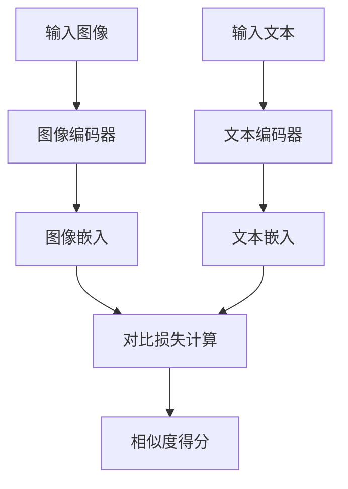
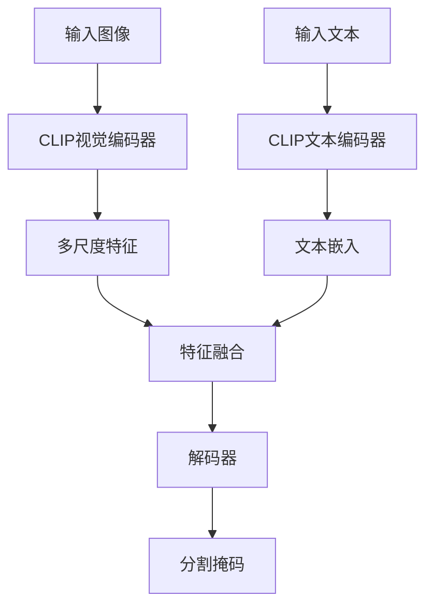
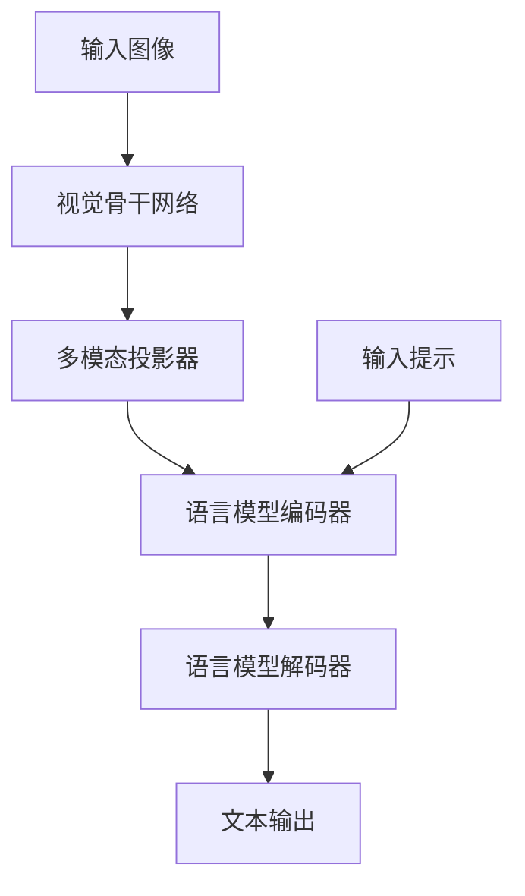
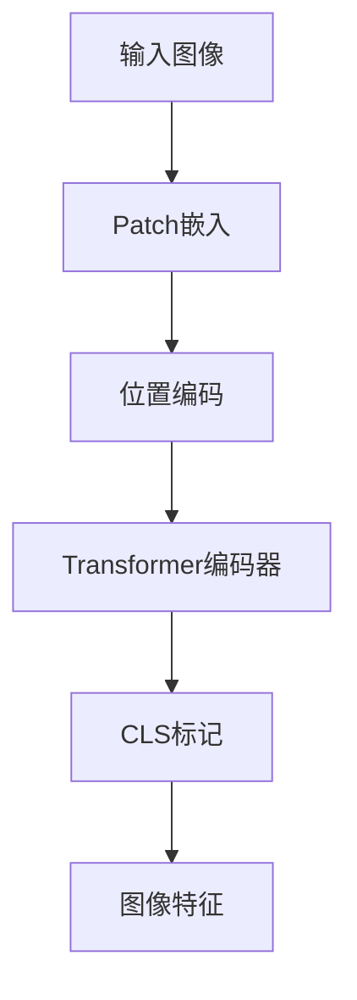
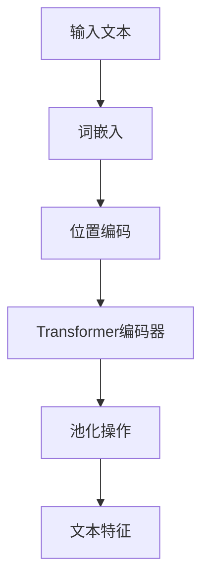

# CLIP系列模型

<cite>
**本文档中引用的文件**   
- [modeling_clip.py](file://src/transformers/models/clip/modeling_clip.py)
- [configuration_clip.py](file://src/transformers/models/clip/configuration_clip.py)
- [modeling_clipseg.py](file://src/transformers/models/clipseg/modeling_clipseg.py)
- [configuration_clipseg.py](file://src/transformers/models/clipseg/configuration_clipseg.py)
- [modeling_florence2.py](file://src/transformers/models/florence2/modeling_florence2.py)
- [configuration_florence2.py](file://src/transformers/models/florence2/configuration_florence2.py)
- [processing_clipseg.py](file://src/transformers/models/clipseg/processing_clipseg.py)
</cite>

## 目录
1. [引言](#引言)
2. [模型架构设计](#模型架构设计)
3. [对比学习与损失函数](#对比学习与损失函数)
4. [图像编码器与文本编码器实现](#图像编码器与文本编码器实现)
5. [温度参数与相似度计算](#温度参数与相似度计算)
6. [应用方法与代码示例](#应用方法与代码示例)
7. [模型性能影响因素分析](#模型性能影响因素分析)
8. [实际应用优化建议](#实际应用优化建议)
9. [结论](#结论)

## 引言
CLIP系列模型代表了多模态学习领域的重要进展，通过对比学习框架实现了图像与文本的联合表示学习。本文档深入分析CLIP、CLIPSeg和Florence2等模型的架构设计与实现细节，重点阐述其图文对齐机制、零样本迁移能力的实现原理，以及在实际应用中的使用方法和优化策略。

## 模型架构设计

### CLIP模型架构
CLIP模型采用双塔架构，包含独立的图像编码器和文本编码器。两个编码器分别将图像和文本映射到共享的多模态嵌入空间，通过对比学习实现图文对齐。模型的核心组件包括图像特征提取、文本特征提取和对比损失计算。



**图表来源**
- [modeling_clip.py](file://src/transformers/models/clip/modeling_clip.py#L742-L936)

### CLIPSeg模型架构
CLIPSeg在CLIP基础上扩展了语义分割能力，通过引入解码器模块将CLIP的全局图像特征转换为像素级预测。模型保留了CLIP的对比学习框架，同时增加了用于细粒度理解的解码路径。



**图表来源**
- [modeling_clipseg.py](file://src/transformers/models/clipseg/modeling_clipseg.py#L807-L1015)

### Florence2模型架构
Florence2采用编码器-解码器架构，将视觉特征与语言模型深度融合。模型通过多模态投影器将视觉特征注入语言模型，实现复杂的视觉理解任务，如图像描述生成和视觉问答。



**图表来源**
- [modeling_florence2.py](file://src/transformers/models/florence2/modeling_florence2.py#L637-L782)

**本节来源**
- [modeling_clip.py](file://src/transformers/models/clip/modeling_clip.py#L742-L936)
- [modeling_clipseg.py](file://src/transformers/models/clipseg/modeling_clipseg.py#L807-L1015)
- [modeling_florence2.py](file://src/transformers/models/florence2/modeling_florence2.py#L637-L782)

## 对比学习与损失函数

### 对比损失函数设计
CLIP系列模型采用对比损失函数来优化图像-文本对的相似度。损失函数通过最大化正样本对的相似度，同时最小化负样本对的相似度来实现图文对齐。

```python
def contrastive_loss(logits: torch.Tensor) -> torch.Tensor:
    return nn.functional.cross_entropy(logits, torch.arange(len(logits), device=logits.device))

def clip_loss(similarity: torch.Tensor) -> torch.Tensor:
    caption_loss = contrastive_loss(similarity)
    image_loss = contrastive_loss(similarity.t())
    return (caption_loss + image_loss) / 2.0
```

CLIPSeg模型采用了类似的损失函数设计，确保图像和文本特征在嵌入空间中的对齐。

**本节来源**
- [modeling_clip.py](file://src/transformers/models/clip/modeling_clip.py#L742-L936)
- [modeling_clipseg.py](file://src/transformers/models/clipseg/modeling_clipseg.py#L34-L47)

### 零样本迁移能力实现
CLIP系列模型的零样本迁移能力源于其对比学习框架。在训练过程中，模型学习将语义相似的图像和文本映射到相近的嵌入空间位置。这种学习方式使得模型能够泛化到未见过的类别，通过文本提示实现零样本分类。

模型的零样本推理过程包括：
1. 将候选类别转换为文本描述
2. 使用文本编码器提取文本特征
3. 使用图像编码器提取图像特征
4. 计算图像-文本特征的相似度
5. 根据相似度得分进行分类决策

**本节来源**
- [modeling_clip.py](file://src/transformers/models/clip/modeling_clip.py#L742-L936)

## 图像编码器与文本编码器实现

### 图像编码器实现
CLIP模型支持多种图像编码器架构，包括Vision Transformer (ViT) 和ResNet。ViT架构将图像分割为固定大小的patch，然后通过Transformer编码器处理这些patch序列。



图像编码器的关键组件包括：
- **Patch嵌入层**：将图像分割为patch并线性投影到嵌入空间
- **位置编码**：为patch序列添加位置信息
- **Transformer编码器**：处理patch序列并提取全局特征
- **池化层**：从CLS标记或全局平均池化获取图像表示

**本节来源**
- [modeling_clip.py](file://src/transformers/models/clip/modeling_clip.py#L742-L936)

### 文本编码器实现
文本编码器基于Transformer架构，将输入文本序列转换为上下文相关的嵌入表示。编码器通过自注意力机制捕捉文本中的长距离依赖关系。



文本编码器的关键组件包括：
- **词嵌入层**：将词汇映射到嵌入空间
- **位置编码**：为词序列添加位置信息
- **Transformer编码器**：处理词序列并提取上下文特征
- **池化层**：通常使用EOS标记的隐藏状态作为文本表示

**本节来源**
- [modeling_clip.py](file://src/transformers/models/clip/modeling_clip.py#L742-L936)

## 温度参数与相似度计算

### 温度参数的作用
温度参数（logit_scale）在CLIP系列模型中起着关键作用，它控制着相似度得分的分布。温度参数通过缩放余弦相似度得分来影响softmax函数的输出分布。

```python
logits_per_text = torch.matmul(text_embeds, image_embeds.t()) * self.logit_scale.exp()
```

温度参数的影响：
- **低温度值**：使相似度分布更加尖锐，增强模型的置信度
- **高温度值**：使相似度分布更加平滑，降低模型的置信度

在训练过程中，温度参数通常作为可学习参数进行优化，以找到最佳的相似度缩放比例。

### 相似度计算流程
CLIP系列模型的相似度计算流程如下：
1. 分别提取图像和文本特征
2. 对特征进行L2归一化
3. 计算归一化特征的余弦相似度
4. 使用温度参数缩放相似度得分
5. 通过softmax函数获取概率分布

```python
# 特征归一化
image_embeds = image_embeds / image_embeds.norm(p=2, dim=-1, keepdim=True)
text_embeds = text_embeds / text_embeds.norm(p=2, dim=-1, keepdim=True)

# 相似度计算
logits_per_text = torch.matmul(text_embeds, image_embeds.t()) * logit_scale
```

**本节来源**
- [modeling_clip.py](file://src/transformers/models/clip/modeling_clip.py#L742-L936)

## 应用方法与代码示例

### 图文检索应用
CLIP模型可用于图像-文本检索任务，通过计算图像和文本特征的相似度来找到最匹配的图文对。

```python
from transformers import AutoProcessor, CLIPModel
from transformers.image_utils import load_image

processor = AutoProcessor.from_pretrained("openai/clip-vit-base-patch32")
model = CLIPModel.from_pretrained("openai/clip-vit-base-patch32")

url = "http://images.cocodataset.org/val2017/000000039769.jpg"
image = load_image(url)

inputs = processor(
    text=["a photo of a cat", "a photo of a dog"], 
    images=image, 
    return_tensors="pt", 
    padding=True
)

outputs = model(**inputs)
logits_per_image = outputs.logits_per_image
probs = logits_per_image.softmax(dim=1)
```

### 图像分类应用
利用CLIP的零样本能力，可以实现无需训练的图像分类。

```python
from transformers import AutoProcessor, CLIPModel

processor = AutoProcessor.from_pretrained("openai/clip-vit-base-patch32")
model = CLIPModel.from_pretrained("openai/clip-vit-base-patch32")

# 定义候选类别
classes = ["cat", "dog", "bird", "car", "tree"]
texts = [f"a photo of a {c}" for c in classes]

# 处理输入
inputs = processor(text=texts, images=image, return_tensors="pt", padding=True)
outputs = model(**inputs)

# 获取预测结果
probs = outputs.logits_per_image.softmax(dim=1)
predicted_class = classes[probs.argmax().item()]
```

### 语义分割应用
CLIPSeg模型可用于零样本语义分割任务。

```python
from transformers import AutoProcessor, CLIPSegForImageSegmentation
from transformers.image_utils import load_image

processor = AutoProcessor.from_pretrained("CIDAS/clipseg-rd64-refined")
model = CLIPSegForImageSegmentation.from_pretrained("CIDAS/clipseg-rd64-refined")

url = "http://images.cocodataset.org/val2017/000000039769.jpg"
image = load_image(url)

texts = ["a cat", "a remote", "a blanket"]
inputs = processor(text=texts, images=[image] * len(texts), padding=True, return_tensors="pt")

outputs = model(**inputs)
logits = outputs.logits
```

**本节来源**
- [modeling_clip.py](file://src/transformers/models/clip/modeling_clip.py#L742-L936)
- [modeling_clipseg.py](file://src/transformers/models/clipseg/modeling_clipseg.py#L807-L1015)
- [processing_clipseg.py](file://src/transformers/models/clipseg/processing_clipseg.py)

## 模型性能影响因素分析

### 图像编码器选择
CLIP系列模型支持多种图像编码器，不同编码器对模型性能有显著影响：

| 图像编码器 | 特点 | 适用场景 |
|---------|------|---------|
| ViT | 基于Transformer架构，捕捉全局依赖关系 | 高分辨率图像，复杂场景理解 |
| ResNet | 卷积神经网络，捕捉局部特征 | 低分辨率图像，快速推理 |
| ConvNeXt | 现代卷积架构，结合CNN和Transformer优点 | 平衡性能和效率 |

ViT架构通常在大规模数据集上表现更好，而ResNet在小规模数据集上可能更稳定。

### 模型配置参数
CLIPSeg模型包含多个可配置参数，影响其分割性能：

- **extract_layers**：指定从视觉骨干网络中提取特征的层数
- **reduce_dim**：降低CLIP视觉嵌入的维度
- **use_complex_transposed_convolution**：是否使用更复杂的转置卷积进行上采样

这些参数的选择需要根据具体任务和数据集进行调整。

**本节来源**
- [configuration_clip.py](file://src/transformers/models/clip/configuration_clip.py)
- [configuration_clipseg.py](file://src/transformers/models/clipseg/configuration_clipseg.py)

## 实际应用优化建议

### 长文本描述匹配优化
对于长文本描述的匹配，建议采用以下策略：
1. **文本分块**：将长文本分割为多个语义完整的片段
2. **多粒度匹配**：结合句子级和短语级的匹配结果
3. **上下文增强**：使用滑动窗口技术捕捉文本的上下文信息

### 细粒度图像理解优化
针对细粒度图像理解任务，建议：
1. **多尺度特征融合**：结合不同层次的视觉特征
2. **注意力机制**：引入自注意力或交叉注意力机制
3. **数据增强**：使用针对性的数据增强技术提高模型鲁棒性

### 推理性能优化
为了提高推理性能，可以考虑：
1. **模型量化**：使用INT8或FP16量化减少计算量
2. **知识蒸馏**：将大模型的知识迁移到小模型
3. **缓存机制**：缓存常用的文本嵌入以减少重复计算

**本节来源**
- [modeling_clipseg.py](file://src/transformers/models/clipseg/modeling_clipseg.py#L807-L1015)

## 结论
CLIP系列模型通过创新的对比学习框架，实现了强大的图文对齐能力和零样本迁移能力。这些模型在图文检索、图像分类和语义分割等任务中表现出色，为多模态理解提供了强大的工具。通过合理选择图像编码器、优化模型参数和应用适当的优化策略，可以在各种实际应用场景中获得最佳性能。