# LLaVA系列模型架构创新与实现详解

<cite>
**本文档引用的文件**
- [modeling_llava.py](file://src/transformers/models/llava/modeling_llava.py)
- [modeling_llava_next.py](file://src/transformers/models/llava_next/modeling_llava_next.py)
- [modeling_llava_onevision.py](file://src/transformers/src/transformers/models/llava_onevision/modeling_llava_onevision.py)
- [configuration_llava.py](file://src/transformers/src/transformers/models/llava/configuration_llava.py)
- [configuration_llava_next.py](file://src/transformers/src/transformers/models/llava_next/configuration_llava_next.py)
- [configuration_llava_onevision.py](file://src/transformers/src/transformers/models/llava_onevision/configuration_llava_onevision.py)
- [processing_llava.py](file://src/transformers/src/transformers/models/llava/processing_llava.py)
- [processing_llava_next.py](file://src/transformers/src/transformers/models/llava_next/processing_llava_next.py)
- [processing_llava_onevision.py](file://src/transformers/src/transformers/models/llava_onevision/processing_llava_onevision.py)
- [llava.md](file://docs/source/en/model_doc/llava.md)
- [llava_next.md](file://docs/source/en/model_doc/llava_next.md)
</cite>

## 目录
1. [引言](#引言)
2. [项目结构概览](#项目结构概览)
3. [核心组件分析](#核心组件分析)
4. [架构创新详解](#架构创新详解)
5. [详细组件分析](#详细组件分析)
6. [连接器设计对比](#连接器设计对比)
7. [视觉token数量权衡](#视觉token数量权衡)
8. [应用场景决策指导](#应用场景决策指导)
9. [性能考虑](#性能考虑)
10. [故障排除指南](#故障排除指南)
11. [结论](#结论)

## 引言

LLaVA（Large Language and Vision Assistant）系列模型代表了视觉-语言多模态领域的重要突破。该系列包括LLaVA、LLaVA-NeXT和LLaVA-OneVision三个主要变体，每个版本都在前代基础上实现了显著的技术创新。

LLaVA作为基础模型，通过简单的视觉-语言连接器将预训练的视觉编码器与大语言模型结合，实现了高效的视觉指令微调。LLaVA-NeXT在多分辨率图像处理和更强视觉编码器集成方面进行了重大改进，而LLaVA-OneVision则扩展了对视频理解的支持。

本文档将深入分析这些模型的架构创新、实现细节和使用方法，为开发者提供全面的技术参考。

## 项目结构概览

LLaVA系列模型在transformers库中的组织结构体现了清晰的模块化设计理念：

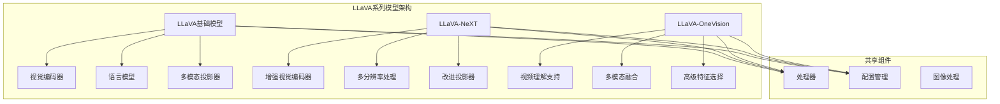

**图表来源**
- [modeling_llava.py](file://src/transformers/models/llava/modeling_llava.py#L1-L50)
- [modeling_llava_next.py](file://src/transformers/models/llava_next/modeling_llava_next.py#L1-L50)
- [modeling_llava_onevision.py](file://src/transformers/src/transformers/models/llava_onevision/modeling_llava_onevision.py#L1-L50)

## 核心组件分析

### 模型架构层次

LLaVA系列模型采用分层架构设计，主要包含以下核心组件：

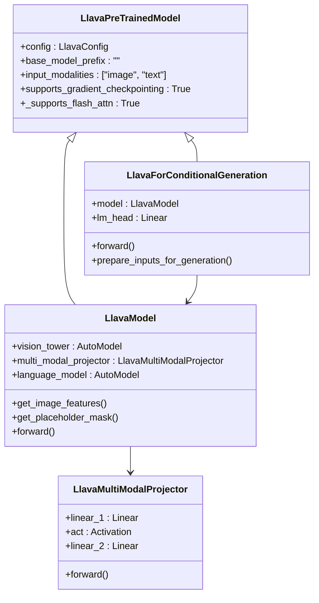

**图表来源**
- [modeling_llava.py](file://src/transformers/models/llava/modeling_llava.py#L120-L200)

**章节来源**
- [modeling_llava.py](file://src/transformers/models/llava/modeling_llava.py#L120-L486)

## 架构创新详解

### LLaVA基础架构：简单而高效的连接器设计

LLaVA的核心创新在于其简洁而高效的视觉-语言连接器设计。该模型通过一个两层的多层感知机（MLP）投影器将视觉特征映射到语言模型的嵌入空间。

#### 连接器设计原理

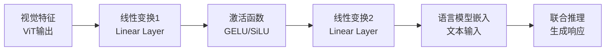

**图表来源**
- [modeling_llava.py](file://src/transformers/models/llava/modeling_llava.py#L90-L110)

这种设计的优势包括：
- **计算效率高**：仅需两个线性层即可完成特征转换
- **参数量少**：相比复杂的注意力机制，参数量大幅减少
- **训练稳定**：梯度传播更加稳定，训练收敛更快
- **推理速度快**：部署时计算开销小

### LLaVA-NeXT：多分辨率图像处理的突破

LLaVA-NeXT在LLaVA基础上引入了革命性的多分辨率图像处理能力，支持高达4倍的像素提升和三种不同的宽高比。

#### 多分辨率处理机制

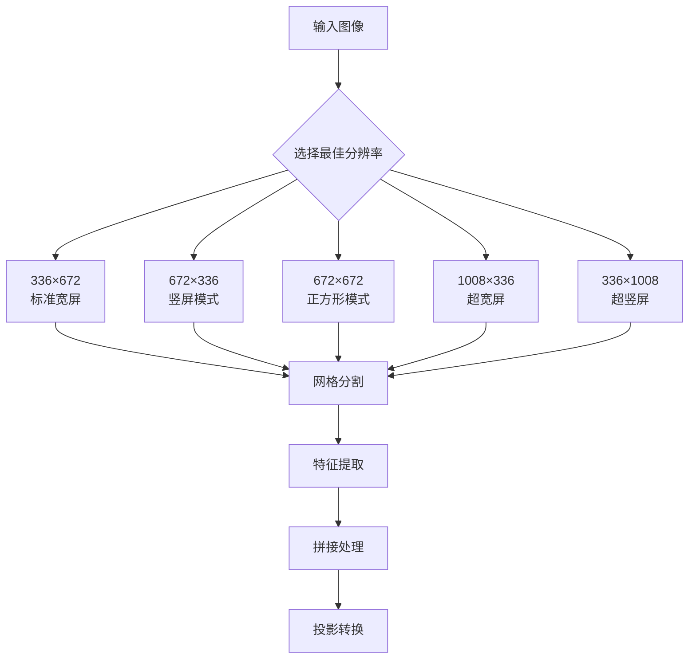

**图表来源**
- [modeling_llava_next.py](file://src/transformers/src/transformers/models/llava_next/modeling_llava_next.py#L30-L80)

#### 关键技术创新

1. **智能分辨率选择算法**：基于图像尺寸自动选择最优处理分辨率
2. **网格分割技术**：将高分辨率图像分割为多个可处理的补丁
3. **特征重排机制**：优化视觉特征的空间排列以提高语义连贯性
4. **动态token分配**：根据图像内容动态调整视觉token数量

### LLaVA-OneVision：视频理解的统一框架

LLaVA-OneVision是LLaVA系列的最新演进，首次实现了图像和视频的统一建模框架。

#### 多模态统一架构

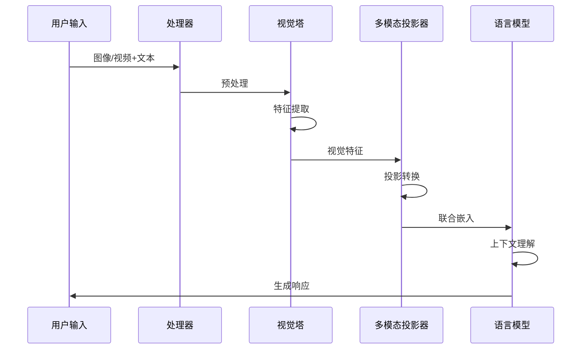

**图表来源**
- [modeling_llava_onevision.py](file://src/transformers/src/transformers/models/llava_onevision/modeling_llava_onevision.py#L650-L750)

**章节来源**
- [modeling_llava_next.py](file://src/transformers/src/transformers/models/llava_next/modeling_llava_next.py#L30-L795)
- [modeling_llava_onevision.py](file://src/transformers/src/transformers/models/llava_onevision/modeling_llava_onevision.py#L1-L962)

## 详细组件分析

### 视觉特征提取与处理

#### LLaVA的特征处理流程

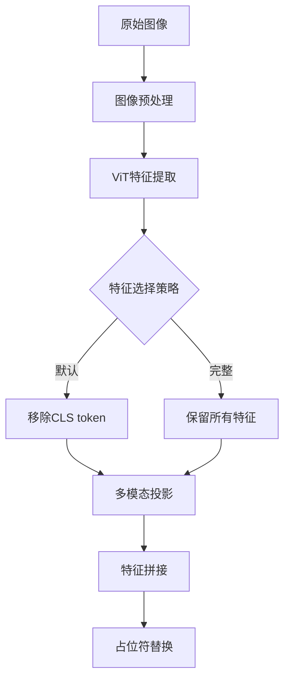

**图表来源**
- [modeling_llava.py](file://src/transformers/src/transformers/models/llava/modeling_llava.py#L180-L250)

#### LLaVA-NeXT的高级特征处理

LLaVA-NeXT引入了更复杂的特征处理机制：

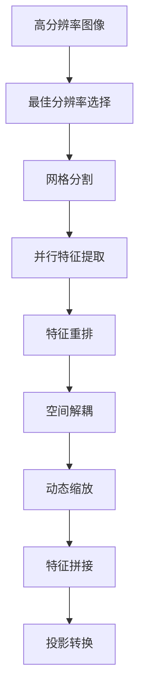

**图表来源**
- [modeling_llava_next.py](file://src/transformers/src/transformers/models/llava_next/modeling_llava_next.py#L350-L450)

#### LLaVA-OneVision的视频处理

视频理解需要特殊的处理策略：

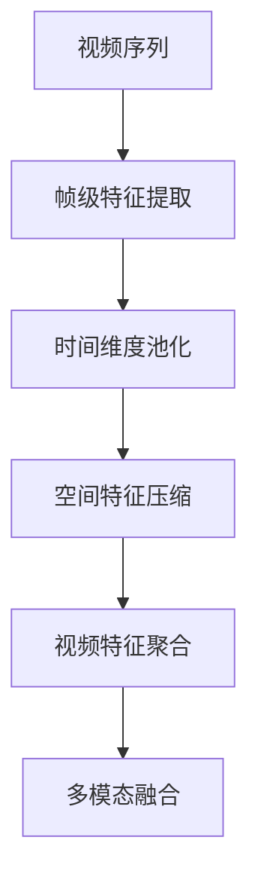

**图表来源**
- [modeling_llava_onevision.py](file://src/transformers/src/transformers/models/llava_onevision/modeling_llava_onevision.py#L750-L850)

**章节来源**
- [modeling_llava.py](file://src/transformers/src/transformers/models/llava/modeling_llava.py#L180-L350)
- [modeling_llava_next.py](file://src/transformers/src/transformers/models/llava_next/modeling_llava_next.py#L350-L600)

## 连接器设计对比

### 不同连接器的性能特征

| 连接器类型 | 参数量 | 计算复杂度 | 内存占用 | 语义质量 | 训练稳定性 |
|------------|--------|------------|----------|----------|------------|
| LLaVA-MLP | 低 | 低 | 低 | 中等 | 高 |
| LLaVA-NeXT-QFormer | 中等 | 中等 | 中等 | 高 | 中等 |
| LLaVA-OneVision-Transformer | 高 | 高 | 高 | 最高 | 中等 |

### 连接器选择指南

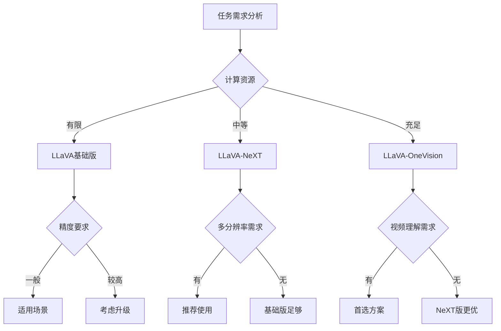

**章节来源**
- [modeling_llava.py](file://src/transformers/src/transformers/models/llava/modeling_llava.py#L90-L110)
- [modeling_llava_next.py](file://src/transformers/src/transformers/models/llava_next/modeling_llava_next.py#L250-L270)

## 视觉token数量权衡

### Token数量与生成质量的关系

视觉token的数量直接影响模型的表达能力和计算效率：

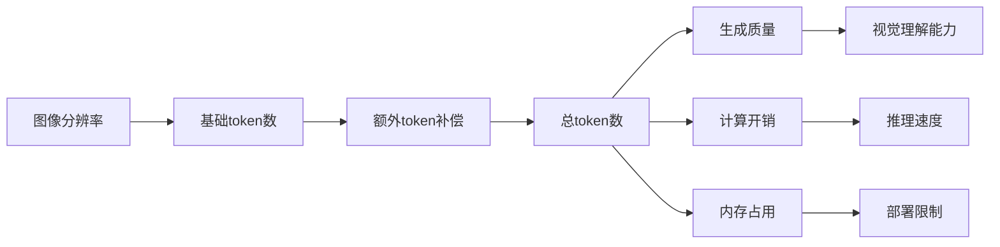

### 不同场景的token配置

| 场景类型 | 基础分辨率 | 推荐token数 | 性能特点 |
|----------|------------|-------------|----------|
| 文档扫描 | 336×336 | ~576 | 快速准确 |
| 产品图片 | 672×672 | ~2304 | 平衡性能 |
| 艺术作品 | 1008×1008 | ~5184 | 高质量 |
| 视频帧 | 384×384 | ~1024 | 实时处理 |

**章节来源**
- [processing_llava.py](file://src/transformers/src/transformers/models/llava/processing_llava.py#L150-L200)
- [processing_llava_next.py](file://src/transformers/src/transformers/models/llava_next/processing_llava_next.py#L150-L200)

## 应用场景决策指导

### 视觉问答系统

```python
# 示例：构建视觉问答系统的输入提示
conversation = [
    {
        "role": "user",
        "content": [
            {"type": "image", "url": "图像URL"},
            {"type": "text", "text": "这张图片展示了什么？"}
        ]
    }
]
```

### 图像描述生成

```python
# 示例：图像描述生成的提示格式
prompt = "USER: <image>\n请为这张图片生成详细描述。ASSISTANT:"
```

### 多轮视觉对话

```python
# 示例：多轮对话的上下文保持
conversation = [
    {
        "role": "user",
        "content": [
            {"type": "image"},
            {"type": "text", "text": "你能看到什么？"}
        ]
    },
    {
        "role": "assistant",
        "content": [{"type": "text", "text": "我看到了红色的汽车和蓝色的天空。"}]
    },
    {
        "role": "user",
        "content": [
            {"type": "text", "text": "这辆车是什么品牌？"}
        ]
    }
]
```

### 视频理解应用

```python
# 示例：视频理解的输入格式
conversation = [
    {
        "role": "user",
        "content": [
            {"type": "video", "url": "视频URL"},
            {"type": "text", "text": "这段视频讲述了什么故事？"}
        ]
    }
]
```

**章节来源**
- [llava.md](file://docs/source/en/model_doc/llava.md#L100-L200)
- [llava_next.md](file://docs/source/en/model_doc/llava_next.md#L50-L150)

## 性能考虑

### 计算资源优化

不同LLaVA变体在资源利用上的差异：

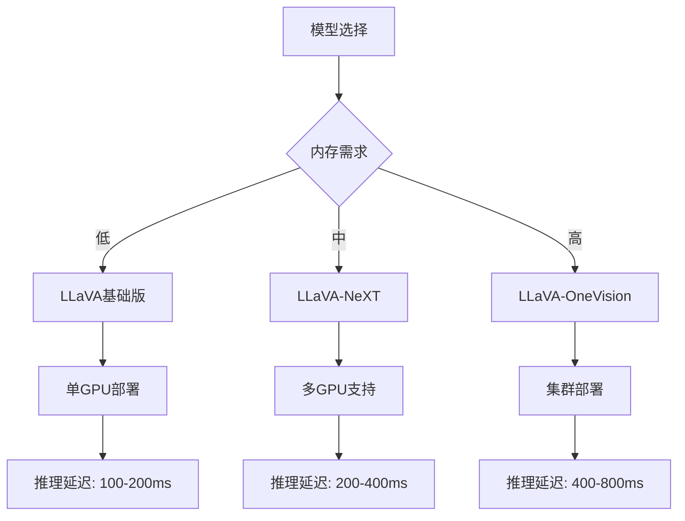

### 批处理优化策略

| 批处理大小 | 内存占用 | 吞吐量 | 延迟 | 推荐场景 |
|------------|----------|--------|------|----------|
| 1 | 最低 | 低 | 最快 | 实时应用 |
| 2-4 | 中等 | 中等 | 中等 | 一般应用 |
| 8+ | 高 | 高 | 较慢 | 离线处理 |

## 故障排除指南

### 常见问题及解决方案

#### 1. 图像token不匹配错误

**问题描述**：图像特征和图像token数量不一致

**解决方案**：
- 检查图像预处理参数设置
- 验证patch_size配置是否正确
- 确认vision_feature_select_strategy设置

#### 2. 内存不足问题

**问题描述**：处理高分辨率图像时出现内存溢出

**解决方案**：
- 减少批处理大小
- 使用梯度检查点
- 启用混合精度训练

#### 3. 生成质量不佳

**问题描述**：模型输出与预期不符

**解决方案**：
- 调整视觉特征层选择
- 优化提示模板设计
- 增加训练数据多样性

**章节来源**
- [modeling_llava.py](file://src/transformers/src/transformers/models/llava/modeling_llava.py#L250-L300)
- [modeling_llava_next.py](file://src/transformers/src/transformers/models/llava_next/modeling_llava_next.py#L600-L700)

## 结论

LLaVA系列模型代表了视觉-语言多模态领域的重大进展。从LLaVA的基础架构到LLaVA-NeXT的多分辨率处理，再到LLaVA-OneVision的视频理解支持，每个版本都针对特定的应用需求进行了精心设计。

### 主要技术贡献

1. **简洁高效的连接器设计**：LLaVA证明了简单的MLP投影器也能实现优秀的视觉-语言融合效果
2. **多分辨率处理能力**：LLaVA-NeXT解决了高分辨率图像处理的技术挑战
3. **统一的多模态框架**：LLaVA-OneVision首次实现了图像和视频的统一建模

### 未来发展方向

- 更高效的连接器设计
- 更强的跨模态理解能力
- 更好的实时处理性能
- 更广泛的多模态应用支持

LLaVA系列模型为多模态AI的发展奠定了坚实基础，其创新的架构设计和实用的功能特性将继续推动视觉-语言技术的进步。