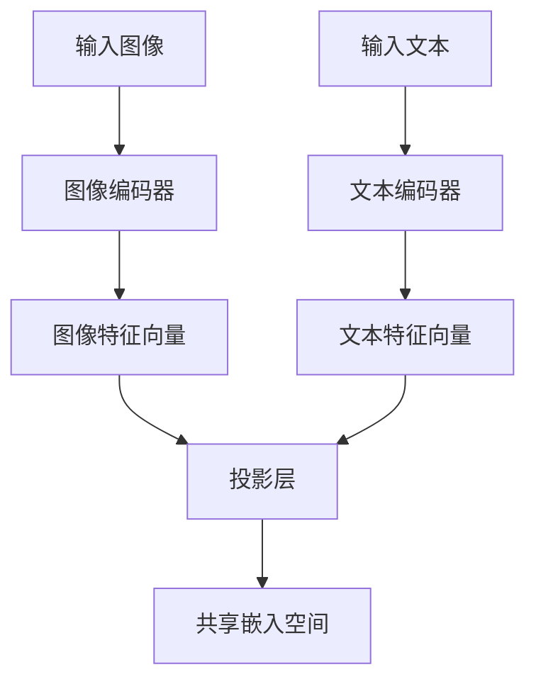
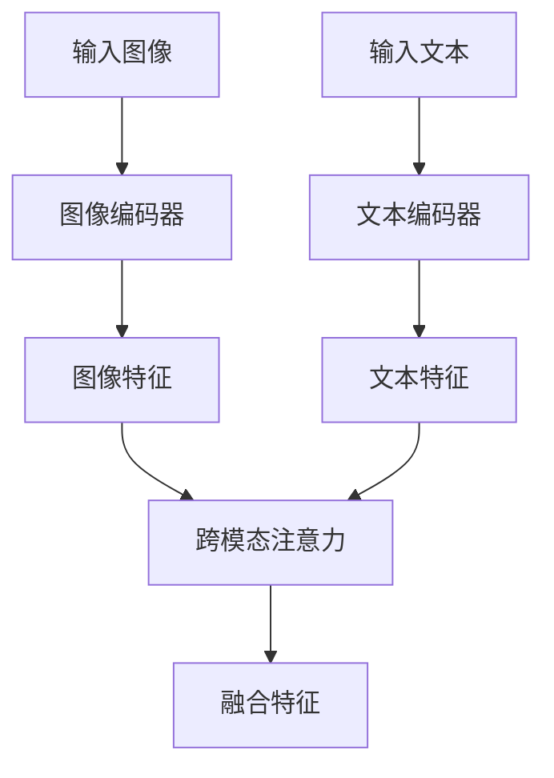
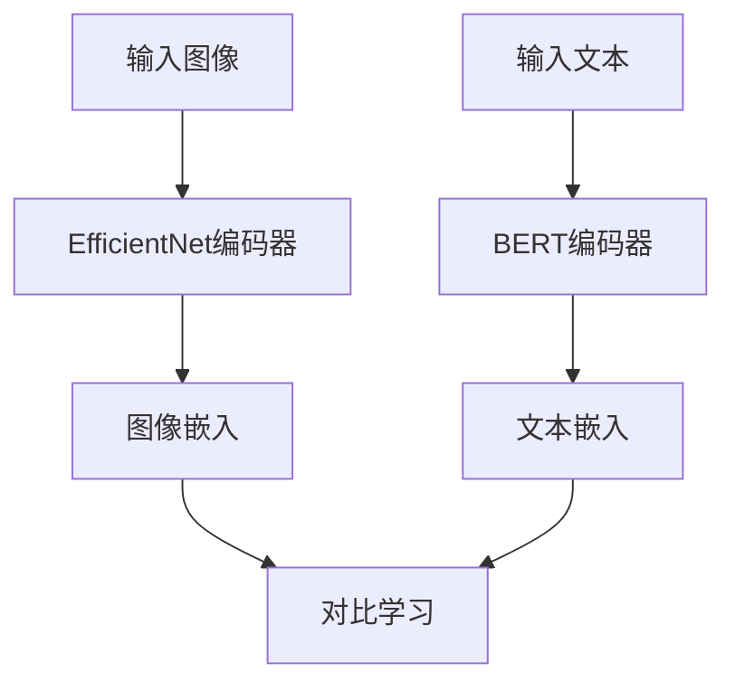
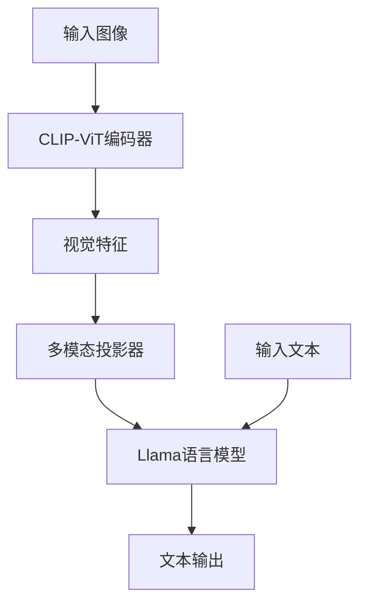
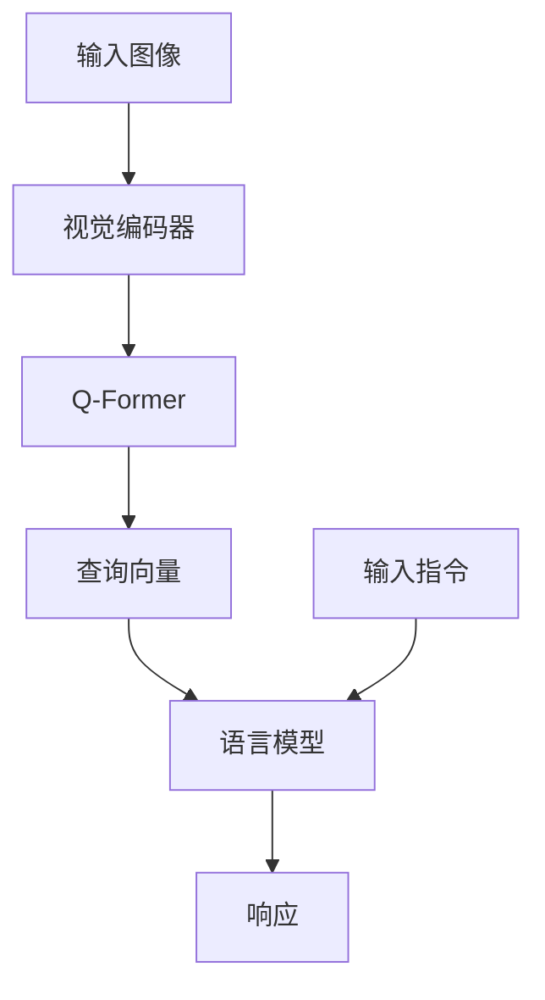

# 视觉-语言模型

<cite>
**本文档引用的文件**
- [modeling_clip.py](file://src/transformers/models/clip/modeling_clip.py)
- [configuration_clip.py](file://src/transformers/models/clip/configuration_clip.py)
- [modeling_blip.py](file://src/transformers/models/blip/modeling_blip.py)
- [configuration_blip.py](file://src/transformers/models/blip/configuration_blip.py)
- [modeling_align.py](file://src/transformers/models/align/modeling_align.py)
- [configuration_align.py](file://src/transformers/models/align/configuration_align.py)
- [modeling_llava.py](file://src/transformers/models/llava/modeling_llava.py)
- [configuration_llava.py](file://src/transformers/models/llava/configuration_llava.py)
- [modeling_instructblip.py](file://src/transformers/models/instructblip/modeling_instructblip.py)
- [configuration_instructblip.py](file://src/transformers/models/instructblip/configuration_instructblip.py)
</cite>

## 目录
1. [引言](#引言)
2. [核心模型架构](#核心模型架构)
3. [图文特征对齐机制](#图文特征对齐机制)
4. [跨模态注意力机制](#跨模态注意力机制)
5. [任务实现与代码示例](#任务实现与代码示例)
6. [模型性能分析](#模型性能分析)
7. [配置参数影响](#配置参数影响)
8. [模型选择指南](#模型选择指南)

## 引言
视觉-语言模型是人工智能领域的重要研究方向，旨在实现图像与文本之间的语义理解和交互。本文档详细介绍了CLIP、BLIP、ALIGN、LLaVA和InstructBLIP等代表性模型的架构设计和实现细节，分析了它们在多模态理解任务中的性能差异，为用户在不同应用场景下选择合适的视觉-语言模型提供指导。

## 核心模型架构

### CLIP模型架构
CLIP（Contrastive Language-Image Pre-training）模型采用双塔架构，包含独立的图像编码器和文本编码器。图像编码器通常基于Vision Transformer（ViT）或ResNet架构，将输入图像转换为高维特征向量。文本编码器则采用Transformer架构，将文本序列编码为语义向量。两个编码器的输出通过投影层映射到共享的多模态嵌入空间，并通过对比学习进行训练。



**图源**
- [modeling_clip.py](file://src/transformers/models/clip/modeling_clip.py#L625-L655)
- [configuration_clip.py](file://src/transformers/models/clip/configuration_clip.py#L1-L359)

### BLIP模型架构
BLIP（Bootstrapping Language-Image Pre-training）模型在CLIP的基础上进行了改进，引入了图像-文本检索和图像描述生成等多任务学习。BLIP模型同样采用双塔架构，但增加了跨模态注意力机制，允许文本编码器关注图像特征，从而实现更细粒度的图文对齐。



**图源**
- [modeling_blip.py](file://src/transformers/models/blip/modeling_blip.py#L43-L96)
- [configuration_blip.py](file://src/transformers/models/blip/configuration_blip.py#L1-L321)

### ALIGN模型架构
ALIGN（A Large-scale ImaGe and Noisy-text dataset）模型采用与CLIP类似的双塔架构，但使用了不同的骨干网络。ALIGN的图像编码器基于EfficientNet架构，而文本编码器则基于BERT架构。这种设计使得ALIGN在处理大规模噪声数据时表现出色。



**图源**
- [modeling_align.py](file://src/transformers/models/align/modeling_align.py#L802-L823)
- [configuration_align.py](file://src/transformers/models/align/configuration_align.py#L1-L327)

### LLaVA模型架构
LLaVA（Large Language and Vision Assistant）模型是一种基于大语言模型的视觉-语言模型。它将视觉编码器（如CLIP-ViT）的输出通过一个可学习的投影器映射到大语言模型的嵌入空间，从而实现视觉信息与语言模型的无缝集成。



**图源**
- [modeling_llava.py](file://src/transformers/models/llava/modeling_llava.py#L0-L486)
- [configuration_llava.py](file://src/transformers/models/llava/configuration_llava.py#L0-L138)

### InstructBLIP模型架构
InstructBLIP模型在BLIP的基础上引入了查询变换器（Q-Former），通过可学习的查询向量来提取图像的关键信息。这种设计使得模型能够更好地处理复杂的视觉问答任务。



**图源**
- [modeling_instructblip.py](file://src/transformers/models/instructblip/modeling_instructblip.py#L352-L392)
- [configuration_instructblip.py](file://src/transformers/models/instructblip/configuration_instructblip.py#L0-L314)

## 图文特征对齐机制

### 对比学习对齐
CLIP、BLIP和ALIGN等模型主要采用对比学习进行图文特征对齐。模型通过最大化匹配的图像-文本对的相似度，同时最小化不匹配对的相似度来学习跨模态表示。

```python
# CLIP中的对比损失计算
logits_per_text = torch.matmul(text_embeds, image_embeds.t()) * logit_scale
logits_per_image = logits_per_text.T
loss = clip_loss(logits_per_text)
```

**节源**
- [modeling_clip.py](file://src/transformers/models/clip/modeling_clip.py#L890-L926)

### 跨模态注意力对齐
BLIP和InstructBLIP等模型使用跨模态注意力机制实现更细粒度的对齐。文本编码器可以关注图像特征图的特定区域，从而建立词与图像区域之间的对应关系。

```python
# BLIP中的跨模态注意力
image_embeds_with_ln = self.cross_modal_image_transform(image_embeds_with_ln)
cross_modal_image = self.cross_modal_image_layernorm(image_embeds_with_ln)
layer_outputs_text = self.cross_modal_text_layers[0](
    cross_modal_text,
    cross_modal_image,
    attention_mask=extend_text_masks,
    encoder_attention_mask=extend_image_masks,
)
```

**节源**
- [modeling_blip.py](file://src/transformers/models/blip/modeling_blip.py#L1324-L1350)

## 跨模态注意力机制

### 自注意力与交叉注意力
InstructBLIP等模型结合了自注意力和交叉注意力机制。Q-Former首先通过自注意力处理查询向量，然后通过交叉注意力将查询向量与图像特征进行交互。

```python
# InstructBLIP中的Q-Former层
if layer_idx % config.cross_attention_frequency == 0:
    self.crossattention = InstructBlipQFormerAttention(config, is_cross_attention=True)
    self.has_cross_attention = True
else:
    self.has_cross_attention = False
```

**节源**
- [modeling_instructblip.py](file://src/transformers/models/instructblip/modeling_instructblip.py#L1352-L1379)

### 多层注意力融合
LLaVA等模型通过多层注意力机制实现视觉与语言信息的深度融合。视觉特征被注入到大语言模型的多个层中，从而实现全局的跨模态理解。

```python
# LLaVA中的多模态特征注入
language_model_inputs = self.language_projection(query_output)
inputs_embeds = inputs_embeds.masked_scatter(special_image_mask, language_model_inputs)
```

**节源**
- [modeling_instructblip.py](file://src/transformers/models/instructblip/modeling_instructblip.py#L1074-L1105)

## 任务实现与代码示例

### 图文检索
```python
# 使用CLIP进行图文检索
from transformers import CLIPProcessor, CLIPModel
import torch

model = CLIPModel.from_pretrained("openai/clip-vit-base-patch32")
processor = CLIPProcessor.from_pretrained("openai/clip-vit-base-patch32")

inputs = processor(text=["a photo of a cat", "a photo of a dog"], 
                   images=image, return_tensors="pt", padding=True)
outputs = model(**inputs)
logits_per_image = outputs.logits_per_image
probs = logits_per_image.softmax(dim=1)
```

**节源**
- [modeling_clip.py](file://src/transformers/models/clip/modeling_clip.py#L890-L926)

### 图像描述生成
```python
# 使用BLIP生成图像描述
from transformers import BlipProcessor, BlipForConditionalGeneration

processor = BlipProcessor.from_pretrained("Salesforce/blip-image-captioning-base")
model = BlipForConditionalGeneration.from_pretrained("Salesforce/blip-image-captioning-base")

inputs = processor(images=image, return_tensors="pt")
generated_ids = model.generate(**inputs)
generated_text = processor.batch_decode(generated_ids, skip_special_tokens=True)[0].strip()
```

**节源**
- [modeling_blip.py](file://src/transformers/models/blip/modeling_blip.py#L1012-L1048)

### 视觉问答
```python
# 使用InstructBLIP进行视觉问答
from transformers import InstructBlipProcessor, InstructBlipForConditionalGeneration

processor = InstructBlipProcessor.from_pretrained("Salesforce/instructblip-vicuna-7b")
model = InstructBlipForConditionalGeneration.from_pretrained("Salesforce/instructblip-vicuna-7b")

prompt = "What is unusual about this image?"
inputs = processor(images=image, text=prompt, return_tensors="pt")
generated_ids = model.generate(**inputs)
generated_text = processor.batch_decode(generated_ids, skip_special_tokens=True)[0].strip()
```

**节源**
- [modeling_instructblip.py](file://src/transformers/models/instructblip/modeling_instructblip.py#L1303-L1312)

## 模型性能分析

### 零样本学习能力
CLIP模型在零样本图像分类任务中表现出色，能够将图像分类到未见过的类别中。这种能力源于其大规模的对比预训练。

### 微调效果
BLIP和InstructBLIP等模型在特定任务上进行微调后，性能显著提升。微调可以针对特定领域的数据优化模型参数。

### 性能对比
| 模型 | 图文检索 | 图像描述 | 视觉问答 | 训练数据规模 |
|------|--------|--------|--------|----------|
| CLIP | 高 | 无 | 无 | 4亿对 |
| BLIP | 高 | 高 | 中 | 1.2亿对 |
| ALIGN | 高 | 中 | 无 | 18亿对 |
| LLaVA | 中 | 高 | 高 | 558万对 |
| InstructBLIP | 高 | 高 | 高 | 1.2亿对 |

**节源**
- [modeling_clip.py](file://src/transformers/models/clip/modeling_clip.py)
- [modeling_blip.py](file://src/transformers/models/blip/modeling_blip.py)
- [modeling_align.py](file://src/transformers/models/align/modeling_align.py)
- [modeling_llava.py](file://src/transformers/models/llava/modeling_llava.py)
- [modeling_instructblip.py](file://src/transformers/models/instructblip/modeling_instructblip.py)

## 配置参数影响

### 投影维度
投影维度（projection_dim）影响图文特征在共享空间中的表示能力。较大的维度可以保留更多细节，但可能导致过拟合。

### 温度参数
温度参数（temperature）控制对比损失的锐度。较低的温度使模型对相似度更敏感，而较高的温度则更平滑。

### 特征选择策略
LLaVA等模型支持不同的视觉特征选择策略，如"default"选择特定层的特征，"full"使用所有层的特征。

```python
# LLaVA配置中的特征选择
config = LlavaConfig(
    vision_feature_select_strategy="default",
    vision_feature_layer=-2,
)
```

**节源**
- [configuration_llava.py](file://src/transformers/models/llava/configuration_llava.py#L55-L96)

## 模型选择指南

### 通用图文匹配
对于通用的图文匹配任务，推荐使用CLIP模型。它具有强大的零样本学习能力，适用于广泛的场景。

### 图像描述生成
对于图像描述生成任务，BLIP或InstructBLIP是更好的选择。它们专门为此任务进行了优化，生成的描述更加准确和丰富。

### 视觉问答
对于复杂的视觉问答任务，InstructBLIP或LLaVA是首选。它们能够理解复杂的指令并提供详细的回答。

### 资源受限环境
在计算资源受限的环境中，可以考虑使用较小的BLIP模型或经过量化处理的模型版本。