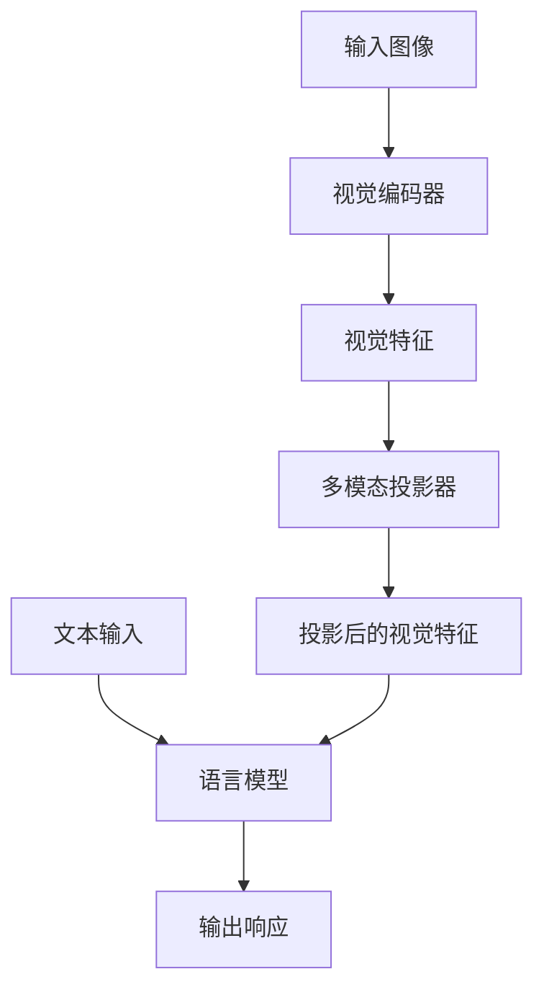
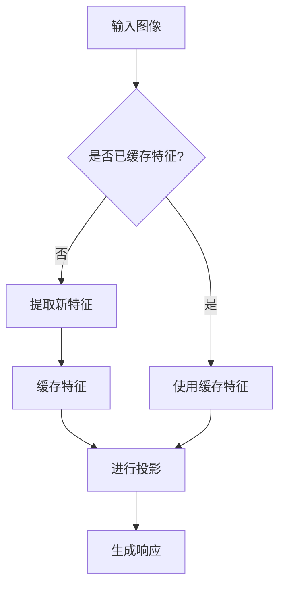

# 对话式视觉问答

<cite>
**本文档中引用的文件**   
- [modeling_llava.py](file://src/transformers/models/llava/modeling_llava.py)
- [configuration_llava.py](file://src/transformers/models/llava/configuration_llava.py)
- [processing_llava.py](file://src/transformers/models/llava/processing_llava.py)
- [modeling_llava_next.py](file://src/transformers/models/llava_next/modeling_llava_next.py)
- [configuration_llava_next.py](file://src/transformers/models/llava_next/configuration_llava_next.py)
- [modeling_llava_onevision.py](file://src/transformers/models/llava_onevision/modeling_llava_onevision.py)
- [configuration_llava_onevision.py](file://src/transformers/models/llava_onevision/configuration_llava_onevision.py)
</cite>

## 目录
1. [引言](#引言)
2. [LLaVA系列模型架构](#llava系列模型架构)
3. [视觉上下文处理机制](#视觉上下文处理机制)
4. [多轮对话管理](#多轮对话管理)
5. [跨轮次视觉-语言对齐策略](#跨轮次视觉-语言对齐策略)
6. [使用示例](#使用示例)
7. [复杂视觉推理任务分析](#复杂视觉推理任务分析)
8. [模型变体选择指南](#模型变体选择指南)
9. [结论](#结论)

## 引言

LLaVA（Large Language and Vision Assistant）系列模型是先进的多模态大语言模型，能够处理复杂的视觉问答任务。这些模型通过将视觉编码器与大型语言模型相结合，实现了对图像和文本的联合理解。本文档详细介绍了LLaVA系列模型的实现机制，重点分析其在多轮对话中处理视觉上下文的能力，包括视觉特征缓存、对话历史管理以及跨轮次的视觉-语言对齐策略。

## LLaVA系列模型架构

LLaVA系列模型采用模块化架构，主要由三个核心组件构成：视觉编码器、多模态投影器和语言模型。这种架构设计使得模型能够有效地处理视觉和语言信息的融合。



**图源**  
- [modeling_llava.py](file://src/transformers/models/llava/modeling_llava.py#L389-L417)
- [modeling_llava_next.py](file://src/transformers/models/llava_next/modeling_llava_next.py#L171-L196)

**LLaVA模型架构的主要特点包括**：
- **视觉编码器**：通常基于CLIP等预训练视觉模型，负责提取图像的深层特征
- **多模态投影器**：将高维视觉特征投影到语言模型的嵌入空间，实现模态对齐
- **语言模型**：基于LLaMA等大型语言模型，负责生成连贯的文本响应

## 视觉上下文处理机制

LLaVA系列模型通过一系列精心设计的机制来处理视觉上下文，确保在多轮对话中保持视觉信息的一致性和连贯性。

### 视觉特征提取

视觉特征提取是LLaVA模型处理视觉信息的第一步。模型首先使用视觉编码器从输入图像中提取特征，然后通过多模态投影器将这些特征转换为语言模型可以理解的形式。

```python
def get_image_features(
    self,
    pixel_values: torch.FloatTensor,
    vision_feature_layer: Optional[Union[int, list[int]]] = None,
    vision_feature_select_strategy: Optional[str] = None,
    **kwargs,
):
    """
    从视觉编码器获取图像最后的隐藏状态并应用多模态投影。
    """
```

**代码路径**  
- [modeling_llava.py](file://src/transformers/models/llava/modeling_llava.py#L289-L388)

### 视觉特征缓存

为了提高多轮对话的效率，LLaVA模型实现了视觉特征缓存机制。该机制允许模型在对话过程中重用已计算的视觉特征，避免重复计算。

**视觉特征缓存的关键参数**：
- `image_seq_length`：单个图像嵌入的序列长度
- `vision_feature_layer`：用于选择视觉特征的层索引
- `vision_feature_select_strategy`：特征选择策略，可选"默认"或"完整"



**图源**  
- [modeling_llava.py](file://src/transformers/models/llava/modeling_llava.py#L289-L388)
- [configuration_llava.py](file://src/transformers/models/llava/configuration_llava.py#L55-L96)

## 多轮对话管理

LLaVA系列模型通过复杂的对话管理机制来维持多轮对话的连贯性和上下文一致性。

### 对话历史维护

模型通过维护对话历史来跟踪对话的上下文。每次用户输入都会被添加到对话历史中，并与之前的对话内容一起处理。

**对话历史管理的关键特性**：
- **对话模板**：使用特定的对话模板来格式化多轮对话
- **占位符机制**：使用特殊标记（如`<image>`）来表示图像位置
- **上下文窗口**：限制对话历史的长度以管理计算资源

```python
def __call__(
    self,
    images: Optional[ImageInput] = None,
    text: Union[TextInput, PreTokenizedInput, list[TextInput], list[PreTokenizedInput]] = None,
    **kwargs: Unpack[LlavaProcessorKwargs],
) -> BatchFeature:
    """
    准备模型输入的主要方法，处理图像和文本序列。
    """
```

**代码路径**  
- [processing_llava.py](file://src/transformers/models/llava/processing_llava.py#L100-L207)

### 对话状态跟踪

LLaVA模型通过跟踪对话状态来理解对话的进展和用户意图。这种状态跟踪机制使得模型能够根据对话历史生成更加连贯和相关的响应。

## 跨轮次视觉-语言对齐策略

LLaVA系列模型采用多种策略来实现跨轮次的视觉-语言对齐，确保在多轮对话中保持视觉和语言信息的一致性。

### 特征选择策略

模型提供了不同的特征选择策略来处理视觉特征：

- **默认策略**：移除视觉特征中的CLS标记
- **完整策略**：使用完整的视觉特征

```python
if vision_feature_select_strategy == "default":
    selected_image_feature = selected_image_feature[:, 1:]
```

**代码路径**  
- [modeling_llava.py](file://src/transformers/models/llava/modeling_llava.py#L325-L335)

### 多尺度特征融合

对于高分辨率图像，LLaVA-NeXT等变体采用多尺度特征融合策略，通过将图像分割成多个补丁并分别处理，然后融合结果来提高处理效率和准确性。

```python
def get_anyres_image_grid_shape(image_size, grid_pinpoints, patch_size):
    """
    计算任意分辨率图像预处理后的图像补丁网格形状。
    """
```

**代码路径**  
- [modeling_llava_next.py](file://src/transformers/models/llava_next/modeling_llava_next.py#L100-L130)

## 使用示例

以下示例展示了如何使用LLaVA模型进行多轮视觉问答。

### 基本使用示例

```python
from transformers import AutoProcessor, LlavaForConditionalGeneration
import requests
from PIL import Image

# 加载模型和处理器
model = LlavaForConditionalGeneration.from_pretrained("llava-hf/llava-1.5-7b-hf")
processor = AutoProcessor.from_pretrained("llava-hf/llava-1.5-7b-hf")

# 准备输入
prompt = "USER: <image>\nWhat's the content of the image? ASSISTANT:"
url = "https://www.ilankelman.org/stopsigns/australia.jpg"
image = Image.open(requests.get(url, stream=True).raw)

# 处理输入
inputs = processor(images=image, text=prompt, return_tensors="pt")

# 生成响应
generate_ids = model.generate(**inputs, max_new_tokens=15)
response = processor.batch_decode(generate_ids, skip_special_tokens=True, clean_up_tokenization_spaces=False)[0]
```

**代码路径**  
- [modeling_llava.py](file://src/transformers/models/llava/modeling_llava.py#L389-L417)

### 多轮对话示例

```python
# 多轮对话示例
conversation = [
    {
        "role": "user",
        "content": [
            {"type": "image"},
            {"type": "text", "text": "What’s shown in this image?"},
        ],
    },
    {
        "role": "assistant",
        "content": [
            {"type": "text", "text": "This image shows a long wooden dock extending out into a lake."}
        ],
    },
    {
        "role": "user",
        "content": [
            {"type": "image"},
            {"type": "text", "text": "What about this one, what do you see here? Can you describe in detail?"},
        ],
    },
]

prompt = processor.apply_chat_template(conversation, add_generation_prompt=True)
inputs = processor(text=prompt, images=[[image1, image2]], return_tensors="pt")
```

**代码路径**  
- [test_modeling_mllama.py](file://tests/models/mllama/test_modeling_mllama.py#L675-L709)

## 复杂视觉推理任务分析

LLaVA系列模型在处理需要多步推理的复杂视觉问答任务时表现出色。

### 多步推理能力

模型能够通过以下方式处理复杂的视觉推理任务：
- **分步分析**：将复杂问题分解为多个简单的子问题
- **上下文累积**：在多轮对话中累积和利用先前的推理结果
- **跨模态关联**：建立视觉元素与语言描述之间的深层关联

### 基于图像的对话系统性能

在基于图像的对话系统中，LLaVA模型表现出以下优势：
- **上下文连贯性**：能够维持长时间对话的上下文一致性
- **视觉理解深度**：能够理解图像中的细微差别和复杂场景
- **响应相关性**：生成的响应与图像内容高度相关且自然流畅

## 模型变体选择指南

根据不同的应用场景，用户可以选择合适的LLaVA变体。

### LLaVA基础版

**适用场景**：
- 标准视觉问答任务
- 资源受限的环境
- 快速原型开发

**特点**：
- 基于CLIP视觉编码器
- 使用单一视觉特征层
- 简单的特征选择策略

### LLaVA-NeXT

**适用场景**：
- 高分辨率图像处理
- 复杂视觉推理任务
- 需要多尺度分析的应用

**特点**：
- 支持任意分辨率图像处理
- 多尺度特征融合
- 更复杂的投影器设计

### LLaVA-OneVision

**适用场景**：
- 视频理解任务
- 多模态输入处理
- 高级视觉-语言对齐需求

**特点**：
- 支持视频输入
- 使用SigLIP视觉编码器
- 增强的跨模态对齐机制

## 结论

LLaVA系列模型通过创新的架构设计和先进的处理机制，在对话式视觉问答领域取得了显著成就。其视觉特征缓存机制、对话历史管理和跨轮次视觉-语言对齐策略共同确保了在多轮对话中维持上下文一致性和连贯性。对于需要构建对话式视觉应用的用户，根据具体需求选择合适的LLaVA变体至关重要。未来的研究方向可能包括进一步优化视觉特征提取效率、增强多步推理能力以及扩展对更多模态的支持。