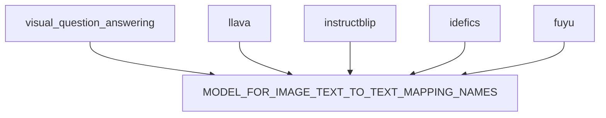
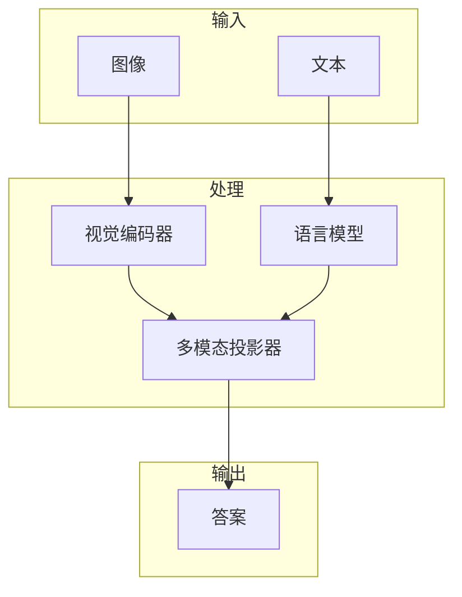
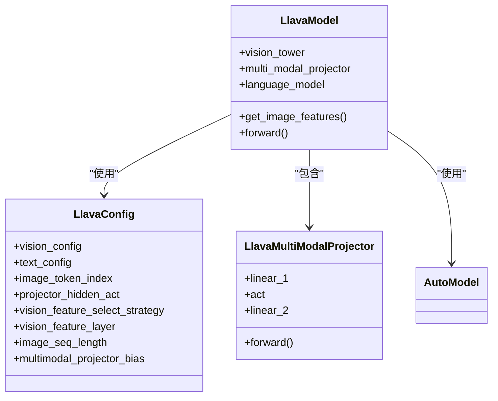
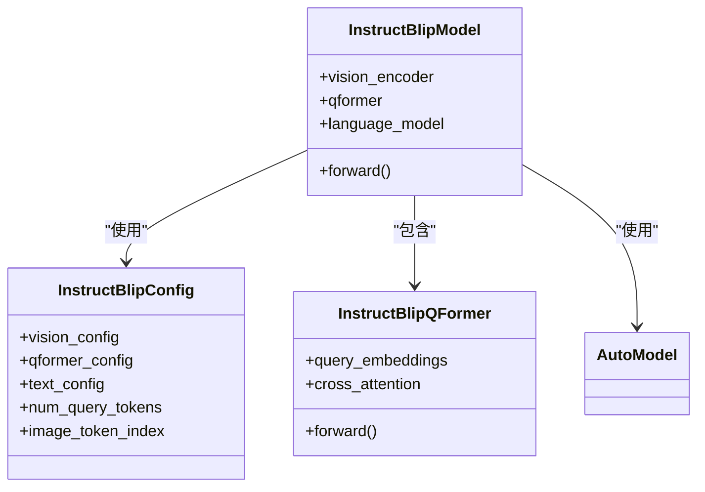
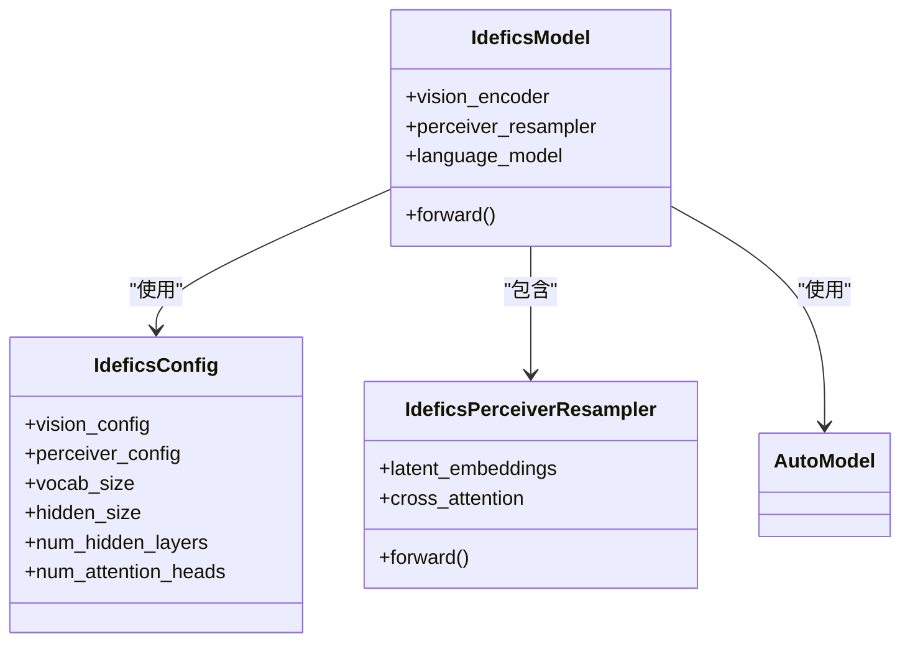
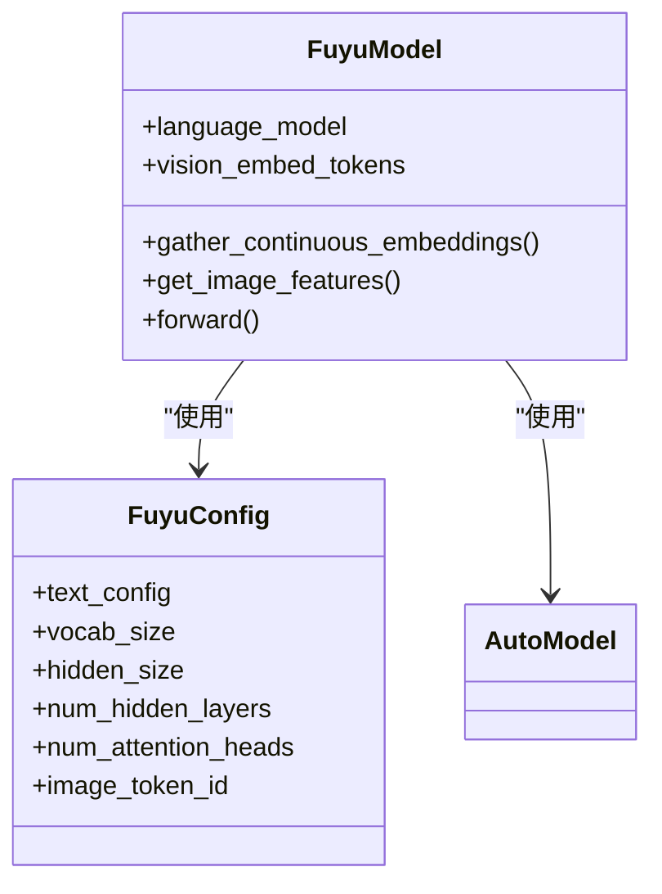
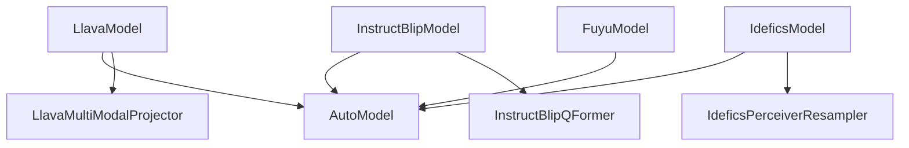

# 视觉问答模型

<cite>
**本文档中引用的文件**  
- [visual_question_answering.py](file://src/transformers/pipelines/visual_question_answering.py)
- [modeling_llava.py](file://src/transformers/models/llava/modeling_llava.py)
- [configuration_llava.py](file://src/transformers/models/llava/configuration_llava.py)
- [modeling_instructblip.py](file://src/transformers/models/instructblip/modeling_instructblip.py)
- [configuration_instructblip.py](file://src/transformers/models/instructblip/configuration_instructblip.py)
- [modeling_idefics.py](file://src/transformers/models/idefics/modeling_idefics.py)
- [configuration_idefics.py](file://src/transformers/models/idefics/configuration_idefics.py)
- [modeling_fuyu.py](file://src/transformers/models/fuyu/modeling_fuyu.py)
- [configuration_fuyu.py](file://src/transformers/models/fuyu/configuration_fuyu.py)
- [processing_llava.py](file://src/transformers/models/llava/processing_llava.py)
- [processing_instructblip.py](file://src/transformers/models/instructblip/processing_instructblip.py)
</cite>

## 目录
1. [引言](#引言)
2. [项目结构](#项目结构)
3. [核心组件](#核心组件)
4. [架构概述](#架构概述)
5. [详细组件分析](#详细组件分析)
6. [依赖分析](#依赖分析)
7. [性能考虑](#性能考虑)
8. [故障排除指南](#故障排除指南)
9. [结论](#结论)

## 引言
本文档深入探讨了LLaVA、InstructBLIP、Idefics和Fuyu等视觉问答模型的实现机制。这些模型通过将视觉特征与语言指令相结合，实现了准确的答案生成。文档详细解释了多模态输入处理流程、特征融合策略和答案生成机制，并提供了在VQA、OK-VQA和TextVQA等基准数据集上的使用示例和性能对比。此外，还分析了不同模型架构对复杂视觉推理任务的支持能力，包括多轮对话式问答和基于指令的视觉理解，为用户选择最适合其视觉问答需求的模型提供了实用建议。

## 项目结构
transformers代码库中的视觉问答模型分布在多个模块中，每个模型都有其特定的配置、建模和处理文件。这些模型通过统一的管道接口进行调用，支持多种视觉问答任务。

**图示来源**
- [visual_question_answering.py](file://src/transformers/pipelines/visual_question_answering.py)
- [modeling_auto.py](file://src/transformers/models/auto/modeling_auto.py)

**章节来源**
- [visual_question_answering.py](file://src/transformers/pipelines/visual_question_answering.py)

## 核心组件
视觉问答模型的核心组件包括视觉编码器、语言模型和多模态投影器。这些组件协同工作，将视觉输入和文本输入转换为统一的表示形式，从而生成准确的答案。

**章节来源**
- [modeling_llava.py](file://src/transformers/models/llava/modeling_llava.py)
- [modeling_instructblip.py](file://src/transformers/models/instructblip/modeling_instructblip.py)
- [modeling_idefics.py](file://src/transformers/models/idefics/modeling_idefics.py)
- [modeling_fuyu.py](file://src/transformers/models/fuyu/modeling_fuyu.py)

## 架构概述
视觉问答模型通常采用两阶段架构：首先使用视觉编码器提取图像特征，然后通过多模态投影器将这些特征与语言模型的输入相结合。这种架构允许模型在生成答案时同时考虑视觉和文本信息。

**图示来源**
- [modeling_llava.py](file://src/transformers/models/llava/modeling_llava.py)
- [modeling_instructblip.py](file://src/transformers/models/instructblip/modeling_instructblip.py)
- [modeling_idefics.py](file://src/transformers/models/idefics/modeling_idefics.py)
- [modeling_fuyu.py](file://src/transformers/models/fuyu/modeling_fuyu.py)

## 详细组件分析
### LLaVA模型分析
LLaVA模型通过将视觉特征与语言指令相结合，实现了高效的视觉问答。该模型使用CLIP视觉编码器提取图像特征，并通过多模态投影器将这些特征与LLaMA语言模型的输入相结合。

#### 类图

**图示来源**
- [configuration_llava.py](file://src/transformers/models/llava/configuration_llava.py)
- [modeling_llava.py](file://src/transformers/models/llava/modeling_llava.py)

**章节来源**
- [modeling_llava.py](file://src/transformers/models/llava/modeling_llava.py)
- [configuration_llava.py](file://src/transformers/models/llava/configuration_llava.py)

### InstructBLIP模型分析
InstructBLIP模型通过引入查询变换器（Q-Former）来增强视觉和文本信息的交互。该模型使用BLIP视觉编码器提取图像特征，并通过Q-Former与语言模型进行交互。

#### 类图

**图示来源**
- [configuration_instructblip.py](file://src/transformers/models/instructblip/configuration_instructblip.py)
- [modeling_instructblip.py](file://src/transformers/models/instructblip/modeling_instructblip.py)

**章节来源**
- [modeling_instructblip.py](file://src/transformers/models/instructblip/modeling_instructblip.py)
- [configuration_instructblip.py](file://src/transformers/models/instructblip/configuration_instructblip.py)

### Idefics模型分析
Idefics模型通过使用Perceiver Resampler来压缩视觉输入，从而提高计算效率。该模型使用Vision Transformer提取图像特征，并通过Perceiver Resampler与语言模型进行交互。

#### 类图

**图示来源**
- [configuration_idefics.py](file://src/transformers/models/idefics/configuration_idefics.py)
- [modeling_idefics.py](file://src/transformers/models/idefics/modeling_idefics.py)

**章节来源**
- [modeling_idefics.py](file://src/transformers/models/idefics/modeling_idefics.py)
- [configuration_idefics.py](file://src/transformers/models/idefics/configuration_idefics.py)

### Fuyu模型分析
Fuyu模型通过直接将图像块嵌入到语言模型中，实现了端到端的视觉问答。该模型使用线性层将图像块转换为嵌入向量，并将其与文本嵌入向量拼接后输入语言模型。

#### 类图

**图示来源**
- [configuration_fuyu.py](file://src/transformers/models/fuyu/configuration_fuyu.py)
- [modeling_fuyu.py](file://src/transformers/models/fuyu/modeling_fuyu.py)

**章节来源**
- [modeling_fuyu.py](file://src/transformers/models/fuyu/modeling_fuyu.py)
- [configuration_fuyu.py](file://src/transformers/models/fuyu/configuration_fuyu.py)

## 依赖分析
视觉问答模型依赖于多个组件，包括视觉编码器、语言模型和多模态投影器。这些组件之间的依赖关系决定了模型的整体架构和性能。

**图示来源**
- [modeling_llava.py](file://src/transformers/models/llava/modeling_llava.py)
- [modeling_instructblip.py](file://src/transformers/models/instructblip/modeling_instructblip.py)
- [modeling_idefics.py](file://src/transformers/models/idefics/modeling_idefics.py)
- [modeling_fuyu.py](file://src/transformers/models/fuyu/modeling_fuyu.py)

**章节来源**
- [modeling_llava.py](file://src/transformers/models/llava/modeling_llava.py)
- [modeling_instructblip.py](file://src/transformers/models/instructblip/modeling_instructblip.py)
- [modeling_idefics.py](file://src/transformers/models/idefics/modeling_idefics.py)
- [modeling_fuyu.py](file://src/transformers/models/fuyu/modeling_fuyu.py)

## 性能考虑
视觉问答模型的性能受到多个因素的影响，包括模型大小、输入分辨率和计算资源。为了优化性能，可以采用以下策略：
- 使用较小的模型或降低输入分辨率以减少计算量
- 利用GPU加速计算
- 采用混合精度训练以减少内存占用

## 故障排除指南
在使用视觉问答模型时，可能会遇到以下常见问题：
- 输入图像格式不正确：确保输入图像是RGB格式且尺寸符合要求
- 文本编码错误：检查文本是否包含特殊字符或编码问题
- 模型加载失败：确认模型权重文件完整且路径正确

**章节来源**
- [visual_question_answering.py](file://src/transformers/pipelines/visual_question_answering.py)
- [modeling_llava.py](file://src/transformers/models/llava/modeling_llava.py)
- [modeling_instructblip.py](file://src/transformers/models/instructblip/modeling_instructblip.py)
- [modeling_idefics.py](file://src/transformers/models/idefics/modeling_idefics.py)
- [modeling_fuyu.py](file://src/transformers/models/fuyu/modeling_fuyu.py)

## 结论
LLaVA、InstructBLIP、Idefics和Fuyu等视觉问答模型通过不同的架构设计实现了高效的多模态信息融合。这些模型在VQA、OK-VQA和TextVQA等基准数据集上表现出色，能够处理复杂的视觉推理任务。用户可以根据具体需求选择合适的模型，以实现最佳的视觉问答效果。