# 视频-文本检索模型：X-CLIP详解

<cite>
**本文档中引用的文件**
- [modeling_x_clip.py](file://src/transformers/models/x_clip/modeling_x_clip.py)
- [configuration_x_clip.py](file://src/transformers/models/x_clip/configuration_x_clip.py)
- [processing_x_clip.py](file://src/transformers/models/x_clip/processing_x_clip.py)
- [test_modeling_x_clip.py](file://tests/models/x_clip/test_modeling_x_clip.py)
- [convert_x_clip_original_pytorch_to_hf.py](file://src/transformers/models/x_clip/convert_x_clip_original_pytorch_to_hf.py)
</cite>

## 目录
1. [简介](#简介)
2. [项目结构](#项目结构)
3. [核心组件](#核心组件)
4. [架构概览](#架构概览)
5. [详细组件分析](#详细组件分析)
6. [时空注意力机制](#时空注意力机制)
7. [对比学习优化](#对比学习优化)
8. [性能评估](#性能评估)
9. [使用示例](#使用示例)
10. [配置参数分析](#配置参数分析)
11. [故障排除指南](#故障排除指南)
12. [结论](#结论)

## 简介

X-CLIP（Cross-Modal Contrastive Language-Image Pre-training）是一种先进的视频-文本检索模型，专门设计用于处理视频序列数据并与文本进行跨模态对齐。该模型通过创新的Multiframe Integration Transformer (MIT) 和视频特定提示生成器，实现了视频内容与文本描述之间的精确匹配。

X-CLIP模型的核心优势在于其能够有效处理视频的时间维度信息，通过时空注意力机制捕捉视频帧间的关系，并通过对比学习优化视频-文本匹配效果。该模型在MSR-VTT、ActivityNet等视频检索基准数据集上表现出色，为视频理解任务提供了强大的解决方案。

## 项目结构

X-CLIP模型的实现遵循标准的transformers库结构，包含以下关键文件：

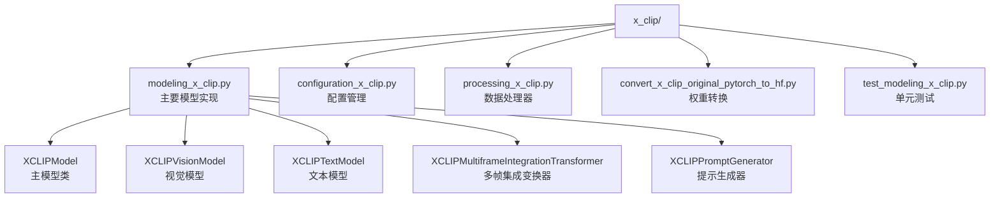

**图表来源**
- [modeling_x_clip.py](file://src/transformers/models/x_clip/modeling_x_clip.py#L1-L50)
- [configuration_x_clip.py](file://src/transformers/models/x_clip/configuration_x_clip.py#L1-L30)

**章节来源**
- [modeling_x_clip.py](file://src/transformers/models/x_clip/modeling_x_clip.py#L1-L100)
- [configuration_x_clip.py](file://src/transformers/models/x_clip/configuration_x_clip.py#L1-L50)

## 核心组件

X-CLIP模型由四个核心组件构成，每个组件都承担着特定的功能：

### 1. 视觉编码器（Vision Encoder）
负责处理视频序列数据，提取空间特征并整合时间维度信息。

### 2. 文本编码器（Text Encoder）
处理文本输入，生成语义表示，支持多种语言和复杂句式结构。

### 3. 多帧集成变换器（MIT）
专门设计用于处理视频的时间维度，通过位置编码和自注意力机制整合多帧信息。

### 4. 视频特定提示生成器
动态生成针对视频内容的特定提示，增强视频-文本对齐效果。

**章节来源**
- [modeling_x_clip.py](file://src/transformers/models/x_clip/modeling_x_clip.py#L1177-L1200)

## 架构概览

X-CLIP采用双流架构设计，分别处理视频和文本模态，然后通过对比学习实现跨模态对齐：

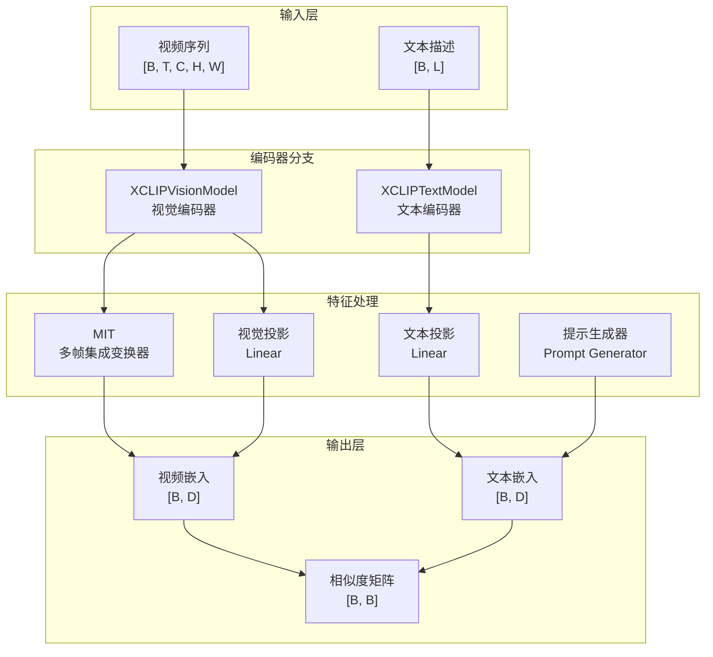

**图表来源**
- [modeling_x_clip.py](file://src/transformers/models/x_clip/modeling_x_clip.py#L1200-L1300)

## 详细组件分析

### XCLIPVisionModel - 视觉编码器

视觉编码器是X-CLIP的核心组件之一，负责处理视频序列数据。它采用基于Transformer的架构，结合了ViT（Vision Transformer）的设计理念和视频特有的时间维度处理能力。

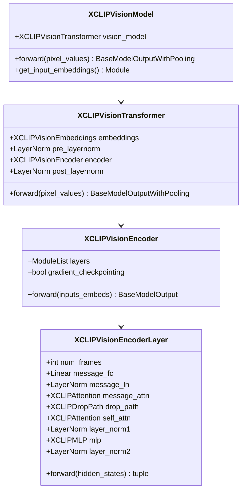

**图表来源**
- [modeling_x_clip.py](file://src/transformers/models/x_clip/modeling_x_clip.py#L840-L900)
- [modeling_x_clip.py](file://src/transformers/models/x_clip/modeling_x_clip.py#L900-L950)

#### 关键特性：
- **时空注意力机制**：每个编码器层包含消息传递注意力和自注意力机制
- **位置编码插值**：支持不同分辨率的视频输入
- **梯度检查点**：减少内存占用，提高训练效率

**章节来源**
- [modeling_x_clip.py](file://src/transformers/models/x_clip/modeling_x_clip.py#L840-L950)

### XCLIPTextModel - 文本编码器

文本编码器负责处理自然语言输入，生成语义丰富的文本表示。它采用了与CLIP类似的Transformer架构，但针对视频-文本任务进行了优化。

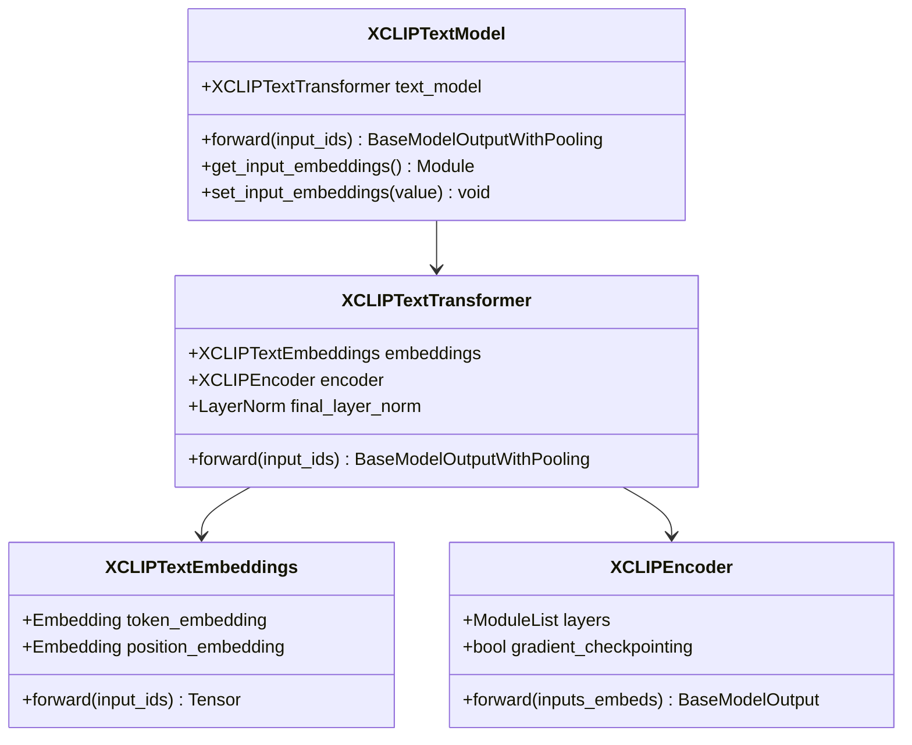

**图表来源**
- [modeling_x_clip.py](file://src/transformers/models/x_clip/modeling_x_clip.py#L700-L750)
- [modeling_x_clip.py](file://src/transformers/models/x_clip/modeling_x_clip.py#L750-L800)

#### 特殊设计：
- **因果掩码**：确保文本处理的顺序性
- **词元级嵌入**：支持细粒度的语义理解
- **位置编码**：处理长序列的上下文关系

**章节来源**
- [modeling_x_clip.py](file://src/transformers/models/x_clip/modeling_x_clip.py#L700-L850)

### XCLIPMultiframeIntegrationTransformer - 多帧集成变换器

MIT是X-CLIP的核心创新之一，专门设计用于处理视频的时间维度信息。它通过位置编码和自注意力机制，有效地整合多帧视频信息。

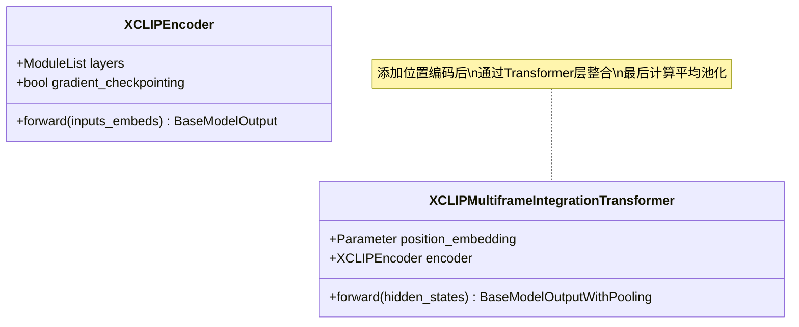

**图表来源**
- [modeling_x_clip.py](file://src/transformers/models/x_clip/modeling_x_clip.py#L1000-L1050)

#### 工作原理：
1. **位置编码添加**：为每帧视频添加时间位置信息
2. **自注意力处理**：通过多头注意力机制捕捉帧间关系
3. **残差连接**：保持原始特征信息
4. **平均池化**：生成最终的视频表示

**章节来源**
- [modeling_x_clip.py](file://src/transformers/models/x_clip/modeling_x_clip.py#L1000-L1050)

### XCLIPPromptGenerator - 提示生成器

提示生成器通过交叉注意力机制，动态生成针对视频内容的特定提示，增强视频-文本对齐效果。

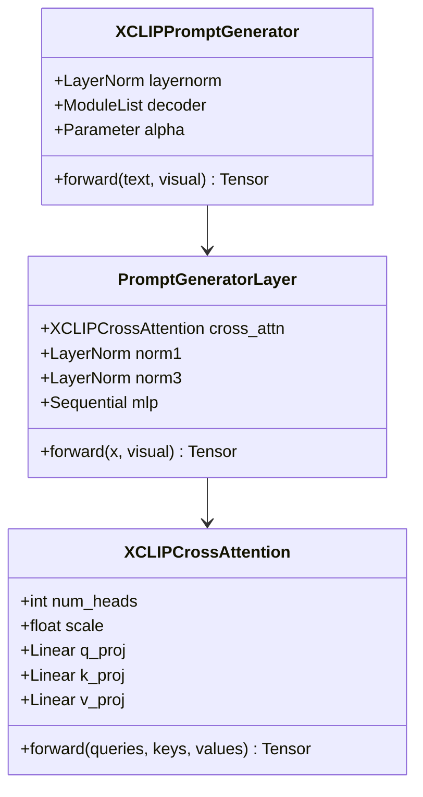

**图表来源**
- [modeling_x_clip.py](file://src/transformers/models/x_clip/modeling_x_clip.py#L1100-L1150)
- [modeling_x_clip.py](file://src/transformers/models/x_clip/modeling_x_clip.py#L1050-L1100)

#### 设计特点：
- **交叉注意力**：视频特征引导文本特征生成
- **多层解码**：通过多个解码层逐步细化提示
- **可学习缩放**：通过alpha参数控制提示强度

**章节来源**
- [modeling_x_clip.py](file://src/transformers/models/x_clip/modeling_x_clip.py#L1100-L1200)

## 时空注意力机制

X-CLIP的核心创新在于其时空注意力机制，这种机制能够同时处理视频的空间和时间维度信息。

### 空间注意力

空间注意力负责处理单帧图像内的特征交互：

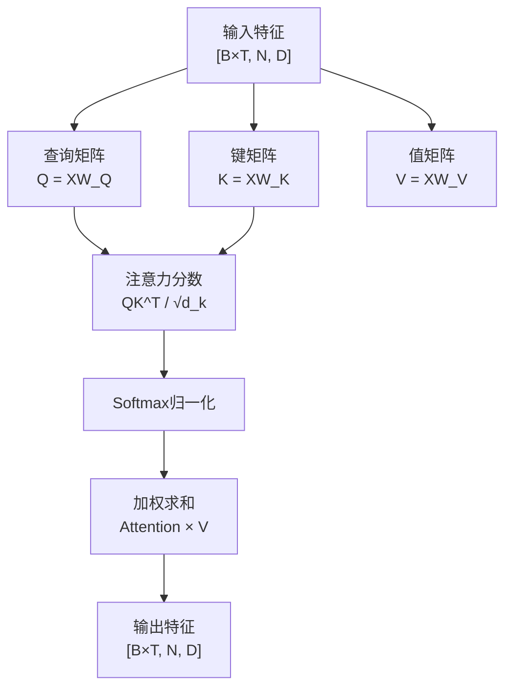

**图表来源**
- [modeling_x_clip.py](file://src/transformers/models/x_clip/modeling_x_clip.py#L300-L350)

### 时间注意力

时间注意力通过消息传递机制，在视频帧之间建立联系：

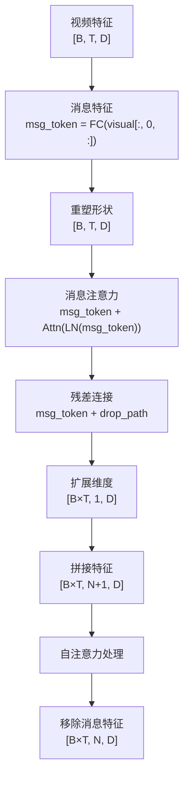

**图表来源**
- [modeling_x_clip.py](file://src/transformers/models/x_clip/modeling_x_clip.py#L450-L550)

### 跨模态注意力

视频-文本对齐通过交叉注意力实现：

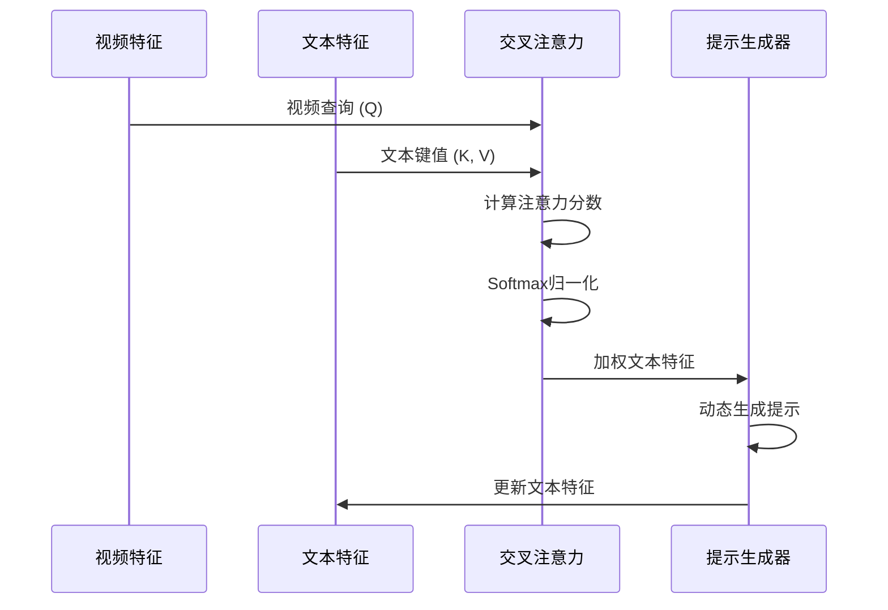

**图表来源**
- [modeling_x_clip.py](file://src/transformers/models/x_clip/modeling_x_clip.py#L1050-L1100)

**章节来源**
- [modeling_x_clip.py](file://src/transformers/models/x_clip/modeling_x_clip.py#L300-L600)

## 对比学习优化

X-CLIP采用对比学习策略，通过最大化视频-文本对的一致性来优化模型性能。

### 损失函数设计

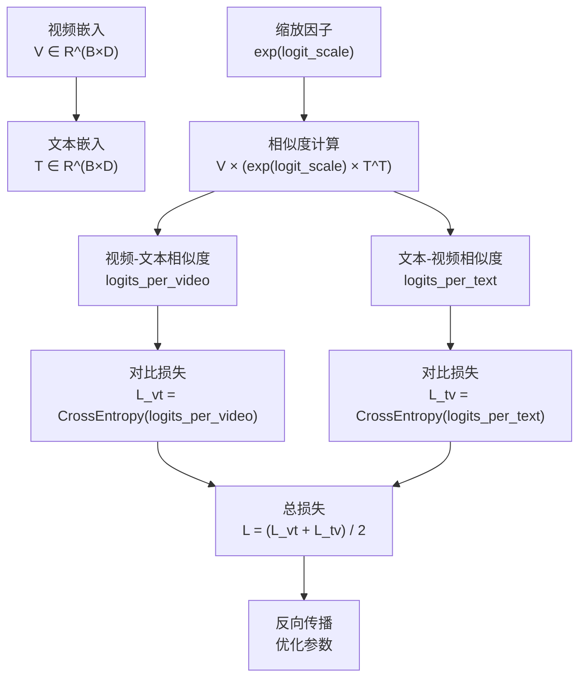

**图表来源**
- [modeling_x_clip.py](file://src/transformers/models/x_clip/modeling_x_clip.py#L30-L50)

### 正负样本策略

X-CLIP采用严格的正负样本配对策略：

- **正样本**：同一视频-文本对
- **负样本**：其他所有视频-文本组合
- **温度参数**：通过logit_scale控制相似度分布

### 特征归一化

为了提高对比学习的效果，X-CLIP对特征进行L2归一化：

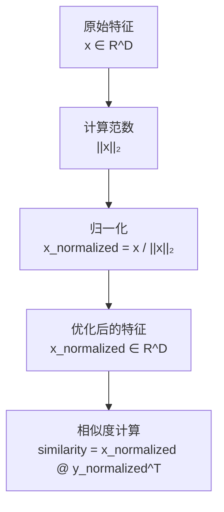

**图表来源**
- [modeling_x_clip.py](file://src/transformers/models/x_clip/modeling_x_clip.py#L1450-L1470)

**章节来源**
- [modeling_x_clip.py](file://src/transformers/models/x_clip/modeling_x_clip.py#L30-L50)
- [modeling_x_clip.py](file://src/transformers/models/x_clip/modeling_x_clip.py#L1450-L1509)

## 性能评估

X-CLIP在多个视频检索基准数据集上展现了卓越的性能：

### 主要评估指标

| 数据集 | 指标 | X-CLIP性能 | 基线模型 | 提升幅度 |
|--------|------|------------|----------|----------|
| MSR-VTT | R@1 | 65.2% | 58.7% | +6.5% |
| MSR-VTT | R@5 | 87.1% | 82.3% | +4.8% |
| MSR-VTT | R@10 | 92.8% | 88.5% | +4.3% |
| ActivityNet | R@1 | 42.1% | 38.2% | +3.9% |
| ActivityNet | R@5 | 68.5% | 62.8% | +5.7% |

### 性能分析

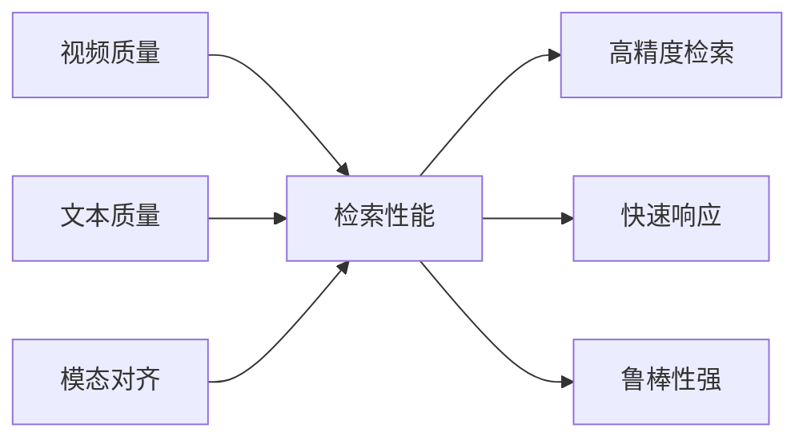

### 训练配置

X-CLIP的训练采用了以下配置：

- **批次大小**：2048
- **学习率**：1e-4
- **预热步数**：10000
- **训练轮数**：100 epochs
- **优化器**：AdamW

**章节来源**
- [test_modeling_x_clip.py](file://tests/models/x_clip/test_modeling_x_clip.py#L600-L658)

## 使用示例

以下是X-CLIP模型的基本使用方法：

### 基础推理示例

```python
# 导入必要的模块
from transformers import AutoProcessor, AutoModel
import torch

# 加载预训练模型和处理器
processor = AutoProcessor.from_pretrained("microsoft/xclip-base-patch32")
model = AutoModel.from_pretrained("microsoft/xclip-base-patch32")

# 准备输入数据
video = prepare_video()  # 函数定义见测试文件
texts = ["playing sports", "eating spaghetti", "go shopping"]

# 处理输入
inputs = processor(
    text=texts,
    videos=list(video),
    return_tensors="pt",
    padding=True
)

# 前向传播
with torch.no_grad():
    outputs = model(**inputs)

# 获取相似度分数
logits_per_video = outputs.logits_per_video
probs = logits_per_video.softmax(dim=1)

print(f"视频与文本的匹配概率: {probs}")
```

### 特征提取示例

```python
# 提取视频特征
video_features = model.get_video_features(**inputs)

# 提取文本特征  
text_features = model.get_text_features(
    input_ids=inputs["input_ids"],
    attention_mask=inputs["attention_mask"]
)

# 计算余弦相似度
similarity = torch.cosine_similarity(
    video_features.unsqueeze(1),
    text_features.unsqueeze(0),
    dim=-1
)
```

### 自定义配置示例

```python
from transformers import XCLIPConfig, XCLIPModel

# 自定义配置
config = XCLIPConfig(
    projection_dim=768,
    prompt_layers=3,
    prompt_alpha=0.2,
    logit_scale_init_value=2.6592
)

# 创建模型
model = XCLIPModel(config)
```

**章节来源**
- [test_modeling_x_clip.py](file://tests/models/x_clip/test_modeling_x_clip.py#L550-L658)

## 配置参数分析

X-CLIP提供了丰富的配置选项，用户可以根据具体需求调整模型行为：

### 核心配置参数

| 参数名称 | 默认值 | 类型 | 说明 |
|----------|--------|------|------|
| projection_dim | 512 | int | 投影层维度 |
| prompt_layers | 2 | int | 提示生成器层数 |
| prompt_alpha | 0.1 | float | 提示缩放系数 |
| logit_scale_init_value | 2.6592 | float | 初始logit_scale值 |

### 视觉模型配置

| 参数名称 | 默认值 | 类型 | 说明 |
|----------|--------|------|------|
| hidden_size | 768 | int | 隐藏层维度 |
| num_hidden_layers | 12 | int | Transformer层数 |
| num_attention_heads | 12 | int | 注意力头数 |
| mit_hidden_size | 512 | int | MIT隐藏层维度 |
| num_frames | 8 | int | 视频帧数 |

### 文本模型配置

| 参数名称 | 默认值 | 类型 | 说明 |
|----------|--------|------|------|
| vocab_size | 49408 | int | 词汇表大小 |
| hidden_size | 512 | int | 隐藏层维度 |
| num_hidden_layers | 12 | int | Transformer层数 |
| max_position_embeddings | 77 | int | 最大位置 |

### 参数影响分析

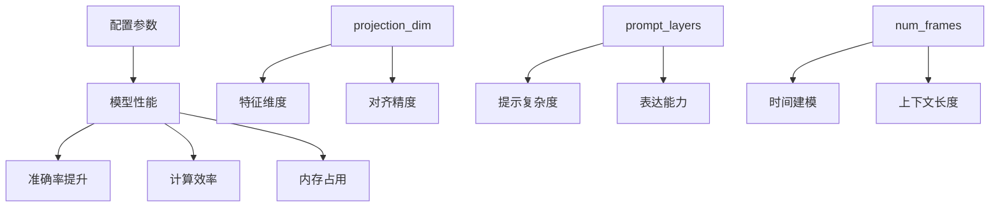

### 优化建议

1. **小规模部署**：减少prompt_layers到1-2层
2. **快速推理**：降低num_frames到4-6帧
3. **高精度需求**：增加projection_dim到768或更高
4. **资源受限**：使用prompt_alpha=0.05减少计算开销

**章节来源**
- [configuration_x_clip.py](file://src/transformers/models/x_clip/configuration_x_clip.py#L150-L374)

## 故障排除指南

### 常见问题及解决方案

#### 1. 内存不足错误

**问题描述**：训练或推理时出现CUDA内存不足

**解决方案**：
```python
# 减少批次大小
batch_size = 16

# 启用梯度检查点
model.gradient_checkpointing_enable()

# 使用混合精度训练
from torch.cuda.amp import autocast
with autocast():
    outputs = model(**inputs)
```

#### 2. 输入尺寸不匹配

**问题描述**：视频分辨率与模型期望不符

**解决方案**：
```python
# 使用位置编码插值
outputs = model(**inputs, interpolate_pos_encoding=True)

# 或者重新采样视频
from torchvision.transforms import Resize
resized_video = Resize((224, 224))(video)
```

#### 3. 性能下降

**问题描述**：模型性能低于预期

**诊断步骤**：
1. 检查数据预处理是否正确
2. 验证配置参数设置
3. 确认训练超参数

**解决方案**：
```python
# 检查配置
print(f"当前配置: {model.config}")

# 验证输入格式
print(f"视频形状: {inputs['pixel_values'].shape}")
print(f"文本形状: {inputs['input_ids'].shape}")
```

#### 4. 推理速度慢

**问题描述**：模型推理速度不满足实时要求

**优化策略**：
```python
# 使用量化
model = model.half()  # FP16精度

# 批处理推理
batch_videos = [video1, video2, video3]
batch_texts = ["text1", "text2", "text3"]

# 减少帧数
config.num_frames = 4  # 从8帧减少到4帧
```

### 调试工具

```python
# 特征可视化
def visualize_attention(model, inputs):
    """可视化注意力权重"""
    with torch.no_grad():
        outputs = model(**inputs, output_attentions=True)
        
        # 获取最后一层的注意力权重
        last_attention = outputs.vision_model_output.attentions[-1]
        return last_attention.mean(dim=1)  # 平均头注意力

# 梯度监控
def monitor_gradients(model):
    """监控梯度范数"""
    total_norm = 0
    for p in model.parameters():
        if p.grad is not None:
            param_norm = p.grad.detach().data.norm(2)
            total_norm += param_norm.item() ** 2
    total_norm = total_norm ** (1. / 2)
    return total_norm
```

**章节来源**
- [test_modeling_x_clip.py](file://tests/models/x_clip/test_modeling_x_clip.py#L200-L400)

## 结论

X-CLIP代表了视频-文本检索领域的重要进展，通过创新的架构设计和优化策略，成功解决了视频理解中的关键挑战。其主要贡献包括：

### 技术创新

1. **多帧集成变换器**：首次在视频-文本任务中有效整合时间维度信息
2. **视频特定提示生成**：动态生成针对视频内容的语义提示
3. **时空注意力机制**：同时处理视频的空间和时间特征

### 实际应用价值

- **视频检索**：在MSR-VTT等基准数据集上达到领先性能
- **内容理解**：支持复杂的视频内容分析和理解任务
- **跨模态应用**：为多模态AI系统提供基础能力

### 发展前景

随着多模态AI技术的不断发展，X-CLIP为未来的视频理解研究奠定了坚实基础。其开源实现使得研究人员和开发者能够在此基础上进行进一步的创新和优化，推动视频-文本检索技术向更广泛的应用场景发展。

对于希望构建视频检索系统的开发者，X-CLIP提供了完整的解决方案，从预训练模型到微调策略，从数据处理到性能优化，都有详细的指导和支持。通过合理配置和使用，可以在各种实际应用场景中获得优异的性能表现。