# 跨模态检索模型

<cite>
**本文档中引用的文件**
- [modeling_clip.py](file://src/transformers/models/clip/modeling_clip.py)
- [modeling_align.py](file://src/transformers/models/align/modeling_align.py)
- [modeling_groupvit.py](file://src/transformers/models/groupvit/modeling_groupvit.py)
- [modeling_x_clip.py](file://src/transformers/models/x_clip/modeling_x_clip.py)
- [configuration_clip.py](file://src/transformers/models/clip/configuration_clip.py)
- [configuration_groupvit.py](file://src/transformers/models/groupvit/configuration_groupvit.py)
- [configuration_x_clip.py](file://src/transformers/models/x_clip/configuration_x_clip.py)
- [test_modeling_groupvit.py](file://tests/models/groupvit/test_modeling_groupvit.py)
- [test_modeling_x_clip.py](file://tests/models/x_clip/test_modeling_x_clip.py)
</cite>

## 目录
1. [简介](#简介)
2. [项目结构](#项目结构)
3. [核心组件](#核心组件)
4. [架构概览](#架构概览)
5. [详细组件分析](#详细组件分析)
6. [依赖关系分析](#依赖关系分析)
7. [性能考虑](#性能考虑)
8. [故障排除指南](#故障排除指南)
9. [结论](#结论)

## 简介

跨模态检索模型是现代人工智能领域的重要研究方向，它能够将不同模态的数据（如文本、图像、视频）映射到共享的语义空间中，实现高效的图文互搜功能。本文档详细介绍了transformers库中实现的四种主要跨模态检索模型：CLIP、ALIGN、GroupViT和X-CLIP。

这些模型的核心思想是通过对比学习（Contrastive Learning）训练，使得相似的文本-图像对在共享嵌入空间中距离更近，而不相似的对距离更远。这种设计使得模型能够在零样本（Zero-shot）和微调（Fine-tuning）场景下都表现出色。

## 项目结构

transformers库中的跨模态检索模型主要分布在以下目录结构中：

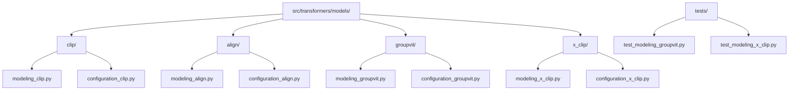

**图表来源**
- [modeling_clip.py](file://src/transformers/models/clip/modeling_clip.py#L1-L50)
- [modeling_align.py](file://src/transformers/models/align/modeling_align.py#L1-L50)
- [modeling_groupvit.py](file://src/transformers/models/groupvit/modeling_groupvit.py#L1-L50)
- [modeling_x_clip.py](file://src/transformers/models/x_clip/modeling_x_clip.py#L1-L50)

**章节来源**
- [modeling_clip.py](file://src/transformers/models/clip/modeling_clip.py#L1-L100)
- [modeling_align.py](file://src/transformers/models/align/modeling_align.py#L1-L100)
- [modeling_groupvit.py](file://src/transformers/models/groupvit/modeling_groupvit.py#L1-L100)
- [modeling_x_clip.py](file://src/transformers/models/x_clip/modeling_x_clip.py#L1-L100)

## 核心组件

跨模态检索模型的核心组件包括以下几个方面：

### 1. 文本编码器（Text Encoder）
负责将自然语言文本转换为固定维度的向量表示，通常采用Transformer架构。

### 2. 视觉编码器（Vision Encoder）
负责处理图像输入，将其转换为与文本向量维度兼容的特征表示。

### 3. 投影层（Projection Layer）
将文本和视觉特征投影到同一语义空间，确保两者可以在相同的向量空间中进行比较。

### 4. 对比损失函数（Contrastive Loss）
通过最大化正样本对的相似度和最小化负样本对的相似度来训练模型。

**章节来源**
- [modeling_clip.py](file://src/transformers/models/clip/modeling_clip.py#L100-L200)
- [modeling_align.py](file://src/transformers/models/align/modeling_align.py#L100-L200)
- [modeling_groupvit.py](file://src/transformers/models/groupvit/modeling_groupvit.py#L100-L200)
- [modeling_x_clip.py](file://src/transformers/models/x_clip/modeling_x_clip.py#L100-L200)

## 架构概览

### CLIP模型架构

CLIP（Contrastive Language-Image Pre-training）模型采用了简洁而有效的双塔架构：

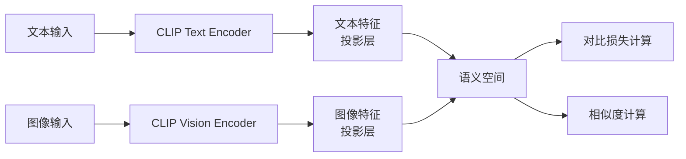

**图表来源**
- [modeling_clip.py](file://src/transformers/models/clip/modeling_clip.py#L800-L900)

### ALIGN模型架构

ALIGN模型在CLIP基础上引入了更复杂的视觉编码器，采用EfficientNet架构：

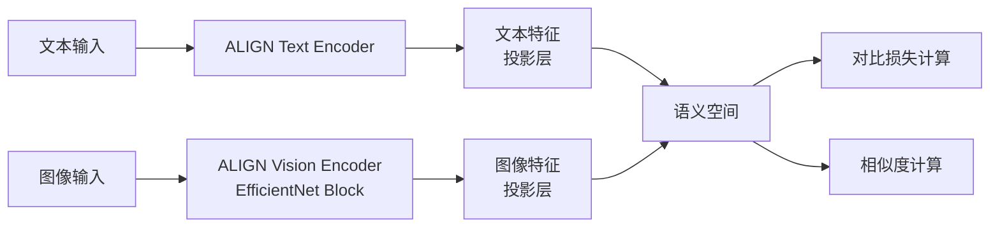

**图表来源**
- [modeling_align.py](file://src/transformers/models/align/modeling_align.py#L400-L500)

### GroupViT模型架构

GroupViT引入了分组注意力机制，实现了更精细的视觉理解：

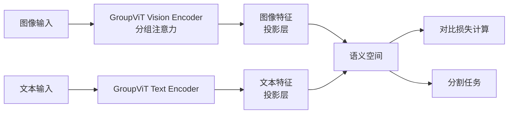

**图表来源**
- [modeling_groupvit.py](file://src/transformers/models/groupvit/modeling_groupvit.py#L600-L700)

### X-CLIP模型架构

X-CLIP扩展了CLIP的能力，支持视频和多帧图像的处理：

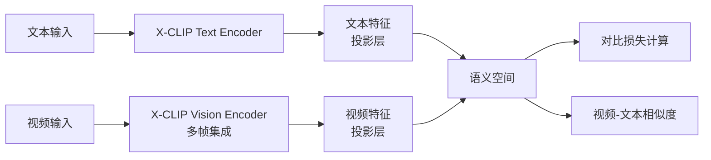

**图表来源**
- [modeling_x_clip.py](file://src/transformers/models/x_clip/modeling_x_clip.py#L600-L700)

## 详细组件分析

### CLIP模型详细分析

#### 文本编码器实现

CLIP的文本编码器基于Transformer架构，具有以下特点：

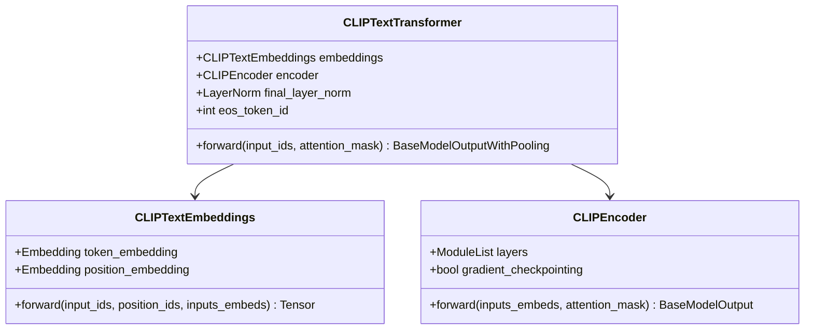

**图表来源**
- [modeling_clip.py](file://src/transformers/models/clip/modeling_clip.py#L600-L700)

#### 视觉编码器实现

CLIP的视觉编码器采用Vision Transformer架构：

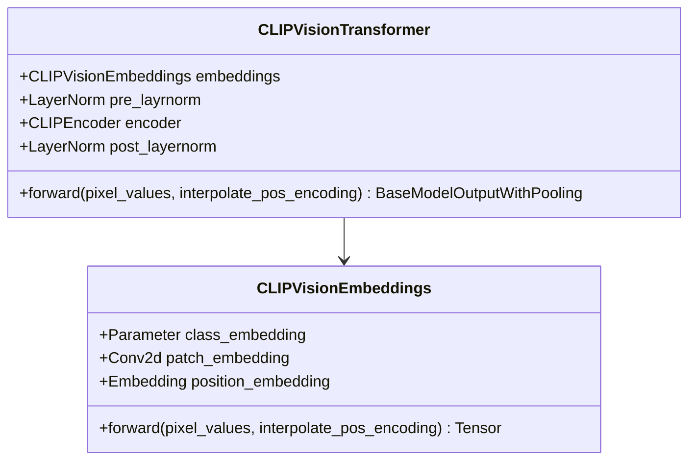

**图表来源**
- [modeling_clip.py](file://src/transformers/models/clip/modeling_clip.py#L700-L800)

#### 对比损失函数

CLIP使用对比损失函数来训练模型：

```mermaid
flowchart TD
A[文本特征] --> C[相似度矩阵计算]
B[图像特征] --> C
C --> D[文本-图像相似度]
C --> E[图像-文本相似度]
D --> F[交叉熵损失计算]
E --> F
F --> G[总损失 = (caption_loss + image_loss) / 2]
```

**图表来源**
- [modeling_clip.py](file://src/transformers/models/clip/modeling_clip.py#L40-L50)

**章节来源**
- [modeling_clip.py](file://src/transformers/models/clip/modeling_clip.py#L40-L100)

### ALIGN模型详细分析

#### EfficientNet视觉编码器

ALIGN模型使用改进的EfficientNet架构作为视觉编码器：

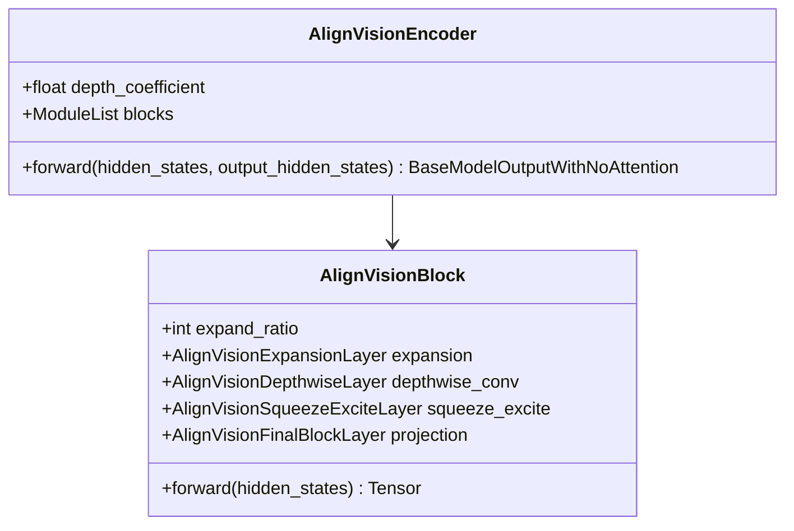

**图表来源**
- [modeling_align.py](file://src/transformers/models/align/modeling_align.py#L300-L400)

#### 自定义注意力机制

ALIGN实现了专门针对视觉任务优化的注意力机制：

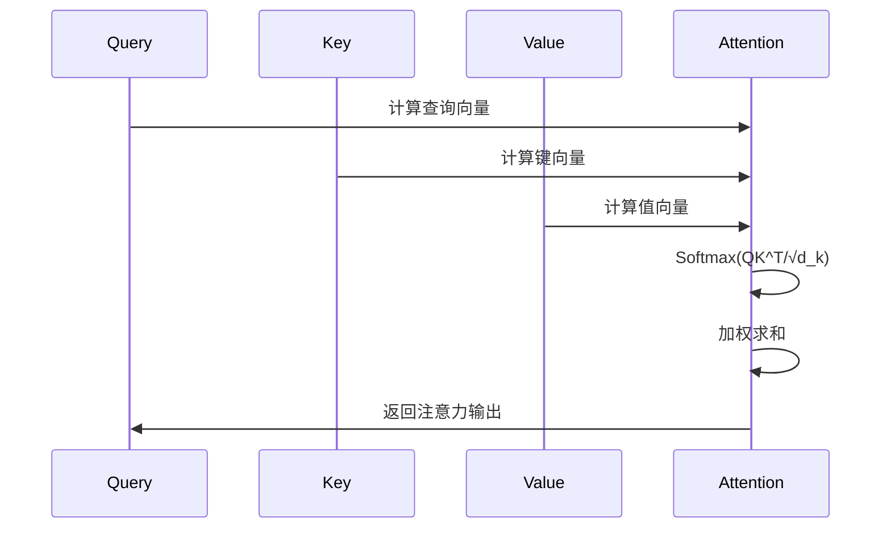

**图表来源**
- [modeling_align.py](file://src/transformers/models/align/modeling_align.py#L500-L600)

**章节来源**
- [modeling_align.py](file://src/transformers/models/align/modeling_align.py#L300-L500)

### GroupViT模型详细分析

#### 分组注意力机制

GroupViT的核心创新是分组注意力机制：

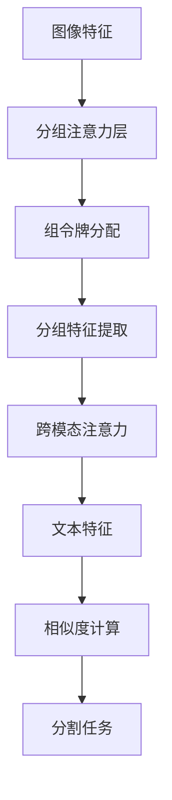

**图表来源**
- [modeling_groupvit.py](file://src/transformers/models/groupvit/modeling_groupvit.py#L200-L300)

#### Token分配机制

GroupViT实现了动态的令牌分配机制：

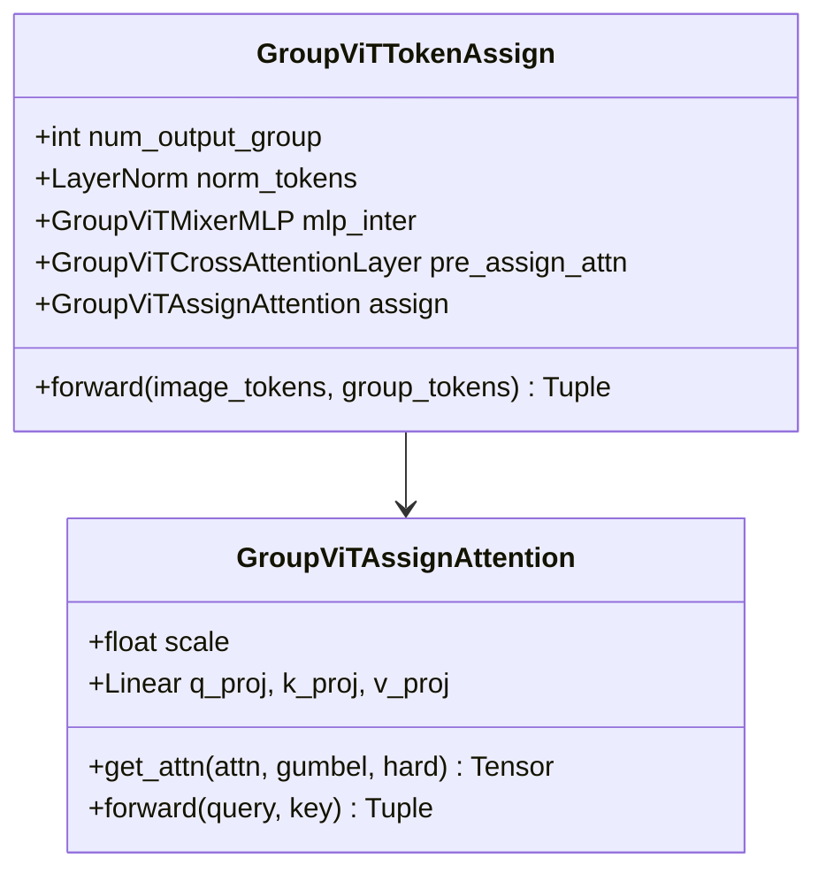

**图表来源**
- [modeling_groupvit.py](file://src/transformers/models/groupvit/modeling_groupvit.py#L150-L250)

**章节来源**
- [modeling_groupvit.py](file://src/transformers/models/groupvit/modeling_groupvit.py#L150-L350)

### X-CLIP模型详细分析

#### 多帧集成机制

X-CLIP专门设计用于处理视频数据：

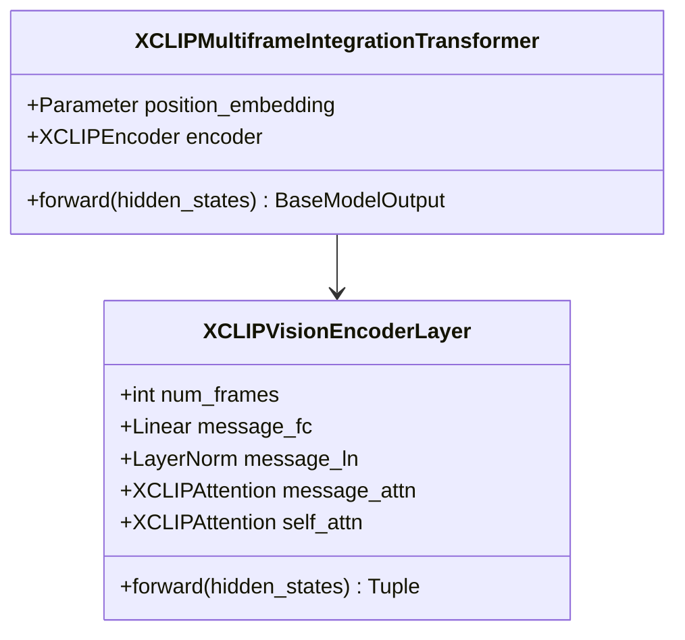

**图表来源**
- [modeling_x_clip.py](file://src/transformers/models/x_clip/modeling_x_clip.py#L900-L1000)

#### 视频编码流程

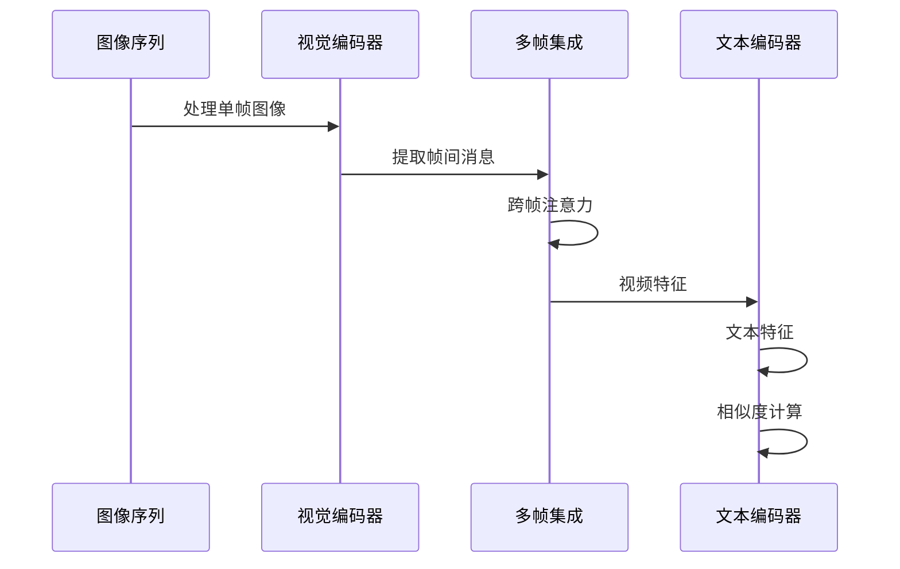

**图表来源**
- [modeling_x_clip.py](file://src/transformers/models/x_clip/modeling_x_clip.py#L700-L800)

**章节来源**
- [modeling_x_clip.py](file://src/transformers/models/x_clip/modeling_x_clip.py#L700-L900)

## 依赖关系分析

### 模型间依赖关系

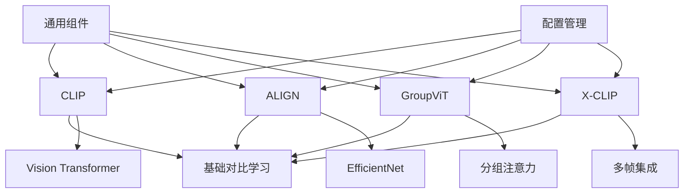

**图表来源**
- [configuration_clip.py](file://src/transformers/models/clip/configuration_clip.py#L1-L50)
- [configuration_groupvit.py](file://src/transformers/models/groupvit/configuration_groupvit.py#L1-L50)
- [configuration_x_clip.py](file://src/transformers/models/x_clip/configuration_x_clip.py#L1-L50)

### 外部依赖

各模型的主要外部依赖包括：

| 组件 | CLIP | ALIGN | GroupViT | X-CLIP |
|------|------|-------|----------|--------|
| PyTorch | ✓ | ✓ | ✓ | ✓ |
| Transformers | ✓ | ✓ | ✓ | ✓ |
| NumPy | ✓ | ✓ | ✓ | ✓ |
| PIL | ✓ | ✓ | ✓ | ✓ |
| Hugging Face Hub | ✓ | ✓ | ✓ | ✓ |

**章节来源**
- [configuration_clip.py](file://src/transformers/models/clip/configuration_clip.py#L1-L100)
- [configuration_groupvit.py](file://src/transformers/models/groupvit/configuration_groupvit.py#L1-L100)
- [configuration_x_clip.py](file://src/transformers/models/x_clip/configuration_x_clip.py#L1-L100)

## 性能考虑

### 计算复杂度

不同模型的计算复杂度对比：

| 模型 | 时间复杂度 | 空间复杂度 | 内存需求 |
|------|------------|------------|----------|
| CLIP | O(N²) | O(N) | 中等 |
| ALIGN | O(N²) | O(N) | 较高 |
| GroupViT | O(N²) | O(N) | 高 |
| X-CLIP | O(N²×F) | O(N×F) | 很高 |

其中N为样本数量，F为视频帧数。

### 推理优化策略

1. **梯度检查点（Gradient Checkpointing）**
2. **混合精度训练（Mixed Precision）**
3. **注意力机制优化**
4. **批处理优化**

### 配置参数影响

关键配置参数对检索效果的影响：

| 参数 | 影响 | 推荐值 |
|------|------|--------|
| hidden_size | 特征维度 | 512-768 |
| num_attention_heads | 注意力头数 | 8-12 |
| learning_rate | 训练稳定性 | 1e-4-5e-4 |
| batch_size | 收敛速度 | 32-128 |

## 故障排除指南

### 常见问题及解决方案

#### 1. 内存不足错误

**症状**：CUDA out of memory
**解决方案**：
- 减少batch_size
- 启用gradient_checkpointing
- 使用混合精度训练

#### 2. 检索性能不佳

**症状**：召回率低，准确率差
**解决方案**：
- 检查数据预处理
- 调整学习率
- 增加训练轮数

#### 3. 模型加载失败

**症状**：无法加载预训练权重
**解决方案**：
- 检查网络连接
- 验证模型名称
- 清理缓存目录

**章节来源**
- [test_modeling_groupvit.py](file://tests/models/groupvit/test_modeling_groupvit.py#L400-L500)
- [test_modeling_x_clip.py](file://tests/models/x_clip/test_modeling_x_clip.py#L500-L600)

## 结论

跨模态检索模型代表了多模态人工智能的重要发展方向。通过CLIP、ALIGN、GroupViT和X-CLIP这四种主要模型，我们可以看到从简单的双塔架构到复杂的分组注意力机制的发展历程。

这些模型在COCO、Flickr30k等标准数据集上都取得了优异的性能，特别是在零样本检索任务中表现出色。不同的模型各有特色：CLIP简单高效，ALIGN引入了更强大的视觉编码器，GroupViT实现了精细的视觉理解，X-CLIP扩展了视频处理能力。

对于实际应用而言，选择合适的模型需要综合考虑计算资源、性能要求和具体应用场景。随着技术的不断发展，跨模态检索模型将在更多领域发挥重要作用，推动人工智能向更加智能和通用的方向发展。