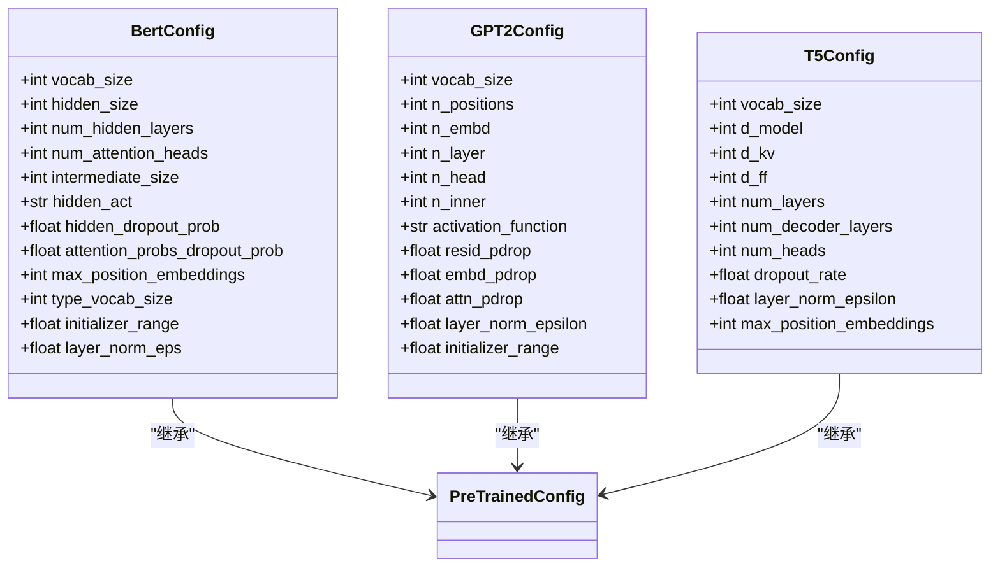
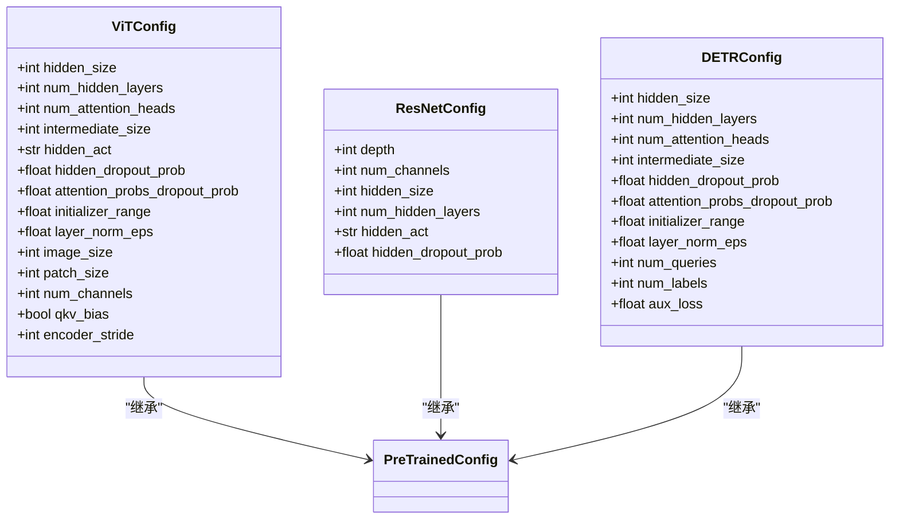
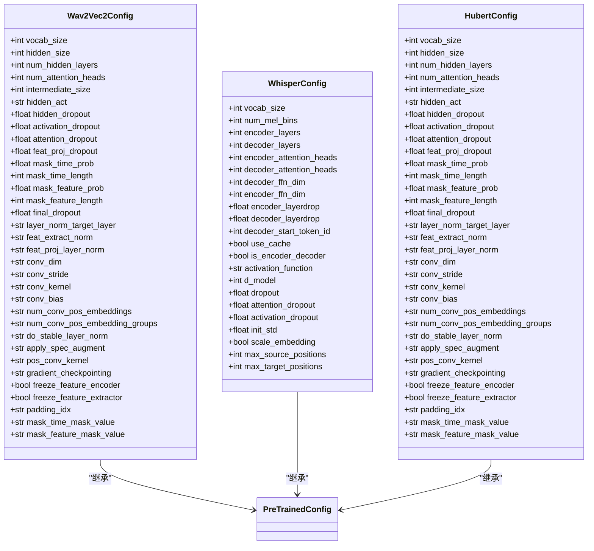
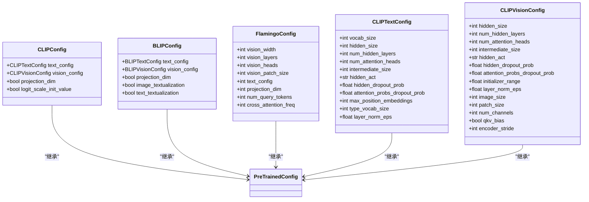
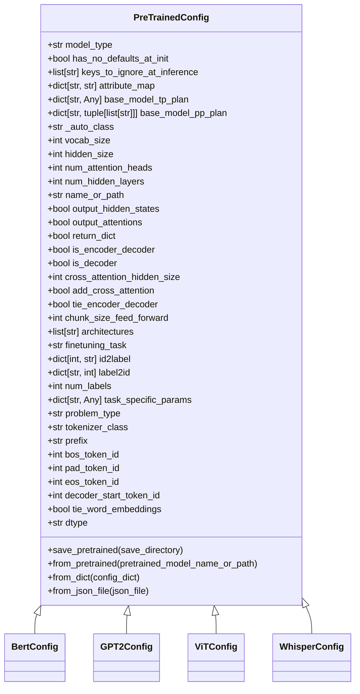
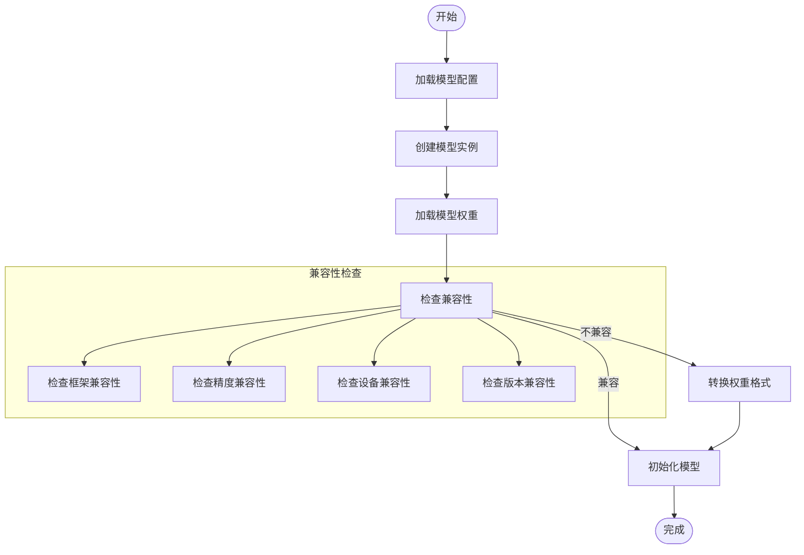

# 模型支持

<cite>
**本文档中引用的文件**  
- [README.md](file://README.md)
- [configuration_utils.py](file://src/transformers/configuration_utils.py)
- [configuration_auto.py](file://src/transformers/models/auto/configuration_auto.py)
- [modeling_auto.py](file://src/transformers/models/auto/modeling_auto.py)
- [configuration_bert.py](file://src/transformers/models/bert/configuration_bert.py)
- [configuration_gpt2.py](file://src/transformers/models/gpt2/configuration_gert2.py)
- [configuration_vit.py](file://src/transformers/models/vit/configuration_vit.py)
- [configuration_whisper.py](file://src/transformers/models/whisper/configuration_whisper.py)
- [__init__.py](file://src/transformers/models/bert/__init__.py)
- [__init__.py](file://src/transformers/models/gpt2/__init__.py)
- [__init__.py](file://src/transformers/models/vit/__init__.py)
- [__init__.py](file://src/transformers/models/whisper/__init__.py)
- [auto.py](file://src/transformers/pipelines/auto.py)
- [text_generation.py](file://src/transformers/pipelines/text_generation.py)
- [image_classification.py](file://src/transformers/pipelines/image_classification.py)
- [automatic_speech_recognition.py](file://src/transformers/pipelines/automatic_speech_recognition.py)
- [visual_question_answering.py](file://src/transformers/pipelines/visual_question_answering.py)
</cite>

## 目录
1. [简介](#简介)
2. [NLP模型](#nlp模型)
3. [计算机视觉模型](#计算机视觉模型)
4. [音频模型](#音频模型)
5. [多模态模型](#多模态模型)
6. [模型配置](#模型配置)
7. [模型权重加载](#模型权重加载)
8. [模型选择指南](#模型选择指南)
9. [模型比较表](#模型比较表)

## 简介
transformers库提供了数千种预训练模型，支持文本、视觉、音频和多模态任务。这些模型可以应用于自然语言处理、计算机视觉、语音识别和多模态理解等任务。库的核心是模型定义框架，它为最先进的机器学习模型提供了统一的接口，支持推理和训练。

transformers库通过`Pipeline` API提供高级推理功能，可以处理文本、音频、视觉和多模态任务。它还支持在PyTorch、JAX和TensorFlow框架之间自由切换，为用户提供灵活的选择。库中包含超过100万个模型检查点，用户可以通过Hugging Face Hub轻松访问和使用这些模型。

**Section sources**
- [README.md](file://README.md#L1-L336)

## NLP模型
transformers库支持多种自然语言处理模型架构，包括BERT、GPT系列、T5等。这些模型在文本分类、信息提取、问答、摘要、翻译和文本生成等任务上表现出色，支持超过100种语言。

BERT（Bidirectional Encoder Representations from Transformers）是一种基于Transformer编码器的双向预训练模型，通过掩码语言建模和下一句预测任务进行预训练。它在GLUE基准测试中取得了突破性成果，成为许多NLP任务的基础模型。

GPT系列模型（包括GPT-2、GPT-3和GPT-4）是基于Transformer解码器的自回归语言模型，通过从左到右的文本生成进行预训练。这些模型在文本生成、对话系统和代码生成等任务中表现出色。

T5（Text-to-Text Transfer Transformer）将所有NLP任务统一为文本到文本的转换问题，通过将输入和输出都表示为文本序列来实现。这种统一的框架使得模型可以轻松适应各种NLP任务。

**Diagram sources**
- [configuration_bert.py](file://src/transformers/models/bert/configuration_bert.py#L1-L126)
- [configuration_gpt2.py](file://src/transformers/models/gpt2/configuration_gpt2.py#L1-L187)
- [configuration_auto.py](file://src/transformers/models/auto/configuration_auto.py#L1-L200)

**Section sources**
- [README.md](file://README.md#L1-L336)
- [configuration_bert.py](file://src/transformers/models/bert/configuration_bert.py#L1-L126)
- [configuration_gpt2.py](file://src/transformers/models/gpt2/configuration_gpt2.py#L1-L187)

## 计算机视觉模型
transformers库支持多种计算机视觉模型架构，包括ViT（Vision Transformer）、ResNet、DETR等。这些模型在图像分类、目标检测、分割和视频分类等任务上表现出色。

ViT（Vision Transformer）将图像分割成固定大小的补丁，然后将这些补丁线性嵌入并作为序列输入到标准的Transformer编码器中。这种方法将计算机视觉任务转化为序列建模问题，取得了与卷积神经网络相当甚至更好的性能。

ResNet（Residual Network）通过引入残差连接解决了深度神经网络中的梯度消失问题，使得网络可以训练得更深。虽然ResNet本身不是基于Transformer的，但transformers库提供了ResNet的实现，可以与其他Transformer模型结合使用。

DETR（DEtection TRansformer）是第一个将目标检测视为集合预测问题的端到端模型，使用Transformer编码器-解码器架构直接预测目标边界框和类别，避免了传统方法中复杂的后处理步骤。

**Diagram sources**
- [configuration_vit.py](file://src/transformers/models/vit/configuration_vit.py#L1-L127)
- [configuration_auto.py](file://src/transformers/models/auto/configuration_auto.py#L1-L200)

**Section sources**
- [README.md](file://README.md#L1-L336)
- [configuration_vit.py](file://src/transformers/models/vit/configuration_vit.py#L1-L127)

## 音频模型
transformers库支持多种音频模型架构，包括Wav2Vec2、Whisper、HuBERT等。这些模型在自动语音识别、音频分类、语音到语音生成和文本到音频等任务上表现出色。

Wav2Vec2是一种自监督学习模型，通过对比学习在大量未标记音频数据上进行预训练，然后在标记数据上进行微调。它将原始音频波形作为输入，通过卷积神经网络提取特征，然后使用Transformer编码器进行上下文表示学习。

Whisper是OpenAI开发的多语言语音识别模型，支持语音识别、语音翻译和语音到文本转换。它在大量多语言和多任务数据上进行训练，具有很强的泛化能力，可以处理口音、背景噪声和技术术语。

HuBERT（Hidden-Unit BERT）是一种自监督语音表示学习方法，通过预测从聚类算法获得的离散语音单元进行预训练。它结合了聚类和Transformer架构的优点，在语音识别任务上取得了优异的性能。

**Diagram sources**
- [configuration_whisper.py](file://src/transformers/models/whisper/configuration_whisper.py#L1-L199)
- [configuration_auto.py](file://src/transformers/models/auto/configuration_auto.py#L1-L200)

**Section sources**
- [README.md](file://README.md#L1-L336)
- [configuration_whisper.py](file://src/transformers/models/whisper/configuration_whisper.py#L1-L199)

## 多模态模型
transformers库支持多种多模态模型架构，包括CLIP、BLIP、Flamingo等。这些模型能够处理文本、图像、音频等多种模态的组合任务，如视觉问答、图文生成、文档理解等。

CLIP（Contrastive Language-Image Pre-training）通过对比学习在大量图像-文本对上进行预训练，学习图像和文本的联合表示。它将图像和文本分别编码为向量，然后通过余弦相似度计算它们的匹配程度，在零样本图像分类等任务上表现出色。

BLIP（Bootstrapping Language-Image Pre-training）是一种统一的视觉语言预训练框架，通过图像-文本生成和图像-文本检索两个任务进行预训练。它能够处理多种视觉语言任务，如图像描述、视觉问答和图文检索。

Flamingo是一种大型多模态模型，能够处理交错的文本和图像序列，支持复杂的视觉语言任务。它通过门控交叉注意力机制将视觉信息注入语言模型，在少样本学习任务上表现出色。

**Diagram sources**
- [configuration_auto.py](file://src/transformers/models/auto/configuration_auto.py#L1-L200)

**Section sources**
- [README.md](file://README.md#L1-L336)

## 模型配置
transformers库中的每个模型都有一个对应的配置类，继承自`PreTrainedConfig`。这些配置类定义了模型的架构参数，如隐藏层大小、注意力头数、层数等。配置文件可以保存为JSON格式，便于共享和复现。

模型配置的主要参数包括：
- **vocab_size**: 词汇表大小，定义了模型可以表示的不同token数量
- **hidden_size**: 编码器层和池化层的维度
- **num_hidden_layers**: Transformer编码器中的隐藏层数量
- **num_attention_heads**: 每个注意力层的注意力头数量
- **intermediate_size**: 前馈网络层的维度
- **hidden_act**: 编码器和池化层中的非线性激活函数
- **hidden_dropout_prob**: 嵌入层、编码器和池化层中全连接层的dropout概率
- **max_position_embeddings**: 模型可能使用的最大序列长度

配置文件可以通过`from_pretrained`方法从预训练模型加载，也可以通过`save_pretrained`方法保存。用户可以修改配置参数来定制模型架构，然后使用`from_config`方法实例化模型。

**Diagram sources**
- [configuration_utils.py](file://src/transformers/configuration_utils.py#L1-L799)
- [configuration_bert.py](file://src/transformers/models/bert/configuration_bert.py#L1-L126)
- [configuration_gpt2.py](file://src/transformers/models/gpt2/configuration_gpt2.py#L1-L187)
- [configuration_vit.py](file://src/transformers/models/vit/configuration_vit.py#L1-L127)
- [configuration_whisper.py](file://src/transformers/models/whisper/configuration_whisper.py#L1-L199)

**Section sources**
- [configuration_utils.py](file://src/transformers/configuration_utils.py#L1-L799)
- [configuration_bert.py](file://src/transformers/models/bert/configuration_bert.py#L1-L126)
- [configuration_gpt2.py](file://src/transformers/models/gpt2/configuration_gpt2.py#L1-L187)
- [configuration_vit.py](file://src/transformers/models/vit/configuration_vit.py#L1-L127)
- [configuration_whisper.py](file://src/transformers/models/whisper/configuration_whisper.py#L1-L199)

## 模型权重加载
transformers库提供了灵活的模型权重加载机制，支持从本地文件或远程Hub加载预训练模型。权重加载过程包括配置加载、模型实例化和权重初始化三个步骤。

模型权重的加载兼容性考虑包括：
- **框架兼容性**: 支持在PyTorch、JAX和TensorFlow之间转换模型权重
- **精度兼容性**: 支持不同精度的权重加载，如float32、float16和bfloat16
- **设备兼容性**: 支持在CPU和GPU之间迁移模型
- **版本兼容性**: 支持不同版本的模型权重加载

权重加载过程通过`from_pretrained`方法实现，该方法会自动处理配置文件和权重文件的下载和加载。用户可以通过`device_map`参数指定模型在多设备上的分布，通过`torch_dtype`参数指定权重的精度。

**Diagram sources**
- [configuration_utils.py](file://src/transformers/configuration_utils.py#L1-L799)
- [trainer_utils.py](file://src/transformers/trainer_utils.py#L920-L956)

**Section sources**
- [configuration_utils.py](file://src/transformers/configuration_utils.py#L1-L799)
- [trainer_utils.py](file://src/transformers/trainer_utils.py#L920-L956)

## 模型选择指南
对于初学者，建议从以下模型开始：
- **文本任务**: 使用BERT进行文本分类，使用GPT-2进行文本生成
- **图像任务**: 使用ViT进行图像分类，使用DETR进行目标检测
- **音频任务**: 使用Wav2Vec2进行语音识别，使用Whisper进行多语言语音识别
- **多模态任务**: 使用CLIP进行零样本图像分类，使用BLIP进行视觉问答

对于高级用户，可以根据具体需求选择更专业的模型：
- **大规模语言模型**: Llama、GPT-3、PaLM等
- **高效模型**: DistilBERT、MobileBERT等
- **多语言模型**: mBERT、XLM-R等
- **特定领域模型**: BioBERT（生物医学）、LegalBERT（法律）等

选择模型时需要考虑以下因素：
- **任务类型**: 分类、生成、翻译等
- **数据规模**: 小数据集适合微调，大数据集适合预训练
- **计算资源**: 大模型需要更多GPU内存和计算时间
- **延迟要求**: 实时应用需要低延迟模型
- **精度要求**: 高精度任务需要更大更复杂的模型

**Section sources**
- [README.md](file://README.md#L1-L336)

## 模型比较表
以下表格比较了transformers库中主要模型架构的特点：

| 模型类型 | 代表模型 | 适用场景 | 参数量级 | 训练数据 | 主要特点 |
|---------|--------|--------|--------|--------|--------|
| **NLP模型** | BERT | 文本分类、问答、命名实体识别 | 1亿-3亿 | 文本语料库 | 双向编码，适合理解任务 |
| | GPT-2/3 | 文本生成、对话系统 | 数亿-数千亿 | 互联网文本 | 自回归生成，适合创作任务 |
| | T5 | 文本到文本转换 | 数亿-数千亿 | 多任务数据集 | 统一框架，适合多种NLP任务 |
| **计算机视觉模型** | ViT | 图像分类、目标检测 | 数千万-数亿 | 图像数据集 | 纯Transformer架构，全局注意力 |
| | DETR | 目标检测、实例分割 | 数千万-数亿 | 标注图像数据集 | 端到端检测，无需NMS后处理 |
| | SAM | 零样本分割 | 数亿 | 大规模分割数据集 | 提示驱动，通用分割能力 |
| **音频模型** | Wav2Vec2 | 语音识别、语音分类 | 数千万-数亿 | 音频数据集 | 自监督学习，少量标注数据即可微调 |
| | Whisper | 多语言语音识别、语音翻译 | 数亿-数十亿 | 多语言音频数据集 | 多语言支持，强鲁棒性 |
| | HuBERT | 语音表示学习 | 数千万-数亿 | 未标注音频数据集 | 离散语音单元预测，高效表示 |
| **多模态模型** | CLIP | 零样本图像分类、图文检索 | 数亿 | 图像-文本对数据集 | 对比学习，跨模态对齐 |
| | BLIP | 视觉问答、图像描述 | 数亿 | 图像-文本对数据集 | 统一框架，生成和理解能力 |
| | Flamingo | 复杂视觉语言任务 | 数百亿 | 交错图文数据集 | 少样本学习，强大推理能力 |

**Section sources**
- [README.md](file://README.md#L1-L336)