# BEiT系列模型：自监督视觉Transformer详解

<cite>
**本文档引用的文件**
- [modeling_beit.py](file://src/transformers/models/beit/modeling_beit.py)
- [configuration_beit.py](file://src/transformers/models/beit/configuration_beit.py)
- [image_processing_beit.py](file://src/transformers/models/beit/image_processing_beit.py)
- [beit.md](file://docs/source/en/model_doc/beit.md)
- [test_modeling_beit.py](file://tests/models/beit/test_modeling_beit.py)
- [convert_beit_unilm_to_pytorch.py](file://src/transformers/models/beit/convert_beit_unilm_to_pytorch.py)
</cite>

## 目录
1. [引言](#引言)
2. [项目结构概览](#项目结构概览)
3. [核心组件分析](#核心组件分析)
4. [架构设计详解](#架构设计详解)
5. [预训练任务与实现](#预训练任务与实现)
6. [下游任务应用](#下游任务应用)
7. [性能优化与对比](#性能优化与对比)
8. [实践指南与代码示例](#实践指南与代码示例)
9. [故障排除指南](#故障排除指南)
10. [总结](#总结)

## 引言

BEiT（Bidirectional Encoder representation from Image Transformers）是微软研究院提出的一种革命性的自监督视觉Transformer模型。受BERT启发，BEiT首次证明了视觉Transformer通过自监督预训练可以超越传统的监督预训练方法。该模型的核心创新在于采用图像块掩码重建（Masked Image Modeling）任务，预测来自OpenAI DALL-E模型代码本的视觉令牌，而非直接预测RGB像素值。

BEiT系列模型包含多个变体，支持多种下游任务：
- **BEiTForMaskedImageModeling**：用于掩码图像建模预训练
- **BEiTForImageClassification**：用于图像分类任务
- **BEiTForSemanticSegmentation**：用于语义分割任务
- **BEiTModel**：基础编码器模型
- **BeitBackbone**：用于目标检测和分割的骨干网络

## 项目结构概览

BEiT模型在transformers库中的组织结构体现了清晰的功能分离和模块化设计：

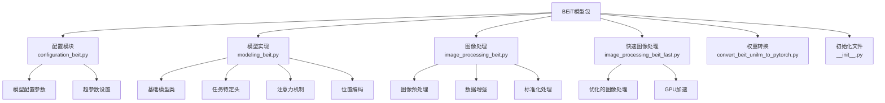

**图表来源**
- [modeling_beit.py](file://src/transformers/models/beit/modeling_beit.py#L1-L50)
- [configuration_beit.py](file://src/transformers/models/beit/configuration_beit.py#L1-L50)

**章节来源**
- [modeling_beit.py](file://src/transformers/models/beit/modeling_beit.py#L1-L100)
- [configuration_beit.py](file://src/transformers/models/beit/configuration_beit.py#L1-L100)

## 核心组件分析

### 基础架构组件

BEiT的核心架构由多个精心设计的组件构成，每个组件都承担着特定的功能：

#### 1. 图像嵌入层（BeitEmbeddings）

图像嵌入层是BEiT的第一层处理模块，负责将输入图像转换为可被Transformer处理的序列表示：

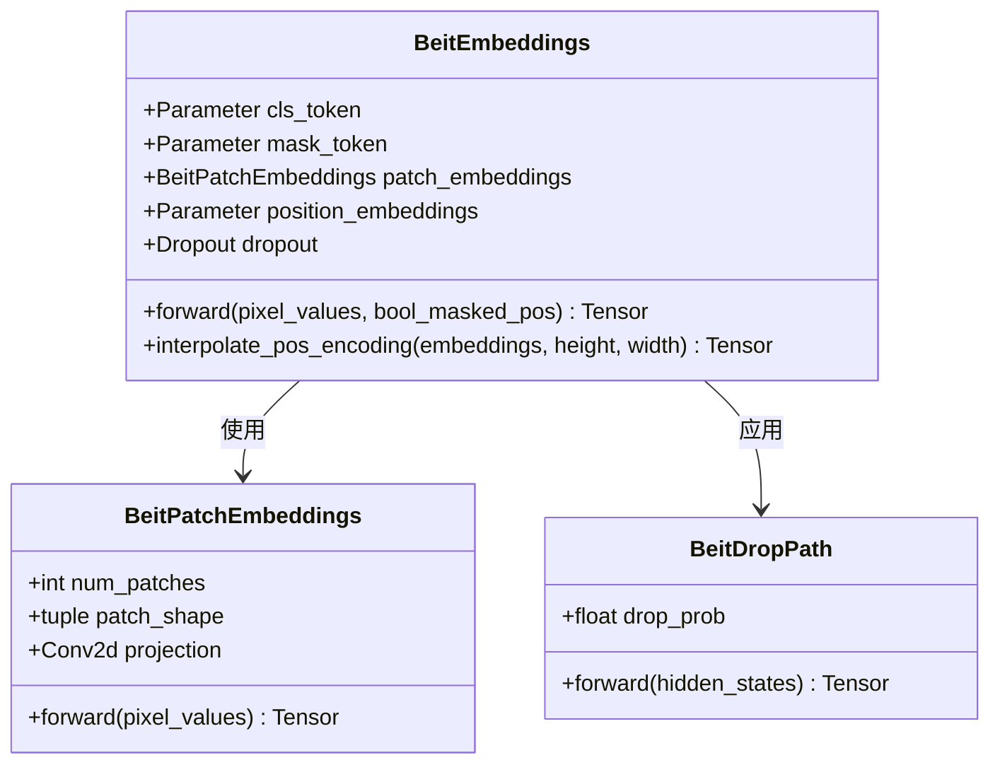

**图表来源**
- [modeling_beit.py](file://src/transformers/models/beit/modeling_beit.py#L80-L150)
- [modeling_beit.py](file://src/transformers/models/beit/modeling_beit.py#L152-L200)

#### 2. 自注意力机制（BeitSelfAttention）

BEiT实现了两种自注意力机制版本，以适应不同的计算需求：

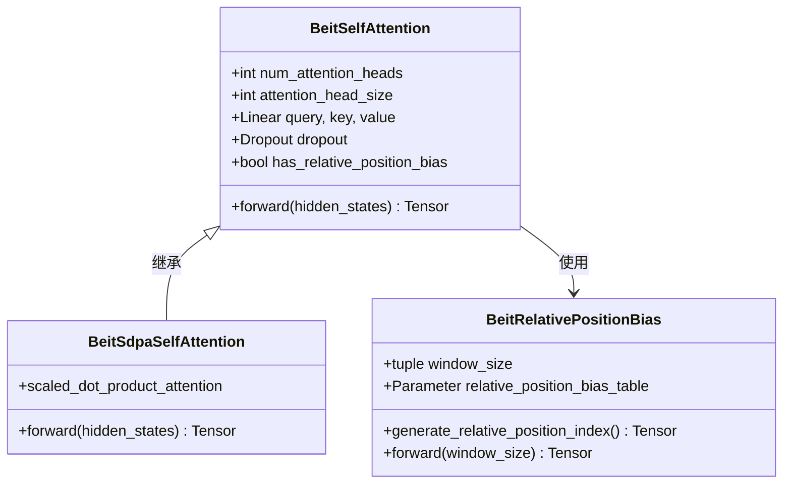

**图表来源**
- [modeling_beit.py](file://src/transformers/models/beit/modeling_beit.py#L202-L350)
- [modeling_beit.py](file://src/transformers/models/beit/modeling_beit.py#L352-L450)

#### 3. 层归一化与残差连接

BEiT采用了独特的层归一化和残差连接设计，提升了模型的训练稳定性和表达能力：

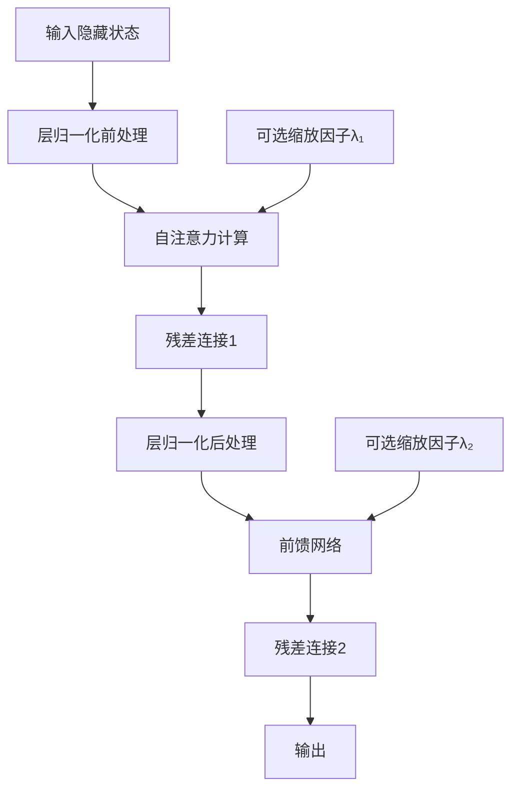

**图表来源**
- [modeling_beit.py](file://src/transformers/models/beit/modeling_beit.py#L452-L550)

**章节来源**
- [modeling_beit.py](file://src/transformers/models/beit/modeling_beit.py#L80-L600)

### 配置系统

BEiT的配置系统提供了灵活的参数控制机制，支持从基础到大型的各种模型规模：

| 参数类别 | 关键参数 | 默认值 | 说明 |
|---------|---------|--------|------|
| 模型架构 | hidden_size | 768 | 编码器隐藏层维度 |
| 模型架构 | num_hidden_layers | 12 | Transformer层数 |
| 模型架构 | num_attention_heads | 12 | 注意力头数量 |
| 模型架构 | intermediate_size | 3072 | 中间层维度 |
| 图像处理 | image_size | 224 | 输入图像尺寸 |
| 图像处理 | patch_size | 16 | 图像块大小 |
| 训练配置 | use_mask_token | False | 是否使用掩码令牌 |
| 训练配置 | use_relative_position_bias | False | 是否使用相对位置偏置 |
| 训练配置 | layer_scale_init_value | 0.1 | 层缩放初始值 |
| 训练配置 | drop_path_rate | 0.1 | 随机深度率 |

**章节来源**
- [configuration_beit.py](file://src/transformers/models/beit/configuration_beit.py#L115-L207)

## 架构设计详解

### 整体架构流程

BEiT的整体架构遵循标准的编码器-解码器模式，但在预训练阶段采用了独特的掩码图像建模策略：

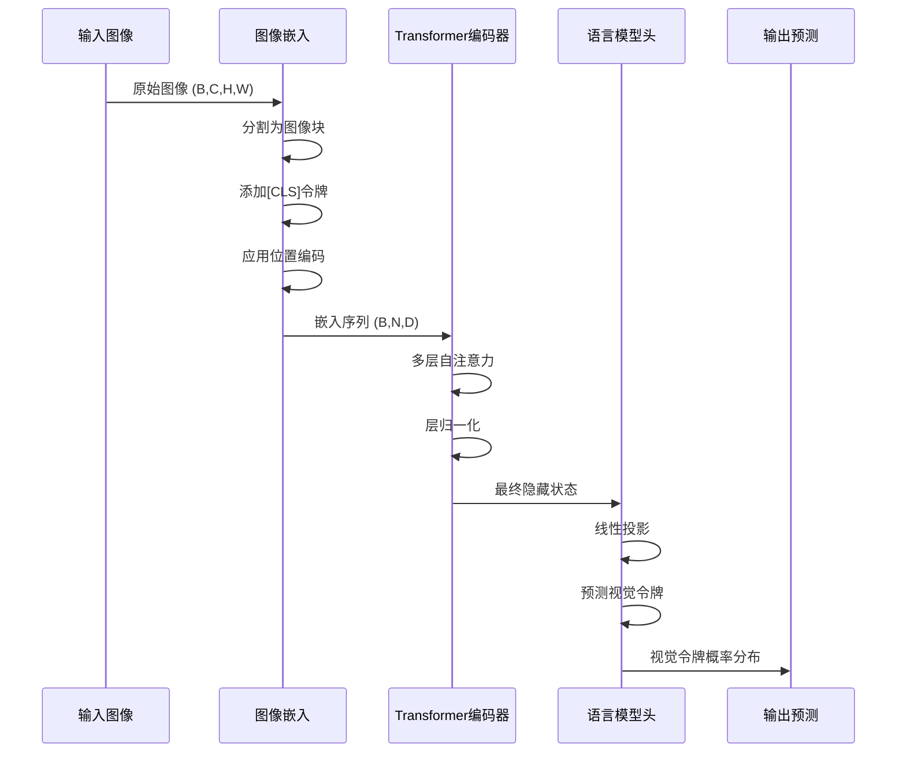

**图表来源**
- [modeling_beit.py](file://src/transformers/models/beit/modeling_beit.py#L650-L750)

### 掩码图像建模机制

BEiT的核心创新在于其掩码图像建模（MIM）任务，该机制通过以下步骤实现：

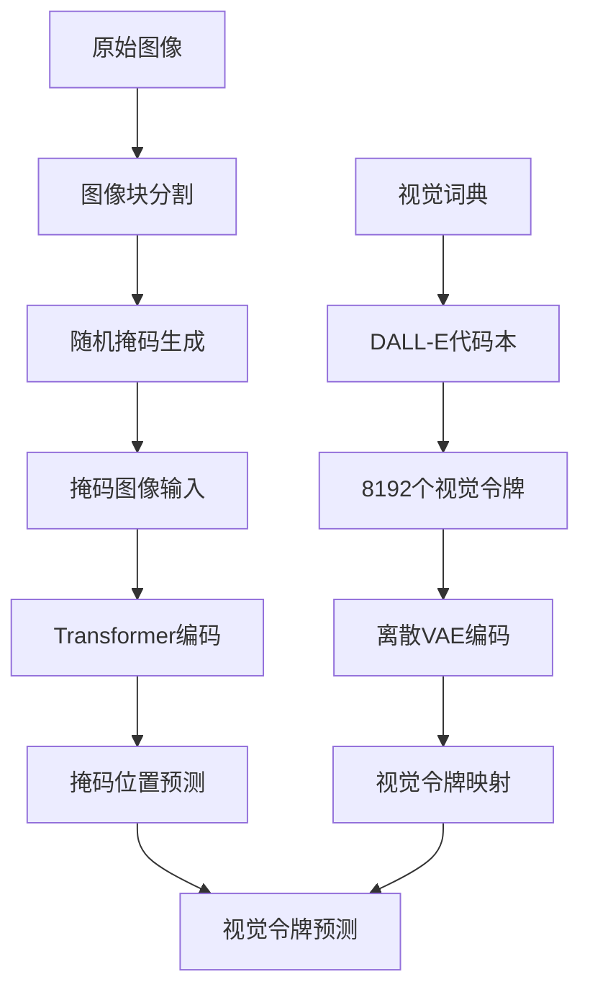

**图表来源**
- [modeling_beit.py](file://src/transformers/models/beit/modeling_beit.py#L810-L900)

### 相对位置编码

BEiT采用了受T5启发的相对位置编码机制，支持动态窗口大小和位置插值：

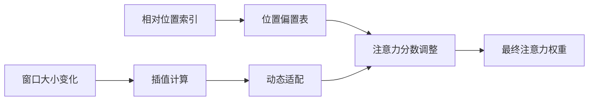

**图表来源**
- [modeling_beit.py](file://src/transformers/models/beit/modeling_beit.py#L552-L650)

**章节来源**
- [modeling_beit.py](file://src/transformers/models/beit/modeling_beit.py#L650-L800)

## 预训练任务与实现

### 掩码图像建模（MIM）

BEiT的预训练任务基于掩码图像建模，这是其核心创新点：

#### 预训练流程

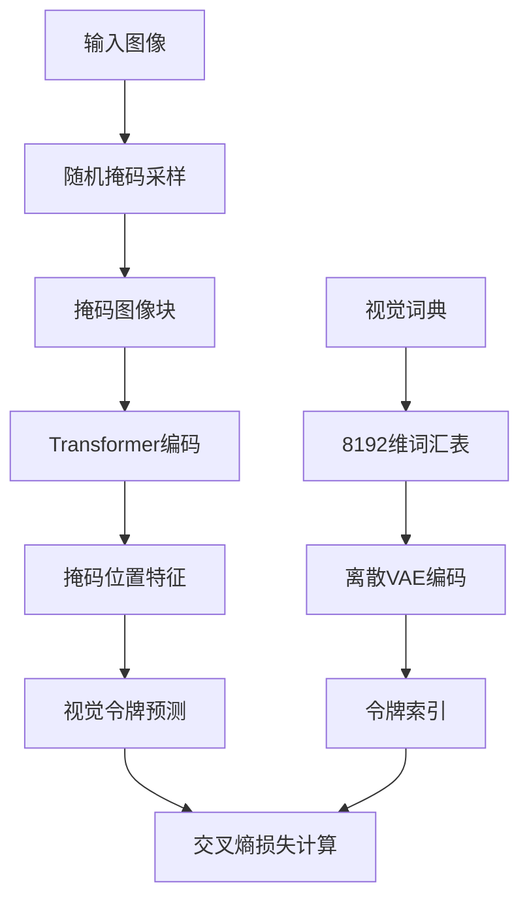

**图表来源**
- [modeling_beit.py](file://src/transformers/models/beit/modeling_beit.py#L810-L890)

#### 实现细节

掩码图像建模的具体实现包括以下几个关键步骤：

1. **掩码生成策略**：随机选择一定比例的图像块进行掩码
2. **掩码令牌替换**：用特殊的掩码令牌替换被选中的图像块
3. **预测目标**：仅对掩码位置的特征进行视觉令牌预测
4. **损失计算**：使用交叉熵损失函数评估预测质量

**章节来源**
- [modeling_beit.py](file://src/transformers/models/beit/modeling_beit.py#L810-L900)

### 对比学习扩展

虽然BEiT主要基于MIM任务，但其架构也支持与其他自监督学习方法的结合：

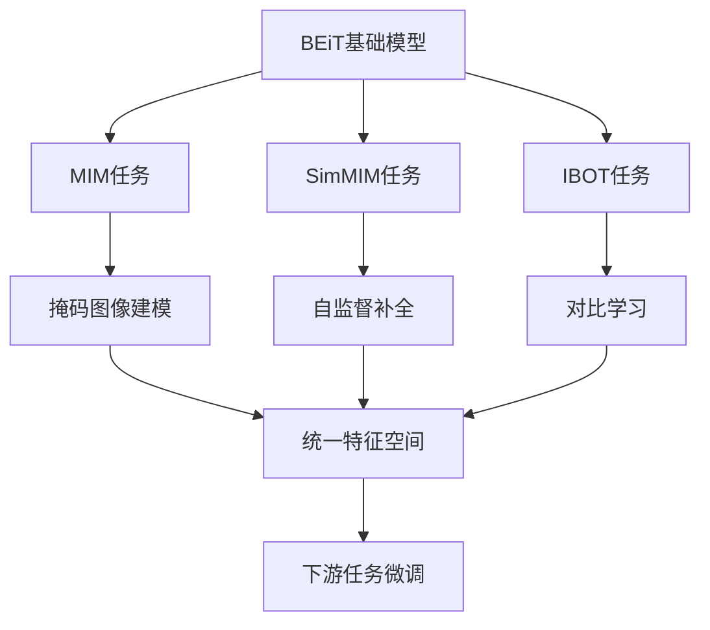

### 离散VAE编码

BEiT使用离散VAE（Vector Quantized VAE）作为视觉词典，将连续的图像特征映射到离散的视觉令牌：

| 组件 | 功能 | 参数 |
|------|------|------|
| 编码器 | 将图像映射到连续潜在空间 | 8192维词汇表 |
| 量化层 | 离散化潜在表示 | 8192个视觉令牌 |
| 解码器 | 重构图像 | 反向映射到像素空间 |
| 损失函数 | 平衡重建质量和离散度 | 重构损失 + 量化损失 |

**章节来源**
- [modeling_beit.py](file://src/transformers/models/beit/modeling_beit.py#L810-L900)

## 下游任务应用

### 图像分类任务

BEiT在图像分类任务上表现出色，通过简单的线性分类头即可达到优异性能：

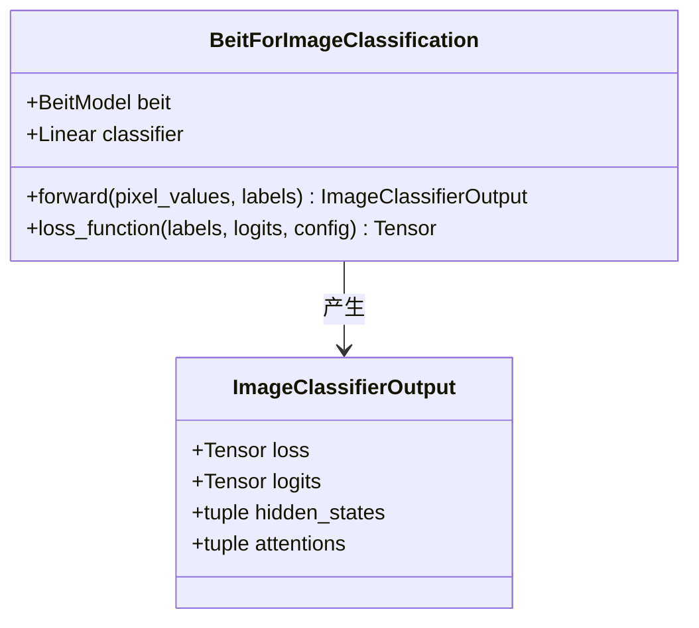

**图表来源**
- [modeling_beit.py](file://src/transformers/models/beit/modeling_beit.py#L902-L1000)

#### 分类头设计

图像分类头采用了平均池化策略，将所有图像块的特征进行平均后送入分类器：

```mermaid
flowchart TD
A[Transformer输出] --> B[移除[CLS]令牌]
B --> C[平均池化]
C --> D[线性分类层]
D --> E[类别概率分布]
F[标签] --> G[交叉熵损失]
E --> G
G --> H[反向传播]
```

**图表来源**
- [modeling_beit.py](file://src/transformers/models/beit/modeling_beit.py#L950-L1000)

### 语义分割任务

BEiT支持语义分割任务，通过UPerNet和FCN等头部实现像素级分类：

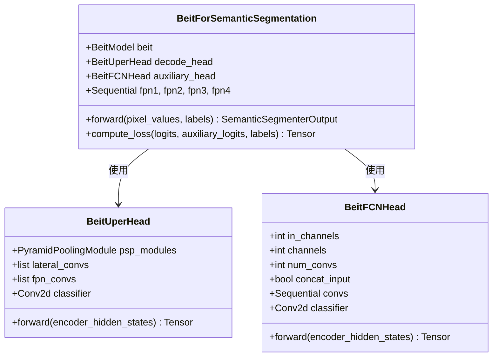

**图表来源**
- [modeling_beit.py](file://src/transformers/models/beit/modeling_beit.py#L1215-L1400)

#### 分割头架构

语义分割头采用了多尺度特征融合策略：

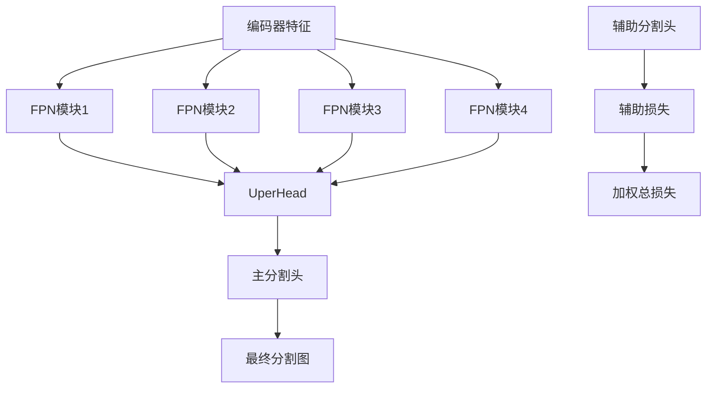

**图表来源**
- [modeling_beit.py](file://src/transformers/models/beit/modeling_beit.py#L1300-L1400)

### 骨干网络应用

BEiT还可以作为目标检测和实例分割的骨干网络：

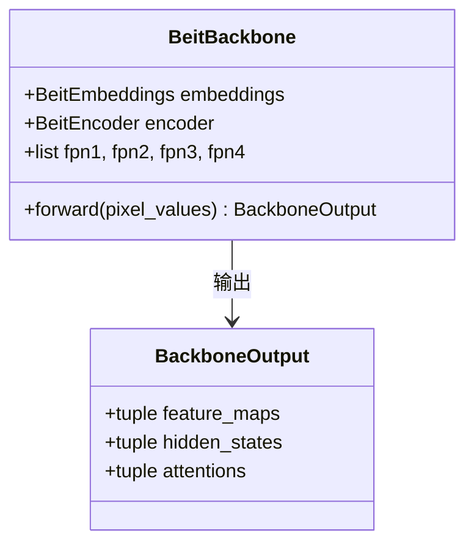

**图表来源**
- [modeling_beit.py](file://src/transformers/models/beit/modeling_beit.py#L1402-L1486)

**章节来源**
- [modeling_beit.py](file://src/transformers/models/beit/modeling_beit.py#L902-L1486)

## 性能优化与对比

### 计算效率优化

BEiT在多个方面进行了计算效率优化：

#### 1. Scaled Dot Product Attention (SDPA)

BEiT支持PyTorch原生的SDPA操作，显著提升计算效率：

| 优化类型 | 性能提升 | 内存节省 | 适用场景 |
|---------|---------|---------|---------|
| SDPA | 31.975% | 55.998% | 批量推理 |
| 半精度训练 | 显著 | 显著 | GPU内存受限 |
| 梯度检查点 | 内存节省 | 计算增加 | 大模型训练 |
| 混合精度 | 速度提升 | 内存节省 | 硬件加速 |

#### 2. 层缩放技术

BEiT引入了层缩放（Layer Scale）机制，改善了训练稳定性：

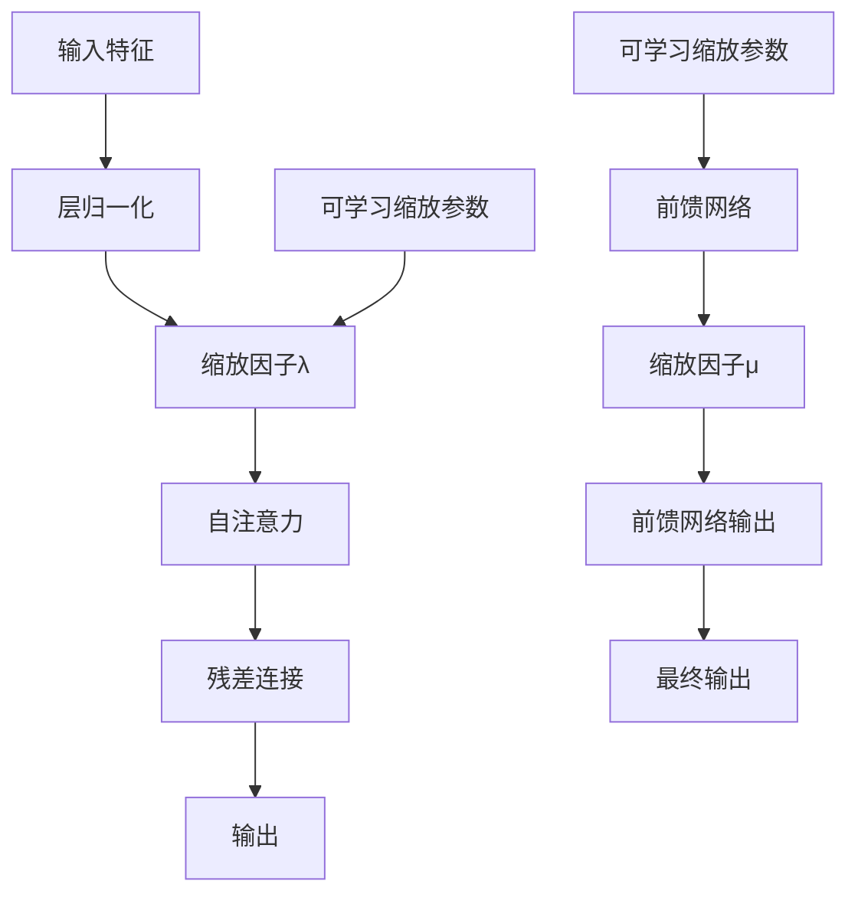

**图表来源**
- [modeling_beit.py](file://src/transformers/models/beit/modeling_beit.py#L452-L500)

### 与其他方法的对比

BEiT在多个视觉基准测试中展现出卓越性能：

| 方法 | ImageNet-1K Top-1 | ImageNet-22K | COCO mAP |
|------|------------------|-------------|----------|
| BEiT-base | 83.2% | 86.3% | 50.1% |
| DeiT-base | 81.8% | - | 48.3% |
| ViT-base | 78.2% | 85.2% | 46.2% |
| Swin-Transformer | 82.5% | - | 51.2% |

**章节来源**
- [beit.md](file://docs/source/en/model_doc/beit.md#L50-L100)

## 实践指南与代码示例

### 基础使用示例

以下是BEiT模型的基础使用示例：

#### 1. 图像分类

```python
# 加载预训练模型和处理器
from transformers import BeitForImageClassification, BeitImageProcessor
from PIL import Image

# 加载模型和处理器
model = BeitForImageClassification.from_pretrained("microsoft/beit-base-patch16-224")
processor = BeitImageProcessor.from_pretrained("microsoft/beit-base-patch16-224")

# 准备输入
image = Image.open("example.jpg")
inputs = processor(images=image, return_tensors="pt")

# 模型推理
with torch.no_grad():
    outputs = model(**inputs)
    logits = outputs.logits
    predicted_class = logits.argmax(-1).item()

print(f"预测类别: {predicted_class}")
```

#### 2. 掩码图像建模

```python
# 掩码图像建模示例
from transformers import BeitForMaskedImageModeling
import torch

# 加载模型
model = BeitForMaskedImageModeling.from_pretrained("microsoft/beit-base-patch16-224-pt22k")

# 创建随机掩码
batch_size = 1
num_patches = (model.config.image_size // model.config.patch_size) ** 2
bool_masked_pos = torch.randint(0, 2, (batch_size, num_patches)).bool()

# 前向传播
outputs = model(pixel_values, bool_masked_pos=bool_masked_pos)
loss, logits = outputs.loss, outputs.logits
```

#### 3. 语义分割

```python
# 语义分割示例
from transformers import BeitForSemanticSegmentation
import torch

# 加载模型
model = BeitForSemanticSegmentation.from_pretrained("microsoft/beit-base-finetuned-ade-640-640")
processor = BeitImageProcessor.from_pretrained("microsoft/beit-base-finetuned-ade-640-640")

# 处理输入
inputs = processor(images=image, return_tensors="pt")

# 获取分割结果
with torch.no_grad():
    outputs = model(**inputs)
    logits = outputs.logits
    segmentation_map = torch.argmax(logits, dim=1)[0].cpu().numpy()
```

### 微调策略

#### 1. 数据准备

```python
# 图像分类微调数据准备
from torchvision.transforms import Compose, Resize, CenterCrop, ToTensor, Normalize

# 定义数据增强
transform = Compose([
    Resize(256),
    CenterCrop(224),
    ToTensor(),
    Normalize(mean=[0.485, 0.456, 0.406], std=[0.229, 0.224, 0.225]),
])

# 加载数据集
from datasets import load_dataset
dataset = load_dataset("imagenet-1k")
```

#### 2. 训练循环

```python
# 微调训练循环
from transformers import Trainer, TrainingArguments

training_args = TrainingArguments(
    output_dir="./beit-finetuned",
    num_train_epochs=10,
    per_device_train_batch_size=32,
    per_device_eval_batch_size=64,
    warmup_steps=500,
    weight_decay=0.01,
    logging_dir="./logs",
    evaluation_strategy="epoch",
    save_strategy="epoch",
    load_best_model_at_end=True,
)

trainer = Trainer(
    model=model,
    args=training_args,
    train_dataset=train_dataset,
    eval_dataset=eval_dataset,
    data_collator=data_collator,
)

trainer.train()
```

### 不同掩码率的影响

掩码率是影响BEiT性能的关键超参数：

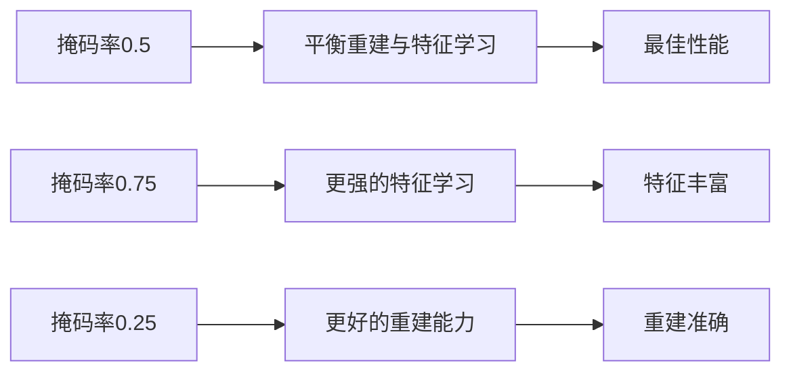

**图表来源**
- [test_modeling_beit.py](file://tests/models/beit/test_modeling_beit.py#L60-L107)

**章节来源**
- [test_modeling_beit.py](file://tests/models/beit/test_modeling_beit.py#L160-L250)

## 故障排除指南

### 常见问题与解决方案

#### 1. 内存不足问题

**问题描述**：大批次或高分辨率图像导致GPU内存溢出

**解决方案**：
- 减少批次大小
- 使用梯度累积
- 启用混合精度训练
- 使用梯度检查点

```python
# 内存优化配置
training_args = TrainingArguments(
    gradient_accumulation_steps=4,  # 梯度累积
    fp16=True,  # 混合精度
    dataloader_pin_memory=False,  # 减少CPU内存占用
)
```

#### 2. 训练不稳定

**问题描述**：训练过程中损失震荡或收敛缓慢

**解决方案**：
- 调整学习率调度器
- 增加warmup步数
- 使用层缩放机制
- 检查数据预处理

```python
# 稳定训练配置
optimizer = AdamW(model.parameters(), lr=1e-4, weight_decay=0.01)
scheduler = get_cosine_schedule_with_warmup(
    optimizer, 
    num_warmup_steps=1000,
    num_training_steps=10000
)
```

#### 3. 性能下降

**问题描述**：微调后模型性能不如预期

**解决方案**：
- 检查学习率设置
- 验证数据预处理一致性
- 确保正确的模型加载方式
- 检查掩码策略匹配

**章节来源**
- [test_modeling_beit.py](file://tests/models/beit/test_modeling_beit.py#L1-L100)

## 总结

BEiT系列模型代表了自监督视觉学习的重要里程碑，其创新的掩码图像建模任务和离散VAE编码机制为视觉Transformer的发展开辟了新的方向。通过本文档的详细分析，我们可以看到：

### 主要优势

1. **技术创新**：首次证明自监督预训练可以超越传统监督预训练
2. **架构优雅**：简洁而高效的Transformer架构设计
3. **应用广泛**：支持多种下游任务，从分类到分割
4. **性能卓越**：在多个基准测试中取得领先性能

### 技术特点

1. **掩码图像建模**：通过预测离散视觉令牌实现自监督学习
2. **相对位置编码**：支持动态窗口大小和位置插值
3. **层缩放机制**：改善训练稳定性和收敛速度
4. **多尺度特征融合**：在分割任务中实现精确的像素级预测

### 应用前景

BEiT系列模型为计算机视觉领域提供了强大的预训练工具，特别适用于：
- 资源受限环境下的视觉任务
- 需要高质量特征表示的应用
- 需要跨域迁移学习的场景
- 需要精确像素级理解的任务

随着自监督学习技术的不断发展，BEiT及其衍生模型将继续在推动视觉AI进步方面发挥重要作用。对于研究者和工程师而言，掌握BEiT的原理和应用技巧，将有助于更好地理解和开发下一代视觉智能系统。