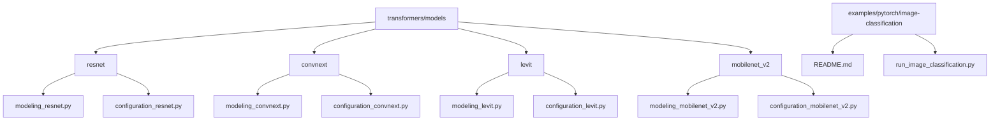
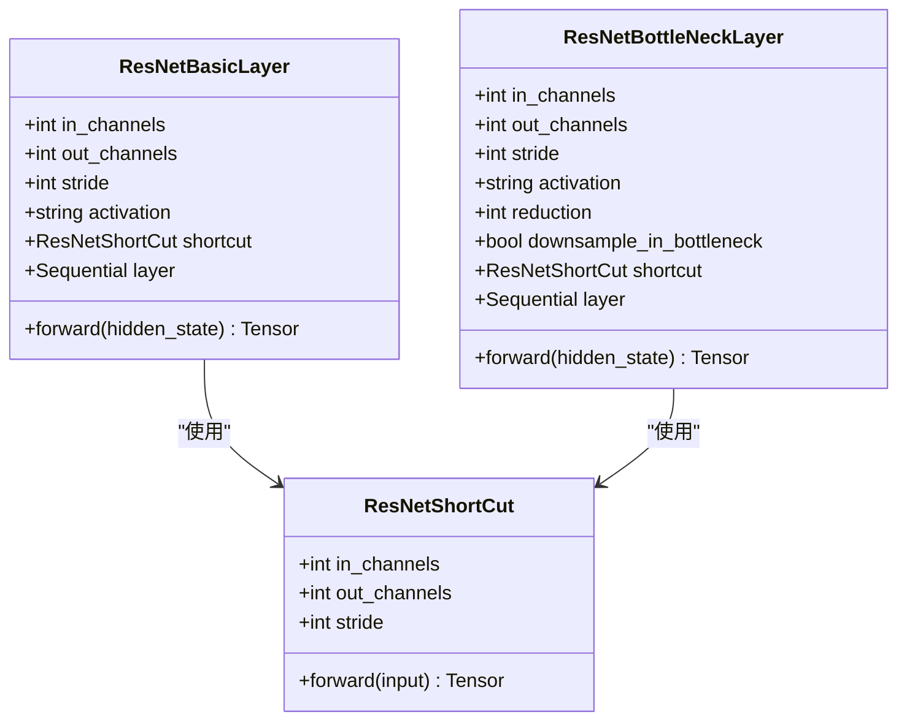
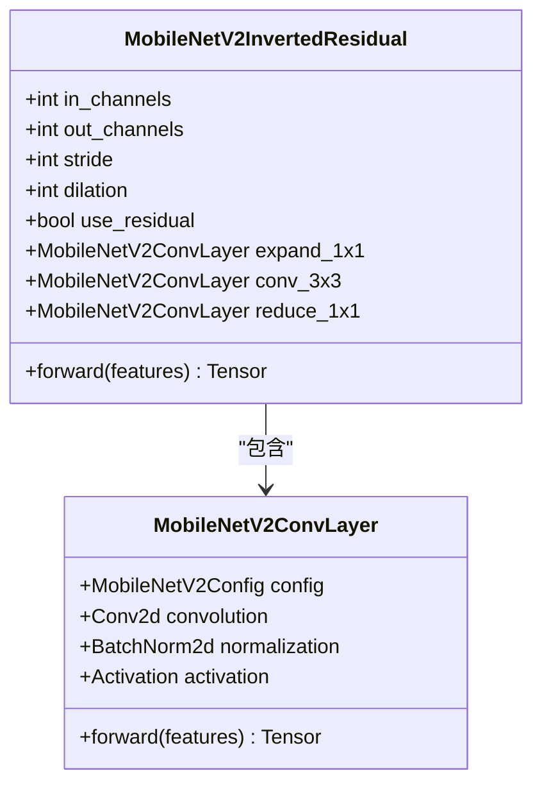
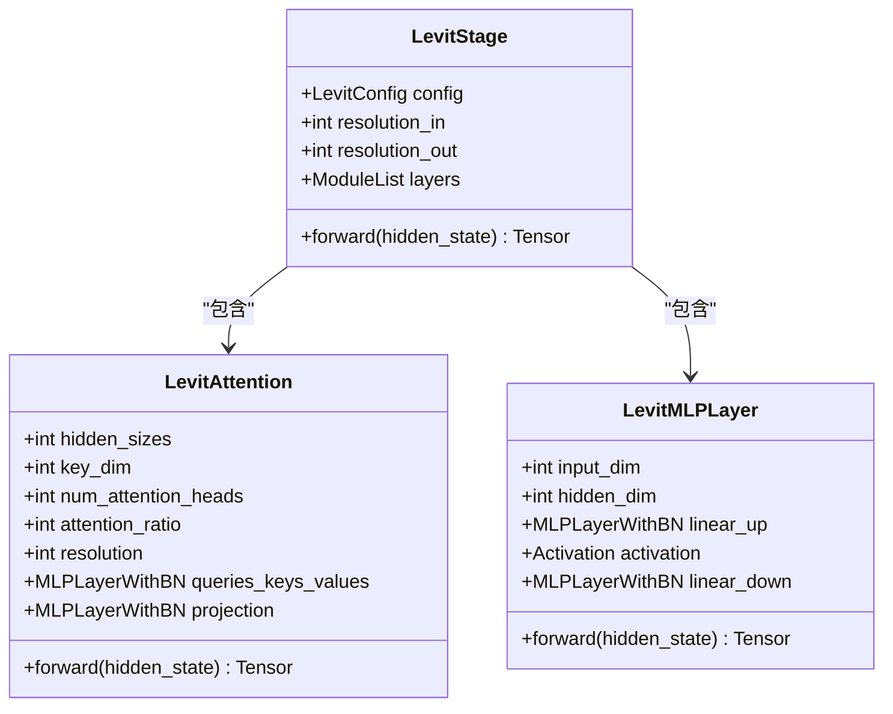
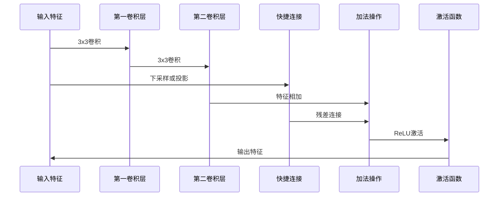
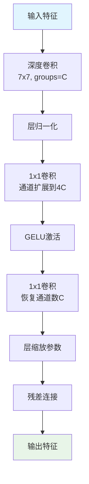
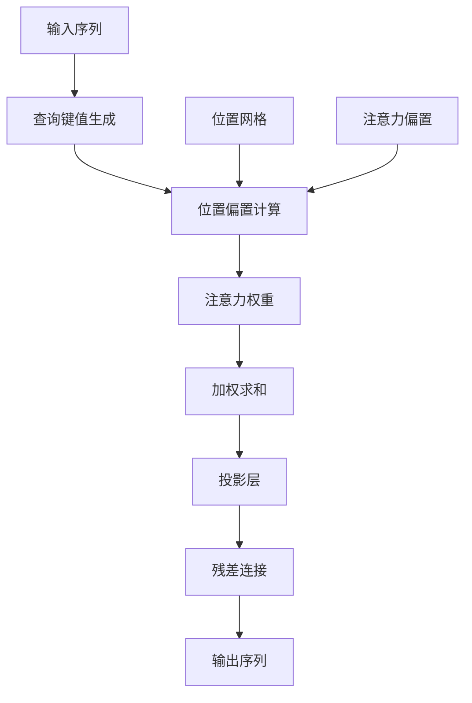
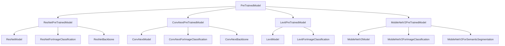
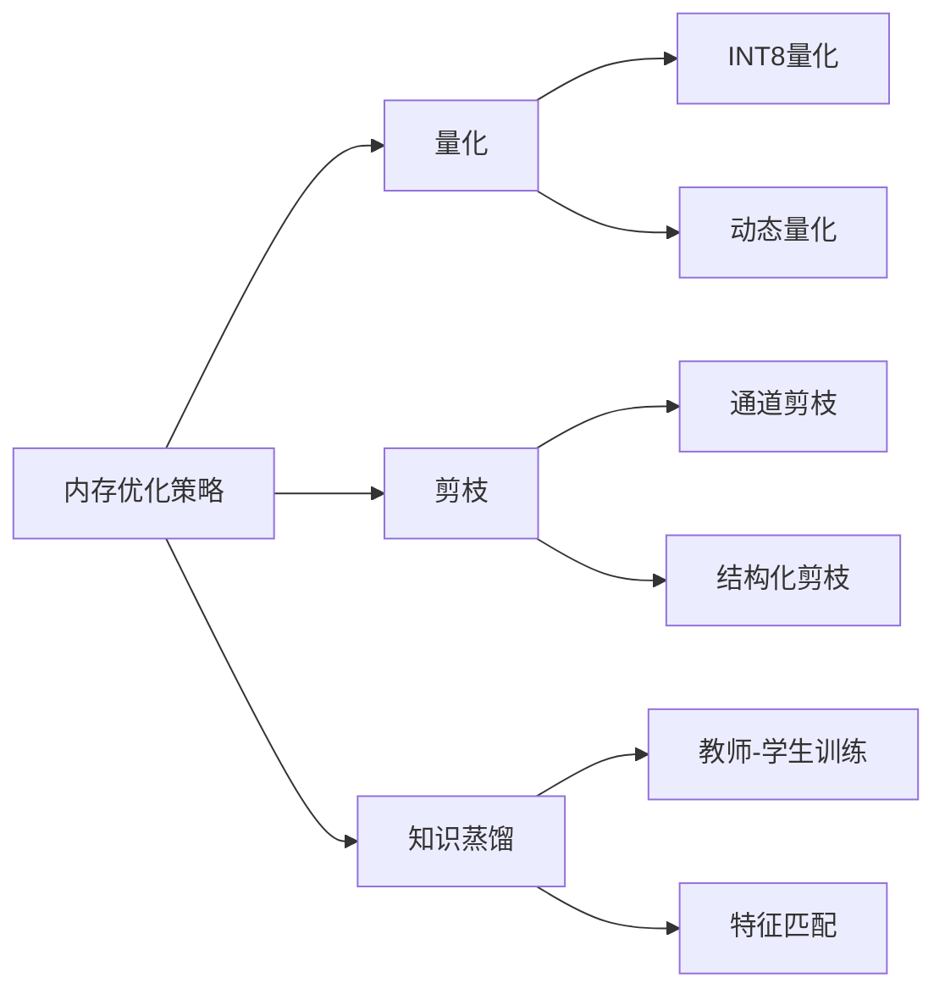

# CNN系列模型

<cite>
**本文档中引用的文件**
- [resnet/modeling_resnet.py](file://src/transformers/models/resnet/modeling_resnet.py)
- [convnext/modeling_convnext.py](file://src/transformers/models/convnext/modeling_convnext.py)
- [levit/modeling_levit.py](file://src/transformers/models/levit/modeling_levit.py)
- [mobilenet_v2/modeling_mobilenet_v2.py](file://src/transformers/models/mobilenet_v2/modeling_mobilenet_v2.py)
- [resnet/configuration_resnet.py](file://src/transformers/models/resnet/configuration_resnet.py)
- [convnext/configuration_convnext.py](file://src/transformers/models/convnext/configuration_convnext.py)
- [levit/configuration_levit.py](file://src/transformers/models/levit/configuration_levit.py)
- [mobilenet_v2/configuration_mobilenet_v2.py](file://src/transformers/models/mobilenet_v2/configuration_mobilenet_v2.py)
- [image-classification/README.md](file://examples/pytorch/image-classification/README.md)
</cite>

## 目录
1. [简介](#简介)
2. [项目结构](#项目结构)
3. [核心组件](#核心组件)
4. [架构概览](#架构概览)
5. [详细组件分析](#详细组件分析)
6. [依赖关系分析](#依赖关系分析)
7. [性能考虑](#性能考虑)
8. [故障排除指南](#故障排除指南)
9. [结论](#结论)

## 简介

本文档全面介绍了基于卷积神经网络（CNN）的视觉模型，包括ResNet、ConvNeXt、LeViT、MobileNet等主流架构。这些模型代表了计算机视觉领域的重要进展，从传统的深度残差网络到现代的混合卷积-Transformer架构。

CNN系列模型的核心优势在于：
- **残差连接**：解决深层网络训练中的梯度消失问题
- **深度可分离卷积**：显著减少计算量和参数量
- **混合架构**：结合卷积和Transformer的优势
- **移动端优化**：针对资源受限环境的专门设计

## 项目结构

transformers库中的CNN模型采用模块化设计，每个模型都有独立的配置文件、模型实现和测试文件：



**图表来源**
- [resnet/modeling_resnet.py](file://src/transformers/models/resnet/modeling_resnet.py#L1-L50)
- [convnext/modeling_convnext.py](file://src/transformers/models/convnext/modeling_convnext.py#L1-L50)
- [levit/modeling_levit.py](file://src/transformers/models/levit/modeling_levit.py#L1-L50)
- [mobilenet_v2/modeling_mobilenet_v2.py](file://src/transformers/models/mobilenet_v2/modeling_mobilenet_v2.py#L1-L50)

## 核心组件

### 残差连接（ResNet）

ResNet通过引入残差连接解决了深层网络训练中的梯度消失问题：



**图表来源**
- [resnet/modeling_resnet.py](file://src/transformers/models/resnet/modeling_resnet.py#L97-L130)
- [resnet/modeling_resnet.py](file://src/transformers/models/resnet/modeling_resnet.py#L132-L168)

### 深度可分离卷积（MobileNet）

MobileNet采用深度可分离卷积来大幅减少计算量：



**图表来源**
- [mobilenet_v2/modeling_mobilenet_v2.py](file://src/transformers/models/mobilenet_v2/modeling_mobilenet_v2.py#L146-L184)
- [mobilenet_v2/modeling_mobilenet_v2.py](file://src/transformers/models/mobilenet_v2/modeling_mobilenet_v2.py#L89-L145)

### 混合卷积-Transformer架构（LeViT）

LeViT结合了卷积和注意力机制的优势：



**图表来源**
- [levit/modeling_levit.py](file://src/transformers/models/levit/modeling_levit.py#L170-L220)
- [levit/modeling_levit.py](file://src/transformers/models/levit/modeling_levit.py#L296-L338)

**节来源**
- [resnet/modeling_resnet.py](file://src/transformers/models/resnet/modeling_resnet.py#L97-L168)
- [mobilenet_v2/modeling_mobilenet_v2.py](file://src/transformers/models/mobilenet_v2/modeling_mobilenet_v2.py#L146-L184)
- [levit/modeling_levit.py](file://src/transformers/models/levit/modeling_levit.py#L170-L220)

## 架构概览

### 模型配置参数

所有CNN模型都支持关键的配置参数来控制模型性能：

| 参数名称 | 类型 | 默认值 | 描述 |
|---------|------|--------|------|
| depth | list[int] | [3, 4, 6, 3] | 每个阶段的层数 |
| width | list[int] | [256, 512, 1024, 2048] | 每个阶段的宽度 |
| drop_path_rate | float | 0.0 | 随机深度丢弃率 |
| hidden_act | str | "relu" | 激活函数类型 |

### 计算复杂度对比

```mermaid
graph LR
A[ResNet] --> A1[O(HWDC²)]
B[ConvNeXt] --> B1[O(HWD²C)]
C[LeViT] --> C1[O(HWC²)]
D[MobileNetV2] --> D1[O(HWD²C/α)]
style A fill:#ffcccc
style B fill:#ccffcc
style C fill:#ccccff
style D fill:#ffffcc
```

**图表来源**
- [resnet/configuration_resnet.py](file://src/transformers/models/resnet/configuration_resnet.py#L40-L60)
- [convnext/configuration_convnext.py](file://src/transformers/models/convnext/configuration_convnext.py#L40-L60)
- [levit/configuration_levit.py](file://src/transformers/models/levit/configuration_levit.py#L40-L60)
- [mobilenet_v2/configuration_mobilenet_v2.py](file://src/transformers/models/mobilenet_v2/configuration_mobilenet_v2.py#L40-L60)

## 详细组件分析

### ResNet架构详解

ResNet通过残差块实现深层网络的有效训练：



**图表来源**
- [resnet/modeling_resnet.py](file://src/transformers/models/resnet/modeling_resnet.py#L97-L130)

### ConvNeXt改进机制

ConvNeXt引入了多项改进来提升性能：



**图表来源**
- [convnext/modeling_convnext.py](file://src/transformers/models/convnext/modeling_convnext.py#L133-L159)

### LeViT注意力机制

LeViT使用位置敏感的注意力机制：



**图表来源**
- [levit/modeling_levit.py](file://src/transformers/models/levit/modeling_levit.py#L170-L220)

**节来源**
- [resnet/modeling_resnet.py](file://src/transformers/models/resnet/modeling_resnet.py#L162-L195)
- [convnext/modeling_convnext.py](file://src/transformers/models/convnext/modeling_convnext.py#L162-L195)
- [levit/modeling_levit.py](file://src/transformers/models/levit/modeling_levit.py#L335-L369)

## 依赖关系分析

### 模型间依赖关系



**图表来源**
- [resnet/modeling_resnet.py](file://src/transformers/models/resnet/modeling_resnet.py#L280-L320)
- [convnext/modeling_convnext.py](file://src/transformers/models/convnext/modeling_convnext.py#L280-L320)
- [levit/modeling_levit.py](file://src/transformers/models/levit/modeling_levit.py#L520-L560)
- [mobilenet_v2/modeling_mobilenet_v2.py](file://src/transformers/models/mobilenet_v2/modeling_mobilenet_v2.py#L320-L360)

### 配置参数影响分析

不同配置参数对模型性能的影响：

| 参数 | ResNet | ConvNeXt | LeViT | MobileNetV2 |
|------|--------|----------|-------|-------------|
| depth | 影响层数和容量 | 影响层数和容量 | 影响注意力层数 | 影响倒残差层数 |
| width | 影响特征图大小 | 影响特征图大小 | 影响隐藏维度 | 影响通道数 |
| drop_path_rate | 控制过拟合 | 控制过拟合 | 控制过拟合 | 不适用 |
| hidden_act | 影响非线性 | 影响非线性 | 影响非线性 | 影响非线性 |

**节来源**
- [resnet/configuration_resnet.py](file://src/transformers/models/resnet/configuration_resnet.py#L40-L80)
- [convnext/configuration_convnext.py](file://src/transformers/models/convnext/configuration_convnext.py#L40-L80)
- [levit/configuration_levit.py](file://src/transformers/models/levit/configuration_levit.py#L40-L80)
- [mobilenet_v2/configuration_mobilenet_v2.py](file://src/transformers/models/mobilenet_v2/configuration_mobilenet_v2.py#L40-L80)

## 性能考虑

### 推理速度优化

不同模型在移动端部署时的性能特点：

- **ResNet**：适合高精度要求的任务，计算开销较大
- **ConvNeXt**：平衡性能和效率，适合通用视觉任务
- **LeViT**：轻量级设计，适合移动端和边缘计算
- **MobileNetV2**：极致优化，适合资源受限环境

### 内存使用优化



### 资源受限场景建议

1. **移动设备**：优先选择MobileNetV2或LeViT
2. **边缘计算**：ConvNeXt-Tiny或LeViT-128S
3. **服务器端**：ResNet-50或ConvNeXt-Base
4. **高精度需求**：ResNet-101或ConvNeXt-Large

## 故障排除指南

### 常见问题及解决方案

#### 1. 内存不足错误
- **原因**：批次大小过大或模型参数过多
- **解决方案**：减小批次大小，使用梯度累积，选择更小的模型变体

#### 2. 训练不收敛
- **原因**：学习率设置不当或数据预处理问题
- **解决方案**：调整学习率调度器，检查数据增强策略

#### 3. 推理速度慢
- **原因**：模型过于复杂或硬件不匹配
- **解决方案**：使用模型压缩技术，优化推理流程

**节来源**
- [image-classification/README.md](file://examples/pytorch/image-classification/README.md#L50-L100)

## 结论

CNN系列模型代表了计算机视觉领域的重要发展，每种架构都有其独特的优势和适用场景：

- **ResNet**提供了强大的残差连接机制，是深度网络训练的经典解决方案
- **ConvNeXt**通过现代化的设计提升了卷积网络的性能
- **LeViT**展示了混合架构的巨大潜力
- **MobileNetV2**在移动端部署方面表现出色

选择合适的模型需要综合考虑任务需求、计算资源和部署环境。随着技术的不断发展，这些架构将继续演进，为计算机视觉应用提供更强大的解决方案。