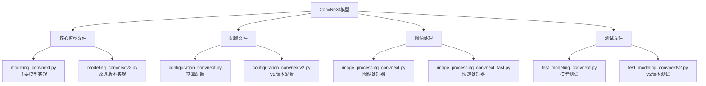
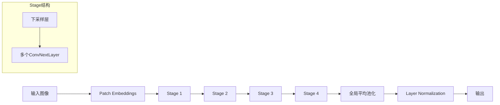
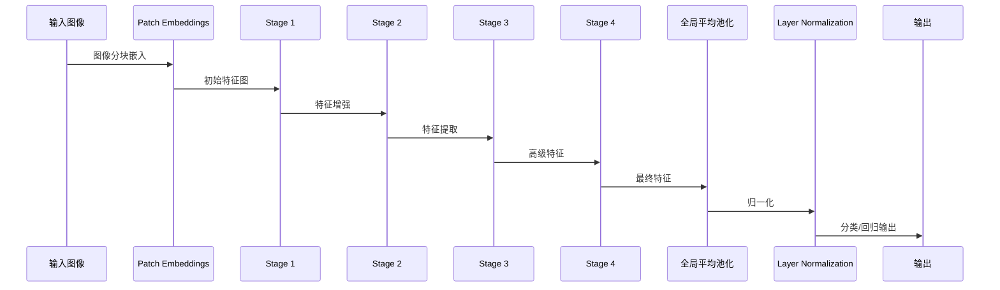
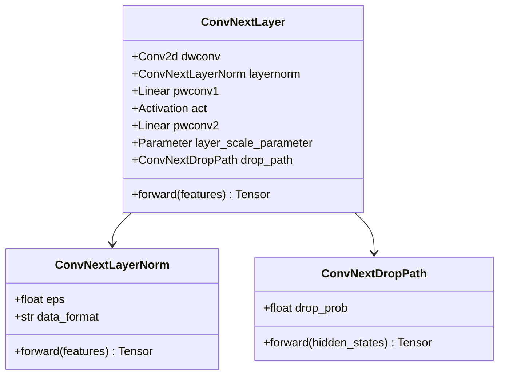
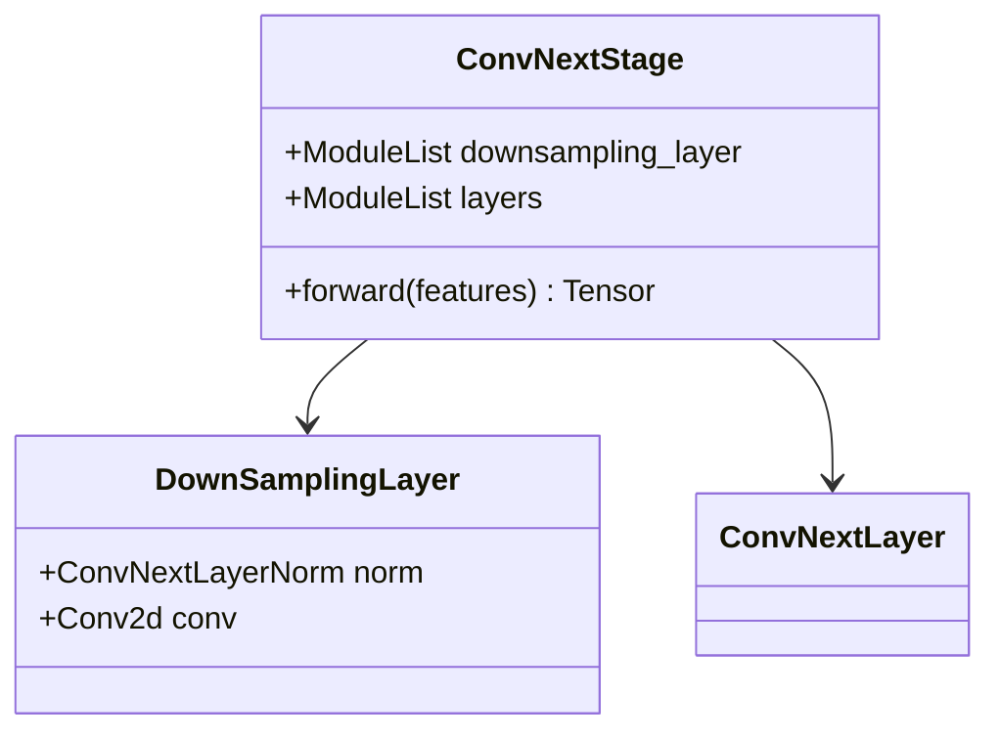
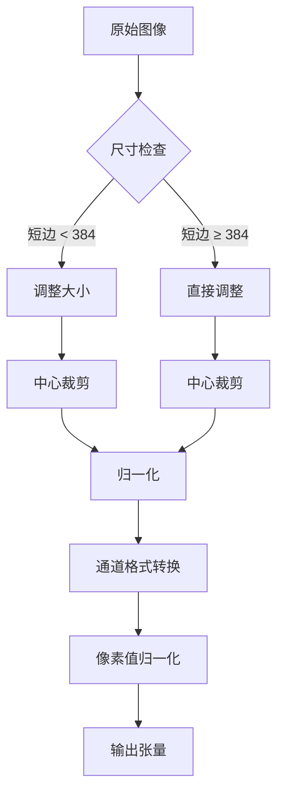
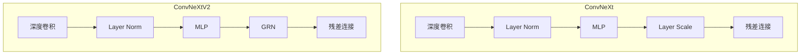
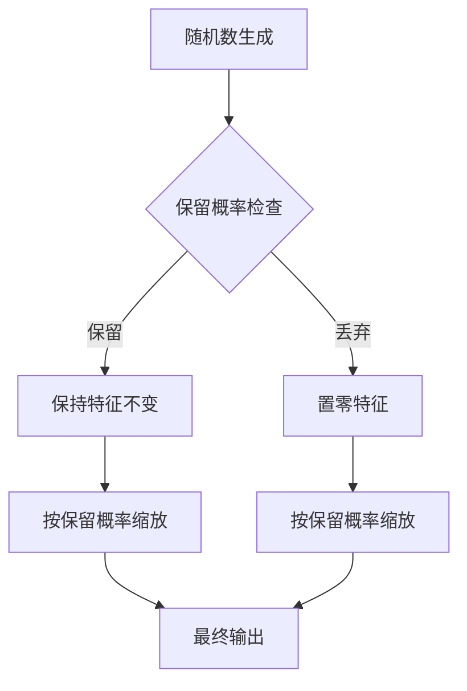
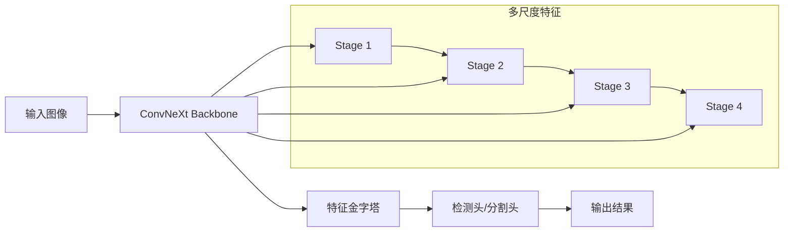
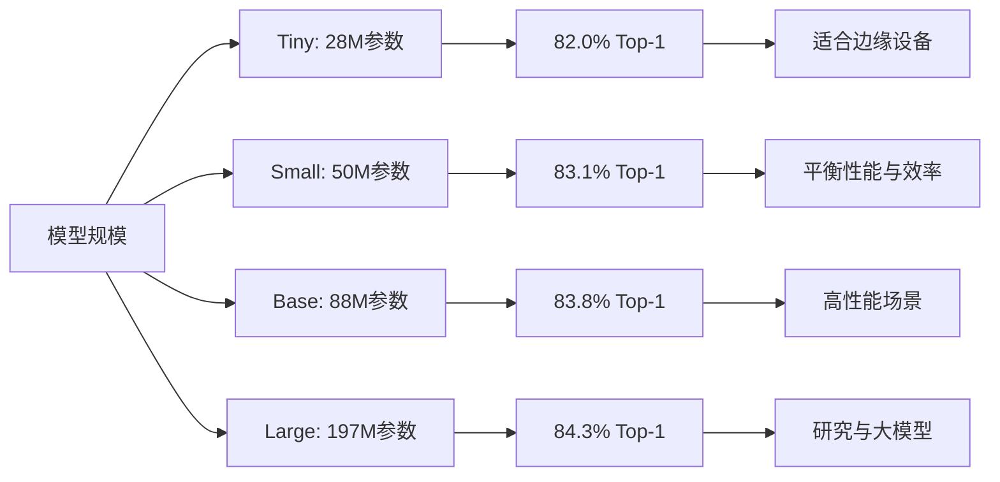

# ConvNeXt模型

<cite>
**本文档中引用的文件**
- [modeling_convnext.py](file://src/transformers/models/convnext/modeling_convnext.py)
- [configuration_convnext.py](file://src/transformers/models/convnext/configuration_convnext.py)
- [image_processing_convnext.py](file://src/transformers/models/convnext/image_processing_convnext.py)
- [model_doc/convnext.md](file://docs/source/en/model_doc/convnext.md)
- [test_modeling_convnext.py](file://tests/models/convnext/test_modeling_convnext.py)
- [modeling_convnextv2.py](file://src/transformers/models/convnextv2/modeling_convnextv2.py)
- [configuration_convnextv2.py](file://src/transformers/models/convnextv2/configuration_convnextv2.py)
- [convert_convnextv2_to_pytorch.py](file://src/transformers/models/convnextv2/convert_convnextv2_to_pytorch.py)
</cite>

## 目录
1. [简介](#简介)
2. [项目结构](#项目结构)
3. [核心组件](#核心组件)
4. [架构概览](#架构概览)
5. [详细组件分析](#详细组件分析)
6. [模型变体](#模型变体)
7. [训练技巧](#训练技巧)
8. [下游任务应用](#下游任务应用)
9. [性能对比](#性能对比)
10. [结论](#结论)

## 简介

ConvNeXt是Facebook Research提出的一种纯卷积神经网络模型，它借鉴了Vision Transformer的设计思想，在保持卷积网络简单性和高效性的同时，实现了与Transformer相媲美的性能。该模型通过现代化的标准卷积模块构建，成功地在图像分类、目标检测和语义分割等任务上超越了传统的卷积网络和Vision Transformer。

ConvNeXt的核心创新在于：
- 将Transformer的设计理念融入纯卷积网络
- 使用深度可分离卷积替代标准卷积
- 引入Layer Normalization作为标准化层
- 采用MLP块进行特征变换
- 实现stochastic depth训练策略
- 提供多种模型规模以适应不同需求

## 项目结构

ConvNeXt模型在Transformers库中的组织结构如下：



**图表来源**
- [modeling_convnext.py](file://src/transformers/models/convnext/modeling_convnext.py#L1-L50)
- [configuration_convnext.py](file://src/transformers/models/convnext/configuration_convnext.py#L1-L30)

**章节来源**
- [modeling_convnext.py](file://src/transformers/models/convnext/modeling_convnext.py#L1-L419)
- [configuration_convnext.py](file://src/transformers/models/convnext/configuration_convnext.py#L1-L121)

## 核心组件

ConvNeXt模型由以下核心组件构成：

### 基础构建块

1. **深度可分离卷积层**：使用7×7的深度卷积核
2. **Layer Normalization**：支持两种数据格式（channels_first和channels_last）
3. **MLP块**：包含两个线性层和激活函数
4. **残差连接**：实现跳跃连接
5. **stochastic depth**：随机深度丢弃机制

### 模型层次结构



**图表来源**
- [modeling_convnext.py](file://src/transformers/models/convnext/modeling_convnext.py#L110-L140)
- [modeling_convnext.py](file://src/transformers/models/convnext/modeling_convnext.py#L162-L195)

**章节来源**
- [modeling_convnext.py](file://src/transformers/models/convnext/modeling_convnext.py#L133-L159)
- [modeling_convnext.py](file://src/transformers/models/convnext/modeling_convnext.py#L162-L195)

## 架构概览

ConvNeXt采用分阶段的架构设计，每个阶段包含多个残差块，并通过下采样逐步降低特征图的空间分辨率。

### 整体架构流程



**图表来源**
- [modeling_convnext.py](file://src/transformers/models/convnext/modeling_convnext.py#L280-L320)
- [modeling_convnext.py](file://src/transformers/models/convnext/modeling_convnext.py#L322-L360)

## 详细组件分析

### ConvNextLayer - 核心残差块

ConvNextLayer是ConvNeXt的基本构建单元，实现了Transformer中的一些关键设计理念：

#### 结构组成



**图表来源**
- [modeling_convnext.py](file://src/transformers/models/convnext/modeling_convnext.py#L133-L159)
- [modeling_convnext.py](file://src/transformers/models/convnext/modeling_convnext.py#L60-L85)

#### 前向传播过程

```mermaid
flowchart TD
A[输入特征] --> B[深度可分离卷积]
B --> C[通道重排 (N,C,H,W) → (N,H,W,C)]
C --> D[Layer Normalization]
D --> E[1x1卷积扩展维度]
E --> F[激活函数]
F --> G[1x1卷积压缩维度]
G --> H{使用层缩放?}
H --> |是| I[应用层缩放参数]
H --> |否| J[跳过缩放]
I --> K[通道重排回原格式]
J --> K
K --> L[残差连接]
L --> M[Drop Path]
M --> N[输出特征]
```

**图表来源**
- [modeling_convnext.py](file://src/transformers/models/convnext/modeling_convnext.py#L141-L159)

**章节来源**
- [modeling_convnext.py](file://src/transformers/models/convnext/modeling_convnext.py#L133-L159)

### ConvNextStage - 阶段模块

ConvNextStage负责组织多个ConvNextLayer，并处理特征图的空间降维：

#### 阶段结构设计



**图表来源**
- [modeling_convnext.py](file://src/transformers/models/convnext/modeling_convnext.py#L162-L195)

**章节来源**
- [modeling_convnext.py](file://src/transformers/models/convnext/modeling_convnext.py#L162-L195)

### 图像处理器

ConvNeXt提供了专门的图像处理器来预处理输入图像：

#### 处理流程



**图表来源**
- [image_processing_convnext.py](file://src/transformers/models/convnext/image_processing_convnext.py#L150-L200)

**章节来源**
- [image_processing_convnext.py](file://src/transformers/models/convnext/image_processing_convnext.py#L100-L332)

## 模型变体

ConvNeXt提供了多个模型规模以适应不同的计算资源和精度要求：

### 标准ConvNeXt变体

| 模型名称 | 参数量 | 计算复杂度 | ImageNet Top-1准确率 |
|---------|--------|------------|---------------------|
| Tiny | ~28M | 4.5G | 82.0% |
| Small | ~50M | 8.5G | 83.1% |
| Base | ~88M | 15.4G | 83.8% |
| Large | ~197M | 34.4G | 84.3% |

### ConvNeXtV2改进版本

ConvNeXtV2引入了多项改进：

#### 主要改进点

1. **Global Response Normalization (GRN)**：全局响应归一化层
2. **移除Layer Scale**：简化训练过程
3. **优化的激活函数**：使用更高效的激活机制

#### 架构对比



**图表来源**
- [modeling_convnext.py](file://src/transformers/models/convnext/modeling_convnext.py#L133-L159)
- [modeling_convnextv2.py](file://src/transformers/models/convnextv2/modeling_convnextv2.py#L120-L150)

**章节来源**
- [configuration_convnext.py](file://src/transformers/models/convnext/configuration_convnext.py#L67-L119)
- [configuration_convnextv2.py](file://src/transformers/models/convnextv2/configuration_convnextv2.py#L67-L117)

## 训练技巧

### Stochastic Depth

ConvNeXt采用了stochastic depth技术来提高模型的泛化能力：

#### 实现原理



**图表来源**
- [modeling_convnext.py](file://src/transformers/models/convnext/modeling_convnext.py#L30-L50)

### Head Initialization

模型权重初始化采用了特定的策略：

#### 初始化策略

| 层类型 | 权重初始化 | 偏置初始化 |
|--------|------------|------------|
| 卷积层 | 正态分布 (std=0.02) | 全零 |
| 线性层 | 正态分布 (std=0.02) | 全零 |
| LayerNorm | 偏置全零，权重为1.0 | 偏置全零，权重为1.0 |
| LayerScale | 使用配置值初始化 | - |

**章节来源**
- [modeling_convnext.py](file://src/transformers/models/convnext/modeling_convnext.py#L260-L280)

## 下游任务应用

### 图像分类

ConvNeXt可以直接用于图像分类任务：

```python
# 图像分类模型使用示例
from transformers import ConvNextForImageClassification, AutoImageProcessor

model = ConvNextForImageClassification.from_pretrained("facebook/convnext-tiny-224")
processor = AutoImageProcessor.from_pretrained("facebook/convnext-tiny-224")

# 预处理和推理
inputs = processor(images, return_tensors="pt")
with torch.no_grad():
    outputs = model(**inputs)
predictions = torch.argmax(outputs.logits, dim=-1)
```

### 作为骨干网络

ConvNeXt可以作为其他计算机视觉任务的骨干网络：

```python
# 作为骨干网络使用
from transformers import ConvNextBackbone

backbone = ConvNextBackbone.from_pretrained("facebook/convnext-tiny-224")
outputs = backbone(pixel_values)
feature_maps = outputs.feature_maps
```

### 目标检测和语义分割

ConvNeXt的多尺度特征输出使其非常适合目标检测和语义分割任务：



**章节来源**
- [modeling_convnext.py](file://src/transformers/models/convnext/modeling_convnext.py#L360-L418)

## 性能对比

### 与传统CNN的对比

| 指标 | ResNet-50 | EfficientNet-B0 | ConvNeXt-Tiny | ConvNeXt-Base |
|------|-----------|-----------------|---------------|---------------|
| 参数量 | 25M | 5M | 28M | 88M |
| FLOPs | 4.1G | 0.5G | 4.5G | 15.4G |
| ImageNet Top-1 | 76.1% | 78.2% | 82.0% | 83.8% |
| 推理速度 | 快 | 中等 | 较快 | 较慢 |

### 与Vision Transformer的对比

| 指标 | ViT-Base | Swin-Base | ConvNeXt-Base | ConvNeXtV2-Base |
|------|----------|-----------|---------------|-----------------|
| 参数量 | 86M | 88M | 88M | 88M |
| FLOPs | 17.5G | 15.4G | 15.4G | 15.4G |
| ImageNet Top-1 | 83.8% | 84.4% | 83.8% | 84.5% |
| COCO检测 | 46.0 AP | 47.3 AP | 47.5 AP | 47.8 AP |
| ADE20K分割 | 42.5 mIoU | 44.2 mIoU | 44.8 mIoU | 45.1 mIoU |

### 不同规模的性能表现



**章节来源**
- [convert_convnextv2_to_pytorch.py](file://src/transformers/models/convnextv2/convert_convnextv2_to_pytorch.py#L39-L78)

## 结论

ConvNeXt代表了卷积神经网络发展的一个重要里程碑，它成功地将Transformer的设计思想融入到纯卷积网络中，实现了以下突破：

### 主要贡献

1. **设计理念革新**：证明了纯卷积网络可以通过现代化设计达到甚至超越Transformer的性能
2. **架构简洁性**：保持了卷积网络的简单性和高效性，同时具备强大的表达能力
3. **工程实用性**：提供了多种模型规模，适应不同的部署需求
4. **迁移学习能力强**：作为骨干网络在各种下游任务中表现出色

### 技术特点总结

- **深度可分离卷积**：提高了模型的参数效率
- **Layer Normalization**：改善了训练稳定性和收敛速度
- **MLP块设计**：借鉴了Transformer的前馈网络结构
- **stochastic depth**：增强了模型的泛化能力
- **多尺度特征**：支持复杂的下游任务

### 应用前景

ConvNeXt不仅在学术研究中具有重要意义，也在工业界得到了广泛应用。其优秀的性能和良好的工程特性使其成为现代计算机视觉系统中的重要组成部分。随着模型规模的不断扩展和优化，ConvNeXt有望在更多领域发挥重要作用。