# ResNet模型架构与实现详解

<cite>
**本文档中引用的文件**
- [configuration_resnet.py](file://src/transformers/models/resnet/configuration_resnet.py)
- [modeling_resnet.py](file://src/transformers/models/resnet/modeling_resnet.py)
- [convert_resnet_to_pytorch.py](file://src/transformers/models/resnet/convert_resnet_to_pytorch.py)
- [test_modeling_resnet.py](file://tests/models/resnet/test_modeling_resnet.py)
- [resnet.md](file://docs/source/en/model_doc/resnet.md)
</cite>

## 目录
1. [简介](#简介)
2. [项目结构](#项目结构)
3. [核心组件](#核心组件)
4. [架构概览](#架构概览)
5. [详细组件分析](#详细组件分析)
6. [残差连接机制](#残差连接机制)
7. [不同变体对比](#不同变体对比)
8. [性能分析](#性能分析)
9. [实际应用示例](#实际应用示例)
10. [优化策略](#优化策略)
11. [总结](#总结)

## 简介

ResNet（Residual Network）是深度学习领域的重要突破性模型，由Kaiming He等人在2015年提出。该模型通过引入残差连接（Residual Connection）解决了深层神经网络训练中的梯度消失和退化问题，使得训练数百甚至上千层的神经网络成为可能。

ResNet的核心创新在于"残差学习"框架，它将深层网络的构建问题转化为残差函数的学习，而不是直接学习目标映射。这种设计使得网络能够更容易地优化，并且可以从显著增加的深度中获得精度提升。

## 项目结构

ResNet模型在Transformers库中的组织结构清晰明确，主要包含以下核心文件：

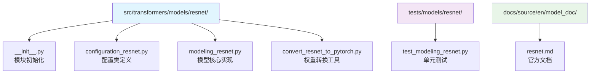

**图表来源**
- [configuration_resnet.py](file://src/transformers/models/resnet/configuration_resnet.py#L1-L115)
- [modeling_resnet.py](file://src/transformers/models/resnet/modeling_resnet.py#L1-L437)

**章节来源**
- [__init__.py](file://src/transformers/models/resnet/__init__.py#L1-L28)
- [configuration_resnet.py](file://src/transformers/models/resnet/configuration_resnet.py#L1-L115)

## 核心组件

ResNet模型由多个精心设计的核心组件构成，每个组件都有其特定的功能和作用：

### 主要类层次结构

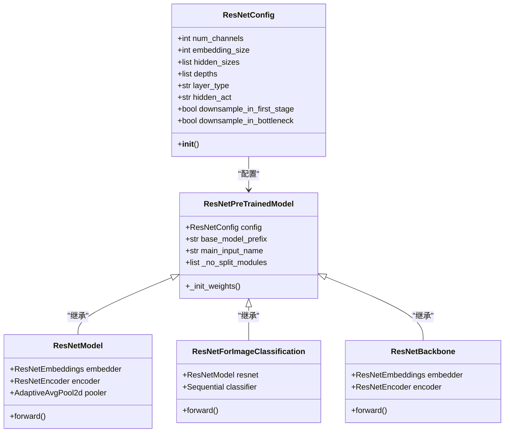

**图表来源**
- [modeling_resnet.py](file://src/transformers/models/resnet/modeling_resnet.py#L250-L437)
- [configuration_resnet.py](file://src/transformers/models/resnet/configuration_resnet.py#L20-L115)

**章节来源**
- [modeling_resnet.py](file://src/transformers/models/resnet/modeling_resnet.py#L250-L437)
- [configuration_resnet.py](file://src/transformers/models/resnet/configuration_resnet.py#L20-L115)

## 架构概览

ResNet的整体架构遵循经典的深度卷积神经网络设计模式，但通过残差连接实现了革命性的改进：

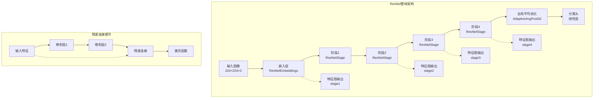

**图表来源**
- [modeling_resnet.py](file://src/transformers/models/resnet/modeling_resnet.py#L320-L380)
- [modeling_resnet.py](file://src/transformers/models/resnet/modeling_resnet.py#L280-L320)

## 详细组件分析

### 基础卷积层（ResNetConvLayer）

基础卷积层是ResNet的基本构建块，包含了标准的卷积操作、批归一化和激活函数：

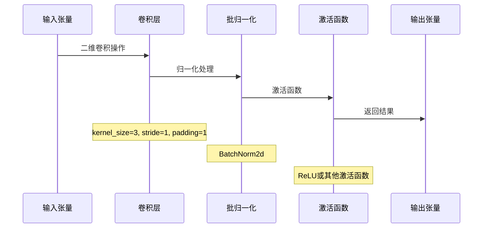

**图表来源**
- [modeling_resnet.py](file://src/transformers/models/resnet/modeling_resnet.py#L30-L45)

### 残差层（ResNetBasicLayer）

基本残差层由两个3×3卷积组成，是最简单的残差单元：

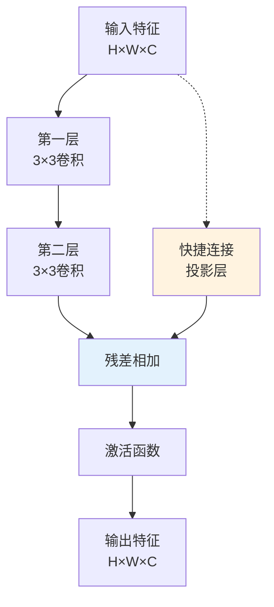

**图表来源**
- [modeling_resnet.py](file://src/transformers/models/resnet/modeling_resnet.py#L97-L130)

### 瓶颈层（ResNetBottleNeckLayer）

瓶颈层通过1×1卷积减少通道数来加速计算，然后通过3×3卷积提取特征，最后通过1×1卷积恢复通道数：

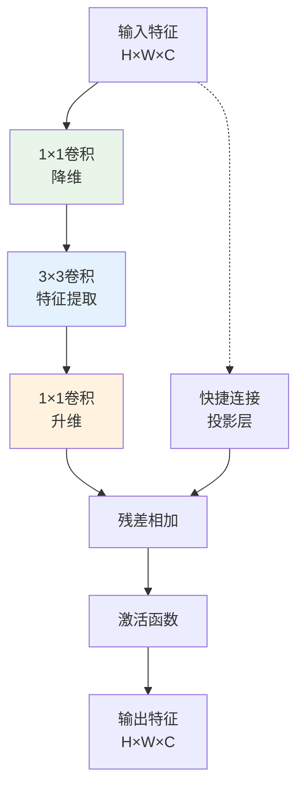

**图表来源**
- [modeling_resnet.py](file://src/transformers/models/resnet/modeling_resnet.py#L132-L168)

### 阶段（ResNetStage）

每个阶段包含多个相同类型的残差层，形成深度堆叠：

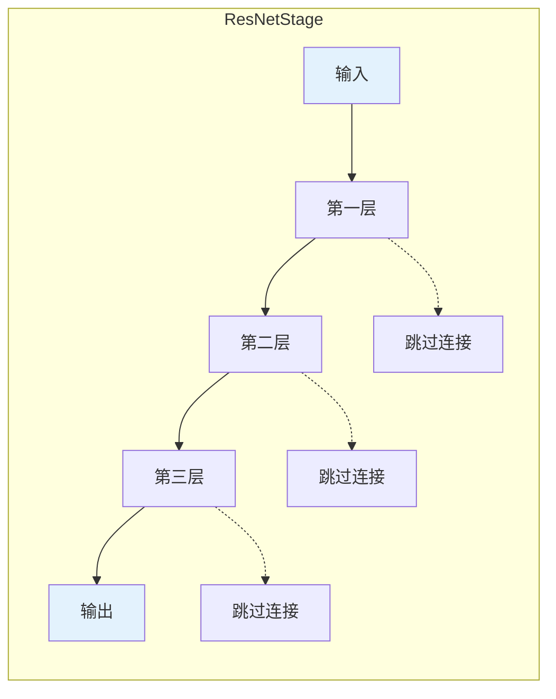

**图表来源**
- [modeling_resnet.py](file://src/transformers/models/resnet/modeling_resnet.py#L165-L200)

**章节来源**
- [modeling_resnet.py](file://src/transformers/models/resnet/modeling_resnet.py#L30-L437)

## 残差连接机制

### 梯度消失问题的解决方案

残差连接是ResNet的核心创新，它解决了深层网络训练中的关键问题：

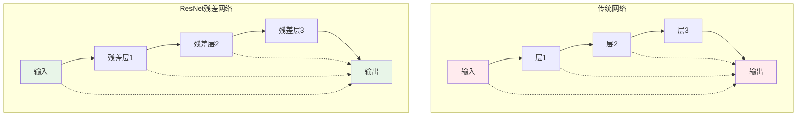

### 数学原理

残差连接的数学表达式为：

**F(x) + x** 或 **F(x) + W_s*x**

其中：
- F(x) 是残差函数（网络需要学习的部分）
- x 是输入特征
- W_s 是投影变换（当维度不匹配时使用）

这种设计允许网络学习恒等映射，从而避免性能退化。

### 实现细节

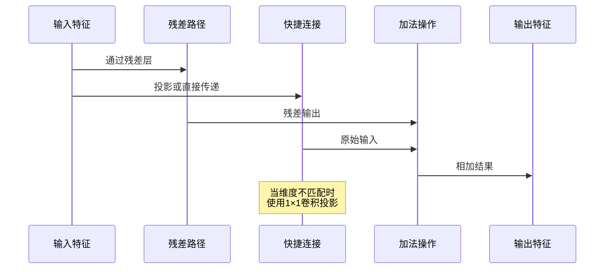

**图表来源**
- [modeling_resnet.py](file://src/transformers/models/resnet/modeling_resnet.py#L60-L75)
- [modeling_resnet.py](file://src/transformers/models/resnet/modeling_resnet.py#L97-L130)

**章节来源**
- [modeling_resnet.py](file://src/transformers/models/resnet/modeling_resnet.py#L60-L130)

## 不同变体对比

### ResNet变体配置表

| 变体 | 总层数 | 基本层类型 | 深度配置 | 隐藏尺寸 | 下采样策略 |
|------|--------|------------|----------|----------|------------|
| ResNet-18 | 18 | Basic | [2, 2, 2, 2] | [64, 128, 256, 512] | Bottleneck首层 |
| ResNet-34 | 34 | Basic | [3, 4, 6, 3] | [64, 128, 256, 512] | Bottleneck首层 |
| ResNet-50 | 50 | Bottleneck | [3, 4, 6, 3] | [256, 512, 1024, 2048] | Bottleneck中间层 |
| ResNet-101 | 101 | Bottleneck | [3, 4, 23, 3] | [256, 512, 1024, 2048] | Bottleneck中间层 |
| ResNet-152 | 152 | Bottleneck | [3, 8, 36, 3] | [256, 512, 1024, 2048] | Bottleneck中间层 |

### 层类型选择策略

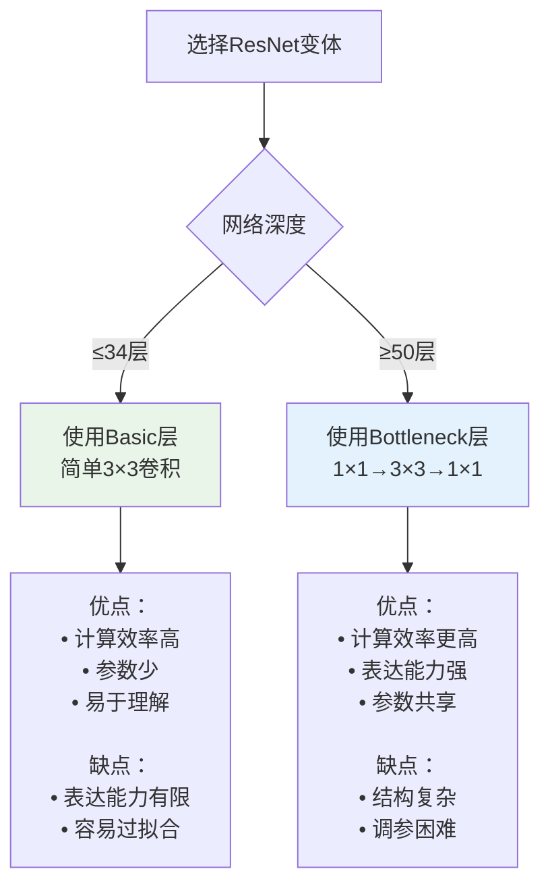

### 不同变体的性能对比

基于ImageNet基准测试的结果显示：

- **ResNet-18/34**: 更适合轻量级应用，训练速度快，内存占用低
- **ResNet-50**: 平衡了性能和效率，是工业应用的首选
- **ResNet-101/152**: 提供最高精度，但需要更多计算资源

**章节来源**
- [convert_resnet_to_pytorch.py](file://src/transformers/models/resnet/convert_resnet_to_pytorch.py#L120-L160)

## 性能分析

### 关键参数影响

#### 批归一化（Batch Normalization）

批归一化在ResNet中起到至关重要的作用：

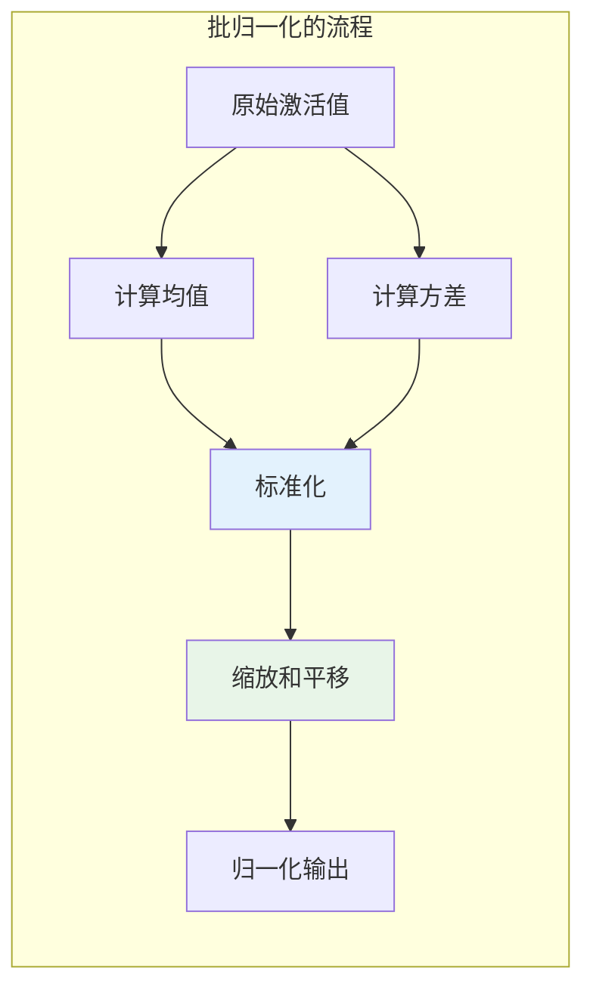

**优势：**
- 加速训练收敛
- 减少内部协变量偏移
- 允许更高的学习率
- 提供正则化效果

#### Stride设置策略

不同的stride设置对模型性能有显著影响：

| 设置位置 | 默认策略 | v1.5策略 | 影响 |
|----------|----------|----------|------|
| Bottleneck首层 | stride=1 | stride=2 | 计算效率 |
| Bottleneck中间层 | stride=2 | stride=2 | 特征分辨率 |
| 第一阶段 | stride=2 | 可选 | 初始下采样 |

### 内存和计算效率

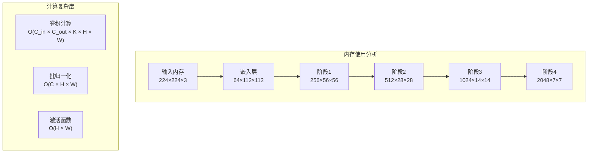

**章节来源**
- [modeling_resnet.py](file://src/transformers/models/resnet/modeling_resnet.py#L30-L45)
- [modeling_resnet.py](file://src/transformers/models/resnet/modeling_resnet.py#L132-L168)

## 实际应用示例

### 图像分类完整代码示例

以下展示了如何使用ResNet进行图像分类的完整流程：

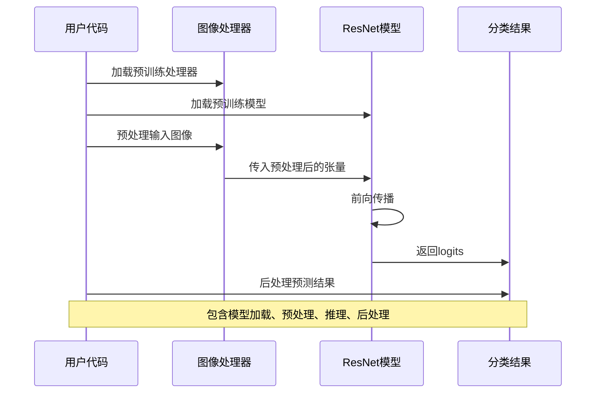

**图表来源**
- [test_modeling_resnet.py](file://tests/models/resnet/test_modeling_resnet.py#L250-L302)

### 模型加载和推理

典型的ResNet使用流程包括以下几个步骤：

1. **模型初始化**：从预训练权重加载模型
2. **图像预处理**：调整大小、归一化、张量转换
3. **前向推理**：执行模型前向传播
4. **结果后处理**：获取类别概率和标签

### 迁移学习最佳实践

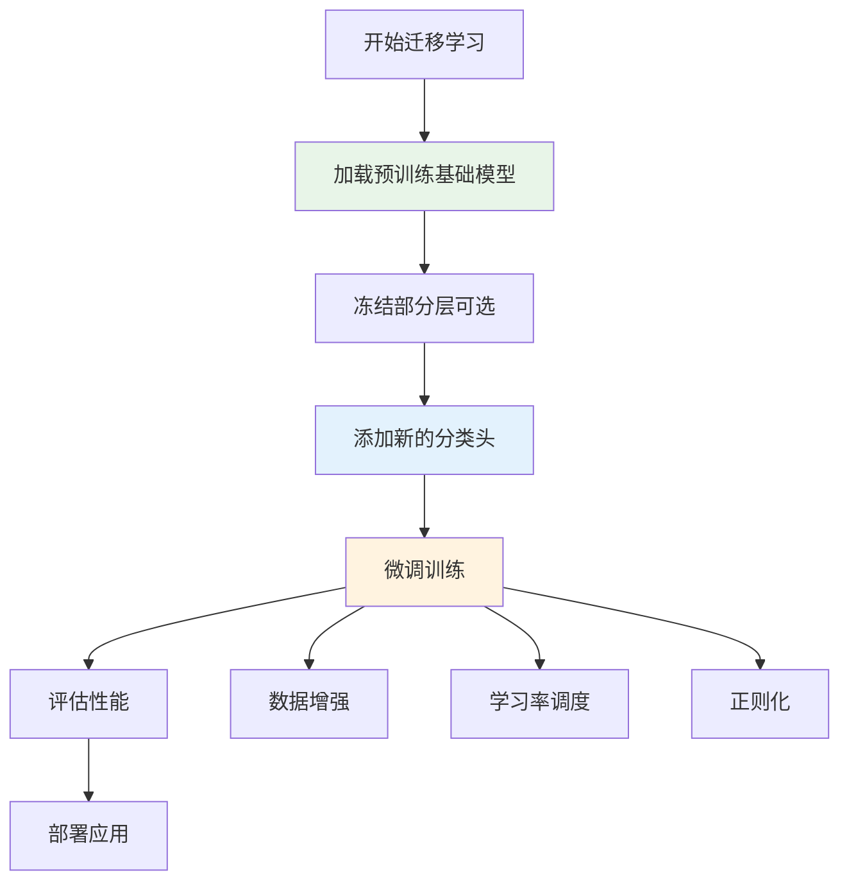

**章节来源**
- [test_modeling_resnet.py](file://tests/models/resnet/test_modeling_resnet.py#L250-L302)

## 优化策略

### 资源受限环境优化

#### 模型压缩技术

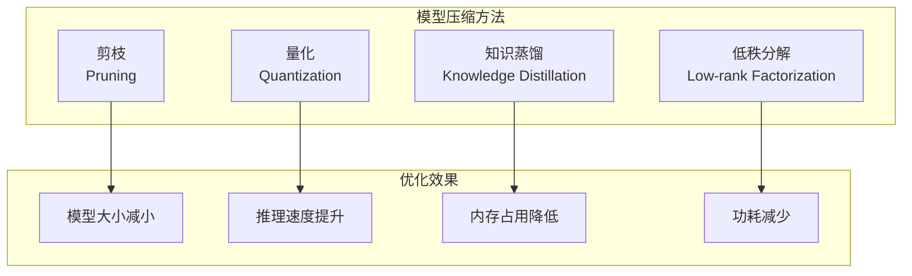

#### 推理优化

针对移动设备和边缘计算的优化策略：

| 优化技术 | 效果 | 适用场景 |
|----------|------|----------|
| 动态量化 | 2-4倍加速 | 移动设备 |
| 模型剪枝 | 30-50%大小减少 | 存储受限 |
| 知识蒸馏 | 保持精度的同时大幅压缩 | 在线推理 |
| 硬件加速 | 10-100倍加速 | 专用硬件 |

### 训练优化技巧

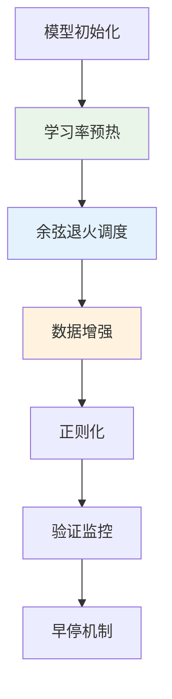

**章节来源**
- [convert_resnet_to_pytorch.py](file://src/transformers/models/resnet/convert_resnet_to_pytorch.py#L80-L120)

## 总结

ResNet作为深度学习领域的里程碑式模型，通过残差连接这一创新设计成功解决了深层网络训练中的关键挑战。其核心贡献包括：

### 主要创新点

1. **残差连接**：通过学习残差函数而非直接学习目标映射，使得网络可以轻松训练数百层
2. **恒等映射**：允许网络学习恒等映射，避免性能退化
3. **模块化设计**：基本层和瓶颈层的设计提供了灵活的架构选择

### 技术优势

- **训练稳定性**：残差连接有效缓解了梯度消失问题
- **表达能力**：深层网络能够学习更复杂的特征表示
- **泛化性能**：在多个视觉任务上表现出色
- **工程友好**：易于理解和实现，便于工程化部署

### 应用价值

ResNet不仅在学术界产生了深远影响，在工业界也得到了广泛应用：

- **计算机视觉任务**：图像分类、目标检测、语义分割
- **特征提取**：作为其他任务的特征提取器
- **迁移学习**：在新任务上快速适应
- **研究基础**：为后续网络架构设计提供重要参考

### 发展趋势

随着深度学习技术的发展，ResNet及其衍生模型仍在不断演进：

- **更深更宽**：探索更大规模的网络架构
- **效率优化**：在保持精度的同时提高效率
- **多模态融合**：与其他模态的结合应用
- **自动化设计**：神经架构搜索的应用

ResNet的成功证明了创新性架构设计在深度学习发展中的重要性，其设计理念和技术创新将继续指导未来的研究和应用。