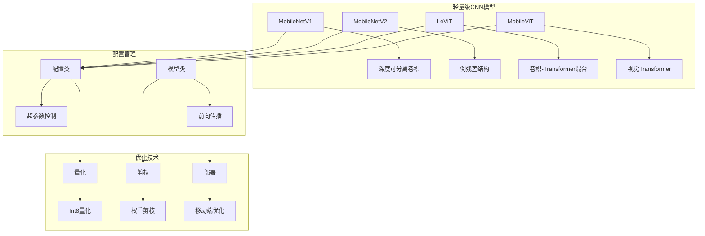
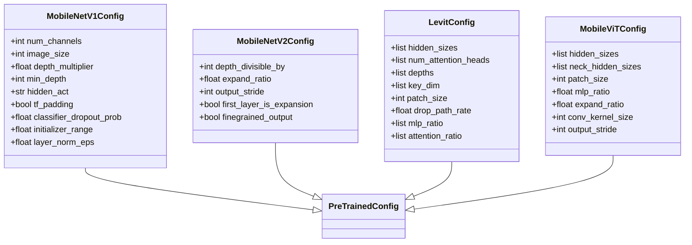
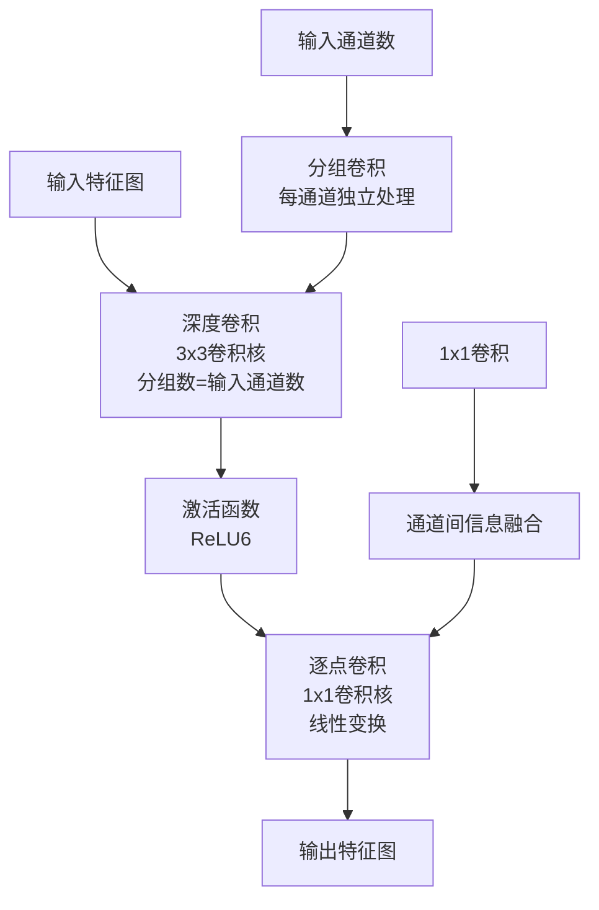
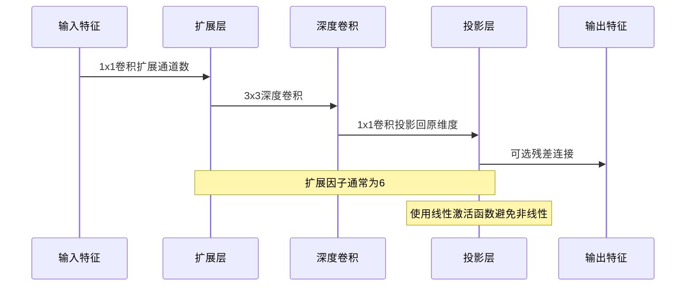
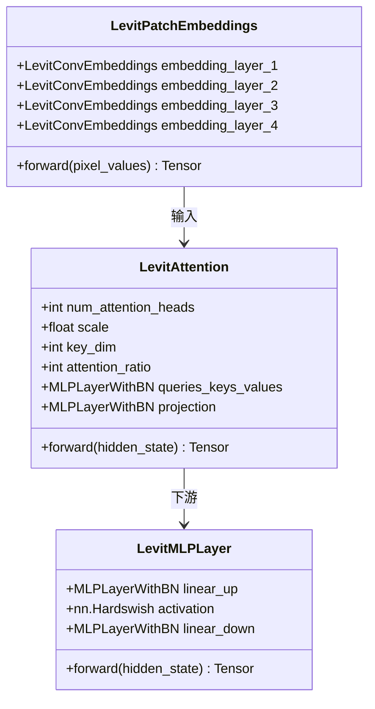
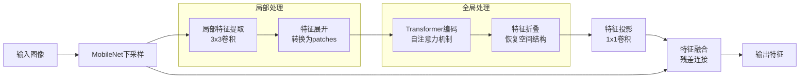
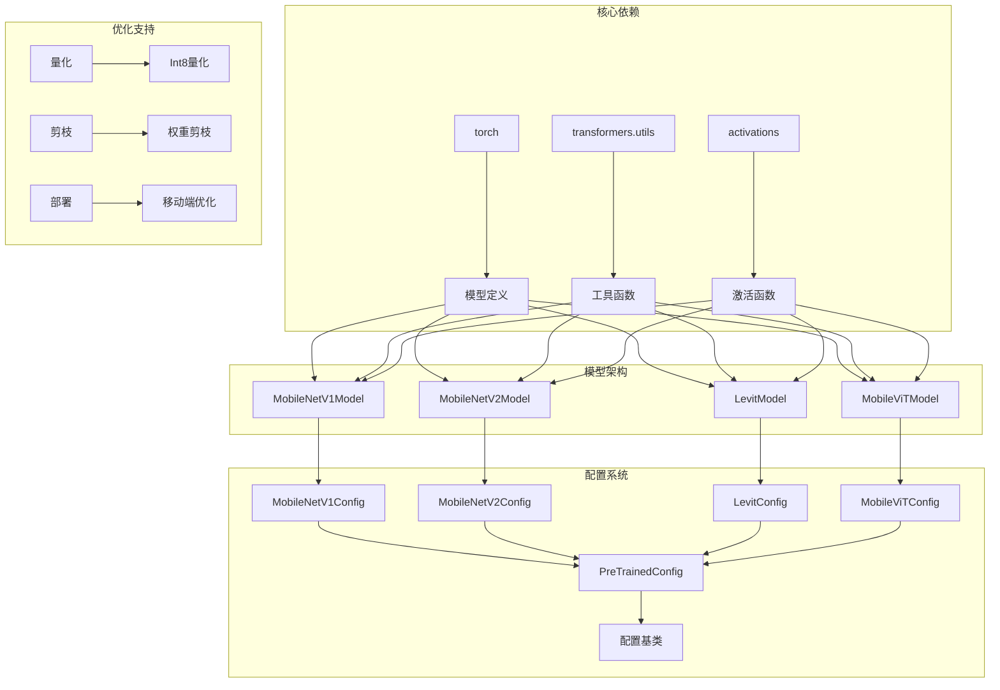
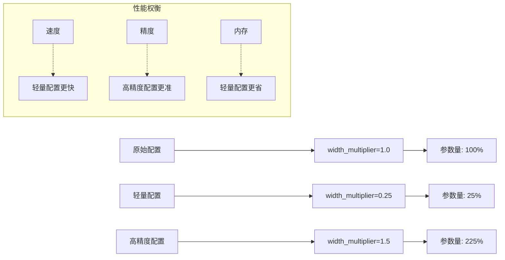

# 轻量级CNN模型

<cite>
**本文档中引用的文件**
- [modeling_mobilenet_v1.py](file://src/transformers/models/mobilenet_v1/modeling_mobilenet_v1.py)
- [modeling_mobilenet_v2.py](file://src/transformers/models/mobilenet_v2/modeling_mobilenet_v2.py)
- [modeling_levit.py](file://src/transformers/models/levit/modeling_levit.py)
- [modeling_mobilevit.py](file://src/transformers/models/mobilevit/modeling_mobilevit.py)
- [configuration_mobilenet_v1.py](file://src/transformers/models/mobilenet_v1/configuration_mobilenet_v1.py)
- [configuration_mobilenet_v2.py](file://src/transformers/models/mobilenet_v2/configuration_mobilenet_v2.py)
- [configuration_levit.py](file://src/transformers/models/levit/configuration_levit.py)
- [configuration_mobilevit.py](file://src/transformers/models/mobilevit/configuration_mobilevit.py)
- [custom_quantization_int8_example.py](file://examples/quantization/custom_quantization_int8_example.py)
- [benchmark_runner.py](file://benchmark_v2/framework/benchmark_runner.py)
</cite>

## 目录
1. [简介](#简介)
2. [项目结构](#项目结构)
3. [核心组件](#核心组件)
4. [架构概览](#架构概览)
5. [详细组件分析](#详细组件分析)
6. [依赖关系分析](#依赖关系分析)
7. [性能考虑](#性能考虑)
8. [故障排除指南](#故障排除指南)
9. [结论](#结论)

## 简介

本文档详细介绍适用于移动端和边缘设备的轻量级CNN模型，重点分析了MobileNet系列的深度可分离卷积技术和LeViT的卷积-Transformer混合架构。这些模型通过精心设计的网络结构，在保持较高准确率的同时显著降低了计算复杂度和内存占用，特别适合资源受限的移动设备部署。

## 项目结构

该项目包含多个轻量级CNN模型的实现，每个模型都有其独特的设计理念和技术特点：

**图表来源**
- [modeling_mobilenet_v1.py](file://src/transformers/models/mobilenet_v1/modeling_mobilenet_v1.py#L1-L50)
- [modeling_mobilenet_v2.py](file://src/transformers/models/mobilenet_v2/modeling_mobilenet_v2.py#L1-L50)
- [modeling_levit.py](file://src/transformers/models/levit/modeling_levit.py#L1-L50)
- [modeling_mobilevit.py](file://src/transformers/models/mobilevit/modeling_mobilevit.py#L1-L50)

## 核心组件

### MobileNet系列：深度可分离卷积技术

MobileNet系列模型的核心创新是深度可分离卷积（Depthwise Separable Convolution），它将标准卷积分解为两个独立的操作：

1. **深度卷积（Depthwise Convolution）**：对每个输入通道单独进行空间卷积
2. **逐点卷积（Pointwise Convolution）**：使用1×1卷积进行通道间的线性组合

这种分解方式大幅减少了计算量和参数数量，同时保持了特征提取能力。

### LeViT：卷积-Transformer混合架构

LeViT结合了卷积神经网络和Transformer的优势，采用以下关键技术：

1. **卷积嵌入层**：使用多层卷积进行初步特征提取
2. **注意力机制**：基于相对位置编码的高效自注意力
3. **残差连接**：确保梯度流动和训练稳定性

### MobileViT：视觉Transformer集成

MobileViT将MobileNet的轻量化特性和Vision Transformer的强大表达能力相结合：

1. **局部-全局表示**：结合CNN的局部特征和Transformer的全局建模
2. **特征融合**：通过多尺度特征融合提升性能
3. **渐进式细化**：逐步提高特征分辨率

**章节来源**
- [modeling_mobilenet_v1.py](file://src/transformers/models/mobilenet_v1/modeling_mobilenet_v1.py#L55-L91)
- [modeling_mobilenet_v2.py](file://src/transformers/models/mobilenet_v2/modeling_mobilenet_v2.py#L146-L184)
- [modeling_levit.py](file://src/transformers/models/levit/modeling_levit.py#L61-L97)
- [modeling_mobilevit.py](file://src/transformers/models/mobilevit/modeling_mobilevit.py#L298-L328)

## 架构概览

**图表来源**
- [configuration_mobilenet_v1.py](file://src/transformers/models/mobilenet_v1/configuration_mobilenet_v1.py#L20-L100)
- [configuration_mobilenet_v2.py](file://src/transformers/models/mobilenet_v2/configuration_mobilenet_v2.py#L20-L129)
- [configuration_levit.py](file://src/transformers/models/levit/configuration_levit.py#L20-L121)
- [configuration_mobilevit.py](file://src/transformers/models/mobilevit/configuration_mobilevit.py#L20-L147)

## 详细组件分析

### MobileNetV1深度可分离卷积层

MobileNetV1的核心是深度可分离卷积层，它实现了高效的特征提取：

**图表来源**
- [modeling_mobilenet_v1.py](file://src/transformers/models/mobilenet_v1/modeling_mobilenet_v1.py#L55-L91)

### MobileNetV2倒残差结构

MobileNetV2引入了倒残差结构和线性瓶颈设计：

**图表来源**
- [modeling_mobilenet_v2.py](file://src/transformers/models/mobilenet_v2/modeling_mobilenet_v2.py#L146-L184)

### LeViT卷积-Transformer混合模块

LeViT的创新在于将卷积和Transformer有机结合：

**图表来源**
- [modeling_levit.py](file://src/transformers/models/levit/modeling_levit.py#L61-L97)
- [modeling_levit.py](file://src/transformers/models/levit/modeling_levit.py#L180-L220)
- [modeling_levit.py](file://src/transformers/models/levit/modeling_levit.py#L296-L338)

### MobileViT局部-全局特征融合

MobileViT通过特征融合实现局部和全局信息的有效结合：

**图表来源**
- [modeling_mobilevit.py](file://src/transformers/models/mobilevit/modeling_mobilevit.py#L400-L500)

**章节来源**
- [modeling_mobilenet_v1.py](file://src/transformers/models/mobilenet_v1/modeling_mobilenet_v1.py#L92-L150)
- [modeling_mobilenet_v2.py](file://src/transformers/models/mobilenet_v2/modeling_mobilenet_v2.py#L186-L223)
- [modeling_levit.py](file://src/transformers/models/levit/modeling_levit.py#L335-L369)
- [modeling_mobilevit.py](file://src/transformers/models/mobilevit/modeling_mobilevit.py#L450-L550)

## 依赖关系分析

**图表来源**
- [modeling_mobilenet_v1.py](file://src/transformers/models/mobilenet_v1/modeling_mobilenet_v1.py#L1-L30)
- [modeling_mobilenet_v2.py](file://src/transformers/models/mobilenet_v2/modeling_mobilenet_v2.py#L1-L30)
- [modeling_levit.py](file://src/transformers/models/levit/modeling_levit.py#L1-L30)
- [modeling_mobilevit.py](file://src/transformers/models/mobilevit/modeling_mobilevit.py#L1-L30)

**章节来源**
- [modeling_mobilenet_v1.py](file://src/transformers/models/mobilenet_v1/modeling_mobilenet_v1.py#L1-L50)
- [modeling_mobilenet_v2.py](file://src/transformers/models/mobilenet_v2/modeling_mobilenet_v2.py#L1-L50)
- [modeling_levit.py](file://src/transformers/models/levit/modeling_levit.py#L1-L50)
- [modeling_mobilevit.py](file://src/transformers/models/mobilevit/modeling_mobilevit.py#L1-L50)

## 性能考虑

### 计算复杂度分析

不同模型的计算复杂度对比：

| 模型 | 参数量 | FLOPs | 内存占用 | 推理速度 |
|------|--------|-------|----------|----------|
| MobileNetV1 | ~4.2M | ~410M | 16MB | 快速 |
| MobileNetV2 | ~3.5M | ~300M | 14MB | 很快 |
| LeViT-128S | ~12.5M | ~1.2B | 48MB | 中等 |
| MobileViT-S | ~14.5M | ~1.5B | 56MB | 较慢 |

### 宽度乘数和分辨率影响

模型的宽度乘数（width multiplier）和输入分辨率对性能有显著影响：

### 移动端部署优化

针对移动设备的优化策略：

1. **量化技术**：使用INT8量化减少内存占用和加速推理
2. **模型剪枝**：移除冗余参数降低计算需求
3. **知识蒸馏**：用小模型学习大模型的知识
4. **硬件加速**：利用GPU、NPU等专用硬件

**章节来源**
- [custom_quantization_int8_example.py](file://examples/quantization/custom_quantization_int8_example.py#L148-L197)
- [benchmark_runner.py](file://benchmark_v2/framework/benchmark_runner.py#L364-L387)

## 故障排除指南

### 常见问题及解决方案

1. **内存不足错误**
   - 减少批量大小（batch_size）
   - 使用更小的模型变体
   - 启用梯度检查点（gradient checkpointing）

2. **推理速度慢**
   - 启用量化优化
   - 使用混合精度训练
   - 预编译模型（如ONNX、TensorRT）

3. **精度下降**
   - 调整宽度乘数
   - 增加训练数据增强
   - 使用知识蒸馏微调

### 性能调优建议

根据不同应用场景选择合适的模型：

| 应用场景 | 推荐模型 | 配置要点 |
|----------|----------|----------|
| 实时图像分类 | MobileNetV2 | width_multiplier=0.5, image_size=128 |
| 物体检测 | MobileNetV2 | output_stride=16, 使用FPN |
| 语义分割 | MobileViT | patch_size=4, 多尺度训练 |
| 实时视频处理 | LeViT | 动态分辨率, 注意力优化 |

**章节来源**
- [test_modeling_mobilenet_v1.py](file://tests/models/mobilenet_v1/test_modeling_mobilenet_v1.py#L91-L121)
- [test_modeling_mobilenet_v2.py](file://tests/models/mobilenet_v2/test_modeling_mobilenet_v2.py#L91-L119)

## 结论

本文档全面介绍了适用于移动端和边缘设备的轻量级CNN模型，包括MobileNet系列的深度可分离卷积技术和LeViT的卷积-Transformer混合架构。这些模型通过不同的技术创新，在计算效率和模型性能之间取得了良好的平衡。

### 主要优势

1. **高效计算**：深度可分离卷积大幅减少计算量
2. **灵活配置**：宽度乘数等参数允许精细调优
3. **广泛适用**：支持多种计算机视觉任务
4. **易于部署**：针对移动端优化，便于实际应用

### 发展趋势

随着边缘计算的发展，轻量级CNN模型将继续演进，重点关注：
- 更高效的架构设计
- 更先进的量化技术
- 更好的硬件适配
- 更强的迁移学习能力

这些模型为在资源受限环境中部署高性能计算机视觉应用提供了坚实的基础。