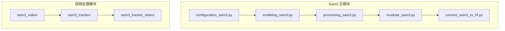
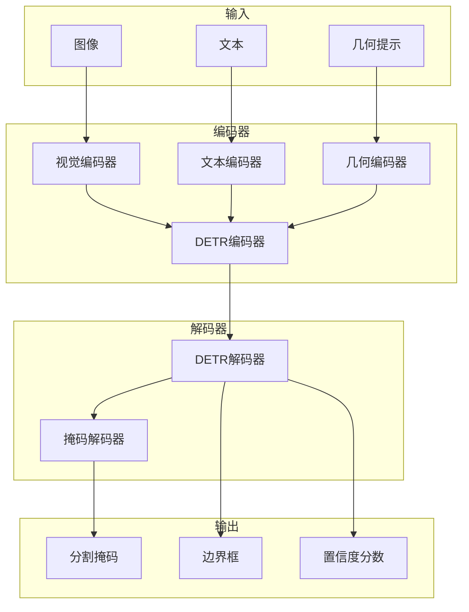
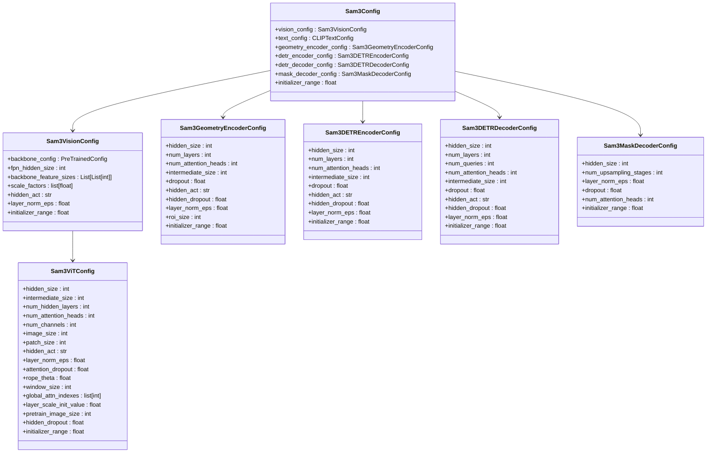
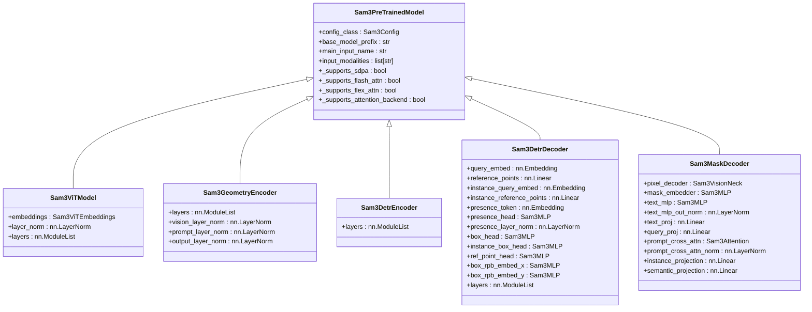
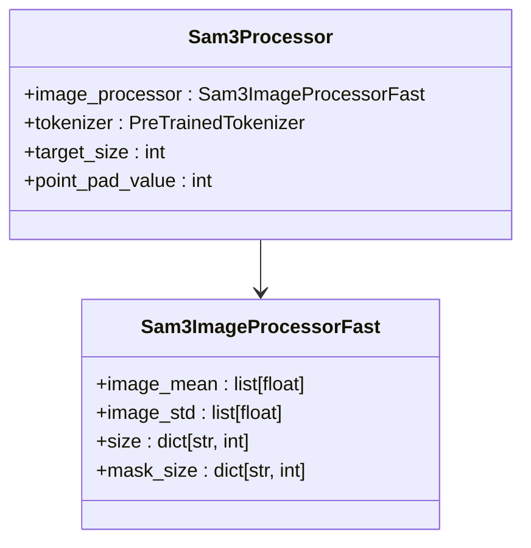
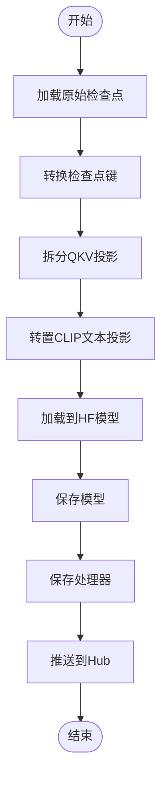
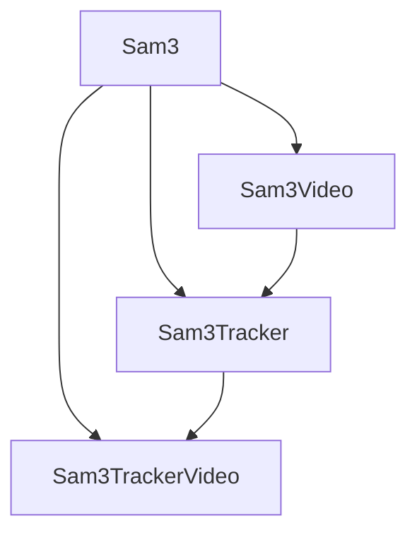

# Sam3

<cite>
**本文档引用的文件**
- [configuration_sam3.py](file://src/transformers/models/sam3/configuration_sam3.py)
- [modeling_sam3.py](file://src/transformers/models/sam3/modeling_sam3.py)
- [processing_sam3.py](file://src/transformers/models/sam3/processing_sam3.py)
- [modular_sam3.py](file://src/transformers/models/sam3/modular_sam3.py)
- [convert_sam3_to_hf.py](file://src/transformers/models/sam3/convert_sam3_to_hf.py)
- [configuration_sam3_video.py](file://src/transformers/models/sam3_video/configuration_sam3_video.py)
- [modeling_sam3_video.py](file://src/transformers/models/sam3_video/modeling_sam3_video.py)
- [configuration_sam3_tracker.py](file://src/transformers/models/sam3_tracker/configuration_sam3_tracker.py)
- [modeling_sam3_tracker.py](file://src/transformers/models/sam3_tracker/modeling_sam3_tracker.py)
- [configuration_sam3_tracker_video.py](file://src/transformers/models/sam3_tracker_video/configuration_sam3_tracker_video.py)
- [modeling_sam3_tracker_video.py](file://src/transformers/models/sam3_tracker_video/modeling_sam3_tracker_video.py)
</cite>

## 目录
1. [简介](#简介)
2. [项目结构](#项目结构)
3. [核心组件](#核心组件)
4. [架构概述](#架构概述)
5. [详细组件分析](#详细组件分析)
6. [依赖分析](#依赖分析)
7. [性能考虑](#性能考虑)
8. [故障排除指南](#故障排除指南)
9. [结论](#结论)

## 简介
Sam3是Hugging Face Transformers库中的一个先进模型，用于图像分割和视频对象跟踪。它结合了检测和跟踪功能，能够处理静态图像和视频序列。该模型基于Meta AI的Segment Anything Model 3（SAM3）架构，提供了强大的分割能力，支持文本提示和几何提示。

**Section sources**
- [configuration_sam3.py](file://src/transformers/models/sam3/configuration_sam3.py#L1-L519)
- [modeling_sam3.py](file://src/transformers/models/sam3/modeling_sam3.py#L1-L2397)

## 项目结构
Sam3模型在Transformers库中的结构遵循模块化设计，主要组件位于`src/transformers/models/sam3`目录下。该模型包括多个子模块，如`sam3_video`、`sam3_tracker`和`sam3_tracker_video`，用于处理不同的任务。

**Diagram sources**
- [configuration_sam3.py](file://src/transformers/models/sam3/configuration_sam3.py#L1-L519)
- [modeling_sam3.py](file://src/transformers/models/sam3/modeling_sam3.py#L1-L2397)
- [processing_sam3.py](file://src/transformers/models/sam3/processing_sam3.py#L1-L673)
- [modular_sam3.py](file://src/transformers/models/sam3/modular_sam3.py#L1-L258)
- [convert_sam3_to_hf.py](file://src/transformers/models/sam3/convert_sam3_to_hf.py#L1-L476)

**Section sources**
- [configuration_sam3.py](file://src/transformers/models/sam3/configuration_sam3.py#L1-L519)
- [modeling_sam3.py](file://src/transformers/models/sam3/modeling_sam3.py#L1-L2397)
- [processing_sam3.py](file://src/transformers/models/sam3/processing_sam3.py#L1-L673)
- [modular_sam3.py](file://src/transformers/models/sam3/modular_sam3.py#L1-L258)
- [convert_sam3_to_hf.py](file://src/transformers/models/sam3/convert_sam3_to_hf.py#L1-L476)

## 核心组件
Sam3模型的核心组件包括配置、建模、处理和转换模块。这些组件共同工作，实现图像分割和视频跟踪功能。

**Section sources**
- [configuration_sam3.py](file://src/transformers/models/sam3/configuration_sam3.py#L1-L519)
- [modeling_sam3.py](file://src/transformers/models/sam3/modeling_sam3.py#L1-L2397)
- [processing_sam3.py](file://src/transformers/models/sam3/processing_sam3.py#L1-L673)
- [modular_sam3.py](file://src/transformers/models/sam3/modular_sam3.py#L1-L258)
- [convert_sam3_to_hf.py](file://src/transformers/models/sam3/convert_sam3_to_hf.py#L1-L476)

## 架构概述
Sam3模型的架构由多个子系统组成，包括视觉编码器、文本编码器、几何编码器、DETR编码器和解码器以及掩码解码器。这些组件协同工作，实现高效的图像分割和视频跟踪。

**Diagram sources**
- [configuration_sam3.py](file://src/transformers/models/sam3/configuration_sam3.py#L1-L519)
- [modeling_sam3.py](file://src/transformers/models/sam3/modeling_sam3.py#L1-L2397)

## 详细组件分析

### 配置组件分析
Sam3的配置组件定义了模型的各个部分的参数，包括视觉编码器、文本编码器、几何编码器、DETR编码器和解码器以及掩码解码器。

**Diagram sources**
- [configuration_sam3.py](file://src/transformers/models/sam3/configuration_sam3.py#L1-L519)

**Section sources**
- [configuration_sam3.py](file://src/transformers/models/sam3/configuration_sam3.py#L1-L519)

### 建模组件分析
Sam3的建模组件实现了模型的核心功能，包括视觉编码器、文本编码器、几何编码器、DETR编码器和解码器以及掩码解码器。

**Diagram sources**
- [modeling_sam3.py](file://src/transformers/models/sam3/modeling_sam3.py#L1-L2397)

**Section sources**
- [modeling_sam3.py](file://src/transformers/models/sam3/modeling_sam3.py#L1-L2397)

### 处理组件分析
Sam3的处理组件负责将输入数据转换为模型可以处理的格式，并将模型输出转换为用户友好的格式。

**Diagram sources**
- [processing_sam3.py](file://src/transformers/models/sam3/processing_sam3.py#L1-L673)
- [modular_sam3.py](file://src/transformers/models/sam3/modular_sam3.py#L1-L258)

**Section sources**
- [processing_sam3.py](file://src/transformers/models/sam3/processing_sam3.py#L1-L673)
- [modular_sam3.py](file://src/transformers/models/sam3/modular_sam3.py#L1-L258)

### 转换组件分析
Sam3的转换组件负责将原始的SAM3检查点转换为Hugging Face格式。

**Diagram sources**
- [convert_sam3_to_hf.py](file://src/transformers/models/sam3/convert_sam3_to_hf.py#L1-L476)

**Section sources**
- [convert_sam3_to_hf.py](file://src/transformers/models/sam3/convert_sam3_to_hf.py#L1-L476)

## 依赖分析
Sam3模型依赖于多个子模块和外部库，包括视频处理模块、跟踪模块和视频跟踪模块。

**Diagram sources**
- [configuration_sam3_video.py](file://src/transformers/models/sam3_video/configuration_sam3_video.py#L1-L230)
- [modeling_sam3_video.py](file://src/transformers/models/sam3_video/modeling_sam3_video.py#L1-L2001)
- [configuration_sam3_tracker.py](file://src/transformers/models/sam3_tracker/configuration_sam3_tracker.py#L1-L241)
- [modeling_sam3_tracker.py](file://src/transformers/models/sam3_tracker/modeling_sam3_tracker.py#L1-L1095)
- [configuration_sam3_tracker_video.py](file://src/transformers/models/sam3_tracker_video/configuration_sam3_tracker_video.py#L1-L402)
- [modeling_sam3_tracker_video.py](file://src/transformers/models/sam3_tracker_video/modeling_sam3_tracker_video.py#L1-L1095)

**Section sources**
- [configuration_sam3_video.py](file://src/transformers/models/sam3_video/configuration_sam3_video.py#L1-L230)
- [modeling_sam3_video.py](file://src/transformers/models/sam3_video/modeling_sam3_video.py#L1-L2001)
- [configuration_sam3_tracker.py](file://src/transformers/models/sam3_tracker/configuration_sam3_tracker.py#L1-L241)
- [modeling_sam3_tracker.py](file://src/transformers/models/sam3_tracker/modeling_sam3_tracker.py#L1-L1095)
- [configuration_sam3_tracker_video.py](file://src/transformers/models/sam3_tracker_video/configuration_sam3_tracker_video.py#L1-L402)
- [modeling_sam3_tracker_video.py](file://src/transformers/models/sam3_tracker_video/modeling_sam3_tracker_video.py#L1-L1095)

## 性能考虑
Sam3模型在设计时考虑了性能优化，包括使用高效的注意力机制、分层特征金字塔网络（FPN）和多尺度特征处理。这些设计选择有助于提高模型的推理速度和内存效率。

## 故障排除指南
在使用Sam3模型时，可能会遇到一些常见问题。以下是一些故障排除建议：

1. **模型加载失败**：确保检查点文件路径正确，并且文件格式与Hugging Face格式兼容。
2. **内存不足**：尝试减少批量大小或使用更小的模型变体。
3. **推理速度慢**：考虑使用混合精度训练或优化模型的注意力机制。

**Section sources**
- [modeling_sam3.py](file://src/transformers/models/sam3/modeling_sam3.py#L1-L2397)
- [convert_sam3_to_hf.py](file://src/transformers/models/sam3/convert_sam3_to_hf.py#L1-L476)

## 结论
Sam3是一个功能强大的图像分割和视频跟踪模型，具有模块化设计和高效的架构。通过深入分析其核心组件和依赖关系，我们可以更好地理解和使用这个模型。未来的工作可以进一步优化模型的性能和扩展其功能。