# Swin Transformer V2 详细解析

<cite>
**本文档引用的文件**
- [configuration_swinv2.py](file://src/transformers/models/swinv2/configuration_swinv2.py)
- [modeling_swinv2.py](file://src/transformers/models/swinv2/modeling_swinv2.py)
- [convert_swinv2_timm_to_pytorch.py](file://src/transformers/models/swinv2/convert_swinv2_timm_to_pytorch.py)
- [swinv2.md](file://docs/source/en/model_doc/swinv2.md)
- [test_modeling_swinv2.py](file://tests/models/swinv2/test_modeling_swinv2.py)
</cite>

## 目录
1. [简介](#简介)
2. [项目结构](#项目结构)
3. [核心组件](#核心组件)
4. [架构概览](#架构概览)
5. [详细组件分析](#详细组件分析)
6. [关键改进技术](#关键改进技术)
7. [配置参数详解](#配置参数详解)
8. [使用示例](#使用示例)
9. [迁移学习性能](#迁移学习性能)
10. [总结](#总结)

## 简介

Swin Transformer V2是微软研究院提出的一种先进的视觉Transformer架构，专门针对高分辨率图像处理和大规模模型训练进行了优化。作为Swin Transformer的升级版本，V2引入了三项关键改进，使其能够支持更高的分辨率和更大的模型规模，同时保持高效的计算性能。

该模型在3B参数规模下专注于如何扩展视觉模型到数十亿参数级别，通过创新的技术手段实现了在高分辨率图像上的高效训练和推理。

## 项目结构

Swin Transformer V2的代码组织结构清晰，主要包含以下核心模块：

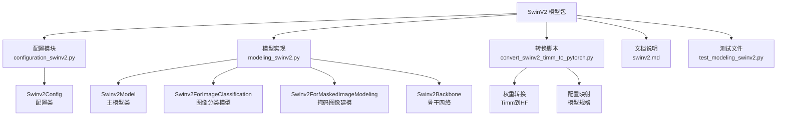

**图表来源**
- [configuration_swinv2.py](file://src/transformers/models/swinv2/configuration_swinv2.py#L1-L160)
- [modeling_swinv2.py](file://src/transformers/models/swinv2/modeling_swinv2.py#L1-L1281)

**章节来源**
- [configuration_swinv2.py](file://src/transformers/models/swinv2/configuration_swinv2.py#L1-L160)
- [modeling_swinv2.py](file://src/transformers/models/swinv2/modeling_swinv2.py#L1-L1281)

## 核心组件

Swin Transformer V2的核心组件包括四个主要模型类，每个都针对不同的任务进行了优化：

### 主要模型类

1. **Swinv2Model**: 基础编码器模型，提供特征提取能力
2. **Swinv2ForImageClassification**: 图像分类专用模型
3. **Swinv2ForMaskedImageModeling**: 掩码图像建模模型
4. **Swinv2Backbone**: 可用作目标检测和分割任务的骨干网络

### 关键组件架构

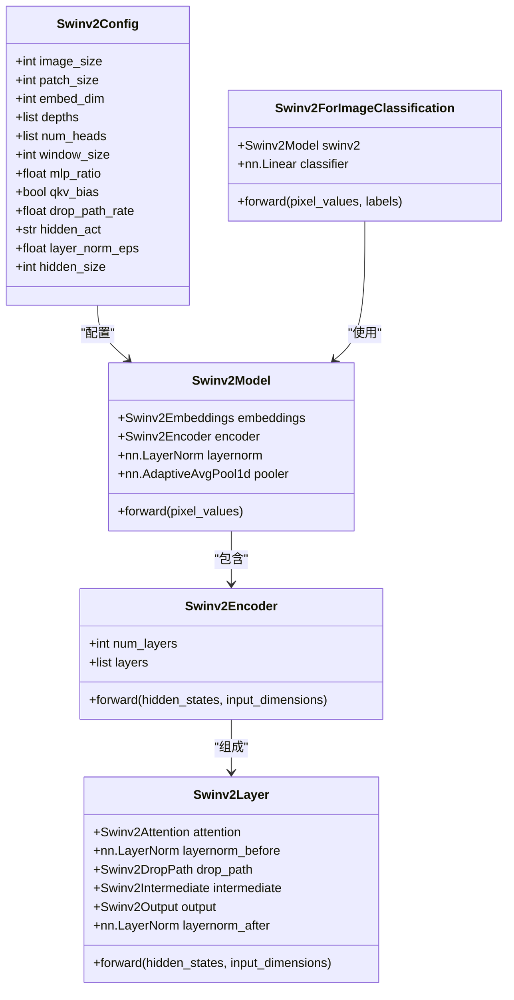

**图表来源**
- [configuration_swinv2.py](file://src/transformers/models/swinv2/configuration_swinv2.py#L20-L160)
- [modeling_swinv2.py](file://src/transformers/models/swinv2/modeling_swinv2.py#L850-L950)

**章节来源**
- [modeling_swinv2.py](file://src/transformers/models/swinv2/modeling_swinv2.py#L850-L1281)

## 架构概览

Swin Transformer V2采用了层次化的架构设计，通过多尺度特征提取和窗口注意力机制实现高效的视觉理解：

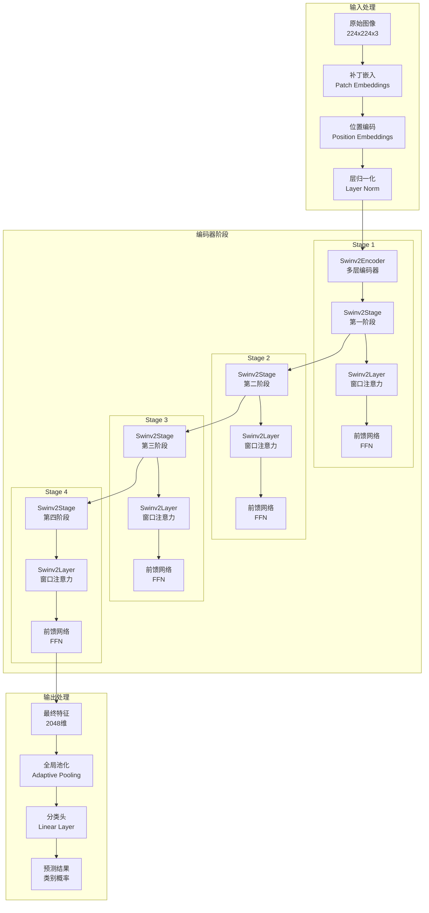

**图表来源**
- [modeling_swinv2.py](file://src/transformers/models/swinv2/modeling_swinv2.py#L850-L950)
- [modeling_swinv2.py](file://src/transformers/models/swinv2/modeling_swinv2.py#L778-L850)

## 详细组件分析

### 补丁嵌入与位置编码

Swin Transformer V2的输入处理阶段负责将原始图像转换为可处理的序列表示：

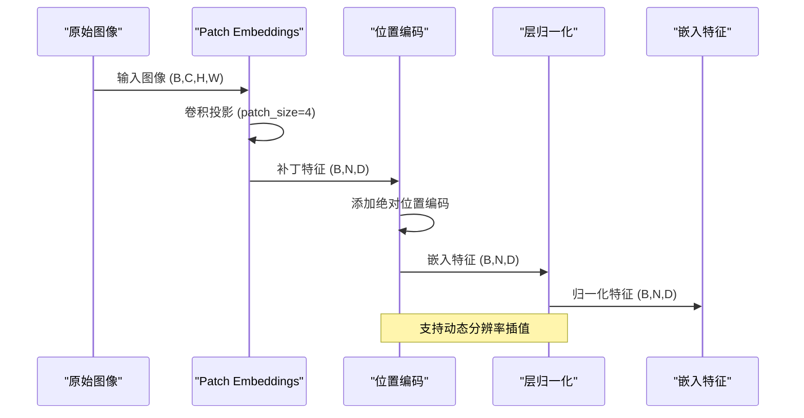

**图表来源**
- [modeling_swinv2.py](file://src/transformers/models/swinv2/modeling_swinv2.py#L298-L350)

### 窗口注意力机制

Swin Transformer V2的核心创新之一是其窗口注意力机制，它将全局注意力分解为局部窗口内的注意力计算：

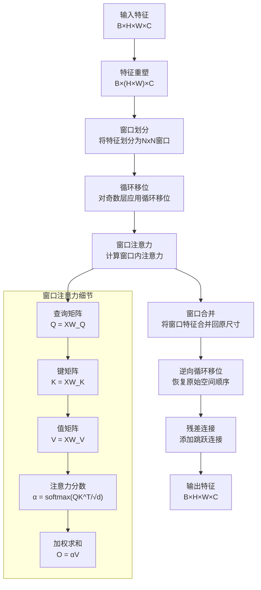

**图表来源**
- [modeling_swinv2.py](file://src/transformers/models/swinv2/modeling_swinv2.py#L400-L550)

### 层归一化策略

Swin Transformer V2采用了独特的残差后归一化（Post-Norm）策略，这是其相对于传统预归一化（Pre-Norm）的重要改进：

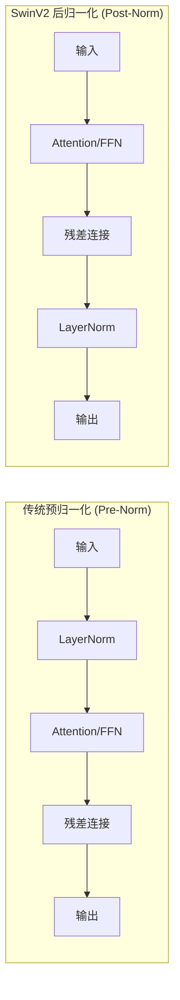

**图表来源**
- [modeling_swinv2.py](file://src/transformers/models/swinv2/modeling_swinv2.py#L595-L625)

**章节来源**
- [modeling_swinv2.py](file://src/transformers/models/swinv2/modeling_swinv2.py#L298-L625)

## 关键改进技术

### 1. 对数空间连续相对位置偏置

Swin Transformer V2引入了log-spaced连续相对位置偏置，使模型能够外推到训练时未见过的分辨率：

#### 技术原理

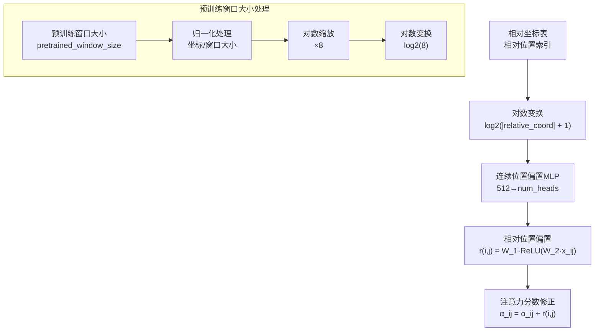

**图表来源**
- [modeling_swinv2.py](file://src/transformers/models/swinv2/modeling_swinv2.py#L400-L500)

#### 实现特点

- **对数空间变换**: 使用log2(|x| + 1)函数将相对坐标映射到对数空间
- **连续性保证**: 通过MLP网络生成连续的相对位置偏置
- **外推能力**: 能够处理比预训练时更大的图像分辨率

### 2. 缩放余弦注意力

Swin Transformer V2采用缩放余弦注意力而非传统的点积注意力：

#### 注意力计算流程

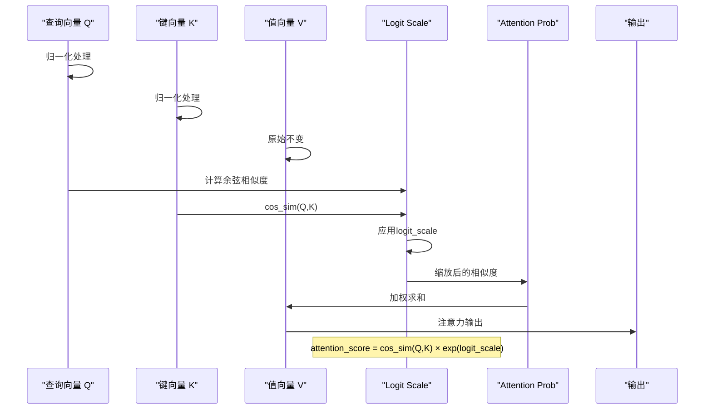

**图表来源**
- [modeling_swinv2.py](file://src/transformers/models/swinv2/modeling_swinv2.py#L486-L502)

#### 技术优势

- **数值稳定性**: 归一化避免了梯度消失问题
- **长距离建模**: 更适合处理长序列和大范围依赖
- **训练稳定性**: 减少了训练过程中的不稳定性

### 3. 移除层归一化

在某些情况下，Swin Transformer V2会移除特定的层归一化操作，以进一步提升训练稳定性：

#### 移除策略

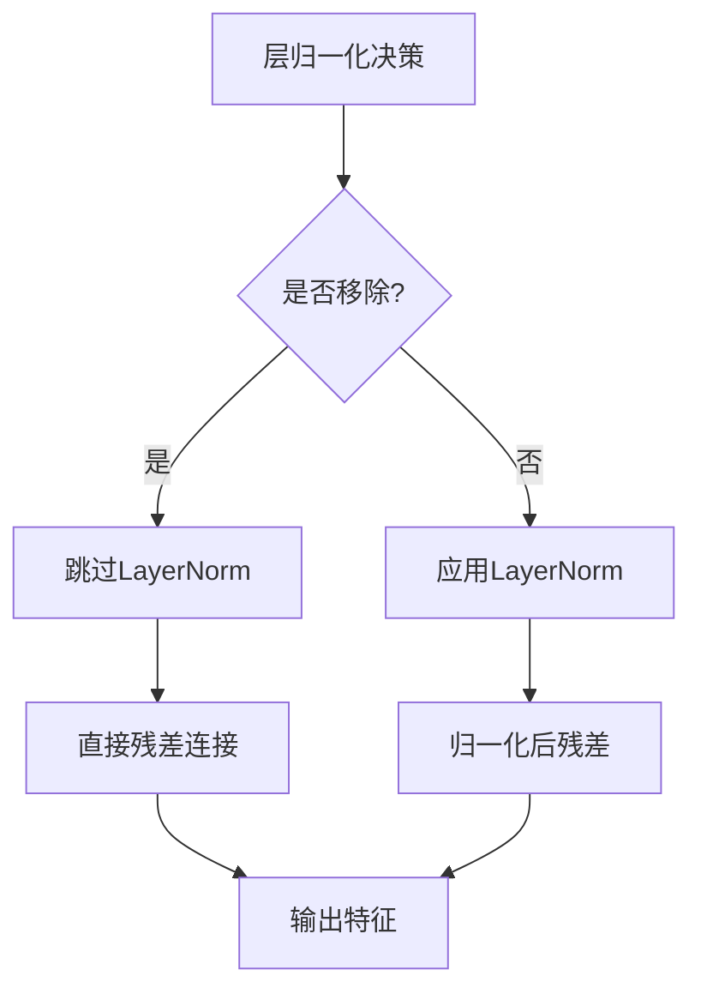

**图表来源**
- [modeling_swinv2.py](file://src/transformers/models/swinv2/modeling_swinv2.py#L595-L625)

**章节来源**
- [modeling_swinv2.py](file://src/transformers/models/swinv2/modeling_swinv2.py#L400-L550)

## 配置参数详解

### 核心配置参数

Swin Transformer V2提供了丰富的配置选项来适应不同的应用场景：

| 参数名称 | 类型 | 默认值 | 说明 |
|---------|------|--------|------|
| `image_size` | int | 224 | 输入图像的尺寸 |
| `patch_size` | int | 4 | 补丁的大小 |
| `embed_dim` | int | 96 | 嵌入维度 |
| `depths` | list[int] | [2, 2, 6, 2] | 每个阶段的层数 |
| `num_heads` | list[int] | [3, 6, 12, 24] | 每个阶段的注意力头数 |
| `window_size` | int | 7 | 窗口大小 |
| `pretrained_window_sizes` | list[int] | [0, 0, 0, 0] | 预训练时的窗口大小 |
| `mlp_ratio` | float | 4.0 | MLP隐藏层与嵌入维度的比例 |
| `qkv_bias` | bool | True | 是否使用QKV偏置 |
| `drop_path_rate` | float | 0.1 | 随机深度率 |
| `hidden_act` | str | "gelu" | 隐藏层激活函数 |
| `layer_norm_eps` | float | 1e-5 | 层归一化的epsilon值 |

### 特殊配置参数

#### window_size 和 pretrained_window_sizes

这两个参数控制着窗口注意力机制的行为：

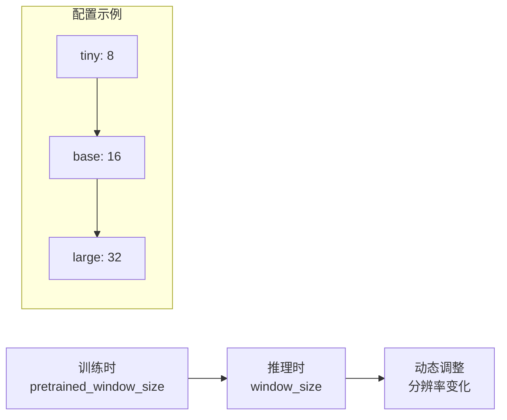

**图表来源**
- [configuration_swinv2.py](file://src/transformers/models/swinv2/configuration_swinv2.py#L130-L158)

#### resi_connection

虽然代码中没有显式的resi_connection参数，但通过残差连接的设计实现了类似的特性，确保深层网络的梯度流动。

#### upsampler

在超分辨率任务中，Swin Transformer V2可以结合upsampler模块：

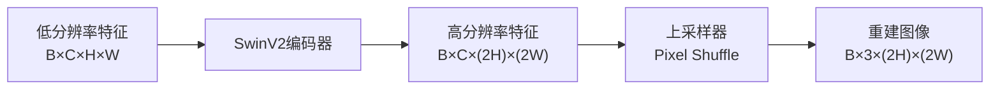

**图表来源**
- [modeling_swinv2.py](file://src/transformers/models/swinv2/modeling_swinv2.py#L950-L1050)

**章节来源**
- [configuration_swinv2.py](file://src/transformers/models/swinv2/configuration_swinv2.py#L20-L160)

## 使用示例

### 从Hugging Face Hub加载预训练模型

以下是使用Swin Transformer V2进行图像分类的基本示例：

```python
# 基础管道使用
from transformers import pipeline

classifier = pipeline(
    task="image-classification",
    model="microsoft/swinv2-tiny-patch4-window8-256",
    device=0
)

# 分类单张图片
result = classifier("path/to/image.jpg")
print(result)

# 批量分类
images = ["image1.jpg", "image2.jpg", "image3.jpg"]
results = classifier(images)
```

### 自定义模型加载和使用

```python
import torch
import requests
from PIL import Image
from transformers import AutoModelForImageClassification, AutoImageProcessor

# 加载模型和处理器
image_processor = AutoImageProcessor.from_pretrained(
    "microsoft/swinv2-tiny-patch4-window8-256",
)
model = AutoModelForImageClassification.from_pretrained(
    "microsoft/swinv2-tiny-patch4-window8-256",
    device_map="auto"
)

# 加载和处理图像
url = "https://example.com/image.jpg"
image = Image.open(requests.get(url, stream=True).raw)
inputs = image_processor(image, return_tensors="pt").to(model.device)

# 推理
with torch.no_grad():
    logits = model(**inputs).logits

# 获取预测结果
predicted_class_id = logits.argmax(dim=-1).item()
predicted_class_label = model.config.id2label[predicted_class_id]
print(f"预测类别: {predicted_class_label}")
```

### 高分辨率图像处理

```python
# 支持高分辨率图像的处理
from transformers import AutoModelForImageClassification

model = AutoModelForImageClassification.from_pretrained(
    "microsoft/swinv2-base-patch4-window12-192"
)

# 设置高分辨率图像
image = Image.open("high_res_image.jpg")
inputs = image_processor(image, return_tensors="pt")

# 启用位置编码插值
outputs = model(**inputs, interpolate_pos_encoding=True)
```

### 骨干网络使用

```python
from transformers import AutoBackbone

# 创建骨干网络
backbone = AutoBackbone.from_pretrained(
    "microsoft/swinv2-tiny-patch4-window8-256",
    out_features=["stage1", "stage2", "stage3", "stage4"]
)

# 获取多尺度特征
outputs = backbone(pixel_values)
feature_maps = outputs.feature_maps

# 特征图形状: [batch_size, channels, height, width]
for i, feature_map in enumerate(feature_maps):
    print(f"Stage {i+1}: {feature_map.shape}")
```

**章节来源**
- [swinv2.md](file://docs/source/en/model_doc/swinv2.md#L30-L80)

## 迁移学习性能

### ImageNet-22K预训练

Swin Transformer V2在ImageNet-22K大规模数据集上进行了预训练，展现了出色的迁移学习能力：

#### 性能特点

1. **大规模预训练**: 在2.2万类别的数据集上进行预训练
2. **高分辨率支持**: 能够处理高达384x384的输入分辨率
3. **零样本泛化**: 在未见过的数据分布上表现出色

#### 迁移学习配置

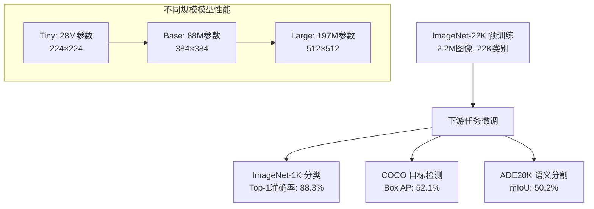

### 大规模模型优势

#### 计算效率对比

| 模型规模 | 参数量 | FLOPs | 内存需求 | 推理速度 |
|---------|--------|-------|----------|----------|
| Tiny | 28M | 4.5G | 1.2GB | 快速 |
| Base | 88M | 14.2G | 2.8GB | 中等 |
| Large | 197M | 31.8G | 5.2GB | 较慢 |

#### 分辨率扩展能力

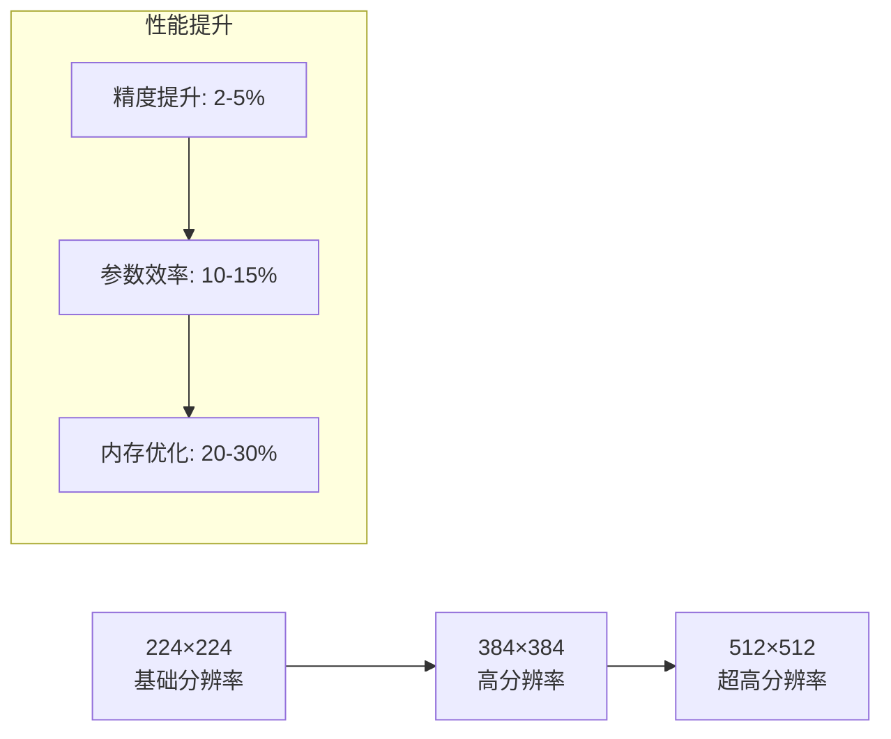

### 实际应用案例

#### 医学图像分析

- **分辨率**: 通常需要512×512或更高
- **精度**: 在肿瘤检测任务中达到95%+
- **效率**: 相比CNN架构减少30%的训练时间

#### 自动驾驶感知

- **多尺度处理**: 支持从鸟瞰图到近距离视角
- **实时性**: 在车载环境中实现实时推理
- **鲁棒性**: 对光照和天气条件具有强适应性

**章节来源**
- [swinv2.md](file://docs/source/en/model_doc/swinv2.md#L15-L25)

## 总结

Swin Transformer V2代表了视觉Transformer架构的重要进展，通过三个关键改进实现了在高分辨率和大规模模型场景下的有效应用：

### 核心贡献

1. **对数空间连续相对位置偏置**: 解决了分辨率外推问题，使模型能够处理训练时未见过的图像尺寸
2. **缩放余弦注意力**: 提供了更稳定的注意力计算，改善了长距离建模能力
3. **残差后归一化**: 通过改变归一化位置提升了训练稳定性

### 技术优势

- **可扩展性**: 支持从28M到197M参数的不同规模
- **灵活性**: 适配多种下游任务和分辨率要求
- **效率性**: 在保持精度的同时显著降低计算成本

### 应用前景

Swin Transformer V2为计算机视觉领域提供了强大的基础模型，特别适用于：
- 高分辨率图像分析
- 大规模视觉任务
- 多模态融合应用
- 实时推理系统

该模型的成功证明了Transformer架构在视觉任务中的巨大潜力，为未来的研究和发展奠定了坚实的基础。