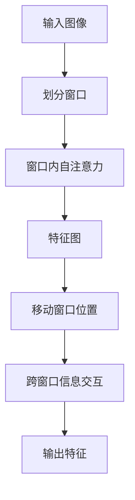
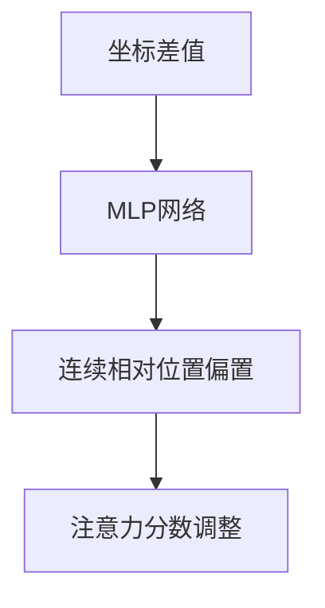
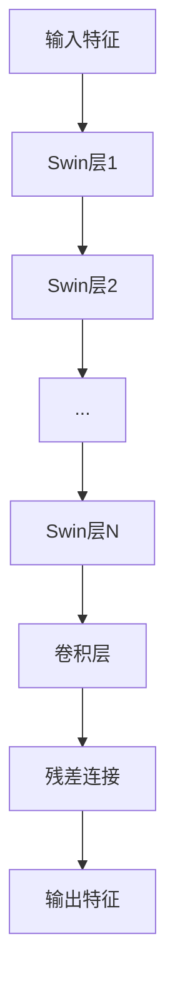
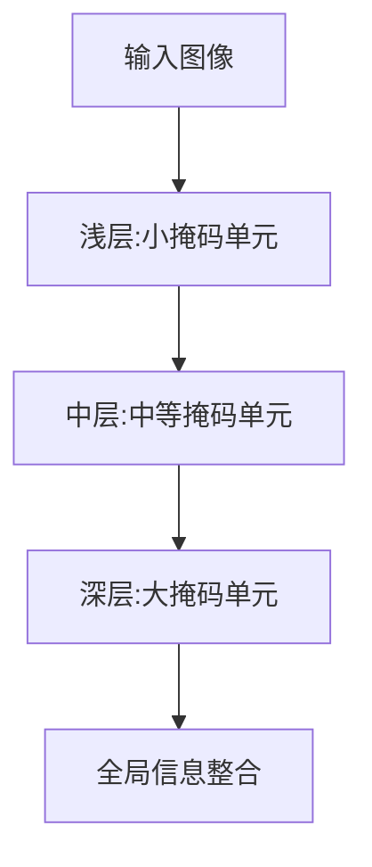

# Swin Transformer系列

<cite>
**本文档引用的文件**
- [modeling_swin.py](file://src/transformers/models/swin/modeling_swin.py)
- [configuration_swin.py](file://src/transformers/models/swin/configuration_swin.py)
- [modeling_swinv2.py](file://src/transformers/models/swinv2/modeling_swinv2.py)
- [configuration_swinv2.py](file://src/transformers/models/swinv2/configuration_swinv2.py)
- [modeling_swin2sr.py](file://src/transformers/models/swin2sr/modeling_swin2sr.py)
- [configuration_swin2sr.py](file://src/transformers/models/swin2sr/configuration_swin2sr.py)
- [modeling_hiera.py](file://src/transformers/models/hiera/modeling_hiera.py)
- [configuration_hiera.py](file://src/transformers/models/hiera/configuration_hiera.py)
</cite>

## 目录
1. [引言](#引言)
2. [Swin Transformer核心技术](#swin-transformer核心技术)
3. [SwinV2改进](#swinv2改进)
4. [Swin2SR图像超分辨率应用](#swin2sr图像超分辨率应用)
5. [Hiera层次化架构](#hiera层次化架构)
6. [配置参数分析](#配置参数分析)
7. [性能对比与应用场景](#性能对比与应用场景)
8. [结论](#结论)

## 引言

Swin Transformer系列模型是基于Transformer架构的视觉模型，通过引入层次化窗口注意力机制，在保持Transformer全局建模能力的同时，显著提升了计算效率。该系列模型在图像分类、目标检测、语义分割等密集预测任务中表现出色，成为视觉Transformer领域的重要进展。本文将深入解析Swin Transformer及其变体的核心技术，包括滑动窗口、相对位置偏置、阶段式下采样等机制，并探讨SwinV2、Swin2SR和Hiera等改进版本的创新点。

**Section sources**
- [modeling_swin.py](file://src/transformers/models/swin/modeling_swin.py#L0-L1213)

## Swin Transformer核心技术

Swin Transformer的核心创新在于其层次化窗口注意力机制。与标准ViT在整个图像上计算全局注意力不同，Swin Transformer将图像划分为不重叠的窗口，在每个窗口内计算自注意力，从而将计算复杂度从O(N²)降低到O(M²N)，其中N是图像块总数，M是窗口大小。

### 滑动窗口与相对位置偏置

Swin Transformer通过滑动窗口机制实现局部与全局信息的交互。模型在偶数层使用常规窗口划分，在奇数层将窗口向右下方移动半个窗口大小，使得相邻窗口之间产生重叠，从而允许信息在不同窗口间流动。

**Diagram sources**
- [modeling_swin.py](file://src/transformers/models/swin/modeling_swin.py#L541-L561)
- [modeling_swin.py](file://src/transformers/models/swin/modeling_swin.py#L653-L688)

相对位置偏置是Swin Transformer的另一项关键技术。模型引入可学习的相对位置偏置矩阵，为不同相对位置的token对添加偏置，从而编码位置信息。这种设计比绝对位置编码更能捕捉局部结构关系。

### 阶段式下采样

Swin Transformer采用类似CNN的层次化架构，通过阶段式下采样逐步降低特征图分辨率并增加通道数。每个阶段由多个Swin层组成，阶段之间通过Patch Merging模块实现下采样，将相邻的2×2个patch合并为一个patch，通道数翻倍。

**Section sources**
- [modeling_swin.py](file://src/transformers/models/swin/modeling_swin.py#L541-L561)
- [modeling_swin.py](file://src/transformers/models/swin/modeling_swin.py#L653-L688)

## SwinV2改进

SwinV2在原始Swin Transformer基础上进行了多项重要改进，显著提升了模型性能和可扩展性。

### 连续相对位置偏置

SwinV2用连续相对位置偏置取代了离散的相对位置偏置。通过一个多层感知机(MLP)从坐标差值生成连续的相对位置偏置，这种设计使得模型能够更好地外推到比训练时更大的图像尺寸。

**Diagram sources**
- [modeling_swinv2.py](file://src/transformers/models/swinv2/modeling_swinv2.py#L223-L249)

### 对数连续坐标

SwinV2引入对数连续坐标来处理不同尺度的相对位置。通过对坐标进行对数变换，模型能够更好地处理远距离token之间的关系，增强了模型的尺度适应能力。

### 预训练窗口大小

SwinV2在配置中增加了预训练窗口大小参数，允许模型在不同分辨率下进行预训练和微调。这种设计使得大模型可以从高分辨率预训练中受益，然后在更高分辨率的任务上进行微调。

**Section sources**
- [modeling_swinv2.py](file://src/transformers/models/swinv2/modeling_swinv2.py#L223-L249)
- [configuration_swinv2.py](file://src/transformers/models/swinv2/configuration_swinv2.py#L0-L159)

## Swin2SR图像超分辨率应用

Swin2SR是Swin Transformer在图像超分辨率任务上的专门优化版本，针对该任务的特点进行了多项改进。

### 残差Swin Transformer块

Swin2SR采用残差Swin Transformer块(RSTB)作为基本构建单元。每个RSTB包含多个Swin层，并在块的末尾添加卷积层作为残差连接，这种设计有助于稳定训练过程并提升重建质量。

**Diagram sources**
- [modeling_swin2sr.py](file://src/transformers/models/swin2sr/modeling_swin2sr.py#L559-L591)

### 多尺度上采样

Swin2SR支持多种上采样策略，包括像素重排(pixelshuffle)、最近邻插值加卷积等。这些上采样模块被集成在模型的最后阶段，用于将低分辨率特征图恢复到高分辨率输出。

### 配置参数优化

Swin2SR的配置针对超分辨率任务进行了优化，如较小的patch大小(默认为1)、特定的上采样因子等。这些参数设置使得模型能够更好地捕捉图像的高频细节。

**Section sources**
- [modeling_swin2sr.py](file://src/transformers/models/swin2sr/modeling_swin2sr.py#L559-L591)
- [configuration_swin2sr.py](file://src/transformers/models/swin2sr/configuration_swin2sr.py#L0-L154)

## Hiera层次化架构

Hiera模型进一步发展了层次化Transformer的思想，引入了更复杂的层次结构和掩码单元注意力机制。

### 掩码单元注意力

Hiera采用掩码单元注意力机制，在不同层次上使用不同大小的注意力窗口。在浅层使用较小的掩码单元进行局部注意力计算，在深层使用较大的窗口进行全局信息整合。

**Diagram sources**
- [modeling_hiera.py](file://src/transformers/models/hiera/modeling_hiera.py#L0-L799)

### 查询池化

Hiera引入查询池化机制，在特定层次对查询进行下采样，从而减少计算量。这种设计允许模型在保持高性能的同时，有效控制计算复杂度。

### 多尺度处理

Hiera支持多尺度输入处理，能够灵活适应不同分辨率的图像。通过配置不同的patch stride和masked unit size，模型可以在不同尺度上进行特征提取。

**Section sources**
- [modeling_hiera.py](file://src/transformers/models/hiera/modeling_hiera.py#L0-L799)
- [configuration_hiera.py](file://src/transformers/models/hiera/configuration_hiera.py#L0-L194)

## 配置参数分析

Swin Transformer系列模型的性能受多个关键配置参数的影响，理解这些参数的作用对于模型调优至关重要。

### window_size

窗口大小决定了注意力计算的局部范围。较小的窗口大小降低了计算复杂度但可能损失全局信息，较大的窗口大小则相反。通常在7-12之间选择，需要根据任务需求和计算资源权衡。

### depths

深度参数控制每个阶段的层数。更深的网络具有更强的表示能力，但也更容易过拟合且计算成本更高。通常在浅层使用较少层数，在深层使用较多层数以构建层次化特征。

### num_heads

注意力头数影响模型捕捉不同特征子空间的能力。更多的头数可以并行学习更多特征模式，但也会增加参数量和计算开销。通常设置为嵌入维度的约数。

### embed_dim

嵌入维度决定了特征表示的宽度。较大的嵌入维度可以编码更丰富的信息，但会显著增加计算和内存需求。通常在96-384之间选择，与网络深度和任务复杂度相匹配。

**Section sources**
- [configuration_swin.py](file://src/transformers/models/swin/configuration_swin.py#L0-L157)
- [configuration_swinv2.py](file://src/transformers/models/swinv2/configuration_swinv2.py#L0-L159)

## 性能对比与应用场景

Swin Transformer系列模型在多个基准测试中表现出色，特别是在密集预测任务中。

### 与标准ViT的比较

相比标准ViT，Swin Transformer在计算效率上具有显著优势。在ImageNet分类任务中，Swin-Tiny在相似参数量下比ViT-Base具有更高的准确率和更低的计算成本。这种优势在高分辨率图像处理中尤为明显。

### 图像分类性能

在ImageNet-1K数据集上，Swin系列模型达到了最先进的性能。例如，Swin-Large模型达到了87.3%的top-1准确率，超过了同等规模的CNN和ViT模型。

### 密集预测任务优势

Swin Transformer在目标检测、语义分割等密集预测任务中表现出色。其层次化架构天然适合多尺度特征提取，能够有效捕捉不同尺度的物体和上下文信息。

### 计算资源约束下的配置建议

在计算资源有限的情况下，建议使用较小的窗口大小(如7)、较浅的网络深度(如[2,2,6,2])和适中的嵌入维度(如96)。对于高分辨率输入，可以考虑使用SwinV2的连续相对位置偏置以获得更好的外推性能。

**Section sources**
- [modeling_swin.py](file://src/transformers/models/swin/modeling_swin.py#L0-L1213)
- [modeling_swinv2.py](file://src/transformers/models/swinv2/modeling_swinv2.py#L0-L1281)

## 结论

Swin Transformer系列模型通过创新的层次化窗口注意力机制，成功地将Transformer架构应用于视觉任务，在保持全局建模能力的同时显著提升了计算效率。从原始的Swin Transformer到SwinV2、Swin2SR和Hiera，这一系列模型不断演进，引入了连续相对位置偏置、残差Swin块、掩码单元注意力等创新技术，拓展了模型的应用范围和性能边界。这些模型在图像分类、超分辨率、目标检测等多个任务中取得了优异表现，为视觉Transformer的发展提供了重要方向。