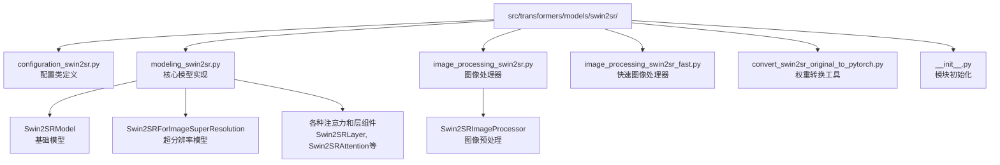
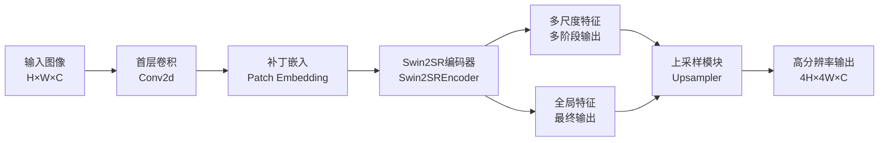
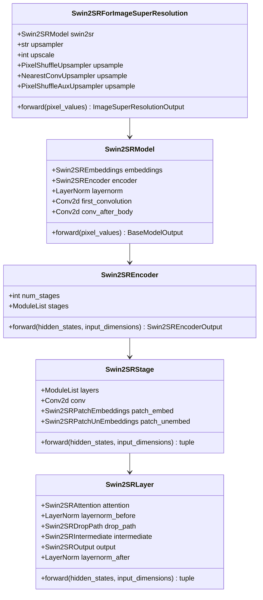
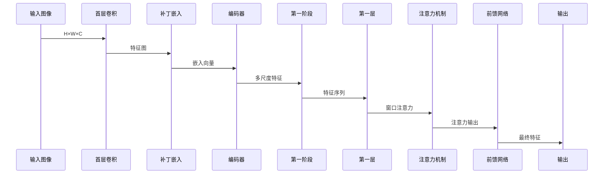
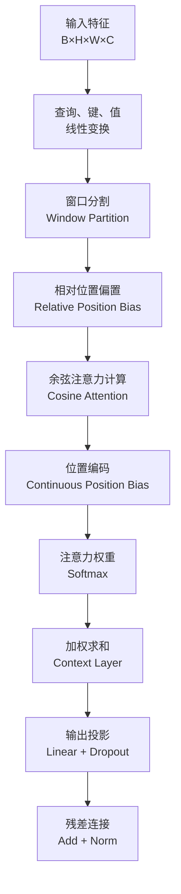
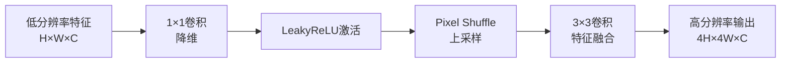
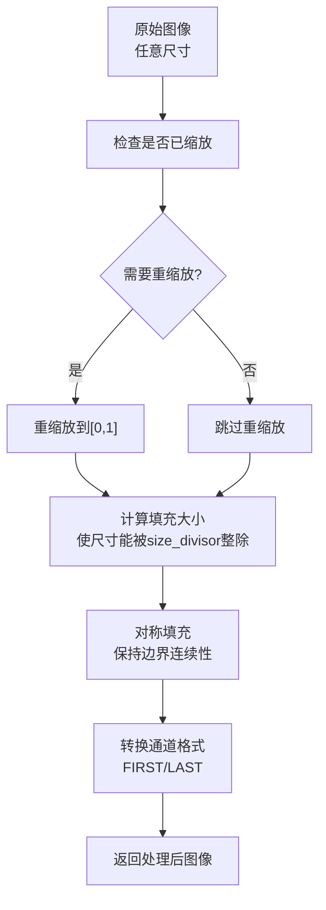
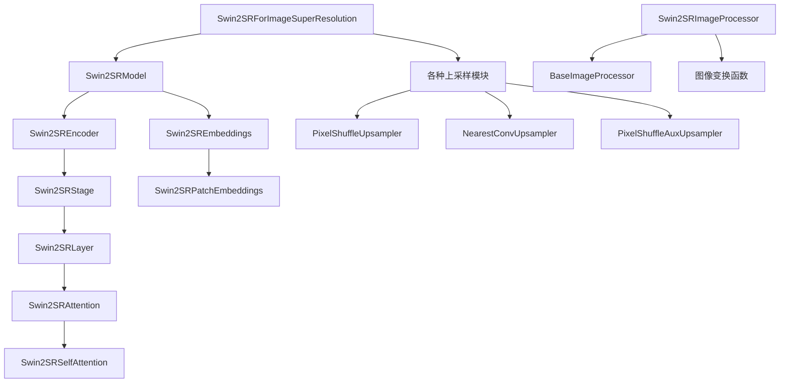

# Swin2SR超分辨率模型深度解析

<cite>
**本文档引用的文件**
- [configuration_swin2sr.py](file://src/transformers/models/swin2sr/configuration_swin2sr.py)
- [modeling_swin2sr.py](file://src/transformers/models/swin2sr/modeling_swin2sr.py)
- [image_processing_swin2sr.py](file://src/transformers/models/swin2sr/image_processing_swin2sr.py)
- [test_modeling_swin2sr.py](file://tests/models/swin2sr/test_modeling_swin2sr.py)
- [swin2sr.md](file://docs/source/en/model_doc/swin2sr.md)
</cite>

## 目录
1. [简介](#简介)
2. [项目结构](#项目结构)
3. [核心组件](#核心组件)
4. [架构概览](#架构概览)
5. [详细组件分析](#详细组件分析)
6. [依赖关系分析](#依赖关系分析)
7. [性能考虑](#性能考虑)
8. [故障排除指南](#故障排除指南)
9. [结论](#结论)

## 简介

Swin2SR是基于Swin Transformer架构的图像超分辨率模型，由Marcos V. Conde等人在论文《Swin2SR: SwinV2 Transformer for Compressed Image Super-Resolution and Restoration》中提出。该模型通过结合Swin Transformer v2层来改进SwinIR模型，在压缩图像超分辨率和恢复任务中表现出色。

Swin2SR解决了传统Transformer视觉模型训练中的主要问题：
- 训练不稳定性
- 预训练与微调之间的分辨率差距
- 数据饥饿问题

该模型在三个代表性任务上进行了实验验证：JPEG压缩伪影去除、图像超分辨率（经典和轻量级）、压缩图像超分辨率。实验结果表明，Swin2SR能够改善SwinIR的训练收敛性和性能，并成为"AIM 2022挑战赛超分辨率压缩图像和视频"的前五名解决方案之一。

## 项目结构

Swin2SR模型在Transformers库中的组织结构如下：

**图表来源**
- [configuration_swin2sr.py](file://src/transformers/models/swin2sr/configuration_swin2sr.py#L1-L155)
- [modeling_swin2sr.py](file://src/transformers/models/swin2sr/modeling_swin2sr.py#L1-L1050)
- [image_processing_swin2sr.py](file://src/transformers/models/swin2sr/image_processing_swin2sr.py#L1-L222)

**章节来源**
- [configuration_swin2sr.py](file://src/transformers/models/swin2sr/configuration_swin2sr.py#L1-L155)
- [modeling_swin2sr.py](file://src/transformers/models/swin2sr/modeling_swin2sr.py#L1-L1050)
- [image_processing_swin2sr.py](file://src/transformers/models/swin2sr/image_processing_swin2sr.py#L1-L222)

## 核心组件

### Swin2SRConfig配置类

Swin2SRConfig是模型的核心配置类，定义了所有超参数和模型架构参数：

| 参数名称 | 类型 | 默认值 | 描述 |
|---------|------|--------|------|
| image_size | int | 64 | 输入图像的尺寸 |
| patch_size | int | 1 | 补丁大小 |
| num_channels | int | 3 | 输入通道数 |
| num_channels_out | int | num_channels | 输出通道数 |
| embed_dim | int | 180 | 补丁嵌入维度 |
| depths | list(int) | [6,6,6,6,6,6] | 每层的深度 |
| num_heads | list(int) | [6,6,6,6,6,6] | 每层的注意力头数 |
| window_size | int | 8 | 窗口大小 |
| mlp_ratio | float | 2.0 | MLP隐藏层与嵌入层的比率 |
| qkv_bias | bool | True | 是否添加QKV偏置 |
| hidden_dropout_prob | float | 0.0 | 嵌入和编码器全连接层的dropout概率 |
| attention_probs_dropout_prob | float | 0.0 | 注意力概率的dropout比率 |
| drop_path_rate | float | 0.1 | 随机深度率 |
| hidden_act | str/function | "gelu" | 编码器中的非线性激活函数 |
| use_absolute_embeddings | bool | False | 是否添加绝对位置嵌入 |
| layer_norm_eps | float | 1e-5 | 层归一化的epsilon值 |
| upscale | int | 2 | 图像放大因子 |
| img_range | float | 1.0 | 输入图像值的范围 |
| resi_connection | str | "1conv" | 每个阶段残差连接前的卷积块 |
| upsampler | str | "pixelshuffle" | 重建模块 |

### 主干网络架构

Swin2SR采用双分支架构设计：

**图表来源**
- [modeling_swin2sr.py](file://src/transformers/models/swin2sr/modeling_swin2sr.py#L670-L720)

**章节来源**
- [configuration_swin2sr.py](file://src/transformers/models/swin2sr/configuration_swin2sr.py#L25-L155)
- [modeling_swin2sr.py](file://src/transformers/models/swin2sr/modeling_swin2sr.py#L670-L720)

## 架构概览

### Swin2SR整体架构

Swin2SR模型的整体架构包含以下关键组件：

**图表来源**
- [modeling_swin2sr.py](file://src/transformers/models/swin2sr/modeling_swin2sr.py#L929-L962)
- [modeling_swin2sr.py](file://src/transformers/models/swin2sr/modeling_swin2sr.py#L670-L720)
- [modeling_swin2sr.py](file://src/transformers/models/swin2sr/modeling_swin2sr.py#L617-L655)
- [modeling_swin2sr.py](file://src/transformers/models/swin2sr/modeling_swin2sr.py#L559-L591)

### 特征提取机制

Swin2SR通过RRDB（Residual in Residual Dense Block）和Swin Transformer的组合来提取特征：

**图表来源**
- [modeling_swin2sr.py](file://src/transformers/models/swin2sr/modeling_swin2sr.py#L670-L720)
- [modeling_swin2sr.py](file://src/transformers/models/swin2sr/modeling_swin2sr.py#L431-L456)

**章节来源**
- [modeling_swin2sr.py](file://src/transformers/models/swin2sr/modeling_swin2sr.py#L670-L720)
- [modeling_swin2sr.py](file://src/transformers/models/swin2sr/modeling_swin2sr.py#L559-L591)

## 详细组件分析

### Swin2SR注意力机制

Swin2SR采用了改进的窗口注意力机制，支持相对位置偏置和余弦注意力：

**图表来源**
- [modeling_swin2sr.py](file://src/transformers/models/swin2sr/modeling_swin2sr.py#L223-L249)
- [modeling_swin2sr.py](file://src/transformers/models/swin2sr/modeling_swin2sr.py#L356-L388)

### 上采样模块设计

Swin2SR提供了多种上采样策略：

#### Pixel Shuffle上采样

**图表来源**
- [modeling_swin2sr.py](file://src/transformers/models/swin2sr/modeling_swin2sr.py#L830-L850)

#### Nearest+Conv上采样

**图表来源**
- [modeling_swin2sr.py](file://src/transformers/models/swin2sr/modeling_swin2sr.py#L852-L875)

### 图像处理器

Swin2SRImageProcessor负责图像预处理，包括重缩放和填充操作：

**图表来源**
- [image_processing_swin2sr.py](file://src/transformers/models/swin2sr/image_processing_swin2sr.py#L100-L221)

**章节来源**
- [modeling_swin2sr.py](file://src/transformers/models/swin2sr/modeling_swin2sr.py#L223-L249)
- [modeling_swin2sr.py](file://src/transformers/models/swin2sr/modeling_swin2sr.py#L830-L875)
- [image_processing_swin2sr.py](file://src/transformers/models/swin2sr/image_processing_swin2sr.py#L100-L221)

## 依赖关系分析

### 模块间依赖关系

**图表来源**
- [modeling_swin2sr.py](file://src/transformers/models/swin2sr/modeling_swin2sr.py#L929-L962)
- [modeling_swin2sr.py](file://src/transformers/models/swin2sr/modeling_swin2sr.py#L670-L720)
- [image_processing_swin2sr.py](file://src/transformers/models/swin2sr/image_processing_swin2sr.py#L40-L60)

### 外部依赖

Swin2SR模型依赖于以下外部库和模块：

| 依赖项 | 版本要求 | 用途 |
|--------|----------|------|
| torch | >= 1.8.0 | 核心深度学习框架 |
| transformers | >= 4.0.0 | 基础模型组件 |
| torchvision | >= 0.9.0 | 图像处理功能 |
| numpy | >= 1.19.0 | 数值计算 |
| Pillow | >= 8.0.0 | 图像处理 |

**章节来源**
- [modeling_swin2sr.py](file://src/transformers/models/swin2sr/modeling_swin2sr.py#L1-L20)
- [image_processing_swin2sr.py](file://src/transformers/models/swin2sr/image_processing_swin2sr.py#L1-L20)

## 性能考虑

### 计算复杂度分析

Swin2SR的计算复杂度主要来自以下几个方面：

1. **注意力机制**: O(H×W×C²)，其中H和W是特征图的高度和宽度，C是通道数
2. **多尺度特征提取**: O(L×H×W×C)，L是层数
3. **上采样操作**: O(scale²×H×W×C)，scale是放大倍数

### 内存优化策略

1. **梯度检查点**: 支持渐进式内存优化
2. **混合精度训练**: 减少GPU内存占用
3. **动态批处理**: 根据可用内存调整批大小

### 推理优化

1. **模型量化**: 支持INT8量化推理
2. **ONNX导出**: 支持跨平台部署
3. **TensorRT加速**: 在NVIDIA GPU上的优化推理

## 故障排除指南

### 常见问题及解决方案

#### 1. 内存不足错误
**问题**: CUDA内存不足
**解决方案**:
- 减小输入图像尺寸
- 使用梯度检查点
- 启用混合精度训练

#### 2. 输入尺寸不匹配
**问题**: 输入图像尺寸不能被窗口大小整除
**解决方案**:
- 使用Swin2SRImageProcessor自动填充
- 设置合适的size_divisor参数

#### 3. 性能问题
**问题**: 推理速度慢
**解决方案**:
- 使用更小的模型变体
- 启用模型量化
- 使用专门的推理引擎

**章节来源**
- [test_modeling_swin2sr.py](file://tests/models/swin2sr/test_modeling_swin2sr.py#L304-L340)

## 结论

Swin2SR是一个创新的图像超分辨率模型，通过结合Swin Transformer v2的优势，成功解决了传统Transformer在视觉任务中的训练不稳定、分辨率差距和数据饥饿等问题。其独特的双分支架构、灵活的上采样策略和完善的预处理管道使其在多个基准测试中取得了优异的表现。

### 主要优势

1. **架构创新**: 双分支设计有效结合了CNN和Transformer的优势
2. **灵活性强**: 支持多种上采样策略和配置选项
3. **易于使用**: 完善的API设计和预处理工具
4. **性能卓越**: 在多个超分辨率任务中表现优异

### 应用前景

Swin2SR在以下领域具有广阔的应用前景：
- 图像增强和修复
- 视频超分辨率
- 医学图像处理
- 虚拟现实和增强现实
- 压缩图像质量提升

通过深入理解Swin2SR的架构设计和实现细节，开发者可以更好地利用这一强大的工具来解决实际的图像处理问题。