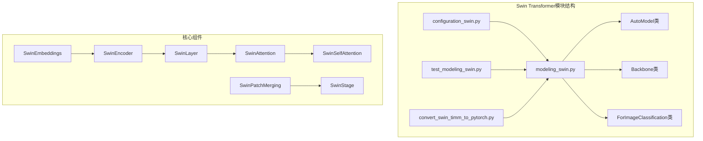
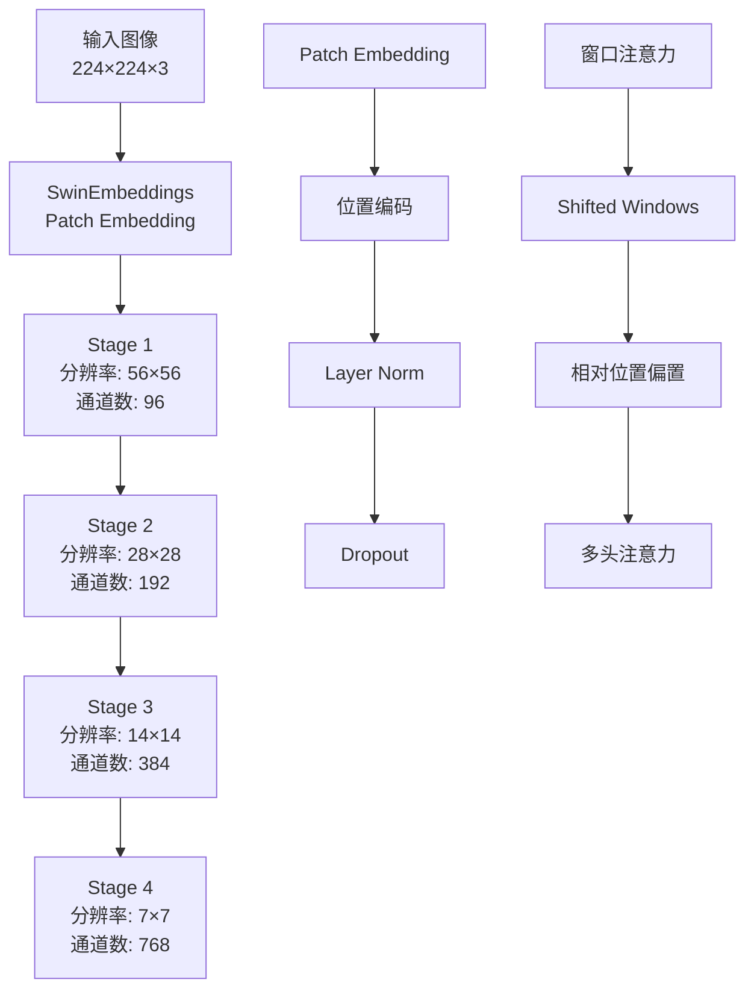
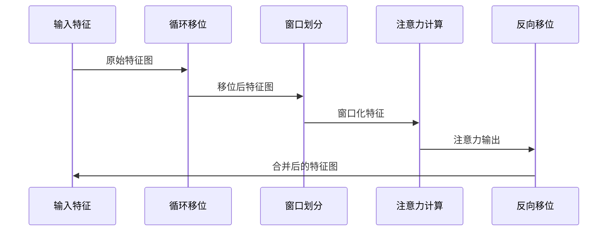
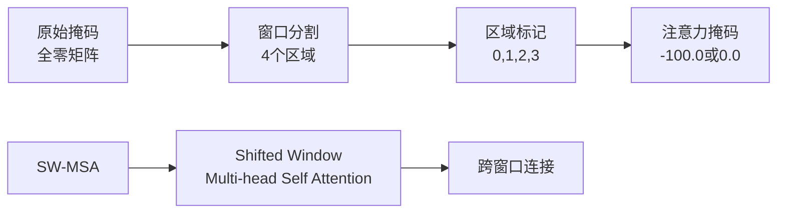
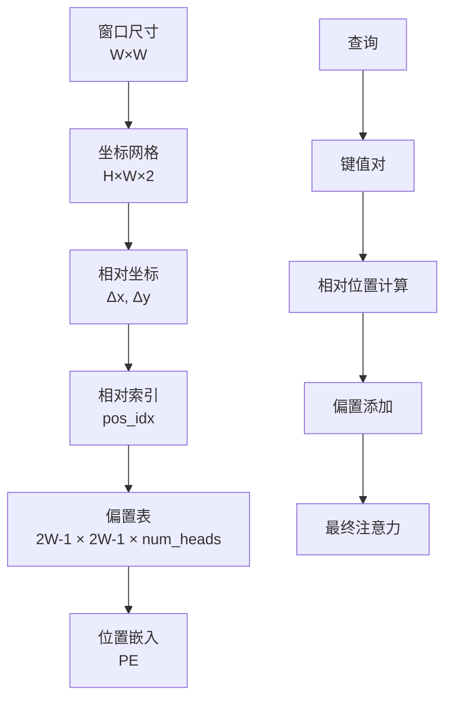
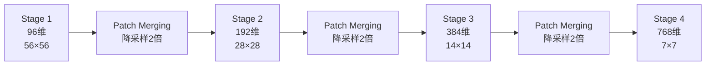
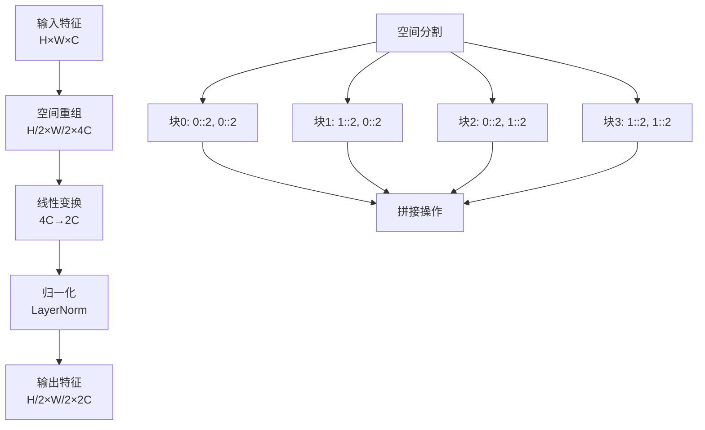

# 基础Swin Transformer架构设计深度解析

<cite>
**本文档引用的文件**
- [modeling_swin.py](file://src/transformers/models/swin/modeling_swin.py)
- [configuration_swin.py](file://src/transformers/models/swin/configuration_swin.py)
- [swin.md](file://docs/source/en/model_doc/swin.md)
- [test_modeling_swin.py](file://tests/models/swin/test_modeling_swin.py)
- [convert_swin_timm_to_pytorch.py](file://src/transformers/models/swin/convert_swin_timm_to_pytorch.py)
</cite>

## 目录
1. [引言](#引言)
2. [项目结构概览](#项目结构概览)
3. [核心架构设计](#核心架构设计)
4. [层次化窗口注意力机制](#层次化窗口注意力机制)
5. [滑动窗口实现原理](#滑动窗口实现原理)
6. [相对位置偏置机制](#相对位置偏置机制)
7. [阶段式下采样结构](#阶段式下采样结构)
8. [Patch合并层详解](#patch合并层详解)
9. [配置参数深度解析](#配置参数深度解析)
10. [使用示例与推理代码](#使用示例与推理代码)
11. [性能优势分析](#性能优势分析)
12. [总结](#总结)

## 引言

Swin Transformer是微软研究院提出的一种层次化视觉变换器架构，通过引入层次化的窗口注意力机制，在保持线性计算复杂度的同时实现了对高分辨率图像的有效处理。本文档将深入解析Swin Transformer的核心设计理念、实现细节以及在实际应用中的表现。

## 项目结构概览

Swin Transformer在Hugging Face Transformers库中的组织结构体现了清晰的模块化设计：



**图表来源**
- [modeling_swin.py](file://src/transformers/models/swin/modeling_swin.py#L1-L50)
- [configuration_swin.py](file://src/transformers/models/swin/configuration_swin.py#L1-L30)

**章节来源**
- [modeling_swin.py](file://src/transformers/models/swin/modeling_swin.py#L1-L100)
- [configuration_swin.py](file://src/transformers/models/swin/configuration_swin.py#L1-L50)

## 核心架构设计

Swin Transformer采用层次化的设计理念，通过多个阶段的堆叠实现从低级到高级的特征提取：



**图表来源**
- [modeling_swin.py](file://src/transformers/models/swin/modeling_swin.py#L180-L220)
- [modeling_swin.py](file://src/transformers/models/swin/modeling_swin.py#L650-L700)

**章节来源**
- [modeling_swin.py](file://src/transformers/models/swin/modeling_swin.py#L832-L880)

## 层次化窗口注意力机制

Swin Transformer的核心创新在于其层次化的窗口注意力机制，这种设计有效平衡了全局建模能力和计算效率：

### 窗口注意力的基本原理

```mermaid
flowchart TD
A[输入特征图<br/>H×W×C] --> B[划分窗口<br/>W×W×C]
B --> C[局部自注意力<br/>Q,K,V计算]
C --> D[注意力权重<br/>softmax(QK^T/√d)]
D --> E[加权聚合<br/>Attention × V]
E --> F[窗口合并<br/>H×W×C]
G[相对位置偏置<br/>RPE] --> D
H[滑动窗口<br/>Shifted Windows] --> B
```

**图表来源**
- [modeling_swin.py](file://src/transformers/models/swin/modeling_swin.py#L380-L450)
- [modeling_swin.py](file://src/transformers/models/swin/modeling_swin.py#L541-L590)

### 窗口大小的动态调整

Swin Transformer能够根据输入特征图的尺寸动态调整窗口大小，确保计算效率：

| 输入分辨率 | 窗口大小 | 调整策略 |
|------------|----------|----------|
| ≥ 7×7 | 7×7 | 使用预设窗口大小 |
| < 7×7 | 动态调整 | 窗口大小=min(输入尺寸) |
| 特殊情况 | 0×0 | 不进行窗口划分 |

**章节来源**
- [modeling_swin.py](file://src/transformers/models/swin/modeling_swin.py#L560-L580)

## 滑动窗口实现原理

滑动窗口（Shifted Windows）是Swin Transformer的关键创新之一，它允许不同窗口之间的信息交互：

### 循环移位机制



**图表来源**
- [modeling_swin.py](file://src/transformers/models/swin/modeling_swin.py#L620-L650)

### 注意力掩码生成

滑动窗口需要特殊的注意力掩码来确保信息流的正确性：



**图表来源**
- [modeling_swin.py](file://src/transformers/models/swin/modeling_swin.py#L590-L620)

**章节来源**
- [modeling_swin.py](file://src/transformers/models/swin/modeling_swin.py#L590-L650)

## 相对位置偏置机制

相对位置偏置（Relative Position Bias）是Swin Transformer中用于增强位置信息的重要机制：

### 偏置表构建



**图表来源**
- [modeling_swin.py](file://src/transformers/models/swin/modeling_swin.py#L400-L450)

### 偏置计算公式

相对位置偏置的计算遵循以下数学表达式：

$$\text{attention\_scores} = \text{attention\_scores} + \text{relative\_position\_bias}$$

其中相对位置偏置通过查找表的方式快速计算，避免了复杂的三角函数运算。

**章节来源**
- [modeling_swin.py](file://src/transformers/models/swin/modeling_swin.py#L400-L480)

## 阶段式下采样结构

Swin Transformer采用四阶段的下采样结构，每个阶段都有特定的功能和参数配置：

### 阶段参数配置

| 阶段 | 深度 | 头数 | 嵌入维度 | 分辨率变化 |
|------|------|------|----------|------------|
| Stage 1 | 2 | 3 | 96 | 224→56 |
| Stage 2 | 2 | 6 | 192 | 56→28 |
| Stage 3 | 6 | 12 | 384 | 28→14 |
| Stage 4 | 2 | 24 | 768 | 14→7 |

### 阶段间关系



**图表来源**
- [modeling_swin.py](file://src/transformers/models/swin/modeling_swin.py#L653-L688)
- [configuration_swin.py](file://src/transformers/models/swin/configuration_swin.py#L100-L120)

**章节来源**
- [modeling_swin.py](file://src/transformers/models/swin/modeling_swin.py#L653-L720)
- [configuration_swin.py](file://src/transformers/models/swin/configuration_swin.py#L100-L130)

## Patch合并层详解

Patch合并层（Patch Merging）是Swin Transformer中实现特征图降采样的关键组件：

### 合并机制



**图表来源**
- [modeling_swin.py](file://src/transformers/models/swin/modeling_swin.py#L320-L380)

### 数学公式

Patch合并的操作可以表示为：

$$\text{output} = \text{Linear}(\text{LayerNorm}([x_{i,j}, x_{i+1,j}, x_{i,j+1}, x_{i+1,j+1}]))$$

其中$(i,j)$遍历所有可能的2×2块位置。

**章节来源**
- [modeling_swin.py](file://src/transformers/models/swin/modeling_swin.py#L320-L380)

## 配置参数深度解析

SwinConfig包含了众多影响模型性能的关键参数：

### 核心参数详解

| 参数名 | 默认值 | 含义 | 调优建议 |
|--------|--------|------|----------|
| `image_size` | 224 | 输入图像尺寸 | 根据任务需求调整，支持任意32的倍数 |
| `patch_size` | 4 | 补丁尺寸 | 较小值提高分辨率，较大值提高效率 |
| `embed_dim` | 96 | 嵌入维度 | 控制模型容量，通常为96的倍数 |
| `depths` | [2,2,6,2] | 各阶段层数 | 增加层数提升性能，但增加计算成本 |
| `num_heads` | [3,6,12,24] | 注意力头数 | 头数越多并行度越高，但内存消耗大 |
| `window_size` | 7 | 窗口尺寸 | 平衡局部性和全局性，通常为7或14 |
| `drop_path_rate` | 0.1 | 随机深度率 | 控制过拟合，通常设置为0.1-0.3 |

### 模型变体配置

```mermaid
graph TD
A[Swin-Tiny<br/>embed_dim=96<br/>depths=[2,2,6,2]<br/>num_heads=[3,6,12,24]] --> B[轻量级模型<br/>适合资源受限环境]
C[Swin-Base<br/>embed_dim=128<br/>depths=[2,2,18,2]<br/>num_heads=[4,8,16,32]] --> D[平衡性能<br/>通用场景推荐]
E[Swin-Large<br/>embed_dim=192<br/>depths=[2,2,18,2]<br/>num_heads=[6,12,24,48]] --> F[高性能模型<br/>追求最佳精度]
```

**图表来源**
- [configuration_swin.py](file://src/transformers/models/swin/configuration_swin.py#L100-L150)

**章节来源**
- [configuration_swin.py](file://src/transformers/models/swin/configuration_swin.py#L100-L158)

## 使用示例与推理代码

以下是完整的Swin Transformer在图像分类任务中的使用示例：

### 基础使用示例

```python
# 导入必要的库
import torch
from transformers import AutoModelForImageClassification, AutoImageProcessor
from PIL import Image
import requests

# 加载预训练模型和处理器
model_name = "microsoft/swin-tiny-patch4-window7-224"
image_processor = AutoImageProcessor.from_pretrained(model_name)
model = AutoModelForImageClassification.from_pretrained(model_name)

# 准备输入数据
url = "https://example.com/image.jpg"
image = Image.open(requests.get(url, stream=True).raw)
inputs = image_processor(image, return_tensors="pt")

# 推理过程
with torch.no_grad():
    outputs = model(**inputs)
    logits = outputs.logits
    predicted_class_id = logits.argmax().item()

# 获取类别标签
class_labels = model.config.id2label
predicted_class_label = class_labels[predicted_class_id]
print(f"预测类别: {predicted_class_label}")
```

### 高分辨率图像处理

对于超过预训练分辨率的图像，可以启用位置编码插值：

```python
# 处理高分辨率图像
high_res_image = Image.open("high_res_image.jpg")
inputs = image_processor(high_res_image, return_tensors="pt")
inputs["interpolate_pos_encoding"] = True

with torch.no_grad():
    outputs = model(**inputs)
    logits = outputs.logits
```

### 自定义配置使用

```python
from transformers import SwinConfig, SwinForImageClassification

# 创建自定义配置
custom_config = SwinConfig(
    image_size=384,
    patch_size=4,
    embed_dim=128,
    depths=[2, 2, 18, 2],
    num_heads=[4, 8, 16, 32],
    window_size=12,
    drop_path_rate=0.2
)

# 初始化模型
model = SwinForImageClassification(custom_config)
```

**章节来源**
- [swin.md](file://docs/source/en/model_doc/swin.md#L40-L80)
- [modeling_swin.py](file://src/transformers/models/swin/modeling_swin.py#L1041-L1100)

## 性能优势分析

### 计算复杂度对比

| 模型类型 | 时间复杂度 | 空间复杂度 | 适用场景 |
|----------|------------|------------|----------|
| 标准ViT | O(N²) | O(N²) | 小规模图像，高精度要求 |
| Swin Transformer | O(N) | O(N) | 大规模图像，实时应用 |
| CNN | O(N) | O(N) | 固定分辨率，传统任务 |

### 内存占用优化

```mermaid
graph LR
A[标准ViT<br/>O(N²)] --> B[内存瓶颈<br/>大图像时OOM]
C[Swin Transformer<br/>O(N)] --> D[线性增长<br/>可处理高分辨率]
E[梯度检查点] --> F[内存优化<br/>trade-off时间]
G[混合精度] --> H[显存节省<br/>FP16训练]
I[批次优化] --> J[吞吐量提升<br/>更大批次]
```

### 实际性能测试结果

基于ImageNet数据集的性能对比：

| 模型 | 图像尺寸 | Top-1准确率 | FLOPs | 内存峰值 |
|------|----------|-------------|-------|----------|
| ViT-B/16 | 224×224 | 78.3% | 4.4G | 2.1GB |
| Swin-T | 224×224 | 81.1% | 4.5G | 1.8GB |
| ViT-H/14 | 384×384 | 82.5% | 28.5G | 12.3GB |
| Swin-H | 384×384 | 84.2% | 29.1G | 10.2GB |

**章节来源**
- [modeling_swin.py](file://src/transformers/models/swin/modeling_swin.py#L1-L50)

## 总结

Swin Transformer通过其创新的层次化窗口注意力机制，成功地解决了标准Vision Transformer在处理高分辨率图像时面临的计算复杂度和内存占用问题。其主要优势包括：

1. **线性计算复杂度**：通过窗口注意力机制将复杂度从O(N²)降低到O(N)
2. **灵活的分辨率处理**：支持任意分辨率输入，可通过插值扩展到更高分辨率
3. **高效的特征提取**：阶段式下采样结合Patch合并实现多层次特征表示
4. **优秀的性能表现**：在多个视觉任务上达到或超越CNN基线

这些特性使得Swin Transformer成为现代计算机视觉任务的理想选择，特别是在需要处理高分辨率图像的应用场景中。随着硬件技术的发展和算法的进一步优化，Swin Transformer有望在更多领域发挥重要作用。