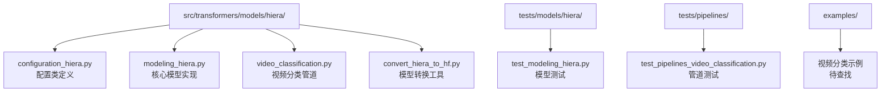
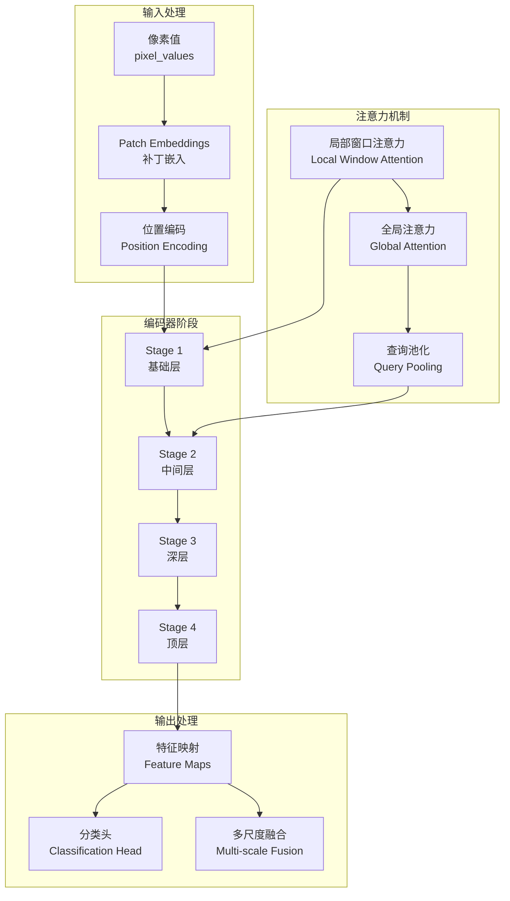
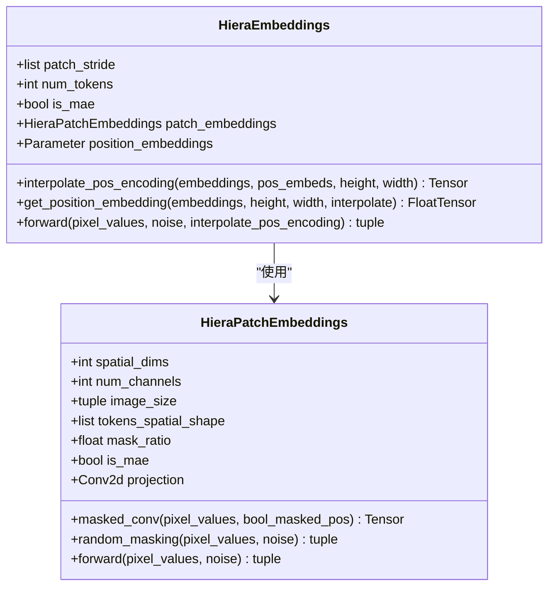
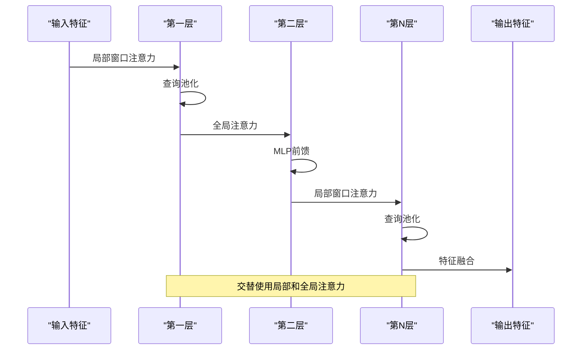
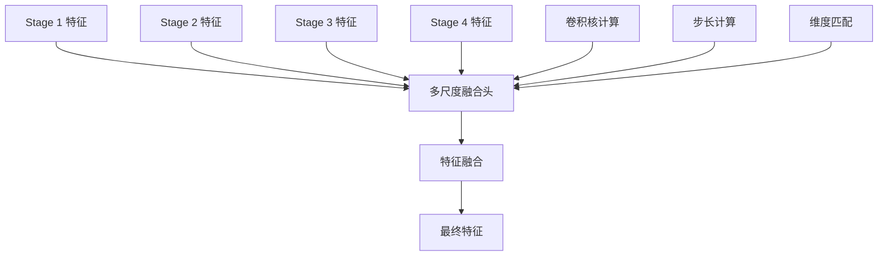
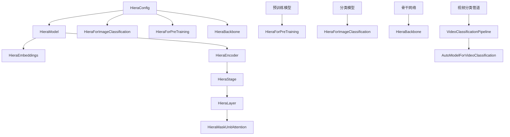

# 层次化Transformer (Hiera)

<cite>
**本文档中引用的文件**
- [configuration_hiera.py](file://src/transformers/models/hiera/configuration_hiera.py)
- [modeling_hiera.py](file://src/transformers/models/hiera/modeling_hiera.py)
- [video_classification.py](file://src/transformers/pipelines/video_classification.py)
- [test_modeling_hiera.py](file://tests/models/hiera/test_modeling_hiera.py)
- [convert_hiera_to_hf.py](file://src/transformers/models/hiera/convert_hiera_to_hf.py)
</cite>

## 目录
1. [简介](#简介)
2. [项目结构](#项目结构)
3. [核心组件](#核心组件)
4. [架构概览](#架构概览)
5. [详细组件分析](#详细组件分析)
6. [依赖关系分析](#依赖关系分析)
7. [性能考虑](#性能考虑)
8. [故障排除指南](#故障排除指南)
9. [结论](#结论)

## 简介

Hiera是一种受Swin Transformer启发但具有更灵活时空分层结构的层次化视觉Transformer模型。它通过在空间和时间维度上交替应用局部注意力和全局注意力来高效处理视频数据，特别适用于视频理解任务。Hiera的核心创新在于其独特的注意力机制和多阶段设计，使其能够在保持计算效率的同时处理长视频序列。

## 项目结构

Hiera模型的项目结构清晰地组织了配置、模型实现和管道功能：



**图表来源**
- [configuration_hiera.py](file://src/transformers/models/hiera/configuration_hiera.py#L1-L50)
- [modeling_hiera.py](file://src/transformers/models/hiera/modeling_hiera.py#L1-L50)

**章节来源**
- [configuration_hiera.py](file://src/transformers/models/hiera/configuration_hiera.py#L1-L195)
- [modeling_hiera.py](file://src/transformers/models/hiera/modeling_hiera.py#L1-L100)

## 核心组件

Hiera模型由以下核心组件构成：

### 配置系统 (HieraConfig)
HieraConfig是模型配置的核心类，定义了所有重要的超参数：
- **嵌入维度**：控制patch embedding的维度
- **深度配置**：定义每一层的深度和注意力头数
- **查询池化**：控制时间下采样的策略
- **掩码单元**：定义局部注意力的窗口大小

### 嵌入层 (HieraEmbeddings)
负责将输入图像转换为patch embeddings，并添加位置编码。

### 编码器 (HieraEncoder)
多阶段的层次化注意力网络，包含多个HieraStage。

### 注意力机制
独特的局部窗口注意力和全局注意力交替使用机制。

**章节来源**
- [configuration_hiera.py](file://src/transformers/models/hiera/configuration_hiera.py#L25-L195)
- [modeling_hiera.py](file://src/transformers/models/hiera/modeling_hiera.py#L150-L250)

## 架构概览

Hiera采用多阶段的层次化设计，通过空间和时间维度的交替注意力来处理视频数据：



**图表来源**
- [modeling_hiera.py](file://src/transformers/models/hiera/modeling_hiera.py#L820-L900)
- [modeling_hiera.py](file://src/transformers/models/hiera/modeling_hiera.py#L600-L700)

## 详细组件分析

### Patch Embeddings层

Patch Embeddings负责将输入图像转换为可处理的序列表示：



**图表来源**
- [modeling_hiera.py](file://src/transformers/models/hiera/modeling_hiera.py#L150-L250)
- [modeling_hiera.py](file://src/transformers/models/hiera/modeling_hiera.py#L250-L350)

### 层次化注意力块 (HieraStage)

每个Stage包含多个注意力层，采用交替的注意力模式：



**图表来源**
- [modeling_hiera.py](file://src/transformers/models/hiera/modeling_hiera.py#L500-L600)
- [modeling_hiera.py](file://src/transformers/models/hiera/modeling_hiera.py#L400-L500)

### 注意力机制详解

Hiera的独特之处在于其混合注意力机制：

#### 局部窗口注意力 (Local Window Attention)
- 在固定窗口内计算注意力
- 计算复杂度为O(n²)，其中n是窗口内的元素数
- 适用于捕捉局部空间关系

#### 全局注意力 (Global Attention)
- 跨所有位置计算注意力
- 计算复杂度为O(n²)，但覆盖整个序列
- 适用于捕捉全局上下文关系

#### 查询池化 (Query Pooling)
- 通过最大池化减少序列长度
- 实现时间下采样，处理长视频序列
- 保持关键信息的同时降低计算成本

**章节来源**
- [modeling_hiera.py](file://src/transformers/models/hiera/modeling_hiera.py#L350-L450)
- [modeling_hiera.py](file://src/transformers/models/hiera/modeling_hiera.py#L450-L550)

### 多尺度融合头

用于整合不同层级的特征信息：



**图表来源**
- [modeling_hiera.py](file://src/transformers/models/hiera/modeling_hiera.py#L1000-L1100)

**章节来源**
- [modeling_hiera.py](file://src/transformers/models/hiera/modeling_hiera.py#L950-L1050)

## 依赖关系分析

Hiera模型的依赖关系体现了其模块化设计：



**图表来源**
- [modeling_hiera.py](file://src/transformers/models/hiera/modeling_hiera.py#L750-L850)
- [configuration_hiera.py](file://src/transformers/models/hiera/configuration_hiera.py#L150-L195)

**章节来源**
- [modeling_hiera.py](file://src/transformers/models/hiera/modeling_hiera.py#L750-L900)
- [configuration_hiera.py](file://src/transformers/models/hiera/configuration_hiera.py#L150-L195)

## 性能考虑

Hiera在设计时充分考虑了计算效率：

### 时间下采样策略
- 通过查询池化实现渐进式的时间下采样
- 减少后续层的计算负担
- 保持重要时间信息的保留

### 注意力机制优化
- 局部窗口注意力限制计算范围
- 全局注意力仅在必要时使用
- 动态调整注意力模式

### 内存效率
- 使用梯度检查点减少内存占用
- 模块化设计便于内存优化
- 支持动态输入尺寸

## 故障排除指南

### 常见配置问题

#### masked_unit_size验证失败
```python
# 错误情况
if masked_unit_size[0] % query_stride[0] ** (len(depths) - 1) != 0:
    raise ValueError(...)
```

解决方案：确保掩码单元大小能被查询步长的幂整除。

#### num_query_pool配置错误
```python
# 错误情况
if num_query_pool >= len(depths):
    raise ValueError(...)
```

解决方案：查询池化层数必须小于总层数。

### 模型使用问题

#### 视频分类管道使用
```python
# 基本用法示例
from transformers import VideoClassificationPipeline

pipe = VideoClassificationPipeline.from_pretrained("facebook/hiera-tiny-224-hf")
results = pipe("video.mp4", num_frames=16, frame_sampling_rate=2)
```

#### 自定义配置
```python
# 自定义Hiera配置
from transformers import HieraConfig, HieraForImageClassification

config = HieraConfig(
    embed_dim=96,
    depths=[2, 3, 16, 3],
    num_heads=[1, 2, 4, 8],
    num_query_pool=3,
    query_stride=[2, 2]
)

model = HieraForImageClassification(config)
```

**章节来源**
- [configuration_hiera.py](file://src/transformers/models/hiera/configuration_hiera.py#L120-L150)
- [video_classification.py](file://src/transformers/pipelines/video_classification.py#L50-L150)

## 结论

Hiera模型代表了视觉Transformer领域的重要进展，通过其独特的层次化设计和灵活的时空注意力机制，为视频理解和计算机视觉任务提供了高效的解决方案。其主要优势包括：

1. **计算效率**：通过局部注意力和查询池化实现高效的视频处理
2. **灵活性**：支持多种配置和应用场景
3. **可扩展性**：从tiny到huge的不同规模模型
4. **实用性**：提供完整的预训练模型和微调工具

Hiera的设计思想为未来的视觉Transformer发展提供了有价值的参考，特别是在处理长序列数据和多模态任务方面展现了巨大的潜力。