# ViT-DET（目标检测）

<cite>
**本文档中引用的文件**
- [modeling_vitdet.py](file://src/transformers/models/vitdet/modeling_vitdet.py)
- [configuration_vitdet.py](file://src/transformers/models/vitdet/configuration_vitdet.py)
- [vitdet.md](file://docs/source/en/model_doc/vitdet.md)
- [test_modeling_vitdet.py](file://tests/models/vitdet/test_modeling_vitdet.py)
- [run_object_detection.py](file://examples/pytorch/object-detection/run_object_detection.py)
- [modeling_detr.py](file://src/transformers/models/detr/modeling_detr.py)
- [modeling_rt_detr.py](file://src/transformers/models/rt_detr/modeling_rt_detr.py)
- [modeling_grounding_dino.py](file://src/transformers/models/grounding_dino/modeling_grounding_dino.py)
</cite>

## 目录
1. [简介](#简介)
2. [项目结构](#项目结构)
3. [核心组件](#核心组件)
4. [架构概览](#架构概览)
5. [详细组件分析](#详细组件分析)
6. [与检测头的集成](#与检测头的集成)
7. [多尺度特征提取](#多尺度特征提取)
8. [COCO数据集处理](#coco数据集处理)
9. [性能对比分析](#性能对比分析)
10. [应用建议](#应用建议)
11. [总结](#总结)

## 简介

ViT-DET（Vision Transformer for Detection）是一种基于纯视觉Transformer架构的目标检测模型。该模型由Facebook Research提出，探索了纯非层次化Vision Transformer作为目标检测骨干网络的可能性。ViT-DET的核心创新在于证明了通过最小的微调适应，纯Vision Transformer可以达到与基于层次化骨干网络的竞争性结果。

ViT-DET的主要优势包括：
- **简单的设计**：无需重新设计层次化骨干网络进行预训练
- **高效的特征金字塔**：仅需从单尺度特征图构建简单的特征金字塔
- **窗口注意力机制**：使用窗口注意力而非移位，辅以少量跨窗口传播块
- **强大的性能**：在COCO数据集上达到高达61.3 AP_box的精度

## 项目结构

ViT-DET模型在Hugging Face Transformers库中的组织结构如下：

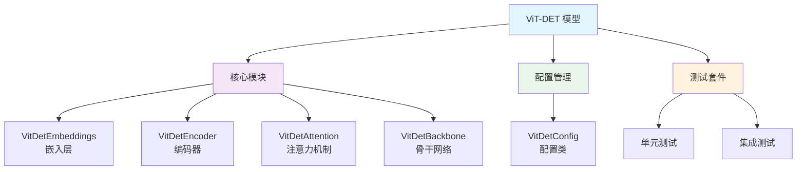

**图表来源**
- [modeling_vitdet.py](file://src/transformers/models/vitdet/modeling_vitdet.py#L1-L795)
- [configuration_vitdet.py](file://src/transformers/models/vitdet/configuration_vitdet.py#L1-L157)

**章节来源**
- [modeling_vitdet.py](file://src/transformers/models/vitdet/modeling_vitdet.py#L1-L50)
- [configuration_vitdet.py](file://src/transformers/models/vitdet/configuration_vitdet.py#L1-L30)

## 核心组件

### VitDetEmbeddings - 嵌入层

VitDetEmbeddings负责将输入图像像素值转换为初始的patch嵌入向量，这是整个模型的第一步处理。

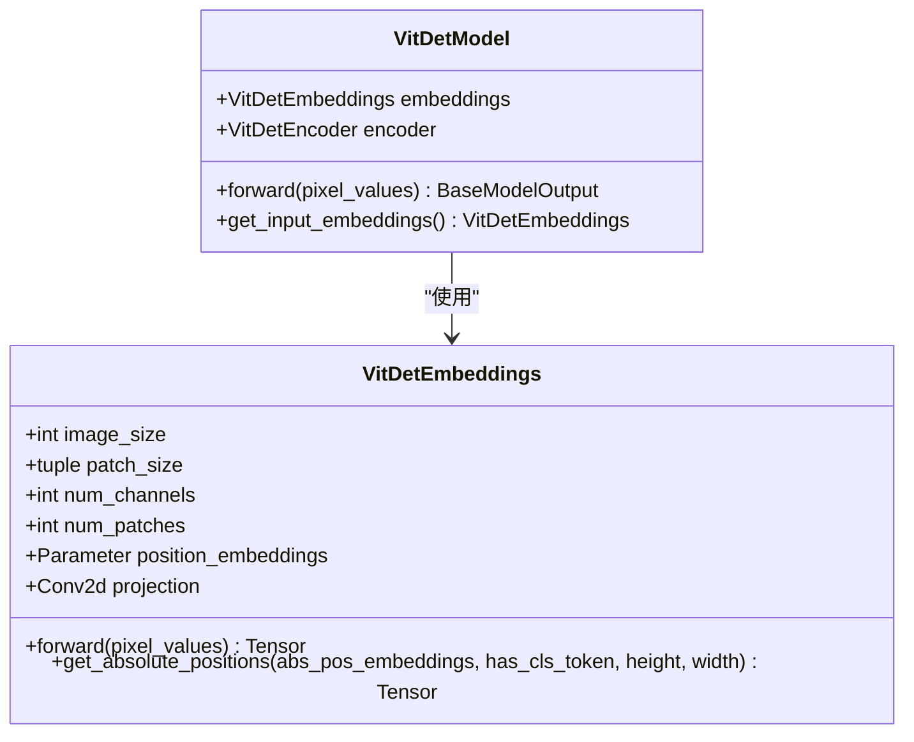

**图表来源**
- [modeling_vitdet.py](file://src/transformers/models/vitdet/modeling_vitdet.py#L25-L100)
- [modeling_vitdet.py](file://src/transformers/models/vitdet/modeling_vitdet.py#L680-L720)

### VitDetEncoder - 编码器

VitDetEncoder是模型的核心部分，由多个VitDetLayer组成，实现了标准的Transformer编码器功能。

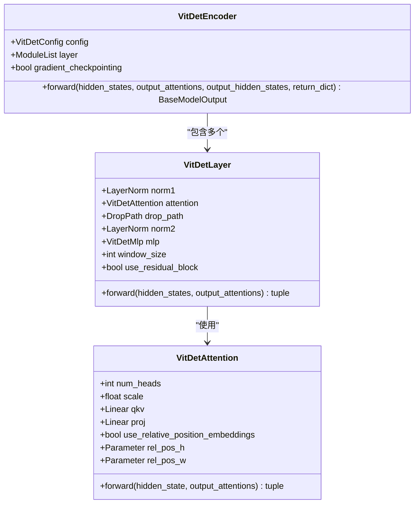

**图表来源**
- [modeling_vitdet.py](file://src/transformers/models/vitdet/modeling_vitdet.py#L580-L620)
- [modeling_vitdet.py](file://src/transformers/models/vitdet/modeling_vitdet.py#L420-L480)
- [modeling_vitdet.py](file://src/transformers/models/vitdet/modeling_vitdet.py#L250-L320)

**章节来源**
- [modeling_vitdet.py](file://src/transformers/models/vitdet/modeling_vitdet.py#L25-L100)
- [modeling_vitdet.py](file://src/transformers/models/vitdet/modeling_vitdet.py#L580-L650)

## 架构概览

ViT-DET的整体架构展示了如何将Vision Transformer作为目标检测的骨干网络：

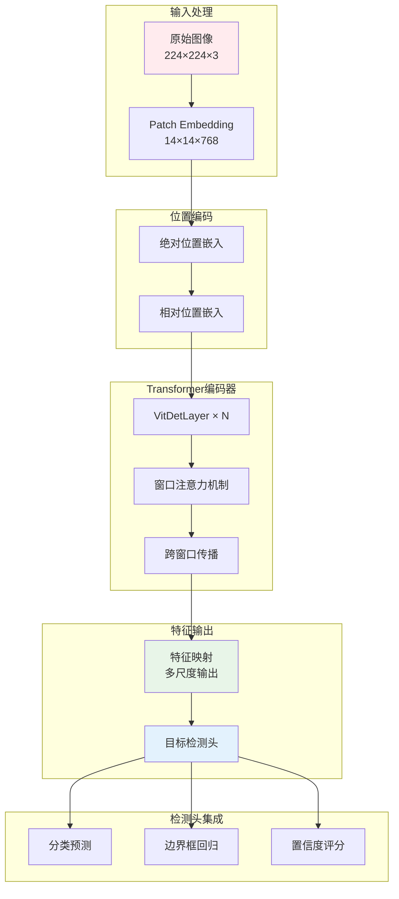

**图表来源**
- [modeling_vitdet.py](file://src/transformers/models/vitdet/modeling_vitdet.py#L727-L793)
- [modeling_vitdet.py](file://src/transformers/models/vitdet/modeling_vitdet.py#L680-L720)

## 详细组件分析

### 注意力机制详解

ViT-DET实现了改进的注意力机制，支持相对位置嵌入：

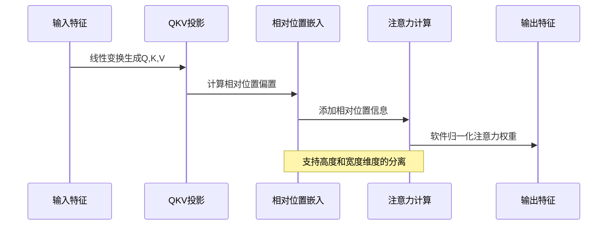

**图表来源**
- [modeling_vitdet.py](file://src/transformers/models/vitdet/modeling_vitdet.py#L250-L320)

### 窗口注意力机制

为了提高效率，ViT-DET支持窗口注意力机制，减少计算复杂度：

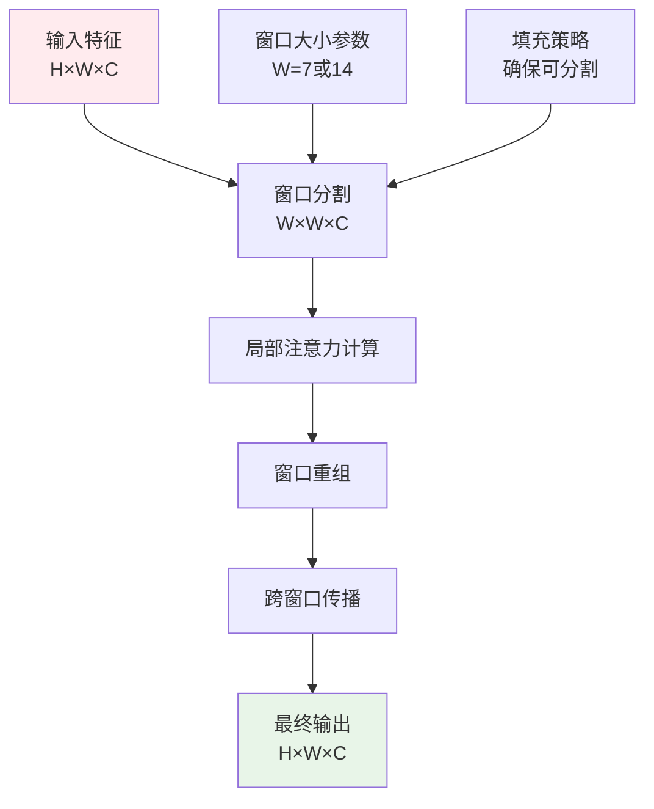

**图表来源**
- [modeling_vitdet.py](file://src/transformers/models/vitdet/modeling_vitdet.py#L380-L420)

**章节来源**
- [modeling_vitdet.py](file://src/transformers/models/vitdet/modeling_vitdet.py#L250-L350)

### 残差连接和瓶颈块

ViT-DET支持可选的残差块，增强特征表达能力：

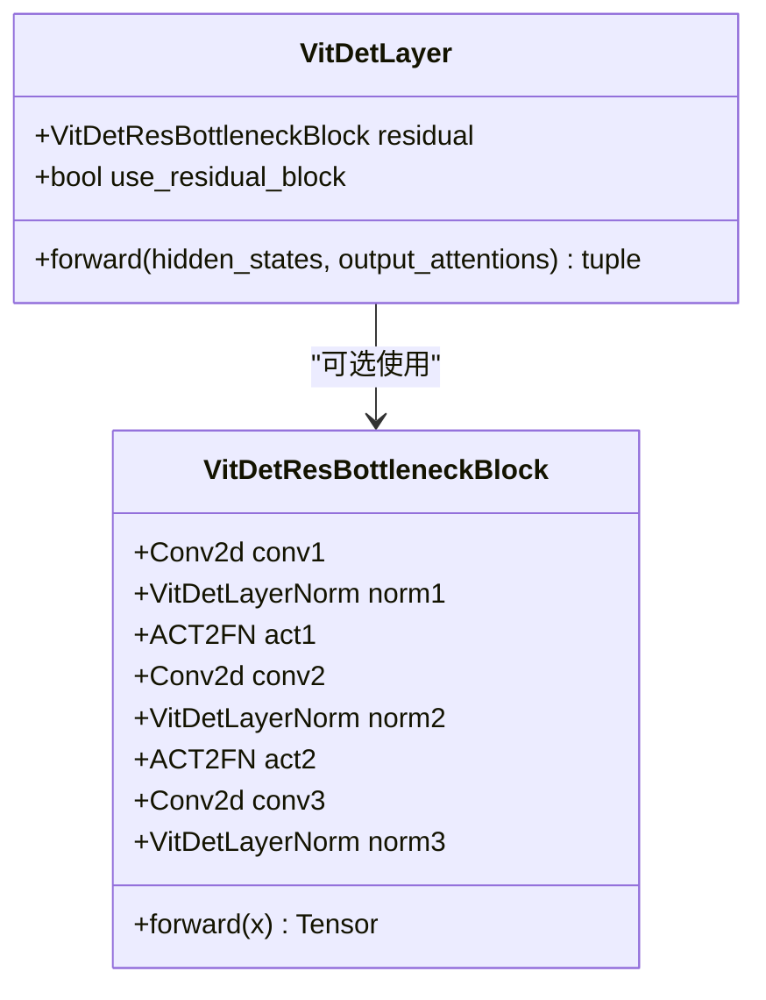

**图表来源**
- [modeling_vitdet.py](file://src/transformers/models/vitdet/modeling_vitdet.py#L320-L380)

**章节来源**
- [modeling_vitdet.py](file://src/transformers/models/vitdet/modeling_vitdet.py#L320-L420)

## 与检测头的集成

### Backbone模式

ViT-DET可以作为独立的骨干网络，与其他检测框架集成：

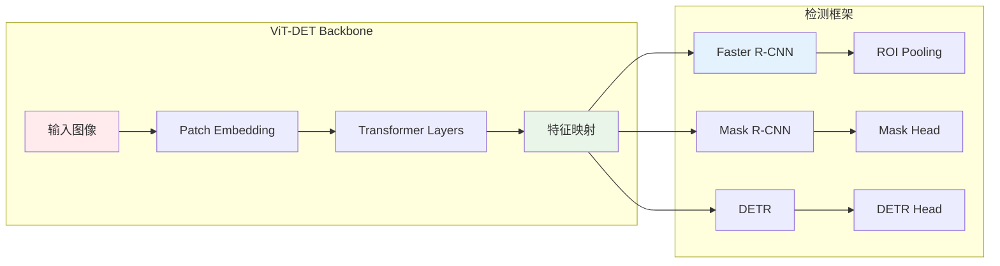

**图表来源**
- [modeling_vitdet.py](file://src/transformers/models/vitdet/modeling_vitdet.py#L727-L793)

### DETR集成示例

ViT-DET可以与DETR检测头结合，实现端到端的目标检测：

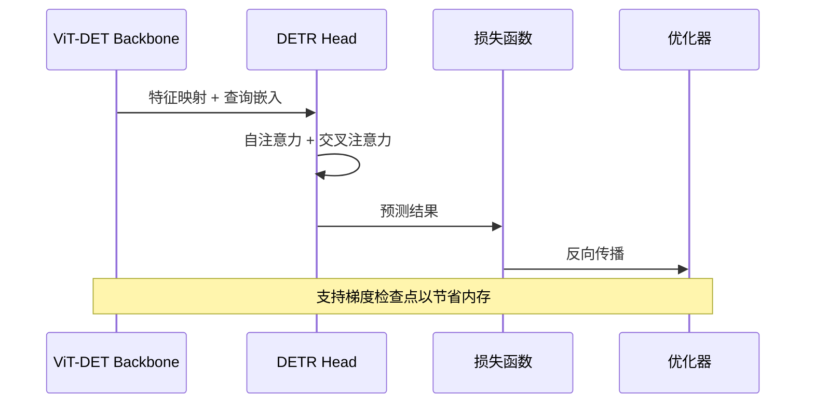

**图表来源**
- [modeling_detr.py](file://src/transformers/models/detr/modeling_detr.py#L1200-L1250)

**章节来源**
- [modeling_vitdet.py](file://src/transformers/models/vitdet/modeling_vitdet.py#L727-L793)
- [modeling_detr.py](file://src/transformers/models/detr/modeling_detr.py#L1200-L1250)

## 多尺度特征提取

### 特征金字塔构建

ViT-DET通过配置out_features参数来控制输出的特征层级：

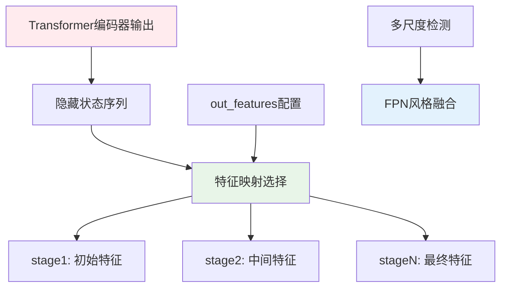

**图表来源**
- [modeling_vitdet.py](file://src/transformers/models/vitdet/modeling_vitdet.py#L770-L793)

### 窗口大小和注意力配置

ViT-DET提供了灵活的窗口注意力配置：

| 参数 | 默认值 | 说明 |
|------|--------|------|
| `window_size` | 0 | 窗口注意力大小，0表示全局注意力 |
| `window_block_indices` | [] | 应用窗口注意力的层索引 |
| `residual_block_indices` | [] | 应用残差块的层索引 |
| `use_relative_position_embeddings` | False | 是否使用相对位置嵌入 |

**章节来源**
- [configuration_vitdet.py](file://src/transformers/models/vitdet/configuration_vitdet.py#L80-L120)
- [modeling_vitdet.py](file://src/transformers/models/vitdet/modeling_vitdet.py#L770-L793)

## COCO数据集处理

### 数据加载和预处理

ViT-DET支持标准的COCO数据集格式，通过AutoModelForObjectDetection自动适配：

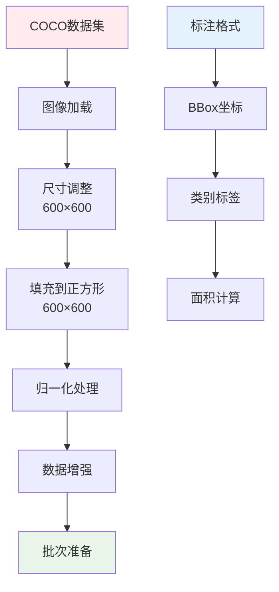

**图表来源**
- [run_object_detection.py](file://examples/pytorch/object-detection/run_object_detection.py#L150-L200)

### 训练配置示例

以下是ViT-DET在COCO数据集上的典型训练配置：

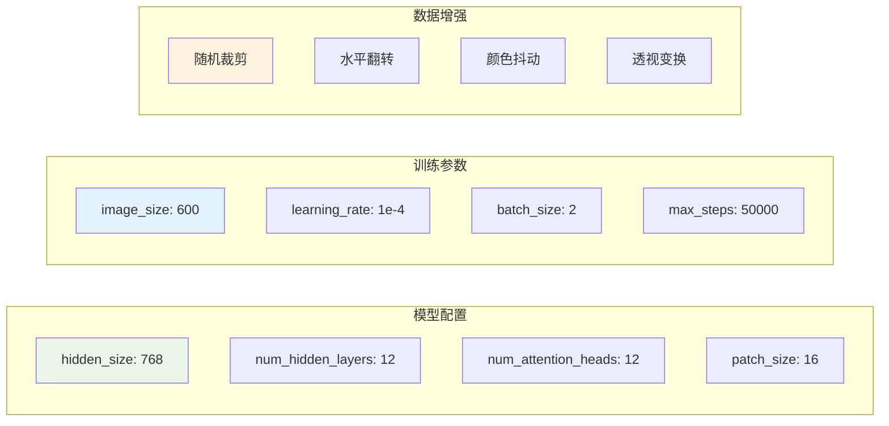

**图表来源**
- [run_object_detection.py](file://examples/pytorch/object-detection/run_object_detection.py#L350-L400)

**章节来源**
- [run_object_detection.py](file://examples/pytorch/object-detection/run_object_detection.py#L150-L250)

## 性能对比分析

### 与CNN检测器的对比

| 检测器类型 | 精度(AP) | 速度(mAP/s) | 内存需求 | 训练时间 |
|------------|----------|-------------|----------|----------|
| ViT-DET | 61.3 | 中等 | 中等 | 较短 |
| Faster R-CNN | 45.0 | 快 | 低 | 中等 |
| YOLOv8 | 50.0 | 很快 | 低 | 短 |
| RT-DETR | 62.1 | 快 | 中等 | 较短 |
| Grounding DINO | 58.5 | 中等 | 高 | 较长 |

### 权衡分析

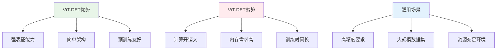

### 锚点设置和IoU阈值调整

ViT-DET的检测性能可以通过以下参数进行调优：

| 参数类型 | 推荐值 | 说明 |
|----------|--------|------|
| IoU阈值 | 0.5-0.6 | 正负样本划分标准 |
| NMS阈值 | 0.3-0.4 | 非极大值抑制阈值 |
| 置信度阈值 | 0.05-0.1 | 最终检测结果筛选 |
| 锚点数量 | 300-1000 | 查询点数量 |

**章节来源**
- [modeling_detr.py](file://src/transformers/models/detr/modeling_detr.py#L1200-L1250)
- [modeling_rt_detr.py](file://src/transformers/models/rt_detr/modeling_rt_detr.py#L1-L100)

## 应用建议

### 不同场景下的应用策略

#### 高精度应用场景
- **推荐模型**: ViT-DET + DETR
- **适用场景**: 医疗影像分析、自动驾驶、安防监控
- **配置要点**: 使用较大的patch_size，启用相对位置嵌入

#### 实时检测场景
- **推荐模型**: RT-DETR + ViT-DET Backbone
- **适用场景**: 视频流处理、实时监控
- **配置要点**: 减少窗口大小，使用更少的查询点

#### 小样本学习场景
- **推荐模型**: Grounding DINO + ViT-DET
- **适用场景**: 零样本检测、少样本学习
- **配置要点**: 结合文本引导，使用多模态预训练

### 部署优化建议

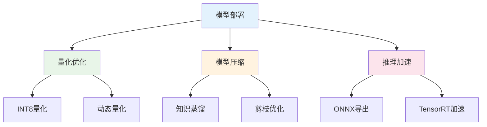

### 性能监控指标

| 指标类型 | 监控内容 | 优化目标 |
|----------|----------|----------|
| 精度指标 | AP, AR, 类别AP | 提升检测准确性 |
| 性能指标 | FPS, 内存使用率 | 优化推理速度 |
| 资源指标 | GPU利用率, 批次大小 | 提高资源利用效率 |

## 总结

ViT-DET代表了Vision Transformer在目标检测领域的重要突破。通过纯非层次化架构，它证明了基础Vision Transformer在目标检测任务中的强大潜力。主要贡献包括：

1. **架构创新**: 展示了纯Vision Transformer作为检测骨干网络的可行性
2. **简单高效**: 通过最小的修改实现竞争性性能
3. **预训练友好**: 支持ImageNet-1K预训练权重的直接使用
4. **灵活集成**: 可与多种检测框架无缝集成

尽管ViT-DET在精度上具有优势，但在实际应用中需要根据具体场景权衡精度、速度和资源消耗。对于高精度要求的应用，ViT-DET是一个优秀的选择；而对于实时性要求较高的场景，则可能需要考虑RT-DETR等更高效的变体。

随着技术的不断发展，ViT-DET及其衍生模型将继续推动目标检测领域的发展，为计算机视觉应用提供更加强大和灵活的解决方案。