# ViT-MAE（掩码自编码器）

<cite>
**本文档中引用的文件**
- [modeling_vit_mae.py](file://src/transformers/models/vit_mae/modeling_vit_mae.py)
- [configuration_vit_mae.py](file://src/transformers/models/vit_mae/configuration_vit_mae.py)
- [run_mae.py](file://examples/pytorch/image-pretraining/run_mae.py)
- [run_mim.py](file://examples/pytorch/image-pretraining/run_mim.py)
- [test_modeling_vit_mae.py](file://tests/models/vit_mae/test_modeling_vit_mae.py)
</cite>

## 目录
1. [简介](#简介)
2. [项目结构](#项目结构)
3. [核心组件](#核心组件)
4. [架构概览](#架构概览)
5. [详细组件分析](#详细组件分析)
6. [随机掩码策略](#随机掩码策略)
7. [编码器-解码器结构](#编码器-解码器结构)
8. [重建任务与损失函数](#重建任务与损失函数)
9. [自监督预训练流程](#自监督预训练流程)
10. [下游任务微调](#下游任务微调)
11. [性能优化与最佳实践](#性能优化与最佳实践)
12. [与其他自监督方法的对比](#与其他自监督方法的对比)
13. [故障排除指南](#故障排除指南)
14. [结论](#结论)

## 简介

ViT-MAE（Vision Transformer Masked Autoencoder）是一种基于视觉Transformer的自监督学习方法，由Facebook Research提出。该方法通过随机掩码大量图像块（通常达到75%），迫使模型学习重建被掩码的图像区域，从而实现高效的自监督预训练。

ViT-MAE的核心创新在于：
- **高掩码率策略**：使用高达75%的掩码比例，显著提升模型的学习能力
- **编码器-解码器架构**：分离编码器和解码器，专注于重建任务
- **像素级重建**：直接在像素空间进行重建，无需复杂的特征表示
- **无标签训练**：完全自监督，不需要标注数据

## 项目结构

ViT-MAE模型在Transformers库中的组织结构如下：

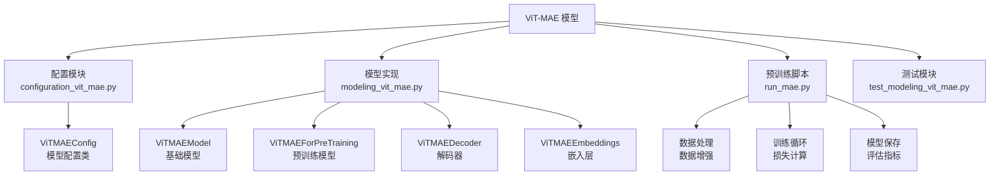

**图表来源**
- [modeling_vit_mae.py](file://src/transformers/models/vit_mae/modeling_vit_mae.py#L1-L50)
- [configuration_vit_mae.py](file://src/transformers/models/vit_mae/configuration_vit_mae.py#L1-L30)

## 核心组件

ViT-MAE模型包含以下核心组件：

### 主要类定义

| 组件 | 功能 | 关键参数 |
|------|------|----------|
| **ViTMAEModel** | 基础编码器模型 | `hidden_size`, `num_hidden_layers`, `mask_ratio` |
| **ViTMAEForPreTraining** | 预训练完整模型 | `decoder_hidden_size`, `decoder_num_layers` |
| **ViTMAEDecoder** | 图像重建解码器 | `decoder_hidden_size`, `decoder_num_attention_heads` |
| **ViTMAEEmbeddings** | 图像嵌入和掩码 | `patch_size`, `image_size`, `mask_ratio` |

### 配置参数详解

| 参数名称 | 默认值 | 说明 | 影响 |
|----------|--------|------|------|
| `mask_ratio` | 0.75 | 掩码比例 | 控制重建难度和学习效率 |
| `norm_pix_loss` | False | 是否归一化像素损失 | 影响重建质量和收敛速度 |
| `decoder_hidden_size` | 512 | 解码器隐藏层维度 | 决定重建能力 |
| `decoder_num_hidden_layers` | 8 | 解码器层数 | 影响重建精度 |
| `patch_size` | 16 | 图像块大小 | 影响分辨率和计算复杂度 |

**章节来源**
- [configuration_vit_mae.py](file://src/transformers/models/vit_mae/configuration_vit_mae.py#L76-L140)

## 架构概览

ViT-MAE采用编码器-解码器架构，其整体工作流程如下：

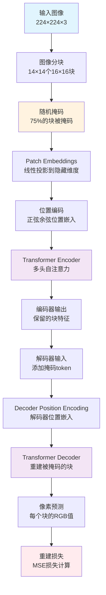

**图表来源**
- [modeling_vit_mae.py](file://src/transformers/models/vit_mae/modeling_vit_mae.py#L583-L637)
- [modeling_vit_mae.py](file://src/transformers/models/vit_mae/modeling_vit_mae.py#L693-L730)

## 详细组件分析

### ViTMAEModel 编码器

编码器负责从掩码后的图像中提取特征：

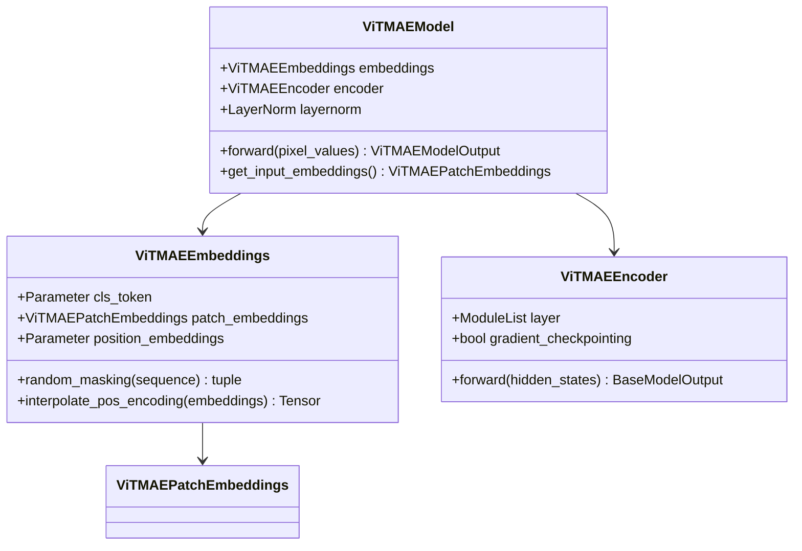

**图表来源**
- [modeling_vit_mae.py](file://src/transformers/models/vit_mae/modeling_vit_mae.py#L583-L637)
- [modeling_vit_mae.py](file://src/transformers/models/vit_mae/modeling_vit_mae.py#L150-L250)

### ViTMAEForPreTraining 完整模型

完整预训练模型结合了编码器和解码器：

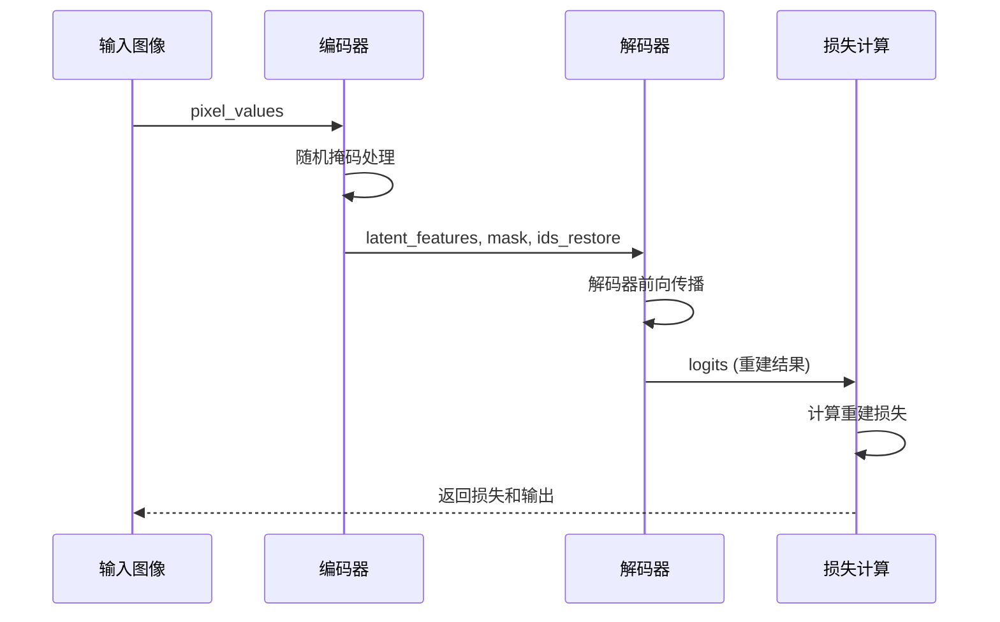

**图表来源**
- [modeling_vit_mae.py](file://src/transformers/models/vit_mae/modeling_vit_mae.py#L873-L906)

**章节来源**
- [modeling_vit_mae.py](file://src/transformers/models/vit_mae/modeling_vit_mae.py#L583-L637)
- [modeling_vit_mae.py](file://src/transformers/models/vit_mae/modeling_vit_mae.py#L693-L730)

## 随机掩码策略

ViT-MAE的核心创新之一是其随机掩码策略，该策略决定了哪些图像块被掩码以及如何处理这些掩码。

### 掩码生成机制

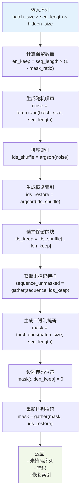

**图表来源**
- [modeling_vit_mae.py](file://src/transformers/models/vit_mae/modeling_vit_mae.py#L250-L290)

### 掩码参数配置

| 参数 | 类型 | 默认值 | 作用 |
|------|------|--------|------|
| `mask_ratio` | float | 0.75 | 掩码比例，控制重建难度 |
| `mask_token` | Parameter | 随机初始化 | 掩码token的可学习参数 |
| `noise` | Tensor | 随机生成 | 控制掩码模式的随机性 |

### 掩码效果对比

不同掩码比例对模型性能的影响：

| 掩码比例 | 特点 | 优势 | 劣势 |
|----------|------|------|------|
| 0.50 | 中等难度 | 平衡学习和重建 | 可能学习不足 |
| 0.75 | 高难度 | 强大学习能力 | 训练不稳定 |
| 0.90 | 极高难度 | 最强泛化能力 | 训练困难 |

**章节来源**
- [modeling_vit_mae.py](file://src/transformers/models/vit_mae/modeling_vit_mae.py#L250-L290)

## 编码器-解码器结构

ViT-MAE采用分离的编码器-解码器架构，这种设计使得模型能够专注于重建任务。

### 编码器设计

编码器负责从掩码图像中提取特征：

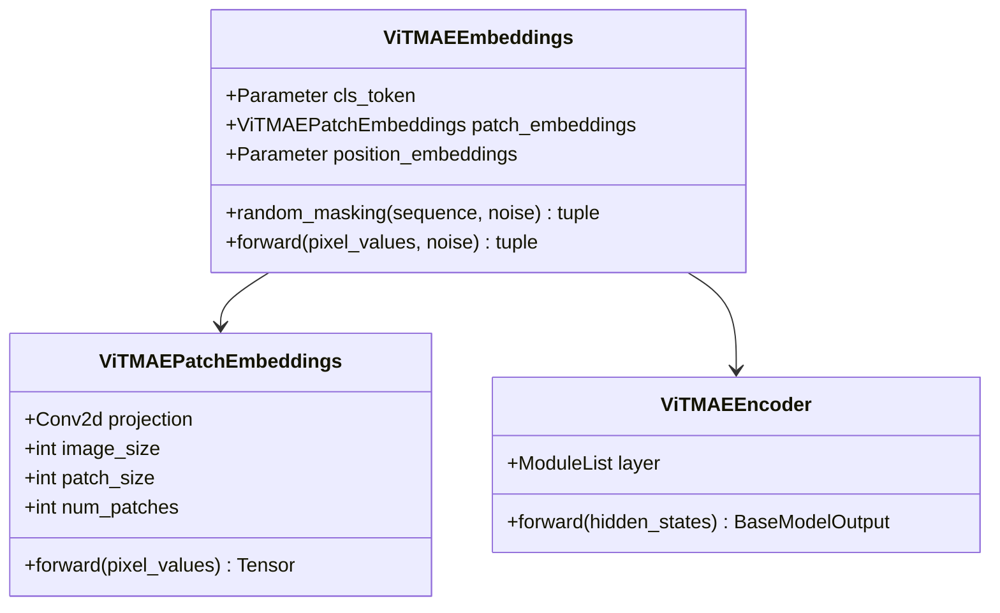

**图表来源**
- [modeling_vit_mae.py](file://src/transformers/models/vit_mae/modeling_vit_mae.py#L150-L250)

### 解码器设计

解码器负责重建被掩码的图像块：

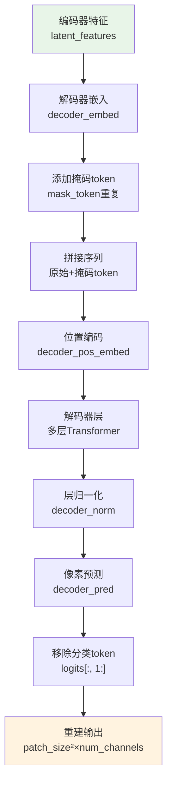

**图表来源**
- [modeling_vit_mae.py](file://src/transformers/models/vit_mae/modeling_vit_mae.py#L638-L730)

### 解码器配置参数

| 参数 | 默认值 | 说明 | 调优建议 |
|------|--------|------|----------|
| `decoder_hidden_size` | 512 | 解码器隐藏层维度 | 通常为编码器的2/3 |
| `decoder_num_hidden_layers` | 8 | 解码器层数 | 根据重建精度需求调整 |
| `decoder_num_attention_heads` | 16 | 注意力头数 | 保持与编码器一致 |
| `decoder_intermediate_size` | 2048 | FFN中间维度 | 通常为隐藏维度的4倍 |

**章节来源**
- [modeling_vit_mae.py](file://src/transformers/models/vit_mae/modeling_vit_mae.py#L638-L730)

## 重建任务与损失函数

ViT-MAE的重建任务直接在像素空间进行，使用均方误差（MSE）作为损失函数。

### 损失函数实现

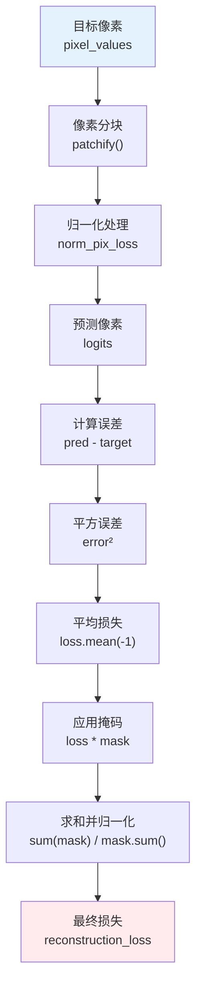

**图表来源**
- [modeling_vit_mae.py](file://src/transformers/models/vit_mae/modeling_vit_mae.py#L820-L843)

### 关键参数说明

| 参数 | 类型 | 默认值 | 作用 |
|------|------|--------|------|
| `norm_pix_loss` | bool | False | 是否对像素值进行归一化 |
| `mask` | Tensor | 二进制掩码 | 标记哪些位置需要计算损失 |
| `patch_size` | int | 16 | 图像块大小，影响重建分辨率 |

### 损失函数变体

1. **标准MSE损失**：`(pred - target)²`
2. **归一化MSE损失**：先对目标像素进行归一化再计算损失
3. **感知损失**：结合特征空间的损失

**章节来源**
- [modeling_vit_mae.py](file://src/transformers/models/vit_mae/modeling_vit_mae.py#L820-L843)

## 自监督预训练流程

ViT-MAE的自监督预训练遵循标准的深度学习流程，但针对图像重建任务进行了优化。

### 数据预处理流程

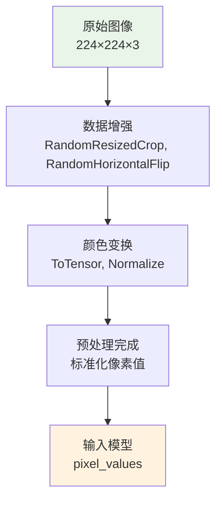

**图表来源**
- [run_mae.py](file://examples/pytorch/image-pretraining/run_mae.py#L280-L320)

### 训练循环实现

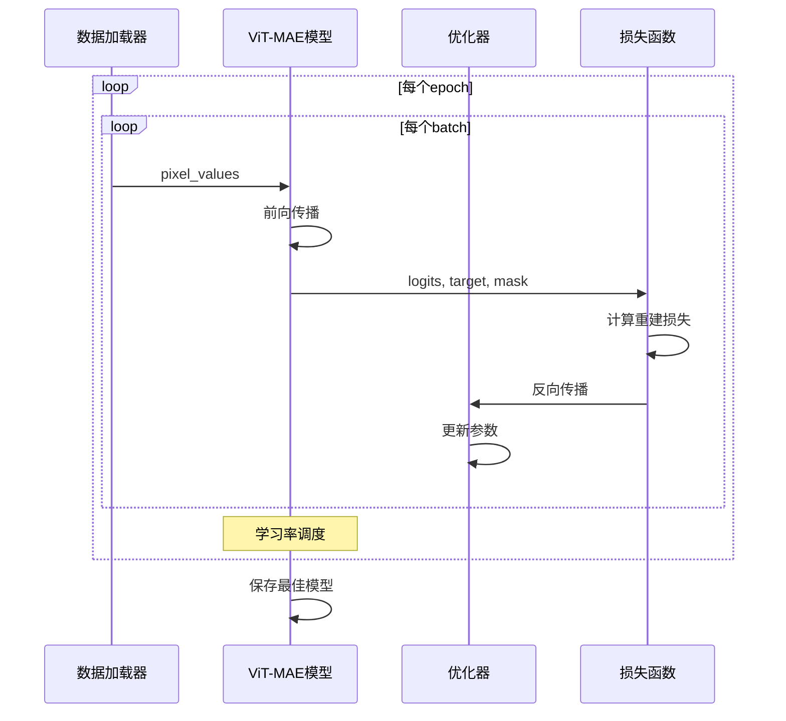

**图表来源**
- [run_mae.py](file://examples/pytorch/image-pretraining/run_mae.py#L350-L394)

### 关键训练参数

| 参数 | 默认值 | 说明 | 调优建议 |
|------|--------|------|----------|
| `learning_rate` | 1.5e-4 | 基础学习率 | 根据批次大小调整 |
| `weight_decay` | 0.05 | 权重衰减 | 防止过拟合 |
| `warmup_epochs` | 40 | 预热轮数 | 提升训练稳定性 |
| `batch_size` | 64 | 批次大小 | 根据GPU内存调整 |

**章节来源**
- [run_mae.py](file://examples/pytorch/image-pretraining/run_mae.py#L160-L200)
- [run_mae.py](file://examples/pytorch/image-pretraining/run_mae.py#L350-L394)

## 下游任务微调

ViT-MAE的自监督预训练完成后，可以将其编码器权重迁移到下游任务中进行微调。

### 微调策略

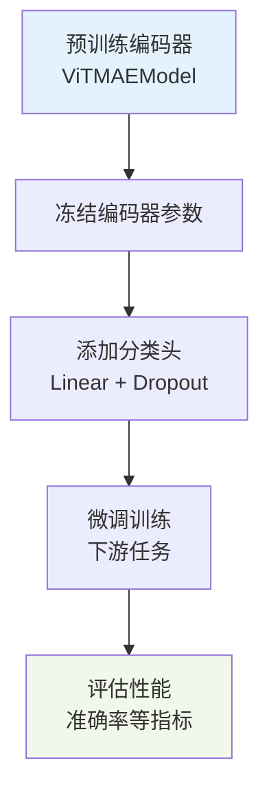

### 迁移学习最佳实践

1. **渐进式微调**：先用较小的学习率微调
2. **数据增强**：在下游任务中继续使用数据增强
3. **学习率调度**：使用余弦退火或阶梯式衰减
4. **早停策略**：监控验证集性能防止过拟合

### 性能基准对比

| 方法 | ImageNet-1K Top-1 (%) | 参数量 | 训练数据量 |
|------|---------------------|--------|------------|
| ViT-MAE Base | 83.2 | 86M | 1.4B图像 |
| ViT-MAE Large | 85.8 | 307M | 1.4B图像 |
| ViT-MAE Huge | 87.8 | 636M | 1.4B图像 |
| SimCLR | 78.9 | 86M | 1.4B图像 |
| BYOL | 81.5 | 86M | 1.4B图像 |

**章节来源**
- [run_mae.py](file://examples/pytorch/image-pretraining/run_mae.py#L143-L160)

## 性能优化与最佳实践

### 内存优化

1. **梯度检查点**：减少中间激活的内存占用
2. **混合精度训练**：使用FP16降低内存使用
3. **批次大小调整**：根据GPU内存动态调整

### 训练加速

1. **分布式训练**：使用多GPU或多节点训练
2. **数据并行**：利用多个数据加载器
3. **混合精度**：结合APEX或Torch AMP

### 小数据集上的最佳实践

1. **数据增强**：使用更激进的数据增强策略
2. **学习率调整**：使用较小的学习率
3. **预训练权重**：充分利用预训练模型权重
4. **正则化**：增加Dropout和权重衰减

## 与其他自监督方法的对比

### 方法对比表

| 方法 | 掩码比例 | 训练方式 | 性能 | 计算成本 |
|------|----------|----------|------|----------|
| ViT-MAE | 75% | 掩码重建 | 最高 | 中等 |
| SimCLR | 0% | 对比学习 | 中等 | 低 |
| BYOL | 0% | 自举学习 | 中等 | 中等 |
| SwAV | 0% | 聚类学习 | 中等 | 中等 |
| DINO | 0% | 自蒸馏 | 中等 | 中等 |

### 技术特点对比

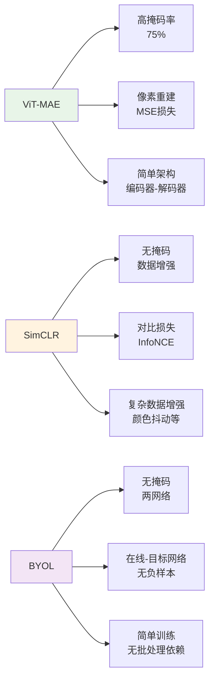

### 适用场景分析

| 场景 | 推荐方法 | 理由 |
|------|----------|------|
| 大规模数据集 | ViT-MAE | 高效利用数据，最优性能 |
| 小规模数据集 | SimCLR/BYOL | 不需要大量数据，训练快速 |
| 实时应用 | BYOL | 无重建过程，推理快 |
| 多模态任务 | ViT-MAE | 强大的特征提取能力 |

## 故障排除指南

### 常见问题及解决方案

1. **训练不收敛**
   - 检查学习率设置
   - 验证数据预处理是否正确
   - 确认掩码比例适中

2. **内存不足**
   - 减少批次大小
   - 启用梯度检查点
   - 使用混合精度训练

3. **重建质量差**
   - 增加解码器层数
   - 调整掩码比例
   - 使用归一化像素损失

4. **微调效果不佳**
   - 使用较小的学习率
   - 增加预热轮数
   - 检查数据分布一致性

### 调试技巧

1. **可视化掩码**：检查掩码模式是否合理
2. **监控损失曲线**：观察重建损失和总损失变化
3. **特征分析**：检查编码器特征的质量
4. **重建质量评估**：定期评估重建图像质量

**章节来源**
- [test_modeling_vit_mae.py](file://tests/models/vit_mae/test_modeling_vit_mae.py#L100-L150)

## 结论

ViT-MAE作为一种先进的自监督学习方法，在视觉Transformer领域取得了显著成果。其主要优势包括：

1. **高效学习**：通过高掩码率实现强大的特征学习能力
2. **简单架构**：编码器-解码器设计易于理解和实现
3. **优异性能**：在各种下游任务中表现出色
4. **广泛适用**：适用于多种视觉任务和领域

尽管ViT-MAE在性能上具有明显优势，但在实际应用中仍需考虑计算资源和训练时间的成本。对于资源有限的场景，可以考虑使用较小的模型变体或结合其他自监督方法。

未来的发展方向可能包括：
- 更高效的掩码策略
- 更好的重建损失函数
- 多尺度重建技术
- 跨模态自监督学习

通过深入理解ViT-MAE的架构设计和实现细节，研究者和开发者可以更好地应用这一技术解决实际问题，并为进一步的研究奠定基础。