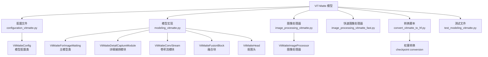
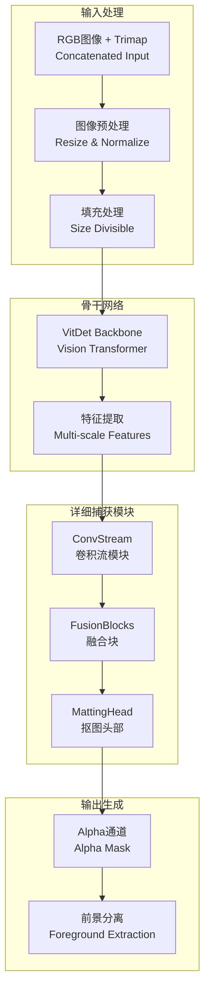
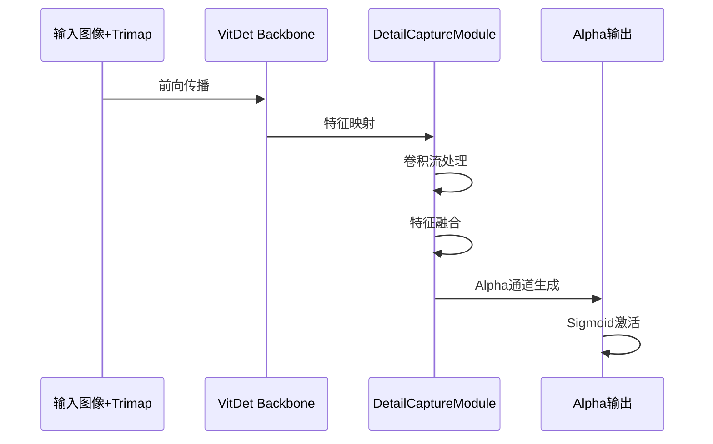
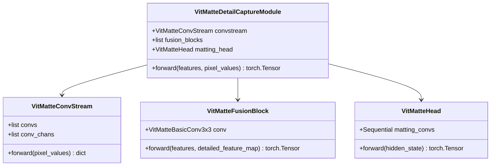
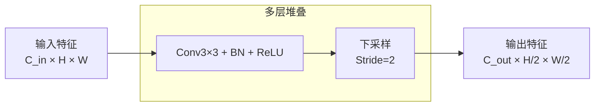
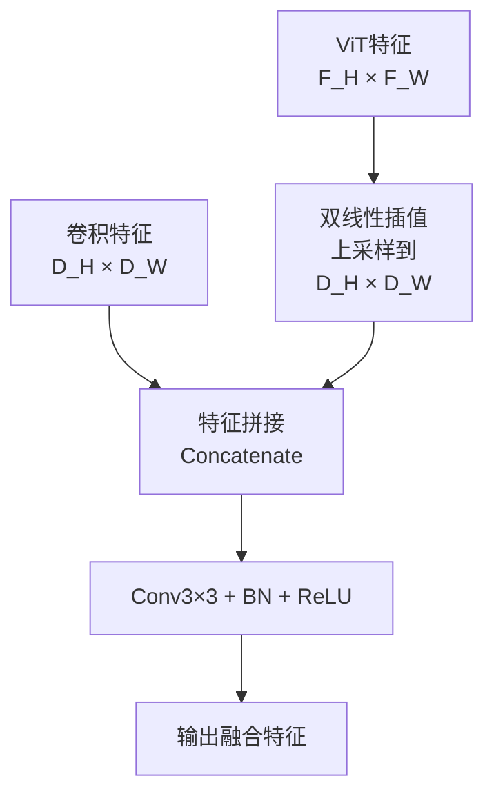
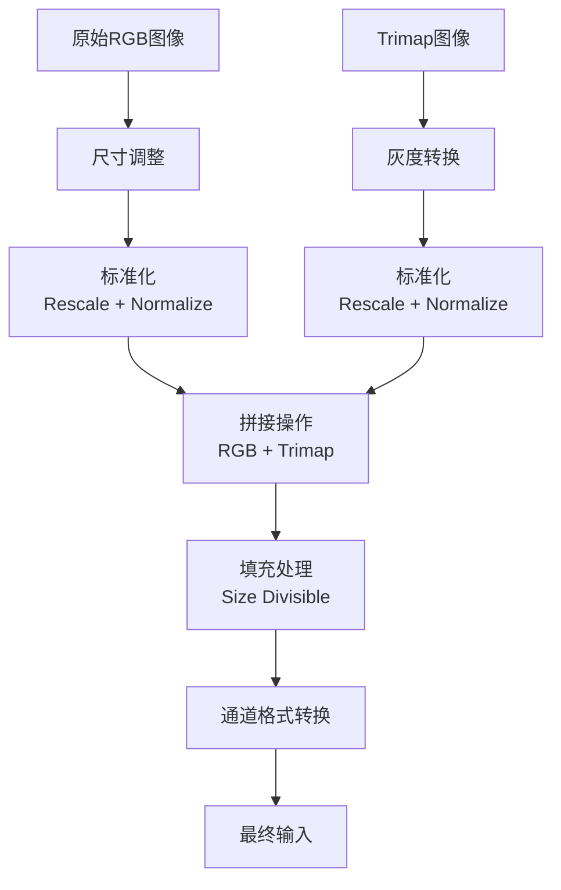
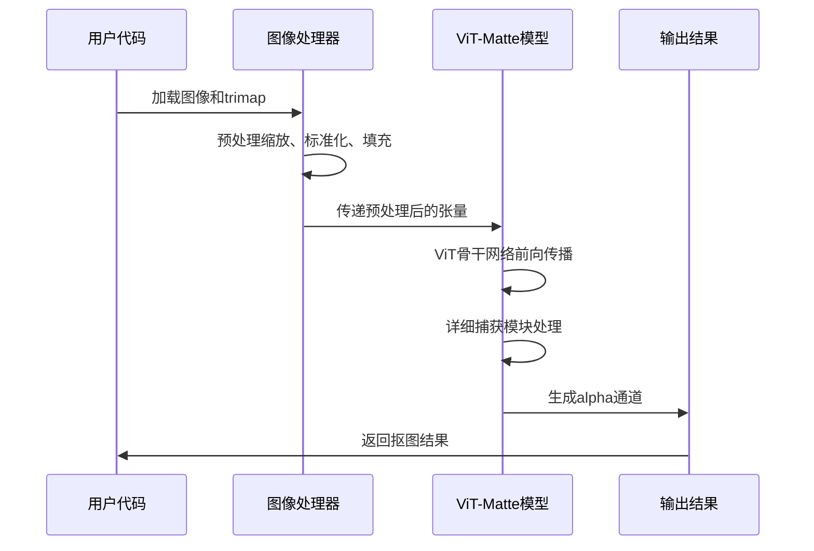

# ViT-Matte（图像抠图）

<cite>
**本文档中引用的文件**
- [modeling_vitmatte.py](file://src/transformers/models/vitmatte/modeling_vitmatte.py)
- [configuration_vitmatte.py](file://src/transformers/models/vitmatte/configuration_vitmatte.py)
- [image_processing_vitmatte.py](file://src/transformers/models/vitmatte/image_processing_vitmatte.py)
- [convert_vitmatte_to_hf.py](file://src/transformers/models/vitmatte/convert_vitmatte_to_hf.py)
- [test_modeling_vitmatte.py](file://tests/models/vitmatte/test_modeling_vitmatte.py)
- [vitmatte.md](file://docs/source/en/model_doc/vitmatte.md)
</cite>

## 目录
1. [简介](#简介)
2. [项目结构](#项目结构)
3. [核心组件](#核心组件)
4. [架构概览](#架构概览)
5. [详细组件分析](#详细组件分析)
6. [数据处理流程](#数据处理流程)
7. [模型推理与应用](#模型推理与应用)
8. [性能对比与优势](#性能对比与优势)
9. [应用场景与实践指南](#应用场景与实践指南)
10. [总结](#总结)

## 简介

ViT-Matte是一种基于Vision Transformer的高效图像抠图系统，专门用于准确估计图像中的前景对象并生成高质量的alpha蒙版。该模型通过结合ViT的强大建模能力和轻量级卷积模块，实现了在图像抠图任务上的卓越性能。

ViT-Matte的核心创新在于：
- 利用预训练的纯Vision Transformer作为骨干网络
- 引入混合注意力机制和卷积颈部结构
- 设计详细的捕获模块来补充抠图所需的细节信息
- 实现简洁而高效的架构适配

该模型在Composition-1k和Distinctions-646两个基准数据集上达到了最先进的性能，显著超越了之前的抠图方法。

## 项目结构

ViT-Matte模型在Hugging Face Transformers库中的组织结构如下：



**图表来源**
- [modeling_vitmatte.py](file://src/transformers/models/vitmatte/modeling_vitmatte.py#L1-L298)
- [configuration_vitmatte.py](file://src/transformers/models/vitmatte/configuration_vitmatte.py#L1-L127)
- [image_processing_vitmatte.py](file://src/transformers/models/vitmatte/image_processing_vitmatte.py#L1-L288)

**章节来源**
- [modeling_vitmatte.py](file://src/transformers/models/vitmatte/modeling_vitmatte.py#L1-L50)
- [configuration_vitmatte.py](file://src/transformers/models/vitmatte/configuration_vitmatte.py#L1-L50)

## 核心组件

ViT-Matte模型由以下核心组件构成：

### 主要架构组件

1. **VitMatteForImageMatting**: 主模型类，负责整体推理流程
2. **VitMatteDetailCaptureModule**: 详细捕获模块，融合特征并生成alpha通道
3. **VitMatteConvStream**: 卷积流模块，提取详细特征
4. **VitMatteFusionBlock**: 融合块，连接ViT特征和卷积特征
5. **VitMatteHead**: 抠图头部，生成最终的alpha值

### 配置参数

ViT-Matte支持丰富的配置选项：

| 参数 | 类型 | 默认值 | 描述 |
|------|------|--------|------|
| hidden_size | int | 384/768 | 编码器输入通道数 |
| convstream_hidden_sizes | list[int] | [48, 96, 192] | 卷积流模块输出通道 |
| fusion_hidden_sizes | list[int] | [256, 128, 64, 32] | 融合块输出通道 |
| batch_norm_eps | float | 1e-5 | 批归一化的epsilon值 |
| initializer_range | float | 0.02 | 权重初始化标准差 |

**章节来源**
- [modeling_vitmatte.py](file://src/transformers/models/vitmatte/modeling_vitmatte.py#L180-L220)
- [configuration_vitmatte.py](file://src/transformers/models/vitmatte/configuration_vitmatte.py#L60-L127)

## 架构概览

ViT-Matte的整体架构采用编码器-解码器结构，结合了Vision Transformer的强大特征提取能力和轻量级卷积模块的细节捕捉能力。



**图表来源**
- [modeling_vitmatte.py](file://src/transformers/models/vitmatte/modeling_vitmatte.py#L220-L280)
- [image_processing_vitmatte.py](file://src/transformers/models/vitmatte/image_processing_vitmatte.py#L150-L287)

## 详细组件分析

### VitMatteForImageMatting 主模型

主模型类负责整个推理流程，包含以下关键步骤：



**图表来源**
- [modeling_vitmatte.py](file://src/transformers/models/vitmatte/modeling_vitmatte.py#L220-L280)

### VitMatteDetailCaptureModule 详细捕获模块

详细捕获模块是ViT-Matte的核心创新，它巧妙地结合了ViT特征和卷积特征：



**图表来源**
- [modeling_vitmatte.py](file://src/transformers/models/vitmatte/modeling_vitmatte.py#L180-L220)
- [modeling_vitmatte.py](file://src/transformers/models/vitmatte/modeling_vitmatte.py#L137-L179)

### VitMatteConvStream 卷积流模块

卷积流模块通过一系列3×3卷积层提取详细的特征信息：



**图表来源**
- [modeling_vitmatte.py](file://src/transformers/models/vitmatte/modeling_vitmatte.py#L80-L136)

### VitMatteFusionBlock 融合块

融合块负责将ViT特征和卷积特征进行有效融合：



**图表来源**
- [modeling_vitmatte.py](file://src/transformers/models/vitmatte/modeling_vitmatte.py#L137-L179)

**章节来源**
- [modeling_vitmatte.py](file://src/transformers/models/vitmatte/modeling_vitmatte.py#L80-L220)

## 数据处理流程

### Trimap概念与作用

Trimap是ViT-Matte的关键输入元素，它为模型提供了关于前景、背景和未知区域的信息：

| Trimap值 | 含义 | 用途 |
|----------|------|------|
| 0 | 背景区域 | 明确的背景像素 |
| 128 | 未知区域 | 需要模型预测的边界区域 |
| 255 | 前景区域 | 明确的前景像素 |

### 图像预处理流程



**图表来源**
- [image_processing_vitmatte.py](file://src/transformers/models/vitmatte/image_processing_vitmatte.py#L150-L287)

### 数据处理参数配置

| 参数 | 默认值 | 描述 |
|------|--------|------|
| do_rescale | True | 是否对图像值进行缩放 |
| rescale_factor | 1/255 | 缩放因子 |
| do_normalize | True | 是否进行标准化 |
| image_mean | IMAGENET_STANDARD_MEAN | 图像均值 |
| image_std | IMAGENET_STANDARD_STD | 图像标准差 |
| do_pad | True | 是否进行填充 |
| size_divisor | 32 | 尺寸除数 |

**章节来源**
- [image_processing_vitmatte.py](file://src/transformers/models/vitmatte/image_processing_vitmatte.py#L50-L150)
- [image_processing_vitmatte.py](file://src/transformers/models/vitmatte/image_processing_vitmatte.py#L150-L287)

## 模型推理与应用

### 基础推理代码示例

以下是使用ViT-Matte进行图像抠图的基础代码：

```python
# 导入必要的库
from transformers import VitMatteImageProcessor, VitMatteForImageMatting
from PIL import Image
import torch

# 加载预训练模型和处理器
processor = VitMatteImageProcessor.from_pretrained("hustvl/vitmatte-small-composition-1k")
model = VitMatteForImageMatting.from_pretrained("hustvl/vitmatte-small-composition-1k")

# 加载输入图像和trimap
image = Image.open("input_image.jpg").convert("RGB")
trimap = Image.open("input_trimap.png").convert("L")

# 准备输入数据
inputs = processor(images=image, trimaps=trimap, return_tensors="pt")

# 模型推理
with torch.no_grad():
    outputs = model(**inputs)
    alphas = outputs.alphas

# 输出结果形状：[batch_size, 1, height, width]
print(f"Alpha通道形状: {alphas.shape}")
```

### 推理流程详解



**图表来源**
- [modeling_vitmatte.py](file://src/transformers/models/vitmatte/modeling_vitmatte.py#L250-L280)

### 结果后处理

生成的alpha通道需要进行适当的后处理以获得最佳效果：

```python
# alpha通道后处理
def post_process_alpha(alpha_tensor, threshold=0.1):
    """对alpha通道进行后处理"""
    # 应用阈值过滤
    alpha_processed = torch.clamp(alpha_tensor, min=threshold, max=1.0)
    
    # 可选：应用形态学操作去除噪声
    # 这里可以添加开运算、闭运算等
    
    return alpha_processed

# 使用示例
processed_alpha = post_process_alpha(alphas)
```

**章节来源**
- [test_modeling_vitmatte.py](file://tests/models/vitmatte/test_modeling_vitmatte.py#L265-L293)
- [modeling_vitmatte.py](file://src/transformers/models/vitmatte/modeling_vitmatte.py#L250-L280)

## 性能对比与优势

### 与其他抠图方法的对比

| 方法 | 计算复杂度 | 内存需求 | 精度 | 适用场景 |
|------|------------|----------|------|----------|
| ViT-Matte | 中等 | 低 | 最高 | 通用图像抠图 |
| 泊松抠图 | 低 | 低 | 中等 | 简单背景分离 |
| U-Net基方法 | 高 | 高 | 高 | 专业级抠图 |
| DeepLab | 中等 | 中等 | 高 | 场景分割 |

### ViT-Matte的优势

1. **预训练优势**: 利用大规模预训练的ViT模型
2. **简洁架构**: 架构设计简洁，易于部署
3. **高性能**: 在多个基准数据集上达到SOTA
4. **灵活性**: 支持多种输入尺寸和分辨率
5. **轻量化**: 相比其他深度学习方法更轻量

### 模型变体对比

| 模型名称 | 参数规模 | 精度 | 推理速度 | 内存占用 |
|----------|----------|------|----------|----------|
| vitmatte-small-composition-1k | ~10M | 优秀 | 快速 | 低 |
| vitmatte-base-composition-1k | ~30M | 更好 | 中等 | 中等 |
| vitmatte-small-distinctions-646 | ~10M | 优秀 | 快速 | 低 |
| vitmatte-base-distinctions-646 | ~30M | 更好 | 中等 | 中等 |

**章节来源**
- [convert_vitmatte_to_hf.py](file://src/transformers/models/vitmatte/convert_vitmatte_to_hf.py#L112-L133)

## 应用场景与实践指南

### 人像抠图应用

人像抠图是ViT-Matte的主要应用场景之一：

```python
# 人像抠图示例
def portrait_matting(image_path, trimap_path):
    """人像图像抠图函数"""
    # 加载模型和处理器
    processor = VitMatteImageProcessor.from_pretrained("hustvl/vitmatte-small-composition-1k")
    model = VitMatteForImageMatting.from_pretrained("hustvl/vitmatte-small-composition-1k")
    
    # 加载图像
    image = Image.open(image_path).convert("RGB")
    trimap = Image.open(trimap_path).convert("L")
    
    # 处理和推理
    inputs = processor(images=image, trimaps=trimap, return_tensors="pt")
    with torch.no_grad():
        outputs = model(**inputs)
        alpha = outputs.alphas
    
    # 后处理
    alpha_processed = torch.clamp(alpha, 0.0, 1.0)
    
    return alpha_processed

# 使用示例
alpha_result = portrait_matting("portrait.jpg", "portrait_trimap.png")
```

### 商品抠图应用

对于商品图像，ViT-Matte同样表现出色：

```python
# 商品抠图优化
def product_matting_optimized(image_path, trimap_path):
    """优化的商品抠图流程"""
    # 加载模型
    model = VitMatteForImageMatting.from_pretrained("hustvl/vitmatte-base-composition-1k")
    
    # 高质量预处理
    processor = VitMatteImageProcessor(
        do_rescale=True,
        rescale_factor=1/255,
        do_normalize=True,
        image_mean=[0.485, 0.456, 0.406],
        image_std=[0.229, 0.224, 0.225],
        do_pad=True,
        size_divisor=32
    )
    
    # 处理和推理
    image = Image.open(image_path).convert("RGB")
    trimap = Image.open(trimap_path).convert("L")
    
    inputs = processor(images=image, trimaps=trimap, return_tensors="pt")
    with torch.no_grad():
        outputs = model(**inputs)
        alpha = outputs.alphas
    
    # 商品抠图专用后处理
    alpha_denoised = denoise_alpha(alpha)
    alpha_enhanced = enhance_contrast(alpha_denoised)
    
    return alpha_enhanced

def denoise_alpha(alpha_tensor):
    """去噪处理"""
    # 可以使用双边滤波或其他去噪算法
    return alpha_tensor

def enhance_contrast(alpha_tensor):
    """对比度增强"""
    # 对alpha通道进行对比度调整
    return alpha_tensor
```

### 批量处理指南

对于大量图像的批量处理，建议采用以下策略：

```python
# 批量处理示例
def batch_matting(image_paths, trimap_paths, output_dir):
    """批量图像抠图处理"""
    model = VitMatteForImageMatting.from_pretrained("hustvl/vitmatte-small-composition-1k")
    processor = VitMatteImageProcessor.from_pretrained("hustvl/vitmatte-small-composition-1k")
    
    for img_path, trimap_path in zip(image_paths, trimap_paths):
        try:
            # 加载图像
            image = Image.open(img_path).convert("RGB")
            trimap = Image.open(trimap_path).convert("L")
            
            # 处理和推理
            inputs = processor(images=image, trimaps=trimap, return_tensors="pt")
            with torch.no_grad():
                outputs = model(**inputs)
                alpha = outputs.alphas
            
            # 保存结果
            save_path = os.path.join(output_dir, os.path.basename(img_path))
            save_alpha_as_image(alpha, save_path)
            
        except Exception as e:
            print(f"处理失败 {img_path}: {e}")

def save_alpha_as_image(alpha_tensor, save_path):
    """将alpha通道保存为灰度图像"""
    alpha_np = alpha_tensor.squeeze().cpu().numpy()
    alpha_uint8 = (alpha_np * 255).astype(np.uint8)
    Image.fromarray(alpha_uint8, mode='L').save(save_path)
```

### 性能优化建议

1. **硬件优化**:
   - 使用GPU加速推理
   - 启用混合精度训练
   - 利用TensorRT等推理引擎

2. **模型优化**:
   - 选择合适的模型变体
   - 调整输入图像尺寸
   - 使用模型量化

3. **批处理优化**:
   - 统一批处理大小
   - 预分配内存空间
   - 并行处理多个样本

**章节来源**
- [test_modeling_vitmatte.py](file://tests/models/vitmatte/test_modeling_vitmatte.py#L265-L293)
- [convert_vitmatte_to_hf.py](file://src/transformers/models/vitmatte/convert_vitmatte_to_hf.py#L112-L133)

## 总结

ViT-Matte代表了图像抠图领域的重要进展，它成功地将Vision Transformer的强大特征提取能力应用于这一复杂的计算机视觉任务。通过精心设计的架构和创新的详细捕获模块，ViT-Matte在保持计算效率的同时实现了卓越的抠图精度。

### 关键技术特点

1. **架构创新**: 结合ViT和卷积模块的优势，实现了高效的特征融合
2. **简洁设计**: 相比其他深度学习方法，架构更加简洁易用
3. **广泛适用**: 在人像、商品等多种场景下都有良好的表现
4. **易于部署**: 提供了完整的工具链和预训练模型

### 应用前景

ViT-Matte为图像编辑、视频处理、虚拟现实等领域提供了强大的技术支持。随着技术的不断发展，我们可以期待：
- 更高效的模型架构
- 更广泛的场景适应性
- 更好的实时处理能力

通过本文档的详细介绍，开发者可以深入理解ViT-Matte的工作原理，并在实际项目中有效应用这一先进的图像抠图技术。