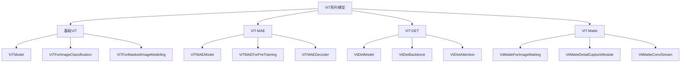
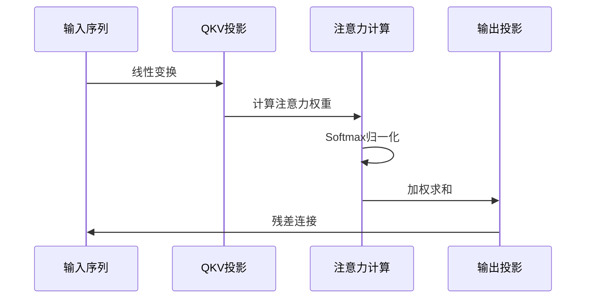
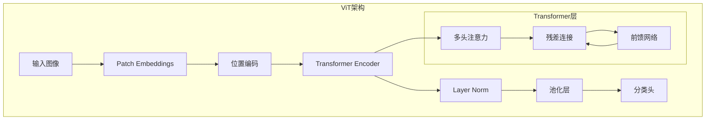
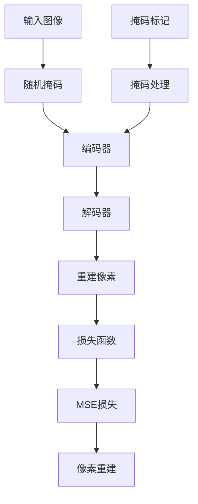
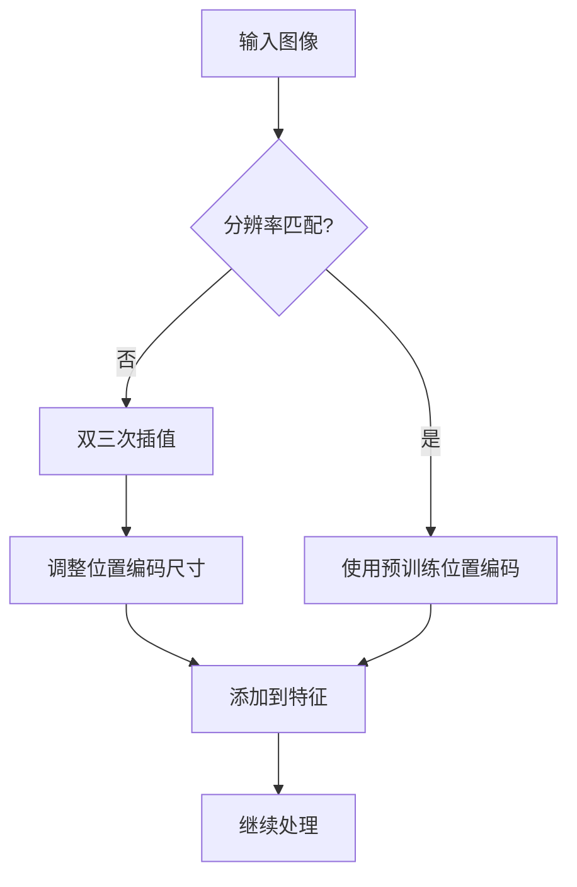
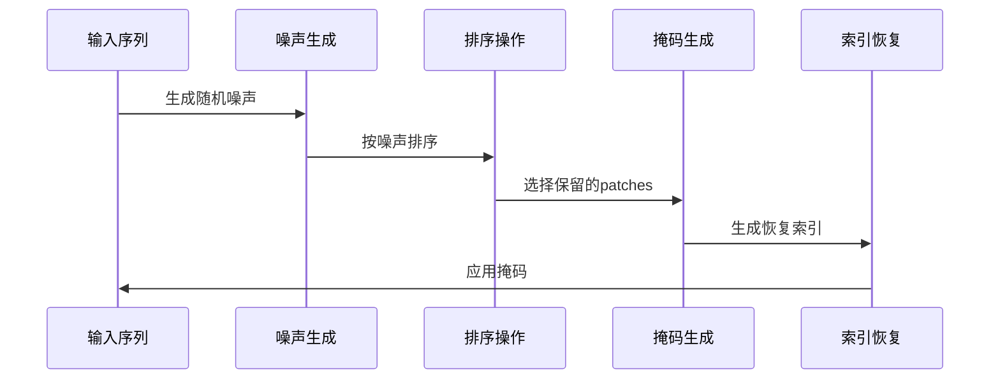

# ViT系列模型：架构设计与实现详解

<cite>
**本文档引用的文件**
- [modeling_vit.py](file://src/transformers/models/vit/modeling_vit.py)
- [configuration_vit.py](file://src/transformers/models/vit/configuration_vit.py)
- [modeling_vit_mae.py](file://src/transformers/models/vit_mae/modeling_vit_mae.py)
- [configuration_vit_mae.py](file://src/transformers/models/vit_mae/configuration_vit_mae.py)
- [modeling_vitdet.py](file://src/transformers/models/vitdet/modeling_vitdet.py)
- [configuration_vitdet.py](file://src/transformers/models/vitdet/configuration_vitdet.py)
- [modeling_vitmatte.py](file://src/transformers/models/vitmatte/modeling_vitmatte.py)
- [configuration_vitmatte.py](file://src/transformers/models/vitmatte/configuration_vitmatte.py)
</cite>

## 目录
1. [引言](#引言)
2. [项目结构概览](#项目结构概览)
3. [核心组件分析](#核心组件分析)
4. [架构设计详解](#架构设计详解)
5. [ViT系列变体详解](#vit系列变体详解)
6. [关键算法实现](#关键算法实现)
7. [配置参数分析](#配置参数分析)
8. [性能优化与资源选择](#性能优化与资源选择)
9. [实际应用示例](#实际应用示例)
10. [总结](#总结)

## 引言

Vision Transformer（ViT）系列模型代表了计算机视觉领域的重要突破，它将自然语言处理中成功的Transformer架构成功迁移到图像识别任务中。本文档深入分析ViT系列模型的架构设计、实现细节以及各种变体的工作原理。

ViT系列包括：
- **标准ViT**：基础的视觉Transformer架构
- **ViT-MAE**：基于掩码自编码器的自监督学习模型
- **ViT-DET**：专门用于目标检测的Transformer骨干网络
- **ViT-Matte**：用于图像抠图的专用模型

## 项目结构概览

ViT系列模型在transformers库中的组织结构体现了清晰的模块化设计：



**图表来源**
- [modeling_vit.py](file://src/transformers/models/vit/modeling_vit.py#L1-L50)
- [modeling_vit_mae.py](file://src/transformers/models/vit_mae/modeling_vit_mae.py#L1-L50)
- [modeling_vitdet.py](file://src/transformers/models/vitdet/modeling_vitdet.py#L1-L50)
- [modeling_vitmatte.py](file://src/transformers/models/vitmatte/modeling_vitmatte.py#L1-L50)

## 核心组件分析

### Patch Embedding机制

Patch Embedding是ViT的核心创新之一，它将输入图像转换为可处理的序列形式：

```mermaid
flowchart TD
A[输入图像<br/>H×W×C] --> B[卷积投影<br/>Conv2D]
B --> C[展平操作<br/>Flatten]
C --> D[线性变换<br/>Linear]
D --> E[序列嵌入<br/>N×(H×W/P²)×D]
F[位置编码<br/>PE] --> G[相加操作]
E --> G
G --> H[最终输出<br/>序列特征]
```

**图表来源**
- [modeling_vit.py](file://src/transformers/models/vit/modeling_vit.py#L125-L150)

**节来源**
- [modeling_vit.py](file://src/transformers/models/vit/modeling_vit.py#L125-L150)

### 注意力机制实现

ViT采用多头自注意力机制来捕获全局依赖关系：



**图表来源**
- [modeling_vit.py](file://src/transformers/models/vit/modeling_vit.py#L250-L300)

**节来源**
- [modeling_vit.py](file://src/transformers/models/vit/modeling_vit.py#L250-L300)

## 架构设计详解

### 标准ViT架构

标准ViT遵循经典的Transformer编码器架构：



**图表来源**
- [modeling_vit.py](file://src/transformers/models/vit/modeling_vit.py#L400-L450)

**节来源**
- [modeling_vit.py](file://src/transformers/models/vit/modeling_vit.py#L400-L450)

### ViT-MAE自编码器架构

ViT-MAE采用掩码自编码器框架进行自监督学习：



**图表来源**
- [modeling_vit_mae.py](file://src/transformers/models/vit_mae/modeling_vit_mae.py#L732-L755)

**节来源**
- [modeling_vit_mae.py](file://src/transformers/models/vit_mae/modeling_vit_mae.py#L732-L755)

## ViT系列变体详解

### ViT-MAE（掩码自编码器）

ViT-MAE通过随机掩码输入图像的大部分区域，迫使模型学习重建被掩码的部分：

#### 掩码策略
- **随机掩码**：按预设比例随机选择要掩码的patches
- **掩码标记**：用特殊标记替换被掩码的patches
- **索引恢复**：保存原始顺序以便解码器使用

#### 解码器设计
- **解码器嵌入**：将编码器输出映射到解码器维度
- **掩码令牌**：为被掩码的patches准备特殊令牌
- **位置编码**：使用正弦余弦位置编码

**节来源**
- [modeling_vit_mae.py](file://src/transformers/models/vit_mae/modeling_vit_mae.py#L200-L300)

### ViT-DET（目标检测）

ViT-DET专为目标检测任务设计，结合了局部窗口注意力和残差块：

#### 窗口注意力机制
- **窗口划分**：将特征图划分为不重叠的小窗口
- **局部注意力**：在每个窗口内执行自注意力计算
- **窗口重组**：将窗口特征重新组合成完整特征图

#### 残差块集成
- **瓶颈结构**：使用1×1、3×3、1×1卷积堆栈
- **层归一化**：在每个卷积层后应用层归一化
- **跳跃连接**：保持残差连接以促进训练

**节来源**
- [modeling_vitdet.py](file://src/transformers/models/vitdet/modeling_vitdet.py#L400-L500)

### ViT-Matte（图像抠图）

ViT-Matte专门用于图像抠图任务，结合了视觉Transformer和卷积流：

#### 细节捕捉模块
- **卷积流**：提取多尺度细节特征
- **特征融合**：将卷积特征与Transformer特征融合
- **上采样**：逐步恢复特征图分辨率

#### 分割头设计
- **3×3卷积**：特征提取和降维
- **1×1卷积**：生成最终的alpha图
- **Sigmoid激活**：确保输出在[0,1]范围内

**节来源**
- [modeling_vitmatte.py](file://src/transformers/models/vitmatte/modeling_vitmatte.py#L150-L200)

## 关键算法实现

### 位置编码插值

ViT支持动态位置编码插值，允许模型处理不同分辨率的输入：



**图表来源**
- [modeling_vit.py](file://src/transformers/models/vit/modeling_vit.py#L40-L80)

**节来源**
- [modeling_vit.py](file://src/transformers/models/vit/modeling_vit.py#L40-L80)

### 随机掩码实现

ViT-MAE的随机掩码机制确保训练过程的随机性和鲁棒性：



**图表来源**
- [modeling_vit_mae.py](file://src/transformers/models/vit_mae/modeling_vit_mae.py#L250-L300)

**节来源**
- [modeling_vit_mae.py](file://src/transformers/models/vit_mae/modeling_vit_mae.py#L250-L300)

## 配置参数分析

### 核心配置参数

| 参数名称 | 默认值 | 说明 | 对性能的影响 |
|---------|--------|------|-------------|
| hidden_size | 768 | 隐藏层维度 | 影响模型容量和计算复杂度 |
| num_hidden_layers | 12 | Transformer层数 | 决定模型深度和表达能力 |
| num_attention_heads | 12 | 注意力头数 | 影响并行计算能力和特征表示 |
| patch_size | 16 | 图像分块大小 | 直接影响输入序列长度 |
| image_size | 224 | 输入图像尺寸 | 影响内存占用和计算量 |

### ViT-MAE特有参数

| 参数名称 | 默认值 | 说明 | 调优建议 |
|---------|--------|------|----------|
| mask_ratio | 0.75 | 掩码比例 | 较高比例提高泛化能力 |
| decoder_hidden_size | 512 | 解码器维度 | 通常小于编码器维度 |
| decoder_num_layers | 8 | 解码器层数 | 较少层数减少过拟合风险 |

### ViT-DET特有参数

| 参数名称 | 默认值 | 说明 | 性能影响 |
|---------|--------|------|----------|
| window_size | 0 | 窗口大小 | 设置为非零值启用窗口注意力 |
| drop_path_rate | 0.0 | 随机深度率 | 控制梯度流动和过拟合 |
| mlp_ratio | 4 | MLP扩展比例 | 影响计算效率和表达能力 |

**节来源**
- [configuration_vit.py](file://src/transformers/models/vit/configuration_vit.py#L50-L100)
- [configuration_vit_mae.py](file://src/transformers/models/vit_mae/configuration_vit_mae.py#L50-L100)
- [configuration_vitdet.py](file://src/transformers/models/vitdet/configuration_vitdet.py#L50-L100)

## 性能优化与资源选择

### 不同计算资源的选择建议

#### 高端GPU环境
- **推荐模型**：ViT-Huge (hidden_size=1280, num_layers=32)
- **适用场景**：研究和生产环境，需要最高精度
- **内存需求**：至少16GB GPU内存

#### 中端GPU环境  
- **推荐模型**：ViT-Base (hidden_size=768, num_layers=12)
- **适用场景**：开发和部署环境
- **内存需求**：8-12GB GPU内存

#### 移动设备环境
- **推荐模型**：ViT-Tiny (hidden_size=192, num_layers=12)
- **适用场景**：移动端推理
- **内存需求**：2-4GB GPU内存

### 优化策略

#### 模型压缩
- **知识蒸馏**：使用大模型指导小模型训练
- **量化**：INT8或FP16量化减少内存占用
- **剪枝**：移除冗余的注意力头或层

#### 计算优化
- **混合精度**：使用FP16加速训练和推理
- **梯度检查点**：减少内存占用，增加计算时间
- **并行策略**：数据并行和模型并行

## 实际应用示例

### 图像分类示例

```python
# 图像分类基本流程
from transformers import ViTForImageClassification, ViTImageProcessor
from PIL import Image

# 加载预训练模型和处理器
model = ViTForImageClassification.from_pretrained('google/vit-base-patch16-224')
processor = ViTImageProcessor.from_pretrained('google/vit-base-patch16-224')

# 准备输入
image = Image.open('image.jpg')
inputs = processor(images=image, return_tensors='pt')

# 推理
with torch.no_grad():
    outputs = model(**inputs)
    logits = outputs.logits
    predicted_class = logits.argmax(-1).item()
```

### 自监督预训练示例

```python
# ViT-MAE预训练流程
from transformers import ViTMAEForPreTraining, ViTImageProcessor

# 加载MAE模型
model = ViTMAEForPreTraining.from_pretrained('facebook/vit-mae-base')
processor = ViTImageProcessor.from_pretrained('facebook/vit-mae-base')

# 数据增强和掩码
inputs = processor(images=image, return_tensors='pt')
outputs = model(**inputs)

# 获取重建损失
loss = outputs.loss
reconstruction = outputs.logits
```

### 目标检测示例

```python
# ViT-DET作为检测骨干
from transformers import VitDetBackbone

# 加载ViT-DET骨干
backbone = VitDetBackbone.from_pretrained('google/vitdet-base-patch16-224')

# 获取特征图
feature_maps = backbone(pixel_values)['feature_maps']
```

### 图像抠图示例

```python
# ViT-Matte图像抠图
from transformers import VitMatteForImageMatting, VitMatteImageProcessor

# 加载抠图模型
model = VitMatteForImageMatting.from_pretrained('hustvl/vitmatte-small-composition-1k')
processor = VitMatteImageProcessor.from_pretrained('hustvl/vitmatte-small-composition-1k')

# 处理输入图像和trimap
inputs = processor(images=image, trimaps=trimap, return_tensors='pt')
with torch.no_grad():
    alphas = model(**inputs).alphas
```

## 总结

ViT系列模型代表了计算机视觉领域的重要进展，通过将Transformer架构成功应用于图像识别任务，展现了强大的性能和灵活性。本文档详细分析了：

1. **架构设计**：从Patch Embedding到多头注意力的完整流水线
2. **变体特点**：每种变体针对特定任务的优化设计
3. **实现细节**：关键算法的具体实现方式
4. **配置优化**：参数调优和资源配置建议
5. **实际应用**：各种任务的使用示例

ViT系列模型的成功证明了Transformer架构在计算机视觉领域的巨大潜力，为未来的研究和发展奠定了坚实基础。随着技术的不断进步，我们可以期待更多创新的视觉Transformer架构出现，进一步推动计算机视觉领域的发展。