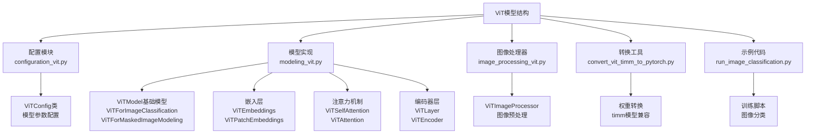
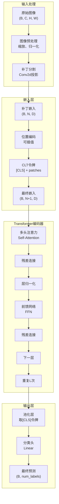
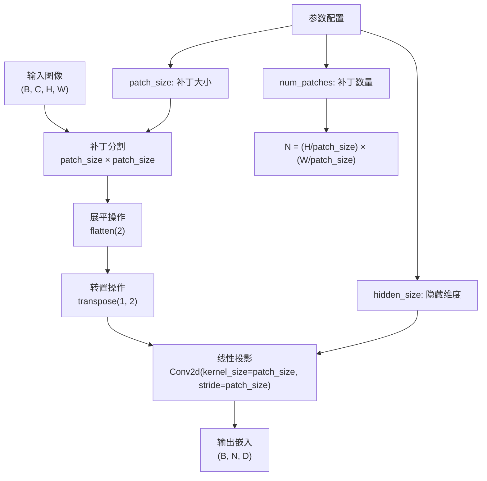
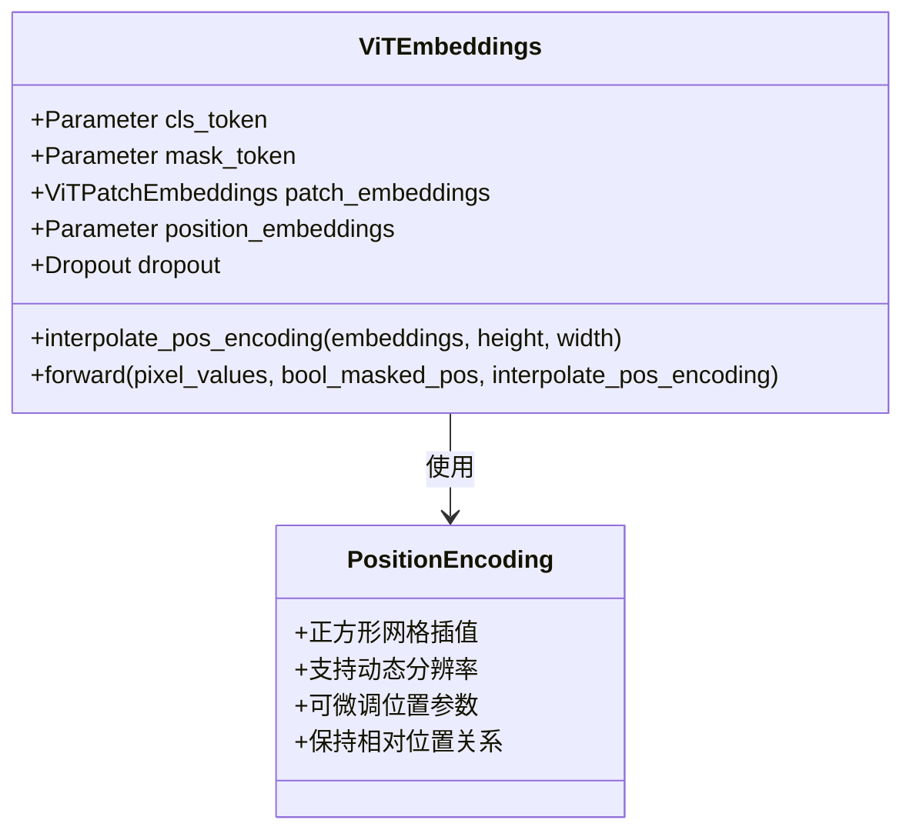
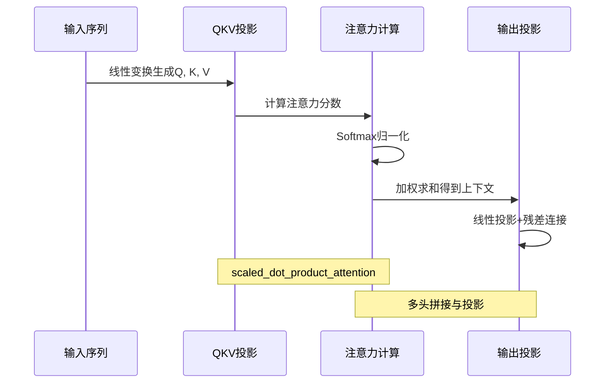
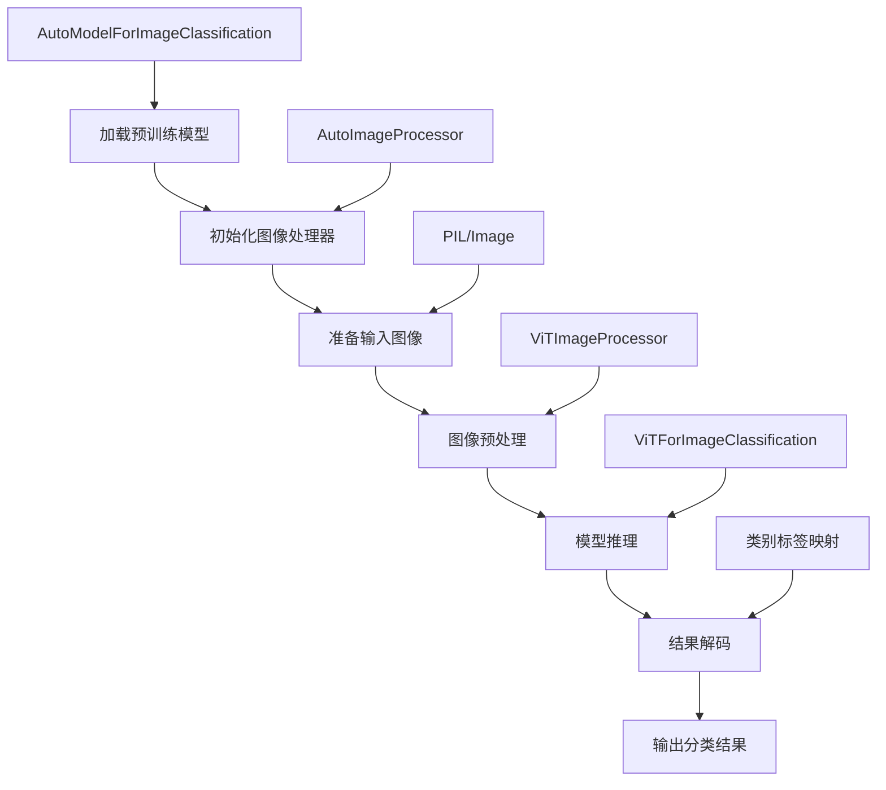

# 标准Vision Transformer（ViT）模型

<cite>
**本文档中引用的文件**
- [configuration_vit.py](file://src/transformers/models/vit/configuration_vit.py)
- [modeling_vit.py](file://src/transformers/models/vit/modeling_vit.py)
- [image_processing_vit.py](file://src/transformers/models/vit/image_processing_vit.py)
- [convert_vit_timm_to_pytorch.py](file://src/transformers/models/vit/convert_vit_timm_to_pytorch.py)
- [run_image_classification.py](file://examples/pytorch/image-classification/run_image_classification.py)
</cite>

## 目录
1. [简介](#简介)
2. [项目结构](#项目结构)
3. [核心组件](#核心组件)
4. [架构概览](#架构概览)
5. [详细组件分析](#详细组件分析)
6. [模型配置参数](#模型配置参数)
7. [图像分类任务实现](#图像分类任务实现)
8. [性能对比与优化](#性能对比与优化)
9. [高级API使用](#高级api使用)
10. [故障排除指南](#故障排除指南)
11. [结论](#结论)

## 简介

Vision Transformer（ViT）是一种基于Transformer架构的视觉模型，它将自然语言处理中的Transformer成功地应用于计算机视觉任务。与传统的卷积神经网络（CNN）不同，ViT通过将图像分割成固定大小的补丁（patches），然后将这些补丁视为序列来处理，从而实现了端到端的图像分类。

ViT的核心创新在于：
- **图像分块（Patch Embedding）**：将输入图像分割成固定大小的补丁
- **位置编码（Positional Encoding）**：为每个补丁添加位置信息
- **多头注意力机制（Multi-Head Attention）**：捕捉全局特征依赖关系
- **Transformer编码器**：通过多层自注意力和前馈网络处理序列

## 项目结构

ViT模型在transformers库中的组织结构清晰明确，主要包含以下核心模块：



**图表来源**
- [configuration_vit.py](file://src/transformers/models/vit/configuration_vit.py#L1-L128)
- [modeling_vit.py](file://src/transformers/models/vit/modeling_vit.py#L1-L651)
- [image_processing_vit.py](file://src/transformers/models/vit/image_processing_vit.py#L1-L284)

**章节来源**
- [configuration_vit.py](file://src/transformers/models/vit/configuration_vit.py#L1-L128)
- [modeling_vit.py](file://src/transformers/models/vit/modeling_vit.py#L1-L651)
- [image_processing_vit.py](file://src/transformers/models/vit/image_processing_vit.py#L1-L284)

## 核心组件

ViT模型由多个关键组件构成，每个组件都有其特定的功能和作用：

### 主要组件概述

| 组件名称 | 功能描述 | 输入维度 | 输出维度 |
|---------|---------|---------|---------|
| ViTEmbeddings | 构建CLT令牌、位置编码和补丁嵌入 | (B, C, H, W) | (B, N+1, D) |
| ViTPatchEmbeddings | 将像素值转换为初始隐藏状态 | (B, C, H, W) | (B, N, D) |
| ViTAttention | 多头自注意力机制 | (B, N, D) | (B, N, D) |
| ViTLayer | 单层Transformer编码器 | (B, N, D) | (B, N, D) |
| ViTEncoder | 完整的Transformer编码器 | (B, N, D) | (B, N, D) |
| ViTPooler | 池化层提取特征 | (B, N, D) | (B, D) |

**章节来源**
- [modeling_vit.py](file://src/transformers/models/vit/modeling_vit.py#L40-L150)
- [modeling_vit.py](file://src/transformers/models/vit/modeling_vit.py#L150-L250)

## 架构概览

ViT的整体架构遵循标准的Transformer设计模式，但针对图像处理进行了特殊优化：



**图表来源**
- [modeling_vit.py](file://src/transformers/models/vit/modeling_vit.py#L40-L120)
- [modeling_vit.py](file://src/transformers/models/vit/modeling_vit.py#L350-L450)

## 详细组件分析

### 图像分块（Patch Embedding）

图像分块是ViT的核心创新之一，它将连续的图像空间转换为离散的序列表示：



**图表来源**
- [modeling_vit.py](file://src/transformers/models/vit/modeling_vit.py#L125-L150)

#### 关键特性

1. **补丁大小（patch_size）**：控制图像分割的粒度，常见值为16×16或32×32
2. **嵌入维度（hidden_size）**：决定每个补丁的向量表示维度
3. **补丁数量**：根据图像尺寸和补丁大小动态计算

**章节来源**
- [modeling_vit.py](file://src/transformers/models/vit/modeling_vit.py#L125-L150)

### 位置编码（Positional Encoding）

位置编码为序列中的每个元素提供位置信息，这是ViT区别于原始Transformer的重要改进：



**图表来源**
- [modeling_vit.py](file://src/transformers/models/vit/modeling_vit.py#L40-L120)

#### 插值位置编码

ViT支持动态调整位置编码以适应不同分辨率的图像：

1. **静态位置编码**：适用于固定分辨率训练
2. **插值位置编码**：支持更高分辨率推理
3. **可微调参数**：允许模型学习最优位置表示

**章节来源**
- [modeling_vit.py](file://src/transformers/models/vit/modeling_vit.py#L60-L120)

### 多头注意力机制（Multi-Head Attention）

ViT使用标准的多头自注意力机制来捕获全局特征依赖关系：



**图表来源**
- [modeling_vit.py](file://src/transformers/models/vit/modeling_vit.py#L250-L350)

#### 注意力计算公式

ViT的注意力机制遵循标准Transformer公式：

1. **查询（Query）**：`Q = XW_Q`
2. **键（Key）**：`K = XW_K`
3. **值（Value）**：`V = XW_V`
4. **注意力分数**：`Attention(Q,K,V) = softmax(QK^T/√d_k)V`

其中`d_k`是键向量的维度，用于缩放点积以稳定梯度。

**章节来源**
- [modeling_vit.py](file://src/transformers/models/vit/modeling_vit.py#L250-L350)

### MLP层（Feed-Forward Network）

每个Transformer层都包含一个前馈网络，用于进一步处理注意力输出：


**图表来源**
- [modeling_vit.py](file://src/transformers/models/vit/modeling_vit.py#L300-L350)

**章节来源**
- [modeling_vit.py](file://src/transformers/models/vit/modeling_vit.py#L300-L350)

## 模型配置参数

ViT模型的配置参数决定了模型的架构和性能特征：

### 核心配置参数表

| 参数名称 | 默认值 | 类型 | 描述 | 性能影响 |
|---------|-------|------|------|---------|
| hidden_size | 768 | int | 隐藏层维度 | 影响模型容量和计算复杂度 |
| num_hidden_layers | 12 | int | Transformer层数 | 决定模型深度和表达能力 |
| num_attention_heads | 12 | int | 注意力头数 | 影响并行处理能力和特征多样性 |
| intermediate_size | 3072 | int | 中间层维度 | 控制前馈网络容量 |
| patch_size | 16 | int | 补丁大小 | 影响输入分辨率和计算效率 |
| image_size | 224 | int | 输入图像尺寸 | 决定模型适用的图像分辨率 |
| num_channels | 3 | int | 输入通道数 | 通常为3（RGB） |
| qkv_bias | True | bool | 是否添加偏置项 | 影响参数量和表达能力 |

### 不同规模ViT模型对比

| 模型变体 | hidden_size | num_layers | num_heads | 参数量 | 推理速度 | 准确率 |
|---------|------------|-----------|----------|--------|---------|--------|
| ViT-Base | 768 | 12 | 12 | ~86M | 快速 | 优秀 |
| ViT-Large | 1024 | 24 | 16 | ~307M | 较慢 | 更高 |
| ViT-Huge | 1280 | 32 | 16 | ~632M | 最慢 | 最高 |

**章节来源**
- [configuration_vit.py](file://src/transformers/models/vit/configuration_vit.py#L40-L120)

## 图像分类任务实现

### 完整的图像分类工作流程

以下是使用ViT进行图像分类的完整代码示例：



**图表来源**
- [run_image_classification.py](file://examples/pytorch/image-classification/run_image_classification.py#L300-L400)

### 基础使用示例

#### 1. 模型加载与初始化

```python
# 加载预训练模型和处理器
from transformers import AutoModelForImageClassification, AutoImageProcessor

model_name = "google/vit-base-patch16-224-in21k"
model = AutoModelForImageClassification.from_pretrained(model_name)
processor = AutoImageProcessor.from_pretrained(model_name)
```

#### 2. 图像预处理

```python
# 图像预处理管道
from PIL import Image
import requests

# 加载图像
url = "http://images.cocodataset.org/val2017/000000039769.jpg"
image = Image.open(requests.get(url, stream=True).raw)

# 预处理
inputs = processor(images=image, return_tensors="pt")
```

#### 3. 前向传播

```python
# 模型推理
with torch.no_grad():
    outputs = model(**inputs)
    logits = outputs.logits

# 获取预测结果
predicted_class_idx = logits.argmax(-1).item()
print(f"预测类别: {model.config.id2label[predicted_class_idx]}")
```

#### 4. 结果解码

```python
# 获取top-k预测
import torch.nn.functional as F

probs = F.softmax(logits, dim=1)
top5_probs, top5_idx = probs.topk(5, dim=1)

for prob, idx in zip(top5_probs[0], top5_idx[0]):
    print(f"{model.config.id2label[idx.item()]}: {prob:.4f}")
```

**章节来源**
- [run_image_classification.py](file://examples/pytorch/image-classification/run_image_classification.py#L300-L431)

### 微调训练示例

#### 数据准备

```python
# 自定义数据集处理
from torchvision.transforms import Compose, Resize, CenterCrop, ToTensor, Normalize

def prepare_train_transforms(sample):
    return Compose([
        Resize(processor.size),
        CenterCrop(processor.size),
        ToTensor(),
        Normalize(mean=processor.image_mean, std=processor.image_std),
    ])(sample['image'])

def prepare_val_transforms(sample):
    return Compose([
        Resize(processor.size),
        CenterCrop(processor.size),
        ToTensor(),
        Normalize(mean=processor.image_mean, std=processor.image_std),
    ])(sample['image'])
```

#### 训练配置

```python
from transformers import TrainingArguments, Trainer

training_args = TrainingArguments(
    output_dir="./vit-finetuned",
    per_device_train_batch_size=16,
    per_device_eval_batch_size=16,
    learning_rate=5e-5,
    num_train_epochs=3,
    warmup_ratio=0.1,
    logging_steps=10,
    evaluation_strategy="epoch",
    save_strategy="epoch",
    load_best_model_at_end=True,
    remove_unused_columns=False,
    push_to_hub=False,
)

trainer = Trainer(
    model=model,
    args=training_args,
    train_dataset=train_dataset,
    eval_dataset=eval_dataset,
    data_collator=data_collator,
    compute_metrics=compute_metrics,
)
```

**章节来源**
- [run_image_classification.py](file://examples/pytorch/image-classification/run_image_classification.py#L200-L431)

## 性能对比与优化

### ViT与CNN的性能对比

| 特性 | ViT | CNN |
|------|-----|-----|
| **计算复杂度** | O(N²) | O(N²) |
| **内存需求** | 高（存储注意力矩阵） | 中等 |
| **训练数据需求** | 需要大量数据 | 可用较少数据 |
| **小样本性能** | 较差 | 优秀 |
| **长距离依赖** | 强大 | 有限 |
| **并行化程度** | 高 | 中等 |
| **可解释性** | 较弱 | 较强 |

### 不同计算资源的模型选择建议

#### 资源受限环境（移动设备、边缘计算）
```python
# MobileViT风格的小型ViT
config = ViTConfig(
    hidden_size=256,      # 减少隐藏维度
    num_hidden_layers=6,  # 减少层数
    num_attention_heads=8, # 减少注意力头
    intermediate_size=1024, # 减少中间层
    image_size=224,
    patch_size=16,
)
```

#### 中等资源环境（服务器、GPU集群）
```python
# 标准ViT-B
config = ViTConfig(
    hidden_size=768,
    num_hidden_layers=12,
    num_attention_heads=12,
    intermediate_size=3072,
    image_size=224,
    patch_size=16,
)
```

#### 高性能环境（大规模训练、推理加速）
```python
# ViT-L或ViT-H
config = ViTConfig(
    hidden_size=1024,     # 增加隐藏维度
    num_hidden_layers=24, # 增加层数
    num_attention_heads=16, # 增加注意力头
    intermediate_size=4096, # 增加中间层
    image_size=384,       # 增加输入分辨率
    patch_size=16,
)
```

### 优化策略

#### 1. 计算优化
- **Flash Attention**：减少内存占用
- **梯度检查点**：平衡内存与计算
- **混合精度训练**：加速训练过程

#### 2. 内存优化
- **动态批处理**：根据GPU内存调整批次大小
- **模型并行**：将大型模型分布到多个GPU
- **量化技术**：降低模型精度要求

#### 3. 推理优化
- **ONNX导出**：跨平台部署
- **TensorRT加速**：GPU推理优化
- **模型剪枝**：移除冗余参数

## 高级API使用

### AutoModelForImageClassification

`AutoModelForImageClassification`提供了最简单的使用方式：

```python
from transformers import AutoModelForImageClassification, AutoImageProcessor

# 自动检测模型类型
model = AutoModelForImageClassification.from_pretrained(
    "google/vit-base-patch16-224-in21k"
)

processor = AutoImageProcessor.from_pretrained(
    "google/vit-base-patch16-224-in21k"
)
```

### 特征提取模式

```python
# 特征提取模式（不包含分类头）
model = AutoModelForImageClassification.from_pretrained(
    "google/vit-base-patch16-224-in21k",
    num_labels=0  # 设置为0禁用分类头
)

# 获取特征表示
with torch.no_grad():
    outputs = model(**inputs)
    features = outputs.last_hidden_state[:, 0]  # [CLS] token特征
```

### 多任务学习

```python
# 同时进行分类和特征提取
class ViTMultitaskModel(nn.Module):
    def __init__(self, base_model):
        super().__init__()
        self.vit = base_model
        self.classifier = nn.Linear(base_model.config.hidden_size, num_classes)
    
    def forward(self, pixel_values):
        outputs = self.vit(pixel_values)
        features = outputs.last_hidden_state[:, 0]
        logits = self.classifier(features)
        return features, logits
```

### 自定义损失函数

```python
def custom_loss_function(labels, logits, config):
    # 自定义损失函数逻辑
    if config.num_labels == 1:
        # 回归任务
        loss_fct = nn.MSELoss()
        loss = loss_fct(logits.view(-1), labels.view(-1))
    else:
        # 分类任务
        loss_fct = nn.CrossEntropyLoss()
        loss = loss_fct(logits.view(-1, config.num_labels), labels.view(-1))
    return loss
```

**章节来源**
- [modeling_vit.py](file://src/transformers/models/vit/modeling_vit.py#L580-L650)

## 故障排除指南

### 常见问题及解决方案

#### 1. 内存不足错误

**问题**：CUDA out of memory
**解决方案**：
```python
# 减少批次大小
training_args.per_device_train_batch_size = 8

# 启用梯度检查点
model.gradient_checkpointing_enable()

# 使用混合精度
training_args.fp16 = True
```

#### 2. 输入尺寸不匹配

**问题**：RuntimeError: Input image size doesn't match model
**解决方案**：
```python
# 确保输入尺寸与模型一致
processor = AutoImageProcessor.from_pretrained(
    model_name,
    size={"height": 224, "width": 224}
)
```

#### 3. 权重不匹配

**问题**：RuntimeError: size mismatch for classifier.weight
**解决方案**：
```python
# 检查类别数量是否匹配
print(f"模型类别数: {model.config.num_labels}")
print(f"数据集类别数: {len(dataset.unique('label'))}")

# 如果不匹配，重新配置模型
model = AutoModelForImageClassification.from_pretrained(
    model_name,
    num_labels=len(dataset.unique('label'))
)
```

#### 4. 性能优化问题

**问题**：推理速度慢
**解决方案**：
```python
# 使用编译优化
model = torch.compile(model, mode="reduce-overhead")

# 或者使用ONNX导出
import onnxruntime
session = onnxruntime.InferenceSession("vit_model.onnx")
```

### 调试技巧

#### 1. 检查模型结构
```python
# 查看模型层次结构
for name, module in model.named_children():
    print(f"{name}: {module}")
```

#### 2. 监控梯度流
```python
# 添加梯度监控钩子
def hook_fn(module, grad_input, grad_output):
    print(f"{module.__class__.__name__}: grad_input={grad_input[0].mean():.6f}")
    print(f"{module.__class__.__name__}: grad_output={grad_output[0].mean():.6f}")

model.vit.encoder.layer[0].attention.register_backward_hook(hook_fn)
```

#### 3. 可视化注意力权重
```python
# 提取注意力权重
attention_weights = outputs.attentions[-1]  # 最后一层的注意力
attention_map = attention_weights.mean(dim=1)  # 平均所有头
```

## 结论

Vision Transformer（ViT）代表了计算机视觉领域的一个重要里程碑，它成功地将自然语言处理中的Transformer架构扩展到了图像处理任务。通过本文的深入分析，我们可以看到ViT的核心优势和设计特点：

### 主要优势

1. **强大的全局建模能力**：多头注意力机制能够捕获长距离依赖关系
2. **灵活的架构设计**：通过调整配置参数可以适应不同的应用场景
3. **优秀的迁移学习能力**：在大量数据上预训练后可在下游任务中取得优异表现
4. **标准化的API设计**：与Hugging Face生态系统无缝集成

### 技术创新

- **图像分块**：将连续图像空间转换为离散序列表示
- **位置编码**：为序列元素提供位置信息
- **多头注意力**：并行捕获不同类型的特征关系
- **Transformer架构**：统一的序列处理框架

### 应用前景

ViT在计算机视觉领域的应用前景广阔，特别是在以下方面：
- **大规模图像分类**：在ImageNet等基准数据集上取得突破性成果
- **医学图像分析**：处理复杂的医学影像数据
- **遥感图像处理**：处理卫星和航空图像
- **工业质检**：自动化质量检测系统

### 发展趋势

随着技术的不断发展，ViT及其变体将继续演进：
- **更高效的架构**：如Swin Transformer、CvT等
- **多模态融合**：结合文本、音频等多种模态信息
- **边缘计算优化**：适应移动设备和边缘设备的轻量化版本
- **可解释性研究**：提高模型决策的透明度和可信度

通过深入理解ViT的架构设计和实现细节，开发者可以更好地利用这一强大工具解决实际的计算机视觉问题，并为进一步的研究和创新奠定坚实的基础。