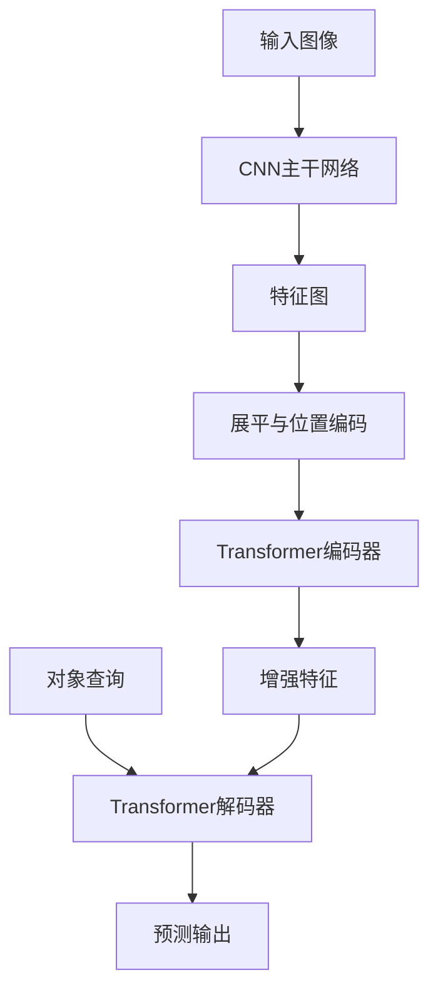
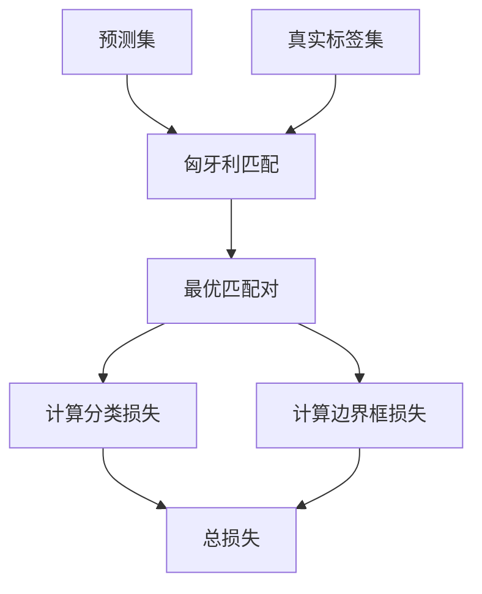
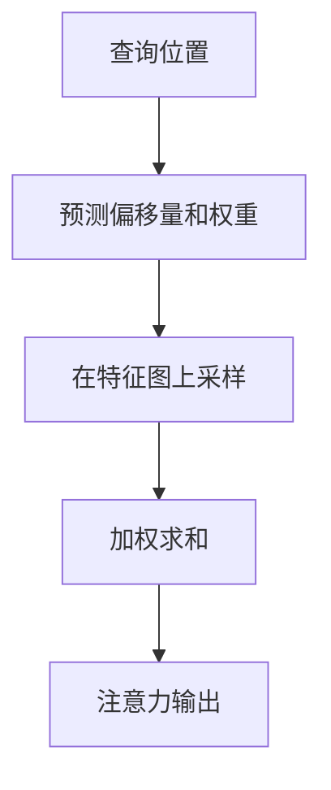

# DETR系列模型

<cite>
**本文档引用的文件**
- [modeling_detr.py](file://src/transformers/models/detr/modeling_detr.py)
- [configuration_detr.py](file://src/transformers/models/detr/configuration_detr.py)
- [modeling_deformable_detr.py](file://src/transformers/models/deformable_detr/modeling_deformable_detr.py)
- [configuration_deformable_detr.py](file://src/transformers/models/deformable_detr/configuration_deformable_detr.py)
- [modeling_conditional_detr.py](file://src/transformers/models/conditional_detr/modeling_conditional_detr.py)
- [configuration_conditional_detr.py](file://src/transformers/models/conditional_detr/configuration_conditional_detr.py)
- [modeling_rt_detr.py](file://src/transformers/models/rt_detr/modeling_rt_detr.py)
- [configuration_rt_detr.py](file://src/transformers/models/rt_detr/configuration_rt_detr.py)
- [loss_for_object_detection.py](file://src/transformers/loss/loss_for_object_detection.py)
- [loss_deformable_detr.py](file://src/transformers/loss/loss_deformable_detr.py)
</cite>

## 目录
1. [引言](#引言)
2. [DETR模型架构](#detr模型架构)
3. [对象查询与二分匹配损失](#对象查询与二分匹配损失)
4. [Deformable DETR的可变形注意力机制](#deformable-detr的可变形注意力机制)
5. [Conditional DETR的条件查询机制](#conditional-detr的条件查询机制)
6. [RT-DETR的实时推理优化](#rt-detr的实时推理优化)
7. [训练与推理配置参数](#训练与推理配置参数)
8. [性能权衡与选型建议](#性能权衡与选型建议)
9. [结论](#结论)

## 引言
DETR（DEtection TRansformer）系列模型是基于Transformer架构的端到端目标检测模型，彻底改变了传统目标检测范式。该系列模型摒弃了手工设计的组件如锚框（anchors）和非极大值抑制（NMS），通过将目标检测视为集合预测问题，实现了简洁而强大的检测框架。本文档深入讲解DETR系列的核心模型，包括原始DETR、Conditional DETR、Deformable DETR和RT-DETR，详细阐述其架构原理、关键技术以及在不同应用场景下的性能表现。

## DETR模型架构
DETR模型采用标准的编码器-解码器Transformer架构，将目标检测任务转化为一个集合预测问题。其核心思想是使用固定数量的对象查询（object queries）来与图像特征进行交互，从而直接预测出图像中所有目标的类别和边界框。

模型的处理流程如下：首先，输入图像通过一个卷积神经网络（CNN）主干网络（如ResNet）提取出多尺度的特征图。这些特征图随后被展平并加上位置编码，形成编码器的输入。编码器对这些特征进行全局上下文建模，生成增强的特征表示。解码器则接收一组可学习的对象查询，通过与编码器输出的特征进行交叉注意力（cross-attention）交互，逐步解码出每个查询对应的目标信息。

**图源**
- [modeling_detr.py](file://src/transformers/models/detr/modeling_detr.py#L0-L200)
- [configuration_detr.py](file://src/transformers/models/detr/configuration_detr.py#L0-L50)

**本节来源**
- [modeling_detr.py](file://src/transformers/models/detr/modeling_detr.py#L0-L200)
- [configuration_detr.py](file://src/transformers/models/detr/configuration_detr.py#L0-L50)

## 对象查询与二分匹配损失
### 对象查询（Object Queries）
对象查询是DETR模型的核心创新之一。它们是一组固定数量（由`num_queries`参数定义）的可学习位置嵌入向量，作为解码器的输入。这些查询不携带任何先验的语义信息，而是通过与编码器输出的图像特征进行交叉注意力交互，逐渐“聚焦”到图像中的特定目标上。每个对象查询最终会对应一个预测结果，包括类别标签和边界框坐标。这种设计使得模型能够以并行的方式同时预测所有目标，避免了传统方法中复杂的后处理步骤。

### 二分匹配损失（Bipartite Matching Loss）
由于DETR模型以集合的形式进行预测，其损失函数的设计至关重要。二分匹配损失解决了预测集和真实标签集之间的匹配问题。具体流程是：首先，使用匈牙利算法（Hungarian Algorithm）在预测结果和真实标签之间找到一个最优的一对一匹配，使得匹配的总代价最小。这个代价通常由分类损失和边界框回归损失（如L1损失和GIoU损失）的加权和构成。匹配完成后，只有匹配上的预测结果才参与计算损失，未匹配的预测被视为“无对象”类别。这种损失函数确保了模型学习到正确的预测-标签对应关系。

**图源**
- [modeling_detr.py](file://src/transformers/models/detr/modeling_detr.py#L889-L914)
- [loss_for_object_detection.py](file://src/transformers/loss/loss_for_object_detection.py#L0-L50)

**本节来源**
- [modeling_detr.py](file://src/transformers/models/detr/modeling_detr.py#L889-L914)
- [loss_for_object_detection.py](file://src/transformers/loss/loss_for_object_detection.py#L0-L200)

## Deformable DETR的可变形注意力机制
Deformable DETR针对原始DETR收敛速度慢和计算成本高的问题，引入了可变形注意力（Deformable Attention）机制。传统的Transformer注意力需要计算所有像素位置之间的关系，计算复杂度为O(N²)，其中N是特征图的像素总数。

可变形注意力的核心思想是：对于每个查询位置，只关注特征图上少数（如4个）通过学习得到的偏移位置（offsets），而不是所有位置。具体来说，模型会为每个查询预测出一组偏移量和权重，然后在这些偏移位置上进行双线性插值采样，并根据权重进行加权求和。这种方法将注意力的计算复杂度从O(N²)降低到了O(NM)，其中M是采样点的数量（通常远小于N），极大地提升了计算效率。

此外，Deformable DETR通常采用多尺度特征融合，允许每个查询在不同尺度的特征图上进行采样，从而更好地处理不同大小的目标。

**图源**
- [modeling_deformable_detr.py](file://src/transformers/models/deformable_detr/modeling_deformable_detr.py#L0-L50)
- [configuration_deformable_detr.py](file://src/transformers/models/deformable_detr/configuration_deformable_detr.py#L0-L50)

**本节来源**
- [modeling_deformable_detr.py](file://src/transformers/models/deformable_detr/modeling_deformable_detr.py#L0-L200)
- [configuration_deformable_detr.py](file://src/transformers/models/deformable_detr/configuration_deformable_detr.py#L0-L50)

## Conditional DETR的条件查询机制
Conditional DETR进一步优化了查询的初始化方式，旨在加速模型收敛。在原始DETR中，对象查询是随机初始化的，解码器需要花费大量时间来“学习”如何定位目标。

Conditional DETR提出了一种“条件查询”（Conditional Query）机制。其关键在于，解码器中的查询嵌入（query embeddings）被初始化为解码器中注意力模块的锚点（anchor points）的坐标嵌入。这意味着查询的初始状态就包含了其在图像中的空间位置信息。通过这种方式，模型的注意力机制从一开始就具备了明确的空间指向性，从而显著加快了训练过程的收敛速度。

## RT-DETR的实时推理优化
RT-DETR（Real-Time DETR）专注于实现低延迟的实时目标检测。它在Deformable DETR的基础上进行了多项优化：

1.  **混合编码器（Hybrid Encoder）**：RT-DETR使用了一个由卷积层和Transformer编码器组成的混合编码器。卷积层负责快速提取局部特征，而Transformer编码器则进行全局上下文建模，这种组合在保持性能的同时降低了计算开销。
2.  **高效主干网络**：采用如ResNet等经过优化的主干网络，确保特征提取的效率。
3.  **无NMS推理**：与所有DETR变体一样，RT-DETR的端到端设计避免了NMS这一耗时的后处理步骤，直接输出最终的检测结果。
4.  **模型轻量化**：通过调整`decoder_layers`、`d_model`等参数，可以创建更小、更快的模型版本，以适应不同的实时性要求。

这些优化使得RT-DETR能够在保持高精度的同时，实现非常低的推理延迟，非常适合于自动驾驶、视频监控等实时应用场景。

## 训练与推理配置参数
DETR系列模型的性能受到多个关键配置参数的影响：

- **`num_queries`**：定义了模型能同时预测的最大目标数量。数值过小可能导致漏检，过大则会增加计算负担和“无对象”类别的预测。COCO数据集上通常设置为100或300。
- **`dropout`**：用于防止过拟合，特别是在编码器和解码器的全连接层中。较高的dropout率可以增强模型的泛化能力，但可能减慢收敛速度。
- **`decoder_layers`**：解码器的层数。更多的层数意味着更强的特征提取和细化能力，但也意味着更高的计算成本和更长的训练时间。通常在6层左右。
- **`two_stage` (Deformable DETR)**：启用两阶段检测，第一阶段生成高质量的区域提议，第二阶段进行精炼，可以显著提升精度。
- **`with_box_refine`**：启用迭代边界框精炼，每个解码器层都会基于前一层的预测来优化边界框，有助于提升定位精度。

## 性能权衡与选型建议
不同的DETR变体在精度、速度和资源消耗方面各有侧重：

- **原始DETR**：作为基础模型，概念简洁，但收敛慢、计算成本高，适合对精度要求极高且计算资源充足的场景。
- **Deformable DETR**：在精度和效率之间取得了很好的平衡，通过可变形注意力大幅提升了训练和推理速度，是大多数应用的首选。
- **Conditional DETR**：显著加快了训练收敛速度，适合需要快速迭代和训练的场景。
- **RT-DETR**：专为实时应用设计，在保证较高精度的同时，实现了极低的延迟，是实时目标检测任务的最佳选择。

选型时应根据具体需求权衡：若追求极致精度且不计成本，可选择Deformable DETR；若需要快速训练，可考虑Conditional DETR；若对实时性要求苛刻，则RT-DETR是不二之选。

## 结论
DETR系列模型通过将Transformer架构引入目标检测领域，开创了端到端检测的新范式。从原始DETR的革命性思想，到Deformable DETR的效率提升，再到Conditional DETR的收敛加速和RT-DETR的实时优化，这一系列模型不断演进，展现了强大的生命力。理解其核心的编码器-解码器结构、对象查询机制和二分匹配损失，是掌握这些模型的关键。随着技术的不断发展，DETR系列有望在更多实际应用中发挥重要作用。