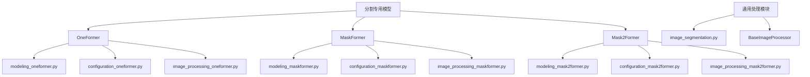
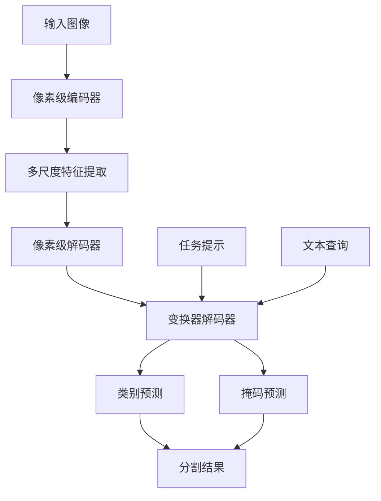
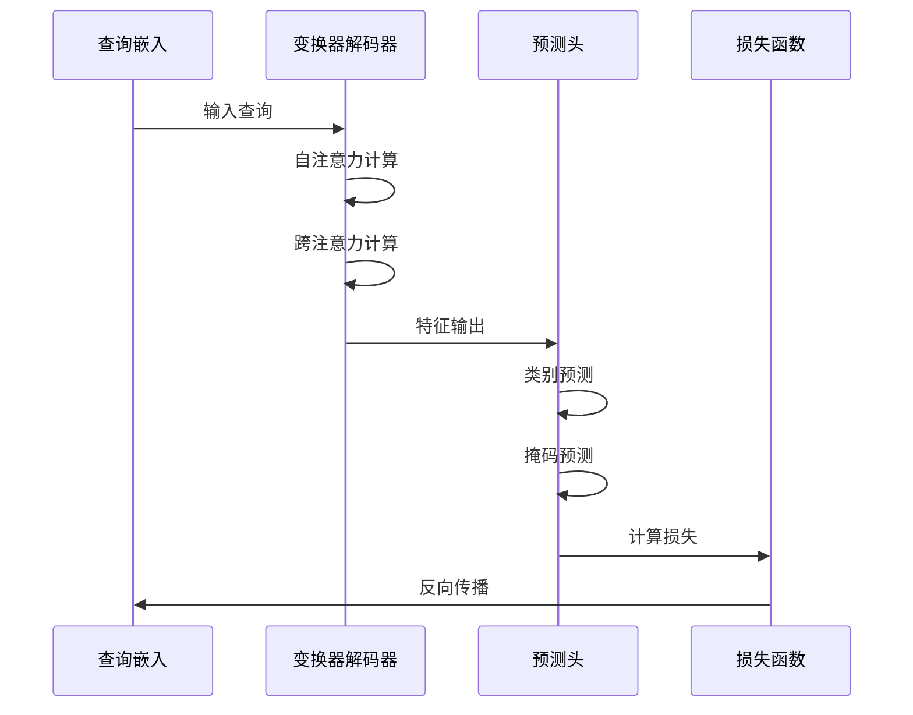
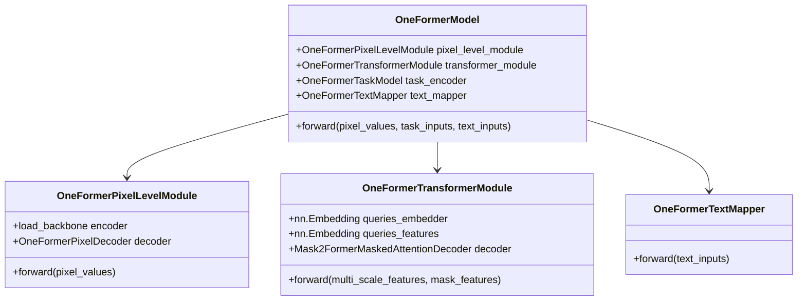
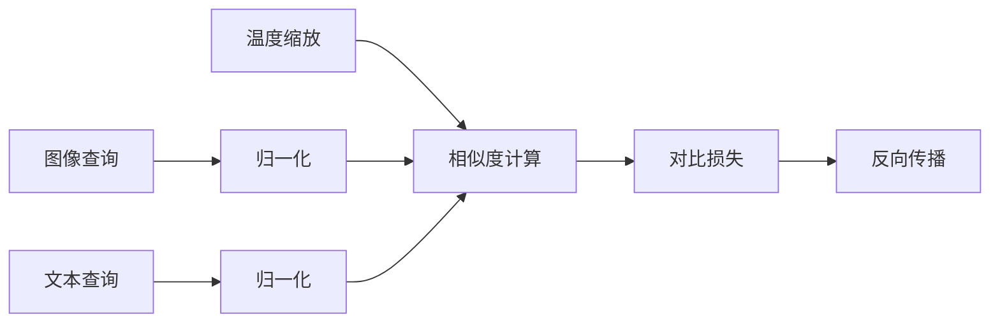
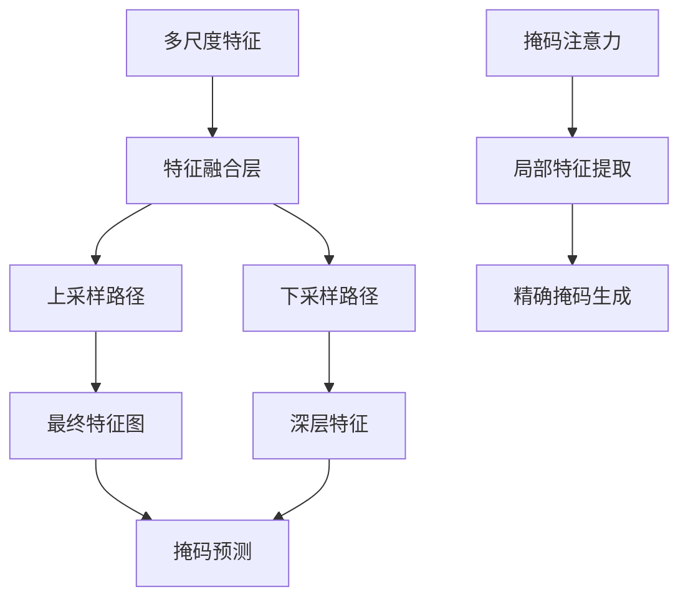
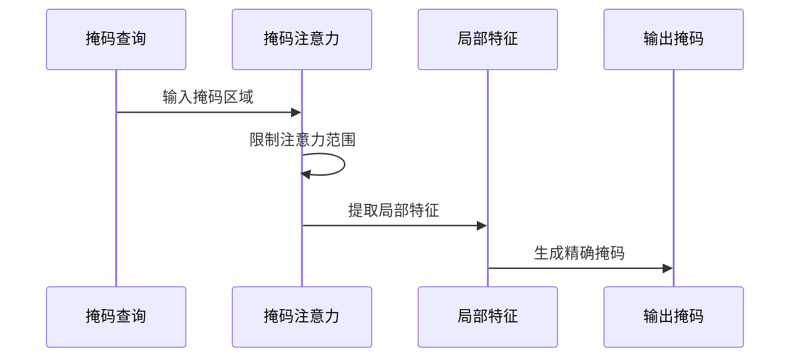
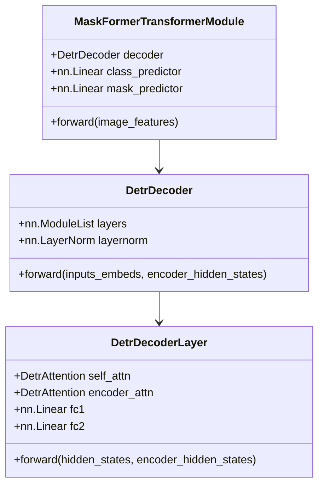
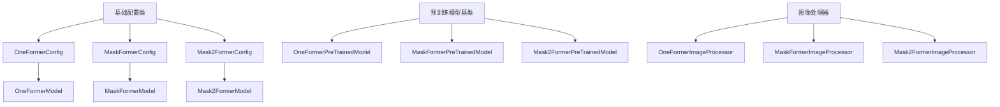

# 分割专用模型

<cite>
**本文档中引用的文件**
- [modeling_oneformer.py](file://src/transformers/models/oneformer/modeling_oneformer.py)
- [modeling_mask2former.py](file://src/transformers/models/mask2former/modeling_mask2former.py)
- [modeling_maskformer.py](file://src/transformers/models/maskformer/modeling_maskformer.py)
- [configuration_oneformer.py](file://src/transformers/models/oneformer/configuration_oneformer.py)
- [configuration_mask2former.py](file://src/transformers/models/mask2former/configuration_mask2former.py)
- [configuration_maskformer.py](file://src/transformers/models/maskformer/configuration_maskformer.py)
- [image_processing_oneformer.py](file://src/transformers/models/oneformer/image_processing_oneformer.py)
- [image_processing_mask2former.py](file://src/transformers/models/mask2former/image_processing_mask2former.py)
- [image_processing_maskformer.py](file://src/transformers/models/maskformer/image_processing_maskformer.py)
- [image_segmentation.py](file://src/transformers/pipelines/image_segmentation.py)
</cite>

## 目录
1. [简介](#简介)
2. [项目结构](#项目结构)
3. [核心组件](#核心组件)
4. [架构概览](#架构概览)
5. [详细组件分析](#详细组件分析)
6. [依赖关系分析](#依赖关系分析)
7. [性能考虑](#性能考虑)
8. [故障排除指南](#故障排除指南)
9. [结论](#结论)

## 简介

本文档详细介绍Transformer架构在图像分割领域的应用，重点关注三个重要的分割专用模型：OneFormer、MaskFormer和Mask2Former。这些模型代表了计算机视觉领域的重要进展，它们统一处理语义分割、实例分割和全景分割任务，并引入了创新的掩码分类机制和Transformer解码器架构。

这些模型的核心创新在于：
- **统一分割框架**：同时支持语义分割、实例分割和全景分割
- **掩码分类机制**：通过查询驱动的方式生成高质量分割掩码
- **Transformer解码器**：利用自注意力和交叉注意力机制进行精确的特征融合
- **文本提示集成**：OneFormer支持零样本分割能力

## 项目结构

分割专用模型在Transformers库中的组织结构如下：

**图表来源**
- [modeling_oneformer.py](file://src/transformers/models/oneformer/modeling_oneformer.py#L1-L50)
- [modeling_mask2former.py](file://src/transformers/models/mask2former/modeling_mask2former.py#L1-L50)
- [modeling_maskformer.py](file://src/transformers/models/maskformer/modeling_maskformer.py#L1-L50)

**章节来源**
- [modeling_oneformer.py](file://src/transformers/models/oneformer/modeling_oneformer.py#L1-L100)
- [modeling_mask2former.py](file://src/transformers/models/mask2former/modeling_mask2former.py#L1-L100)
- [modeling_maskformer.py](file://src/transformers/models/maskformer/modeling_maskformer.py#L1-L100)

## 核心组件

### 模型架构组件

三个分割模型都包含以下核心组件：

1. **像素级模块（Pixel-Level Module）**
   - 图像特征提取器
   - 多尺度特征融合
   - 像素级嵌入生成

2. **变换器模块（Transformer Module）**
   - 查询嵌入生成
   - 自注意力机制
   - 跨注意力机制

3. **预测头（Prediction Heads）**
   - 类别预测
   - 掩码预测
   - 辅助损失计算

### 关键技术特性

| 特性 | OneFormer | MaskFormer | Mask2Former |
|------|-----------|------------|-------------|
| 文本提示支持 | ✅ | ❌ | ❌ |
| 零样本分割 | ✅ | ❌ | ❌ |
| 掩码分类机制 | 查询驱动 | 查询驱动 | 查询驱动 |
| 池化策略改进 | ❌ | ❌ | 改进的FPN |
| 训练效率 | 高 | 中等 | 高 |

**章节来源**
- [modeling_oneformer.py](file://src/transformers/models/oneformer/modeling_oneformer.py#L2844-L2969)
- [modeling_mask2former.py](file://src/transformers/models/mask2former/modeling_mask2former.py#L2165-L2232)
- [modeling_maskformer.py](file://src/transformers/models/maskformer/modeling_maskformer.py#L1477-L1570)

## 架构概览

### 统一分割框架

三个模型都采用统一的三阶段架构：

**图表来源**
- [modeling_oneformer.py](file://src/transformers/models/oneformer/modeling_oneformer.py#L2844-L2969)
- [modeling_mask2former.py](file://src/transformers/models/mask2former/modeling_mask2former.py#L2165-L2232)

### 掩码分类机制

所有模型都采用查询驱动的掩码分类机制：

**图表来源**
- [modeling_oneformer.py](file://src/transformers/models/oneformer/modeling_oneformer.py#L1481-L1504)
- [modeling_mask2former.py](file://src/transformers/models/mask2former/modeling_mask2former.py#L1765-L1802)

**章节来源**
- [modeling_oneformer.py](file://src/transformers/models/oneformer/modeling_oneformer.py#L1250-L1284)
- [modeling_mask2former.py](file://src/transformers/models/mask2former/modeling_mask2former.py#L1912-L1943)

## 详细组件分析

### OneFormer模型分析

OneFormer是第一个支持零样本分割的统一分割模型，其核心创新包括文本提示集成和对比学习机制。

#### 文本提示集成架构

**图表来源**
- [modeling_oneformer.py](file://src/transformers/models/oneformer/modeling_oneformer.py#L2844-L2969)
- [modeling_oneformer.py](file://src/transformers/models/oneformer/modeling_oneformer.py#L1481-L1504)

#### 对比学习机制

OneFormer通过对比学习实现零样本分割：

**图表来源**
- [modeling_oneformer.py](file://src/transformers/models/oneformer/modeling_oneformer.py#L600-L650)

**章节来源**
- [modeling_oneformer.py](file://src/transformers/models/oneformer/modeling_oneformer.py#L2844-L2969)
- [modeling_oneformer.py](file://src/transformers/models/oneformer/modeling_oneformer.py#L600-L700)

### Mask2Former模型分析

Mask2Former通过改进的池化策略和掩码注意力机制显著提升了分割性能。

#### 改进的池化策略

Mask2Former采用了增强的特征金字塔网络（Enhanced FPN）：

**图表来源**
- [modeling_mask2former.py](file://src/transformers/models/mask2former/modeling_mask2former.py#L1367-L1403)

#### 掩码注意力机制

Mask2Former引入了掩码注意力机制替代标准的交叉注意力：

**图表来源**
- [modeling_mask2former.py](file://src/transformers/models/mask2former/modeling_mask2former.py#L1765-L1802)

**章节来源**
- [modeling_mask2former.py](file://src/transformers/models/mask2former/modeling_mask2former.py#L2165-L2232)
- [modeling_mask2former.py](file://src/transformers/models/mask2former/modeling_mask2former.py#L1367-L1403)

### MaskFormer模型分析

MaskFormer作为最早的统一分割模型，奠定了后续工作的基础。

#### DETR风格的变换器解码器

**图表来源**
- [modeling_maskformer.py](file://src/transformers/models/maskformer/modeling_maskformer.py#L1477-L1570)
- [modeling_maskformer.py](file://src/transformers/models/maskformer/modeling_maskformer.py#L1200-L1300)

**章节来源**
- [modeling_maskformer.py](file://src/transformers/models/maskformer/modeling_maskformer.py#L1477-L1570)
- [modeling_maskformer.py](file://src/transformers/models/maskformer/modeling_maskformer.py#L1200-L1300)

## 依赖关系分析

### 模型间的关系

**图表来源**
- [configuration_oneformer.py](file://src/transformers/models/oneformer/configuration_oneformer.py#L1-L50)
- [configuration_mask2former.py](file://src/transformers/models/mask2former/configuration_mask2former.py#L1-L50)
- [configuration_maskformer.py](file://src/transformers/models/maskformer/configuration_maskformer.py#L1-L50)

### 关键配置参数

| 参数名 | OneFormer | MaskFormer | Mask2Former | 说明 |
|--------|-----------|------------|-------------|------|
| `mask_dim` | 256 | 256 | 256 | 掩码特征维度 |
| `num_queries` | 150 | 100 | 100 | 查询数量 |
| `hidden_dim` | 256 | 256 | 256 | 隐藏层维度 |
| `decoder_layers` | 10 | 6 | 10 | 解码器层数 |
| `use_auxiliary_loss` | True | False | True | 辅助损失 |

**章节来源**
- [configuration_oneformer.py](file://src/transformers/models/oneformer/configuration_oneformer.py#L100-L200)
- [configuration_mask2former.py](file://src/transformers/models/mask2former/configuration_mask2former.py#L100-L200)
- [configuration_maskformer.py](file://src/transformers/models/maskformer/configuration_maskformer.py#L100-L200)

## 性能考虑

### 训练效率优化

三个模型都采用了不同的训练效率优化策略：

1. **OneFormer**：使用对比学习和文本提示减少标注需求
2. **Mask2Former**：改进的池化策略和掩码注意力提升收敛速度
3. **MaskFormer**：标准的DETR训练流程

### 推理速度优化

- **特征共享**：多尺度特征在解码器中重复使用
- **注意力优化**：Mask2Former的掩码注意力减少计算量
- **查询复用**：类别和掩码查询共享部分特征

### 内存使用优化

- **梯度检查点**：可选的梯度检查点减少内存占用
- **混合精度**：支持FP16训练
- **动态裁剪**：根据输入大小动态调整计算

## 故障排除指南

### 常见问题及解决方案

#### 训练问题

1. **损失不收敛**
   - 检查学习率设置
   - 验证数据预处理
   - 确认标签格式正确

2. **内存不足**
   - 减少批量大小
   - 使用梯度累积
   - 启用混合精度训练

#### 推理问题

1. **分割质量差**
   - 检查模型权重加载
   - 验证输入尺寸
   - 调整后处理阈值

2. **推理速度慢**
   - 使用量化模型
   - 减少查询数量
   - 优化输入预处理

**章节来源**
- [image_processing_oneformer.py](file://src/transformers/models/oneformer/image_processing_oneformer.py#L1-L200)
- [image_processing_mask2former.py](file://src/transformers/models/mask2former/image_processing_mask2former.py#L1-L200)

## 结论

OneFormer、MaskFormer和Mask2Former代表了图像分割领域的重要进展，它们通过统一的框架解决了语义分割、实例分割和全景分割的问题。每个模型都有其独特的优势：

- **OneFormer**：支持零样本分割，通过文本提示实现泛化能力
- **Mask2Former**：通过改进的池化策略和掩码注意力机制获得最佳性能
- **MaskFormer**：作为基础模型，为后续研究奠定重要基础

这些模型的成功证明了Transformer架构在计算机视觉任务中的强大潜力，特别是在需要精确空间定位和复杂特征融合的任务中。随着技术的不断发展，我们可以期待看到更多创新的分割模型出现，进一步推动计算机视觉领域的发展。