# 检测与分割模型

<cite>
**本文档中引用的文件**
- [modeling_detr.py](file://src/transformers/models/detr/modeling_detr.py)
- [modeling_conditional_detr.py](file://src/transformers/models/conditional_detr/modeling_conditional_detr.py)
- [modeling_deformable_detr.py](file://src/transformers/models/deformable_detr/modeling_deformable_detr.py)
- [modeling_rt_detr.py](file://src/transformers/src/transformers/models/rt_detr/modeling_rt_detr.py)
- [modeling_oneformer.py](file://src/transformers/src/transformers/models/oneformer/modeling_oneformer.py)
- [modeling_maskformer.py](file://src/transformers/src/transformers/models/maskformer/modeling_maskformer.py)
- [modeling_mask2former.py](file://src/transformers/src/transformers/models/mask2former/modeling_mask2former.py)
- [configuration_detr.py](file://src/transformers/src/transformers/models/detr/configuration_detr.py)
- [configuration_oneformer.py](file://src/transformers/src/transformers/models/oneformer/configuration_oneformer.py)
</cite>

## 目录
1. [简介](#简介)
2. [项目结构](#项目结构)
3. [核心组件](#核心组件)
4. [架构概览](#架构概览)
5. [详细组件分析](#详细组件分析)
6. [依赖关系分析](#依赖关系分析)
7. [性能考虑](#性能考虑)
8. [故障排除指南](#故障排除指南)
9. [结论](#结论)

## 简介

本文档全面介绍了Transformers库中基于Transformer的目标检测与图像分割专用模型。这些模型代表了计算机视觉领域的重要进展，通过引入查询机制、二分匹配算法和先进的注意力机制，实现了端到端的目标检测和分割任务。

主要涵盖以下模型系列：
- **DETR系列**：DETR、Conditional DETR、Deformable DETR、RT-DETR
- **分割模型**：OneFormer、MaskFormer、Mask2Former

这些模型的核心创新在于使用Transformer架构替代传统的卷积神经网络，在保持高性能的同时简化了检测和分割流程。

## 项目结构

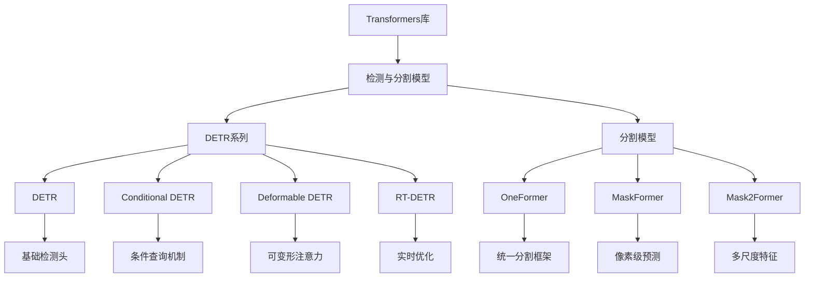

**图表来源**
- [modeling_detr.py](file://src/transformers/models/detr/modeling_detr.py#L1-L50)
- [modeling_oneformer.py](file://src/transformers/src/transformers/models/oneformer/modeling_oneformer.py#L1-L50)

**章节来源**
- [modeling_detr.py](file://src/transformers/models/detr/modeling_detr.py#L1-L100)
- [modeling_conditional_detr.py](file://src/transformers/src/transformers/models/conditional_detr/modeling_conditional_detr.py#L1-L100)

## 核心组件

### 基于Transformer的检测头

所有DETR系列模型都采用基于Transformer的检测头，其核心组件包括：

#### 查询机制
- **对象查询（Object Queries）**：固定数量的可学习查询向量
- **内容嵌入（Content Embeddings）**：表示对象内容的特征
- **位置嵌入（Position Embeddings）**：提供空间位置信息

#### 分类与边界框预测
- **分类头**：预测每个查询的对象类别
- **边界框头**：预测边界框的中心坐标、宽度和高度

### 二分匹配算法

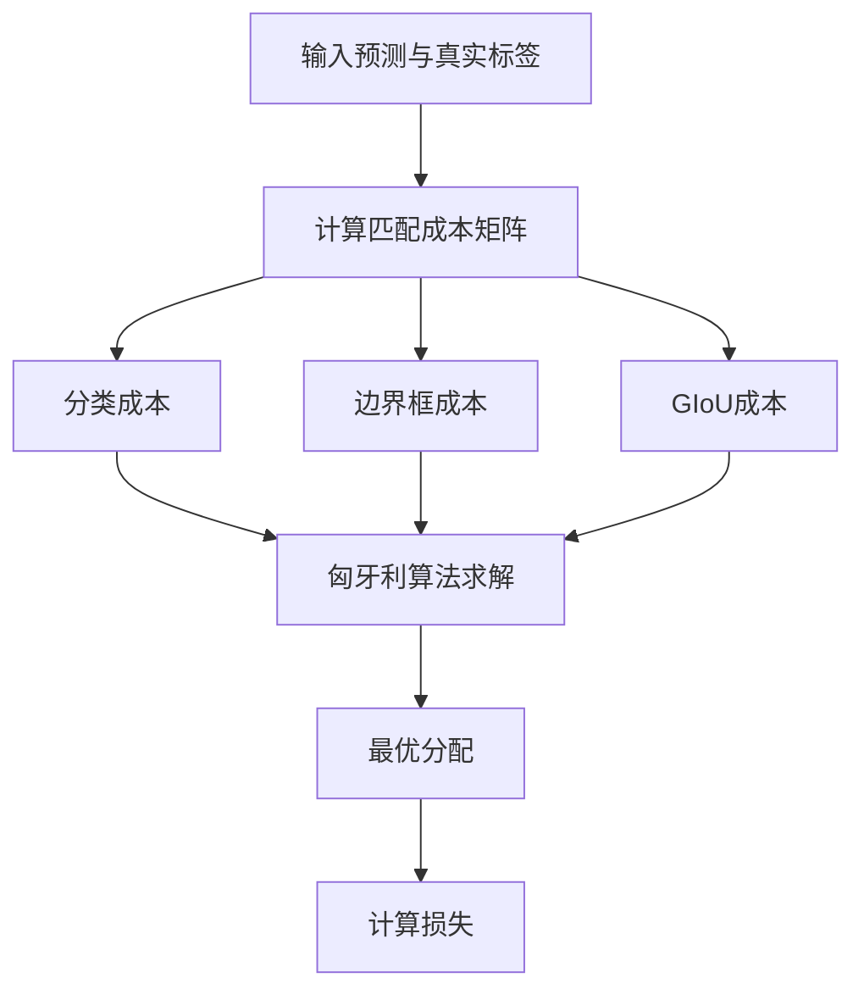

**图表来源**
- [modeling_conditional_detr.py](file://src/transformers/src/transformers/models/conditional_detr/modeling_conditional_detr.py#L1540-L1562)

### 分割掩码生成

分割模型通过以下机制生成高质量的分割掩码：

#### 特征融合
- **多尺度特征**：融合不同层次的特征图
- **注意力机制**：利用自注意力和交叉注意力
- **掩码解码器**：专门的掩码生成网络

**章节来源**
- [modeling_detr.py](file://src/transformers/src/transformers/models/detr/modeling_detr.py#L1201-L1245)
- [modeling_oneformer.py](file://src/transformers/src/transformers/models/oneformer/modeling_oneformer.py#L1-L100)

## 架构概览

### DETR系列架构

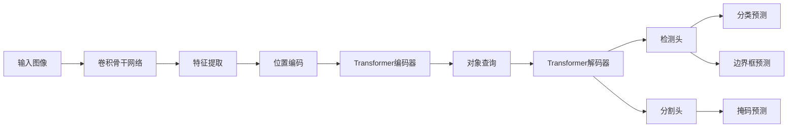

**图表来源**
- [modeling_detr.py](file://src/transformers/src/transformers/models/detr/modeling_detr.py#L1012-L1049)

### OneFormer统一架构

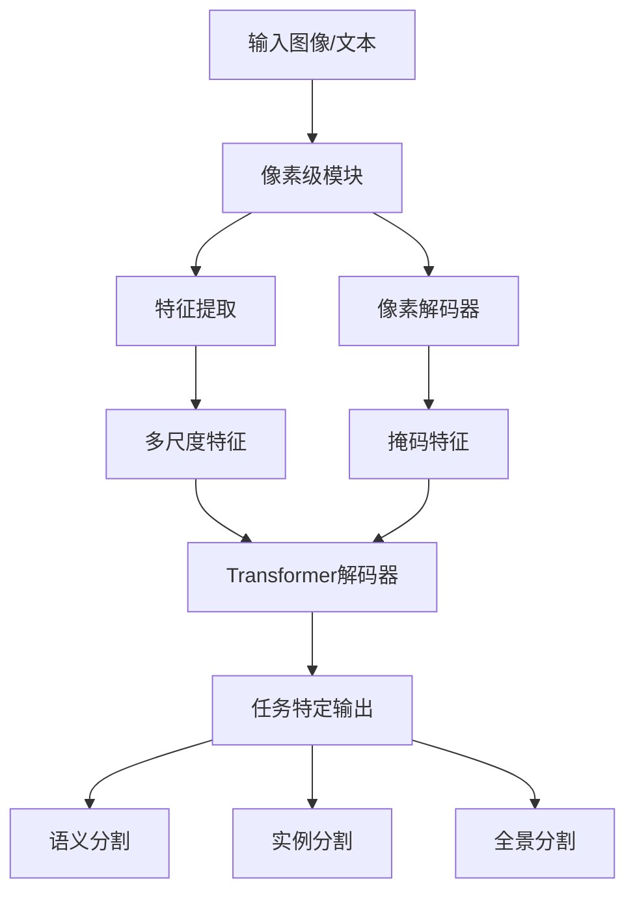

**图表来源**
- [modeling_oneformer.py](file://src/transformers/src/transformers/models/oneformer/modeling_oneformer.py#L1481-L1504)

## 详细组件分析

### DETR模型详解

#### 编码器-解码器架构

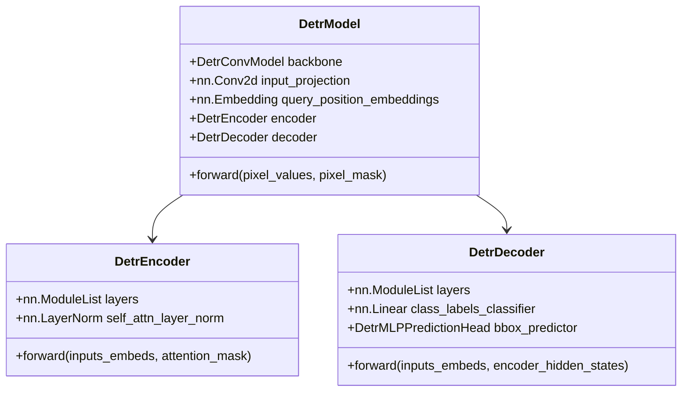

**图表来源**
- [modeling_detr.py](file://src/transformers/src/transformers/models/detr/modeling_detr.py#L1012-L1049)
- [modeling_detr.py](file://src/transformers/src/transformers/models/detr/modeling_detr.py#L889-L914)

#### 注意力机制

DETR使用多头注意力机制处理特征交互：

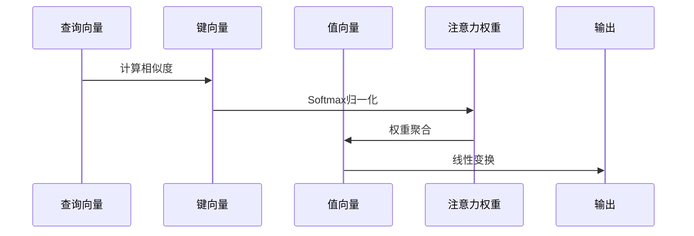

**图表来源**
- [modeling_detr.py](file://src/transformers/src/transformers/models/detr/modeling_detr.py#L693-L714)

**章节来源**
- [modeling_detr.py](file://src/transformers/src/transformers/models/detr/modeling_detr.py#L889-L914)

### Conditional DETR改进

Conditional DETR引入条件查询机制，显著提升训练收敛速度：

#### 条件注意力机制

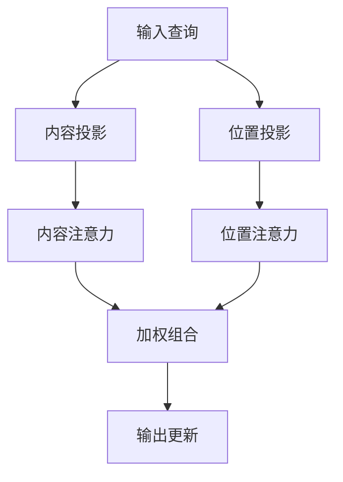

**图表来源**
- [modeling_conditional_detr.py](file://src/transformers/src/transformers/models/conditional_detr/modeling_conditional_detr.py#L714-L750)

**章节来源**
- [modeling_conditional_detr.py](file://src/transformers/src/transformers/models/conditional_detr/modeling_conditional_detr.py#L1500-L1516)

### Deformable DETR优化

Deformable DETR通过可变形注意力机制减少计算复杂度：

#### 可变形注意力

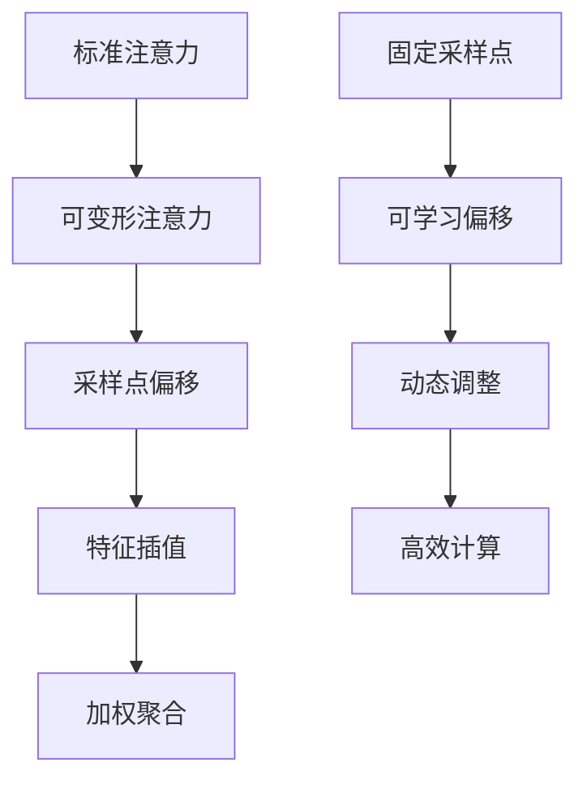

**图表来源**
- [modeling_deformable_detr.py](file://src/transformers/src/transformers/models/deformable_detr/modeling_deformable_detr.py#L400-L450)

**章节来源**
- [modeling_deformable_detr.py](file://src/transformers/src/transformers/models/deformable_detr/modeling_deformable_detr.py#L400-L450)

### RT-DETR实时优化

RT-DETR专注于实时检测性能：

#### 实时优化策略

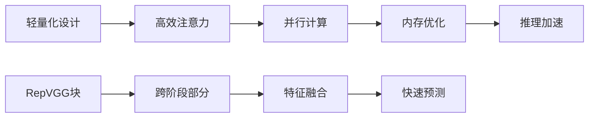

**图表来源**
- [modeling_rt_detr.py](file://src/transformers/src/transformers/models/rt_detr/modeling_rt_detr.py#L646-L671)

**章节来源**
- [modeling_rt_detr.py](file://src/transformers/src/transformers/models/rt_detr/modeling_rt_detr.py#L592-L611)

### OneFormer统一分割框架

OneFormer提供统一的分割解决方案：

#### 多任务学习架构

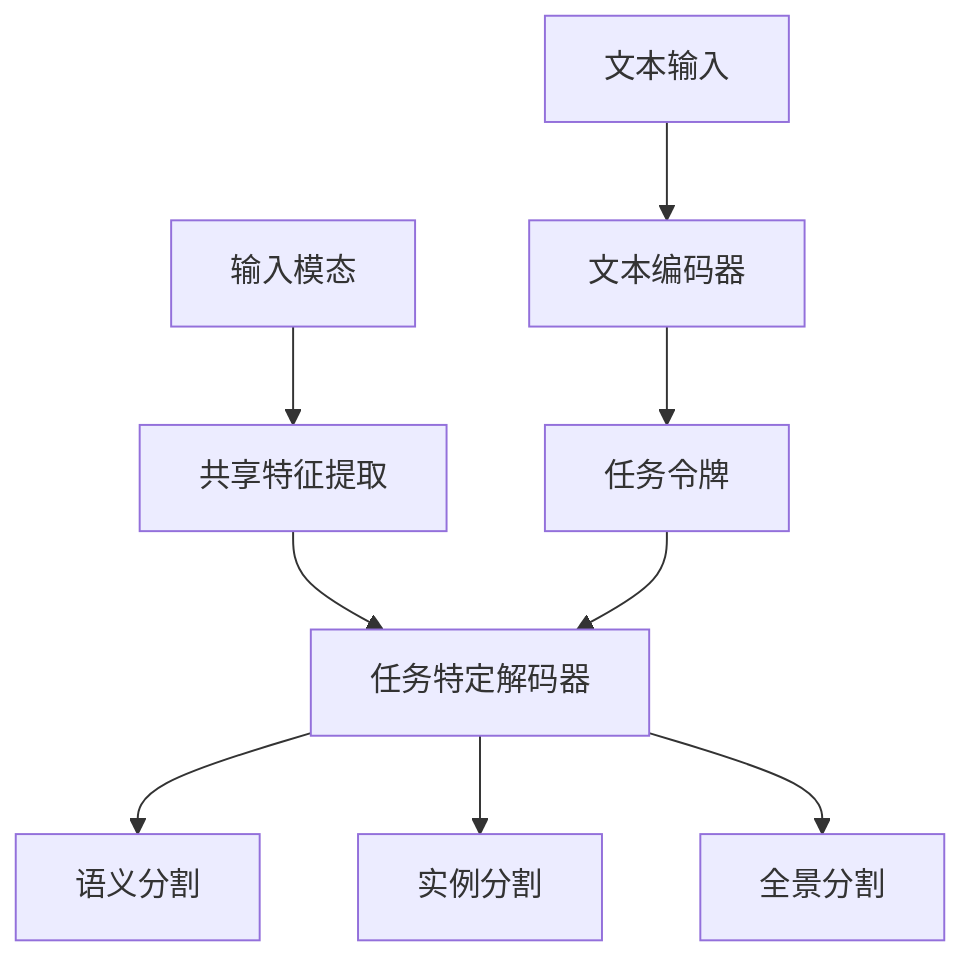

**图表来源**
- [modeling_oneformer.py](file://src/transformers/src/transformers/models/oneformer/modeling_oneformer.py#L2372-L2403)

**章节来源**
- [modeling_oneformer.py](file://src/transformers/src/transformers/models/oneformer/modeling_oneformer.py#L1250-L1284)

## 依赖关系分析

### 模型间依赖关系

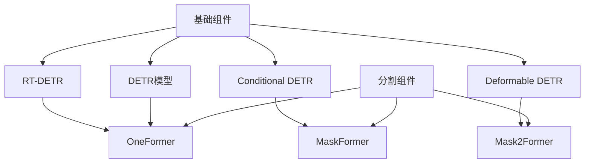

**图表来源**
- [modeling_detr.py](file://src/transformers/src/transformers/models/detr/modeling_detr.py#L1-L50)
- [modeling_oneformer.py](file://src/transformers/src/transformers/models/oneformer/modeling_oneformer.py#L1-L50)

### 配置参数影响

不同配置参数对模型性能的影响：

| 参数 | DETR | Conditional DETR | Deformable DETR | RT-DETR |
|------|------|------------------|-----------------|---------|
| num_queries | 100 | 100 | 300 | 300 |
| decoder_layers | 6 | 6 | 6 | 6 |
| d_model | 256 | 256 | 256 | 256 |
| encoder_attention_heads | 8 | 8 | 8 | 8 |
| decoder_attention_heads | 8 | 8 | 8 | 8 |

**章节来源**
- [configuration_detr.py](file://src/transformers/src/transformers/models/detr/configuration_detr.py#L1-L200)
- [configuration_oneformer.py](file://src/transformers/src/transformers/models/oneformer/configuration_oneformer.py#L1-L200)

## 性能考虑

### 训练效率优化

1. **辅助损失（Auxiliary Loss）**：在中间层添加监督信号
2. **渐进式训练**：从简单到复杂的训练策略
3. **知识蒸馏**：使用教师模型指导学生模型

### 推理速度优化

1. **模型剪枝**：移除冗余参数
2. **量化**：降低数值精度
3. **知识蒸馏**：压缩模型大小

### 内存使用优化

1. **梯度检查点**：重新计算节省内存
2. **混合精度训练**：使用FP16减少内存占用
3. **批处理优化**：动态调整批次大小

## 故障排除指南

### 常见问题及解决方案

#### 训练不收敛
- **原因**：学习率设置不当或初始化问题
- **解决方案**：调整学习率调度器，使用正确的初始化方法

#### 内存不足
- **原因**：批次大小过大或模型参数过多
- **解决方案**：减小批次大小，使用梯度累积

#### 性能下降
- **原因**：过拟合或数据预处理问题
- **解决方案**：增加正则化，改进数据增强

**章节来源**
- [modeling_detr.py](file://src/transformers/src/transformers/models/detr/modeling_detr.py#L1350-L1391)

## 结论

Transformers库中的检测与分割模型代表了计算机视觉领域的重大突破。通过引入基于Transformer的架构，这些模型成功地解决了传统CNN方法中存在的许多挑战：

### 主要优势

1. **端到端训练**：无需复杂的后处理步骤
2. **全局建模能力**：能够捕捉长距离依赖关系
3. **通用性**：适用于多种视觉任务
4. **可扩展性**：易于适应不同的应用场景

### 应用场景建议

- **实时应用**：推荐使用RT-DETR
- **高精度需求**：推荐使用DETR系列
- **多任务分割**：推荐使用OneFormer
- **资源受限环境**：推荐使用Conditional DETR

### 未来发展方向

1. **效率优化**：进一步减少计算和内存需求
2. **多模态融合**：结合文本、音频等其他模态信息
3. **自监督学习**：减少对标注数据的依赖
4. **边缘部署**：优化模型以适应移动设备和嵌入式系统

这些模型为计算机视觉任务提供了强大的工具，推动了该领域的持续发展和创新。