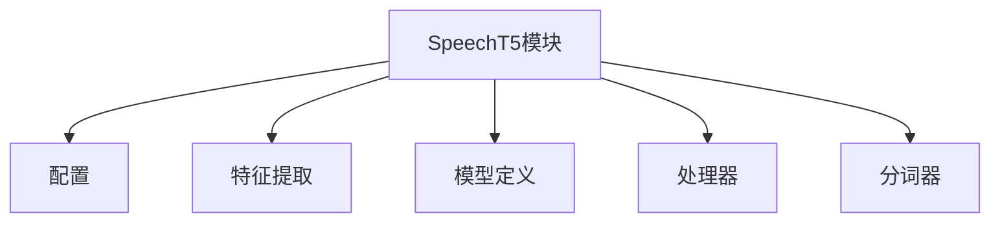
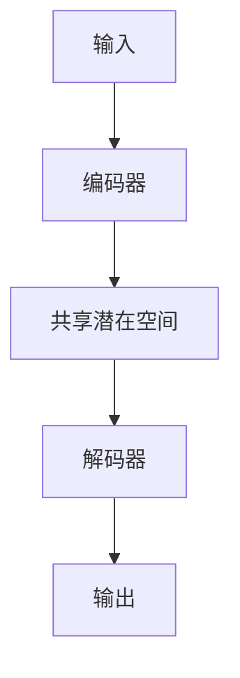
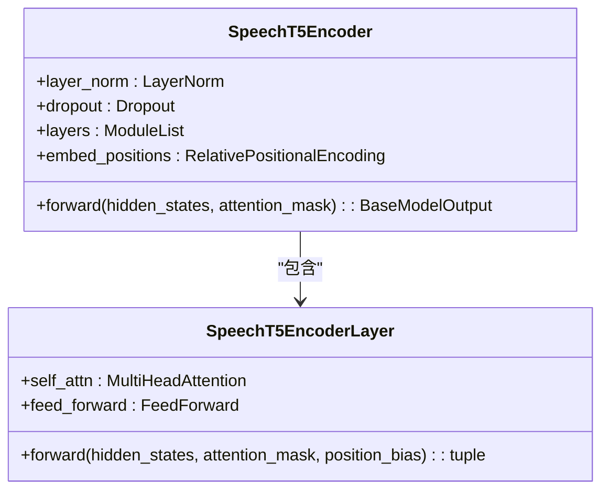
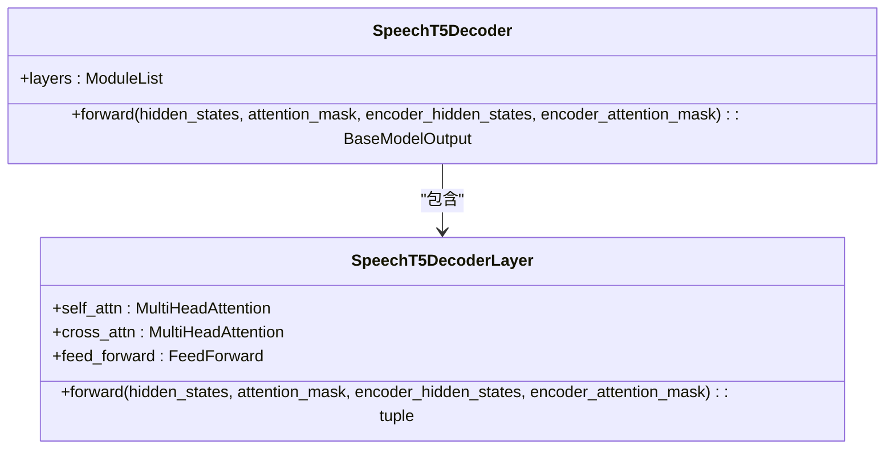
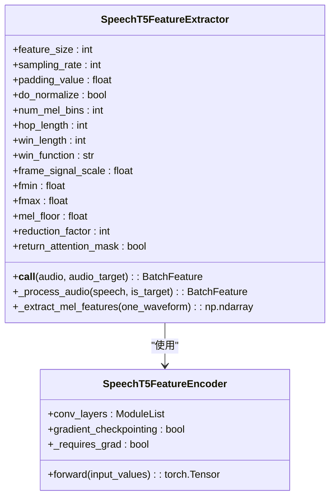
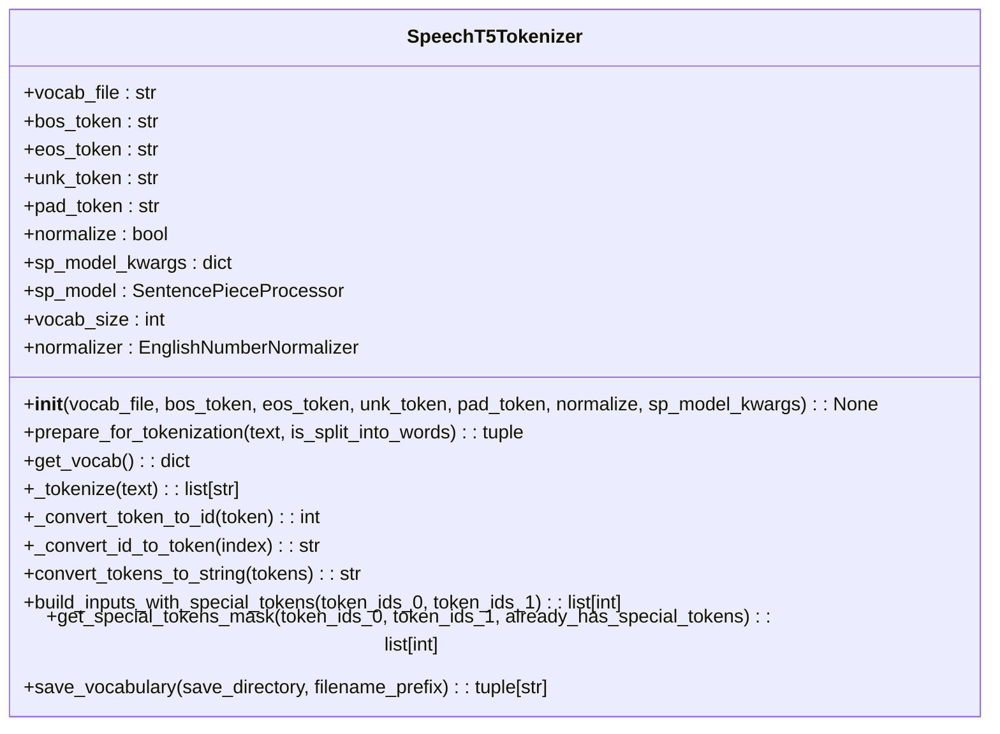
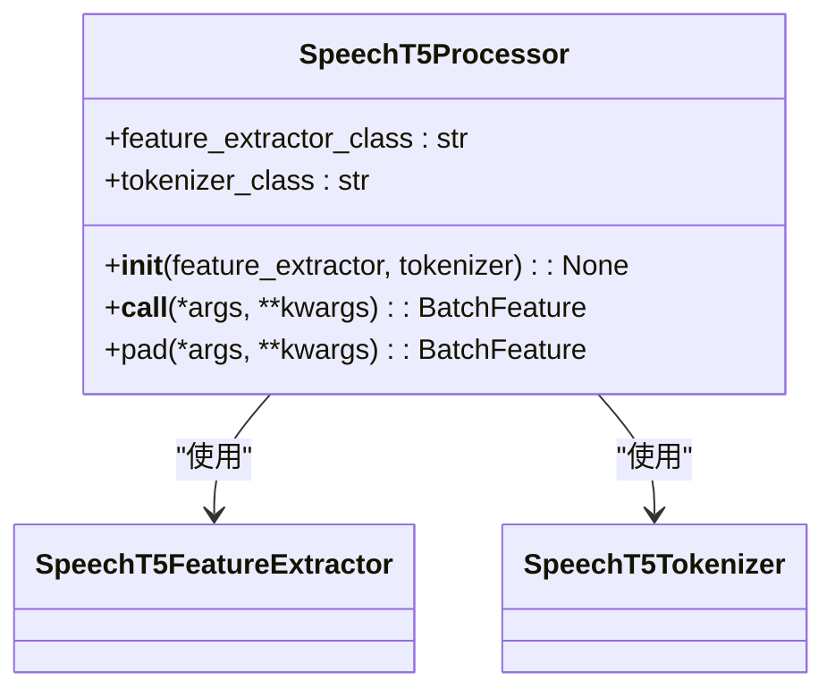
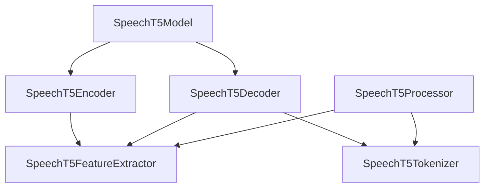

# SpeechT5 模型

<cite>
**本文档引用的文件**  
- [modeling_speecht5.py](file://src/transformers/models/speecht5/modeling_speecht5.py)
- [configuration_speecht5.py](file://src/transformers/models/speecht5/configuration_speecht5.py)
- [processing_speecht5.py](file://src/transformers/models/speecht5/processing_speecht5.py)
- [feature_extraction_speecht5.py](file://src/transformers/models/speecht5/feature_extraction_speecht5.py)
- [tokenization_speecht5.py](file://src/transformers/models/speecht5/tokenization_speecht5.py)
</cite>

## 目录
1. [简介](#简介)
2. [项目结构](#项目结构)
3. [核心组件](#核心组件)
4. [架构概述](#架构概述)
5. [详细组件分析](#详细组件分析)
6. [依赖分析](#依赖分析)
7. [性能考虑](#性能考虑)
8. [故障排除指南](#故障排除指南)
9. [结论](#结论)

## 简介
SpeechT5 是一个统一的编码器-解码器架构模型，能够同时支持语音识别、文本到语音合成、语音转换和语音修复等多种任务。该模型通过联合声学-语言表示学习机制，将文本和语音信息在共享潜在空间中对齐。本文档详细介绍了如何使用预训练模型进行端到端的文本到语音合成，包括文本预处理、音素转换、梅尔频谱图生成和声码器解码的完整流程。此外，还深入分析了模型配置参数如num_hidden_layers、num_attention_heads和intermediate_size对模型性能的影响，并解释了SpeechT5特有的预训练任务，如掩码语言建模、掩码声学建模和对比学习任务。

## 项目结构
SpeechT5 模型位于 `src/transformers/models/speecht5` 目录下，包含多个关键文件，用于实现模型的不同功能。这些文件包括配置文件、特征提取器、模型定义、处理器和分词器等。

**图源**  
- [modeling_speecht5.py](file://src/transformers/models/speecht5/modeling_speecht5.py)
- [configuration_speecht5.py](file://src/transformers/models/speecht5/configuration_speecht5.py)

**本节来源**  
- [modeling_speecht5.py](file://src/transformers/models/speecht5/modeling_speecht5.py)
- [configuration_speecht5.py](file://src/transformers/models/speecht5/configuration_speecht5.py)

## 核心组件
SpeechT5 模型的核心组件包括编码器、解码器、特征提取器、分词器和处理器。编码器和解码器基于Transformer架构，分别负责处理输入的语音或文本信号和生成输出的语音或文本信号。特征提取器负责从原始音频信号中提取有用的特征，而分词器则负责将文本转换为模型可以理解的形式。处理器则整合了特征提取器和分词器的功能，提供了一个统一的接口来处理输入数据。

**本节来源**  
- [modeling_speecht5.py](file://src/transformers/models/speecht5/modeling_speecht5.py)
- [processing_speecht5.py](file://src/transformers/models/speecht5/processing_speecht5.py)

## 架构概述
SpeechT5 模型采用统一的编码器-解码器架构，能够同时支持多种语音处理任务。编码器部分由多个Transformer层组成，每个层包含自注意力机制和前馈网络。解码器部分同样由多个Transformer层组成，但还包括交叉注意力机制，以便利用编码器的输出。模型通过联合声学-语言表示学习机制，将文本和语音信息在共享潜在空间中对齐。

**图源**  
- [modeling_speecht5.py](file://src/transformers/models/speecht5/modeling_speecht5.py)

## 详细组件分析

### 编码器分析
SpeechT5 的编码器基于Transformer架构，由多个编码器层组成。每个编码器层包含自注意力机制和前馈网络。编码器接收输入的语音或文本信号，并将其转换为高维特征表示。

**图源**  
- [modeling_speecht5.py](file://src/transformers/models/speecht5/modeling_speecht5.py#L1209-L1220)

**本节来源**  
- [modeling_speecht5.py](file://src/transformers/models/speecht5/modeling_speecht5.py#L1209-L1220)

### 解码器分析
SpeechT5 的解码器同样基于Transformer架构，由多个解码器层组成。每个解码器层包含自注意力机制、交叉注意力机制和前馈网络。解码器接收编码器的输出，并生成最终的语音或文本信号。

**图源**  
- [modeling_speecht5.py](file://src/transformers/models/speecht5/modeling_speecht5.py#L1425-L1434)

**本节来源**  
- [modeling_speecht5.py](file://src/transformers/models/speecht5/modeling_speecht5.py#L1425-L1434)

### 特征提取器分析
SpeechT5 的特征提取器负责从原始音频信号中提取有用的特征，如梅尔频谱图。特征提取器使用卷积神经网络（CNN）来提取特征，并通过归一化和位置编码来增强特征表示。

**图源**  
- [feature_extraction_speecht5.py](file://src/transformers/models/speecht5/feature_extraction_speecht5.py#L101-L120)

**本节来源**  
- [feature_extraction_speecht5.py](file://src/transformers/models/speecht5/feature_extraction_speecht5.py#L101-L120)

### 分词器分析
SpeechT5 的分词器基于SentencePiece，负责将文本转换为模型可以理解的形式。分词器支持多种语言，并能够处理数字和特殊字符。

**图源**  
- [tokenization_speecht5.py](file://src/transformers/models/speecht5/tokenization_speecht5.py#L101-L120)

**本节来源**  
- [tokenization_speecht5.py](file://src/transformers/models/speecht5/tokenization_speecht5.py#L101-L120)

### 处理器分析
SpeechT5 的处理器整合了特征提取器和分词器的功能，提供了一个统一的接口来处理输入数据。处理器可以处理音频和文本输入，以及音频和文本目标。

**图源**  
- [processing_speecht5.py](file://src/transformers/models/speecht5/processing_speecht5.py#L101-L120)

**本节来源**  
- [processing_speecht5.py](file://src/transformers/models/speecht5/processing_speecht5.py#L101-L120)

## 依赖分析
SpeechT5 模型依赖于多个外部库和内部模块。主要依赖包括PyTorch、NumPy、SentencePiece等。内部模块之间的依赖关系通过类和方法调用来实现。

**图源**  
- [modeling_speecht5.py](file://src/transformers/models/speecht5/modeling_speecht5.py)
- [processing_speecht5.py](file://src/transformers/models/speecht5/processing_speecht5.py)

**本节来源**  
- [modeling_speecht5.py](file://src/transformers/models/speecht5/modeling_speecht5.py)
- [processing_speecht5.py](file://src/transformers/models/speecht5/processing_speecht5.py)

## 性能考虑
在使用SpeechT5模型时，需要注意以下几点以优化性能：
- **硬件要求**：建议使用GPU进行训练和推理，以加快计算速度。
- **内存管理**：合理设置批处理大小，避免内存溢出。
- **并行计算**：利用多线程或多进程进行数据预处理和模型训练。
- **模型压缩**：可以使用量化、剪枝等技术减少模型大小，提高推理速度。

## 故障排除指南
在使用SpeechT5模型时，可能会遇到一些常见问题，如语音失真、重复发音和音素缺失等。以下是一些解决方案：
- **语音失真**：检查输入音频的质量，确保采样率和格式正确。
- **重复发音**：调整解码器的温度参数，降低生成的随机性。
- **音素缺失**：增加训练数据量，特别是包含缺失音素的数据。

**本节来源**  
- [modeling_speecht5.py](file://src/transformers/models/speecht5/modeling_speecht5.py)
- [feature_extraction_speecht5.py](file://src/transformers/models/speecht5/feature_extraction_speecht5.py)

## 结论
SpeechT5 模型是一个强大的统一编码器-解码器架构，能够同时支持多种语音处理任务。通过联合声学-语言表示学习机制，模型能够在共享潜在空间中对齐文本和语音信息。本文档详细介绍了模型的各个组件及其工作原理，并提供了使用预训练模型进行端到端文本到语音合成的完整流程。希望这些信息能帮助开发者更好地理解和使用SpeechT5模型。