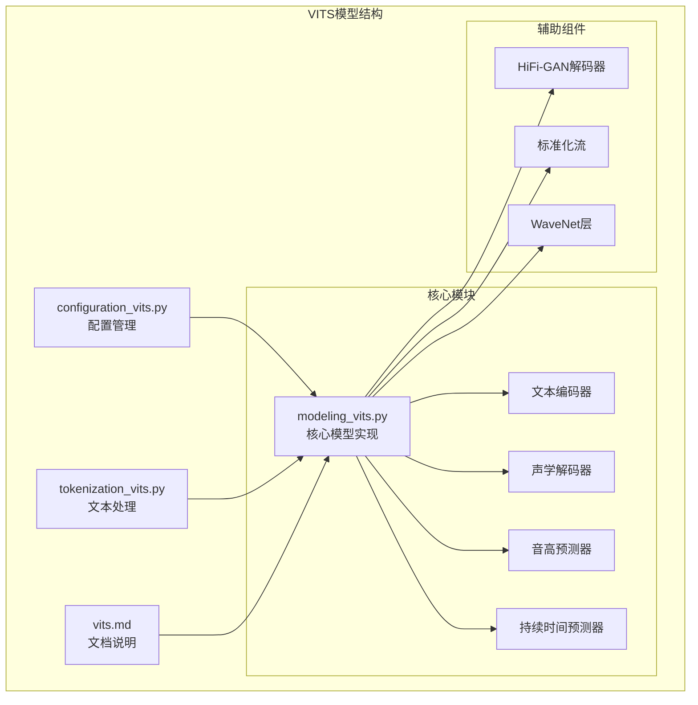
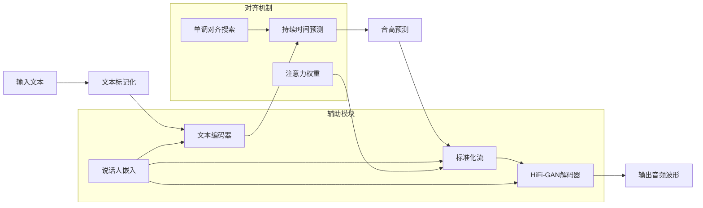
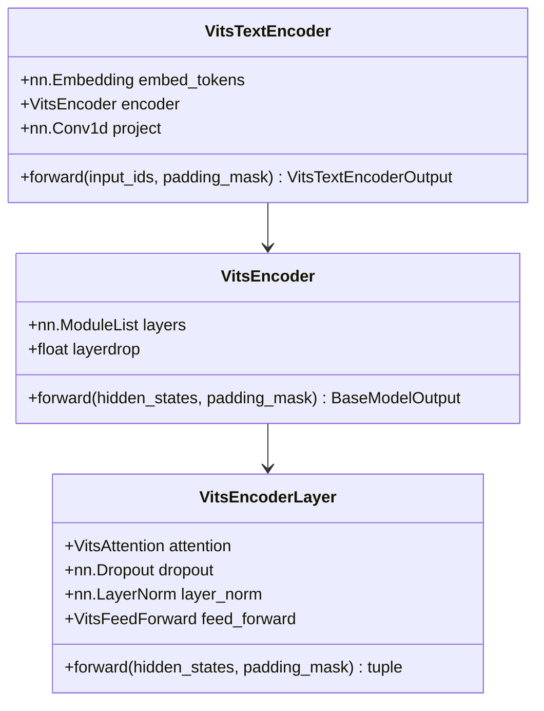
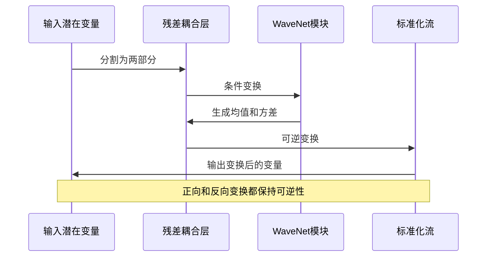
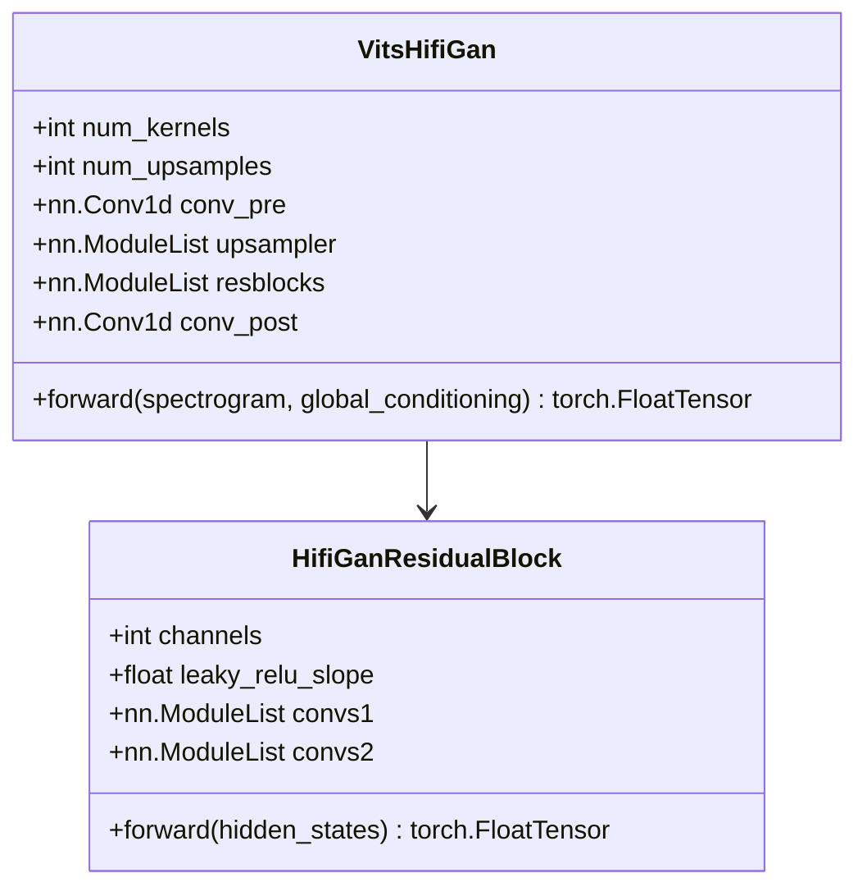
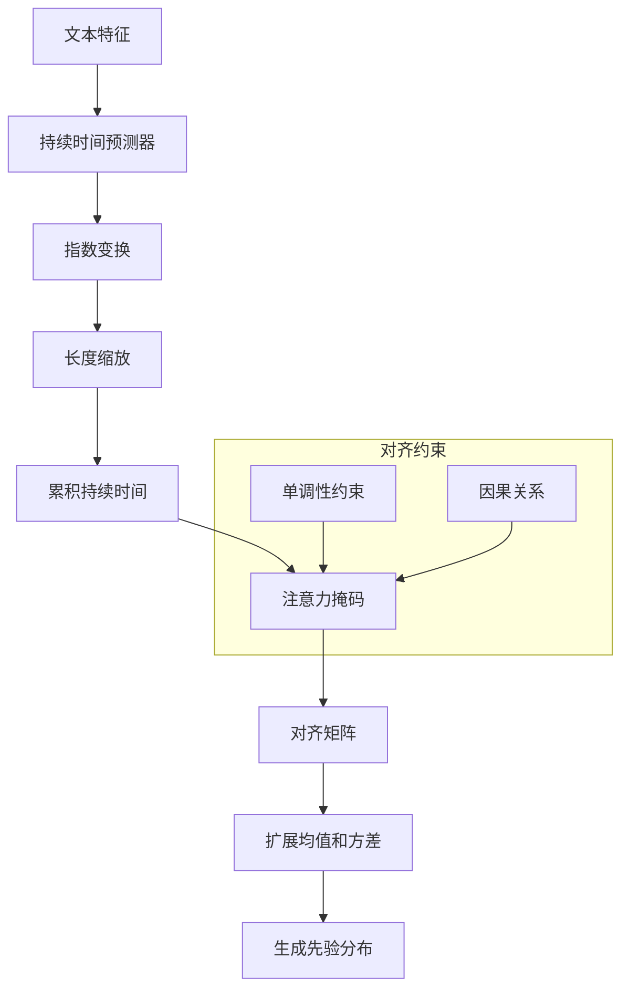
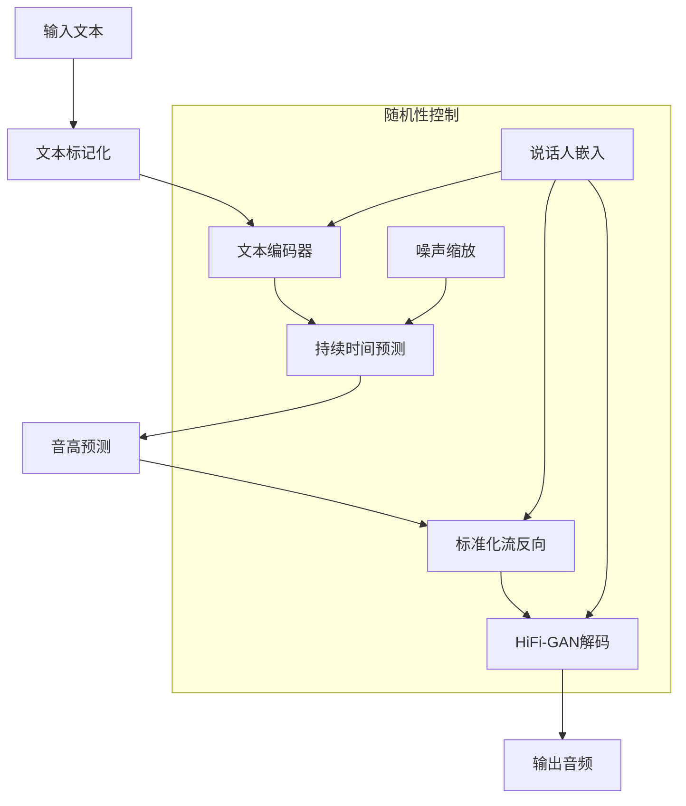
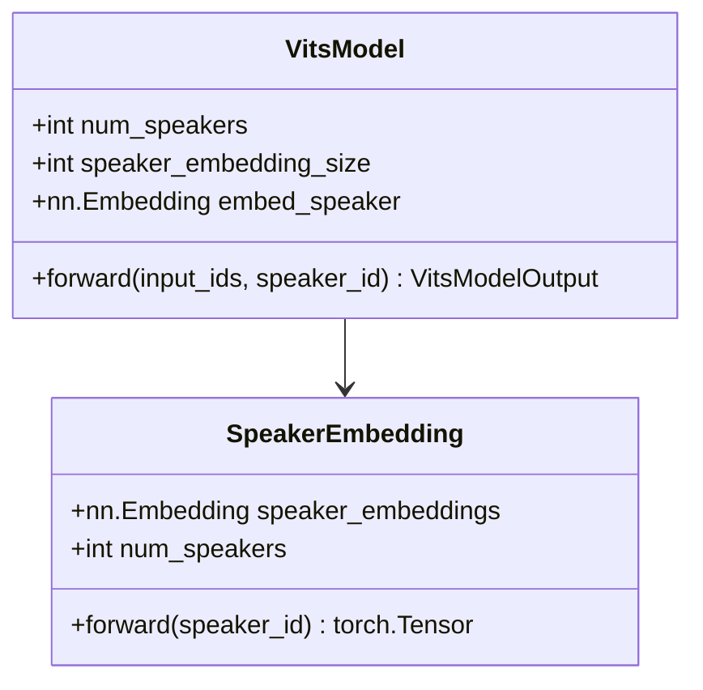

# VITS 模型详细技术文档

<cite>
**本文档引用的文件**
- [configuration_vits.py](file://src/transformers/models/vits/configuration_vits.py)
- [modeling_vits.py](file://src/transformers/models/vits/modeling_vits.py)
- [tokenization_vits.py](file://src/transformers/models/vits/tokenization_vits.py)
- [vits.md](file://docs/source/en/model_doc/vits.md)
- [test_modeling_vits.py](file://tests/models/vits/test_modeling_vits.py)
- [test_tokenization_vits.py](file://tests/models/vits/test_tokenization_vits.py)
</cite>

## 目录
1. [简介](#简介)
2. [项目结构](#项目结构)
3. [核心组件](#核心组件)
4. [架构概览](#架构概览)
5. [详细组件分析](#详细组件分析)
6. [训练与推理流程](#训练与推理流程)
7. [关键超参数分析](#关键超参数分析)
8. [多说话人支持](#多说话人支持)
9. [性能优化](#性能优化)
10. [故障排除指南](#故障排除指南)
11. [结论](#结论)

## 简介

VITS（Variational Inference with adversarial learning for end-to-end Text-to-Speech）是一种创新的端到端语音合成模型，由Meta AI于2021年提出。该模型通过结合变分自编码器、标准化流和对抗训练，实现了从文本直接生成自然流畅语音的能力。

VITS的核心创新在于：
- **端到端训练**：直接从文本生成语音，无需中间表示
- **变分推断**：使用变分自编码器学习文本的潜在表示
- **标准化流**：通过可逆变换实现高质量的语音合成
- **对抗训练**：利用判别器提高生成语音的质量
- **单调对齐搜索**：实现文本和语音之间的隐式对齐

## 项目结构

VITS模型在Hugging Face Transformers库中的组织结构如下：

**图表来源**
- [configuration_vits.py](file://src/transformers/models/vits/configuration_vits.py#L1-L50)
- [modeling_vits.py](file://src/transformers/models/vits/modeling_vits.py#L1-L100)

**章节来源**
- [configuration_vits.py](file://src/transformers/models/vits/configuration_vits.py#L1-L254)
- [modeling_vits.py](file://src/transformers/models/vits/modeling_vits.py#L1-L1399)

## 核心组件

VITS模型包含以下核心组件：

### 文本编码器（Text Encoder）
负责将输入文本转换为连续的潜在表示，使用Transformer架构并结合相对位置编码。

### 声学解码器（Acoustic Decoder）
通过标准化流将潜在表示转换为声学特征，实现可逆的语音生成过程。

### HiFi-GAN解码器
将声学特征转换为最终的音频波形，采用高效的生成对抗网络架构。

### 音高预测器（Pitch Predictor）
预测每个时间步的基频信息，控制语音的韵律特征。

### 持续时间预测器（Duration Predictor）
预测每个字符或音素对应的语音持续时间，实现文本到语音的对齐。

**章节来源**
- [modeling_vits.py](file://src/transformers/models/vits/modeling_vits.py#L1200-L1399)

## 架构概览

VITS的整体架构采用流水线设计，从前向后依次处理：

**图表来源**
- [modeling_vits.py](file://src/transformers/models/vits/modeling_vits.py#L1250-L1350)

## 详细组件分析

### 文本编码器分析

文本编码器是VITS的第一阶段，负责将离散的文本标记转换为连续的潜在表示：

**图表来源**
- [modeling_vits.py](file://src/transformers/models/vits/modeling_vits.py#L1150-L1200)

#### 关键特性：
- **相对位置编码**：使用相对位置嵌入替代绝对位置编码
- **多头注意力**：支持窗口大小限制的注意力机制
- **前馈网络**：采用1D卷积的前馈结构
- **层归一化**：确保训练稳定性和收敛性

**章节来源**
- [modeling_vits.py](file://src/transformers/models/vits/modeling_vits.py#L1150-L1200)

### 标准化流分析

标准化流是VITS的核心创新，通过可逆变换实现高质量的语音合成：

**图表来源**
- [modeling_vits.py](file://src/transformers/models/vits/modeling_vits.py#L600-L700)

#### 流模块类型：
- **残差耦合层**：使用WaveNet进行条件变换
- **元素仿射变换**：简单的仿射变换
- **卷积流**：基于有理二次样条的变换

**章节来源**
- [modeling_vits.py](file://src/transformers/models/vits/modeling_vits.py#L600-L800)

### HiFi-GAN解码器分析

HiFi-GAN解码器负责将声学特征转换为高质量的音频波形：

**图表来源**
- [modeling_vits.py](file://src/transformers/models/vits/modeling_vits.py#L450-L550)

#### 解码器特点：
- **转置卷积上采样**：逐步增加时间分辨率
- **多尺度感受野**：使用不同扩张率的卷积核
- **LeakyReLU激活**：控制梯度流动和非线性
- **权重归一化**：提高训练稳定性和生成质量

**章节来源**
- [modeling_vits.py](file://src/transformers/models/vits/modeling_vits.py#L450-L550)

### 单调对齐搜索

VITS引入了单调对齐搜索机制，实现文本和语音之间的隐式对齐：

**图表来源**
- [modeling_vits.py](file://src/transformers/models/vits/modeling_vits.py#L1300-L1399)

**章节来源**
- [modeling_vits.py](file://src/transformers/models/vits/modeling_vits.py#L1300-L1399)

## 训练与推理流程

### 推理流程

VITS的推理过程遵循以下步骤：

**图表来源**
- [modeling_vits.py](file://src/transformers/models/vits/modeling_vits.py#L1250-L1350)

### 训练流程

虽然当前版本不支持训练，但VITS的训练流程包括：

1. **前向传播**：从文本生成语音
2. **后验编码器**：学习真实语音的潜在表示
3. **损失函数**：组合重构损失、KL散度和对抗损失
4. **反向传播**：更新所有模块的参数

**章节来源**
- [modeling_vits.py](file://src/transformers/models/vits/modeling_vits.py#L1250-L1399)

## 关键超参数分析

### 音频处理参数

| 参数名称 | 默认值 | 影响 |
|---------|--------|------|
| `filter_length` | 1024 | 频谱分析的窗长，影响频率分辨率 |
| `hop_length` | 256 | 帧移大小，影响时间分辨率 |
| `win_length` | 1024 | 窗函数长度，影响频谱泄漏 |
| `sampling_rate` | 16000 | 音频采样率，决定音质和计算复杂度 |

### 模型架构参数

| 参数名称 | 默认值 | 影响 |
|---------|--------|------|
| `hidden_size` | 192 | 文本编码器隐藏层维度 |
| `num_hidden_layers` | 6 | 编码器层数，影响表达能力 |
| `num_attention_heads` | 2 | 注意力头数，影响并行处理能力 |
| `flow_size` | 192 | 标准化流的维度 |

### 生成控制参数

| 参数名称 | 默认值 | 影响 |
|---------|--------|------|
| `speaking_rate` | 1.0 | 语速控制，大于1加快，小于减慢 |
| `noise_scale` | 0.667 | 随机性控制，影响语音多样性 |
| `noise_scale_duration` | 0.8 | 持续时间预测的随机性 |

**章节来源**
- [configuration_vits.py](file://src/transformers/models/vits/configuration_vits.py#L50-L200)

## 多说话人支持

VITS支持多说话人语音合成，通过说话人嵌入实现：

**图表来源**
- [modeling_vits.py](file://src/transformers/models/vits/modeling_vits.py#L1200-L1250)

### 多说话人训练策略

1. **说话人嵌入**：为每个说话人分配唯一的嵌入向量
2. **条件生成**：将说话人信息作为条件输入
3. **共享架构**：所有说话人使用相同的模型架构
4. **数据平衡**：确保各说话人的训练数据均衡

**章节来源**
- [modeling_vits.py](file://src/transformers/models/vits/modeling_vits.py#L1200-L1250)

## 性能优化

### 计算效率优化

1. **梯度检查点**：减少内存占用，允许更大的批次大小
2. **权重归一化**：加速训练收敛和稳定性
3. **混合精度**：使用FP16降低内存需求
4. **动态批处理**：根据序列长度调整批次大小

### 内存优化

1. **层丢弃**：训练时随机跳过某些层
2. **注意力掩码**：只计算有效区域的注意力
3. **流式处理**：支持长序列的流式生成

### 推理加速

1. **静态图优化**：使用JIT编译提高推理速度
2. **量化**：使用INT8量化减少计算量
3. **并行化**：利用多GPU加速生成

## 故障排除指南

### 常见问题及解决方案

#### 1. 训练不稳定

**症状**：损失震荡或发散
**原因**：学习率过高、梯度爆炸、数据不平衡
**解决方案**：
- 调整学习率调度
- 使用梯度裁剪
- 检查数据预处理

#### 2. 模式崩溃

**症状**：生成的语音质量差且重复
**原因**：对抗训练不平衡、生成器过于简单
**解决方案**：
- 平衡生成器和判别器的训练
- 增加模型容量
- 改进正则化策略

#### 3. 对齐问题

**症状**：语音与文本不匹配
**原因**：持续时间预测不准确、注意力机制失效
**解决方案**：
- 微调持续时间预测器
- 改进注意力初始化
- 增加对齐监督

#### 4. 音质问题

**症状**：生成语音听起来不自然
**原因**：HiFi-GAN解码器不足、特征提取不充分
**解决方案**：
- 提高解码器复杂度
- 增加训练数据量
- 改进特征工程

### 调试策略

1. **可视化检查**：监控注意力权重和特征分布
2. **渐进式训练**：从简单任务开始逐步增加难度
3. **对比实验**：比较不同配置的效果
4. **错误分析**：系统性地分析失败案例

**章节来源**
- [test_modeling_vits.py](file://tests/models/vits/test_modeling_vits.py#L100-L200)

## 结论

VITS代表了语音合成领域的重要突破，通过创新的架构设计实现了高质量的端到端语音合成。其主要优势包括：

1. **简化流程**：消除传统两阶段系统的复杂性
2. **高质量输出**：生成自然流畅的语音
3. **灵活控制**：支持多种语音属性的调节
4. **多语言支持**：适用于多种语言和方言
5. **易于部署**：简洁的架构便于实际应用

尽管VITS在许多方面表现出色，但仍存在一些挑战和改进空间：

- **训练成本**：需要大量高质量的语音数据
- **计算资源**：推理时需要较高的计算能力
- **个性化**：少数样本场景下的表现有待提升
- **实时性**：对于低延迟应用仍需进一步优化

未来的发展方向可能包括：
- 更高效的模型架构
- 自适应的训练策略
- 多模态融合
- 实时优化技术

VITS为语音合成技术的发展奠定了坚实的基础，其创新理念将继续推动相关领域的进步。